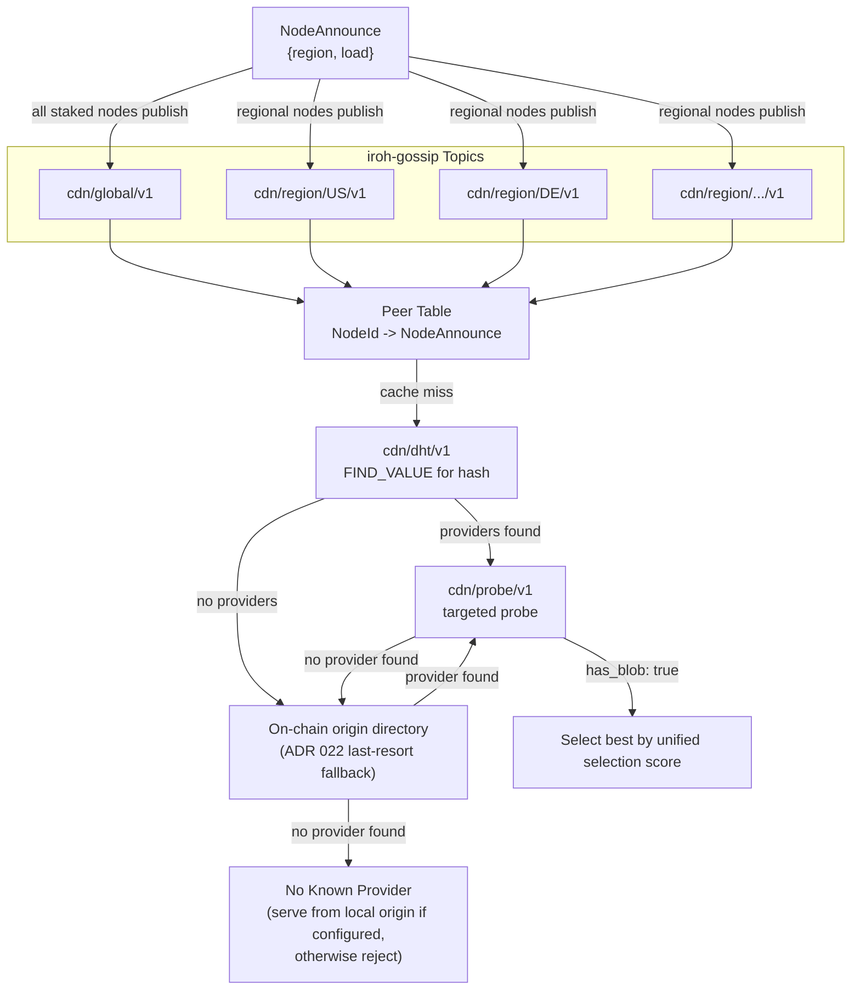

# ADR 001: Network Topology and Peer Mesh

**Date:** 2026-03-28
**Status:** Draft

## Context

The CDN has two participant roles. **Nodes** (providers) cache and serve content close to clients — some have an origin backend (S3, NFS, local disk) making them the canonical source for specific content, others are pure caches. **Clients** consume content. No external origin URL exists; the network is fully self-contained.

Two questions are in scope:

1. How do nodes discover each other and learn what content each holds?
2. How does a node resolve a cache miss?

## Decision

All staked nodes form a flat peer mesh with no fixed routing hierarchy. Node discovery is gossip-based; content discovery uses `cdn/dht/v1` (a lightweight Kademlia subset — see [ADR 022](022-content-discovery.md#adr-022--content-discovery-at-scale)), with the on-chain origin directory as the deterministic fallback when the DHT returns no providers:



### Node Discovery (Gossip)

Nodes broadcast lightweight metadata over iroh-gossip on regional topics (`cdn/region/{cc}/v1`) and a global topic (`cdn/global/v1`). Each node publishes `NodeAnnounce` messages:

```rust
struct NodeAnnounce {
    node_id: NodeId,
    region: String,              // ISO 3166-1 alpha-2 (self-reported)
    load: LoadHint,              // approximate current utilization
    timestamp_us: u64,           // microseconds since epoch
    signature: Signature,        // node's iroh key signs all fields above
}

struct LoadHint {
    active_streams: u32,         // current concurrent delivery streams
    bandwidth_utilization: u8,   // 0-100 percentage of self-reported capacity
}
```

#### Schema evolution note

The struct above is a flat definition for readability. [ADR 013](013-schema-evolution.md#adr-013-schema-evolution) specifies that `NodeAnnounce` uses a `NodeAnnounceBody` (signed portion) + `signature` + optional extensions pattern with two-phase deserialization, enabling unsigned fields to be appended via minor evolution without an ALPN bump. See [ADR 013 — Signed Field Freezing](013-schema-evolution.md#signed-field-freezing) for the canonical struct layout.

`LoadHint` is advisory and untrusted. The reputation system ([ADR 008](008-reputation.md#adr-008-reputation-system)) penalizes nodes whose observed delivery performance contradicts their advertised load.

- **`NodeAnnounce` carries node-level metadata only** — no content inventory and no demand signals. Content discovery and demand are derived from DHT FIND_VALUE traffic and local cache-miss timestamps (see Prefetch Triggers below). Message size is ~150 bytes.
- **`LoadHint`** makes the "approximate load in gossip announcements" from [ADR 008, Tie-Breaking](008-reputation.md#9-tie-breaking) concrete, feeding tie-breaking logic.
- **Announce interval** is a per-node configuration parameter (PoC default 60 seconds). This interval directly governs gossip bandwidth — see [Gossip Bandwidth Analysis](#gossip-bandwidth-analysis) below.

Both clients and nodes maintain a **peer table** (`NodeId → NodeAnnounce`) built from received gossip messages. This table tracks which nodes exist and their metadata — it does not track content. Peer-table lifecycle (TTL, registry-driven eviction, reputation independence) is documented in [appendix-peer-table-eviction.md](appendix-peer-table-eviction.md#appendix-peer-table-eviction-policy).

#### Registry cache

Nodes maintain a local cache of the on-chain registry, kept fresh by subscribing to `NodeRegistered`, `NodeDeregistered`, and `NodeAutoEjected` events; sub-second L2 block times keep the staleness window small. The cache is checked during gossip validation (below) and before initiating paid pulls (see Content Discovery step 5). On `NodeDeregistered` and `NodeAutoEjected`, the cache also removes the corresponding peer-table entry — see [appendix-peer-table-eviction.md](appendix-peer-table-eviction.md#appendix-peer-table-eviction-policy).

#### Gossip validation

Gossip messages arrive wrapped in a `GossipEnvelope` ([ADR 013](013-schema-evolution.md#adr-013-schema-evolution)). The receiver deserializes the envelope first; messages with unknown envelope versions or unknown payload variants are silently dropped. The rules below apply to the inner payload after unwrapping. Before accepting a `NodeAnnounce` and updating the peer table, a node verifies: (1) the `signature` is valid for the `node_id`'s public key over the signed body fields (serialized via postcard, consistent with [ADR 005](005-protocol.md#adr-005-wire-protocol) and [ADR 013](013-schema-evolution.md#adr-013-schema-evolution)); (2) the `node_id` corresponds to an active staked node in the on-chain registry (checked against a local registry cache); (3) `timestamp_us` is within ±60 seconds of the receiver's local clock (prevents replay of old messages; the 60-second window accommodates clock skew between nodes — see Clock synchronization below); (4) `timestamp_us` is strictly greater than the `timestamp_us` of the existing peer table entry for the same `node_id` (monotonic — prevents replay of older messages within the freshness window). Messages failing any check are silently dropped. Additionally: (5) `region` is exactly 2 ASCII uppercase letters matching a known ISO 3166-1 alpha-2 code set. Messages with invalid region values are dropped. This prevents unregistered, unstaked, or replayed nodes from appearing in or corrupting peer tables.

**Gossip deduplication:** iroh-gossip uses PlumTree (epidemic broadcast trees), which performs message-level deduplication internally — each message is assigned a unique identifier and nodes track a bounded in-memory set of seen message IDs, so the same message arriving via multiple paths is delivered to the application at most once while its ID remains in that seen-set. This is not a global or persistent exactly-once guarantee: duplicates may be re-delivered after seen-set eviction or process restart. This transport-layer dedup is the primary mechanism preventing redundant processing of `NodeAnnounce` in a multi-path topology. As defense-in-depth, gossip validation rule (4) (monotonic `timestamp_us` per `node_id`) independently rejects any duplicate or older `NodeAnnounce` — even if transport-level dedup were bypassed (e.g., after a restart), a replayed message fails the strictly-greater timestamp check against the peer table. The peer table itself (`NodeId → NodeAnnounce`), keyed by `node_id` with only the latest timestamp retained, is inherently convergent regardless of delivery order or multiplicity. No application-level seen-message set or content-hash table is required at the gossip layer. See also [ADR 008, Section 6](008-reputation.md#6-gossip-protocol) for deduplication of `ReputationReport` messages on the `cdn/reputation/v1` topic.

#### Clock synchronization

The ±60-second freshness check in gossip validation (3) is evaluated against the receiver's local clock. A process whose wall-clock offset exceeds 60 seconds relative to well-synchronized peers will both (a) have its own `NodeAnnounce` messages silently rejected by those peers and (b) silently reject otherwise-valid `NodeAnnounce` from correctly synchronized peers — in either case making peers invisible in the local mesh view, with no error feedback. All processes that perform gossip validation and maintain a peer table (staked nodes and any validating clients) MUST run NTP (or an equivalent time-synchronization service) to maintain wall-clock accuracy well within this 60-second window. At startup, such a process SHOULD query an NTP server and log a warning if the measured offset exceeds 10 seconds.

**Observability:** Nodes SHOULD expose a `gossip_messages_rejected_clock_skew` counter (Prometheus metric). Additionally, a node SHOULD periodically compare its own `NodeAnnounce` timestamp against timestamps in received `NodeAnnounce` messages from peers to detect relative drift. If median peer timestamps diverge from the local clock by more than 30 seconds, the node logs a warning.

### Content Discovery (DHT + Probe)

Content discovery uses `cdn/dht/v1` as the primary mechanism (see [ADR 022](022-content-discovery.md#adr-022--content-discovery-at-scale)). `cdn/probe/v1` is used **after** the DHT lookup to confirm live availability and measure latency. When a node or client needs blob H:

1. **Probe cache check.** Look up `hash` in a short-lived LRU cache (`hash → Vec<(NodeId, rate_per_mb, rtt, ProbeResponse)>`, TTL 15 seconds, max 1024 entries). Each hash entry retains at most 10 responses (top 10 by selection score); each entry retains the full signed `ProbeResponse` for slashing evidence. Approximate memory: 1,024 entries × 10 responses × ~200 bytes ≈ 2 MB. If a valid entry exists, skip to step 5.
2. **DHT FIND_VALUE.** Issue an iterative O(log N) `FindValueRequest` for H via `cdn/dht/v1` (see [ADR 022 §1.6](022-content-discovery.md#adr-022--content-discovery-at-scale)). Returns a `Vec<NodeId>` of known holders. The DHT bootstraps from `StakingRegistry.getActiveNodes()` — a node's first peers come from the on-chain registry and immediately participate in DHT lookups, so there is no separate bootstrap window.
3. **Probe the DHT candidate set.** Send `ProbeRequest {hash, timestamp_us}` in parallel to the NodeIds returned by the DHT. ALPN: `cdn/probe/v1` — `ProbeResponse {has_blob, rate_per_mb, timestamp_us, total_bytes?, slash_sig}`. If DHT returned no providers, fall back to the on-chain origin directory ([ADR 022 § Origin discovery](022-content-discovery.md#adr-022--content-discovery-at-scale)): resolve namespaces via `PublisherRegistry.namespaceOf(hash)` and union the operator-address sets via `OriginAssignment.getOrigins(namespaceId)` for each, then probe those NodeIds.
4. **Collect.** Wait for probe responses in two phases:
   - **Phase 1 — Minimum wait** (`probe_min_wait`, default 50ms): Always wait this long to let multiple candidates respond.
   - **Phase 2 — Extended wait with optional early exit** (`probe_max_wait`, default 500ms): Exit early when **both** conditions are met: (a) at least `min_probe_responses` (default: 3) `has_blob: true` responses, and (b) best selection score is below `early_exit_score_threshold` (default: `1.5 × rolling_median_score`). Rolling median from last 100 successful pull scores, seeded with `0` (early exit disabled until history exists). If not met, wait up to 500ms. The 500ms ceiling accommodates inter-continental RTTs (e.g., London↔Sydney ~250–300ms).

   Store all `has_blob: true` responses in the probe cache.

   **Early-exit rationale:** For popular content on nearby nodes, early exit reduces P50 cache-miss latency from ~500ms to ~50–100ms; distant but cheaper or more reputable nodes still win when nearby responses score poorly. **PoC defaults:** all four parameters operator-configurable; setting `probe_min_wait = probe_max_wait` disables early exit.
5. **Select.** Pick the best provider using the unified node selection score (see below).
6. **Registry check.** Verify the selected node's `node_id` is still active in the local registry cache. If not, skip to the next-best provider.
7. **Pull.** Open `cdn/client/v1` stream and pull.

On probe cache hit, if the selected provider no longer has the blob (evicted — rare with eviction holds), try the next-best cached provider. If all fail, run a fresh DHT lookup + probe. **Observability:** Track `EvictedSinceProbe` response rate; sustained >1% may indicate eviction hold failures ([ADR 005](005-protocol.md#probe-triggered-eviction-hold)).

**Probe cache TTL is 15 seconds** — half the 30-second slashing evidence window from [ADR 005](005-protocol.md#adr-005-wire-protocol).

#### Eviction hold interaction

Probe cache TTL (15s) < `probe_hold_duration` (35s), so any cached probe response used for a stream is within both the slashing window and the eviction hold period.

#### Probe rate limits

- **Outbound:** 3 probe batches per second per node (each batch targets the DHT-returned candidate set, typically 3–5 NodeIds). Excess cache misses queue.
- **Inbound:** 5 probe requests per peer per second (token bucket). Excess probes silently dropped.

### Gossip Bandwidth Analysis

All gossip bandwidth scales O(N²) across the network (each of N nodes publishes to N−1 receivers); per-node cost scales O(N), linear in network size. The `NodeAnnounce` interval is the dominant variable.

**Assumptions:** PlumTree delivers each unique message to each subscriber once. `NodeAnnounce` worst case is 800 bytes. `ReputationReport` is ~200 bytes (2×NodeId + ReportMetrics + timestamp + signature + framing). Egress ≈ ingress (PlumTree tree-forwarding).

#### NodeAnnounce (`cdn/global/v1`, 60-second interval)

Per-node ingress: `(N−1) × 800 bytes × (3600 / interval_s)` per hour.

| Nodes | Messages/node/hr | Ingress/node/hr | Sustained rate |
| --- | --- | --- | --- |
| 30 (PoC) | 1,740 | ~1.4 MB | ~3 Kbps |
| 100 | 5,940 | ~4.8 MB | ~11 Kbps |
| 500 | 29,940 | ~24.0 MB | ~53 Kbps |
| 1,000 | 59,940 | ~48.0 MB | ~107 Kbps |

Regional topics (`cdn/region/{cc}/v1`) add per-region bandwidth but do not reduce global topic traffic — all staked nodes publish to and subscribe to `cdn/global/v1`.

#### ReputationReport (`cdn/reputation/v1`, production only)

Per [ADR 008](008-reputation.md#adr-008-reputation-system) rate limits: max 10 reports per reporter per hour, max 1 per (reporter, target) pair per hour. Worst case: all N nodes send 10 reports/hr, each delivered to N−1 subscribers.

| Nodes | Reports received/node/hr | Ingress/node/hr |
| --- | --- | --- |
| 100 | ~1,000 | ~0.2 MB |
| 500 | ~5,000 | ~1.0 MB |
| 1,000 | ~10,000 | ~2.0 MB |

The strict rate limits (Section 11 of [ADR 008](008-reputation.md#adr-008-reputation-system)) keep reputation gossip modest vs. `NodeAnnounce`.

#### Combined per-node budget (60-second announce interval)

| Nodes | NodeAnnounce | ReputationReport | Combined/node/hr | Sustained rate | ed25519 verify/s |
| --- | --- | --- | --- | --- | --- |
| 30 (PoC) | ~1.4 MB | ~0.0 MB | ~1.4 MB | ~3 Kbps | <1 |
| 100 | ~4.8 MB | ~0.2 MB | ~5.0 MB | ~11 Kbps | ~2 |
| 500 | ~24.0 MB | ~1.0 MB | ~25.0 MB | ~56 Kbps | ~10 |
| 1,000 | ~48.0 MB | ~2.0 MB | ~50.0 MB | ~112 Kbps | ~19 |

**CPU cost:** Modern hardware handles ~50,000–100,000 ed25519 verifications/sec/core. At 1,000 nodes, ~19 verify/sec is negligible — CPU is not the gossip bottleneck.

#### Scale thresholds

| Scale | Gossip overhead | Recommended action |
| --- | --- | --- |
| ≤200 nodes | <10 MB/node/hr (~22 Kbps) | No action needed |
| 200–500 nodes | ~25 MB/node/hr (~56 Kbps) | Monitor bandwidth metrics; consider increasing interval to 120s if constrained |
| 500–1,000 nodes | ~50 MB/node/hr (~111 Kbps) | Evaluate selective gossip (regional-only subscription for non-global nodes) |
| >1,000 nodes | Scales linearly (~50 KB/node/hr per additional node) | Structured overlay (DHT) or gossip partitioning required — see [ADR 022](022-content-discovery.md#adr-022--content-discovery-at-scale) |

**PoC (tens of nodes) is well within safe bounds.** At 30 nodes with a 60-second interval, gossip consumes ~3 Kbps per node — negligible. This analysis is a production planning exercise; the PoC validates the bandwidth model empirically.

### Node Selection Algorithm

The unified selection score combines price, latency, and reputation into a single comparable value:

```
selection_score = rate_per_mb × rtt_ms × (1 / max(reputation, 0.1)²)
```

Lower is better. Reputation is clamped to a minimum of 0.1 to prevent division by zero ([ADR 008](008-reputation.md#adr-008-reputation-system) allows a floor of 0.0, but a node at 0.0 reputation is effectively unusable). The `reputation²` term amplifies reputation: a node at 0.5 (neutral) is 4× more expensive in score terms than a node at 1.0 (perfect):

| Reputation | Score multiplier (vs. rep=1.0) |
| --- | --- |
| 1.0 | 1.0× |
| 0.8 | 1.56× |
| 0.5 | 4.0× |
| 0.3 | 11.1× |
| 0.1 | 100× |

For new nodes with the initial reputation of 0.5 ([ADR 008](008-reputation.md#adr-008-reputation-system)), the 4× multiplier means they must be ~4× cheaper or faster to compete with established nodes — a bootstrap barrier softened by the cold-start bonus in [ADR 008](008-reputation.md#adr-008-reputation-system).

**Inputs:** `rate_per_mb` and `rtt_ms` come from `ProbeResponse` (see [ADR 005](005-protocol.md#adr-005-wire-protocol)). `reputation` is the node's `final_score` from [ADR 008](008-reputation.md#adr-008-reputation-system) — local observations (70%) + network gossip (30%).

#### Minimum-reputation rejection floor

The `max(reputation, 0.1)` clamp above only bounds the *score denominator* — it caps the worst-case multiplier at 100×, but a sufficiently cheap and close node can still produce the lowest score and win selection despite a poor reputation. Independently of that clamp, a client MAY configure a hard **minimum-reputation floor**: candidates whose `reputation` is below the floor are removed from the candidate pool *before* scoring, so price and RTT can never override a sub-floor reputation. The boundary is inclusive (a node exactly at the floor is retained); a `NaN` reputation is rejected whenever the floor is active (any comparison with `NaN` is false).

The floor defaults to `0.0`, which disables filtering and preserves the pre-floor ranking behavior exactly (including the defensive negative-reputation clamp). Per-client configuration wiring is deferred until the client fetch path that consumes the selection algorithm exists; the floor is currently exposed as a selection-API parameter.

#### Tie-breaking

(scores within 1% of each other): see [ADR 008, Tie-Breaking](008-reputation.md#9-tie-breaking).

This score is used in Content Discovery step 4 above and in all other node selection contexts. The simpler `rate_per_mb × rtt_ms` product is the price×latency component; the full selection algorithm adds reputation weighting as shown above.

#### Prefetching from Local Demand

Each node tracks cache miss timestamps per hash in a bounded map (`HashMap<Hash, VecDeque<u64>>`, max 10,000 entries, LRU eviction). Each miss appends a timestamp (refreshing the entry's LRU position); entries older than 5 minutes are pruned on access. When a hash crosses a configurable threshold (default: 3 misses in 5 minutes), the node proactively pulls the blob via DHT FIND_VALUE → probe → `cdn/client/v1` path (see [ADR 022](022-content-discovery.md#adr-022--content-discovery-at-scale)).

The signal feeds the same action as a regular cache miss: DHT FIND_VALUE → probe → select provider → pull via `cdn/client/v1` (paid). PoC uses a conservative (high) threshold.

- **DHT-primary discovery (all scales).** `cdn/dht/v1` is the primary content discovery mechanism from PoC onward. At PoC scale (30 nodes), FIND_VALUE resolves in 1–2 hops. A DHT miss followed by an empty on-chain origin-directory lookup definitively means no registered node holds the blob. See [ADR 022](022-content-discovery.md#adr-022--content-discovery-at-scale) for the full discovery flow.

On a cache miss, a node checks its probe cache or performs a DHT FIND_VALUE lookup + probe (see Content Discovery above), selects the best provider by the unified node selection score, and pulls via `cdn/client/v1` (paid) — the same protocol used for client→node delivery, since every byte transferred is paid. Origin-backed nodes typically charge more (reflecting backend egress costs) and set the effective price ceiling; cache-only nodes that have the blob compete at lower rates.

Node identity is the iroh `NodeId` (ed25519 public key). All staked nodes register in an on-chain registry mapping `NodeId → QUIC multiaddrs + Ethereum address`. Clients query this registry on first startup to find initial peers.

### Registry Unavailability

If the on-chain registry (or RPC endpoint) is unavailable at startup, the client retries with exponential backoff: 3 attempts at 1s, 5s, and 30s intervals. If all retries fail:

- **Returning client (has cached peer list):** Falls back to the peer list from the last successful registry query, stored in a local file (`~/.decdn/peers.json`). Stale entries are tolerable — probes will fail for deregistered nodes, and gossip will update the peer table once connected.
- **First-ever startup (no cache):** Fails with an actionable error: `"Cannot reach registry at {rpc_url}. Check network connectivity and RPC endpoint configuration."` No hardcoded peer list is shipped — the on-chain registry is the single source of truth for PoC.

The client refreshes its cached peer list on every successful registry query (on startup and every 10 minutes while running).

This schedule is tuned for PoC with a single RPC endpoint. Production deployments SHOULD configure a reliable RPC endpoint; the retry schedule is a last resort, not a primary reliability mechanism.

## Consequences

### Positive

- No external infrastructure is reachable — origin-backed nodes completely hide their backends, so no client or node can bypass the payment layer via a direct storage URL
- All nodes share the same discovery and transport protocols. The cache-only role remains permissionless — any staked operator may pull cached blobs from authorized origins and re-serve them. The origin role is DAO-governed for all content. Registered namespaces use a per-namespace `OriginAssignment` set; unregistered content uses the DAO-maintained default-open allow-list (`OriginAssignment` keyed by `namespaceId == 0`). A permissive bootstrap window applies to default-open serving until the allow-list is first activated. See [ADR 011 § Origin Assignment Authority](011-content-takedown.md#origin-assignment-authority), [ADR 011 § Default-open allow-list](011-content-takedown.md#default-open-allow-list), and [ADR 002 § Publisher Identity and Namespaces](002-content-addressing.md#publisher-identity-and-namespaces)
- Gossip messages are lightweight (~800 bytes) — no content inventories, Bloom filters, or hash lists. At the PoC default 60-second interval, per-node bandwidth is ~3 Kbps at 30 nodes, scaling linearly to ~111 Kbps at 1,000 nodes (see [Gossip Bandwidth Analysis](#gossip-bandwidth-analysis)). Regional topics speed regional delivery but do not reduce global topic bandwidth
- Content discovery via `cdn/dht/v1` provides targeted O(log N) provider lookup; probe confirms live availability. No stale content inventory to maintain — stale DHT records self-expire within TTL (1 hour)
- Probe cache prevents redundant probe batches for popular content within a 15-second window
- Once a node in a region caches a blob, other regional nodes pull from it at competitive rates rather than origin-backed prices — popular content gets cheaper as it spreads
- The flat mesh is simple to reason about and easy to test at small scale (PoC is tens of nodes)
- NodeId squatting is prevented by on-chain ed25519 ownership proof — an attacker cannot register a NodeId they do not control, and a legitimate owner can reclaim a squatted NodeId

### Negative

- Cold cache miss adds up to 500ms latency (probe maximum wait) vs. a pre-built content index lookup; mitigated by probe cache for repeated lookups within 15 seconds and by adaptive early exit (see Collect step above), which reduces P50 latency to ~50-100ms once the node has sufficient score history
- Probe cache introduces a brief staleness window (up to 15s) where a node may pull from a provider that has evicted the blob; mitigated by the probe-triggered eviction hold ([ADR 005](005-protocol.md#probe-triggered-eviction-hold)), with fallback to the next cached provider, then a fresh DHT lookup + probe
- Self-reported region hints (ISO 3166-1 alpha-2) are unverified; a node could misreport its region to appear in more gossip topics. Mitigation: clients apply a reputation penalty when observed latency contradicts the claimed region (e.g., RTT > 150ms to a node in the same claimed region). Cryptographic hardening via an IP-geolocation oracle or third-party attestation was considered and rejected — see [ADR 030](030-node-region-self-attestation.md#adr-030-node-region-self-attestation); the latency-based signal is the canonical mitigation.
- Every transfer is paid, so nodes pulling on cache miss incur a cost recouped through subsequent client deliveries — a natural economic barrier to speculative caching
- Origin-backed nodes are the last line of defense for availability — if all authorized origins for a blob go offline or are deregistered, the content becomes permanently unavailable (unless cached elsewhere). For registered namespaces, the `OriginAssignment` minimum-redundancy invariant ([ADR 009](009-governance.md#adr-009-governance-model), [ADR 011 § Origin Assignment Authority](011-content-takedown.md#origin-assignment-authority)) ensures activated assignments always include at least the configured floor (default 3) of authorized origins. For default-open content (`namespaceId == 0`), the DAO-maintained default-open allow-list ([ADR 011 § Default-open allow-list](011-content-takedown.md#default-open-allow-list)) enforces its own redundancy floor (default 10) — materially higher than the registered floor because one approved operator may serve any default-open hash. During the bootstrap window before the allow-list is first activated, the prior permissive behaviour applies: any staked operator may serve as origin and the failure mode is total loss of every operator that ever cached the blob.
- `registerNode` gas cost increases ~4–7× due to on-chain ed25519 signature verification (~650k–1.15M gas vs. ~150k without); acceptable as a one-time cost per node lifetime

## Contract Interface: Node Registry

The node registry is part of the `StakingRegistry` contract, not a separate contract. Staking is a prerequisite for registration ([ADR 026 §7](026-gauge-boost-tokenomics.md#7-operator-economics-and-minimum-stake)), so co-locating them avoids cross-contract calls and simplifies the atomic stake-then-register flow.

### Data Structure

```solidity
struct NodeInfo {
    bytes32 nodeId;              // iroh NodeId (ed25519 public key, 32 bytes)
    address ethAddress;          // Ethereum address for payment channels
    bytes   multiaddrs;          // packed QUIC multiaddrs (length-prefixed entries)
    string  regionHint;          // ISO 3166-1 alpha-2 code (self-reported, unverified)
    uint256 registeredAt;        // block.timestamp of current registration
    uint256 firstRegisteredAt;   // block.timestamp of first-ever registration (immutable once set)
    uint256 lastMultiaddrUpdate; // block.timestamp of last multiaddr change
    bool    active;              // false after deregistration or auto-ejection
}
```

`multiaddrs` uses `bytes` rather than `string[]` for gas efficiency: a packed array of `(uint16 length, bytes data)` entries, parsed off-chain by clients. Maximum encoded size is bounded by the governable `maxMultiaddrSize` parameter (initial value 1024 bytes; safety bounds 64–1024 bytes per [ADR 009](009-governance.md#adr-009-governance-model)).

### Interface (additions to StakingRegistry)

```solidity
// --- Node Registry ---

// Registration (requires active stake >= minStake)
function registerNode(
    bytes32 nodeId,
    bytes calldata multiaddrs,
    string calldata regionHint,
    bytes calldata bindingSignature,
    bytes calldata ed25519Signature   // proves caller controls nodeId's ed25519 private key
) external;

function updateMultiaddrs(bytes calldata multiaddrs) external;

function deregisterNode() external;

// NodeId reclaim (production — legitimate owner reclaims a squatted NodeId)
function reclaimNodeId(
    bytes32 nodeId,
    bytes calldata ed25519Signature
) external;

// Views
function getNode(bytes32 nodeId) external view returns (NodeInfo memory);
function getNodeByAddress(address ethAddress) external view returns (NodeInfo memory);
function isActiveNode(bytes32 nodeId) external view returns (bool);
function getActiveNodeCount() external view returns (uint256);
function getActiveNodes(uint256 offset, uint256 limit)
    external view returns (NodeInfo[] memory);
function getFirstRegisteredAt(address ethAddress) external view returns (uint256);

// State — per-nodeId nonce for ed25519 registration replay protection
mapping(bytes32 => uint64) public registrationNonce;

// Events
event NodeRegistered(
    bytes32 indexed nodeId,
    address indexed ethAddress,
    bytes multiaddrs,
    string regionHint,
    uint64 bindingNonce,
    uint64 registrationNonce
);
event NodeMultiaddrUpdated(bytes32 indexed nodeId, bytes multiaddrs);
event NodeDeregistered(bytes32 indexed nodeId);
event NodeAutoEjected(bytes32 indexed nodeId, uint256 remainingStake);
event NodeIdReclaimed(bytes32 indexed nodeId, address indexed previousOwner);
```

`registerNode` emits both `NodeRegistered` and `NodeIdBound` ([ADR 003](003-payments.md#adr-003-payment-model)) — the latter ensures off-chain indexers tracking the authoritative `nodeIdToAddress` mapping see initial registrations alongside rebindings.

### Constraints

- **One-to-one mapping.** Each `nodeId` maps to exactly one `ethAddress` and vice versa. Enforced with `require(nodeByAddress[msg.sender].nodeId == bytes32(0))` and `require(nodes[nodeId].ethAddress == address(0))`, where `bytes32(0)` is the sentinel for "unregistered". This enforces a one-stake-position-per-node invariant.
- **`registerNode` rejects `nodeId == bytes32(0)`** (reserved as the unregistered sentinel). It binds `msg.sender` to `nodeId` — the caller's Ethereum address becomes `ethAddress`. This binding is on-chain and permanent until deregistration, distinct from the ephemeral per-session `NodeId`-to-address binding in [ADR 003](003-payments.md#adr-003-payment-model) for clients. The function performs two signature verifications: (1) the `bindingSignature` parameter is an EIP-712 signature over `BindNodeId(nodeId, bindingNonce[msg.sender])` (see [ADR 003](003-payments.md#adr-003-payment-model)); `registerNode` verifies this against the caller's current `bindingNonce`, then atomically writes the `nodeIdToAddress`/`addressToNodeId` mappings and increments `bindingNonce[msg.sender]`. (2) The `ed25519Signature` parameter proves ownership of the NodeId's ed25519 private key — see [NodeId Ownership Verification](#nodeid-ownership-verification) below. The shared per-address `bindingNonce` counter with `bindNodeId` ensures replay protection across both registration and rebinding. Every registered node is immediately slashable — there is no window in which a node is active in the mesh without a verifiable binding. The separate `StakingRegistry.bindNodeId()` function in [ADR 003](003-payments.md#adr-003-payment-model) remains available for rebinding (key rotation) after initial registration.
- **`deregisterNode` triggers unbonding.** Sets `active = false`, starts the current unbonding period (default 7 days, minimum 3 days per [ADR 009](009-governance.md#adr-009-governance-model)), and increments `registrationNonce[nodeId]` to invalidate any previously issued ed25519 registration signatures for this NodeId. Stake remains slashable during unbonding to prevent slash-then-run.
- **Auto-ejection.** When slashing drops a node's stake below 50% of the minimum stake requirement ([ADR 026 §8](026-gauge-boost-tokenomics.md#8-slashing-and-burn)), the contract sets `active = false` and emits `NodeAutoEjected`. The node must re-stake at full minimum to rejoin.
- **`firstRegisteredAt` is write-once.** `registerNode` sets `firstRegisteredAt = block.timestamp` only if the stored value is 0 (first-ever registration for this address). On re-registration after deregistration or auto-ejection it retains its original value; it is never cleared by `deregisterNode` or auto-ejection. Used by clients to determine cold-start bootstrap eligibility ([ADR 008](008-reputation.md#10-cold-start-bootstrap)).

### Multiaddr Update Policy

A governable cooldown (0–86400 seconds, see [ADR 009](009-governance.md#adr-009-governance-model)) prevents a compromised node key from rapidly flipping multiaddrs to redirect traffic. The default is 0 (disabled) — `updateMultiaddrs` costs ~$0.03 per call at typical L2 gas prices, so a small mesh updating occasionally (IP change, port rotation) needs no rate limiting. Governance tightens the cooldown if abuse is seen.

### Gas Costs

| Operation | Estimated Gas | Estimated Cost |
| --- | --- | --- |
| `registerNode()` | ~650k–1.15M gas | ~$0.26–$0.46 |
| `updateMultiaddrs()` | ~60k gas | ~$0.03 |
| `deregisterNode()` | ~80k gas | ~$0.05 |
| `reclaimNodeId()` | ~600k–1.1M gas | ~$0.24–$0.44 |

`registerNode` and `reclaimNodeId` include ~500k–1M gas for on-chain ed25519 signature verification (Solidity library) — a one-time cost per node lifetime, negligible vs. the minimum stake deposit. Estimates assume typical multiaddr sizes (2–4 addresses, ~200 bytes total); larger payloads increase storage gas proportionally.

### Client Query Patterns

Three tiers, from simplest to most scalable:

1. **View functions (PoC).** `getActiveNodes(offset, limit)` with pagination. For tens of nodes, a single call with `limit = 100` returns the full node set. Clients call this on first startup to bootstrap their peer list, then rely on gossip for ongoing discovery (see Decision section above).

2. **Event logs (PoC + production).** Clients index `NodeRegistered`, `NodeMultiaddrUpdated`, `NodeDeregistered`, and `NodeAutoEjected` events (indexed by `nodeId`) to maintain a local cache. More efficient than repeated view calls for larger node sets.

3. **Subgraph (future production).** A Graph Protocol subgraph indexing registry events for complex queries (nodes by region, active node count over time, churn analysis). Not in PoC scope.

### NodeId Ownership Verification

`registerNode` requires an ed25519 signature proving the caller controls the private key corresponding to `nodeId`. Without this proof, an attacker could front-run legitimate registrations by calling `registerNode` with someone else's NodeId — the attacker gains no traffic (cannot complete iroh QUIC handshakes with that identity), but under the one-to-one uniqueness constraint the legitimate owner is permanently blocked from registering. Even with the ed25519 verification overhead, the total `registerNode` cost (~$0.26–$0.46 gas + recoverable minimum stake) is low enough that squatting remains a cheap griefing/DoS vector without the ownership proof.

**Note:** The `bindingSignature` parameter proves the caller's Ethereum key signed the NodeId binding — it does not prove ownership of the ed25519 NodeId itself. These are orthogonal concerns: `bindingSignature` prevents un-slashable registration (required in both PoC and production), while ed25519 ownership verification prevents NodeId squatting.

#### Signed message

The `ed25519Signature` parameter is an ed25519 signature over:

```
ed25519_sign(private_key, keccak256(abi.encodePacked(nodeId, msg.sender, block.chainid, registrationNonce[nodeId])))
```

Where `registrationNonce` is a per-`nodeId` counter (distinct from the per-address `bindingNonce` used for EIP-712 binding), incremented by `deregisterNode` on each deregistration. The nonce prevents replay of old signatures after a node deregisters and a different address attempts to re-register the same `nodeId`. The `block.chainid` binding prevents cross-chain signature replay.

#### On-chain verification

EVM has no native ed25519 precompile, and the RIP-7212 proposal is not yet deployed on the production L2 (see [Appendix: L2 Deployment](appendix-l2-deployment.md#appendix-production-l2-deployment-target) for chain and rollout status). The implementation uses a well-audited Solidity ed25519 verification library (e.g., `ed25519-sol`). This adds ~500k–1M gas to `registerNode`, a one-time cost per node lifetime — see [gas cost table](#gas-costs) and the rationale in [ADR 014 §1](014-on-chain-verification.md#1-slash-signatures--secp256k1-eip-712) for why the secp256k1 `slash_sig` scheme used for routine slash evidence is not needed here.

#### Reclaim flow

If a NodeId was squatted (e.g., during a transition period or via a contract bug), the legitimate ed25519 key holder calls `reclaimNodeId(nodeId, ed25519Signature)`. This verifies the ed25519 signature over `keccak256(abi.encodePacked(nodeId, msg.sender, block.chainid, registrationNonce[nodeId]))`, forcibly deregisters the current holder (triggering their unbonding period and incrementing `registrationNonce`), clears the NodeId-to-address mappings, and emits `NodeIdReclaimed`. The caller can then call `registerNode` under their own address. Reclaim does not require the caller to have stake — it only proves ed25519 key ownership and clears the squatter's binding. `reclaimNodeId` is the sole reclaim mechanism in both PoC and production: there is no admin override. Reclaim authority is gated entirely by ed25519 wire-key ownership (the iroh NodeId private key), distinct from the secp256k1 on-chain signatures used for slash evidence ([ADR 014](014-on-chain-verification.md#adr-014-on-chain-verification-for-slashing-evidence)) and EIP-712 NodeId↔Ethereum binding ([ADR 003](003-payments.md#adr-003-payment-model)).
