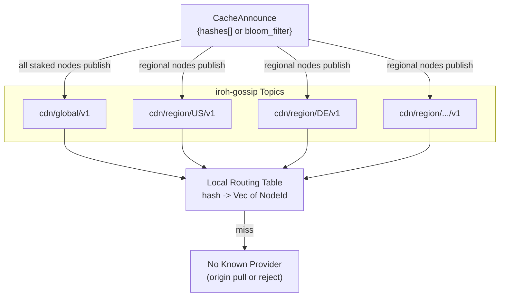

# ADR 001: Network Topology and Peer Mesh

**Date:** 2026-03-28
**Status:** Draft

## Context

The CDN has two participant roles. **Nodes** (providers) cache and serve content close to clients — some are configured with an origin backend (S3, NFS, local disk) making them the canonical source for specific content, while others are pure caches. **Clients** consume content. No external origin URL exists; the network is fully self-contained.

Two questions are in scope:

1. How do nodes discover each other and learn what content each holds?
2. How does a node resolve a cache miss?

## Decision

All staked nodes form a flat peer mesh with no fixed routing hierarchy. Content discovery is gossip-based:



- **iroh-gossip** for ongoing content state broadcast. Nodes publish `CacheAnnounce` messages on regional topics (`cdn/region/{cc}/v1`) and a global topic (`cdn/global/v1`). Origin-backed nodes announce all content they hold; pure-cache nodes announce their current cache. Each announcement lists blob hashes (capped at 500 entries) or a Bloom filter for large sets. Both clients and nodes maintain a local routing table (`hash → Vec<NodeId>`) built from received announcements. The routing table does not distinguish between origin-backed and cache-only nodes — the probe step determines which is cheaper and faster.

- **PoC scale: gossip-only discovery.** At tens of nodes, every node receives every `CacheAnnounce` on the global topic, so the local routing table has near-complete coverage of network-wide content. A routing table miss means no node currently holds the requested blob — the requesting node returns an error to the client (or, if it is itself origin-backed for that content, serves from its own origin store). A content-addressed DHT is deferred to production scale (see Future Work below).

On a cache miss, a node probes candidates from its routing table, selects the best by `rate_per_mb × rtt_ms`, and pulls via `cdn/client/v1` (paid). This is the same protocol used for client→node delivery — every byte transferred in the network is paid. Origin-backed nodes typically charge more (reflecting their backend egress costs) and set the effective price ceiling. Cache-only nodes that have the blob compete at lower rates.

Node identity is the iroh `NodeId` (ed25519 public key). All staked nodes register in an on-chain registry mapping `NodeId → QUIC multiaddrs + Ethereum address`. Clients query this registry on first startup to find initial peers.

## Consequences

**Positive:**

- No external infrastructure is reachable from the network — origin-backed nodes completely hide their backends, so no client or node can bypass the payment layer by going directly to a storage URL
- All nodes participate in the same discovery and transport protocols; the only difference between origin-backed and cache-only nodes is whether they have an origin store configured
- Regional gossip topics bound message volume: nodes in one region don't receive announcements from irrelevant regions
- Once a node in a region caches a blob, other nodes in that region can pull from it at competitive rates rather than paying origin-backed node prices — popular content gets cheaper as it spreads
- The flat mesh is simple to reason about and easy to test at small scale (PoC is tens of nodes)

**Negative:**

- Gossip consistency is eventual — a node that evicts or loses content may still appear in routing tables until the next `CacheAnnounce` cycle; clients and nodes must handle stale entries by falling back to the next candidate
- Bloom filter announcements (for large caches) introduce false positives: a probe to a node that turns out not to have the blob wastes a round-trip
- Every transfer is paid, so nodes pulling content on cache miss incur a cost that must be recouped through subsequent client deliveries; this creates a natural economic barrier to speculative caching
- Self-reported region hints (ISO 3166-1 alpha-2) are unverified; a node could misreport its region to appear in more gossip topics
- Origin-backed nodes become the last line of defence for content availability — if all origin-backed nodes for a given blob go offline or are deregistered, the content becomes permanently unavailable (unless cached elsewhere). Content owners are responsible for origin node uptime.

### Future Work: Content-Addressed DHT

At production scale (hundreds or thousands of nodes), gossip alone may not guarantee complete routing table coverage — topic partitioning, message volume, and churn can cause gaps. A content-addressed DHT layer (Kademlia or similar) publishing `(hash → Vec<NodeId>)` records over iroh QUIC would restore the fallback lookup path shown in the PoC diagram as "No Known Provider."

Key considerations for a production DHT:

- **iroh's built-in mainline DHT** (`discovery-pkarr-dht` feature) resolves `EndpointId → address` for node discovery only — it does not support arbitrary content-hash lookups. A separate content DHT overlay would be required.
- **iroh's native discovery services** (DNS/pkarr for node resolution) should be evaluated for production bootstrap alongside the on-chain registry, potentially reducing reliance on the `StakingRegistry.getActiveNodes()` view function.
- **No existing Rust Kademlia library** integrates directly with iroh's QUIC transport; `libp2p-kad` uses libp2p's transport layer and cannot be used without an adapter. Implementation options include a custom Kademlia layer over iroh QUIC streams or an ALPN-identified DHT protocol.
- **State storage** (in-memory vs. on-disk) and **TTL policy** for DHT records are deferred to the production design phase.

---

## Contract Interface: Node Registry

The node registry is part of the `StakingRegistry` contract — not a separate contract. Staking is a prerequisite for registration ([ADR 004](004-tokenomics.md)), so co-locating them avoids cross-contract calls and simplifies the atomic stake-then-register flow.

### Data Structure

```solidity
struct NodeInfo {
    bytes32 nodeId;              // iroh NodeId (ed25519 public key, 32 bytes)
    address ethAddress;          // Ethereum address for payment channels
    bytes   multiaddrs;          // packed QUIC multiaddrs (length-prefixed entries)
    string  regionHint;          // ISO 3166-1 alpha-2 code (self-reported, unverified)
    uint256 registeredAt;        // block.timestamp of initial registration
    uint256 lastMultiaddrUpdate; // block.timestamp of last multiaddr change
    bool    active;              // false after deregistration or auto-ejection
}
```

`multiaddrs` uses `bytes` rather than `string[]` for gas efficiency. The encoding is a packed array of `(uint16 length, bytes data)` entries. Clients parse this off-chain. Maximum encoded size is bounded by the governable `maxMultiaddrSize` parameter (initial value 1024 bytes; safety bounds 64–1024 bytes per [ADR 009](009-governance.md)).

### Interface (additions to StakingRegistry)

```solidity
// --- Node Registry ---

// Registration (requires active stake >= minStake)
function registerNode(
    bytes32 nodeId,
    bytes calldata multiaddrs,
    string calldata regionHint
) external;

function updateMultiaddrs(bytes calldata multiaddrs) external;

function deregisterNode() external;

// Views
function getNode(bytes32 nodeId) external view returns (NodeInfo memory);
function getNodeByAddress(address ethAddress) external view returns (NodeInfo memory);
function isActiveNode(bytes32 nodeId) external view returns (bool);
function getActiveNodeCount() external view returns (uint256);
function getActiveNodes(uint256 offset, uint256 limit)
    external view returns (NodeInfo[] memory);

// Events
event NodeRegistered(
    bytes32 indexed nodeId,
    address indexed ethAddress,
    bytes multiaddrs,
    string regionHint
);
event NodeMultiaddrUpdated(bytes32 indexed nodeId, bytes multiaddrs);
event NodeDeregistered(bytes32 indexed nodeId);
event NodeAutoEjected(bytes32 indexed nodeId, uint256 remainingStake);
```

### Constraints

- **One-to-one mapping.** Each `nodeId` maps to exactly one `ethAddress` and vice versa. Enforced with `require(nodeByAddress[msg.sender].nodeId == bytes32(0))` and `require(nodes[nodeId].ethAddress == address(0))`, where `bytes32(0)` is the sentinel for "unregistered". This aligns with [ADR 004](004-tokenomics.md): "Max stake registrations per node: 1."
- **`registerNode` rejects `nodeId == bytes32(0)`**, since this value is reserved as the unregistered sentinel. It binds `msg.sender` to `nodeId` — the caller's Ethereum address becomes `ethAddress`. This binding is on-chain and permanent until deregistration, distinct from the ephemeral per-session `NodeId`-to-address binding described in ADR 003 for clients.
- **`deregisterNode` triggers unbonding.** Sets `active = false` and starts the current unbonding period (default 7 days, minimum 3 days per [ADR 009](009-governance.md)). Stake remains slashable during unbonding to prevent slash-then-run.
- **Auto-ejection.** When slashing drops a node's stake below 50% of the minimum stake requirement ([ADR 004](004-tokenomics.md)), the contract sets `active = false` and emits `NodeAutoEjected`. The node must re-stake at full minimum to rejoin.

### Multiaddr Update Policy

**PoC:** No cooldown. On Arbitrum Sepolia, `updateMultiaddrs` costs approximately $0.03 per call. For tens of nodes updating occasionally (IP change, port rotation), no rate limiting is needed.

**Production:** A governable cooldown (0–86400 seconds, see [ADR 009](009-governance.md)) prevents a compromised node key from rapidly flipping multiaddrs to redirect traffic. The default is 0 (disabled) — governance can tighten this if abuse is observed.

### Gas Costs

| Operation | Estimated Gas | Cost at ~$0.05/tx |
| --- | --- | --- |
| `registerNode()` | ~120k gas | ~$0.05 |
| `updateMultiaddrs()` | ~60k gas | ~$0.03 |
| `deregisterNode()` | ~80k gas | ~$0.05 |

These estimates assume typical multiaddr sizes (2–4 addresses, ~200 bytes total). Larger multiaddr payloads increase storage gas proportionally.

### Client Query Patterns

Three tiers, from simplest to most scalable:

1. **View functions (PoC).** `getActiveNodes(offset, limit)` with pagination. For tens of nodes, a single call with `limit = 100` returns the full node set. Clients call this on first startup to bootstrap their peer list, then rely on gossip for ongoing discovery (see Decision section above).

2. **Event logs (PoC + production).** Clients index `NodeRegistered`, `NodeMultiaddrUpdated`, `NodeDeregistered`, and `NodeAutoEjected` events to maintain a local cache. Events are indexed by `nodeId` for efficient filtering. More efficient than repeated view calls for larger node sets.

3. **Subgraph (future production).** A Graph Protocol subgraph indexing registry events for complex queries (nodes by region, active node count over time, churn analysis). Not in PoC scope.

### NodeId Ownership Verification

**PoC simplification:** On-chain ed25519 verification is skipped. A node registering someone else's `nodeId` gains nothing in terms of traffic — it cannot complete iroh QUIC handshakes with that identity, so no client or peer will connect to it. However, under the one-to-one uniqueness constraint, a malicious first registration for a given `nodeId` blocks the legitimate owner from registering (a cheap griefing/DoS). In the PoC this risk is accepted: the deployment is small and permissioned, and misregistrations are detectable off-chain and resolvable via admin intervention.

**Production hardening:** `registerNode` should require a signature proving the caller controls the ed25519 private key corresponding to `nodeId`: `ed25519_sign(private_key, keccak256(abi.encodePacked(nodeId, msg.sender, block.chainid, registrationNonce)))`, where `registrationNonce` is a per-`nodeId` counter incremented on each deregistration. The nonce prevents replay of old signatures after a node deregisters and a different address attempts to re-register the same `nodeId`. Verification uses an ed25519 precompile (where available) or a well-audited ed25519 verification library; the concrete mechanism is chain-specific and deferred to implementation. This proof also enables a reclaim flow — the legitimate `nodeId` owner can rebind to a new address, closing the griefing gap described above.
