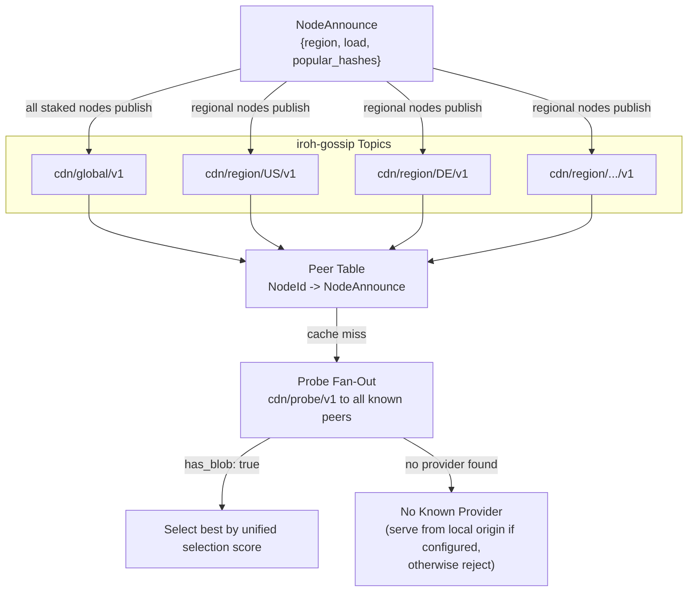

# ADR 001: Network Topology and Peer Mesh

**Date:** 2026-03-28
**Status:** Draft

## Context

The CDN has two participant roles. **Nodes** (providers) cache and serve content close to clients — some are configured with an origin backend (S3, NFS, local disk) making them the canonical source for specific content, while others are pure caches. **Clients** consume content. No external origin URL exists; the network is fully self-contained.

Two questions are in scope:

1. How do nodes discover each other and learn what content each holds?
2. How does a node resolve a cache miss?

## Decision

All staked nodes form a flat peer mesh with no fixed routing hierarchy. Node discovery is gossip-based; content discovery is probe-based:



#### Node Discovery (Gossip)

Nodes broadcast lightweight metadata over iroh-gossip on regional topics (`cdn/region/{cc}/v1`) and a global topic (`cdn/global/v1`). Each node publishes `NodeAnnounce` messages:

```rust
struct NodeAnnounce {
    node_id: NodeId,
    region: String,              // ISO 3166-1 alpha-2 (self-reported)
    load: LoadHint,              // approximate current utilization
    popular_hashes: Vec<Hash>,   // top-N most-requested hashes (max 20)
    timestamp_us: u64,           // microseconds since epoch
    signature: Signature,        // node's iroh key signs all fields above
}

struct LoadHint {
    active_streams: u32,         // current concurrent delivery streams
    bandwidth_utilization: u8,   // 0-100 percentage of self-reported capacity
}
```

- **`NodeAnnounce` carries node-level metadata only** — no content inventory. `popular_hashes` (capped at 20) is a popularity signal for prefetching, not a content catalog. Message size is ~700 bytes worst case.
- **`LoadHint`** makes the "approximate load in gossip announcements" from [ADR 008, Tie-Breaking](008-reputation.md#9-tie-breaking) concrete, feeding tie-breaking logic.
- **Announce interval** is a per-node configuration parameter (PoC default TBD during implementation).

Both clients and nodes maintain a **peer table** (`NodeId → NodeAnnounce`) built from received gossip messages. This table tracks which nodes exist and their metadata — it does not track content.

**Registry cache:** Nodes maintain a local cache of the on-chain registry, kept fresh by subscribing to `NodeRegistered`, `NodeDeregistered`, and `NodeAutoEjected` events. On Arbitrum Sepolia (PoC), block times are ~250ms, so the staleness window is small. The registry cache is checked during gossip validation (below) and before initiating paid pulls (see Content Discovery step 5).

**Gossip validation:** Before accepting a `NodeAnnounce` and updating the peer table, a node verifies: (1) the `signature` is valid for the `node_id`'s public key over all other fields (serialized via postcard, consistent with [ADR 005](005-protocol.md)); (2) the `node_id` corresponds to an active staked node in the on-chain registry (checked against a local registry cache); (3) `timestamp_us` is within ±60 seconds of the receiver's local clock (prevents replay of old messages; the 60-second window accommodates clock skew between nodes — see Clock synchronization below); (4) `timestamp_us` is strictly greater than the `timestamp_us` of the existing peer table entry for the same `node_id` (monotonic — prevents replay of older messages within the freshness window). Messages failing any check are silently dropped. This prevents unregistered, unstaked, or replayed nodes from appearing in or corrupting peer tables.

**Clock synchronization:** The ±60-second freshness check in gossip validation (3) is evaluated against the receiver's local clock. A process whose wall-clock offset exceeds 60 seconds relative to well-synchronized peers will both (a) have its own `NodeAnnounce` messages silently rejected by those peers and (b) silently reject otherwise-valid `NodeAnnounce` messages from correctly synchronized peers — in either case making peers invisible in the local mesh view, with no error feedback. All processes that perform gossip validation and maintain a peer table (staked nodes and any validating clients) MUST run NTP (or an equivalent time-synchronization service) to maintain wall-clock accuracy well within this 60-second window. At startup, such a process SHOULD query an NTP server and log a warning if the measured offset exceeds 10 seconds, giving operators an early signal before silent gossip rejection occurs.

#### Content Discovery (Probe Fan-Out)

Content discovery is on-demand via the existing `cdn/probe/v1` protocol. When a node or client needs a blob, it probes known peers in parallel:

1. **Probe cache check.** Look up `hash` in a short-lived LRU cache (`hash → Vec<(NodeId, rate_per_mb, rtt, ProbeResponse)>`, TTL 15 seconds, max 1024 entries). Each entry retains the full signed `ProbeResponse` for slashing evidence. If a valid entry exists, skip to step 4.
2. **Fan-out.** Send `ProbeRequest {hash, timestamp_us}` in parallel to all known nodes (regional + global). The `cdn/probe/v1` protocol is unchanged — `ProbeResponse {has_blob, rate_per_mb, timestamp_us, signature}`.
3. **Collect.** Wait for probe responses in two phases:
   - **Phase 1 — Minimum wait** (`probe_min_wait`, default 50ms): Always wait at least this long to collect responses from nearby nodes, ensuring multiple candidates compete rather than always selecting the single fastest responder.
   - **Phase 2 — Extended wait with optional early exit** (`probe_max_wait`, default 500ms): After `probe_min_wait`, continue waiting for additional responses, but exit early when **both** conditions are met: (a) at least `min_probe_responses` (default: 3) `has_blob: true` responses have been received, and (b) the best selection score among collected responses is below `early_exit_score_threshold` (default: `1.5 × rolling_median_score`). The rolling median is computed from the node's last 100 successful pull scores (bounded circular buffer, seeded with `0` so early exit is disabled until the node has enough history — since all real scores are positive, no score can be below `1.5 × 0 = 0`). If the early-exit condition is not met, wait up to `probe_max_wait` (500ms). The 500ms ceiling accommodates inter-continental RTTs (e.g., London↔Sydney ~250-300ms) to avoid creating geographical bottlenecks where only nearby nodes are ever selected.

   Store all `has_blob: true` responses received (whether collection ended early or at `probe_max_wait`) in the probe cache.

   **Early-exit rationale:** In the common case — popular content cached on multiple nearby nodes — early exit reduces P50 cache-miss latency from ~500ms to ~50-100ms while preserving fairness. Distant but cheap or reputable nodes still win when nearby responses are expensive, because the score formula already incorporates price and reputation; early exit only triggers when the available options are genuinely good relative to the node's historical experience. The full 500ms path remains the fallback for cold starts (no score history), sparse networks, or unpopular content where few nodes respond quickly.

   **PoC defaults:** `probe_min_wait = 50ms`, `min_probe_responses = 3`, `probe_max_wait = 500ms`, `early_exit_score_threshold = 1.5 × rolling_median_score`. All four parameters are operator-configurable. Setting `probe_min_wait = probe_max_wait` disables early exit entirely (equivalent to the previous fixed-wait behavior). **Production tuning:** operators should consider increasing `min_probe_responses` to account for higher network jitter and larger peer counts. The `early_exit_score_threshold` multiplier directly controls the latency/peer-quality trade-off — a higher multiplier favors speed, a lower one ensures better peer selection.
4. **Select.** Pick the best provider using the unified node selection score (see below).
5. **Registry check.** Before opening a `cdn/client/v1` stream, verify the selected node's `node_id` is still active in the local registry cache. If not (ejected or deregistered since the probe), skip to the next-best provider. This bounds the risk of paying a node whose stake has been depleted — the maximum exposure without this check is 1 MB × `rate_per_mb` (one voucher granularity) before BLAKE3 verification detects bad data.
6. **Pull.** Open `cdn/client/v1` stream and pull.

On probe cache hit, if the selected provider no longer has the blob (evicted since the cached probe — which should be rare with probe-triggered eviction holds; see below), the node tries the next-best cached provider. If all cached providers fail or no cache entries remain, the node falls back to a fresh fan-out. **Observability:** Nodes SHOULD track the rate of post-probe eviction failures (`EvictedSinceProbe` responses from remote nodes). As a rough heuristic, a sustained rate above ~1% of cache-hit attempts may indicate remote nodes are experiencing hold mechanism failures (implementation bugs or resource exhaustion) — an undersized `max_probe_holds` budget would cause `has_blob: false` at probe time rather than post-probe failures, so this metric reflects hold violations, not budget configuration.

**Probe cache TTL is 15 seconds** — half the 30-second slashing evidence window from ADR 005. This guarantees any cached probe response used for a paid pull is still within the slashable window with margin to spare, without requiring a confirmation probe.

**Eviction hold interaction.** The probe cache TTL (15 seconds) is shorter than `probe_hold_duration` (currently 35 seconds — see [ADR 005](005-protocol.md#probe-triggered-eviction-hold)). This means a cached probe response used for a stream request is always within both the slashing window and the eviction hold period. The hold guarantees the blob remains in the remote node's cache for at least `probe_hold_duration` after the `ProbeResponse` was signed, so the fallback path above (trying the next-best cached provider) should be rare under normal operation.

**Probe rate limits** prevent bursty cache misses from flooding the network:
- **Outbound:** Each node limits itself to 10 probe fan-outs per second. Excess cache misses queue. At PoC scale (30 peers), this means a maximum of 300 outbound probes/s — well within capacity.
- **Inbound:** Each node accepts at most 20 probe requests per peer per second (token bucket). Excess probes are silently dropped. This protects individual nodes from being overwhelmed by a single aggressive prober.

### Node Selection Algorithm

The unified selection score combines price, latency, and reputation into a single comparable value:

```
selection_score = rate_per_mb × rtt_ms × (1 / max(reputation, 0.1)²)
```

Lower is better. Reputation is clamped to a minimum of 0.1 to prevent division by zero (ADR 008 allows a floor of 0.0, but a node at 0.0 reputation is effectively unusable). The `reputation²` term amplifies the effect of reputation: a node with reputation 0.5 (neutral) is 4× more expensive in score terms than a node with reputation 1.0 (perfect). This means:

| Reputation | Score multiplier (vs. rep=1.0) |
| --- | --- |
| 1.0 | 1.0× |
| 0.8 | 1.56× |
| 0.5 | 4.0× |
| 0.3 | 11.1× |
| 0.1 | 100× |

For new nodes with the initial reputation of 0.5 ([ADR 008](008-reputation.md)), the 4× multiplier means they must be ~4× cheaper or faster to compete with established nodes — a reasonable bootstrap barrier softened by the cold-start bonus in ADR 008.

**Inputs:** `rate_per_mb` and `rtt_ms` come from `ProbeResponse` (see [ADR 005](005-protocol.md)). `reputation` is the node's `final_score` from [ADR 008](008-reputation.md) — local observations (70%) + network gossip (30%).

**Tie-breaking** (scores within 1% of each other): see [ADR 008, Tie-Breaking](008-reputation.md#9-tie-breaking).

This score is used in Content Discovery step 4 above and in all other node selection contexts. The simpler `rate_per_mb × rtt_ms` product is the price×latency component; the full selection algorithm adds reputation weighting as shown above.

#### Prefetching with Dual Signals

Two complementary signals drive proactive caching:

**Local demand signal:** Each node tracks cache miss timestamps per hash in a bounded map (`HashMap<Hash, VecDeque<u64>>`, max 10,000 entries, LRU eviction). Each miss appends a timestamp; entries older than 5 minutes are pruned on access. When a hash crosses a configurable threshold (default: 3 misses in 5 minutes), the node proactively pulls the blob via the same probe fan-out → `cdn/client/v1` path.

**Network popularity signal:** Nodes observe which hashes appear in `popular_hashes` across multiple `NodeAnnounce` messages from different peers. A hash appearing in N peers' top-20 lists suggests cross-region demand. Tracked by storing the announcing peer's NodeId and announcement timestamp for each hash; entries older than the window are pruned on access. Threshold is configurable (default: seen in 3+ peers' popular lists within 10 minutes).

Both signals feed the same action: probe fan-out → select provider → pull via `cdn/client/v1` (paid). PoC implements both signals with conservative (high) network popularity thresholds.

- **PoC scale: probe fan-out discovery.** At tens of nodes, every probe fan-out reaches all peers, so content discovery has complete coverage. A probe fan-out miss (no `has_blob: true` responses) means no node in the network holds the blob. If the requesting node is itself origin-backed for that content, it serves from its own origin store; otherwise it returns an error to the client. At production scale, probe fan-out can be bounded via selective fan-out or a content-addressed DHT (see [Future Work: Scaling Content Discovery](#future-work-scaling-content-discovery) below).

On a cache miss, a node checks its probe cache or performs a probe fan-out (see Content Discovery above), selects the best provider by the unified node selection score, and pulls via `cdn/client/v1` (paid). This is the same protocol used for client→node delivery — every byte transferred in the network is paid. Origin-backed nodes typically charge more (reflecting their backend egress costs) and set the effective price ceiling. Cache-only nodes that have the blob compete at lower rates.

Node identity is the iroh `NodeId` (ed25519 public key). All staked nodes register in an on-chain registry mapping `NodeId → QUIC multiaddrs + Ethereum address`. Clients query this registry on first startup to find initial peers.

### Registry Unavailability

If the on-chain registry (or RPC endpoint) is unavailable at startup, the client retries with exponential backoff: 3 attempts at 1s, 5s, and 30s intervals. If all retries fail:

- **Returning client (has cached peer list):** Falls back to the peer list from the last successful registry query, stored in a local file (`~/.decdn/peers.json`). Stale entries are tolerable — probes will fail for deregistered nodes, and gossip will update the peer table once connected.
- **First-ever startup (no cache):** Fails with an actionable error: `"Cannot reach registry at {rpc_url}. Check network connectivity and RPC endpoint configuration."` No hardcoded peer list is shipped — the on-chain registry is the single source of truth for PoC.

The client refreshes its cached peer list on every successful registry query (on startup and periodically every 10 minutes while running).

## Consequences

**Positive:**

- No external infrastructure is reachable from the network — origin-backed nodes completely hide their backends, so no client or node can bypass the payment layer by going directly to a storage URL
- All nodes participate in the same discovery and transport protocols; the only difference between origin-backed and cache-only nodes is whether they have an origin store configured
- Gossip messages are lightweight (~700 bytes) — no content inventories, Bloom filters, or hash lists. Regional gossip topics bound message volume: nodes in one region don't receive announcements from irrelevant regions
- Content discovery via probe fan-out provides fresh availability data — no stale content inventory to maintain
- Probe cache prevents redundant fan-outs for popular content within a 15-second window
- Once a node in a region caches a blob, other nodes in that region can pull from it at competitive rates rather than paying origin-backed node prices — popular content gets cheaper as it spreads
- The flat mesh is simple to reason about and easy to test at small scale (PoC is tens of nodes)

**Negative:**

- Probe fan-out generates O(N) probe messages per cache miss. Rate limits (see above) prevent bursty cache misses from becoming a self-DoS; at production scale, fan-out must be bounded (DHT or selective fan-out)
- Cold cache miss adds up to 500ms latency (probe maximum wait) compared to a pre-built content index lookup; mitigated by probe cache for repeated lookups within 15 seconds and by adaptive early exit (see Collect step above) which reduces P50 latency to ~50-100ms once the node has sufficient score history
- Probe cache introduces a brief staleness window (up to 15s) where a node may attempt to pull from a provider that has evicted the blob; mitigated by the probe-triggered eviction hold ([ADR 005](005-protocol.md#probe-triggered-eviction-hold)), with fallback to the next cached provider, then a fresh fan-out
- `popular_hashes` in `NodeAnnounce` explicitly gossips which blobs are in high demand — a new, compactly gossiped signal distinct from content availability (which is now only probe-discoverable)
- Self-reported region hints (ISO 3166-1 alpha-2) are unverified; a node could misreport its region to appear in more gossip topics. **PoC mitigation:** region misreporting is detectable via latency — a node claiming "US" but responding with 200ms RTT from a US client is suspicious. Clients apply a reputation penalty when observed latency contradicts the claimed region (e.g., RTT > 150ms to a node in the same claimed region). **Production:** IP-geolocation verification via a decentralized oracle or third-party attestation service is deferred to production. The PoC accepts the residual risk that a small number of nodes may misreport regions
- Every transfer is paid, so nodes pulling content on cache miss incur a cost that must be recouped through subsequent client deliveries; this creates a natural economic barrier to speculative caching
- Origin-backed nodes become the last line of defence for content availability — if all origin-backed nodes for a given blob go offline or are deregistered, the content becomes permanently unavailable (unless cached elsewhere). Content owners are responsible for origin node uptime.

### Future Work: Scaling Content Discovery

At production scale (hundreds or thousands of nodes), broadcast probe fan-out becomes expensive — O(N) probes per cache miss. Three scaling strategies, in order of complexity:

1. **Selective fan-out:** Probe only regional peers + a random subset of global peers. Reduces probe count while maintaining discovery probability. No protocol changes.

2. **Content-addressed DHT:** A Kademlia overlay publishing `(hash → Vec<NodeId>)` records over iroh QUIC. Targeted O(log N) lookups replace O(N) fan-out. The probe protocol remains unchanged — DHT narrows the candidate set, probes confirm and measure.
   - iroh's built-in mainline DHT (pkarr/`DhtDiscovery`) resolves `NodeId → address` for node discovery only — it does not support arbitrary content-hash lookups. A separate content DHT overlay would be required.
   - iroh's native discovery services (DNS/pkarr) resolve `NodeId → address` without on-chain lookups and should be evaluated for production address resolution, complementing the on-chain registry which remains the authoritative source for enumerating active staked nodes.
   - As of March 2026, no existing Rust Kademlia library integrates directly with iroh's QUIC transport; implementation options include a custom Kademlia layer over iroh QUIC streams or an ALPN-identified DHT protocol.
   - State storage (in-memory vs. on-disk) and TTL policy for DHT records are deferred to the production design phase.

3. **Gossip-based content hints:** Nodes that frequently serve certain content can advertise content "categories" or prefix ranges in `NodeAnnounce`, enabling smarter probe targeting without a full DHT.

These are additive — the probe-based content discovery mechanism doesn't change, only the strategy for selecting who to probe.

---

## Contract Interface: Node Registry

The node registry is part of the `StakingRegistry` contract — not a separate contract. Staking is a prerequisite for registration ([ADR 004](004-tokenomics.md)), so co-locating them avoids cross-contract calls and simplifies the atomic stake-then-register flow.

### Data Structure

```solidity
struct NodeInfo {
    bytes32 nodeId;              // iroh NodeId (ed25519 public key, 32 bytes)
    address ethAddress;          // Ethereum address for payment channels
    bytes   multiaddrs;          // packed QUIC multiaddrs (length-prefixed entries)
    string  regionHint;          // ISO 3166-1 alpha-2 code (self-reported, unverified)
    uint256 registeredAt;        // block.timestamp of initial registration
    uint256 lastMultiaddrUpdate; // block.timestamp of last multiaddr change
    bool    active;              // false after deregistration or auto-ejection
}
```

`multiaddrs` uses `bytes` rather than `string[]` for gas efficiency. The encoding is a packed array of `(uint16 length, bytes data)` entries. Clients parse this off-chain. Maximum encoded size is bounded by the governable `maxMultiaddrSize` parameter (initial value 1024 bytes; safety bounds 64–1024 bytes per [ADR 009](009-governance.md)).

### Interface (additions to StakingRegistry)

```solidity
// --- Node Registry ---

// Registration (requires active stake >= minStake)
function registerNode(
    bytes32 nodeId,
    bytes calldata multiaddrs,
    string calldata regionHint
) external;

function updateMultiaddrs(bytes calldata multiaddrs) external;

function deregisterNode() external;

// Views
function getNode(bytes32 nodeId) external view returns (NodeInfo memory);
function getNodeByAddress(address ethAddress) external view returns (NodeInfo memory);
function isActiveNode(bytes32 nodeId) external view returns (bool);
function getActiveNodeCount() external view returns (uint256);
function getActiveNodes(uint256 offset, uint256 limit)
    external view returns (NodeInfo[] memory);

// Events
event NodeRegistered(
    bytes32 indexed nodeId,
    address indexed ethAddress,
    bytes multiaddrs,
    string regionHint
);
event NodeMultiaddrUpdated(bytes32 indexed nodeId, bytes multiaddrs);
event NodeDeregistered(bytes32 indexed nodeId);
event NodeAutoEjected(bytes32 indexed nodeId, uint256 remainingStake);
```

### Constraints

- **One-to-one mapping.** Each `nodeId` maps to exactly one `ethAddress` and vice versa. Enforced with `require(nodeByAddress[msg.sender].nodeId == bytes32(0))` and `require(nodes[nodeId].ethAddress == address(0))`, where `bytes32(0)` is the sentinel for "unregistered". This aligns with [ADR 004](004-tokenomics.md): "Max stake registrations per node: 1."
- **`registerNode` rejects `nodeId == bytes32(0)`**, since this value is reserved as the unregistered sentinel. It binds `msg.sender` to `nodeId` — the caller's Ethereum address becomes `ethAddress`. This binding is on-chain and permanent until deregistration, distinct from the ephemeral per-session `NodeId`-to-address binding described in ADR 003 for clients. **Note:** `registerNode` handles mesh membership (NodeId, multiaddrs, region, stake validation). The separate `StakingRegistry.bindNodeId()` function in [ADR 003](003-payments.md) establishes the cryptographic NodeId-to-Ethereum-address binding used for slash evidence and payment channel attribution. Nodes call both at registration time.
- **`deregisterNode` triggers unbonding.** Sets `active = false` and starts the current unbonding period (default 7 days, minimum 3 days per [ADR 009](009-governance.md)). Stake remains slashable during unbonding to prevent slash-then-run.
- **Auto-ejection.** When slashing drops a node's stake below 50% of the minimum stake requirement ([ADR 004](004-tokenomics.md)), the contract sets `active = false` and emits `NodeAutoEjected`. The node must re-stake at full minimum to rejoin.

### Multiaddr Update Policy

**PoC:** No cooldown. On Arbitrum Sepolia, `updateMultiaddrs` costs approximately $0.03 per call. For tens of nodes updating occasionally (IP change, port rotation), no rate limiting is needed.

**Production:** A governable cooldown (0–86400 seconds, see [ADR 009](009-governance.md)) prevents a compromised node key from rapidly flipping multiaddrs to redirect traffic. The default is 0 (disabled) — governance can tighten this if abuse is observed.

### Gas Costs

| Operation | Estimated Gas | Cost at ~$0.05/tx |
| --- | --- | --- |
| `registerNode()` | ~120k gas | ~$0.05 |
| `updateMultiaddrs()` | ~60k gas | ~$0.03 |
| `deregisterNode()` | ~80k gas | ~$0.05 |

These estimates assume typical multiaddr sizes (2–4 addresses, ~200 bytes total). Larger multiaddr payloads increase storage gas proportionally.

### Client Query Patterns

Three tiers, from simplest to most scalable:

1. **View functions (PoC).** `getActiveNodes(offset, limit)` with pagination. For tens of nodes, a single call with `limit = 100` returns the full node set. Clients call this on first startup to bootstrap their peer list, then rely on gossip for ongoing discovery (see Decision section above).

2. **Event logs (PoC + production).** Clients index `NodeRegistered`, `NodeMultiaddrUpdated`, `NodeDeregistered`, and `NodeAutoEjected` events to maintain a local cache. Events are indexed by `nodeId` for efficient filtering. More efficient than repeated view calls for larger node sets.

3. **Subgraph (future production).** A Graph Protocol subgraph indexing registry events for complex queries (nodes by region, active node count over time, churn analysis). Not in PoC scope.

### NodeId Ownership Verification

**PoC simplification:** On-chain ed25519 verification is skipped. A node registering someone else's `nodeId` gains nothing in terms of traffic — it cannot complete iroh QUIC handshakes with that identity, so no client or peer will connect to it. However, under the one-to-one uniqueness constraint, a malicious first registration for a given `nodeId` blocks the legitimate owner from registering (a cheap griefing/DoS). In the PoC this risk is accepted: the deployment is small and permissioned, and misregistrations are detectable off-chain and resolvable via admin intervention.

**Production hardening:** `registerNode` should require a signature proving the caller controls the ed25519 private key corresponding to `nodeId`: `ed25519_sign(private_key, keccak256(abi.encodePacked(nodeId, msg.sender, block.chainid, registrationNonce)))`, where `registrationNonce` is a per-`nodeId` counter incremented on each deregistration. The nonce prevents replay of old signatures after a node deregisters and a different address attempts to re-register the same `nodeId`. Verification uses an ed25519 precompile (where available) or a well-audited ed25519 verification library; the concrete mechanism is chain-specific and deferred to implementation. This proof also enables a reclaim flow — the legitimate `nodeId` owner can rebind to a new address, closing the griefing gap described above.
