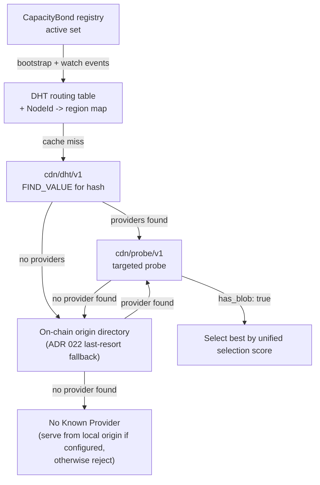

# ADR 001: Network Topology and Peer Mesh

**Date:** 2026-03-28
**Status:** Accepted

## Context

The CDN has two participant roles. **Nodes** (providers) cache and serve content close to clients — some have an origin backend (S3, NFS, local disk) making them the canonical source for specific content, others are pure caches. **Clients** consume content. No external origin URL exists; the network is fully self-contained.

Two questions are in scope:

1. How do nodes discover each other and learn what content each holds?
2. How does a node resolve a cache miss?

## Decision

All bonded nodes form a flat peer mesh with no fixed routing hierarchy. Node discovery is the on-chain `CapacityBond` registry active set; content discovery uses `cdn/dht/v1` (a lightweight Kademlia subset — see [ADR 022](022-content-discovery.md#adr-022--content-discovery-at-scale)), with the on-chain origin directory as the deterministic fallback when the DHT returns no providers:



### Node Discovery (Registry)

A node discovers its peers from the on-chain `CapacityBond` registry active set. The node reads the active set at startup. It keeps the set fresh by subscribing to `NodeRegistered`, `NodeMultiaddrUpdated`, `NodeDeregistered`, and `NodeAutoEjected` events. Sub-second L2 block times keep the staleness window small. The same active set seeds the `cdn/dht/v1` routing table ([ADR 022 § Routing Table](022-content-discovery.md#routing-table)).

A node dials any peer by its iroh `NodeId`. The registry supplies each active peer's `NodeId` and its reachable transport addresses in the `NodeInfo.multiaddrs` field. A node sets those addresses at registration (`decdn setup --multiaddr`) and updates them with `updateMultiaddrs`. When the field carries addresses, the dialer feeds them to iroh as direct-address hints. iroh also runs its built-in discovery. iroh races all paths to the peer. A peer that publishes a reachable address connects directly, with no relay. The relay path stays as the fallback for a peer behind NAT. The registry is therefore the address-exchange layer; a node needs no other one. A self-attested address never gates a dial: it is one path among several, so a stale or wrong address loses the race but never fails the connection.

The active set is the sole membership source. A node checks it before it initiates a paid pull (see Content Discovery), and the `cdn/dht/v1` STORE path admits records only from an active-bonded `NodeId` ([ADR 022 § STORE Flow](022-content-discovery.md#store-flow-cache-event--dht-publish)). A `NodeDeregistered` or `NodeAutoEjected` event removes the peer from the local view in the same handler that updates the cached active set.

### Node Region Metadata

Each node declares a region — an ISO 3166-1 alpha-2 country code — on-chain as `regionHint` at `CapacityBond.registerNode` ([ADR 030](030-node-region-self-attestation.md#adr-030-node-region-self-attestation)). The `CapacityBond` registry watcher resolves the active set into a `NodeId → region` map alongside the routing table. Region byte-accounting and the [ADR 030](030-node-region-self-attestation.md#adr-030-node-region-self-attestation) RTT-vs-claim selection penalty read this map. The region is self-attested and accepted at face value; a client applies a reputation penalty when observed latency contradicts the claimed region.

### Content Discovery (DHT + Probe)

Content discovery uses `cdn/dht/v1` as the primary mechanism. The full iterative `FindValueRequest` flow, origin-directory fallback, and bootstrap behavior are specified in [ADR 022 § FIND_VALUE Flow (Cache Miss → DHT Lookup)](022-content-discovery.md#find_value-flow-cache-miss--dht-lookup). `cdn/probe/v1` runs **after** the DHT lookup to confirm live availability and measure latency before any paid pull. This ADR owns three pieces layered on top of that flow: the probe cache, the probe-response collection window, and probe-rate limiting.

#### Probe cache

A short-lived LRU cache holds `hash → Vec<(NodeId, rate_per_mb, rtt)>` entries, TTL 15 seconds, max 1024 entries. Each hash entry retains at most 10 responses (top 10 by selection score). Approximate memory: 1,024 × 10 × ~100 bytes ≈ 1 MB. On a cache miss the requester checks the probe cache first; if a valid entry exists, it skips DHT lookup and goes straight to selection. On probe cache hit, if the selected provider no longer has the blob (evicted — rare with eviction holds), try the next-best cached provider; if all fail, run a fresh DHT lookup + probe. **Observability:** track `EvictedSinceProbe` response rate; sustained >1% may indicate eviction hold failures ([ADR 005](005-protocol.md#probe-triggered-eviction-hold)).

**Probe cache TTL is 15 seconds** — half the 30-second slashing window from [ADR 005](005-protocol.md#adr-005-wire-protocol) and below `probe_hold_duration` (35s), so any stream opened from a cached entry falls within the window during which a misbehaving provider is still slashable, and within the eviction hold period whenever a hold was actually placed (holds are best-effort — see [ADR 005 § Hold budget](005-protocol.md#hold-budget)).

**Negative probe cache.** A second LRU cache holds `(NodeId, hash)` keys — NodeIds that returned `has_blob: false` for a given hash — with TTL 5 minutes and max 1024 entries. Before issuing a `cdn/probe/v1` request to a NodeId returned in a DHT FIND_VALUE response ([ADR 022 § FIND_VALUE Flow](022-content-discovery.md#find_value-flow-cache-miss--dht-lookup)), the requester consults the negative cache and drops any `(NodeId, hash)` pair present. This bounds the cost of false-STORE publishers at the receivers closest to a hash in keyspace: a publisher advertising a hash it does not hold is exposed at the probe step by a single `has_blob: false` response, and that exposure is then sticky for 5 minutes against the affected requester. Without this cache, every subsequent cache miss for the same hash would re-probe the lying publisher, wasting probe round-trips and miss-latency budget.

**Negative cache TTL is 5 minutes** — longer than the positive cache (15s) because false-STORE results are less time-sensitive than positive-availability snapshots, and shorter than the DHT record TTL (1h) so a publisher that genuinely acquires the blob during the negative window can re-establish reachability after one cache lifetime. The cache key is `(NodeId, hash)` only — the negative cache is purely a request-suppression structure.

#### Probe response collection

After issuing the DHT FIND_VALUE + parallel `ProbeRequest` fan-out (per [ADR 022](022-content-discovery.md#find_value-flow-cache-miss--dht-lookup)), probe the candidate set concurrently and collect responses as they arrive. Collection stops as soon as enough blob-holding candidates have answered to fill the failover budget (the pull tries at most three providers, so three viable answers end the round), and otherwise runs until a **500ms** timeout elapses. Because the candidates are probed in parallel, this single timeout bounds the whole collection phase rather than the sum of per-candidate waits. The early stop keeps a healthy round at the speed of its fastest good answers instead of the ceiling; the 500ms ceiling remains the fallback for a sparse round and accommodates inter-continental RTTs (e.g., London↔Sydney ~250–300ms). Candidates that have not answered by the time the round ends are dropped.

Store all `has_blob: true` responses in the probe cache, then select the best provider using the unified [node selection algorithm](#node-selection-algorithm). Before opening `cdn/client/v1`, verify the selected `node_id` is still active in the registry active set; if not, skip to the next-best provider.

#### Probe rate limits

Inbound probes are limited to 5 requests per peer per second (token bucket); excess probes are silently dropped.

### Node Selection Algorithm

The unified selection score combines price, latency, and reputation into a single comparable value:

```
selection_score = rate_per_mb × rtt_ms × (1 / max(reputation, 0.1)²)
```

Lower is better. Reputation is clamped to a minimum of 0.1 to prevent division by zero ([ADR 008](008-reputation.md#adr-008-reputation-system) allows a floor of 0.0, but a node at 0.0 reputation is effectively unusable). The implementation additionally bounds the denominator *above* at 1.0 — a no-op for any reputation inside the [0.0, 1.0] domain this formula assumes, and a defensive guard against a producer that violates it buying an unearned bonus rather than a penalty. The `reputation²` term amplifies reputation: a node at 0.5 (neutral) is 4× more expensive in score terms than a node at 1.0 (perfect):

| Reputation | Score multiplier (vs. rep=1.0) |
| --- | --- |
| 1.0 | 1.0× |
| 0.8 | 1.56× |
| 0.5 | 4.0× |
| 0.3 | 11.1× |
| 0.1 | 100× |

For new nodes with the initial reputation of 0.5 ([ADR 008](008-reputation.md#adr-008-reputation-system)), the 4× multiplier means they must be ~4× cheaper or faster to compete with established nodes — a bootstrap barrier they clear by pricing or performing competitively until they accrue reputation.

**Inputs:** `rate_per_mb` and `rtt_ms` come from `ProbeResponse` (see [ADR 005](005-protocol.md#adr-005-wire-protocol)). `reputation` is the pulling node's own local score for the peer from [ADR 008 § Local Score Calculation](008-reputation.md#local-score-calculation) (a never-interacted peer is treated as the neutral 0.5).

**Reputation is a graded weight, not a veto.** It enters selection only through the `1 / max(reputation, 0.1)²` term above, which caps the worst-case penalty at 100×. There is no pre-scoring minimum-reputation filter: a sufficiently cheap or close node can outrank a poorly-reputed one, and that is intended — [ADR 008](008-reputation.md#adr-008-reputation-system) treats the local score as a subjective preference signal, not admission control. Pool membership is decided by bonding and authorization, not by reputation.

#### Tie-breaking

(scores within 1% of each other): see [ADR 008, Tie-Breaking](008-reputation.md#tie-breaking).

This score ranks a node's upstream candidates on its cache-miss pull leg — the node-to-node FIND_VALUE → probe → select flow of Content Discovery above. The client path does not compute it: a client ranks candidates by measured RTT only and takes price from the signed `StreamResponse` ([ADR 037 § Client selection policy](037-regional-proxy-warming.md#client-selection-policy-latency-driven-proxy-preference)). The simpler `rate_per_mb × rtt_ms` product is the price×latency component; the full selection algorithm adds reputation weighting as shown above.

### On-chain Registration

Node identity is the iroh `NodeId` (ed25519 public key). All bonded nodes register in `CapacityBond` — the on-chain contract holding `NodeId → (Ethereum address, multiaddrs, region, active flag)`. The contract surface (`NodeInfo` struct, `registerNode` with atomic NodeId↔Ethereum binding and ed25519 ownership proof, `updateMultiaddrs`, `deregisterNode`, `reclaimNodeId`, events, gas costs) is specified in [ADR 003 § Node Registry](003-payments.md#node-registry). Nodes and clients build their peer view from this registry on startup (see [ADR 019](019-node-onboarding.md#adr-019-node-onboarding-and-bootstrapping-flow) and [ADR 012 § Bootstrap Procedure](012-client.md#bootstrap-procedure)).

## Consequences

### Positive

- No external infrastructure is reachable — origin-backed nodes completely hide their backends, so no client or node can bypass the payment layer via a direct storage URL
- All nodes share the same discovery and transport protocols. The cache-only role remains permissionless — any staked operator may pull cached blobs from authorized origins and re-serve them. The origin role is DAO-governed: governance vets a publisher wallet in `OriginAssignment`, the vetted publisher seats its own operators, and namespace 0 (content published without a namespace) has no authorized origins. See [ADR 011 § Origin Assignment Authority](011-content-takedown.md#origin-assignment-authority) and [ADR 002 § Publisher Identity and Namespaces](002-content-addressing.md#publisher-identity-and-namespaces)
- Node discovery reads directly from the on-chain registry. Per-node discovery bandwidth is negligible and bounded by the bonded operator set. The active set is authoritative
- Content discovery via `cdn/dht/v1` provides targeted O(log N) provider lookup; probe confirms live availability. No stale content inventory to maintain — stale DHT records self-expire within TTL (1 hour)
- Probe cache prevents redundant probe batches for popular content within a 15-second window
- Once a node in a region caches a blob, other regional nodes pull from it at competitive rates rather than origin-backed prices — popular content gets cheaper as it spreads
- The flat mesh is simple to reason about and easy to test at small scale
- NodeId squatting is prevented by on-chain ed25519 ownership proof — an attacker cannot register a NodeId they do not control, and a legitimate owner can reclaim a squatted NodeId

### Negative

- Cold cache miss adds up to 500ms latency (probe collection timeout) vs. a pre-built content index lookup; mitigated by probe cache for repeated lookups within 15 seconds
- Probe cache introduces a brief staleness window (up to 15s) where a node may pull from a provider that has evicted the blob; mitigated by the probe-triggered eviction hold ([ADR 005](005-protocol.md#probe-triggered-eviction-hold)), with fallback to the next cached provider, then a fresh DHT lookup + probe
- Self-reported region hints (ISO 3166-1 alpha-2) are unverified; a node could misreport its region. Mitigation: clients apply a reputation penalty when observed latency contradicts the claimed region (e.g., RTT > 150ms to a node in the same claimed region). Cryptographic hardening via an IP-geolocation oracle or third-party attestation was considered and rejected — see [ADR 030](030-node-region-self-attestation.md#adr-030-node-region-self-attestation); the latency-based signal is the canonical mitigation.
- Every transfer is paid, so nodes pulling on cache miss incur a cost recouped through subsequent client deliveries — a natural economic barrier to speculative caching
- Origin-backed nodes are the last line of defense for availability — if all authorized origins for a blob go offline or are deregistered, the content becomes permanently unavailable (unless cached elsewhere). The protocol does not guarantee a redundancy floor: vetted publishers choose how many operators to commit per namespace via `OriginAssignment` ([ADR 011 § Origin Assignment Authority](011-content-takedown.md#origin-assignment-authority)). Content served under namespace 0 has no authorized origins and no redundancy floor — it survives only while cached somewhere.
- `registerNode` gas cost increases ~4–7× due to on-chain ed25519 signature verification (~650k–1.15M gas vs. ~150k without); acceptable as a one-time cost per node lifetime
