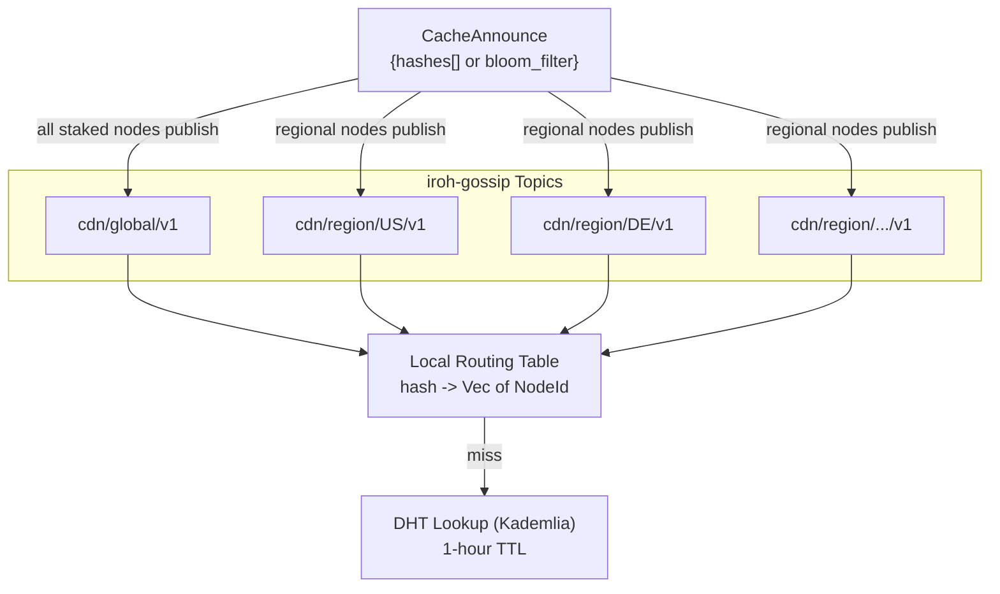

# ADR 001: Network Topology and Peer Mesh

**Date:** 2026-03-28
**Status:** Draft

## Context

The CDN has two participant roles. **Nodes** (providers) cache and serve content close to clients — some are configured with an origin backend (S3, NFS, local disk) making them the canonical source for specific content, while others are pure caches. **Clients** consume content. No external origin URL exists; the network is fully self-contained.

Two questions are in scope:

1. How do nodes discover each other and learn what content each holds?
2. How does a node resolve a cache miss?

## Decision

All staked nodes form a flat peer mesh with no fixed routing hierarchy. Discovery uses two complementary mechanisms:

- **iroh-gossip** for ongoing content state broadcast. Nodes publish `CacheAnnounce` messages on regional topics (`cdn/region/{cc}/v1`) and a global topic (`cdn/global/v1`). Origin-backed nodes announce all content they hold; pure-cache nodes announce their current cache. Each announcement lists blob hashes (capped at 500 entries) or a Bloom filter for large sets. Both clients and nodes maintain a local routing table (`hash → Vec<NodeId>`) built from received announcements. The routing table does not distinguish between origin-backed and cache-only nodes — the probe step determines which is cheaper and faster.

- **DHT-based lookup** as fallback when the local routing table has no match. Standard Kademlia approach — each node publishes `(hash → nodeIds)` records as content enters its store and removes them when it leaves. TTL is 1 hour.

On a cache miss, a node probes candidates from its routing table (or DHT), selects the best by `rate_per_mb × rtt_ms`, and pulls via `cdn/client/v1` (paid). This is the same protocol used for client→node delivery — every byte transferred in the network is paid. Origin-backed nodes typically charge more (reflecting their backend egress costs) and set the effective price ceiling. Cache-only nodes that have the blob compete at lower rates.

Node identity is the iroh `NodeId` (ed25519 public key). All staked nodes register in an on-chain registry mapping `NodeId → QUIC multiaddrs + Ethereum address`. Clients query this registry on first startup to find initial peers.

## Consequences

**Positive:**

- No external infrastructure is reachable from the network — origin-backed nodes completely hide their backends, so no client or node can bypass the payment layer by going directly to a storage URL
- All nodes participate in the same discovery and transport protocols; the only difference between origin-backed and cache-only nodes is whether they have an origin store configured
- Regional gossip topics bound message volume: nodes in one region don't receive announcements from irrelevant regions
- Once a node in a region caches a blob, other nodes in that region can pull from it at competitive rates rather than paying origin-backed node prices — popular content gets cheaper as it spreads
- The flat mesh is simple to reason about and easy to test at small scale (PoC is tens of nodes)

**Negative:**

- Gossip consistency is eventual — a node that evicts or loses content may still appear in routing tables for up to one DHT TTL (1 hour); clients and nodes must handle stale entries by falling back to the next candidate
- Bloom filter announcements (for large caches) introduce false positives: a probe to a node that turns out not to have the blob wastes a round-trip
- Every transfer is paid, so nodes pulling content on cache miss incur a cost that must be recouped through subsequent client deliveries; this creates a natural economic barrier to speculative caching
- Self-reported region hints (ISO 3166-1 alpha-2) are unverified; a node could misreport its region to appear in more gossip topics
- Origin-backed nodes become the last line of defence for content availability — if all origin-backed nodes for a given blob go offline or are deregistered, the content becomes permanently unavailable (unless cached elsewhere). Content owners are responsible for origin node uptime.
