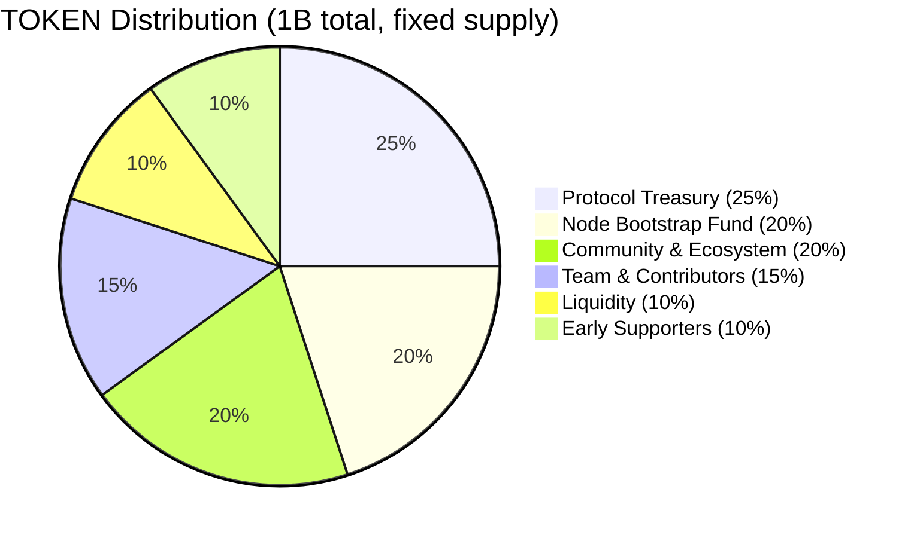
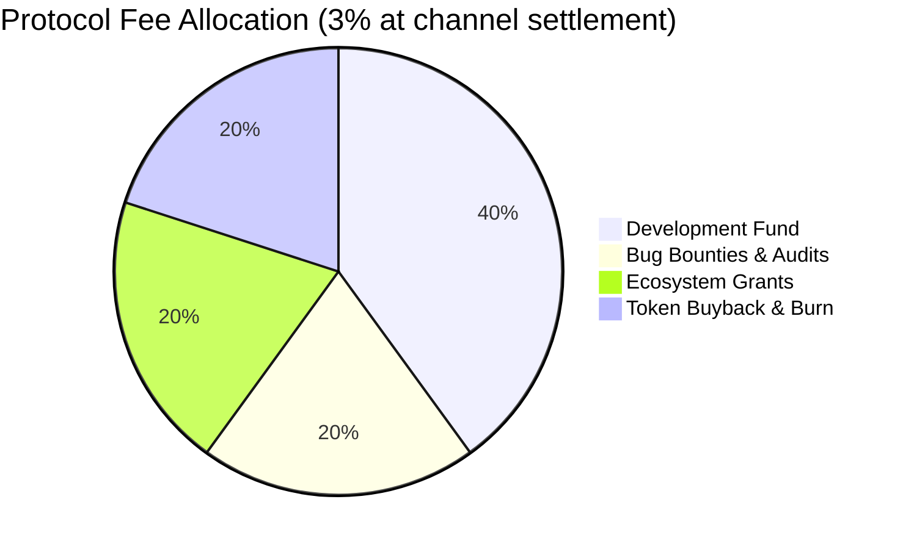

# ADR 004: Dual-Currency Token Model

**Date:** 2026-03-28
**Status:** Draft

## Context

The network needs an economic mechanism that:

1. Incentivizes nodes to join and behave honestly (staking with slashing)
2. Gives token holders a voice in protocol parameters (governance)
3. Pays node operators reliably without exposing them to asset volatility (see ADR 003)
4. Creates sustainable token demand as the network grows

A single-token model where nodes are paid in the native token fails constraint 3: operator infrastructure costs are USD-denominated, so a volatile payment token makes P&L unpredictable. Reactive rate adjustment is insufficient — gossip propagates rate changes slowly, mid-session rate changes are impossible, and rate churn degrades user experience.

## Decision

Use a **dual-currency model**: USDC for operational payments, TOKEN (native ERC-20) for network-specific economic functions where aligned incentives matter.

| Function | Currency | Rationale |
| --- | --- | --- |
| Delivery payments | USDC | Predictable unit economics for operators |
| Node staking | TOKEN | Stake to participate in the network; aligns operators with network health |
| Governance voting | TOKEN | Power reflects network commitment, not purchasing power |
| Fee discounts | TOKEN | Direct financial incentive to hold more TOKEN |
| Slashing | TOKEN | Already denominated in stake |

**Token supply:** 1B TOKEN, fixed at genesis, no post-genesis minting. Deflationary pressure comes from two sources: 50% of slashed stake is burned (the other 50% goes to the challenger who submitted the fraud proof — see [Slash Distribution](#slash-distribution)); 20% of protocol fees (collected in USDC) are allocated for TOKEN buyback and burn. During the PoC, this allocation accumulates in the `BuybackBurner` contract without execution; buyback execution is a production-only feature (see [BuybackBurner Contract](#buybackburner-contract)).

**Staking — single role:**

All nodes stake TOKEN to participate in the network. A node that has not staked cannot register in the on-chain registry and will not appear in gossip peer tables. Whether a node is configured with an origin backend (S3/R2) or operates as a pure cache is a deployment choice — the protocol treats all staked nodes identically.

Stake is slashable for: (1) serving data that fails BLAKE3 hash verification, (2) phantom blob announcements — claiming to have content that cannot be delivered, (3) rate manipulation — advertising one rate in probe responses then charging a higher rate during delivery, (4) blacklist violations — serving a blacklisted hash after the compliance window ([ADR 011](011-content-takedown.md)), and (5) double settlement (production only). Going offline, having a cache miss, or taking content offline is not slashable — these are handled by reputation. Nodes SHOULD expose slash-risk metrics for early detection of these conditions — see [architecture.md § Observability](architecture.md#observability).

Minimum stake is 1,000 TOKEN with a 7-day unbonding period. Stake remains slashable during unbonding to prevent slash-then-run.

**Fee discount:** Providers staking ≥10× the minimum stake pay a 1.5% protocol fee instead of 3%. The contract checks `StakingRegistry.getStakeMultiple(provider) >= 10` rather than a hardcoded absolute amount, so the discount threshold scales automatically if governance changes the minimum stake (see [ADR 003](003-payments.md#stakingregistry-modifications)). This creates a direct financial return on holding more TOKEN and rewards long-term network commitment.

**Governance:** See [ADR 009](009-governance.md). All economic parameters (fee %, rate bounds, slash percentages, dispute window) are governable within hardcoded safety bounds. During the PoC, a single admin key controls all parameters.

## Consequences

**Positive:**

- TOKEN transitions from a medium of exchange (bad for volatile assets) to a productive capital asset: stake it to operate, hold more for fee discounts, vote with it
- Buyback creates continuous buy-side demand proportional to network usage — more delivery volume → more USDC fees → more TOKEN purchased and burned
- Hardcoded safety bounds on all governable parameters limit the damage a governance attack can cause (see [ADR 009](009-governance.md))
- PoC can use a freely mintable testnet token with the same contracts; no supply constraints or distribution mechanics required during development

**Negative:**

- Bootstrapping requires token demand before organic revenue is sufficient; a 200M TOKEN bootstrap fund is allocated for this — adequate for PoC scale (see [Node Unit Economics](#node-unit-economics)), but adequacy for the production bootstrap period (hundreds of nodes before organic traffic) is unproven
- Two-token UX: all node operators need both USDC (for payment channels) and TOKEN (to stake). Client software should abstract this with integrated DEX swaps but adds complexity
- The TOKEN/USDC Uniswap pool will be thin at PoC scale and early production, making buyback execution impractical until sufficient pool depth exists. Buyback execution is deferred to production and requires a governance vote to enable (see [BuybackBurner Contract](#buybackburner-contract)). In production, `maxBuybackAmount` and `minTokenOut` parameters mitigate sandwich risk but require active governance attention
- Regulatory risk: a token with staking, governance, and economic utility may be classified as a security in some jurisdictions. Legal review is required before production token distribution. See [ADR 009](009-governance.md) for governance-specific risks.

## Token Distribution (Production)

| Allocation | Percentage | Tokens | Vesting |
| --- | --- | --- | --- |
| Protocol treasury | 25% | 250M | 4-year linear, 6-month cliff |
| Node bootstrap fund | 20% | 200M | Released on-demand via governance for node incentive programs |
| Team & contributors | 15% | 150M | 4-year linear, 12-month cliff |
| Community & ecosystem grants | 20% | 200M | 3-year linear, no cliff |
| Liquidity (DEX + CEX) | 10% | 100M | Fully unlocked at genesis |
| Early supporters / seed | 10% | 100M | 2-year linear, 6-month cliff |

**Node bootstrap fund:** Dedicated to attracting early nodes before organic delivery revenue is sufficient. Distributed as bonus rewards on top of normal USDC delivery payments. Governed by token holders — proposals to release funds require a governance vote. Target: fund 2 years of above-market node rewards.

**PoC simplification:** The token contract includes a `mint(address to, uint256 amount)` function restricted to `onlyOwner` (the deployer address). No supply cap, no distribution, no vesting. The `onlyOwner` guard prevents arbitrary minting by non-deployers on the testnet, avoiding confusion with an unrestricted public mint. **Production:** the mint function is removed entirely from the production token contract. The fixed 1B supply is minted once in the constructor and distributed per the allocation table above. There is no `mint` function in the production contract — supply is immutably fixed at genesis.

## Staking and Slashing Schedule

### Staking Parameters

| Parameter | PoC | Production |
| --- | --- | --- |
| Minimum stake | 1,000 TOKEN | 1,000 TOKEN (governable) |
| Unbonding period | 7 days | 7 days (governable, min 3 days) |
| Slashable during unbonding | Yes | Yes |
| Max stake registrations per node | 1 | 1 |

### Slash Amounts (Escalating)

| Scenario | PoC | Production |
| --- | --- | --- |
| First offense | 10% of stake | 5% of stake |
| Second offense before tier reset | 10% of stake | 15% of stake |
| Third offense before tier reset | 10% of stake | 50% of stake (triggers auto-ejection via cumulative loss) |

Production starts at 5% (vs. 10% in PoC) because the escalating tier system provides increasing deterrence for repeat offenders, making a lower first-offense penalty proportionate.

**PoC:** Flat 10% slash for all offenses. Escalation tier resets after 30 days without incidents. No lifetime counter.

**Production — increasing reset periods.** Lifetime offenses increase the clean period required to drop one escalation tier, up to a 4× cap. The lifetime offense counter is a monotonically increasing `uint32` per node in `StakingRegistry` — it never resets.

| Lifetime offense count | Reset period per tier drop |
| --- | --- |
| 1 | 90 days |
| 2 | 180 days |
| 3+ | 360 days |

Formula: `resetPeriod = baseResetPeriod × min(2^(max(lifetimeOffenses, 1) - 1), 4)`, where `lifetimeOffenses` is a `uint32` starting at 0 and `baseResetPeriod` is 90 days (governable — see [ADR 009](009-governance.md#governable-parameters-with-safety-bounds)). For `lifetimeOffenses = 0` (no prior offenses), the multiplier is 1× — i.e., `resetPeriod = baseResetPeriod`.

When the reset period elapses without a new offense, the node's escalation tier drops by one (e.g., tier 2 → tier 1). Multiple elapsed periods drop multiple tiers: `effectiveTier = max(0, storedTier - floor(elapsed / resetPeriod))`.

**Note:** The reset period formula is only meaningful when `storedTier > 0` (at least one prior offense). For `lifetimeOffenses = 0`, the result is vacuously correct — there is no tier to decay.

**Example:** A node commits its first offense (5% slash, tier 1, lifetime count = 1). After 90 clean days, its tier resets to 0. The node commits a second offense (5% slash — tier was 0 — but lifetime count = 2). Now the node needs 180 clean days per tier drop. A third offense at any tier sets lifetime count = 3, requiring 360 clean days per tier drop.

**Anti-gaming rationale:** Without increasing reset periods, a node can misbehave once every 91 days, always receiving the minimum 5% slash, never facing escalation or ejection (~20% annual stake loss). The increasing reset period makes this strategy progressively worse: after 3 lifetime offenses, the node must remain incident-free for 360 days to drop even one tier, during which its stake is locked and earning nothing if the node is inactive.

**On-chain storage:** `StakingRegistry` stores two additional fields per node: `lifetimeOffenseCount` (`uint32`) and `lastOffenseTimestamp` (`uint256`). The `slash()` function first computes the effective tier via `currentTier()` (applying any decay from elapsed clean time), then sets `storedTier = currentTier() + 1`, increments `lifetimeOffenseCount`, and updates `lastOffenseTimestamp`. This ensures decay is applied before escalation — without this, a stale stored tier would be incremented past the correct level. The `currentTier()` view function computes the effective tier dynamically: `max(0, storedTier - floor(elapsed / resetPeriod))` — no keeper or decay transaction required.

### Slash Distribution

| Destination | Percentage |
| --- | --- |
| Burned | 50% |
| Challenger reward | 50% |

The challenger reward incentivizes watchtowers and honest nodes to monitor and report misbehavior.

### Challenge Bond

To prevent frivolous fraud proof submissions, challengers must post a TOKEN bond. Without a bond, the PoC is vulnerable to zero-cost rate manipulation slash claims — any address can submit slash evidence (two signed messages) with no penalty for frivolous or fabricated claims, enabling griefing of honest nodes.

| Parameter | PoC | Production |
| --- | --- | --- |
| Challenge bond | 100 TOKEN | 50 TOKEN |
| Bond return | Returned if challenge succeeds (node slashed) | Returned if challenge succeeds (node slashed) |
| Bond forfeiture | Forfeited if node successfully counters. 50% burned, 50% to node. | Forfeited if node successfully counters. 50% burned, 50% to node. |

The PoC bond is set higher than production (100 vs 50 TOKEN) because testnet TOKEN has no real economic cost and can be provisioned cheaply by the team — a higher nominal amount creates at least a transactional friction barrier. In production, where TOKEN has real value, 50 TOKEN provides sufficient economic deterrence.

### Auto-Ejection

If a node's stake drops below 50% of the minimum stake requirement due to accumulated slashing:

- Removed from the staking registry
- Peers drop the node from their peer table (gossip messages from unregistered nodes are rejected via signature + registry validation; see [ADR 001](001-network.md)). Paid pulls also verify registry status before opening a stream (ADR 001, Content Discovery step 5), bounding the risk of paying an ejected node to at most 1 MB × rate_per_mb
- Remaining stake enters forced unbonding (standard unbonding period applies)
- Node must re-stake at full minimum to rejoin

Open payment channels are unaffected by ejection — see [ADR 003](003-payments.md#slashing-and-channel-interactions). Channel close, dispute, and settlement proceed normally; client funds are never trapped by ejection.

## Fee Allocation

Protocol fees (3%, collected in USDC at channel settlement — see [ADR 003](003-payments.md#fee-calculation-on-disputed-closes)) are allocated:

| Use | % of Fees | Currency | Mechanism |
| --- | --- | --- | --- |
| Development fund | 40% | USDC | Held as stablecoin in treasury |
| Bug bounties & audits | 20% | USDC | Held as stablecoin in treasury |
| Ecosystem grants | 20% | USDC | Held as stablecoin in treasury |
| Token buyback & burn | 20% | USDC → TOKEN → burn | Via `BuybackBurner` contract (accumulate-only in PoC; execution production-only) |

### Treasury Splitting Mechanism

`settleChannel` transfers the full protocol fee to a single treasury address (see [ADR 003](003-payments.md#fee-calculation-on-disputed-closes)). The 40/20/20/20 allocation above is a **spending policy** — no on-chain splitting occurs at settlement time. Fee distribution from the treasury to the four buckets is a separate, off-contract process:

- **PoC:** The admin key holder manually transfers from the treasury address. The 20% buyback allocation is sent to `BuybackBurner` (see below); the 80% non-buyback allocation is held as stablecoin for the development fund, bug bounties & audits, and ecosystem grants. No on-chain sub-split is enforced — at ~$0.90/month in total protocol fees ([PoC Reality](#revenue-model-poc-reality)), automation adds gas cost and contract surface area without benefit.
- **Production:** Governance proposals direct treasury disbursements per the allocation policy. The on-chain burn percentage is governable (0%–100%, see [ADR 009](009-governance.md)); the non-buyback sub-split (40/20/20) is a policy target that governance can adjust by proposal without contract changes. A dedicated `TreasurySplitter` contract that automatically routes incoming fees to per-bucket addresses may be introduced in a future ADR once fee volumes justify the gas and complexity overhead.

### BuybackBurner Contract

The `BuybackBurner` contract converts accumulated USDC fees into TOKEN and burns them:

1. The admin key holder (PoC) or an authorized governance action (production) transfers accumulated USDC fees (20% allocation) to `BuybackBurner`
2. `executeBuyback()` swaps USDC for TOKEN via Uniswap V3 on L2
3. Purchased TOKEN is sent to burn address (`0x000...dEaD`)

**PoC behavior:** The `BuybackBurner` contract is deployed and receives the 20% fee allocation from the treasury, but `executeBuyback()` is not called. Fees accumulate in the contract as a treasury reserve. At PoC scale, per-node revenue is ~$1.50/month (see [PoC Reality](#revenue-model-poc-reality)), so even a 20-node network generates only ~$30/month in delivery payments, ~$0.90/month in protocol fees, and ~$0.18/month in buyback allocation — insufficient to justify gas costs, let alone execute a meaningful market buy on a thin TOKEN/USDC pool. Buyback execution is enabled in production via governance vote once pool liquidity and fee volume justify it.

**Parameters:**

| Parameter | PoC | Production | Governable |
| --- | --- | --- | --- |
| Minimum accumulation before buyback (`minBuybackAmount`) | N/A (execution disabled) | 100 USDC | Yes |
| Maximum single buyback (`maxBuybackAmount`) | N/A (execution disabled) | 10,000 USDC | Yes |
| Slippage tolerance (`slippageBps`) | N/A (execution disabled) | 2% (200 bps) | Yes |
| DEX (`dexPool`) | N/A (execution disabled) | Uniswap V3 TOKEN/USDC pool | Yes (pool address) |
| Execution | Disabled — fees accumulate only | Governance-triggered or automated keeper | — |
| Execution activation | N/A | Requires governance vote to enable | — |

> Parameter name `slippageBps` corresponds to `setSlippageTolerance(uint256 bps)` in the [IBuybackBurner interface](003-payments.md).

The minimum accumulation threshold is reduced from 1,000 to 100 USDC because at early production fee volumes, accumulating 1,000 USDC in the buyback allocation takes years even with dozens of active nodes.

The caller provides `minTokenOut` to prevent sandwich attacks. If the TOKEN/USDC pool has insufficient liquidity, the swap reverts due to the `minTokenOut` check and accumulated fees remain in the contract until liquidity improves. The `maxBuybackAmount` should be set conservatively relative to pool depth.

**Activation criteria (production):** Buyback execution should be enabled via governance vote only when: (1) the TOKEN/USDC pool has sufficient depth that a maximum single buyback causes less than the configured slippage tolerance in price impact, and (2) accumulated fees in the contract exceed the minimum accumulation threshold. These criteria are guidelines for governance voters, not on-chain enforcement.

## Node Unit Economics

### Cost Model

| Cost Category | Monthly Estimate | Notes |
| --- | --- | --- |
| VPS (4 vCPU, 8GB RAM) | $20–40 | Hetzner, OVH tier |
| Storage (1TB SSD) | $10–20 | Included in many VPS plans |
| Bandwidth (5TB egress) | $0–25 | Many VPS plans include 5–20TB |
| L2 gas costs | $5–15 | ~10 channel settlements/month at ~$0.50–1.50 each |
| **Total monthly cost** | **$35–100** | |

### Revenue Model (Production Target)

A node earning at a USDC-denominated delivery rate of $0.00001/MB with production-level traffic:

| Metric | Value |
| --- | --- |
| Bandwidth allowance | 10,000 GB/month |
| Client delivery volume | 7,000 GB/month |
| Node-to-node delivery volume | 3,000 GB/month |
| Cache miss rate | 15% (1,500 GB miss) |
| Paid pull cost for cache misses | ~$15/month |
| Infrastructure cost | $50/month |
| Revenue at $0.00001/MB | $100/month |
| Gross profit | ~$35/month |

Revenue depends entirely on traffic. A node serving no bytes earns $0.

**Competitive context:** The $0.00001/MB ($0.01/GB) market rate is 4–20× cheaper than major traditional CDNs (CloudFront $0.085/GB, Akamai $0.12–0.20/GB, KeyCDN $0.04/GB) and at parity with budget CDNs (Bunny.net $0.01/GB). Governance-set rate bounds (floor: 1 USDC base unit/$0.000001/MB, ceiling: 1,000 USDC base units/$0.001/MB — see [ADR 003](003-payments.md)) provide a 10×–100× band around this expected market rate. The ceiling accommodates origin-backed nodes using high-egress backends while remaining well above any traditional CDN rate.

### Revenue Model (PoC Reality)

The production target above assumes 10,000 GB/month (~333 GB/day) — a meaningful production CDN node. A PoC with tens of nodes and limited test traffic will see far less:

| Metric | PoC | Production |
| --- | --- | --- |
| Client delivery volume | 100 GB/month | 7,000 GB/month |
| Node-to-node delivery volume | 50 GB/month | 3,000 GB/month |
| Cache miss rate | 30% | 15% |
| Revenue at $0.00001/MB | ~$1.50/month | $100/month |
| Paid pull cost for cache misses | ~$0.50/month | ~$15/month |
| Infrastructure cost | $35/month | $50/month |
| Gross profit (without subsidy) | **−$34/month** | ~$35/month |
| Profitable without subsidy? | No | Yes |

PoC nodes will operate at a loss without bootstrap subsidies. This is expected — the bootstrap fund exists precisely for this phase.

**Buyback at PoC scale:** Buyback execution is disabled during the PoC — see [BuybackBurner Contract](#buybackburner-contract) for the detailed calculation showing that buyback allocations at PoC-scale revenue are far too small to justify gas costs or meaningful market buys.

### Bootstrap Fund Gap (PoC)

The per-node monthly shortfall at PoC scale is ~$34. Subsidy requirements at different network sizes:

| Scenario | Nodes | Duration | Total subsidy (USDC equivalent) |
| --- | --- | --- | --- |
| Minimal PoC | 20 | 6 months | ~$4,080 |
| Extended PoC | 50 | 12 months | ~$20,400 |

At any reasonable TOKEN price, these amounts are a tiny fraction of the 200M TOKEN bootstrap fund. The bootstrap fund is more than adequate for PoC scale.

**Production bootstrap modeling.** The table below estimates bootstrap fund requirements at various production scales, assuming the per-node shortfall decreases as organic traffic grows:

| Phase | Nodes | Organic revenue/node | Shortfall/node | Duration | Total subsidy |
| --- | --- | --- | --- | --- | --- |
| Early production | 100 | $15/month | $35/month | 12 months | $420,000 |
| Growth | 500 | $50/month | $0/month (breakeven) | — | $0 |
| Mature | 1,000+ | $100+/month | — (profitable) | — | $0 |

At a TOKEN price of $0.01 (conservative early production), the 200M TOKEN bootstrap fund is worth $2M — sufficient to cover the early production phase (~$420K) with margin. At $0.001/TOKEN, the fund is worth $200K — marginal. **The bootstrap fund's adequacy is directly tied to TOKEN price**, which creates a reflexive dependency: if the network fails to attract traffic, TOKEN price drops, the fund buys less subsidy, and nodes leave. This chicken-and-egg dynamic is the primary economic risk and should be monitored as the network scales.

**Circuit-breaker trigger.** If the bootstrap fund's USD-equivalent value drops below 2× the projected 12-month subsidy requirement (computed as `active_nodes × monthly_shortfall × 12`), governance SHOULD trigger a subsidy reduction playbook: (1) reduce per-node subsidies to extend the fund's runway, (2) prioritize subsidies for nodes with the highest delivery volume (reward productive nodes, not idle stake), (3) publish a transparent fund status report to the community. The 2× threshold provides a 12-month buffer before the fund is exhausted. This trigger is a governance policy recommendation, not an on-chain mechanism — monitoring is off-chain via treasury balance tracking.

### Gas Cost Breakdown (Arbitrum)

| Operation | Estimated Gas | Cost at $0.05/tx |
| --- | --- | --- |
| `stake()` | ~100k gas | ~$0.05 |
| `openChannel()` | ~150k gas | ~$0.05 |
| `closeChannel()` | ~200k gas | ~$0.10 |
| `settleChannel()` | ~150k gas | ~$0.08 |
| `SlashJudge.submit*Challenge()` | ~50–60k gas | ~$0.03 |
| `withdraw()` | ~80k gas | ~$0.05 |

Payment channels amortize gas effectively. A channel open for 30 sessions costs $0.23 total (open + close + settle) = ~$0.008 per session. `settleChannel` is callable by any address, so settlement bots or the counterparty can trigger it.

Estimates assume Arbitrum average gas price as of early 2026. Actual costs vary with L2 congestion and L1 data availability pricing (post-EIP-4844). Costs may swing 10× in either direction.

## Governance

See [ADR 009 — Governance Model](009-governance.md) for the full governance specification, including the production voting model (OpenZeppelin Governor), governable parameters with safety bounds, and emergency multisig design. During the PoC, a single admin key controls all parameters.

## Multi-Chain Bridging

Not in PoC scope. High-level production approach:

- TOKEN is **canonical on one L2** (the production chain). All staking, channel settlements, and governance happen on this chain.
- Users on other chains use standard ERC-20 bridges (Arbitrum native bridge, or cross-chain protocols like LayerZero/Wormhole) to move tokens to the canonical chain.
- **No cross-chain payment channels in v1.** Channels exist on one chain only. Cross-chain would require atomic swaps or a bridge-aware channel design — too complex for initial production.

The production L2 choice determines available bridges, gas costs, finality time, and tooling. This decision is deferred until after PoC validation.
