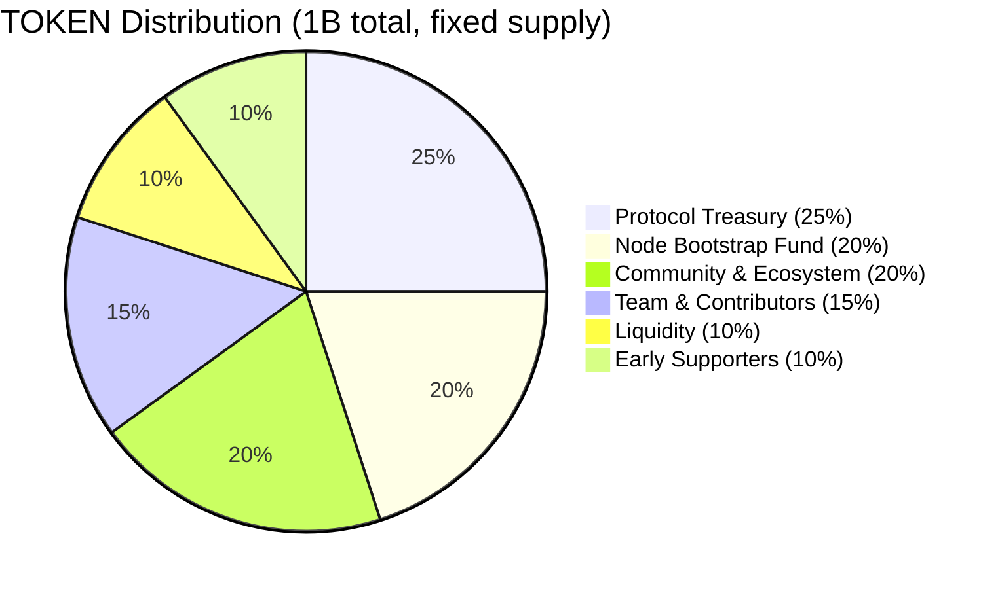
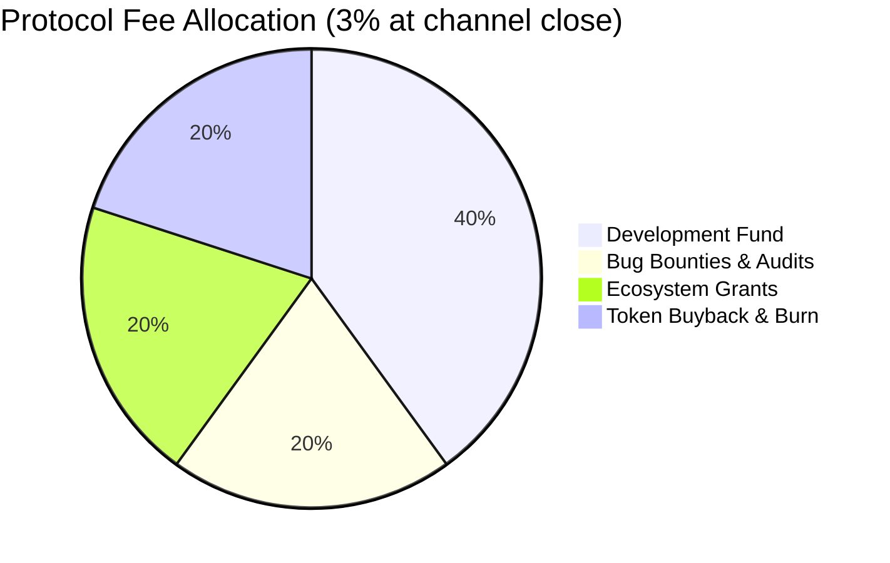

# ADR 004: Dual-Currency Token Model

**Date:** 2026-03-28
**Status:** Draft

## Context

The network needs an economic mechanism that:

1. Incentivizes nodes to join and behave honestly (staking with slashing)
2. Gives token holders a voice in protocol parameters (governance)
3. Pays node operators reliably without exposing them to asset volatility (see ADR 003)
4. Creates sustainable token demand as the network grows

A single-token model where nodes are paid in the native token fails constraint 3: operator infrastructure costs are USD-denominated, so a volatile payment token makes P&L unpredictable. Reactive rate adjustment is insufficient — gossip propagates rate changes slowly, mid-session rate changes are impossible, and rate churn degrades user experience.

## Decision

Use a **dual-currency model**: USDC for operational payments, TOKEN (native ERC-20) for network-specific economic functions where aligned incentives matter.

| Function | Currency | Rationale |
| --- | --- | --- |
| Delivery payments | USDC | Predictable unit economics for operators |
| Node staking | TOKEN | Stake to participate in the network; aligns operators with network health |
| Governance voting | TOKEN | Power reflects network commitment, not purchasing power |
| Fee discounts | TOKEN | Direct financial incentive to hold more TOKEN |
| Slashing | TOKEN | Already denominated in stake |

**Token supply:** 1B TOKEN, fixed at genesis, no post-genesis minting. Deflationary pressure comes from two sources: 100% of slashed stake is burned; 20% of protocol fees (collected in USDC) are used to buy TOKEN on the open market and burn it.

**Staking — single role:**

All nodes stake TOKEN to participate in the network. A node that has not staked cannot register in the on-chain registry and will not appear in gossip routing tables. Whether a node is configured with an origin backend (S3/R2) or operates as a pure cache is a deployment choice — the protocol treats all staked nodes identically.

Stake is slashable for: (1) serving data that fails BLAKE3 hash verification, (2) phantom blob announcements — claiming to have content that cannot be delivered, (3) rate manipulation — advertising one rate in probe responses then charging a higher rate during delivery, and (4) double settlement (production only). Going offline, having a cache miss, or taking content offline is not slashable — these are handled by reputation.

Minimum stake is 1,000 TOKEN with a 7-day unbonding period. Stake remains slashable during unbonding to prevent slash-then-run.

**Fee discount:** Providers staking ≥10× the minimum (10,000 TOKEN) pay a 1.5% protocol fee instead of 3%. This creates a direct financial return on holding more TOKEN and rewards long-term network commitment.

**Governance:** Token-weighted voting using OpenZeppelin Governor. All economic parameters (fee %, rate bounds, slash percentages, dispute window) are governable within hardcoded safety bounds. Safety bounds are immutable — even a governance attack cannot set fees to 100% or stake to 0.

## Consequences

**Positive:**

- TOKEN transitions from a medium of exchange (bad for volatile assets) to a productive capital asset: stake it to operate, hold more for fee discounts, vote with it
- Buyback creates continuous buy-side demand proportional to network usage — more delivery volume → more USDC fees → more TOKEN purchased and burned
- Hardcoded safety bounds on all governable parameters limit the damage a governance attack can cause
- PoC can use a freely mintable testnet token with the same contracts; no supply constraints or distribution mechanics required during development

**Negative:**

- Bootstrapping requires token demand before organic revenue is sufficient; a 200M TOKEN bootstrap fund is allocated for this but its adequacy is unproven
- Two-token UX: all node operators need both USDC (for payment channels) and TOKEN (to stake). Client software should abstract this with integrated DEX swaps but adds complexity
- The TOKEN/USDC Uniswap pool may be thin at launch, making buyback execution sensitive to pool depth; `maxBuybackAmount` and `minTokenOut` parameters mitigate sandwich risk but require active governance attention
- Token-weighted governance is vulnerable to large-holder capture; safety bounds limit damage but cannot prevent rent-seeking within allowed parameter ranges (e.g., setting protocol fee to the 20% maximum)
- Regulatory risk: a token with staking, governance, and economic utility may be classified as a security in some jurisdictions. Legal review is required before production token distribution.

## Token Distribution (Production)

| Allocation | Percentage | Tokens | Vesting |
| --- | --- | --- | --- |
| Protocol treasury | 25% | 250M | 4-year linear, 6-month cliff |
| Node bootstrap fund | 20% | 200M | Released on-demand via governance for node incentive programs |
| Team & contributors | 15% | 150M | 4-year linear, 12-month cliff |
| Community & ecosystem grants | 20% | 200M | 3-year linear, no cliff |
| Liquidity (DEX + CEX) | 10% | 100M | Fully unlocked at genesis |
| Early supporters / seed | 10% | 100M | 2-year linear, 6-month cliff |

**Node bootstrap fund:** Dedicated to attracting early nodes before organic delivery revenue is sufficient. Distributed as bonus rewards on top of normal USDC delivery payments. Governed by token holders — proposals to release funds require a governance vote. Target: fund 2 years of above-market node rewards.

**PoC simplification:** The token contract includes a public `mint(address to, uint256 amount)` function callable by anyone. No supply cap, no distribution, no vesting.

## Staking and Slashing Schedule

### Staking Parameters

| Parameter | PoC | Production |
| --- | --- | --- |
| Minimum stake | 1,000 TOKEN | 1,000 TOKEN (governable) |
| Unbonding period | 7 days | 7 days (governable, min 3 days) |
| Slashable during unbonding | Yes | Yes |
| Max stake registrations per node | 1 | 1 |

### Slash Amounts (Escalating)

| Scenario | PoC | Production |
| --- | --- | --- |
| First offense | 10% of stake | 5% of stake |
| Second offense within 30 days | 10% of stake | 15% of stake |
| Third offense within 30 days | 10% of stake | 100% of stake (full ejection) |
| Offense counter reset | N/A | After 90 days without incidents |

### Slash Distribution

| Destination | Percentage |
| --- | --- |
| Burned | 50% |
| Challenger reward | 50% |

The challenger reward incentivizes watchtowers and honest nodes to monitor and report misbehavior.

### Challenge Bond

To prevent frivolous fraud proof submissions:

| Parameter | PoC | Production |
| --- | --- | --- |
| Challenge bond | N/A (not implemented) | 50 TOKEN |
| Bond return | N/A | Returned if challenge succeeds (node slashed) |
| Bond forfeiture | N/A | Forfeited if node successfully counters. 50% burned, 50% to node. |

### Auto-Ejection

If a node's stake drops below 50% of the minimum stake requirement due to accumulated slashing:

- Removed from the staking registry
- Content routing announces their content as unavailable
- Remaining stake enters forced unbonding (standard unbonding period applies)
- Node must re-stake at full minimum to rejoin

## Fee Allocation

Protocol fees (3%, collected in USDC at channel close) are allocated:

| Use | % of Fees | Currency | Mechanism |
| --- | --- | --- | --- |
| Development fund | 40% | USDC | Held as stablecoin in treasury |
| Bug bounties & audits | 20% | USDC | Held as stablecoin in treasury |
| Ecosystem grants | 20% | USDC | Held as stablecoin in treasury |
| Token buyback & burn | 20% | USDC → TOKEN → burn | Via `BuybackBurner` contract |

The 80% non-buyback allocation stays as stablecoin in the treasury. Governance directs spending.

### BuybackBurner Contract

The `BuybackBurner` contract converts accumulated USDC fees into TOKEN and burns them:

1. Treasury transfers accumulated USDC fees (20% allocation) to `BuybackBurner`
2. `executeBuyback()` swaps USDC for TOKEN via Uniswap V3 on L2
3. Purchased TOKEN is sent to burn address (`0x000...dEaD`)

**Parameters:**

| Parameter | Value | Governable |
| --- | --- | --- |
| Minimum accumulation before buyback | 1,000 USDC | Yes |
| Maximum single buyback | 10,000 USDC | Yes |
| Slippage tolerance | 2% (200 bps) | Yes |
| DEX | Uniswap V3 TOKEN/USDC pool | Yes (pool address) |
| Execution | Governance-triggered or automated keeper | — |

The caller provides `minTokenOut` to prevent sandwich attacks. If the TOKEN/USDC pool has insufficient liquidity, the swap reverts due to the `minTokenOut` check and accumulated fees remain in the contract until liquidity improves. The `maxBuybackAmount` should be set conservatively relative to pool depth.

## Node Unit Economics

### Cost Model

| Cost Category | Monthly Estimate | Notes |
| --- | --- | --- |
| VPS (4 vCPU, 8GB RAM) | $20–40 | Hetzner, OVH tier |
| Storage (1TB SSD) | $10–20 | Included in many VPS plans |
| Bandwidth (5TB egress) | $0–25 | Many VPS plans include 5–20TB |
| L2 gas costs | $5–15 | ~10 channel settlements/month at ~$0.50–1.50 each |
| **Total monthly cost** | **$35–100** | |

### Revenue Model

A node earning at PoC delivery rates with a USDC-denominated delivery rate of $0.00001/MB:

| Metric | Value |
| --- | --- |
| Bandwidth allowance | 10,000 GB/month |
| Client delivery volume | 7,000 GB/month |
| Node-to-node delivery volume | 3,000 GB/month |
| Cache miss rate | 15% (1,500 GB miss) |
| Paid pull cost for cache misses | ~$15/month |
| Infrastructure cost | $50/month |
| Revenue at $0.00001/MB | $100/month |
| Gross profit | ~$50/month |

Revenue depends entirely on traffic. A node serving no bytes earns $0.

### Gas Cost Breakdown (Arbitrum)

| Operation | Estimated Gas | Cost at $0.05/tx |
| --- | --- | --- |
| `stake()` | ~100k gas | ~$0.05 |
| `openChannel()` | ~150k gas | ~$0.05 |
| `closeChannel()` | ~200k gas | ~$0.10 |
| `submitFraudProof()` | ~250k gas | ~$0.10 |
| `withdraw()` | ~80k gas | ~$0.05 |

Payment channels amortize gas effectively. A channel open for 30 sessions costs $0.15 total (open + close) = $0.005 per session.

## Governance Model

### PoC: Admin Key

A single deployer address (EOA or multisig) has admin rights on all contracts. Can update any parameter. No voting, no timelock.

### Production: Token-Weighted Governance

Based on OpenZeppelin Governor:

| Parameter | Value |
| --- | --- |
| Voting token | TOKEN (staked or unstaked) |
| Proposal threshold | 100,000 TOKEN (0.01% of supply) |
| Voting period | 3 days |
| Quorum | 4% of total supply |
| Timelock | 2 days between vote passing and execution |
| Vote delegation | Supported |

### Governable Parameters with Safety Bounds

| Parameter | Contract | Min | Max |
| --- | --- | --- | --- |
| Protocol fee % | StablePaymentChannel | 0% (0 bps) | 20% (2000 bps) |
| Minimum stake | StakingRegistry | 100 TOKEN | 100,000 TOKEN |
| Slash percentages | StakingRegistry | 1% | 100% |
| Unbonding period | StakingRegistry | 3 days | 30 days |
| Dispute window | StablePaymentChannel | 30 minutes | 7 days |
| Rate floor/ceiling | StablePaymentChannel | Floor > 0 | Ceiling > floor |
| Challenge bond | StakingRegistry | 1 TOKEN | 1,000 TOKEN |
| Burn percentage of fees | StablePaymentChannel | 0% | 100% |

Safety bounds are hardcoded — even governance cannot set parameters outside these ranges.

### Emergency Multisig

- 3-of-5 multisig with known, trusted signers
- Can ONLY pause contracts (not change parameters or withdraw funds)
- Used for exploit response and critical bug mitigation
- Sunset: after 12 months, the pause function is permanently disabled (or requires governance vote to extend)
- Signers should be geographically and organizationally diverse

## Multi-Chain Bridging

Not in PoC scope. High-level production approach:

- TOKEN is **canonical on one L2** (the production chain). All staking, channel settlements, and governance happen on this chain.
- Users on other chains use standard ERC-20 bridges (Arbitrum native bridge, or cross-chain protocols like LayerZero/Wormhole) to move tokens to the canonical chain.
- **No cross-chain payment channels in v1.** Channels exist on one chain only. Cross-chain would require atomic swaps or a bridge-aware channel design — too complex for initial production.

The production L2 choice determines available bridges, gas costs, finality time, and tooling. This decision is deferred until after PoC validation.
