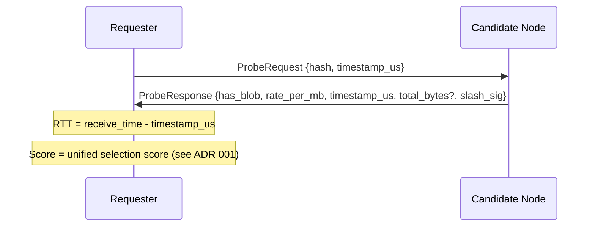
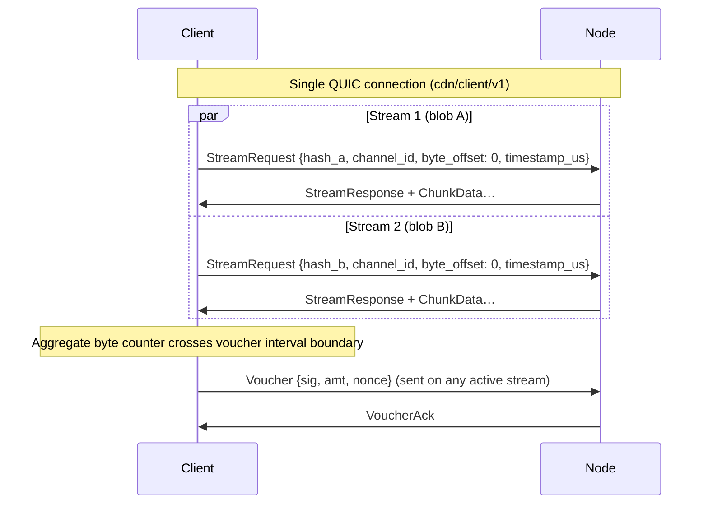

# ADR 005: Wire Protocol

**Date:** 2026-03-28
**Status:** Accepted

## Context

Nodes and clients communicate over QUIC connections established via iroh. This ADR defines what protocols run over those connections: how a client or node requests a blob and pays for it, and how content availability is broadcast across the network.

The protocol layer is distinct from the transport layer (iroh/QUIC) and the payment layer (vouchers, channels) so each can evolve independently.

## Decision

Three core protocols negotiated via ALPN, plus the built-in iroh-gossip protocol:

| Protocol | Participants | Purpose |
| --- | --- | --- |
| `cdn/probe/v1` | any node ↔ any node | Latency and availability check before committing to a node |
| `cdn/client/v1` | payer ↔ delivering node | Paid blob delivery with payment vouchers (client→node, node→node on cache miss) |
| `cdn/dht/v1` | any node ↔ any node | Kademlia content discovery (FIND_VALUE / STORE / FIND_NODE) — see [ADR 022](022-content-discovery.md#adr-022--content-discovery-at-scale) |
| iroh-gossip (built-in) | all nodes | Node metadata announcements (`NodeAnnounce`), node discovery |

### Gossip topics

The iroh-gossip protocol carries multiple message types on distinct topics:

| Topic | Message Type | Source ADR |
| --- | --- | --- |
| `cdn/global/v1`, `cdn/region/{cc}/v1` | `NodeAnnounce` | [ADR 001](001-network.md#adr-001-network-topology-and-peer-mesh) |

All gossip topics use the `cdn/` namespace prefix. There is no protocol-level role for fraud monitoring — anyone may run an off-chain detector against the L2 chain ([Appendix: Fraud Detection](appendix-fraud-detection.md#appendix-permissionless-stale-close-detection)).

### Rate discovery

Nodes do not gossip rate changes. The current rate is included in every signed `ProbeResponse`; clients query rates by probing. A node's last probe-quoted rate is binding for any stream opened within the 30-second slashing window — see [`cdn/probe/v1` — latency probe](#cdnprobev1--latency-probe) and the rate-manipulation slashing path in [ADR 014](014-on-chain-verification.md#adr-014-on-chain-verification-for-slashing-evidence).

### `cdn/probe/v1` — latency probe

Before opening a payment channel or sending a `StreamRequest`, a node probes candidates to measure round-trip latency and confirm the node has the blob:



`timestamp_us` is a requester-generated microsecond timestamp echoed back; RTT is `receive_time - timestamp_us`. `has_blob` confirms the node has the content. The protocol does not distinguish origin from cache at probe time — origin status is a publisher-level commitment recorded in `OriginAssignment` (see [ADR 011 § Origin Assignment Authority](011-content-takedown.md#origin-assignment-authority)) and discoverable off-chain via `OriginAssignment.getOrigins(namespaceId)`; the wire response describes only "I have the bytes and will serve them at this rate." Cache-only serving is permissionless and indistinguishable from origin serving over the wire — correct, since clients verify bytes via BLAKE3 regardless of who served them. `rate_per_mb` lets the requester score candidates on both latency and price in a single round-trip. `total_bytes` is an optional unsigned field for the blob's total size in bytes, letting the requester estimate total cost before committing to a node or opening a payment channel; nodes SHOULD include it when the blob size is known. The field is not covered by `slash_sig` — it is not needed for any slashing mechanism and follows the Tier 1 minor evolution pattern from [ADR 013](013-schema-evolution.md#tier-1--minor-no-coordination).

`slash_sig` is the candidate node's EIP-712 secp256k1 signature over `{hash, has_blob, rate_per_mb, timestamp_us}`, signed with the operator's Ethereum key registered in `CapacityBond` ([ADR 003 § NodeId-to-Ethereum Binding](003-payments.md#nodeid-to-ethereum-binding)). The signed-field set is the v1 baseline; per [ADR 013 § Signed Field Freezing](013-schema-evolution.md#signed-field-freezing), any subsequent change to this set is a Tier 3 ALPN bump. The signature makes the probe response cryptographically attributable to a registered node and enables two slashing mechanisms: (1) **phantom announcement slashing** — if `has_blob: true` in `ProbeResponse` but the node returns a signed `StreamResponse` with `ok: false` or a redirect for the same hash, the two signed messages are on-chain-verifiable evidence (the timeout/non-response case is handled separately — see [ADR 003](003-payments.md#adr-003-payment-model)); (2) **rate manipulation slashing** — if `stream_response.timestamp_us >= probe_response.timestamp_us` and `stream_response.timestamp_us - probe_response.timestamp_us < 30_000_000` (30 seconds) and `stream_response.rate_per_mb > probe_response.rate_per_mb`, both signed messages constitute on-chain-verifiable evidence of bait-and-switch. Evidence age is bounded by the existing `Max evidence age` parameter ([ADR 009](009-governance.md#adr-009-governance-model)) so honest operators are never exposed to indefinite slash risk from old probes. Both `timestamp_us` values are requester-generated (the probe timestamp echoed in `ProbeResponse`; `StreamResponse` echoes a separate requester timestamp from `StreamRequest`), so the on-chain verifier computes the delta from a single clock with no wall-clock reference. **Submitting slash evidence requires a 100 TOKEN challenge bond** — see [ADR 026 § Slashing and burn](026-tokenomics.md#slashing-and-burn) — returned if the challenge succeeds, forfeited if the node successfully counters, preventing zero-cost griefing via fabricated slash claims.

**Signer binding:** Connection-level peer identity is authenticated by the iroh QUIC handshake against the registered NodeId (Ed25519). Message-body attribution and on-chain slash evidence both rely on `slash_sig`: verifiers recover the Ethereum address via `ecrecover` (3,000 gas on-chain) and confirm it maps to the expected NodeId via `CapacityBond.nodeIdOf` ([ADR 003 § NodeId-to-Ethereum Binding](003-payments.md#nodeid-to-ethereum-binding)). `slash_sig` is mandatory and non-empty on every `ProbeResponse` and `StreamResponse` — no opt-out. Requesters MUST reject responses with missing or zero-length `slash_sig`. See [ADR 014](014-on-chain-verification.md#adr-014-on-chain-verification-for-slashing-evidence) for the EIP-712 type definitions and `SlashJudge` contract interface.

**Dependent parameters:** The probe cache TTL in [ADR 001](001-network.md#adr-001-network-topology-and-peer-mesh) is half this 30-second window (15 seconds), keeping any stream opened from a cache hit within the slashable window; `probe_hold_duration` (see below) is this window plus 5-second margin. Changing the slashing window requires updating both.

> **Derived constants:** All three timing parameters derive from a single base value: `PROBE_SLASH_WINDOW = 30s`. `probe_cache_ttl = PROBE_SLASH_WINDOW / 2 = 15s`. `probe_hold_duration = PROBE_SLASH_WINDOW + 5s margin = 35s`. Implementations SHOULD define `PROBE_SLASH_WINDOW` as a named constant and compute the others from it.

#### Probe-triggered eviction hold

When a node responds `has_blob: true` to a `ProbeRequest`, the node MUST ensure the blob is not evicted by LRU cache pressure (see [appendix-blob-cache-eviction.md](appendix-blob-cache-eviction.md#appendix-blob-cache-eviction-policy)) for at least `probe_hold_duration` (35 seconds — the 30-second slashing window plus 5 seconds of margin for network latency). This is a local implementation requirement, not a wire protocol change — the `ProbeResponse` format is unchanged. The hold marks the blob eviction-exempt in the cache engine for `probe_hold_duration` after signing the response. If the cache engine cannot guarantee the hold (e.g., the blob is already being evicted, or the hold budget is exhausted), the node MUST respond `has_blob: false` rather than risk a phantom-announcement slash. This matches the `BlobTooLarge` principle: a node MUST NOT sign `has_blob: true` unless it can deliver (see [Error Handling](#error-handling-and-retry-semantics)). Implementations SHOULD expose `probe_hold_unavailable` (labeled by `reason`) and `probe_hold_slots_used` metrics — see [Appendix: Observability](appendix-observability.md#appendix-observability-and-metrics).

#### Hold budget

The total number of concurrently held blobs is bounded by `max_probe_holds` (default: 256, operator-configurable). Holds are per-blob, not per-probe — multiple peers probing the same blob share one hold slot, so effective throughput exceeds `max_probe_holds / probe_hold_duration` for popular content. When all hold slots are occupied, additional probe requests for unheld blobs receive `has_blob: false` even if the blob is currently in cache, bounding the effective cache size reduction from holds to at most `max_probe_holds` entries. Operators running small caches should set `max_probe_holds` proportional to cache size (recommended: no more than 25% of cache capacity); production nodes serving many peers should increase the default proportionally. The existing inbound probe rate limit (5 probes/peer/second — see [ADR 001](001-network.md#adr-001-network-topology-and-peer-mesh)) bounds the rate at which any single peer can consume hold slots. Coordinated probe floods across many peers (Sybil attack) are bounded by the per-IP and global layers in [§ Probe rate limiting](#probe-rate-limiting) below — admission to the hold path occurs only after all three rate-limit layers pass. Hold-budget exhaustion at the admitted rate is an availability degradation, not a safety violation: the node loses revenue but is not falsely slashed.

#### Rate bounds validation

Before signing a `ProbeResponse` containing `rate_per_mb`, the node MUST verify that `rate_per_mb` is at least its locally cached `deliveryFloor`. If the node's configured rate is below the current floor — e.g., governance raised it while the node was running — the node SHOULD raise `rate_per_mb` to the floor and log a warning rather than refusing to respond, keeping the node operational during governance transitions until the operator updates their rate configuration. The clamp only ever raises: there is no governance ceiling, and `MAX_RATE_PER_MB` bounds the field above at the wire layer.

The same validation applies when the node signs a `StreamResponse` containing `rate_per_mb`: the node MUST verify the floor before signing, with the same clamp-and-warn behavior. Each clamping event SHOULD increment the `rate_bounds_clamp_events` metric — see [Appendix: Observability](appendix-observability.md#appendix-observability-and-metrics).

##### Requester-side validation (optional)

Requesters (clients and nodes performing cache-miss pulls) MAY reject `ProbeResponse` or `StreamResponse` messages whose `rate_per_mb` they consider too expensive. This is a local policy decision, not a protocol requirement — the buyer sees the signed rate before it pays anything, which is what makes a governance ceiling unnecessary.

The rate floor is queried from the `PaymentChannel` contract via `getRateBounds()` and kept current via `RateBoundsUpdated` event subscription with periodic polling fallback. See [ADR 003 — Rate Bounds Refresh](003-payments.md#rate-bounds-refresh) for the refresh mechanism.

The requester issues a `cdn/dht/v1` FIND_VALUE lookup for the target hash, then probes the returned candidate set concurrently via `cdn/probe/v1` (or checks the probe cache for recent results), collecting responses until a 500ms timeout, then selects the winner using the unified selection score (see [ADR 001, Node Selection Algorithm](001-network.md#node-selection-algorithm)). See [ADR 001, Content Discovery](001-network.md#content-discovery-dht--probe) and [ADR 022](022-content-discovery.md#adr-022--content-discovery-at-scale) for the full discovery flow. The 500ms ceiling accommodates inter-continental RTTs. This applies to clients picking nodes and nodes picking peers for a cache miss pull.

**Probe responses are public information.** `ProbeRequest` requires no authentication — any node can probe any other node. The information revealed (content availability, pricing, node identity) is not confidential by design: node identities are in a public on-chain registry, and availability/pricing are discoverable through probe and stream responses. Network topology can be inferred by bulk probing, but this is inherent to any system where nodes must be discoverable to serve content; operational mitigations to bound the cost of bulk probing are specified in [§ Probe rate limiting](#probe-rate-limiting) below. The cryptographic signatures on probe responses exist for accountability (slashing evidence), not confidentiality.

#### Probe rate limiting

`cdn/probe/v1` inbound requests are subject to three layered token-bucket rate limits applied **before** any signature is computed and **before** any [Probe-Triggered Eviction Hold](#probe-triggered-eviction-hold) slot is allocated. A probe must pass all three layers to be admitted; failing any layer closes the stream with QUIC application error code `0x10` (`RATE_LIMITED`) per [ADR 013 § Application Error Codes](013-schema-evolution.md#application-error-codes).

| Layer | Default refill | Default burst | Hard bounds | Scope |
|---|---:|---:|---|---|
| Per-peer (NodeId) | 5 probes/sec | 5 | (existing — [ADR 001, Content Discovery](001-network.md#content-discovery-dht--probe)) | The source iroh `NodeId` on the QUIC connection. |
| Per-IP | 50 probes/sec | 200 | refill `[10, 1000]`; burst `[refill, 5×refill]` | The QUIC source IP after iroh-relay unwrapping for relay-routed connections. |
| Global node | 1000 probes/sec | 2000 | refill `[100, 100000]`; burst `[refill, 10×refill]` | Single global bucket across all probes inbound to this node. |

Checks fire cheapest-first (global → per-IP → per-peer) so a probe rejected by the global cap never costs a per-IP-bucket lookup. Each admitted probe consumes one token from each bucket.

**Why three layers, not one.** Per-peer alone is bypassable: clients are unstaked and can rotate `NodeId` for free per [ADR 003 § Probe fishing](003-payments.md#probe-fishing). The per-IP layer raises the cost of bulk probing — IP rotation requires money (proxies, IPv6 prefix delegation, cloud bills) and disadvantages bulk-probers without disadvantaging staked node-to-node traffic, which uses stable IPs. The global cap is defence in depth against distributed attacks across many IPs that would otherwise exhaust the node's per-probe signing capacity.

**Interaction with the hold budget.** Because the rate limiter fires before the hold-allocation path, a rate-limited probe never consumes a hold slot. The hold-budget exhaustion concern in [§ Hold budget](#hold-budget) is therefore bounded by the **admitted** probe rate, not the offered load — a probe flood exceeding the rate limits cannot exhaust the hold budget.

**Metrics.** Naming follows [appendix-observability.md](appendix-observability.md#appendix-observability-and-metrics).

| Metric | Type | Description |
|---|---|---|
| `decdn_probe_rate_limit_rejections_total` | counter, label `layer={per_peer, per_ip, global}` | New: probes rejected by the rate limiter, broken down by which layer rejected first. |

### `cdn/client/v1` — paid delivery protocol

Used for all paid delivery: client→node and node→node (cache miss pull from an origin-backed or cached node). A delivering node MAY satisfy a request for a blob it does not hold by pulling through from the network — not only from its own configured origin — and serving the result, governed by the seed-leech caps in [ADR 037](037-regional-proxy-warming.md#adr-037-latency-driven-proxy-warming-for-regional-locality); this is the mechanism that warms a regional copy. A warming proxy holds no record at probe time and answers `has_blob: false` to any probe, so serving via pull-through carries no phantom-announcement exposure (cf. § Probe interaction). `NotFound` is returned only when the node neither holds the blob nor can reach a provider for it, or declines to pull through under its seed-leech policy.


#### Client identity binding

For clients using ephemeral (off-chain) NodeId-to-Ethereum-address bindings (see [ADR 003 — Off-Chain Ephemeral Binding](003-payments.md#off-chain-ephemeral-binding-for-clients)), the binding is conveyed via optional fields in `StreamRequest`:

```rust
struct StreamRequest {
    hash: Hash,
    namespace_id: U256,  // 0 = no namespace (cache/DHT only); non-zero routes to that namespace's authorized origins
    channel_id: ChannelId,
    byte_offset: u64,
    byte_len: u64,       // 0 = to end-of-blob; else bound the range to [byte_offset, byte_offset + byte_len)
    timestamp_us: u64,
    voucher_interval_mb: Option<u64>,
    // Ephemeral client binding (optional; required on first request per connection)
    ethereum_address: Option<Address>,
    binding_signature: Option<Bytes>,  // EIP-712 BindNodeId signature
}
```

The client includes `ethereum_address` and `binding_signature` in the first `StreamRequest` on a connection. The node verifies the EIP-712 signature via `ecrecover`, caches the verified binding for the connection's lifetime, and uses the recovered address for voucher attribution. Subsequent requests on the same connection may omit these fields. These are `Option` fields in the `StreamRequestExt` extensions struct, defaulting to `None` when absent via the two-phase deserialization pattern defined in [ADR 013](013-schema-evolution.md#tier-1--minor-no-coordination). Peers that do not send them (e.g., nodes in node-to-node pulls where both sides have on-chain bindings) produce frames without extension bytes, and the receiver fills `StreamRequestExt::default()` — no ALPN version bump is needed since this is defined before the first implementation.

**Voucher wire format:** `Voucher {sig, amt, nonce}` above is shorthand. The EIP-712 signed data covers the full structure from [ADR 003](003-payments.md#adr-003-payment-model): `{channelId, amount, nonce, bytesDelivered, token}`. The fields `signature`, `amount`, and `nonce` are transmitted on the wire; the rest are derived from stream context — `channel_id` is in `StreamRequest`, `token` is fixed at channel open, and `bytesDelivered` is the node's per-channel cumulative byte counter. Including `nonce` explicitly (rather than an implicit incrementing counter) prevents desynchronization if a `VoucherAck` is dropped. The receiver reconstructs the full typed data to verify the signature.

The delivering node advertises its `rate_per_mb` in `StreamResponse`. The payer accepts by sending the first voucher or disconnects and tries another node — no surprise pricing. `timestamp_us` in `StreamResponse` is the requester-generated microsecond timestamp from `StreamRequest`, echoed back unchanged — same pattern as `ProbeResponse`. `slash_sig` is an EIP-712 secp256k1 signature over `{hash, ok, rate_per_mb, total_bytes, channel_id, timestamp_us, redirect}`, signed with the operator's Ethereum key and verifiable via `ecrecover` — see [ADR 014](014-on-chain-verification.md#adr-014-on-chain-verification-for-slashing-evidence). It is mandatory and non-empty on every `StreamResponse`. Signing the full response prevents a malicious party from altering unsigned fields while reusing a valid signature — in particular, `ok` is needed for phantom announcement evidence (proving a node signed `ok: false` after claiming `has_blob: true` in a probe), and `redirect` ensures a node cannot silently alter routing without accountability. A rate mismatch where `stream_response.rate_per_mb > probe_response.rate_per_mb` is slashable if `stream_response.timestamp_us >= probe_response.timestamp_us` and `stream_response.timestamp_us - probe_response.timestamp_us < 30_000_000` (30 seconds); the ordering check prevents unsigned integer underflow in the on-chain verifier, which computes this delta from the signed messages alone (both `timestamp_us` requester-generated) with no wall-clock reference, external time oracle, or clock-skew sensitivity. The `redirect` field in `StreamResponse` is used when a node cannot serve — it contains the NodeId of another node that can, never an external URL. The network is fully opaque.

#### Namespace routing

`StreamRequest` carries `namespace_id`, the namespace the content is published under (see [ADR 002 § Retrieval by namespace](002-content-addressing.md#retrieval-by-namespace)). The delivering node routes on it:

- **`namespace_id != 0`** — the node resolves the namespace's authorized origins via `OriginAssignment.getOrigins(namespace_id)` ([ADR 011 § Origin Assignment Authority](011-content-takedown.md#origin-assignment-authority)) and, on a cache miss, pulls from one of them. If none hold the bytes, the fetch fails.
- **`namespace_id == 0`** — the request names no namespace, so there are no authorized origins. The node serves only from its local cache or from DHT-discovered holders ([ADR 022](022-content-discovery.md#adr-022--content-discovery-at-scale)); a cache miss with no DHT holder fails.

`namespace_id` is a **routing hint, not a trust anchor**: the returned bytes are verified against the BLAKE3 `hash` independently ([ADR 002](002-content-addressing.md#adr-002-content-addressing)), so a wrong or hostile `namespace_id` can only cause a failed fetch, never corrupt or mis-attributed delivery. The requester supplies the `(namespace_id, hash)` association, which the application already knows.

Like `byte_len`, `namespace_id` is part of the base `StreamRequest` (every node routes on it), and because `cdn/client/v1` is pre-finalisation it is a straight in-place addition with no version bump or compatibility shim.

#### Redirect loop prevention

The requester MUST enforce:

1. **Hop limit:** maximum 3 redirects per original request. After 3 redirects, the request is treated as failed (no more redirects followed).
2. **Cycle detection:** the requester tracks the set of NodeIds visited for each request; a redirect to an already-visited NodeId is rejected immediately.
3. **Failure handling:** when the redirect limit is reached or a cycle is detected, the requester falls back to the next-best node from the original probe results (same as a `ok: false` response).

`byte_offset` supports seek and resume: on failover, the requester reconnects to a different node and resumes from the last BLAKE3-verified byte.

#### Bounded byte ranges

`byte_offset` is the start of a request; `byte_len` bounds its **end**. A request expresses the half-open range `[byte_offset, byte_offset + byte_len)`, with `byte_len == 0` meaning "to end-of-blob" (the prior whole-tail behavior, so an absent/zero value is the unchanged default). A bounded range lets a node scope a cache-miss **origin** fetch to exactly the requested bytes rather than pulling the whole blob to serve a fraction of it — see [ADR 037 § Origin-tier pull-through](037-regional-proxy-warming.md#origin-tier-pull-through-ranged-fetch--external-outboard). It also scopes payment: `total_bytes` in `StreamResponse` stays the **full blob size** — the buyer derives remaining bytes as `total_bytes - byte_offset`, and the serving node needs the blob size to frame bao verification of the range — while the **delivered, metered** byte count for a bounded request is `min(byte_len, total_bytes - byte_offset)`, or the whole tail (`total_bytes - byte_offset`) when `byte_len == 0`.

`byte_len` is part of the base `StreamRequest` (not an optional extension): it is billing-relevant — a node that ignored it would over-deliver and over-bill with no slash evidence — so it must be understood by every node. Because `cdn/client/v1` is pre-finalisation (no testnet deployment), this is a **straight in-place addition** to the message, not a Tier-3 evolution: there is no version bump and no compatibility shim ([ADR 013 § Schema evolution](013-schema-evolution.md#adr-013-schema-evolution)). The node MUST reject a `byte_offset + byte_len` that overflows or exceeds the blob size with a `StreamError`.

#### Voucher interval negotiation

The optional `voucher_interval_mb` field in `StreamRequest` proposes a larger-than-default voucher cadence for this stream (see [ADR 003 — Voucher Interval Negotiation](003-payments.md#voucher-interval-negotiation)). If present, the node responds with its accepted interval in `StreamResponse.voucher_interval_mb` — equal to or smaller than the proposed value. If absent from either message, both sides default to 1 MB. The `voucher_interval_mb` field is **not** covered by `slash_sig` because it is a delivery-layer optimization, not security-relevant — the node can always enforce a smaller interval unilaterally by pausing delivery.

The protocol is self-enforcing: payer stops sending vouchers → delivering node stops sending chunks; delivering node stops sending chunks → payer stops sending vouchers.

> **Relationship to iroh-blobs:** The `cdn/client/v1` protocol wraps iroh-blobs' verified streaming within its own message framing. iroh-blobs provides BLAKE3 tree-hash verification at the chunk level; `ChunkData` payloads carry the bao interleaved verified-stream encoding (chunk-group data with the proof nodes that anchor it to the root), alongside the payment and delivery control messages (`Voucher`, `StreamEnd`, `StreamError`) that iroh-blobs' native transfer protocol does not support. The BLAKE3 content hash in `StreamRequest` is the iroh-blobs hash, and verification uses iroh-blobs' incremental tree-hash mechanism — receivers need not buffer the full blob before confirming integrity, and a range beginning at any `byte_offset` is verifiable against the root on its own. See [ADR 038](038-bao-verified-range-streaming.md#adr-038-bao-verified-range-streaming-on-cdnclientv1) for the verification model and wire encoding.

### Gossip — node metadata

Node metadata is broadcast over iroh-gossip on region-scoped topics (`cdn/region/{cc}/v1`) and a global topic (`cdn/global/v1`). All staked nodes publish `NodeAnnounce` messages containing node-level metadata: just the self-reported region. `NodeAnnounce` does not carry content inventories — content discovery uses `cdn/dht/v1` (O(log N) FIND_VALUE) with `cdn/probe/v1` as live-availability confirmation. See [ADR 022](022-content-discovery.md#adr-022--content-discovery-at-scale) and [ADR 001](001-network.md#adr-001-network-topology-and-peer-mesh).

Region codes (`{cc}` in topic names) are self-declared ISO 3166-1 alpha-2 country codes carried in each node's `NodeAnnounce`. Gossip validation ([ADR 001](001-network.md#adr-001-network-topology-and-peer-mesh)) enforces that the `region` field is exactly 2 ASCII uppercase letters matching a known ISO 3166-1 alpha-2 code — messages with invalid region values are dropped. Misreporting a valid but incorrect region is mitigated by latency-based reputation scoring: clients penalize nodes whose observed RTT contradicts the claimed region (e.g., RTT > 150 ms to a node in the same claimed region). See [ADR 001](001-network.md#adr-001-network-topology-and-peer-mesh) for the full `NodeAnnounce` struct, gossip validation rules, and region-misreporting mitigation.

Gossip messages are lightweight (~800 bytes worst case), well within iroh-gossip message limits. Clients and nodes maintain a peer table (`NodeId → NodeAnnounce`) from received messages. The probe step determines which peers hold specific content, along with their cost and latency.

### Connection Management

One QUIC connection per `(local_node, remote_node, ALPN)` tuple. Multiple requests to the same node on the same protocol reuse the existing connection via QUIC's native stream multiplexing — each `StreamRequest` opens a new bidirectional QUIC stream. A client fetching 100 blobs from one node opens 1 connection with 100 concurrent streams, not 100 connections.

Different ALPNs require separate connections (TLS ALPN is negotiated at connection establishment); a `cdn/probe/v1` connection and a `cdn/client/v1` connection to the same node are always distinct.

Every deCDN implementation completes its full TLS 1.3 handshake before application bytes flow, on every ALPN: no request is ever sent as replayable early data. This binds implementations, not the wire — iroh accepts early data on any ALPN regardless of what the handler does, so the property is held on the emitter side (no code asks for early data) rather than enforced on receipt. TLS session resumption still applies — a client reconnecting to a node it has already spoken to skips certificate transmission and signature verification, though the ECDHE key exchange still runs — and steady-state cost is dominated by stream multiplexing on connections that stay open.

#### Concurrent stream limits

Maximum concurrent bidirectional streams per connection, set via QUIC transport parameter `initial_max_streams_bidi`:

| ALPN | Max streams | Rationale |
| --- | --- | --- |
| `cdn/client/v1` | 100 | Enough parallelism for bulk fetching (e.g., video manifest + segments) without exhausting server resources |
| `cdn/probe/v1` | 1 | Single request-response; the connection is reused for sequential probes to the same node |
| `cdn/dht/v1` | 1 | Single request-response per Kademlia RPC (FIND_VALUE / STORE / FIND_NODE); the connection is reused for sequential queries to the same node ([ADR 022](022-content-discovery.md#adr-022--content-discovery-at-scale)) |

Stream concurrency is enforced via QUIC's `MAX_STREAMS` transport parameter: a peer MUST NOT open a new bidirectional stream beyond the advertised limit (doing so is a protocol violation resulting in `STREAM_LIMIT_ERROR` and connection close). The receiver grants additional credit by sending `MAX_STREAMS` updates as existing streams close.

#### Payment channels and concurrent streams

A single `channel_id` can be shared across concurrent streams on the same connection. Vouchers are cumulative across **all** streams on the channel:



The payer maintains **one aggregate byte counter per channel**. When the counter crosses the next voucher interval boundary (default 1 MB; negotiable per-stream — see [ADR 003 — Voucher Interval Negotiation](003-payments.md#voucher-interval-negotiation)), it issues the next cumulative voucher on any active stream sharing that channel. When streams on the same channel have different negotiated intervals, the effective interval for the channel is the **minimum** across all active streams. The delivering node tracks total bytes sent across all streams on the channel and **pauses all streams** if the voucher deficit exceeds the effective interval — the self-enforcing threshold is applied collectively, not per-stream.

Implementation constraint: the payer must have a single voucher-signing task per channel aggregating byte counts from all streams, not independent per-stream voucher logic.

#### Connection lifetime

- Connections remain open while any stream is active or any sent voucher is awaiting `VoucherAck` (on-chain channel closure does not affect connection lifetime).
- **Idle timeout:** 30 seconds after the last stream closes and no unacknowledged vouchers remain in flight. Endpoints SHOULD send periodic QUIC PING frames when otherwise idle, with a default interval of 10 seconds (below the idle timeout) to prevent NAT middleboxes from dropping the mapping.

### Error Handling and Retry Semantics

A node signals a stream failure by returning a `StreamError` code. Delivery-side codes ride in the initial response (`StreamResponse { ok: false, error: ... }`, transitioning `AwaitingResponse → Failed`); the payment-side code (`VoucherRejected`) rides mid-stream in a `StreamError` message (transitioning `Streaming → Failed`). The lifecycle position is set by when the rejection becomes diagnosable — see [`VoucherRejected` semantics](#voucherrejected-semantics) below and the [Stream Lifecycle State Machine](#stream-lifecycle-state-machine):

```rust
enum StreamError {
    NotFound,          // Node does not hold the blob and cannot reach a provider, or declines to pull through (ADR 037 seed-leech caps)
    Overloaded,        // Node is at capacity; try another node
    BlobTooLarge,      // Blob exceeds this node's configured max_blob_size; do not retry this node
    InternalError,     // Unexpected failure; do not retry this node
    EvictedSinceProbe, // Blob was evicted between probe and stream request — WARNING: still slashable after a signed has_blob:true probe (see below)
    VoucherRejected { reason: VoucherRejectReason }, // Mid-stream payment-voucher rejection (carried in a StreamError message, not in the initial StreamResponse) — see VoucherRejected semantics below
}

enum VoucherRejectReason {
    BadSignature,         // VoucherError::InvalidSignature — signature is malformed: corrupted bytes, non-canonical `s`, or invalid recovery id
    WrongSigner,          // VoucherError::WrongSigner — signature is well-formed but recovers to an address other than the expected signer (typically channel.client)
    WrongChannel,         // ChannelError::WrongChannel — voucher.channel_id mismatch
    WrongToken,           // ChannelError::WrongToken — cross-token replay defense (ADR 003)
    StaleNonce,           // ChannelError::NonceNotIncreasing — voucher nonce not strictly increasing
    AmountRegression,     // ChannelError::AmountDecreasing — cumulative amount regressed
    BytesRegression,      // ChannelError::BytesDecreasing — cumulative bytes_delivered regressed
    InsufficientDeposit,  // ChannelError::AmountExceedsDeposit — voucher amount exceeds channel deposit
    RetryLater,           // Transient node-side persist-write failure (ChannelError::Store / RetrySignal) — voucher is valid; resend the same voucher. No validation-enum counterpart (ADR 003 §Off-chain voucher state persistence)
    Expired,              // On-chain channel-expiry serve-gate refusal (#751) — channel passed expiresAt; stop streaming, reclaimExpired for the remainder. Handler-emitted; no validation-enum counterpart
    CooperativeCloseSigned, // Node has signed a cooperative-close waiver ([ADR 003 §Cooperative close](003-payments.md#cooperative-close-fast-settle)) — channel is settling; stop streaming, submit the close. Handler-emitted; no validation-enum counterpart
    RateFloorRaised,      // Live delivery floor (getRateBounds().deliveryFloor) rose above the stream's quoted rate after the signed StreamResponse (#1382) — voucher unredeemable at the quoted rate (PaymentChannel._advanceClaimWatermark → RateFloorViolation); re-probe/re-quote at the new floor. Handler-emitted; no validation-enum counterpart
}
```

#### `EvictedSinceProbe` semantics

This error code is informational only (unsigned, like all error codes — see below). It signals to the requester that the node had the blob at probe time but lost it due to cache pressure. The requester MUST NOT retry the same node for this blob — the blob is no longer in cache — and falls back to the next-best provider, identical to `NotFound` handling. **Warning:** Returning `EvictedSinceProbe` in a signed `StreamResponse` with `ok: false` within the 30-second slashing window still constitutes valid phantom-announcement slash evidence — the error code is unsigned and invisible to the on-chain verifier. Implementations MUST NOT treat this error code as a "safe" way to refuse a stream after a positive probe. A well-implemented node using probe-triggered eviction holds (see [Probe-Triggered Eviction Hold](#probe-triggered-eviction-hold)) should rarely return this error; its presence at significant rates indicates a failure to respect hold commitments (implementation bug or resource exhaustion such as OOM), not a budget configuration issue — an undersized `max_probe_holds` budget causes the node to respond `has_blob: false` at probe time, preventing the stream request entirely.

#### `VoucherRejected` semantics

`VoucherRejected` is delivered **mid-stream**, not as an initial response. By the time a node can reject a voucher, the stream has already transitioned `AwaitingResponse → Streaming` via `StreamResponse { ok: true }` and the client has sent at least one `Voucher` (the [Stream Lifecycle State Machine](#stream-lifecycle-state-machine) below). On rejection the node sends a `StreamError` message carrying `VoucherRejected { reason }`, transitioning the stream `Streaming → Failed`. The QUIC stream is then closed cleanly — **no QUIC stream reset and no application-error close code** — preserving the rejection reason for client diagnostics and letting the payer distinguish a payment rejection from a network failure (a bare stream reset with no application code collapses every rejection to "connection error").

The other `StreamError` variants (`NotFound`, `Overloaded`, `BlobTooLarge`, `InternalError`, `EvictedSinceProbe`) are delivery-side and ride in the initial `StreamResponse { ok: false, error: ... }` (transitioning `AwaitingResponse → Failed`). `VoucherRejected` is the only variant scoped to the mid-stream `StreamError` message; this asymmetry is intentional — each rejection's lifecycle position determines which carrier message is available.

The first eight `VoucherRejectReason` variants mirror the off-chain validation enums `ChannelError` / `VoucherError` (in `crates/incentive/`) one-to-one. Each of those corresponds to an on-chain `closeChannel` / `disputeChannel` revert that would otherwise cost gas (see [ADR 003 § Fee Routing on Disputed Closes](003-payments.md#fee-routing-on-disputed-closes) for the on-chain invariants and [ADR 003 § Off-chain Voucher Rejections](003-payments.md#off-chain-voucher-rejections-wire-encoding) for the per-reason mapping). The remaining variants have no validation-enum counterpart and are emitted by the `cdn/client/v1` handler directly: `RetryLater` signals a transient node-side persist-write failure (`ChannelError::Store`, surfaced as `RetrySignal`) where the voucher is valid and in-memory state did not advance, so the client resends the same voucher rather than refreshing state (see [ADR 003 § Off-chain voucher state persistence](003-payments.md#off-chain-voucher-state-persistence)); `Expired` is the on-chain channel-expiry serve-gate refusal (#751); `CooperativeCloseSigned` is the cooperative-close-waiver refusal ([ADR 003 §Cooperative close](003-payments.md#cooperative-close-fast-settle)); and `RateFloorRaised` is the honest-buyer re-quote signal when a governance delivery-floor raise lands between a stream's signed quote and its voucher (#1382) — the voucher is now unredeemable at the quoted rate (`PaymentChannel._advanceClaimWatermark` reads the live `deliveryFloor` with no per-channel snapshot), so refusing is the node's correct self-protection and the client must re-probe/re-quote at the new floor rather than resend.

**Retry semantics by reason:**

| Reason | Client action |
|---|---|
| `BadSignature` | Client signing bug (e.g., signing library produced a non-canonical `s` or invalid recovery id), key mismatch, or wire corruption. Do not retry; surface to caller. |
| `WrongSigner` | Client bug. Do not retry; surface to caller. |
| `WrongChannel` | Client bug (channel_id mis-bind). Do not retry; surface to caller. |
| `WrongToken` | Client bug or cross-token replay attempt (see [ADR 003 § Replay attack on vouchers](003-payments.md#replay-attack-on-vouchers)). Do not retry; surface to caller. |
| `StaleNonce` | Likely client-side bookkeeping desync (e.g., reconnect after crash, lost `VoucherAck`). Refresh channel state from the contract or the last received `VoucherAck`; reissue voucher with the correct nonce. **Maximum 1 retry per stream.** |
| `AmountRegression` | Client bug — cumulative `amount` regressed. Do not retry; surface to caller. |
| `BytesRegression` | Client bug — cumulative `bytes_delivered` regressed. Do not retry; surface to caller. |
| `InsufficientDeposit` | Channel funds exhausted ([ADR 003 invariant 1](003-payments.md#fee-routing-on-disputed-closes): `voucher.amount > channel.deposit`). Open a new channel or top up on-chain; do not retry on this channel. |
| `RetryLater` | Transient node-side store failure ([ADR 003 §Off-chain voucher state persistence](003-payments.md#off-chain-voucher-state-persistence)); the voucher was valid and unaccepted. Resend the **same** voucher (unchanged nonce/amount/bytes) on a fresh stream. **Bounded retries with backoff** (the node may be briefly degraded); after exhausting them, fall back to another provider. |
| `Expired` | Channel passed its on-chain `expiresAt` (#751); any further delivery would be unpaid. Stop streaming on this channel; `reclaimExpired` refunds the remainder. Do not resend. |
| `CooperativeCloseSigned` | Node signed a cooperative-close waiver ([ADR 003 §Cooperative close](003-payments.md#cooperative-close-fast-settle)); the channel is settling at the current watermark. Stop streaming and submit the cooperative close (or fall back to `closeChannel`). Do not resend. |
| `RateFloorRaised` | A governance delivery-floor raise landed between the signed `StreamResponse` and this voucher (#1382); the voucher is unredeemable at the quoted rate. Not the buyer's fault. **Re-probe/re-quote** at the new floor and open a fresh stream — do NOT resend this voucher (it would be rejected identically) or top up. |

These per-reason rules apply only to `VoucherRejected`. The delivery-side errors (`NotFound`, `Overloaded`, `BlobTooLarge`, `InternalError`, `EvictedSinceProbe`) continue to follow the per-blob retry rules in **Retry behavior** below.

Like all `StreamError` codes, `VoucherRejected` is **unsigned** and is not used as on-chain evidence. A malicious node could falsely return `VoucherRejected` to refuse delivery, which is indistinguishable on-wire from `Overloaded` and is subject to the same reputation/redundancy mitigations as other refusal modes.

**Schema-evolution constraints.** Adding a new `VoucherRejectReason` or new top-level `StreamError` variant is a Tier-2 minor evolution per [ADR 013](013-schema-evolution.md#adr-013-schema-evolution); old peers will close the stream with `0x01 UNSUPPORTED_MESSAGE` on the unknown discriminant rather than receive the new reason, so deployments MUST roll out client-side support before nodes start emitting it. Adding a field to the struct variant `VoucherRejected { … }` is a Tier-3 (major) change requiring an ALPN bump, since the postcard frame ends at the `reason` byte with no extension-bytes tail to skip past.

**Mirror obligation with `crates/incentive/`.** The first eight `VoucherRejectReason` variants are structurally mirrored to `ChannelError ∪ VoucherError` minus the `Signature` wrapper; `RetryLater` is exempt — it is the wire expression of the transient `RetrySignal`, not a validation variant, and is emitted by the handler directly rather than by the mirror conversion. Any new *permanent* `ChannelError` / `VoucherError` variant therefore requires (a) a corresponding `VoucherRejectReason` variant — Tier-2 per the rule above — and (b) a row in the retry-semantics table. The handler-side conversion `fn voucher_reject_reason(&ChannelError) -> Result<VoucherRejectReason, RetrySignal>` MUST `match` exhaustively without a wildcard arm, so adding a `ChannelError` variant fails to compile until the wire enum and this section are updated.

**`BlobTooLarge` enforcement:** Nodes may configure a `max_blob_size` limit (recommended default: 10 GB), applied to individual blobs. When deciding whether to serve a blob, a node enforces `max_blob_size` against locally known blob metadata (its cache index or origin catalog); if the locally known size exceeds `max_blob_size`, the node returns `StreamResponse {ok: false, error: BlobTooLarge}`. On a cache-miss pull from an upstream node, the pulling node additionally enforces `max_blob_size` against `StreamResponse.total_bytes`: if the upstream `total_bytes` exceeds the pulling node's `max_blob_size`, the pulling node aborts the upstream stream and returns `BlobTooLarge` to the original requester.

**Probe interaction:** A node MUST NOT respond `has_blob: true` in a `ProbeResponse` for blobs whose locally known size exceeds its `max_blob_size`. Responding `has_blob: true` then returning `ok: false` with `BlobTooLarge` constitutes phantom-announcement slash evidence (the error code is unsigned, so the on-chain verifier cannot distinguish it from a malicious refusal). For cache-miss pulls where the pulling node does not yet know the blob size, this is not a risk — the pulling node already responded `has_blob: false` to the probe (it does not have the blob in cache), so phantom-announcement slashing does not apply.

**Retry behavior:**

1. On `ok: false` or connection failure, the requester does **not** retry the same node for the same blob hash. For `BlobTooLarge`, the requester MUST NOT retry the same node — the limit is a stable node policy, not a transient condition like `Overloaded`. Since `max_blob_size` is per-node, a different node may accept the blob.
2. The requester falls back to the next-best candidate from the original probe results (sorted by unified selection score — see [ADR 001](001-network.md#node-selection-algorithm)).
3. Maximum 3 total attempts (including the first) per blob request. After 3 failures, the request is surfaced as an error to the caller.
4. **Per-attempt timeout:** 10 seconds from `StreamRequest` to first `ChunkData`. If no data arrives within 10 seconds, the requester treats it as a connection failure and moves to the next candidate.
5. **Mid-stream failure:** if chunks stop arriving mid-delivery, the requester waits 10 seconds, then reconnects to the next candidate with `byte_offset` set to the last BLAKE3-verified byte.

The error code is **not** covered by `slash_sig` — it is informational only and not used for slashing evidence.

### Stream Lifecycle State Machine

#### Per-stream states

(one instance per `StreamRequest`):

```
AwaitingResponse ──StreamResponse{ok: true}──► Streaming
       │                    │                          │
       │ StreamResponse     │ StreamResponse           ├── ChunkData ──► Streaming (loop)
       │ {error}            │ {redirect}               ├── StreamEnd ──► Completed
       │ or timeout         ▼                          └── StreamError ──► Failed
       ▼              Redirecting
    Failed                  │
                            ▼
                  (new StreamRequest
                   to redirect target)
```

**Transition rules:**

- **Voucher-before-response:** Receiving a `Voucher` on a stream that has not yet received its own `StreamResponse` is a protocol error; that stream MUST be closed. Vouchers on other streams sharing the same `channel_id` are unaffected — the rule is per-stream, not per-channel.
- **Partial final chunk:** The last `ChunkData` before `StreamEnd` MAY be smaller than 1,024 bytes. Receivers MUST accept partial chunks at stream end.
- **Non-empty chunk:** A `ChunkData` MUST carry at least one byte. "Partial" permits a *smaller* final chunk, never an *empty* one: senders MUST NOT emit a zero-length `ChunkData` (a blob with no bytes goes straight to `StreamEnd`), and receivers MUST reject one as a protocol error rather than ignoring it. The floor is what makes every frame a unit of progress — an empty frame advances neither the receiver's cumulative byte count nor its voucher accounting, so an unbounded run of them would drive a receive loop without delivering anything, never tripping the overrun guard. Requesters bound the streaming stage by *inactivity*, and that bound is sound only because "a frame arrived" and "bytes made progress" are the same statement; without the floor a peer could hold the deadline open indefinitely with padding, and a stalled-peer signal that can be spoofed cannot be allowed to affect reputation.
- **Voucher pacing:** The node pauses delivery when outstanding (unvouchered) bytes exceed `voucher_interval_mb × 1,048,576` bytes (the MB value in bytes). Delivery resumes when the client sends a `Voucher` covering the outstanding balance.

#### Per-channel voucher coordinator

(one instance per `channel_id`, shared across streams):

```
Active ──voucher deficit──► VoucherPending ──Voucher received──► Active
   │                                               │
   └──── all streams done ────► Closed             └── timeout ──► Closed
```

The byte counter is cumulative across all streams sharing a `channel_id`; each stream's delivered bytes contribute to the aggregate counter that triggers voucher requests.

### Serialization

All protocol messages use [postcard](https://docs.rs/postcard) — compact, no-std friendly, serde-based. Standard in the iroh ecosystem; avoids a second serialization dependency alongside what iroh already uses internally. Wire framing (varint length prefix), message discrimination (protocol enums per ALPN), and schema evolution rules are specified in [ADR 013](013-schema-evolution.md#adr-013-schema-evolution).

## Consequences

### Positive

- ALPN separation means a single iroh `Endpoint` dispatches all connection types without ambiguity
- Probing in parallel before committing means no payment channel is opened with a slow or unresponsive node
- `cdn/client/v1` is reused for all paid delivery — no separate protocol needed for node→node pulls
- `redirect` always points to a NodeId, never an external URL; the backend topology of origin-backed nodes is fully hidden from the network
- The delivery protocol is self-enforcing — payment and data flow are coupled by design
- `byte_offset` in `StreamRequest` makes failover transparent; the requester resumes without restarting the stream
- QUIC stream multiplexing allows concurrent blob requests to the same node without additional connection overhead — one handshake cost regardless of how many blobs are fetched
- A shared `channel_id` across concurrent streams amortizes on-chain channel costs: one channel per (client, node) pair regardless of request volume

### Negative

- Probe RTT includes iroh's NAT traversal overhead on first connection, inflating the latency estimate. Reusing existing connections for probes gives a cleaner signal.
- A node under load can respond to probes quickly but deliver slowly — probe RTT is necessary but not sufficient. Reputation (a separate system) provides the longer-term signal.
- The `cdn/client/v1` voucher cadence (default 1 MB, negotiable up to ~1 GB) is coarser than iroh-blobs' internal chunk granularity (1024 bytes); payment and transfer layers operate at different tick rates, requiring a buffering layer between them
- Concurrent streams sharing a `channel_id` require the payer to maintain a single aggregate byte counter and voucher-signing task per channel; per-stream independence is lost for payment tracking
- The delivering node enforces the voucher deficit threshold across all streams collectively — a slow voucher on one stream pauses all streams on that channel
- Different ALPNs require separate QUIC connections; probing via `cdn/probe/v1` then fetching via `cdn/client/v1` incurs two handshake costs to the same peer. Two connections per node interaction is acceptable at a smaller scale. **Future optimization:** investigate iroh ALPN multiplexing (negotiating multiple ALPNs on a single connection) or a unified `cdn/v2` ALPN combining probe and delivery as sub-protocols within one connection. The overhead is ~1 additional RTT per node interaction — significant for latency-sensitive clients but not a correctness issue
- The `voucher_interval_mb` field in `StreamRequest`/`StreamResponse` is optional and defaults to 1 MB if absent, following the standard minor evolution mechanism defined in [ADR 013](013-schema-evolution.md#adr-013-schema-evolution); mandatory field additions require a major version bump (`cdn/client/v2`)
- `StreamRequest` includes a requester-generated `timestamp_us` echoed by the node in `StreamResponse`. Rate manipulation is an **immediate offense** ([ADR 014](014-on-chain-verification.md#adr-014-on-chain-verification-for-slashing-evidence)): two signed messages from the same NodeId — `ProbeResponse{rate=R₁, timestamp_us=T}` and `StreamResponse{rate=R₂, timestamp_us=T+Δ}` — with `Δ < 30s` and `R₂ > R₁` are non-repudiable on-chain evidence. The node's last probe-quoted rate is binding for any stream opened within the 30-second window; legitimate rate increases require honoring old quotes for that window or pausing new connections during the propagation gap. Rate decreases (`R₂ < R₁`) are unconstrained — slashing is one-directional
