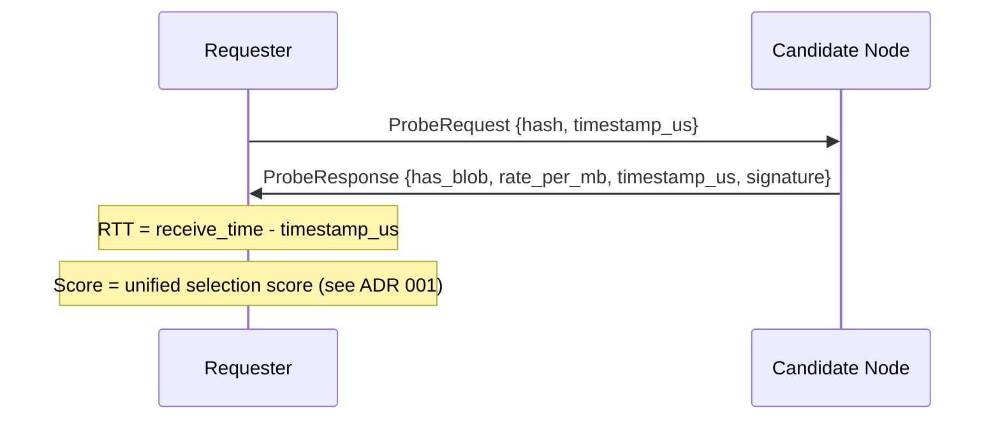
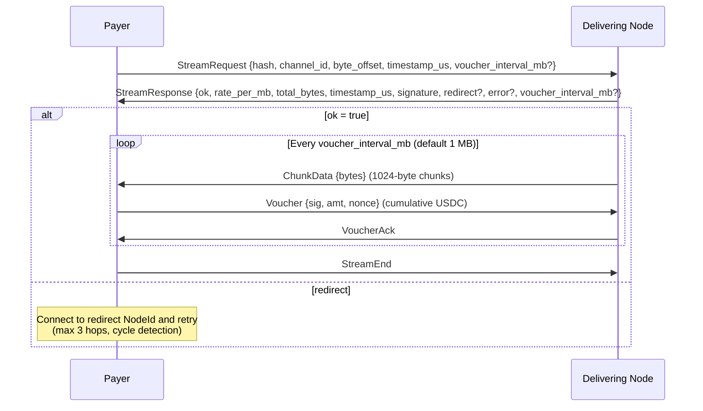
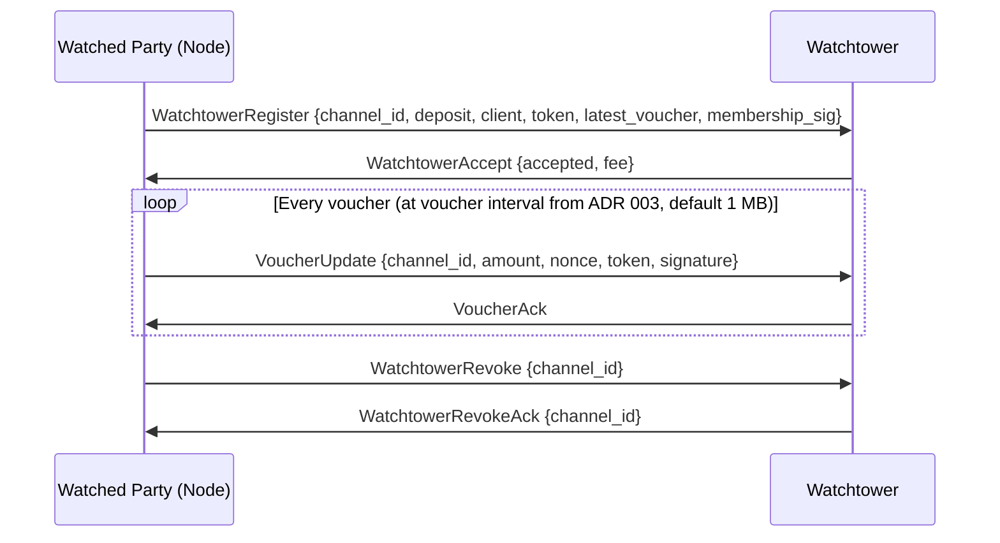
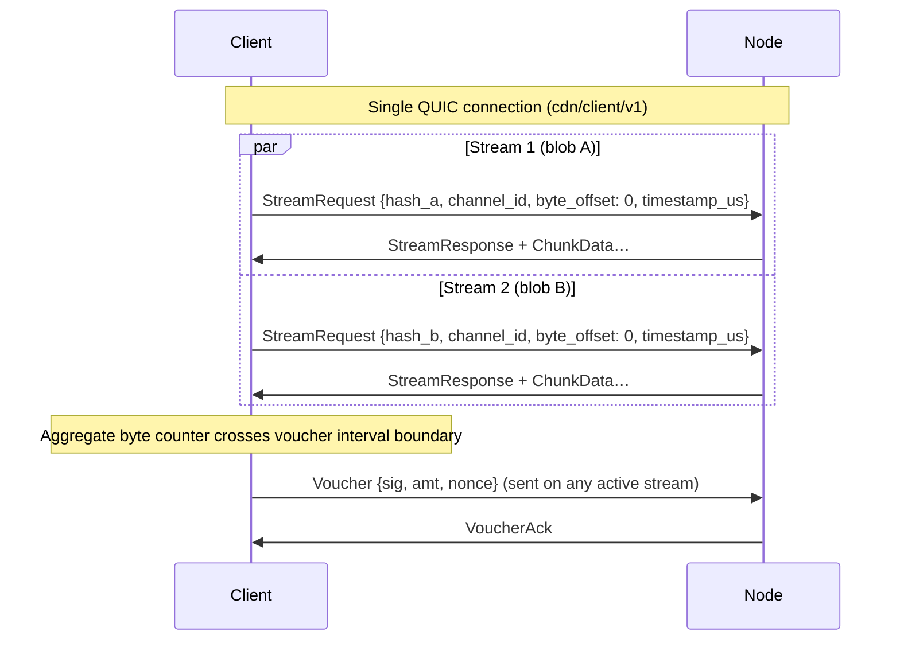

# ADR 005: Wire Protocol

**Date:** 2026-03-28
**Status:** Draft

## Context

Nodes and clients communicate over QUIC connections established via iroh. We need to define what protocols run over those connections: how a client or node requests a blob and pays for it, and how content availability is broadcast across the network.

The protocol layer must be distinct from the transport layer (iroh/QUIC) and the payment layer (vouchers, channels) so each can evolve independently.

## Decision

Four protocols: three negotiated via ALPN, plus the built-in iroh-gossip protocol:

| Protocol | Participants | Purpose |
| --- | --- | --- |
| `cdn/probe/v1` | any node ↔ any node | Latency and availability check before committing to a node |
| `cdn/client/v1` | payer ↔ delivering node | Paid blob delivery with payment vouchers (client→node, node→node on cache miss) |
| `cdn/watchtower/v1` | watched party (typically node) ↔ watchtower | Channel-dispute monitoring: voucher registration and updates (see ADR 007) |
| iroh-gossip (built-in) | all nodes | Node metadata announcements (`NodeAnnounce`), node discovery |

**Gossip topics.** The iroh-gossip protocol carries multiple message types on distinct topics:

| Topic | Message Type | Source ADR |
| --- | --- | --- |
| `cdn/global/v1`, `cdn/region/{cc}/v1` | `NodeAnnounce` | [ADR 001](001-network.md) |
| `cdn/reputation/v1` | `ReputationReport` | [ADR 008](008-reputation.md) |
| `cdn/global/v1` (production) | `WatchtowerAnnounce` | [ADR 007](007-watchtower.md) |

All gossip topics use the `cdn/` namespace prefix. `NodeAnnounce` and `ReputationReport` are active in production; `WatchtowerAnnounce` is a planned production extension for watchtower discovery at scale (PoC uses static watchtower lists — see [ADR 007](007-watchtower.md)).

**Note:** Key delivery (epoch keys, sealed envelopes) is handled by the app server — an external component communicating over WebSocket/SSE, not an iroh QUIC ALPN. See [ADR 006](006-e2e-encryption.md) for details.

### `cdn/probe/v1` — latency probe

Before opening a payment channel or sending a `StreamRequest`, a node probes candidates to measure round-trip latency and confirm the node has the blob:



`timestamp_us` is a requester-generated microsecond timestamp echoed back. RTT is `receive_time - timestamp_us`. `has_blob` confirms the node has the content. `rate_per_mb` lets the requester score candidates on both latency and price in a single round-trip.

`signature` is the candidate node's iroh private key signature over `{hash, has_blob, rate_per_mb, timestamp_us}`. This makes the probe response cryptographically attributable and enables two slashing mechanisms: (1) **phantom announcement slashing** — if `has_blob: true` in `ProbeResponse` but the node returns a signed `StreamResponse` with `ok: false` or a redirect for the same hash, the two signed messages are on-chain-verifiable evidence of a phantom announcement (the timeout/non-response case is handled separately — see ADR 003); (2) **rate manipulation slashing** — if `stream_response.timestamp_us >= probe_response.timestamp_us` and `stream_response.timestamp_us - probe_response.timestamp_us < 30_000_000` (30 seconds) and `stream_response.rate_per_mb > probe_response.rate_per_mb`, both signed messages constitute on-chain-verifiable evidence of bait-and-switch. Both `timestamp_us` values are requester-generated (the probe timestamp is echoed in `ProbeResponse`; `StreamResponse` echoes a separate requester timestamp from `StreamRequest`), so the on-chain verifier computes the delta from a single clock with no wall-clock reference needed. **Submitting slash evidence requires a challenge bond** (100 TOKEN in PoC, 50 TOKEN in production) — see [ADR 004](004-tokenomics.md#challenge-bond). The bond is returned if the challenge succeeds and forfeited if the node successfully counters, preventing zero-cost griefing via fabricated slash claims.

**Signer binding:** Both `ProbeResponse` and `StreamResponse` signatures bind to the signer's identity through the iroh connection's authenticated NodeId. The signed data does not redundantly include the NodeId, but on-chain slash evidence submissions must include the NodeId alongside the signature so the verifier can use that public key to verify the signatures and confirm both messages originate from the same node.

**Dependent parameters:** The probe cache TTL in [ADR 001](001-network.md) is derived as half this 30-second window (15 seconds). Changing the slashing window requires updating the probe cache TTL to maintain the invariant that cached probe responses remain within the slashable window. The `probe_hold_duration` (see below) is derived as this window plus 5-second margin; changing the slashing window requires updating both.

> **Derived constants:** All three timing parameters derive from a single base value: `PROBE_SLASH_WINDOW = 30s`. `probe_cache_ttl = PROBE_SLASH_WINDOW / 2 = 15s`. `probe_hold_duration = PROBE_SLASH_WINDOW + 5s margin = 35s`. Implementations SHOULD define `PROBE_SLASH_WINDOW` as a named constant and compute the others from it.

#### Probe-triggered eviction hold

When a node responds `has_blob: true` to a `ProbeRequest`, the node MUST ensure the blob is not evicted by LRU/LFU cache pressure for at least `probe_hold_duration` (35 seconds — the 30-second slashing window plus 5 seconds of margin for network latency). This is a local implementation requirement, not a wire protocol change — the `ProbeResponse` format is unchanged. The hold is implemented by marking the blob as eviction-exempt in the cache engine for `probe_hold_duration` after signing the response. If the cache engine cannot guarantee the hold (e.g., the blob is already being evicted, or the hold budget is exhausted), the node MUST respond `has_blob: false` rather than risk a phantom-announcement slash. This is consistent with the `BlobTooLarge` principle: a node MUST NOT sign `has_blob: true` unless it can deliver (see [Error Handling](#error-handling-and-retry-semantics)).

#### Hold budget

The total number of concurrently held blobs is bounded by `max_probe_holds` (default: 256, operator-configurable). Holds are per-blob, not per-probe — multiple peers probing the same blob share one hold slot, so the effective throughput is higher than `max_probe_holds / probe_hold_duration` for popular content. When all hold slots are occupied, additional probe requests for unheld blobs receive `has_blob: false` even if the blob is currently in cache. This bounds the effective cache size reduction from holds to at most `max_probe_holds` entries. Operators running small caches should set `max_probe_holds` proportional to their cache size (recommended: no more than 25% of cache capacity). Production nodes serving many peers should increase the default proportionally. The existing inbound probe rate limit (20 probes/peer/second — see [ADR 001](001-network.md)) bounds the rate at which any single peer can consume hold slots, but a coordinated probe flood from many peers (Sybil attack) can still exhaust the global budget — forcing the node to return `has_blob: false` for cached content. This is a degradation of availability, not a safety violation: the node loses revenue but is not falsely slashed. Operators may deploy additional global rate limits or DoS protections as needed.

#### Rate bounds validation

Before signing a `ProbeResponse` containing `rate_per_mb`, the node MUST verify that `rate_per_mb` falls within its locally cached rate bounds (`deliveryFloor <= rate_per_mb <= deliveryCeiling`). If the node's configured rate is outside the current bounds — for example, because governance adjusted the bounds while the node was running — the node SHOULD clamp `rate_per_mb` to the nearest bound and log a warning, rather than refusing to respond. This keeps the node operational during governance transitions; the clamping is temporary until the operator updates their rate configuration.

The same validation applies when the node signs a `StreamResponse` containing `rate_per_mb`. The node MUST verify bounds compliance before signing, using the same clamp-and-warn behavior.

**Requester-side validation (optional).** Requesters (clients and nodes performing cache-miss pulls) MAY reject `ProbeResponse` or `StreamResponse` messages where `rate_per_mb` falls outside their own cached rate bounds. This is a local policy decision, not a protocol requirement. A requester with stale bounds might incorrectly reject a legitimate rate after a governance change; therefore requesters SHOULD refresh their bounds (via `getRateBounds()`) before rejecting a rate as out-of-bounds.

Rate bounds are queried from the `StablePaymentChannel` contract via `getRateBounds()` and kept current via `RateBoundsUpdated` event subscription with periodic polling fallback. See [ADR 003 — Rate Bounds Refresh](003-payments.md#rate-bounds-refresh) for the refresh mechanism.

The requester probes all known peers in parallel (or checks the probe cache for recent results), waits between `probe_min_wait` (default 50ms) and `probe_max_wait` (default 500ms), then selects the winner using the unified selection score (see [ADR 001, Node Selection Algorithm](001-network.md#node-selection-algorithm)). The collection phase may exit early once at least `min_probe_responses` replies have been collected and a candidate passes the configured `early_exit_score_threshold`; see [ADR 001, Content Discovery](001-network.md#content-discovery-probe-fan-out) for the precise early-exit conditions and parameter definitions. The 500ms ceiling accommodates inter-continental RTTs. This applies to clients picking nodes and nodes picking peers for a cache miss pull.

**Probe responses are public information.** `ProbeRequest` requires no authentication — any node can probe any other node. The information revealed (content availability, pricing, node identity) is not confidential: node identities are listed in a public on-chain registry, content availability is discoverable via probing, and pricing is discoverable through probe and stream responses by design. Network topology can be inferred by probing many nodes, but this is an inherent property of any system where nodes must be discoverable to serve content. Operational mitigations such as rate limiting (see ADR 003, "Probe fishing") aim to bound the cost of bulk probing, but the specific mechanism is not yet decided; the design does not treat probe responses as secrets. The cryptographic signatures on probe responses exist for accountability (slashing evidence), not confidentiality.

### `cdn/client/v1` — paid delivery protocol

Used for all paid delivery: client→node and node→node (cache miss pull from an origin-backed or cached node).



**Client identity binding.** For clients using ephemeral (off-chain) NodeId-to-Ethereum-address bindings (see [ADR 003 — Off-Chain Ephemeral Binding](003-payments.md#off-chain-ephemeral-binding-for-clients)), the binding is conveyed via optional fields in `StreamRequest`:

```rust
struct StreamRequest {
    hash: Hash,
    channel_id: ChannelId,
    byte_offset: u64,
    timestamp_us: u64,
    voucher_interval_mb: Option<u64>,
    // Ephemeral client binding (optional; required on first request per connection)
    ethereum_address: Option<Address>,
    binding_signature: Option<Bytes>,  // EIP-712 BindNodeId signature
}
```

The client includes `ethereum_address` and `binding_signature` in the first `StreamRequest` on a connection. The node verifies the EIP-712 signature via `ecrecover`, caches the verified binding for the connection's lifetime, and uses the recovered address for `clientStakeOf` lookups and voucher attribution. Subsequent requests on the same connection may omit these fields. These are `Option` fields with `#[serde(default)]`, so peers that do not send them (e.g., nodes in node-to-node pulls where both sides have on-chain bindings) decode them as `None` — no ALPN version bump is needed since this is defined before the first implementation.

**Voucher wire format:** `Voucher {sig, amt, nonce}` above is shorthand. The EIP-712 signed data covers the full structure from [ADR 003](003-payments.md): `{channelId, amount, nonce, token}`. The fields `signature`, `amount`, and `nonce` are transmitted on the wire; the remaining fields are derived from stream context — `channel_id` is in `StreamRequest` and `token` is fixed at channel open. Including `nonce` explicitly (rather than relying on a monotonically incrementing implicit counter) prevents desynchronization if a `VoucherAck` is dropped. The receiver reconstructs the full typed data to verify the signature. This aligns with the watchtower `VoucherUpdate` below, which also includes `nonce` explicitly — though the watchtower version still requires `channel_id` and `token` because it lacks stream context.

The delivering node advertises its `rate_per_mb` in `StreamResponse`. The payer accepts by sending the first voucher or disconnects and tries another node. No surprise pricing. `timestamp_us` in `StreamResponse` is the requester-generated microsecond timestamp from `StreamRequest`, echoed back unchanged — the same pattern as `ProbeResponse`. The node's iroh key signs all security-relevant fields: `{hash, ok, rate_per_mb, total_bytes, channel_id, timestamp_us, redirect}`, making the response cryptographically binding. Signing the full response prevents a malicious party from altering unsigned fields while reusing a valid signature — in particular, `ok` is needed for phantom announcement evidence (proving a node signed `ok: false` after claiming `has_blob: true` in a probe), and `redirect` ensures a node cannot silently alter routing without accountability. A rate mismatch where `stream_response.rate_per_mb > probe_response.rate_per_mb` is slashable if `stream_response.timestamp_us >= probe_response.timestamp_us` and `stream_response.timestamp_us - probe_response.timestamp_us < 30_000_000` (30 seconds). The ordering check prevents unsigned integer underflow in the on-chain verifier. Because both `timestamp_us` values are requester-generated, the on-chain verifier computes this delta from the signed messages alone — no wall-clock reference or external time oracle is needed, and clock skew between the requester and the node does not affect the check. The `redirect` field in `StreamResponse` is used when a node cannot serve — it contains the NodeId of another node that can, never an external URL. The network is fully opaque.

**Redirect loop prevention.** The requester MUST enforce:
1. **Hop limit:** maximum 3 redirects per original request. After 3 redirects, the requester treats the request as failed (no more redirects followed).
2. **Cycle detection:** the requester tracks the set of NodeIds visited for each request. A redirect to an already-visited NodeId is rejected immediately.
3. **Failure handling:** when the redirect limit is reached or a cycle is detected, the requester falls back to the next-best node from the original probe results (same as a `ok: false` response).

`byte_offset` supports seek and resume: on failover, the requester reconnects to a different node and resumes from the last BLAKE3-verified byte.

**Voucher interval negotiation.** The optional `voucher_interval_mb` field in `StreamRequest` proposes a larger-than-default voucher cadence for this stream (see [ADR 003 — Voucher Interval Negotiation](003-payments.md#voucher-interval-negotiation)). If present, the node responds with its accepted interval in `StreamResponse.voucher_interval_mb` — which may be equal to or smaller than the proposed value. If absent from either message, both sides default to 1 MB. The `voucher_interval_mb` field is **not** included in the `StreamResponse` signature because it is a delivery-layer optimization, not a security-relevant field — the node can always enforce a smaller interval unilaterally by pausing delivery.

The protocol is self-enforcing: payer stops sending vouchers → delivering node stops sending chunks; delivering node stops sending chunks → payer stops sending vouchers.

### Gossip — node metadata

Node metadata is broadcast over iroh-gossip on region-scoped topics (`cdn/region/{cc}/v1`) and a global topic (`cdn/global/v1`). All staked nodes publish `NodeAnnounce` messages containing node-level metadata: region, load hint, and a list of popular hashes (max 20). `NodeAnnounce` does not carry content inventories — content discovery is handled on-demand via `cdn/probe/v1` fan-out. See [ADR 001](001-network.md) for the full `NodeAnnounce` struct definition including `LoadHint`.

Region codes (`{cc}` in topic names) are self-declared ISO 3166-1 alpha-2 country codes carried in each node's `NodeAnnounce`. Gossip validation ([ADR 001](001-network.md)) enforces that the `region` field is exactly 2 ASCII uppercase letters matching a known ISO 3166-1 alpha-2 code — messages with invalid region values are dropped. Misreporting a valid but incorrect region is mitigated by latency-based reputation scoring: clients penalize nodes whose observed RTT contradicts the claimed region (e.g., RTT > 150 ms to a node in the same claimed region). See [ADR 001](001-network.md) for the full `NodeAnnounce` struct, gossip validation rules, and region-misreporting mitigation details.

Gossip messages are lightweight (~800 bytes worst case), well within iroh-gossip message limits. Clients and nodes maintain a peer table (`NodeId → NodeAnnounce`) from received messages. The probe step determines which peers hold specific content, along with their cost and latency.

### `cdn/watchtower/v1` — channel-dispute monitoring

Used by either channel party (typically the node) to register payment channels with a watchtower service that monitors for on-chain disputes. The full protocol design is specified in ADR 007.



The watched party sends its latest voucher on registration and streams updates as new vouchers arrive during delivery. `client` is the voucher signer's Ethereum address (replaces the former `counterparty` field for clarity). `token` is the ERC-20 token address for this channel — required because the watchtower must reconstruct the EIP-712 typed data for off-chain signature verification and needs the token address to do so. Together with the watchtower's configured `contract` address and `chain_id`, these fields enable full off-chain EIP-712 verification. `latest_voucher` has the same shape as `VoucherUpdate`: `{channel_id, amount, nonce, token, signature}`. If no vouchers have been exchanged yet, `latest_voucher` is omitted (the watchtower registers the channel with `amount=0, nonce=0`). If the client initiates an on-chain close with a stale (lower-nonce) voucher, the watchtower submits a `disputeChannel` transaction with the latest voucher it holds. The watchtower is non-custodial — it cannot steal funds, worsen settlement, or grief; the voucher's EIP-712 signature is the only authorisation the contract checks.

### Connection Management

One QUIC connection per `(local_node, remote_node, ALPN)` tuple. Multiple requests to the same node on the same protocol reuse the existing connection via QUIC's native stream multiplexing — each `StreamRequest` opens a new bidirectional QUIC stream. A client fetching 100 blobs from one node opens 1 connection with 100 concurrent streams, not 100 connections.

Different ALPNs require separate connections (TLS ALPN is negotiated at connection establishment). A `cdn/probe/v1` connection and a `cdn/client/v1` connection to the same node are always distinct.

#### Concurrent stream limits

Maximum concurrent bidirectional streams per connection, set via QUIC transport parameter `initial_max_streams_bidi`:

| ALPN | Max streams | Rationale |
| --- | --- | --- |
| `cdn/client/v1` | 100 | Enough parallelism for bulk fetching (e.g., video manifest + segments) without exhausting server resources |
| `cdn/probe/v1` | 1 | Single request-response; the connection is reused for sequential probes to the same node |
| `cdn/watchtower/v1` | 10 | Allows concurrent updates for up to 10 registered channels; a node with more channels multiplexes updates over the available streams (sufficient for PoC; production nodes with many concurrent channels should open multiple connections or increase this limit via transport parameter negotiation) |

Stream concurrency is enforced via QUIC's `MAX_STREAMS` transport parameter: a peer MUST NOT open a new bidirectional stream beyond the advertised limit (doing so is a protocol violation resulting in `STREAM_LIMIT_ERROR` and connection close). The receiver grants additional credit by sending `MAX_STREAMS` updates as existing streams close.

#### Payment channels and concurrent streams

A single `channel_id` can be shared across concurrent streams on the same connection. Vouchers are cumulative across **all** streams on the channel:



The payer maintains **one aggregate byte counter per channel**. When the counter crosses the next voucher interval boundary (default 1 MB; negotiable per-stream — see [ADR 003 — Voucher Interval Negotiation](003-payments.md#voucher-interval-negotiation)), it issues the next cumulative voucher on any active stream sharing that channel. When multiple streams on the same channel have different negotiated intervals, the effective interval for the channel is the **minimum** across all active streams. The delivering node tracks total bytes sent across all streams on the channel and **pauses all streams** if the voucher deficit exceeds the effective interval — the self-enforcing threshold is applied collectively, not per-stream.

Implementation constraint: the payer must have a single voucher-signing task per channel that aggregates byte counts from all streams, rather than independent per-stream voucher logic.

#### Connection lifetime

- Connections remain open while any stream is active or any sent voucher is awaiting `VoucherAck` (on-chain channel closure does not affect connection lifetime).
- **Idle timeout:** 30 seconds after the last stream closes and no unacknowledged vouchers remain in flight. Endpoints SHOULD send periodic QUIC PING frames when otherwise idle, with a default interval of 10 seconds (below the idle timeout) to prevent NAT middleboxes from dropping the mapping.
- **`cdn/watchtower/v1` exception:** watchtower connections are long-lived by design (ADR 007). No idle timeout while any channel is registered.

### Error Handling and Retry Semantics

When a `StreamResponse` returns `ok: false`, the response includes an error code indicating the reason:

```rust
enum StreamError {
    NotFound,          // Node does not have the blob (cache miss, no origin)
    Overloaded,        // Node is at capacity; try another node
    BlobTooLarge,      // Blob exceeds this node's configured max_blob_size; do not retry this node
    InternalError,     // Unexpected failure; do not retry this node
    EvictedSinceProbe, // Blob was evicted between probe and stream request — WARNING: still slashable after a signed has_blob:true probe (see below)
}
```

**`EvictedSinceProbe` semantics.** This error code is informational only (unsigned, like all error codes — see below). It signals to the requester that the node had the blob at probe time but lost it due to cache pressure. The requester MUST NOT retry the same node for this blob — the blob is no longer in cache. The requester falls back to the next-best provider, identical to `NotFound` handling. **Warning:** Returning `EvictedSinceProbe` in a signed `StreamResponse` with `ok: false` within the 30-second slashing window still constitutes valid phantom-announcement slash evidence — the error code is unsigned and invisible to the on-chain verifier. Implementations MUST NOT treat this error code as a "safe" way to refuse a stream after a positive probe. A well-implemented node using probe-triggered eviction holds (see [Probe-Triggered Eviction Hold](#probe-triggered-eviction-hold)) should rarely return this error under normal operation; its presence at significant rates indicates a failure to respect hold commitments (implementation bug or resource exhaustion such as OOM), not a budget configuration issue — an undersized `max_probe_holds` budget causes the node to respond `has_blob: false` at probe time, preventing the stream request entirely.

**`BlobTooLarge` enforcement:** Nodes may configure a `max_blob_size` limit (PoC recommended default: 10 GB). When deciding whether to serve a blob, a node enforces `max_blob_size` against locally known blob metadata (its cache index or origin catalog). If the locally known size exceeds `max_blob_size`, the node returns `StreamResponse {ok: false, error: BlobTooLarge}`. On a cache-miss pull from an upstream node, the pulling node additionally enforces `max_blob_size` against `StreamResponse.total_bytes`: if the upstream `total_bytes` exceeds the pulling node's `max_blob_size`, the pulling node aborts the upstream stream and returns `BlobTooLarge` to the original requester. The limit applies to individual blobs.

**Probe interaction:** A node MUST NOT respond `has_blob: true` in a `ProbeResponse` for blobs whose locally known size exceeds its `max_blob_size`. Responding `has_blob: true` and then returning `ok: false` with `BlobTooLarge` constitutes phantom-announcement slash evidence (the error code is unsigned, so the on-chain verifier cannot distinguish it from a malicious refusal). For cache-miss pulls where the pulling node does not yet know the blob size, this is not a risk — the pulling node already responded `has_blob: false` to the probe (it does not have the blob in cache), so phantom-announcement slashing does not apply.

**Retry behavior:**

1. On `ok: false` or connection failure, the requester does **not** retry the same node for the same blob hash. For `BlobTooLarge`, the requester MUST NOT retry the same node — the limit is a stable node policy, not a transient condition like `Overloaded`. Since `max_blob_size` is per-node, a different node may accept the blob.
2. The requester falls back to the next-best candidate from the original probe results (sorted by unified selection score — see [ADR 001](001-network.md#node-selection-algorithm)).
3. Maximum 3 total attempts (including the first) per blob request. After 3 failures, the request is surfaced as an error to the caller.
4. **Per-attempt timeout:** 10 seconds from `StreamRequest` to first `ChunkData`. If no data arrives within 10 seconds, the requester treats it as a connection failure and moves to the next candidate.
5. **Mid-stream failure:** if chunks stop arriving mid-delivery, the requester waits 10 seconds, then reconnects to the next candidate with `byte_offset` set to the last BLAKE3-verified byte.

The error code is **not** included in the `StreamResponse` signature — it is informational only and not used for slashing evidence.

### Serialization

All protocol messages use [postcard](https://docs.rs/postcard) — compact, no-std friendly, serde-based. Standard in the iroh ecosystem; avoids introducing a second serialization dependency alongside what iroh already uses internally.

## Consequences

**Positive:**

- ALPN separation means a single iroh `Endpoint` dispatches all connection types without ambiguity
- Probing in parallel before committing means no payment channel is opened with a slow or unresponsive node
- `cdn/client/v1` is reused for all paid delivery — no separate protocol needed for node→node pulls
- `redirect` always points to a NodeId, never an external URL; the backend topology of origin-backed nodes is fully hidden from the network
- The delivery protocol is self-enforcing — payment and data flow are coupled by design
- `byte_offset` in `StreamRequest` makes failover transparent; the requester resumes without restarting the stream
- QUIC stream multiplexing allows concurrent blob requests to the same node without additional connection overhead — one handshake cost regardless of how many blobs are fetched
- A shared `channel_id` across concurrent streams amortizes on-chain channel costs: one channel per (client, node) pair regardless of request volume

**Negative:**

- Probe RTT includes iroh's NAT traversal overhead on first connection, inflating the latency estimate. Reusing existing connections for probes gives a cleaner signal.
- A node under load can respond to probes quickly but deliver slowly — probe RTT is necessary but not sufficient. Reputation (separate system) provides the longer-term signal.
- The `cdn/client/v1` voucher cadence (default 1 MB, negotiable up to ~1 GB) is coarser than iroh-blobs' internal chunk granularity (1024 bytes); the payment layer and transfer layer operate at different tick rates, requiring a buffering layer between them
- Concurrent streams sharing a `channel_id` require the payer to maintain a single aggregate byte counter and voucher-signing task per channel; per-stream independence is lost for payment tracking
- The delivering node enforces the voucher deficit threshold across all streams collectively — a slow voucher on one stream pauses all streams on that channel
- Different ALPNs require separate QUIC connections; probing a node via `cdn/probe/v1` and then fetching via `cdn/client/v1` incurs two handshake costs to the same peer. **PoC acceptance:** two connections per node interaction is acceptable at PoC scale (tens of nodes, moderate traffic). **Production optimization:** investigate iroh ALPN multiplexing (negotiating multiple ALPNs on a single connection) or a unified `cdn/v2` ALPN that combines probe and delivery as sub-protocols within one connection. The two-connection overhead is ~1 additional RTT per node interaction — significant for latency-sensitive clients but not a correctness issue
- Postcard has no schema evolution story — adding fields requires a new ALPN version (`cdn/client/v2`); version negotiation must be planned before the first breaking change
- The `voucher_interval_mb` field in `StreamRequest`/`StreamResponse` is optional and defaults to 1 MB if absent — this allows backward compatibility with older peers without requiring a new ALPN version. However, this is a one-time workaround; any future mandatory field addition still requires `cdn/client/v2`
- `StreamRequest` includes a requester-generated `timestamp_us` that the node echoes in `StreamResponse`. A malicious requester could craft timestamps to make a legitimate rate change (probe 60 seconds ago, rate changed since) appear within the 30-second slashing window. The challenge bond ([ADR 004](004-tokenomics.md#challenge-bond)) deters this in both PoC and production: the bond (100 TOKEN in PoC, 50 TOKEN in production) is forfeited if the node successfully counters within the 24-hour counter-window, e.g. by showing a rate change published via gossip between the two timestamps
