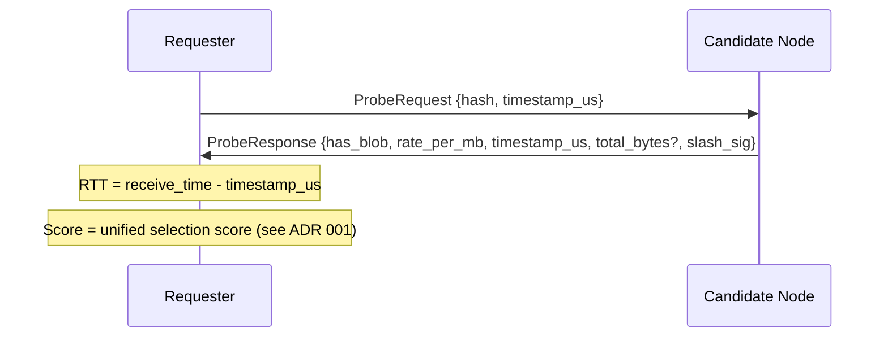
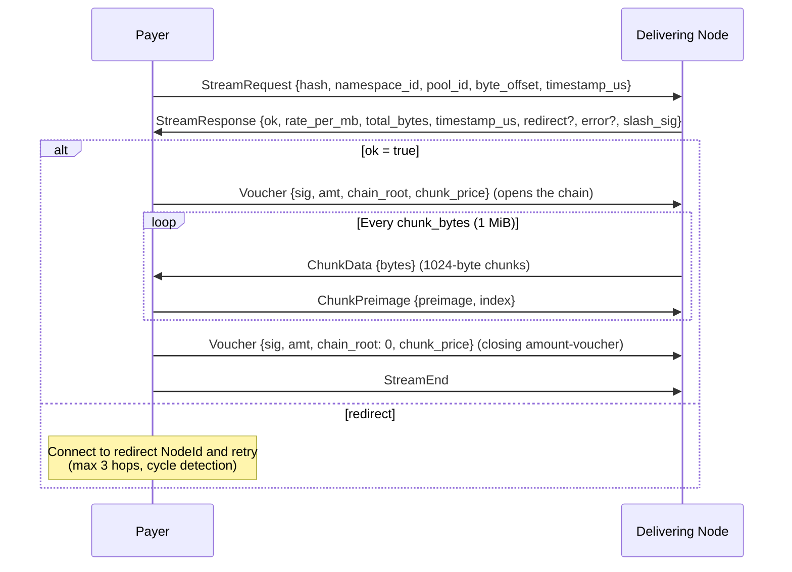
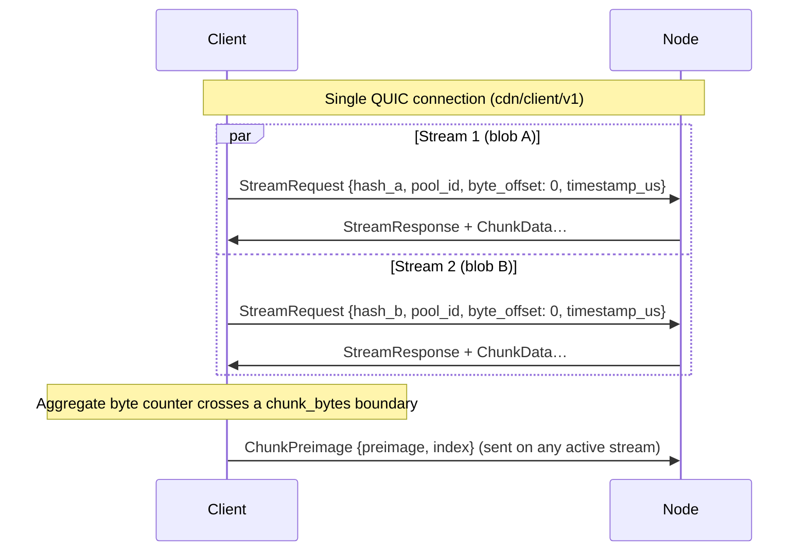

# ADR 005: Wire Protocol

**Date:** 2026-03-28
**Status:** Accepted

## Context

Nodes and clients communicate over QUIC connections established via iroh. This ADR defines what protocols run over those connections: how a client or node requests a blob and pays for it, and how a node discovers content across the network.

The protocol layer is distinct from the transport layer (iroh/QUIC) and the payment layer (vouchers, pools) so each can evolve independently.

## Decision

Three core protocols negotiated via ALPN:

| Protocol | Participants | Purpose |
| --- | --- | --- |
| `cdn/probe/v1` | any node ↔ any node | Latency and availability check before committing to a node |
| `cdn/client/v1` | payer ↔ delivering node | Paid blob delivery with payment vouchers (client→node, node→node on cache miss) |
| `cdn/dht/v1` | any node ↔ any node | Kademlia content discovery (FIND_VALUE / STORE / FIND_NODE) — see [ADR 022](022-content-discovery.md#adr-022--content-discovery-at-scale) |

There is no protocol-level role for settlement monitoring — anyone may run an off-chain analyzer against the L2 chain ([Appendix: Settlement Analysis](appendix-fraud-detection.md#appendix-permissionless-settlement-analysis)).

### Rate discovery

The current rate is included in every signed `ProbeResponse`; clients query rates by probing. A node's last probe-quoted rate is binding for any stream opened within the 30-second slashing window — see [`cdn/probe/v1` — latency probe](#cdnprobev1--latency-probe) and the rate-manipulation slashing path in [ADR 014](014-on-chain-verification.md#adr-014-on-chain-verification-for-slashing-evidence).

### `cdn/probe/v1` — latency probe

Before opening a payment pool or sending a `StreamRequest`, a node probes candidates to measure round-trip latency and confirm the node has the blob:



`timestamp_us` is a requester-generated microsecond timestamp echoed back; RTT is `receive_time - timestamp_us`. `has_blob` confirms the node has the content. The protocol does not distinguish origin from cache at probe time — origin status is a publisher-level commitment recorded in `OriginAssignment` (see [ADR 011 § Origin Assignment Authority](011-content-takedown.md#origin-assignment-authority)) and discoverable off-chain via `OriginAssignment.getOrigins(namespaceId)`; the wire response describes only "I have the bytes and will serve them at this rate." Cache-only serving is permissionless and indistinguishable from origin serving over the wire — correct, since clients verify bytes via BLAKE3 regardless of who served them. `rate_per_mb` lets the requester score candidates on both latency and price in a single round-trip. `total_bytes` is an optional unsigned field for the blob's total size in bytes, letting the requester estimate total cost before committing to a node or opening a payment pool; nodes SHOULD include it when the blob size is known. The field is not covered by `slash_sig` — it is not needed for any slashing mechanism and follows the Tier 1 minor evolution pattern from [ADR 013](013-schema-evolution.md#tier-1--minor-no-coordination).

`slash_sig` is the candidate node's EIP-712 secp256k1 signature over `{hash, has_blob, rate_per_mb, timestamp_us}`, signed with the operator's Ethereum key registered in `CapacityBond` ([ADR 003 § NodeId-to-Ethereum Binding](003-payments.md#nodeid-to-ethereum-binding)). The signed-field set is the v1 baseline; per [ADR 013 § Signed Field Freezing](013-schema-evolution.md#signed-field-freezing), any subsequent change to this set is a Tier 3 ALPN bump. The signature makes the probe response cryptographically attributable to a registered node and underpins probe-derived slash evidence. It enables **rate manipulation slashing** — if `stream_response.timestamp_us >= probe_response.timestamp_us` and `stream_response.timestamp_us - probe_response.timestamp_us < 30_000_000` (30 seconds) and the stream is a delivery (`ok: true`) at `stream_response.rate_per_mb > probe_response.rate_per_mb`, both signed messages constitute on-chain-verifiable evidence of bait-and-switch — and it also underpins **blacklist-violation** evidence, attributing service of a blacklisted hash to the registered node. Evidence age is bounded by the existing `Max evidence age` parameter ([ADR 009](009-governance.md#adr-009-governance-model)) so honest operators are never exposed to indefinite slash risk from old probes. Both `timestamp_us` values are requester-generated (the probe timestamp echoed in `ProbeResponse`; `StreamResponse` echoes a separate requester timestamp from `StreamRequest`), so the on-chain verifier computes the delta from a single clock with no wall-clock reference. **Submitting slash evidence requires a 100 TOKEN challenge bond** — see [ADR 026 § Slashing and burn](026-tokenomics.md#slashing-and-burn) — returned if the challenge succeeds, forfeited if the node successfully counters, preventing zero-cost griefing via fabricated slash claims.

**Signer binding:** Connection-level peer identity is authenticated by the iroh QUIC handshake against the registered NodeId (Ed25519). Message-body attribution and on-chain slash evidence both rely on `slash_sig`: verifiers recover the Ethereum address via `ecrecover` (3,000 gas on-chain) and confirm it maps to the expected NodeId via `CapacityBond.nodeIdOf` ([ADR 003 § NodeId-to-Ethereum Binding](003-payments.md#nodeid-to-ethereum-binding)). `slash_sig` is mandatory and non-empty on every `ProbeResponse` and `StreamResponse` — no opt-out. Requesters MUST reject responses with missing or zero-length `slash_sig`. See [ADR 014](014-on-chain-verification.md#adr-014-on-chain-verification-for-slashing-evidence) for the EIP-712 type definitions and `SlashJudge` contract interface.

**Dependent parameters:** The probe cache TTL in [ADR 001](001-network.md#adr-001-network-topology-and-peer-mesh) is half this 30-second window (15 seconds), keeping any stream opened from a cache hit within the slashable window; `probe_hold_duration` (see below) is this window plus 5-second margin. Changing the slashing window requires updating both.

> **Derived constants:** All three timing parameters derive from a single base value: `PROBE_SLASH_WINDOW = 30s`. `probe_cache_ttl = PROBE_SLASH_WINDOW / 2 = 15s`. `probe_hold_duration = PROBE_SLASH_WINDOW + 5s margin = 35s`. Implementations SHOULD define `PROBE_SLASH_WINDOW` as a named constant and compute the others from it.

#### Probe-triggered eviction hold

When a node responds `has_blob: true` to a `ProbeRequest`, it SHOULD keep the blob eviction-exempt from LRU cache pressure (see [appendix-blob-cache-eviction.md](appendix-blob-cache-eviction.md#appendix-blob-cache-eviction-policy)) for at least `probe_hold_duration` (35 seconds — enough to cover the probe→pull round trip) so the follow-up pull is still served. This is a local implementation requirement, not a wire protocol change — the `ProbeResponse` format is unchanged. The hold is **best-effort**: it marks the blob eviction-exempt in the cache engine for `probe_hold_duration` after signing the response, but `has_blob` reflects presence, not a guaranteed hold. A node MUST respond `has_blob: false` when the blob is genuinely absent or operator-evicted (this matches the `BlobTooLarge` principle: never advertise a blob it cannot serve — see [Error Handling](#error-handling-and-retry-semantics)); when the blob is present but the hold budget is exhausted, it still advertises `has_blob: true` and simply forgoes the hold — the blob may then be LRU-evicted before the pull, costing one wasted round trip. That is never a slash (no offense pairs a probe with a later miss, [ADR 014](014-on-chain-verification.md#adr-014-on-chain-verification-for-slashing-evidence)) and carries no reputation penalty either: a `NotFound` is not attributable to the responder, so the requester briefly suppresses the (peer, hash) pair without scoring the peer ([ADR 008](008-reputation.md#adr-008-reputation-system)). Implementations SHOULD expose `probe_hold_unavailable` (labeled by `reason`) and `probe_hold_slots_used` metrics — see [Appendix: Observability](appendix-observability.md#appendix-observability-and-metrics).

#### Hold budget

The total number of concurrently held blobs is bounded by `max_probe_holds` (default: 256, operator-configurable). Holds are per-blob, not per-probe — multiple peers probing the same blob share one hold slot, so effective throughput exceeds `max_probe_holds / probe_hold_duration` for popular content. When all hold slots are occupied, a probe for a held blob still receives `has_blob: true` but the blob gets no eviction hold, so it may be LRU-evicted before the pull. This bounds the number of eviction-exempt blobs to at most `max_probe_holds` (setting `max_probe_holds = 0` disables holds entirely and opts the node out of advertising *store-backed* content — probes answer `has_blob: false` for it. Content servable from a configured origin takes no eviction hold and is therefore unaffected by this setting: such a node still advertises origin-servable hashes). Operators running small caches should set `max_probe_holds` proportional to cache size (recommended: no more than 25% of cache capacity); production nodes serving many peers should increase the default proportionally. The existing inbound probe rate limit (5 probes/peer/second — see [ADR 001](001-network.md#adr-001-network-topology-and-peer-mesh)) bounds the rate at which any single peer can consume hold slots. Coordinated probe floods across many peers (Sybil attack) are bounded by the per-IP and global layers in [§ Probe rate limiting](#probe-rate-limiting) below — admission to the hold path occurs only after all three rate-limit layers pass. Hold-budget exhaustion at the admitted rate is an availability degradation: the node still wins selection on the unheld probes but loses the delivery whenever the blob is evicted before the pull arrives.

#### Rate bounds validation

Before signing a `ProbeResponse` containing `rate_per_mb`, the node MUST verify that `rate_per_mb` is at least its locally cached `deliveryFloor`. If the node's configured rate is below the current floor — e.g., governance raised it while the node was running — the node SHOULD raise `rate_per_mb` to the floor and log a warning rather than refusing to respond, keeping the node operational during governance transitions until the operator updates their rate configuration. The clamp only ever raises: there is no governance ceiling, and `MAX_RATE_PER_MB` bounds the field above at the wire layer.

The same validation applies when the node signs a `StreamResponse` containing `rate_per_mb`: the node MUST verify the floor before signing, with the same clamp-and-warn behavior. Each clamping event SHOULD increment the `rate_bounds_clamp_events` metric — see [Appendix: Observability](appendix-observability.md#appendix-observability-and-metrics).

##### Requester-side validation (optional)

Requesters (clients and nodes performing cache-miss pulls) MAY reject `ProbeResponse` or `StreamResponse` messages whose `rate_per_mb` they consider too expensive. This is a local policy decision, not a protocol requirement — the buyer sees the signed rate before it pays anything, which is what makes a governance ceiling unnecessary.

The rate floor is queried from the `PaymentPool` contract via `getRateBounds()` and kept current via `RateBoundsUpdated` event subscription with periodic polling fallback. See [ADR 003 — Rate Bounds Refresh](003-payments.md#rate-bounds-refresh) for the refresh mechanism.

The requester issues a `cdn/dht/v1` FIND_VALUE lookup for the target hash, then probes the returned candidate set concurrently via `cdn/probe/v1` (or checks the probe cache for recent results), collecting responses until a 500ms timeout, then selects the winner using the unified selection score (see [ADR 001, Node Selection Algorithm](001-network.md#node-selection-algorithm)). See [ADR 001, Content Discovery](001-network.md#content-discovery-dht--probe) and [ADR 022](022-content-discovery.md#adr-022--content-discovery-at-scale) for the full discovery flow. The 500ms ceiling accommodates inter-continental RTTs. This applies to clients picking nodes and nodes picking peers for a cache miss pull.

**Probe responses are public information.** `ProbeRequest` requires no authentication — any node can probe any other node. The information revealed (content availability, pricing, node identity) is not confidential by design: node identities are in a public on-chain registry, and availability/pricing are discoverable through probe and stream responses. Network topology can be inferred by bulk probing, but this is inherent to any system where nodes must be discoverable to serve content; operational mitigations to bound the cost of bulk probing are specified in [§ Probe rate limiting](#probe-rate-limiting) below. The cryptographic signatures on probe responses exist for accountability (slashing evidence), not confidentiality.

#### Probe rate limiting

`cdn/probe/v1` inbound requests are subject to three layered token-bucket rate limits applied **before** any signature is computed and **before** any [Probe-Triggered Eviction Hold](#probe-triggered-eviction-hold) slot is allocated. A probe must pass all three layers to be admitted; failing any layer closes the stream with QUIC application error code `0x10` (`RATE_LIMITED`) per [ADR 013 § Application Error Codes](013-schema-evolution.md#application-error-codes).

| Layer | Default refill | Default burst | Hard bounds | Scope |
|---|---:|---:|---|---|
| Per-peer (NodeId) | 5 probes/sec | 5 | (existing — [ADR 001, Content Discovery](001-network.md#content-discovery-dht--probe)) | The source iroh `NodeId` on the QUIC connection. |
| Per-IP | 50 probes/sec | 200 | refill `[10, 1000]`; burst `[refill, 5×refill]` | The QUIC source IP after iroh-relay unwrapping for relay-routed connections. |
| Global node | 1000 probes/sec | 2000 | refill `[100, 100000]`; burst `[refill, 10×refill]` | Single global bucket across all probes inbound to this node. |

Checks fire cheapest-first (global → per-IP → per-peer) so a probe rejected by the global cap never costs a per-IP-bucket lookup. Each admitted probe consumes one token from each bucket.

**Why three layers, not one.** Per-peer alone is bypassable: clients are unstaked and can rotate `NodeId` for free per [ADR 003 § Probe fishing](003-payments.md#probe-fishing). The per-IP layer raises the cost of bulk probing — IP rotation requires money (proxies, IPv6 prefix delegation, cloud bills) and disadvantages bulk-probers without disadvantaging staked node-to-node traffic, which uses stable IPs. The global cap is defence in depth against distributed attacks across many IPs that would otherwise exhaust the node's per-probe signing capacity.

**Interaction with the hold budget.** Because the rate limiter fires before the hold-allocation path, a rate-limited probe never consumes a hold slot. The hold-budget exhaustion concern in [§ Hold budget](#hold-budget) is therefore bounded by the **admitted** probe rate, not the offered load — a probe flood exceeding the rate limits cannot exhaust the hold budget.

**Metrics.** Naming follows [appendix-observability.md](appendix-observability.md#appendix-observability-and-metrics).

| Metric | Type | Description |
|---|---|---|
| `decdn_probe_rate_limit_rejected_{per_peer,per_ip,global}_total` | three counters, unlabeled | Probes rejected by the rate limiter, one sibling counter per layer that rejected first. Sibling counters rather than a `layer` label, per the sibling-counter convention — see [appendix-observability.md § Reason splits](appendix-observability.md#reason-splits-sibling-counters-not-labels). No single labelled `decdn_probe_rate_limit_rejections_total` counter exists; the three sibling counters above are the only export. |

### `cdn/client/v1` — paid delivery protocol

Used for all paid delivery: client→node and node→node (cache miss pull from an origin-backed or cached node). A delivering node MAY satisfy a request for a blob it does not hold by pulling through from the network — not only from its own configured origin — and serving the result, governed by the ramped credit window in [ADR 037](037-regional-proxy-warming.md#adr-037-latency-driven-proxy-warming-for-regional-locality); this is the mechanism that warms a regional copy. A warming proxy holds no record at probe time and answers `has_blob: false` to any probe, so it never advertises a blob it lacks (cf. § Probe interaction). `NotFound` is returned only when the node neither holds the blob nor can reach a provider for it, or declines to pull through under its window policy.



#### Client identity binding

For clients using ephemeral (off-chain) NodeId-to-Ethereum-address bindings (see [ADR 003 — Off-Chain Ephemeral Binding](003-payments.md#off-chain-ephemeral-binding-for-clients)), the binding is conveyed via optional fields in `StreamRequest`:

```rust
struct StreamRequest {
    hash: Hash,
    namespace_id: U256,  // 0 = no namespace (cache/DHT only); non-zero routes to that namespace's authorized origins
    pool_id: PoolId,
    byte_offset: u64,
    byte_len: u64,       // 0 = to end-of-blob; else bound the range to [byte_offset, byte_offset + byte_len)
    timestamp_us: u64,
    // Ephemeral client binding (optional; required on first request per connection)
    ethereum_address: Option<Address>,
    binding_signature: Option<Bytes>,  // EIP-712 BindNodeId signature
}
```

The client includes `ethereum_address` and `binding_signature` in the first `StreamRequest` on a connection. The node verifies the EIP-712 signature via `ecrecover` and caches the verified binding for the connection's lifetime. Voucher attribution does not come from the binding: the address a voucher must recover to is the capability-authorized `signer` for the pool ([ADR 003 § PaymentPool](003-payments.md#paymentpool)). The binding is a gate against it — a request whose voucher `signer` is not the bound address is refused before any bytes are delivered, since its vouchers would fail verification anyway. Subsequent requests on the same connection may omit these fields. These are `Option` fields in the `StreamRequestExt` extensions struct, defaulting to `None` when absent via the two-phase deserialization pattern defined in [ADR 013](013-schema-evolution.md#tier-1--minor-no-coordination). Peers that do not send them (e.g., nodes in node-to-node pulls where both sides have on-chain bindings) produce frames without extension bytes, and the receiver fills `StreamRequestExt::default()` — no ALPN version bump is needed since this is defined before the first implementation.

**Voucher wire format:** `Voucher {sig, amt, chain_root, chunk_price}` above is shorthand. The EIP-712 signed data covers the full structure from [ADR 003](003-payments.md#adr-003-payment-model): `{poolId, signer, provider, amount, bytesDelivered, chainRoot, chunkPrice}`. The fields `signature`, `amount`, `chain_root`, and `chunk_price` are transmitted on the wire; the rest are derived from stream context — `pool_id` is in `StreamRequest`, `signer` is the requester's verified Ethereum address (from the ephemeral `StreamRequestExt` binding when present, otherwise from the requester's on-chain registration, as in node-to-node pulls), `provider` is the delivering node, and `bytesDelivered` is the node's per-lane cumulative byte counter. Vouchers carry no nonce — ordering and replay are handled by the monotone cumulative `amount` alone, and preimages by their chain index (see [ADR 003 § Voucher ordering](003-payments.md#voucher-ordering)). The receiver reconstructs the full typed data to verify the signature.

The delivering node advertises its `rate_per_mb` in `StreamResponse`. The payer accepts by sending the first voucher or disconnects and tries another node — no surprise pricing. `timestamp_us` in `StreamResponse` is the requester-generated microsecond timestamp from `StreamRequest`, echoed back unchanged — same pattern as `ProbeResponse`. `slash_sig` is an EIP-712 secp256k1 signature over `{hash, ok, rate_per_mb, total_bytes, pool_id, timestamp_us, redirect}`, signed with the operator's Ethereum key and verifiable via `ecrecover` — see [ADR 014](014-on-chain-verification.md#adr-014-on-chain-verification-for-slashing-evidence). It is mandatory and non-empty on every `StreamResponse`. Signing the full response prevents a malicious party from altering unsigned fields while reusing a valid signature — `ok` and `redirect` are message-integrity fields that ensure a node cannot silently alter delivery status or routing without accountability. A rate mismatch where `stream_response.rate_per_mb > probe_response.rate_per_mb` is slashable if `stream_response.timestamp_us >= probe_response.timestamp_us` and `stream_response.timestamp_us - probe_response.timestamp_us < 30_000_000` (30 seconds); the ordering check prevents unsigned integer underflow in the on-chain verifier, which computes this delta from the signed messages alone (both `timestamp_us` requester-generated) with no wall-clock reference, external time oracle, or clock-skew sensitivity. The `redirect` field in `StreamResponse` is used when a node cannot serve — it contains the NodeId of another node that can, never an external URL. The network is fully opaque.

#### Namespace routing

`StreamRequest` carries `namespace_id`, the namespace the content is published under (see [ADR 002 § Retrieval by namespace](002-content-addressing.md#retrieval-by-namespace)). The delivering node routes on it:

- **`namespace_id != 0`** — the node resolves the namespace's authorized origins via `OriginAssignment.getOrigins(namespace_id)` ([ADR 011 § Origin Assignment Authority](011-content-takedown.md#origin-assignment-authority)) and, on a cache miss, pulls from one of them. If none hold the bytes, the fetch fails.
- **`namespace_id == 0`** — the request names no namespace, so there are no authorized origins. The node serves only from its local cache or from DHT-discovered holders ([ADR 022](022-content-discovery.md#adr-022--content-discovery-at-scale)); a cache miss with no DHT holder fails.

`namespace_id` is a **routing hint, not a trust anchor**: the returned bytes are verified against the BLAKE3 `hash` independently ([ADR 002](002-content-addressing.md#adr-002-content-addressing)), so a wrong or hostile `namespace_id` can only cause a failed fetch, never corrupt or mis-attributed delivery. The requester supplies the `(namespace_id, hash)` association, which the application already knows.

Like `byte_len`, `namespace_id` is part of the base `StreamRequest` (every node routes on it), and because `cdn/client/v1` is pre-finalisation it is a straight in-place addition with no version bump or compatibility shim.

#### Redirect loop prevention

The requester MUST enforce:

1. **Hop limit:** maximum 3 redirects per original request. After 3 redirects, the request is treated as failed (no more redirects followed).
2. **Cycle detection:** the requester tracks the set of NodeIds visited for each request; a redirect to an already-visited NodeId is rejected immediately.
3. **Failure handling:** when the redirect limit is reached or a cycle is detected, the requester falls back to the next-best node from the original probe results (same as a `ok: false` response).

`byte_offset` supports seek and resume: on failover, the requester reconnects to a different node and resumes from the last BLAKE3-verified byte.

#### Bounded byte ranges

`byte_offset` is the start of a request; `byte_len` bounds its **end**. A request expresses the half-open range `[byte_offset, byte_offset + byte_len)`, with `byte_len == 0` meaning "to end-of-blob" (whole-tail behavior, so an absent or zero value is the default). A bounded range lets a node scope a cache-miss **origin** fetch to exactly the requested bytes rather than pulling the whole blob to serve a fraction of it — see [ADR 037 § Origin-tier pull-through](037-regional-proxy-warming.md#origin-tier-pull-through-ranged-fetch--external-outboard). It also scopes payment: `total_bytes` in `StreamResponse` stays the **full blob size** — the buyer derives remaining bytes as `total_bytes - byte_offset`, and the serving node needs the blob size to frame bao verification of the range — while the **delivered, metered** byte count for a bounded request is `min(byte_len, total_bytes - byte_offset)`, or the whole tail (`total_bytes - byte_offset`) when `byte_len == 0`.

`byte_len` is part of the base `StreamRequest` (not an optional extension): it is billing-relevant — a node that ignored it would over-deliver and over-bill with no slash evidence — so it must be understood by every node. Because `cdn/client/v1` is pre-finalisation (no testnet deployment), this is a **straight in-place addition** to the message, not a Tier-3 evolution: there is no version bump and no compatibility shim ([ADR 013 § Schema evolution](013-schema-evolution.md#adr-013-schema-evolution)). The node MUST reject a `byte_offset + byte_len` that overflows or exceeds the blob size with a `StreamError`.

#### Payment quantum and credit window

The `cdn/client/v1` byte-accounting granularity is fixed at 1 MiB (`CHUNK_BYTES`). Both the payer and the delivering node derive chunk boundaries from this constant, so it carries no wire field and there is nothing to negotiate ([ADR 003 § Chunk Cadence](003-payments.md#chunk-cadence)).

The protocol is self-enforcing: payer stops sending proofs → delivering node stops sending chunks; delivering node stops sending chunks → payer stops sending proofs.

A proof is one of two messages. A `Voucher` is signed and carries the lane's cumulative `amount` plus the `chain_root` that heads the current hash chain. A `ChunkPreimage` is unsigned and advances that anchor by one chunk without a signature ([ADR 003 § Hash-chain metering (PayWord)](003-payments.md#hash-chain-metering-payword)):

```rust
/// Released by the payer after each delivered-and-verified chunk.
///
/// Wire encoding: `preimage ‖ index`, 33 bytes flat — no length prefix, no
/// varint. The byte IS the index: releasable indices are `1..=MAX_CHAIN_LENGTH`
/// and encode directly, with no offset. `index == 0` is a protocol error —
/// index 0 is the settlement case at redemption and never travels the wire.
ChunkPreimage { preimage: [u8; 32], index: u8 }
```

```rust
/// The payment quantum. A protocol constant, never negotiated.
pub const CHUNK_BYTES: u64 = 1_048_576;
/// 255 chunks per chain — the largest value a `u8` index can name.
///
/// The boundary is 255, NOT 256. A `u8` holds `0..=255`, index 0 is reserved
/// for redeem-time settlement, so the releasable indices are `1..=255` and a
/// chain meters at most 255 chunks (255 MiB at `CHUNK_BYTES`). A 256-chunk
/// chain is not representable: it would need index 256, or an `index - 1`
/// offset encoding that reintroduces the off-by-one this type removes.
pub const MAX_CHAIN_LENGTH: u8 = 255;
```

The decoded byte is the chain index as-is, with no widening and no conversion. The node verifies a preimage by hashing it forward to the deepest preimage it already holds on that lane, and credits the lane-wide chain index whichever stream carried the message.

**The index is one byte end to end.** The same `u8` that names an index here is the low byte of the packed `chainMeter` word the node later submits on-chain ([ADR 003 § Voucher signatures are compact](003-payments.md#voucher-signatures-are-compact-and-their-signers-are-eoas)), so the wire and the calldata agree on the representation and neither side converts. That is also where the chain-length bound comes from: it is a property of the type, not a check either layer performs. **The bound is 255, not 256** — `u8` reaches 255, index 0 is the settlement case and never travels the wire, so the releasable range is `1..=255` and one chain meters at most 255 MiB. Extending to 256 chunks would need an `index - 1` offset on the wire, which trades a real off-by-one hazard for one more chunk per chain; the ADR takes the shorter chain instead.

Delivery and payment are not lock-stepped at the chunk, though. A node streams within a **credit window** of several chunks ([ADR 003 — Credit Window](003-payments.md#credit-window)): it keeps sending chunks while the unpaid balance stays within the window and pauses only when it would exceed it. There is no per-proof acknowledgement on the wire — the node's continued delivery is the implicit acknowledgement; a proof the node did not accept simply stops delivery, and the payer resends it. The window is delivery-layer node policy — it appears in no wire field — and it bounds the node's credit exposure to exactly one window of unbilled egress while leaving the payer's exposure at zero (both proofs remain cumulative over bytes already received). At a window of one chunk this reduces to strict stop-and-wait, which is what keeps the two ends interoperable regardless of which pipelines.

> **Relationship to iroh-blobs:** The `cdn/client/v1` protocol wraps iroh-blobs' verified streaming within its own message framing. iroh-blobs provides BLAKE3 tree-hash verification at the chunk level; `ChunkData` payloads carry the bao interleaved verified-stream encoding (chunk-group data with the proof nodes that anchor it to the root), alongside the payment and delivery control messages (`Voucher`, `StreamEnd`, `StreamError`) that iroh-blobs' native transfer protocol does not support. The BLAKE3 content hash in `StreamRequest` is the iroh-blobs hash, and verification uses iroh-blobs' incremental tree-hash mechanism — receivers need not buffer the full blob before confirming integrity, and a range beginning at any `byte_offset` is verifiable against the root on its own. See [ADR 038](038-bao-verified-range-streaming.md#adr-038-bao-verified-range-streaming-on-cdnclientv1) for the verification model and wire encoding.

### Node metadata

Node-level metadata is a single field: the node's self-reported region. A node declares its region on-chain as `regionHint` at `CapacityBond.registerNode`. The `CapacityBond` registry watcher resolves the active set into a `NodeId → region` map. See [ADR 001 § Node Region Metadata](001-network.md#node-region-metadata) and [ADR 030](030-node-region-self-attestation.md#adr-030-node-region-self-attestation).

The region is an ISO 3166-1 alpha-2 country code. It is self-attested and accepted at face value. A client penalizes a node whose observed RTT contradicts the claimed region (e.g., RTT > 150 ms to a node in the same claimed region). See [ADR 001](001-network.md#adr-001-network-topology-and-peer-mesh) for the region-misreporting mitigation.

Content discovery uses `cdn/dht/v1` (O(log N) FIND_VALUE) with `cdn/probe/v1` as live-availability confirmation. See [ADR 022](022-content-discovery.md#adr-022--content-discovery-at-scale). The probe step determines which nodes hold specific content, along with their cost and latency.

### Connection Management

One QUIC connection per `(local_node, remote_node, ALPN)` tuple. Multiple requests to the same node on the same protocol reuse the existing connection via QUIC's native stream multiplexing — each `StreamRequest` opens a new bidirectional QUIC stream. A client fetching 100 blobs from one node opens 1 connection with 100 concurrent streams, not 100 connections.

Different ALPNs require separate connections (TLS ALPN is negotiated at connection establishment); a `cdn/probe/v1` connection and a `cdn/client/v1` connection to the same node are always distinct.

Every deCDN implementation completes its full TLS 1.3 handshake before application bytes flow, on every ALPN: no request is ever sent as replayable early data. This binds implementations, not the wire — iroh accepts early data on any ALPN regardless of what the handler does, so the property is held on the emitter side (no code asks for early data) rather than enforced on receipt. TLS session resumption still applies — a client reconnecting to a node it has already spoken to skips certificate transmission and signature verification, though the ECDHE key exchange still runs — and steady-state cost is dominated by stream multiplexing on connections that stay open.

#### Concurrent stream limits

Maximum concurrent bidirectional streams per connection, set via QUIC transport parameter `initial_max_streams_bidi`:

| ALPN | Max streams | Rationale |
| --- | --- | --- |
| `cdn/client/v1` | 100 | Enough parallelism for bulk fetching (e.g., video manifest + segments) without exhausting server resources |
| `cdn/probe/v1` | 1 | Single request-response; the connection is reused for sequential probes to the same node |
| `cdn/dht/v1` | 1 | Single request-response per Kademlia RPC (FIND_VALUE / STORE / FIND_NODE); the connection is reused for sequential queries to the same node ([ADR 022](022-content-discovery.md#adr-022--content-discovery-at-scale)) |

Stream concurrency is enforced via QUIC's `MAX_STREAMS` transport parameter: a peer MUST NOT open a new bidirectional stream beyond the advertised limit (doing so is a protocol violation resulting in `STREAM_LIMIT_ERROR` and connection close). The receiver grants additional credit by sending `MAX_STREAMS` updates as existing streams close.

#### Payment lanes and concurrent streams

A single `pool_id` can be shared across concurrent streams on the same connection. Vouchers are cumulative across **all** streams on the lane (one `(signer, provider)` pair):



The payer maintains **one aggregate byte counter, one `chain_root`, and one chain index per `(signer, provider)` lane** — the streams from one signer to one node. When the counter crosses the next chunk boundary (1 MiB, `CHUNK_BYTES`), it releases the next preimage on any active stream sharing that lane. A stream that joins a live lane continues the running chain and MUST NOT open a second root ([ADR 003 § One chain per lane](003-payments.md#one-chain-per-lane)). The delivering node tracks total bytes sent across all streams on the lane and **pauses all of them** once the unpaid balance reaches its [credit window](003-payments.md#credit-window) — the self-enforcing threshold is applied collectively, not per-stream. (The window is at least one chunk, so this generalizes the per-chunk pause rather than replacing it: a node running stop-and-wait pauses at one chunk of deficit.)

**Routing differs by proof type.** A `Voucher` is self-describing: it carries a cumulative `amount`, so a higher one supersedes a lower one and arrival order across streams does not matter. That is what makes "sent on any active stream" safe for vouchers. A `ChunkPreimage` carries no amount — its worth is its depth in the chain — so it is placed by its `index`, not by when it arrives. Two rules make cross-stream interleaving safe, and [ADR 003 § Concurrent Streams](003-payments.md#concurrent-streams) states them in full:

1. **Each stream anchors itself.** A bare preimage does not name its chain, so each stream carries its own `(anchor voucher, chain_root, verified, tip)`, seeded from the `chain_root` voucher that opens it (`verified = 0`, `tip = chain_root`). The epoch's root voucher MUST precede that stream's preimages for that epoch. At a rollover the payer sends the new-root voucher on **every** active stream, not on one and hoping the node propagates it: QUIC orders within a stream, so each stream reads its old-chain preimages against its own old root before its own roll voucher arrives, and a fast stream that has adopted `R₂` cannot strand a sibling still finishing `R₁`. A preimage on a stream with no anchor is rejected `UnanchoredPreimage`. Re-sending a voucher the node already holds is free — an at-or-below-watermark voucher is treated as already-satisfied, not rejected.
2. **The deepest preimage wins, per stream.** The node ignores `index ≤ verified` without hashing, and otherwise accepts when `keccak^(index − verified)(preimage)` reaches that stream's `tip`. There is no over-long-index check: `index` is a `u8` and `MAX_CHAIN_LENGTH` is 255, so a larger index cannot be encoded and the 255-hash bound holds by type. A fast stream may skip indexes a slower one has not reached.

The lane's claim is the **maximum** of the highest signed `amount` and each stream's `anchor amount + verified × chunk_price` — never a sum, because a rollover voucher already folds the retired chain into its own `amount`.

Implementation constraint: the payer must have a single voucher-signing and chain-advancing task per lane, aggregating byte counts from all its streams, not independent per-stream payment logic. It serializes the chain index and the rollover decision under a local lock while bytes stream concurrently. Per-stream anchoring places preimages; it does not shard the money.

#### Connection lifetime

- Connections remain open while any stream is active (on-chain pool closure does not affect connection lifetime).
- **Idle timeout:** 30 seconds after the last stream closes and no unacknowledged vouchers remain in flight. Endpoints SHOULD send periodic QUIC PING frames when otherwise idle, with a default interval of 10 seconds (below the idle timeout) to prevent NAT middleboxes from dropping the mapping.

### Error Handling and Retry Semantics

A node signals a stream failure by returning a `StreamError` code. Delivery-side codes ride in the initial response (`StreamResponse { ok: false, error: ... }`, transitioning `AwaitingResponse → Failed`); the payment-side code (`VoucherRejected`) rides mid-stream in a `StreamError` message (transitioning `Streaming → Failed`). The lifecycle position is set by when the rejection becomes diagnosable — see [`VoucherRejected` semantics](#voucherrejected-semantics) below and the [Stream Lifecycle State Machine](#stream-lifecycle-state-machine):

```rust
enum StreamError {
    NotFound,          // Node does not hold the blob and cannot reach a provider, or declines to pull through (ADR 037 ramped credit window)
    Overloaded,        // Node is at capacity; try another node
    BlobTooLarge,      // Blob exceeds this node's configured max_blob_size; do not retry this node
    InternalError,     // Unexpected failure; do not retry this node
    EvictedSinceProbe, // Blob was evicted between probe and stream request — not slash evidence; an accountable, signed refusal (see below)
    VoucherRejected { reason: VoucherRejectReason, bundle: Option<WatermarkBundle> }, // Mid-stream payment-voucher rejection (carried in a StreamError message, not in the initial StreamResponse) — see VoucherRejected semantics below; `bundle` carries the node's true watermark on a gated regression/exhaustion reject
}

// Attached to a regression/exhaustion VoucherRejected so a delegated signer that
// cannot reconstruct its lane watermark from chain (a lane records nothing until
// its first redemption) can self-heal. Present only when the rejected voucher's
// signature recovered to the pool's authorized signer (below).
struct WatermarkBundle {
    amount: [u8; 32],          // node's cumulative accepted amount (lane watermark, NOT a blob byte position)
    bytes_delivered: [u8; 32], // node's cumulative accepted bytes_delivered
    chain_root: [u8; 32],      // root the lane is metering against (zero if none)
    verified_index: u8,        // deepest chain index the node has verified under that root
    tip: [u8; 32],             // preimage bytes at verified_index (zero if none)
    chunk_price: [u8; 32],     // price the accepted voucher was signed at
    last_signature: Vec<u8>,   // r‖s‖v (65 bytes) of the signer's own last-accepted voucher, echoed back for authentication
}

enum VoucherRejectReason {
    BadSignature,         // VoucherError::InvalidSignature — signature is malformed: corrupted bytes, non-canonical `s`, or invalid recovery id
    WrongSigner,          // VoucherError::WrongSigner — signature is well-formed but recovers to an address other than the voucher's authorized signer
    WrongPool,         // PoolError::WrongPool — voucher.pool_id mismatch
    WrongProvider,        // PoolError::WrongProvider — voucher.provider names another node; a node redeems only its own lane
    AmountRegression,     // PoolError::AmountNotIncreasing — reserved. A voucher at or below the lane watermark is ALREADY-SATISFIED at the handler (a sibling stream settled that cumulative), so the paying-client path does not emit this; the divergent same-amount-more-bytes case reports BytesRegression instead
    BytesRegression,      // PoolError::BytesDecreasing — cumulative bytes_delivered regressed on this lane
    SpendingCapExhausted, // PoolError::CapExceeded — voucher exceeds the signer's remaining spending cap
    RateFloorRaised,      // Live delivery floor (getRateBounds().deliveryFloor) rose above the stream's quoted rate after the signed StreamResponse — voucher unredeemable at the quoted rate (redeem → RateFloorViolation); re-probe/re-quote at the new floor. Handler-emitted; no validation-enum counterpart
    CapabilityExpired,    // Signer's capability has passed its expiry — the node checks its LOCAL wall clock (unix_now), settlement gates on block.timestamp. Handler-emitted directly; no validation-enum counterpart
    PoolExhausted,        // Pool's remaining deposit, minus the refundable floor M and already-committed concurrent floor credit, can no longer fund further credit for this stream. Handler-emitted mid-stream after capability ownership is proven; no validation-enum counterpart
    BadPreimage,          // Released value does not hash to the lane's deepest verified preimage in (index − verified) steps. Handler-emitted; no validation-enum counterpart
    ChainIndexTooLarge,   // index == 0 — index 0 is the redeem-time settlement case and never travels the wire. The u8 index cannot exceed MAX_CHAIN_LENGTH, so that half needs no check. Handler-emitted; no validation-enum counterpart
    UnanchoredPreimage,   // Preimage arrived on a stream that holds no anchor, so the node cannot name the chain it belongs to. Per-stream and therefore decidable. Handler-emitted; no validation-enum counterpart
    ChunkPriceMismatch,   // Voucher's chunk_price is not the node's quoted rate_per_mb, or is non-zero on a sealed voucher (chain_root == 0). Handler-emitted; no validation-enum counterpart
}
```

#### `EvictedSinceProbe` semantics

This error code is informational only (unsigned, like all error codes — see below). It signals to the requester that the node had the blob at probe time but lost it due to cache pressure. The requester MUST NOT retry the same node for this blob — the blob is no longer in cache — and falls back to the next-best provider, identical to `NotFound` handling. A well-implemented node using probe-triggered eviction holds (see [Probe-Triggered Eviction Hold](#probe-triggered-eviction-hold)) should rarely return this error; its presence at significant rates means holds are not being placed or not respected — an undersized `max_probe_holds` budget (probes advertised the blob but got no hold, so it was evicted before the pull) or a bug / resource exhaustion such as OOM evicting held blobs. Raising `max_probe_holds` is the remedy for the former.

#### `VoucherRejected` semantics

`VoucherRejected` is delivered **mid-stream**, not as an initial response. By the time a node can reject a voucher, the stream has already transitioned `AwaitingResponse → Streaming` via `StreamResponse { ok: true }` and the client has sent at least one `Voucher` (the [Stream Lifecycle State Machine](#stream-lifecycle-state-machine) below). On rejection the node sends a `StreamError` message carrying `VoucherRejected { reason }`, transitioning the stream `Streaming → Failed`. The QUIC stream is then closed cleanly — **no QUIC stream reset and no application-error close code** — preserving the rejection reason for client diagnostics and letting the payer distinguish a payment rejection from a network failure (a bare stream reset with no application code collapses every rejection to "connection error").

The other `StreamError` variants (`NotFound`, `Overloaded`, `BlobTooLarge`, `InternalError`, `EvictedSinceProbe`) are delivery-side and ride in the initial `StreamResponse { ok: false, error: ... }` (transitioning `AwaitingResponse → Failed`). `VoucherRejected` is the only variant scoped to the mid-stream `StreamError` message; this asymmetry is intentional — each rejection's lifecycle position determines which carrier message is available.

The first seven `VoucherRejectReason` variants mirror the off-chain validation enums `PoolError` / `VoucherError` (in `crates/incentive/`) one-to-one. The chain variants (`BadPreimage`, `ChainIndexTooLarge`, `UnanchoredPreimage`, `ChunkPriceMismatch`) are handler-emitted like `RateFloorRaised` and have no validation-enum counterpart. `BadSignature`, `WrongSigner`, `WrongPool`, `WrongProvider`, and `SpendingCapExhausted` avoid an on-chain `redeem` revert; the ordering guards (`AmountRegression`, `BytesRegression`) have no on-chain counterpart — on-chain redemption is cumulative, so a stale voucher simply pays `0` — and exist to keep the node's own off-chain ledger consistent (see [ADR 003 § Redemption and Close](003-payments.md#redemption-and-close) and [ADR 003 § Off-chain Voucher Rejections](003-payments.md#off-chain-voucher-rejections-wire-encoding) for the per-reason mapping). The remaining variants have no validation-enum counterpart and are emitted by the `cdn/client/v1` handler directly: `RateFloorRaised` is the honest-buyer re-quote signal when a governance delivery-floor raise lands between a stream's signed quote and its voucher — the voucher is now unredeemable at the quoted rate (`redeem` reads the live `deliveryFloor` with no per-lane snapshot), so refusing is the node's correct self-protection and the client must re-probe/re-quote at the new floor rather than resend; `CapabilityExpired` fires when the signer's capability has passed its expiry — the node holds the clock, so this is handler-direct rather than bridged through `PoolError`; and `PoolExhausted` fires mid-stream when the pool's remaining deposit can no longer fund further credit, after the client has already proved capability ownership. A transient node-side persist-write failure (`PoolError::Store`, surfaced internally as `RetrySignal`) carries no wire reject reason at all: the node aborts the stream cleanly instead, and the signer resends the same voucher on a fresh stream (see [ADR 003 § Off-chain voucher state persistence](003-payments.md#off-chain-voucher-state-persistence)).

**Watermark bundle (self-heal on regression/exhaustion).** A delegated signer — one issued a capped capability by a pool owner — cannot reconstruct its off-chain lane watermark from the contract: a lane records nothing until its first redemption. An `AmountRegression`/`BytesRegression`/`SpendingCapExhausted` rejection would otherwise be a dead end. On exactly those three reasons, the node attaches a `WatermarkBundle` carrying its true cumulative `amount`/`bytes_delivered` plus `last_signature` — the `r‖s‖v` of the signer's own last-accepted voucher. Two signature gates keep the bundle from leaking a watermark or corrupting signer state:

- **Node attaches it only when the rejected voucher's signature recovers to the pool's authorized `signer`.** The regression checks fire before the signature check, so the node recovers the signature explicitly at the reject site; a party who merely guessed the chain-derivable `poolId` and sent an unsigned or wrong-key voucher gets no bundle. This keeps a lane's watermark private to the key that signs it. A `ChunkPreimage` carries no signature of its own and gets no bundle: `BadPreimage` is a hash-chain mismatch, which a payment watermark cannot repair, so it stays terminal. The bundle remains on exactly the three self-heal reasons.
- **Signer trusts it only when `last_signature` recovers to its own signing key** over the bundle's `(poolId, signer, provider, amount, bytes_delivered, chain_root, chunk_price)` — the full seven-field voucher, since that is what the signature covers. The bundle rides in an unsigned mid-stream `StreamError`, so its numeric fields are otherwise attacker-controllable; without this gate a malicious upstream could return an inflated `amount` and induce the paying signer to over-sign toward its cap. Because `last_signature` is the signer's *own* prior signature, only a watermark the signer itself already authorized passes.

On a passing bundle the signer re-seeds its payment ledger to the node's lane watermark — including the chain state, so it folds `verified_index × chunk_price` into the amount it re-signs rather than dropping the frontier — and re-signs from the next cumulative `amount`; the blob fetch resumes from its existing `byte_offset` (a per-blob position — distinct from the lane-cumulative `bytes_delivered`). Resumes are bounded per stream. A rejection with no bundle stays terminal.

**Retry semantics by reason:**

| Reason | Client action |
|---|---|
| `BadSignature` | Client signing bug (e.g., signing library produced a non-canonical `s` or invalid recovery id), key mismatch, or wire corruption. Do not retry; surface to caller. |
| `WrongSigner` | Client bug. Do not retry; surface to caller. |
| `WrongPool` | Client bug (pool_id mis-bind). Do not retry; surface to caller. |
| `WrongProvider` | Client bug — the voucher named a different node. Do not retry; surface to caller. |
| `AmountRegression` | Not emitted on the paying-client path: a voucher at or below the lane watermark is already-satisfied, so the node advances nothing and refuses nothing ([ADR 003 § Voucher ordering](003-payments.md#voucher-ordering)). Retained for the non-serving validation paths. If a reject does carry a `WatermarkBundle` that authenticates (above), re-seed to the node's lane watermark — chain state included — and reissue from the next cumulative `amount`. **Bounded retries per stream.** |
| `BytesRegression` | Cumulative `bytes_delivered` regressed, or a **divergent** voucher repeated an accepted `amount` while claiming more bytes — the same money for more bytes. A single-signer fault either way. Do not retry; surface to caller. |
| `SpendingCapExhausted` | The signer's remaining spending cap is exhausted ([ADR 003 § Redemption and Close](003-payments.md#redemption-and-close)). The signer cannot raise its own cap; it surfaces exhaustion to the application, which asks the pool owner to raise the cap or issue a fresh capability before resuming. Do not retry on this lane until the cap rises. |
| `CapabilityExpired` | The signer's capability has passed its expiry. The signer cannot extend its own grant; it surfaces expiry to the application, which asks the pool owner to issue a fresh capability. Do not retry on this lane until a fresh capability arrives. |
| `PoolExhausted` | The pool's remaining deposit can no longer fund further credit, after the client has already proved capability ownership. The signer surfaces this to the application, which asks the pool owner to top up the deposit. Do not retry on this lane until the deposit is topped up. |
| `RateFloorRaised` | A governance delivery-floor raise landed between the signed `StreamResponse` and this voucher; the voucher is unredeemable at the quoted rate. Not the buyer's fault. **Re-probe/re-quote** at the new floor and open a fresh stream — do NOT resend this voucher (it would be rejected identically). |
| `BadPreimage` | The released value does not reach the node's deepest verified preimage. A payer bug — a wrong seed, a wrong chain, or a mis-derived index. Do not retry; surface to caller. |
| `ChainIndexTooLarge` | The index is `0`, which never travels the wire. A payer bug. Do not retry; surface to caller. (A chain that has run out of indexes is not this reason — the payer rolls to a fresh `chain_root` before it reaches the end.) |
| `UnanchoredPreimage` | This stream has not carried the current epoch's `chain_root` voucher. Not a fatal error. **Send the current root voucher on this stream, then resend the preimage.** An at-or-below-watermark voucher is already-satisfied rather than rejected, so the resend costs nothing. Bounded retries per stream. |
| `ChunkPriceMismatch` | The signed `chunk_price` is not the rate the node quoted, or is non-zero on a sealed voucher. A payer bug: the price is fixed for a node's lifecycle, so re-read the quoted `rate_per_mb` from the `StreamResponse` and re-sign. Do not retry with the same price. |

These per-reason rules apply only to `VoucherRejected`. The delivery-side errors (`NotFound`, `Overloaded`, `BlobTooLarge`, `InternalError`, `EvictedSinceProbe`) continue to follow the per-blob retry rules in **Retry behavior** below.

Like all `StreamError` codes, `VoucherRejected` is **unsigned** and is not used as on-chain evidence. A malicious node could falsely return `VoucherRejected` to refuse delivery, which is indistinguishable on-wire from `Overloaded` and is subject to the same reputation/redundancy mitigations as other refusal modes.

**Schema-evolution constraints.** Adding a new `VoucherRejectReason` or new top-level `StreamError` variant is a Tier-2 minor evolution per [ADR 013](013-schema-evolution.md#adr-013-schema-evolution); old peers will close the stream with `0x01 UNSUPPORTED_MESSAGE` on the unknown discriminant rather than receive the new reason, so deployments MUST roll out client-side support before nodes start emitting it. The `VoucherRejected { reason, bundle }` frame is positional postcard with no extension-bytes tail, so its fields are append-only and a further field is a Tier-3 (major) change requiring an ALPN bump: a peer built against the two-field shape decodes a third field's bytes as a trailing frame error. The `bundle` field itself is append-only-compatible with a `reason`-only decoder only within a coordinated deploy — mixed one-field/two-field peers do not interoperate — which is why it is introduced as a single pre-deployment wire cut rather than a staged rollout.

**Mirror obligation with `crates/incentive/`.** The first seven `VoucherRejectReason` variants are structurally mirrored to `PoolError ∪ VoucherError` minus the `Signature` wrapper; `RateFloorRaised`, `CapabilityExpired`, `PoolExhausted`, and the four chain variants are exempt — none is a validation variant, and each is emitted by the `cdn/client/v1` handler directly rather than by the mirror conversion. Any new *permanent* `PoolError` / `VoucherError` variant therefore requires (a) a corresponding `VoucherRejectReason` variant — Tier-2 per the rule above — and (b) a row in the retry-semantics table. The handler-side conversion `fn voucher_reject_reason(&PoolError) -> Result<VoucherRejectReason, RetrySignal>` MUST `match` exhaustively without a wildcard arm, so adding a `PoolError` variant fails to compile until the wire enum and this section are updated. `PoolError::Store` maps to `Err(RetrySignal)` rather than a `VoucherRejectReason`: a store fault has no wire representation, so the handler aborts the stream instead of returning a rejection.

**`BlobTooLarge` enforcement:** Nodes may configure a `max_blob_size` limit (recommended default: 10 GB), applied to individual blobs. When deciding whether to serve a blob, a node enforces `max_blob_size` against locally known blob metadata (its cache index or origin catalog); if the locally known size exceeds `max_blob_size`, the node returns `StreamResponse {ok: false, error: BlobTooLarge}`. On a cache-miss pull from an upstream node, the pulling node additionally enforces `max_blob_size` against `StreamResponse.total_bytes`: if the upstream `total_bytes` exceeds the pulling node's `max_blob_size`, the pulling node aborts the upstream stream and returns `BlobTooLarge` to the original requester.

**Probe interaction:** A node MUST NOT respond `has_blob: true` in a `ProbeResponse` for blobs whose locally known size exceeds its `max_blob_size`. Advertising `has_blob: true` then returning `ok: false` with `BlobTooLarge` means advertising a blob it cannot serve — a local-reputation failure ([ADR 008](008-reputation.md#adr-008-reputation-system)). For cache-miss pulls where the pulling node does not yet know the blob size, this does not arise — the pulling node already responded `has_blob: false` to the probe (it does not have the blob in cache), so it never advertised the blob.

**Retry behavior:**

1. On `ok: false` or connection failure, the requester does **not** retry the same node for the same blob hash. For `BlobTooLarge`, the requester MUST NOT retry the same node — the limit is a stable node policy, not a transient condition like `Overloaded`. Since `max_blob_size` is per-node, a different node may accept the blob.
2. The requester falls back to the next-best candidate from the original probe results (sorted by unified selection score — see [ADR 001](001-network.md#node-selection-algorithm)).
3. Maximum 3 total attempts (including the first) per blob request. After 3 failures, the request is surfaced as an error to the caller.
4. **Per-attempt timeout:** 10 seconds from `StreamRequest` to first `ChunkData`. If no data arrives within 10 seconds, the requester treats it as a connection failure and moves to the next candidate.
5. **Mid-stream failure:** if chunks stop arriving mid-delivery, the requester waits 10 seconds, then reconnects to the next candidate with `byte_offset` set to the last BLAKE3-verified byte.

The error code is **not** covered by `slash_sig` — it is informational only and not used for slashing evidence.

### Stream Lifecycle State Machine

#### Per-stream states

(one instance per `StreamRequest`):

```
AwaitingResponse ──StreamResponse{ok: true}──► Streaming
       │                    │                          │
       │ StreamResponse     │ StreamResponse           ├── ChunkData ──► Streaming (loop)
       │ {error}            │ {redirect}               ├── StreamEnd ──► Completed
       │ or timeout         ▼                          └── StreamError ──► Failed
       ▼              Redirecting
    Failed                  │
                            ▼
                  (new StreamRequest
                   to redirect target)
```

**Transition rules:**

- **Proof-before-response:** Receiving a `Voucher` or a `ChunkPreimage` on a stream that has not yet received its own `StreamResponse` is a protocol error; that stream MUST be closed. Proofs on other streams sharing the same lane are unaffected — the rule is per-stream, not per-lane.
- **Partial final chunk:** The last `ChunkData` before `StreamEnd` MAY be smaller than 1,024 bytes. Receivers MUST accept partial chunks at stream end.
- **Non-empty chunk:** A `ChunkData` MUST carry at least one byte. "Partial" permits a *smaller* final chunk, never an *empty* one: senders MUST NOT emit a zero-length `ChunkData` (a blob with no bytes goes straight to `StreamEnd`), and receivers MUST reject one as a protocol error rather than ignoring it. The floor is what makes every frame a unit of progress — an empty frame advances neither the receiver's cumulative byte count nor its voucher accounting, so an unbounded run of them would drive a receive loop without delivering anything, never tripping the overrun guard. Requesters bound the streaming stage by *inactivity*, and that bound is sound only because "a frame arrived" and "bytes made progress" are the same statement; without the floor a peer could hold the deadline open indefinitely with padding, and a stalled-peer signal that can be spoofed cannot be allowed to affect reputation.
- **Payment pacing:** The node pauses delivery when outstanding (unproved) bytes exceed its [credit window](003-payments.md#credit-window), floored at one `CHUNK_BYTES` (1 MiB). Delivery resumes when the client sends a proof covering the outstanding balance — a `ChunkPreimage` for whole chunks, or a `Voucher` that advances the anchor.

#### Per-lane voucher coordinator

(one instance per `pool_id`, shared across streams):

```
Active ──voucher deficit──► VoucherPending ──Voucher received──► Active
   │                                               │
   └──── all streams done ────► Closed             └── timeout ──► Closed
```

The byte counter is cumulative across all streams sharing a `pool_id`; each stream's delivered bytes contribute to the aggregate counter that triggers the next proof. Each stream additionally holds its own chain anchor — `(chain_root, verified, tip)` — so a preimage is placed against the chain that stream was anchored to, while the money stays lane-cumulative.

### Serialization

All protocol messages use [postcard](https://docs.rs/postcard) — compact, no-std friendly, serde-based. Standard in the iroh ecosystem; avoids a second serialization dependency alongside what iroh already uses internally. Wire framing (varint length prefix), message discrimination (protocol enums per ALPN), and schema evolution rules are specified in [ADR 013](013-schema-evolution.md#adr-013-schema-evolution).

## Consequences

### Positive

- ALPN separation means a single iroh `Endpoint` dispatches all connection types without ambiguity
- Probing in parallel before committing means no payment pool is opened with a slow or unresponsive node
- `cdn/client/v1` is reused for all paid delivery — no separate protocol needed for node→node pulls
- `redirect` always points to a NodeId, never an external URL; the backend topology of origin-backed nodes is fully hidden from the network
- The delivery protocol is self-enforcing — payment and data flow are coupled by design
- `byte_offset` in `StreamRequest` makes failover transparent; the requester resumes without restarting the stream
- QUIC stream multiplexing allows concurrent blob requests to the same node without additional connection overhead — one handshake cost regardless of how many blobs are fetched
- A shared `pool_id` across concurrent streams amortizes on-chain channel costs: one channel per (client, node) pair regardless of request volume

### Negative

- Probe RTT includes iroh's NAT traversal overhead on first connection, inflating the latency estimate. Reusing existing connections for probes gives a cleaner signal.
- A node under load can respond to probes quickly but deliver slowly — probe RTT is necessary but not sufficient. Reputation (a separate system) provides the longer-term signal.
- The `cdn/client/v1` payment quantum (1 MiB) is coarser than iroh-blobs' internal chunk granularity (1024 bytes); payment and transfer layers operate at different tick rates, requiring a buffering layer between them
- `ChunkPreimage` is a new `ClientMessage` variant, so adding it renumbers the variant tail. Pre-deployment this is a straight in-place change with no compatibility shim ([ADR 013](013-schema-evolution.md#adr-013-schema-evolution)); after the first deployment the same change would be Tier-3 and require `cdn/client/v2`
- Concurrent streams sharing a `pool_id` require the payer to maintain a single aggregate byte counter, one hash chain, and one signing task per lane; per-stream independence is lost for payment tracking
- The delivering node enforces the credit-window threshold across all streams collectively — a slow proof on one stream pauses all streams on that lane
- Each stream must carry the current `chain_root` voucher before its first preimage of an epoch. That is one extra signed message per stream per rollover, and it is the price of keeping one chain per lane instead of one per stream
- Different ALPNs require separate QUIC connections; probing via `cdn/probe/v1` then fetching via `cdn/client/v1` incurs two handshake costs to the same peer. Two connections per node interaction is acceptable at a smaller scale. **Future optimization:** investigate iroh ALPN multiplexing (negotiating multiple ALPNs on a single connection) or a unified `cdn/v2` ALPN combining probe and delivery as sub-protocols within one connection. The overhead is ~1 additional RTT per node interaction — significant for latency-sensitive clients but not a correctness issue
- `StreamRequest` includes a requester-generated `timestamp_us` echoed by the node in `StreamResponse`. Rate manipulation is an **immediate offense** ([ADR 014](014-on-chain-verification.md#adr-014-on-chain-verification-for-slashing-evidence)): two signed messages from the same NodeId — `ProbeResponse{rate=R₁, timestamp_us=T}` and `StreamResponse{rate=R₂, timestamp_us=T+Δ}` — with `Δ < 30s` and `R₂ > R₁` are non-repudiable on-chain evidence. The node's last probe-quoted rate is binding for any stream opened within the 30-second window; legitimate rate increases require honoring old quotes for that window or pausing new connections during the propagation gap. Rate decreases (`R₂ < R₁`) are unconstrained — slashing is one-directional
