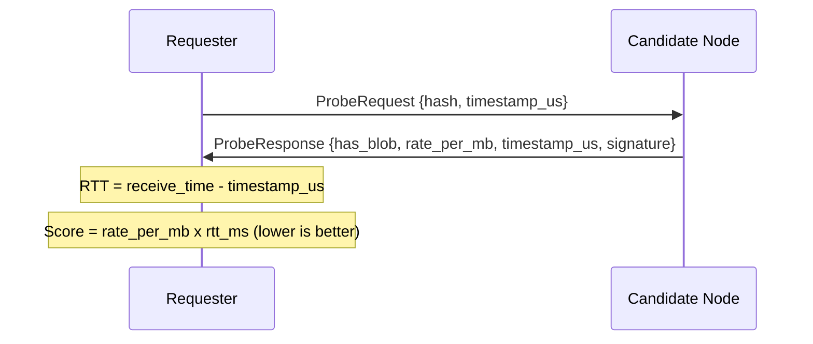
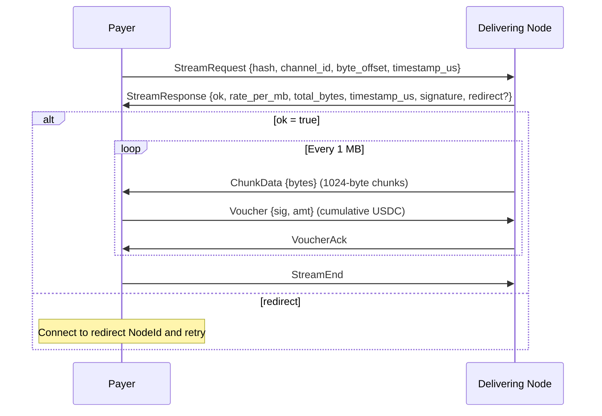
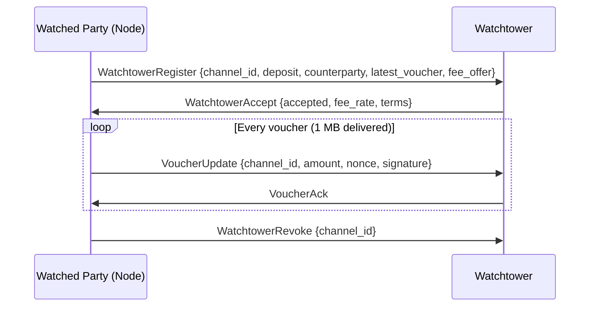
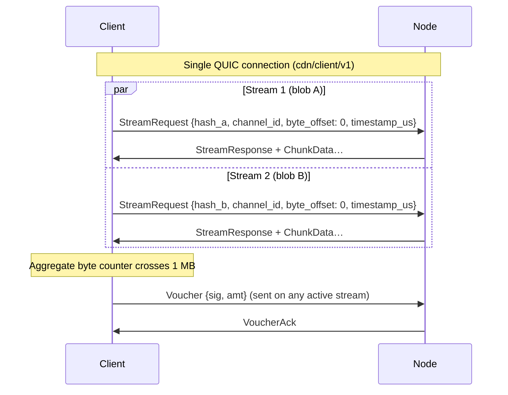

# ADR 005: Wire Protocol

**Date:** 2026-03-28
**Status:** Draft

## Context

Nodes and clients communicate over QUIC connections established via iroh. We need to define what protocols run over those connections: how a client or node requests a blob and pays for it, and how content availability is broadcast across the network.

The protocol layer must be distinct from the transport layer (iroh/QUIC) and the payment layer (vouchers, channels) so each can evolve independently.

## Decision

Four protocols, each identified by an ALPN string:

| ALPN | Participants | Purpose |
| --- | --- | --- |
| `cdn/probe/v1` | any node ↔ any node | Latency and availability check before committing to a node |
| `cdn/client/v1` | payer ↔ delivering node | Paid blob delivery with payment vouchers (client→node, node→node on cache miss) |
| `cdn/watchtower/v1` | watched party (typically node) ↔ watchtower | Channel-dispute monitoring: voucher registration and updates (see ADR 007) |
| iroh-gossip built-in | all nodes | Content availability announcements, node discovery |

### `cdn/probe/v1` — latency probe

Before opening a payment channel or sending a `StreamRequest`, a node probes candidates to measure round-trip latency and confirm the node has the blob:

`timestamp_us` is a requester-generated microsecond timestamp echoed back. RTT is `receive_time - timestamp_us`. `has_blob` confirms the node has the content. `rate_per_mb` lets the requester score candidates on both latency and price in a single round-trip.

`signature` is the candidate node's iroh private key signature over `{hash, has_blob, rate_per_mb, timestamp_us}`. This makes the probe response cryptographically attributable and enables two slashing mechanisms: (1) **phantom announcement slashing** — if `has_blob: true` but the node subsequently fails to deliver, the signed probe response is evidence; (2) **rate manipulation slashing** — if `stream_response.timestamp_us - probe_response.timestamp_us < 30_000_000` (30 seconds) and the `StreamResponse` rate exceeds the `ProbeResponse` rate, both signed messages constitute on-chain-verifiable evidence of bait-and-switch. Both `timestamp_us` values are requester-generated (the probe timestamp is echoed in `ProbeResponse`; `StreamResponse` echoes a separate requester timestamp from `StreamRequest`), so the on-chain verifier computes the delta from a single clock with no wall-clock reference needed. See ADR 004 for slashing details.

The requester probes candidates from the routing table in parallel, waits up to 200ms, then selects the winner using a composite score: `rate_per_mb × rtt_ms` (lower is better). This applies to clients picking nodes and nodes picking peers for a cache miss pull.

**Probe responses are public information.** `ProbeRequest` requires no authentication — any node can probe any other node. The information revealed (content availability, pricing, node identity) is not confidential: node identities are listed in a public on-chain registry, content availability is broadcast via gossip announcements, and pricing is discoverable through probe and stream responses by design. Network topology can be inferred by probing many nodes, but this is an inherent property of any system where nodes must be discoverable to serve content. Operational mitigations such as rate limiting (see ADR 003, "Probe fishing") aim to bound the cost of bulk probing, but the specific mechanism is not yet decided; the design does not treat probe responses as secrets. The cryptographic signatures on probe responses exist for accountability (slashing evidence), not confidentiality.

### `cdn/client/v1` — paid delivery protocol

Used for all paid delivery: client→node and node→node (cache miss pull from an origin-backed or cached node).

**Voucher wire format:** `Voucher {sig, amt}` above is shorthand. The EIP-712 signed data covers the full structure from [ADR 003](003-payments.md): `{channelId, amount, nonce, stablecoin}`. Only `signature` and `amount` are transmitted on the wire because the remaining fields are derivable from stream context — `channel_id` is in `StreamRequest`, `nonce` increments monotonically (one per MB boundary), and `stablecoin` is fixed at channel open. The receiver reconstructs the full typed data to verify the signature. Contrast with the watchtower `VoucherUpdate` below, which must include `channel_id` and `nonce` explicitly because the watchtower lacks stream context.

The delivering node advertises its `rate_per_mb` in `StreamResponse`. The payer accepts by sending the first voucher or disconnects and tries another node. No surprise pricing. `timestamp_us` in `StreamResponse` is the requester-generated microsecond timestamp from `StreamRequest`, echoed back unchanged — the same pattern as `ProbeResponse`. The node's iroh key signs all security-relevant fields: `{hash, ok, rate_per_mb, total_bytes, channel_id, timestamp_us, redirect}`, making the response cryptographically binding. Signing the full response prevents a malicious party from altering unsigned fields while reusing a valid signature — in particular, `ok` is needed for phantom announcement evidence (proving a node signed `ok: false` after claiming `has_blob: true` in a probe), and `redirect` ensures a node cannot silently alter routing without accountability. A rate mismatch between a signed `ProbeResponse` and a signed `StreamResponse` is slashable if `stream_response.timestamp_us - probe_response.timestamp_us < 30_000_000` (30 seconds). Because both `timestamp_us` values are requester-generated, the on-chain verifier computes this delta from the signed messages alone — no wall-clock reference or external time oracle is needed, and clock skew between the requester and the node does not affect the check. The `redirect` field in `StreamResponse` is used when a node cannot serve — it contains the NodeId of another node that can, never an external URL. The network is fully opaque.

`byte_offset` supports seek and resume: on failover, the requester reconnects to a different node and resumes from the last BLAKE3-verified byte.

The protocol is self-enforcing: payer stops sending vouchers → delivering node stops sending chunks; delivering node stops sending chunks → payer stops sending vouchers.

### Gossip — content availability

Content availability is broadcast over iroh-gossip on region-scoped topics (`cdn/region/{cc}/v1`) and a global topic (`cdn/global/v1`). All staked nodes publish `CacheAnnounce` messages listing hashes they hold (max 500 entries) or a Bloom filter for large sets. Clients and nodes maintain a local routing table (`hash → Vec<NodeId>`) from received announcements. The probe step determines cost and latency for each candidate.

### `cdn/watchtower/v1` — channel-dispute monitoring

Used by either channel party (typically the node) to register payment channels with a watchtower service that monitors for on-chain disputes. The full protocol design is specified in ADR 007.

The watched party sends its latest voucher on registration and streams updates as new vouchers arrive during delivery. If the counterparty initiates an on-chain close with a stale (lower-nonce) voucher, the watchtower submits a `disputeChannel` transaction with the latest voucher it holds. The watchtower is non-custodial — it cannot steal funds, worsen settlement, or grief; the voucher's EIP-712 signature is the only authorisation the contract checks.

### Connection Management

One QUIC connection per `(local_node, remote_node, ALPN)` tuple. Multiple requests to the same node on the same protocol reuse the existing connection via QUIC's native stream multiplexing — each `StreamRequest` opens a new bidirectional QUIC stream. A client fetching 100 blobs from one node opens 1 connection with 100 concurrent streams, not 100 connections.

Different ALPNs require separate connections (TLS ALPN is negotiated at connection establishment). A `cdn/probe/v1` connection and a `cdn/client/v1` connection to the same node are always distinct.

#### Concurrent stream limits

Maximum concurrent bidirectional streams per connection, set via QUIC transport parameter `initial_max_streams_bidi`:

| ALPN | Max streams | Rationale |
| --- | --- | --- |
| `cdn/client/v1` | 100 | Enough parallelism for bulk fetching (e.g., video manifest + segments) without exhausting server resources |
| `cdn/probe/v1` | 1 | Single request-response; the connection is reused for sequential probes to the same node |
| `cdn/watchtower/v1` | 10 | Allows concurrent updates for up to 10 registered channels; a node with more channels multiplexes updates over the available streams |

Stream concurrency is enforced via QUIC's `MAX_STREAMS` transport parameter: a peer MUST NOT open a new bidirectional stream beyond the advertised limit (doing so is a protocol violation resulting in `STREAM_LIMIT_ERROR` and connection close). The receiver grants additional credit by sending `MAX_STREAMS` updates as existing streams close.

#### Payment channels and concurrent streams

A single `channel_id` can be shared across concurrent streams on the same connection. Vouchers are cumulative across **all** streams on the channel:

The payer maintains **one aggregate byte counter per channel**. When the counter crosses the next 1 MB boundary, it issues the next cumulative voucher on any active stream sharing that channel. The delivering node tracks total bytes sent across all streams on the channel and **pauses all streams** if the voucher deficit exceeds 1 MB — the self-enforcing threshold is applied collectively, not per-stream.

Implementation constraint: the payer must have a single voucher-signing task per channel that aggregates byte counts from all streams, rather than independent per-stream voucher logic.

#### Connection lifetime

- Connections remain open while any stream is active or any sent voucher is awaiting `VoucherAck` (on-chain channel closure does not affect connection lifetime).
- **Idle timeout:** 30 seconds after the last stream closes and no unacknowledged vouchers remain in flight. Endpoints SHOULD send periodic QUIC PING frames when otherwise idle, with a default interval of 10 seconds (below the idle timeout) to prevent NAT middleboxes from dropping the mapping.
- **`cdn/watchtower/v1` exception:** watchtower connections are long-lived by design (ADR 007). No idle timeout while any channel is registered.

### Serialization

All protocol messages use [postcard](https://docs.rs/postcard) — compact, no-std friendly, serde-based. Standard in the iroh ecosystem; avoids introducing a second serialization dependency alongside what iroh already uses internally.

## Consequences

**Positive:**

- ALPN separation means a single iroh `Endpoint` dispatches all four connection types without ambiguity
- Probing in parallel before committing means no payment channel is opened with a slow or unresponsive node
- `cdn/client/v1` is reused for all paid delivery — no separate protocol needed for node→node pulls
- `redirect` always points to a NodeId, never an external URL; the backend topology of origin-backed nodes is fully hidden from the network
- The delivery protocol is self-enforcing — payment and data flow are coupled by design
- `byte_offset` in `StreamRequest` makes failover transparent; the requester resumes without restarting the stream
- QUIC stream multiplexing allows concurrent blob requests to the same node without additional connection overhead — one handshake cost regardless of how many blobs are fetched
- A shared `channel_id` across concurrent streams amortizes on-chain channel costs: one channel per (client, node) pair regardless of request volume

**Negative:**

- Probe RTT includes iroh's NAT traversal overhead on first connection, inflating the latency estimate. Reusing existing connections for probes gives a cleaner signal.
- A node under load can respond to probes quickly but deliver slowly — probe RTT is necessary but not sufficient. Reputation (separate system) provides the longer-term signal.
- The `cdn/client/v1` voucher cadence (1 MB) is coarser than iroh-blobs' internal chunk granularity (1024 bytes); the payment layer and transfer layer operate at different tick rates, requiring a buffering layer between them
- Concurrent streams sharing a `channel_id` require the payer to maintain a single aggregate byte counter and voucher-signing task per channel; per-stream independence is lost for payment tracking
- The delivering node enforces the voucher deficit threshold across all streams collectively — a slow voucher on one stream pauses all streams on that channel
- Different ALPNs require separate QUIC connections; probing a node via `cdn/probe/v1` and then fetching via `cdn/client/v1` incurs two handshake costs to the same peer
- Postcard has no schema evolution story — adding fields requires a new ALPN version (`cdn/client/v2`); version negotiation must be planned before the first breaking change
- `StreamRequest` includes a requester-generated `timestamp_us` that the node echoes in `StreamResponse`. A malicious requester could craft timestamps to make a legitimate rate change (probe 60 seconds ago, rate changed since) appear within the 30-second slashing window. The challenge bond (ADR 004) deters this: the bond is forfeited if the node successfully counters within the 24-hour counter-window, e.g. by showing a rate change published via gossip between the two timestamps
