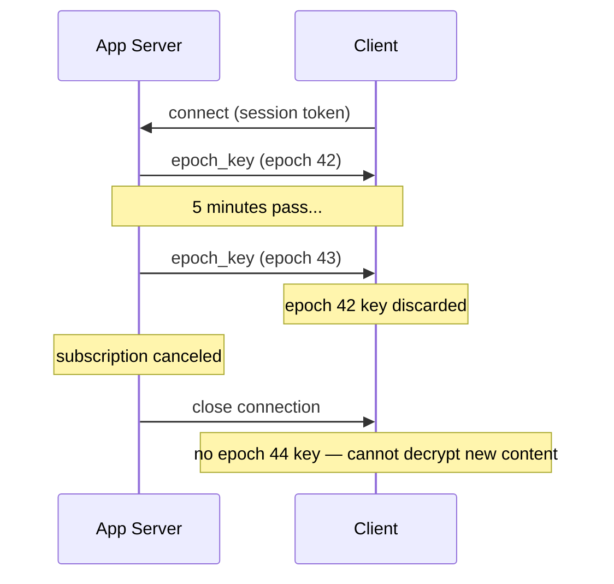
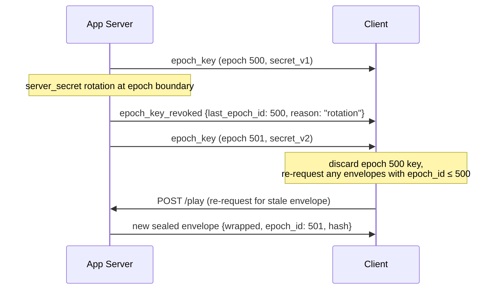
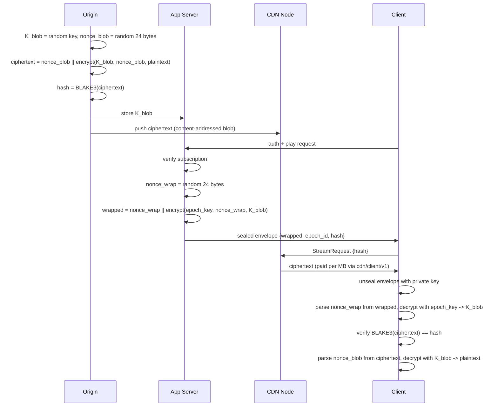
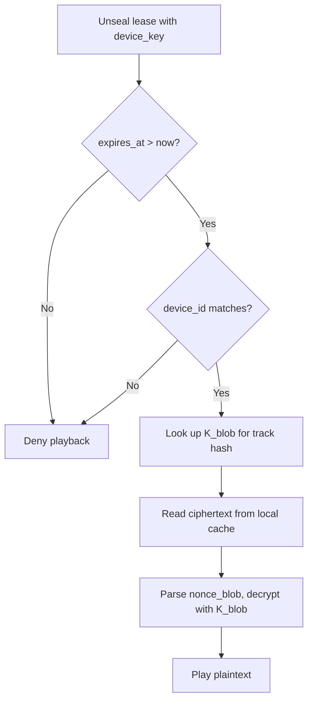
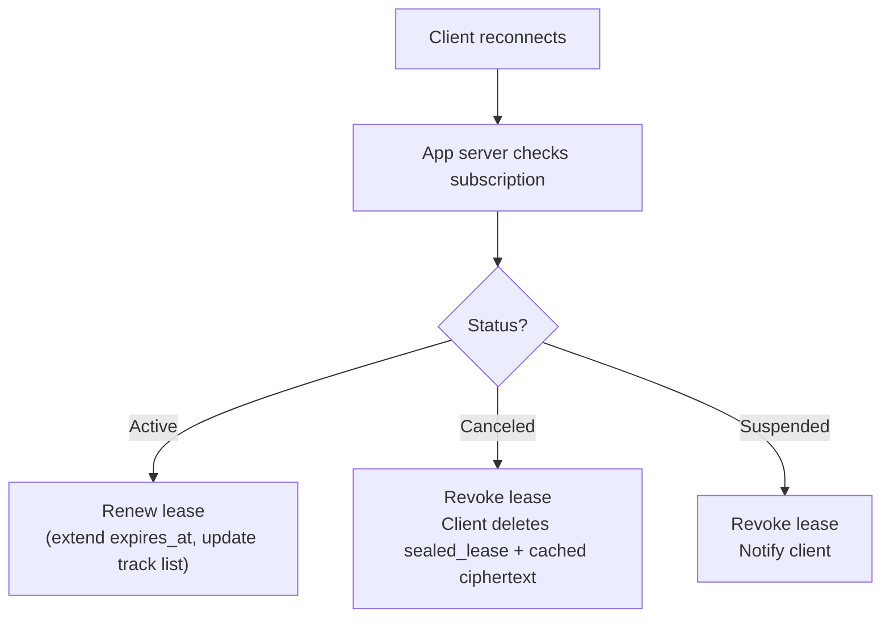

# ADR 006: End-to-End Encryption and Key Distribution

**Date:** 2026-03-29
**Status:** Draft

## Context

CDN nodes deliver content but should not be able to read it. QUIC provides transport encryption, but nodes see plaintext at rest and during forwarding. For applications like subscription-gated streaming (e.g., a Spotify-clone scenario), content must be encrypted end-to-end: only authorized, actively-subscribed clients can decrypt delivered blobs.

The encryption scheme must satisfy these constraints:

- Content-addressing (BLAKE3) must remain global — the same track produces the same hash for all clients and across all time periods
- CDN nodes, protocol, payment channels, and caching must remain unchanged
- Access must be revocable when a subscription expires, without re-encrypting content
- A compromised client must not gain access to the full catalog — blast radius must be proportional to what was individually requested
- There is no single master key whose compromise unlocks all content

## Decision

**Envelope encryption with epoch-rotated key distribution.**

The scheme has two independent layers: a permanent content layer and an ephemeral key delivery layer.

### Content Layer (at ingest, once per blob)

The origin generates a random symmetric key per blob, encrypts the content, and stores both the ciphertext and the key:

```
K_blob      = random 256-bit key
nonce_blob  = random 24-byte nonce
ciphertext  = nonce_blob || XChaCha20-Poly1305(K_blob, nonce_blob, plaintext)
hash        = BLAKE3(ciphertext)
```

The stored blob is `nonce (24 bytes) || AEAD output (encrypted data + 16-byte tag)`. The BLAKE3 hash covers the nonce, so content-addressing is unaffected. The client reads the first 24 bytes as the nonce before decrypting. Since each blob is encrypted exactly once with a CSPRNG-generated nonce, nonce collision is cryptographically negligible.

`K_blob` is stored in the app server's key store (never on CDN nodes). The ciphertext (including its prepended nonce) is pushed to the CDN network as an ordinary content-addressed blob. CDN nodes only ever see ciphertext.

XChaCha20-Poly1305 is chosen over AES-256-GCM because its 24-byte nonce eliminates nonce-reuse risk with random generation, and it requires no hardware AES support. All nonces MUST be generated from a CSPRNG. All XChaCha20-Poly1305 outputs in this scheme use the `nonce (24 bytes) || AEAD output` wire format: the first 24 bytes are the nonce, the remainder is the AEAD encrypted data and authentication tag.

### Key Delivery Layer (per play request)

#### App Server (External Component)

An app server gates access and delivers `K_blob` to authorized clients. The app server is a traditional web service operated by the content provider, **not** part of the CDN protocol or crate structure. It communicates with clients over WebSocket or SSE (provider's choice), not over iroh QUIC. This is a deliberate boundary: the app server handles subscription auth, billing integration, and key management — concerns that belong to the content provider's existing infrastructure, not the decentralized CDN.

The app server's minimum API surface:

- `POST /play` — accepts session token + blob hash, returns sealed envelope
- `GET /keys/stream` (WebSocket) or `GET /keys/events` (SSE) — authenticated persistent connection for epoch key delivery
- `POST /offline/lease` — issues offline playback lease for a set of tracks

The technology stack, deployment model, and auth mechanism are provider choices. The CDN protocol is agnostic to these — it only requires that the client possesses the correct epoch key and sealed envelope before issuing a `StreamRequest` to a CDN node.

#### Key Wrapping Protocol

The app server gates access and delivers `K_blob` to authorized clients using two mechanisms combined:

**Epoch keys** rotate on a fixed interval (default: 5 minutes). The app server derives each epoch key deterministically:

```
epoch_id  = floor(now_unix / 300)
epoch_key = BLAKE3_KDF(server_secret, epoch_id)
```

**Per-request sealed envelope:** On each play request, the app server verifies the client's subscription is active, then wraps `K_blob` with the current epoch key and seals the result to the client's public key:

```
nonce_wrap = random 24-byte nonce
wrapped    = nonce_wrap || XChaCha20-Poly1305(epoch_key, nonce_wrap, K_blob)
envelope   = crypto_box_seal(client_pubkey, {wrapped, epoch_id, blob_hash})
```

The client receives the sealed envelope. To decrypt the blob, the client needs both the envelope and the current epoch key.

**Epoch key delivery:** Epoch keys are pushed to clients over an authenticated persistent connection (WebSocket or SSE). The connection requires a valid session token. When the subscription expires or is canceled, the connection is closed and the client receives no further epoch keys.



**Rotation signaling:** When the app server rotates `server_secret` (see periodic rotation mitigation under [Consequences](#consequences)), it sends an `epoch_key_revoked` event on the persistent connection to notify clients that outstanding epoch keys are being invalidated:

```
epoch_key_revoked = {
    last_epoch_id: u64,   // last epoch ID derived from the outgoing server_secret
    reason: "rotation"    // extensible — e.g., "emergency" for unscheduled rotation
}
```

The event is followed immediately by the next `epoch_key` push (the first epoch key derived from the new `server_secret`), so clients transition without a gap.



**Client behavior on `epoch_key_revoked`:**

1. Discard the cached epoch key for `last_epoch_id` (and any earlier epoch keys, if retained)
2. Any sealed envelopes referencing `epoch_id <= last_epoch_id` are stale — the client must re-request them via `POST /play` to obtain envelopes wrapped with the new epoch key
3. Wait for the immediately following `epoch_key` push before attempting to decrypt new content

**Disconnected clients:** A client whose persistent connection dropped before receiving the `epoch_key_revoked` event will discover the rotation when it attempts to unwrap a sealed envelope using a stale epoch key: the XChaCha20-Poly1305 AEAD decryption will fail (authentication tag mismatch). On AEAD failure during epoch key unwrapping, the client SHOULD reconnect to the epoch key stream and re-request the affected envelope via `POST /play`. This is not a new failure mode — a dropped WebSocket already prevents the client from receiving new epoch keys (see above), so the client must reconnect regardless.

### Client Decryption Flow

```
1. Receive sealed envelope from app server
2. Unseal with client private key -> {wrapped, epoch_id, blob_hash}
3. Parse nonce_wrap (first 24 bytes) from wrapped
4. Decrypt remainder with epoch_key and nonce_wrap -> K_blob
5. Fetch ciphertext from CDN via existing protocol (StreamRequest{blob_hash})
6. Verify BLAKE3(ciphertext) == blob_hash
7. Parse nonce_blob (first 24 bytes) from ciphertext
8. Decrypt remainder with K_blob and nonce_blob -> plaintext
9. Discard K_blob from memory after use
```

### Full System Flow



### Offline Playback (lease-based access)

The online scheme (epoch keys over a persistent connection) assumes connectivity. Offline playback requires a second access mode that trades revocation speed for availability.

**Offline lease issuance:** When a client requests offline access for specific tracks, the app server builds a lease and the client seals it locally with a device-bound key:

```
Client requests offline access for tracks [hash_1, hash_2, ..., hash_n]

App server:
  1. Verify subscription is active
  2. Verify device count is within limit (max 3-5 per account)
  3. Verify track count is within limit (max 500 per device)
  4. Build lease:

     lease = {
         k_blobs: {hash_1: K_1, hash_2: K_2, ...},
         issued_at: 1743300000,
         expires_at: 1745892000,       // 30 days
         device_id: "device_xyz",
         account_id: "alice"
     }

  5. Return lease to client over authenticated channel
     // The lease endpoint (POST /offline/lease) MUST be served
     // over HTTPS, as the response contains plaintext K_blob values.
     // The client is authenticated via session token.

Client (on device):
  6. Seal lease to device keystore for at-rest protection:

     sealed_lease = AEAD_Seal(device_key, lease)
     // device_key is a 256-bit symmetric key managed by the
     // platform keystore:
     //   iOS: Keychain (hardware-backed where available; non-exportable)
     //   Android: Hardware-backed Keystore (AES-256-GCM; non-exportable)
     //   Desktop: OS credential store (key may be returned to user-space; less secure)
     // On mobile, the keystore performs the AEAD operation internally
     // and the client holds only an opaque key handle. On desktop,
     // the app may retrieve device_key for the operation and MUST
     // zeroize it from process memory immediately after use.
     // The primitive depends on the platform (typically AES-256-GCM).

  7. Store sealed_lease on disk
```

**Offline playback flow:**



**Content download:** Before going offline, the client downloads tracks through the normal CDN protocol (`cdn/client/v1`, paid per MB). The ciphertext is stored in local cache. This is identical to online streaming — the CDN protocol does not distinguish between streaming and download-for-offline.

**Check-in and revocation:** When connectivity returns, the client contacts the app server to renew or revoke the lease:



If the client never checks in, the lease expires at `expires_at` and offline playback stops. The client retains cached ciphertext but cannot decrypt it without a valid lease.

**Relationship to the online scheme:** The two modes are complementary and coexist:

| | Online (epoch keys) | Offline (lease) |
| --- | --- | --- |
| Key source | Epoch key via WebSocket + sealed envelope | Sealed lease from device keystore |
| K_blob lifetime in client | Transient — in memory, discarded after play | Persistent — on disk, sealed to device key |
| Revocation speed | ~5 minutes (epoch boundary) | Up to 30 days (lease TTL) |
| Server dependency | Continuous | None until lease expires |
| Content source | CDN nodes (streamed) | Local cache (pre-downloaded) |
| Blast radius if compromised | K_blobs for tracks played in current epoch | K_blobs for all tracks in lease (up to 500) |

The offline lease intentionally weakens two properties of the online scheme: K_blob values persist on disk rather than transiently in memory, and revocation is delayed from 5 minutes to the lease TTL. This is an accepted tradeoff — it is the same tradeoff every major streaming service makes, and there is no cryptographic solution that provides both offline playback and instant revocation.

**Device key compromise (jailbroken devices):** If a device's keystore is compromised, the attacker can unseal the lease and extract all K_blob values in it. The blast radius is bounded by `max_tracks` (up to 500 tracks per device). Mitigations are operational, not cryptographic:

- Device attestation (iOS App Attest, Android Play Integrity) — refuse to issue leases to compromised devices
- Device limit per account (3-5) — bounds the total exposure per subscriber
- Per-account audio watermarking — pirated tracks trace back to the source account
- Behavioral detection — flag accounts that download max tracks, never stream online, and churn subscriptions

## Considered Alternatives

### Client-enforced expiry (timestamp in envelope, no epoch keys)

The app server seals `{K_blob, expires_at}` directly to the client's public key. The client checks the timestamp before decrypting.

Rejected because a hacked client can ignore the timestamp. Expiry becomes advisory, not enforced. Acceptable for a PoC but not for production subscription gating.

### Decryption proxy (server-side decryption)

A proxy fetches ciphertext from the CDN, decrypts with K_blob, and streams plaintext to the client over TLS. The client never sees any key.

Rejected because it breaks end-to-end encryption — the proxy sees plaintext. It also introduces a centralized bottleneck that undermines the decentralized CDN architecture.

### Proxy re-encryption (PRE)

The origin encrypts under its own key. A re-encryption proxy transforms ciphertext for each authorized client without learning the plaintext.

Rejected for the PoC due to complexity (BLS12-381 pairing-based crypto), performance overhead, and a significant new dependency (`recrypt`). May be revisited post-PoC if delegated access without origin involvement becomes a requirement.

### Per-client encrypted blobs (ECIES per recipient)

Each blob is re-encrypted per client, producing different ciphertexts and different BLAKE3 hashes.

Rejected because it destroys global content-addressing. The same track would have a different hash per client, breaking CDN caching, deduplication, and gossip announcements.

## PoC Scope

| Aspect | PoC | Production |
| --- | --- | --- |
| E2E encryption | Not implemented. Content is delivered as plaintext blobs. | Full implementation as described |
| Epoch key rotation | N/A | 5-minute rotation via BLAKE3_KDF |
| Key delivery infrastructure | N/A | WebSocket/SSE persistent connection |
| Sealed envelopes | N/A | XChaCha20-Poly1305 + crypto_box_seal |
| Offline leases | N/A | 30-day TTL, device-bound keys |
| Device attestation | N/A | iOS Secure Enclave, Android Keystore |
| Audio watermarking | N/A | Per-account |
| App server blob key store (`K_blob`) | N/A | KMS/HSM-protected blob encryption keys |
| Epoch derivation root (`server_secret`) | N/A | Non-exportable HSM key with periodic rotation |

For PoC, no action items from this ADR are required. Content-addressed blobs are stored and served as plaintext. The CDN protocol, payment channels, and caching are unchanged regardless of whether encryption is applied at the application layer. This ADR documents the post-PoC design so that the protocol and contract interfaces remain forward-compatible.

## Consequences

**Positive:**

- Global content-addressing is preserved: one ciphertext, one hash, one cached copy for all clients. CDN nodes, protocol, payments, and gossip are completely unchanged.
- CDN nodes never see plaintext or any key material. Compromising a node yields only ciphertext.
- Compromising a client yields only `K_blob` values for tracks that client has already played — not the catalog. Each blob has an independent random key; there is no master key.
- Subscription revocation takes effect within one epoch (5 minutes): the client's epoch key stream is closed and previously sealed envelopes cannot be unwrapped without the next epoch key.
- The epoch key WebSocket doubles as a presence signal for concurrent stream limiting.
- The key delivery layer uses only primitives already in the stack: BLAKE3 for KDF, XChaCha20-Poly1305 for symmetric encryption, X25519 (convertible from iroh Ed25519 keys) for `crypto_box_seal`.

**Negative:**

- Adds an app server component outside the CDN protocol (documented in [architecture.md](architecture.md#external-components) under External Components). This is a new service that content providers must build, deploy, and operate using their own stack. The client requires two transport stacks: iroh QUIC for CDN delivery and WebSocket/SSE for key delivery. A minimal reference implementation may be provided in a separate repository.
- The app server's key store (holding all `K_blob` values) is a high-value target. It must be protected with a KMS or HSM in production. Compromise of the key store exposes all content.
- A hacked client can still extract `K_blob` for tracks it plays in real-time. This is inherent to any scheme where the client produces plaintext output — equivalent to the "analog hole" in DRM systems.
- Epoch key rotation creates a hard dependency on the persistent connection. If the WebSocket drops, the client cannot decrypt new tracks until it reconnects and receives the current epoch key. The client should cache the most recent epoch key in memory (not disk) to survive brief disconnects within the same epoch.
- `server_secret` (the epoch key derivation root) is a critical secret. Rotation of `server_secret` invalidates all outstanding epoch keys and sealed envelopes, forcing all clients to re-request. Rotation is signaled via the `epoch_key_revoked` event on the persistent connection (see [Rotation signaling](#key-wrapping-protocol)); disconnected clients fall back to AEAD-failure-triggered reconnection. Rotation should be infrequent and coordinated.
- **No forward secrecy for epoch keys.** Because `epoch_key = BLAKE3_KDF(server_secret, epoch_id)` is purely deterministic, compromising `server_secret` retroactively exposes every past epoch key and every future epoch key until rotation. An attacker who obtains `server_secret` can derive any epoch key. Note that sealed envelopes are additionally protected by `crypto_box_seal` to the client's public key, so recovering `K_blob` from a recorded envelope requires both `server_secret` (to derive the epoch key) and the client's private key (to unseal the envelope). However, an attacker who compromises the app server — the most likely scenario for `server_secret` exposure — may also have access to the `K_blob` key store directly, bypassing the envelope path entirely. This is the most significant cryptographic limitation of the current design. Production deployments MUST mitigate this with the following complementary measures:

  1. **HSM-backed derivation.** Store `server_secret` in a hardware security module (AWS CloudHSM, Azure Managed HSM, GCP Cloud HSM) or cloud KMS as a non-exportable key, and derive `epoch_key` values inside that service using a supported PRF/KDF. Most cloud KMS products do not natively support BLAKE3; if BLAKE3 is required, use an HSM that can run the BLAKE3-based KDF internally. Otherwise, substitute a KMS-supported primitive (e.g., HMAC-SHA256 or HKDF-SHA256 over `epoch_id`) for the production derivation path. This reduces the attack surface to HSM/KMS API access control rather than secret exfiltration.
  2. **Periodic `server_secret` rotation on epoch boundaries.** Rotate `server_secret` on a fixed schedule (e.g., every 24–72 hours), aligning each rotation to an epoch boundary so that each `epoch_id` maps to exactly one `server_secret`. The new secret is used to derive `epoch_key` values only for future `epoch_id`s; the outgoing secret handles the current epoch and is destroyed once that epoch expires. This keeps `epoch_key = KDF(server_secret, epoch_id)` and the envelope `{wrapped, epoch_id, blob_hash}` unambiguous — no version identifier is needed because each epoch_id is associated with exactly one secret. The blast radius of a compromise is bounded to the rotation interval rather than the full lifetime of the service. The rotation cadence is a tradeoff: shorter intervals reduce exposure but increase coordination cost (all app server instances must converge on the new secret before the first epoch that uses it).
  3. **Append-only key rotation log.** The app server maintains a signed, append-only log of `server_secret` rotation events (HSM/KMS key identifier and version, rotation timestamp, operator identity, and a hash-chained log record). This does not prevent compromise but provides auditability — after an incident, the log establishes which secrets (by key identifier and version) were active during which periods, bounding the forensic scope without exposing or fingerprinting the raw secret material.

  For the PoC, none of these mitigations apply (E2E encryption is not implemented). The deterministic derivation is acceptable for the design document because it is simple, stateless, and sufficient for the threat model where the app server is trusted infrastructure. Forward secrecy becomes critical when the production deployment handles real subscriber content.
- Offline leases trade revocation speed for availability: a canceled subscription may retain offline playback for up to the lease TTL (default 30 days). This is an accepted industry-standard tradeoff.
- Offline leases persist K_blob values on disk (sealed to device key), increasing the blast radius of a device compromise from one epoch's tracks to the full lease (up to 500 tracks). Device attestation and watermarking are operational mitigations, not cryptographic guarantees.
