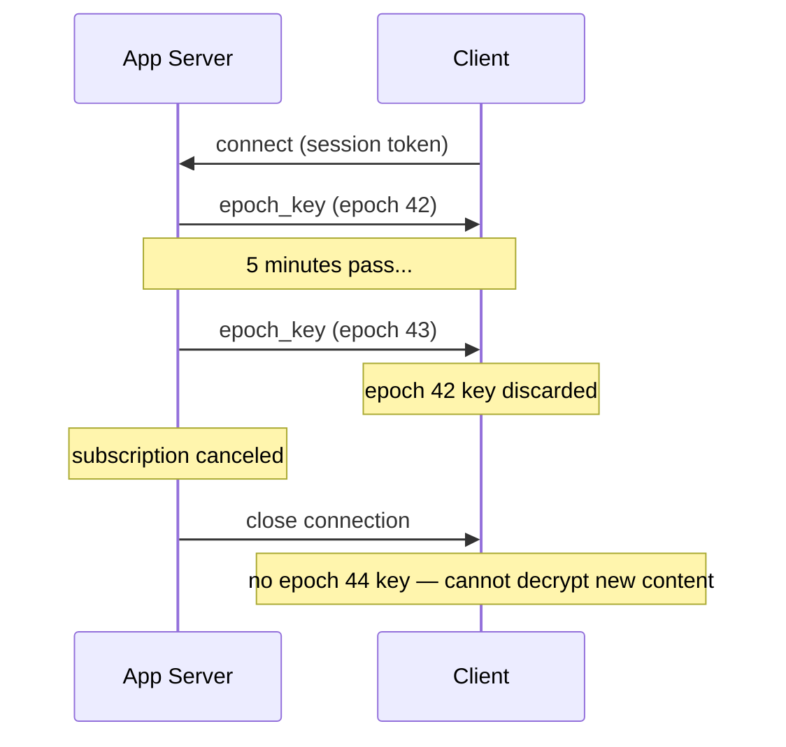
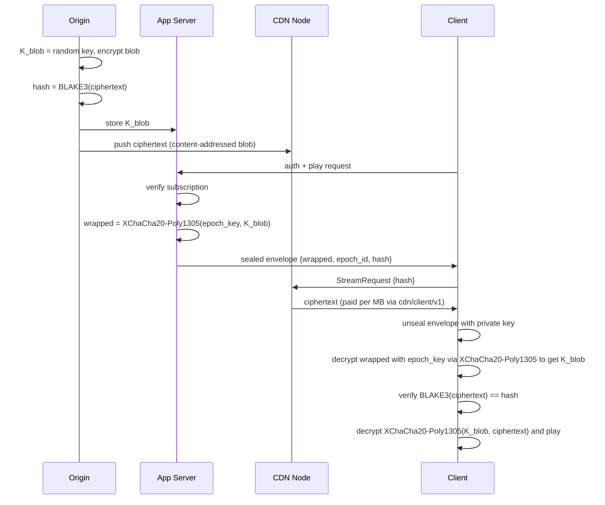
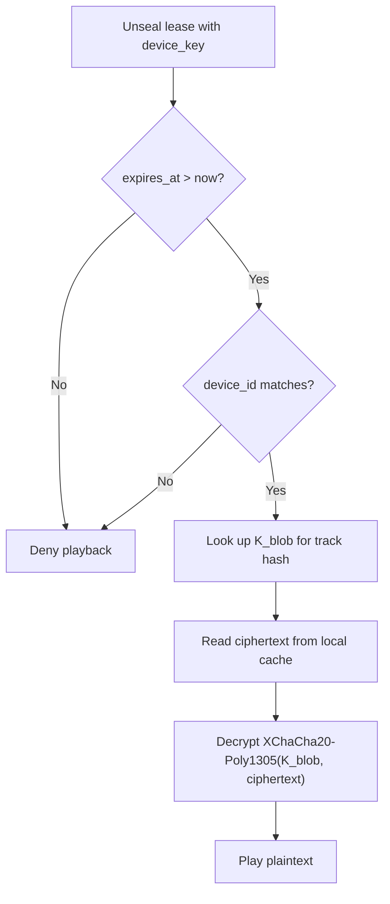
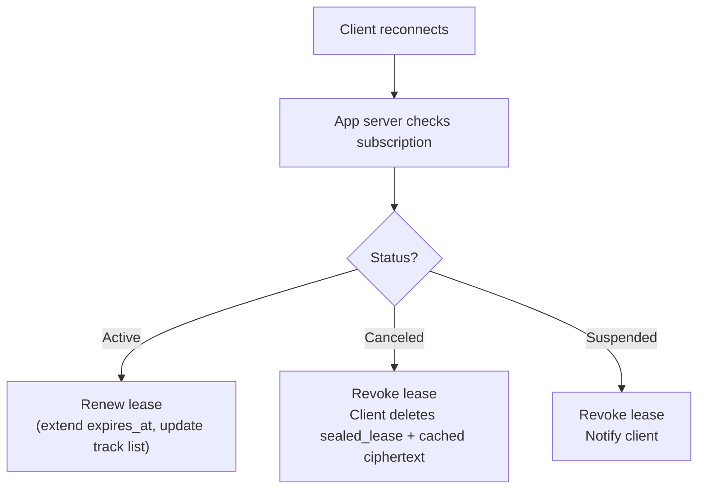

# ADR 006: End-to-End Encryption and Key Distribution

**Date:** 2026-03-29
**Status:** Draft

## Context

CDN nodes deliver content but should not be able to read it. QUIC provides transport encryption, but nodes see plaintext at rest and during forwarding. For applications like subscription-gated streaming (e.g., a Spotify-clone scenario), content must be encrypted end-to-end: only authorized, actively-subscribed clients can decrypt delivered blobs.

The encryption scheme must satisfy these constraints:

- Content-addressing (BLAKE3) must remain global — the same track produces the same hash for all clients and across all time periods
- CDN nodes, protocol, payment channels, and caching must remain unchanged
- Access must be revocable when a subscription expires, without re-encrypting content
- A compromised client must not gain access to the full catalog — blast radius must be proportional to what was individually requested
- There is no single master key whose compromise unlocks all content

## Decision

**Envelope encryption with epoch-rotated key distribution.**

The scheme has two independent layers: a permanent content layer and an ephemeral key delivery layer.

### Content Layer (at ingest, once per blob)

The origin generates a random symmetric key per blob, encrypts the content, and stores both the ciphertext and the key:

```
K_blob   = random 256-bit key
ciphertext = XChaCha20-Poly1305(K_blob, plaintext)
hash     = BLAKE3(ciphertext)
```

`K_blob` is stored in the app server's key store (never on CDN nodes). The ciphertext is pushed to the CDN network as an ordinary content-addressed blob. CDN nodes only ever see ciphertext.

XChaCha20-Poly1305 is chosen over AES-256-GCM because its 24-byte nonce eliminates nonce-reuse risk with random generation, and it requires no hardware AES support.

### Key Delivery Layer (per play request)

An app server (outside the CDN protocol) gates access and delivers `K_blob` to authorized clients using two mechanisms combined:

**Epoch keys** rotate on a fixed interval (default: 5 minutes). The app server derives each epoch key deterministically:

```
epoch_id  = floor(now_unix / 300)
epoch_key = BLAKE3_KDF(server_secret, epoch_id)
```

**Key hierarchy.** To limit the blast radius of `server_secret` compromise, per-content keys are derived using both `server_secret` and the content hash:

```
content_epoch_key = BLAKE3_KDF(epoch_key, blob_hash)
wrapped = XChaCha20-Poly1305(content_epoch_key, K_blob)
```

This means an attacker who obtains a single `content_epoch_key` (e.g., by compromising one client's decryption) cannot derive `epoch_key` or `server_secret` — and therefore cannot decrypt other content in the same epoch. Compromise of `server_secret` remains catastrophic (all past and future keys derivable), but the key hierarchy ensures that client-side compromise is bounded to the specific content the client accessed.

**`server_secret` rotation procedure:** When rotation is required (suspected compromise, periodic rotation policy), the app server: (1) generates a new `server_secret`, (2) broadcasts an `EpochRotated` message via gossip, (3) re-wraps active content's `K_blob` values with the new key hierarchy over the next N epochs (where N is configurable, default 1). During the transition, the app server accepts envelopes sealed with both old and new epoch keys. Old `server_secret` is securely deleted after the transition completes.

**Per-request sealed envelope:** On each play request, the app server verifies the client's subscription is active, then wraps `K_blob` with the current epoch key and seals the result to the client's public key:

```
wrapped   = XChaCha20-Poly1305(epoch_key, K_blob)
envelope  = crypto_box_seal(client_pubkey, {wrapped, epoch_id, blob_hash})
```

The client receives the sealed envelope. To decrypt the blob, the client needs both the envelope and the current epoch key.

**Epoch key delivery:** Epoch keys are pushed to clients over an authenticated persistent connection. **PoC:** uses an iroh QUIC stream (ALPN `cdn/keys/v1`) to avoid introducing a separate WebSocket/SSE transport stack. The client opens a bidirectional QUIC stream to the app server's iroh endpoint, authenticates with a session token, and receives epoch keys as they rotate. This keeps the PoC on a single transport (iroh QUIC) for all communication. **Production:** may migrate to WebSocket/SSE if the app server needs to serve web clients that cannot use QUIC directly, or if the app server is deployed separately from the iroh network. The protocol is transport-agnostic — the message format (epoch key + epoch ID) is the same regardless of delivery mechanism.

The connection requires a valid session token. When the subscription expires or is canceled, the connection is closed and the client receives no further epoch keys.



### Client Decryption Flow

```
1. Receive sealed envelope from app server
2. Unseal with client private key -> {wrapped, epoch_id, blob_hash}
3. Decrypt wrapped with current epoch_key -> K_blob
4. Fetch ciphertext from CDN via existing protocol (StreamRequest{blob_hash})
5. Verify BLAKE3(ciphertext) == blob_hash
6. Decrypt XChaCha20-Poly1305(K_blob, ciphertext) -> plaintext
7. Discard K_blob from memory after use
```

### Full System Flow



### Offline Playback (lease-based access)

The online scheme (epoch keys over a persistent connection) assumes connectivity. Offline playback requires a second access mode that trades revocation speed for availability.

**Offline lease issuance:** When a client requests offline access for specific tracks, the app server issues a lease — a bundle of `K_blob` values sealed to a device-bound key:

```
Client requests offline access for tracks [hash_1, hash_2, ..., hash_n]

App server:
  1. Verify subscription is active
  2. Verify device count is within limit (max 3-5 per account)
  3. Verify track count is within limit (max 500 per device)
  4. Build lease:

     lease = {
         k_blobs: {hash_1: K_1, hash_2: K_2, ...},
         issued_at: 1743300000,
         expires_at: 1743904800,       // 7 days
         device_id: "device_xyz",
         account_id: "alice"
     }

  5. Seal to device key:

     sealed_lease = encrypt(device_key, lease)
     // device_key lives in platform keystore:
     //   iOS: Secure Enclave via Keychain
     //   Android: Hardware-backed Keystore
     //   Desktop: OS credential store (less secure)

  6. Return sealed_lease to client
```

**Offline playback flow:**



**Content download:** Before going offline, the client downloads tracks through the normal CDN protocol (`cdn/client/v1`, paid per MB). The ciphertext is stored in local cache. This is identical to online streaming — the CDN protocol does not distinguish between streaming and download-for-offline.

**Check-in and revocation:** When connectivity returns, the client contacts the app server to renew or revoke the lease:



If the client never checks in, the lease expires at `expires_at` and offline playback stops. The client retains cached ciphertext but cannot decrypt it without a valid lease.

**Mandatory daily check-in.** Offline leases require a daily check-in with the app server when connectivity is available. On check-in, the server either renews the lease (extending `expires_at` by 24 hours) or revokes it. If the client has connectivity but fails to check in within 24 hours, the client software MUST treat the lease as revoked and delete the sealed lease and cached keys. This reduces the worst-case revocation window from the full lease TTL to ~24 hours for devices that have intermittent connectivity. Devices that are truly offline (airplane mode, no network) retain the full TTL as an unavoidable upper bound.

**Relationship to the online scheme:** The two modes are complementary and coexist:

| | Online (epoch keys) | Offline (lease) |
| --- | --- | --- |
| Key source | Epoch key via persistent connection + sealed envelope | Sealed lease from device keystore |
| K_blob lifetime in client | Transient — in memory, discarded after play | Persistent — on disk, sealed to device key |
| Revocation speed | ~5 minutes (epoch boundary) | ~24 hours (daily check-in) to 7 days (full TTL) |
| Server dependency | Continuous | Daily check-in when connected; none when offline |
| Content source | CDN nodes (streamed) | Local cache (pre-downloaded) |
| Blast radius if compromised | K_blobs for tracks played in current epoch | K_blobs for all tracks in lease (up to 500) |

The offline lease intentionally weakens two properties of the online scheme: K_blob values persist on disk rather than transiently in memory, and revocation is delayed from 5 minutes to 24 hours (with daily check-in) or up to 7 days (without connectivity). This is an accepted tradeoff — it is the same tradeoff every major streaming service makes, and there is no cryptographic solution that provides both offline playback and instant revocation.

**Device key compromise (jailbroken devices):** If a device's keystore is compromised, the attacker can unseal the lease and extract all K_blob values in it. The blast radius is bounded by `max_tracks` (up to 500 tracks per device). Mitigations are operational, not cryptographic:

- Device attestation (iOS App Attest, Android Play Integrity) — refuse to issue leases to compromised devices
- Device limit per account (3-5) — bounds the total exposure per subscriber
- Per-account audio watermarking — pirated tracks trace back to the source account
- Behavioral detection — flag accounts that download max tracks, never stream online, and churn subscriptions

## Considered Alternatives

### Client-enforced expiry (timestamp in envelope, no epoch keys)

The app server seals `{K_blob, expires_at}` directly to the client's public key. The client checks the timestamp before decrypting.

Rejected because a hacked client can ignore the timestamp. Expiry becomes advisory, not enforced. Acceptable for a PoC but not for production subscription gating.

### Decryption proxy (server-side decryption)

A proxy fetches ciphertext from the CDN, decrypts with K_blob, and streams plaintext to the client over TLS. The client never sees any key.

Rejected because it breaks end-to-end encryption — the proxy sees plaintext. It also introduces a centralized bottleneck that undermines the decentralized CDN architecture.

### Proxy re-encryption (PRE)

The origin encrypts under its own key. A re-encryption proxy transforms ciphertext for each authorized client without learning the plaintext.

Rejected for the PoC due to complexity (BLS12-381 pairing-based crypto), performance overhead, and a significant new dependency (`recrypt`). May be revisited post-PoC if delegated access without origin involvement becomes a requirement.

### Per-client encrypted blobs (ECIES per recipient)

Each blob is re-encrypted per client, producing different ciphertexts and different BLAKE3 hashes.

Rejected because it destroys global content-addressing. The same track would have a different hash per client, breaking CDN caching, deduplication, and gossip announcements.

## PoC Scope

| Aspect | PoC | Production |
| --- | --- | --- |
| E2E encryption | Not implemented. Content is delivered as plaintext blobs. | Full implementation as described |
| Epoch key rotation | N/A | 5-minute rotation via BLAKE3_KDF |
| Key delivery infrastructure | N/A | iroh QUIC stream (PoC) → WebSocket/SSE (production) |
| Sealed envelopes | N/A | XChaCha20-Poly1305 + crypto_box_seal |
| Offline leases | N/A | 7-day TTL with daily check-in, device-bound keys |
| Device attestation | N/A | iOS Secure Enclave, Android Keystore |
| Audio watermarking | N/A | Per-account |
| App server key store | N/A | KMS/HSM-protected |

For PoC, no action items from this ADR are required. Content-addressed blobs are stored and served as plaintext. The CDN protocol, payment channels, and caching are unchanged regardless of whether encryption is applied at the application layer. This ADR documents the post-PoC design so that the protocol and contract interfaces remain forward-compatible.

## Consequences

**Positive:**

- Global content-addressing is preserved: one ciphertext, one hash, one cached copy for all clients. CDN nodes, protocol, payments, and gossip are completely unchanged.
- CDN nodes never see plaintext or any key material. Compromising a node yields only ciphertext.
- Compromising a client yields only `K_blob` values for tracks that client has already played — not the catalog. Each blob has an independent random key; there is no master key.
- Subscription revocation takes effect within one epoch (5 minutes): the client's epoch key stream is closed and previously sealed envelopes cannot be unwrapped without the next epoch key.
- The epoch key WebSocket doubles as a presence signal for concurrent stream limiting.
- The key delivery layer uses only primitives already in the stack: BLAKE3 for KDF, XChaCha20-Poly1305 for symmetric encryption, X25519 (convertible from iroh Ed25519 keys) for `crypto_box_seal`.

**Negative:**

- Adds an app server component outside the CDN protocol. This is a new service to build, deploy, and operate.
- The app server's key store (holding all `K_blob` values) is a high-value target. It must be protected with a KMS or HSM in production. Compromise of the key store exposes all content.
- A hacked client can still extract `K_blob` for tracks it plays in real-time. This is inherent to any scheme where the client produces plaintext output — equivalent to the "analog hole" in DRM systems.
- Epoch key rotation creates a hard dependency on the persistent connection. If the WebSocket drops, the client cannot decrypt new tracks until it reconnects and receives the current epoch key. The client should cache the most recent epoch key in memory (not disk) to survive brief disconnects within the same epoch.
- `server_secret` (the epoch key derivation root) is a critical secret. Rotation of `server_secret` invalidates all outstanding epoch keys and sealed envelopes, forcing all clients to re-request. Rotation should be infrequent and coordinated. **Key rotation notification:** when `server_secret` rotates, the app server broadcasts an `EpochRotated { new_epoch_id, rotated_at }` message via iroh-gossip on a dedicated `cdn/keys/v1` topic. Clients subscribed to this topic receive the rotation event and re-request epoch keys from the app server. This avoids requiring a separate WebSocket solely for rotation events. For PoC, epoch key delivery itself uses an iroh QUIC stream (ALPN `cdn/keys/v1`) rather than WebSocket/SSE — see below.
- Offline leases trade revocation speed for availability: a canceled subscription may retain offline playback for up to the lease TTL (default 7 days). Mandatory daily check-in reduces this to ~24 hours for devices with intermittent connectivity. This is an accepted industry-standard tradeoff.
- Offline leases persist K_blob values on disk (sealed to device key), increasing the blast radius of a device compromise from one epoch's tracks to the full lease (up to 500 tracks). The 7-day TTL (reduced from 30 days) limits the window. Device attestation and watermarking are operational mitigations, not cryptographic guarantees.
