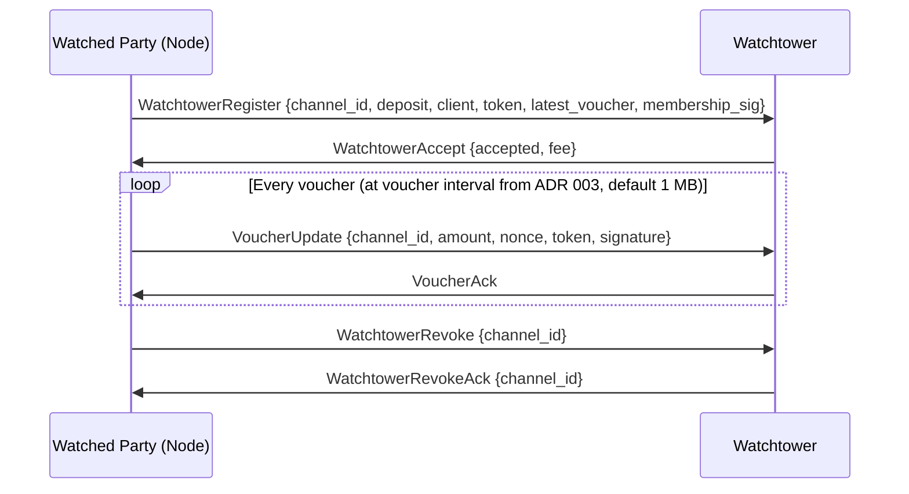
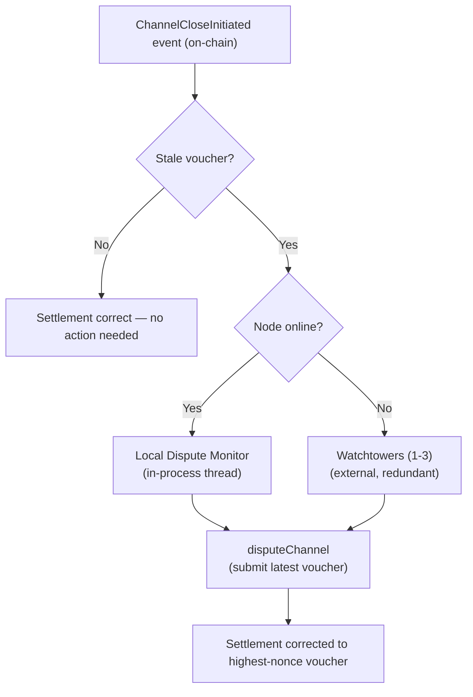

# ADR 007: Watchtower Design for Channel Disputes

**Date:** 2026-03-29
**Status:** Draft

## Context

ADR 003 defines a dispute window (default 48 hours for PoC, governable within 12h–72h) for payment channel settlement. Either party can counter a stale or fraudulent close by submitting a higher-nonce voucher during the window. This works if the counterparty is online — but if a node goes offline after a client submits a stale (low-amount) voucher, the node misses the dispute window and loses the difference between what it earned and what the stale voucher claims.

ADR 003 identifies this liveness gap explicitly (stale close, Option A) and proposes a watchtower as the solution. The tokenomics spec (Section 8) sketches economic parameters — 0.1% of channel deposit per 30-day monitoring period — but defers the protocol design. This ADR resolves both.

The threat is asymmetric in unidirectional channels. Vouchers are client-signed cumulative amounts; the node submits the highest voucher to maximise its payout. The stale-close attack is therefore a client submitting an old low-amount voucher to underpay the node. The reverse — a node submitting a lower voucher than it holds — harms only the node itself (the client gets a larger refund). Despite this asymmetry, the mechanism described here is symmetric: either party can delegate dispute protection to a watchtower.

**v3 tokenomics driver.** [ADR 026](026-gauge-boost-tokenomics.md) introduces a gauge-boost pool whose payout is weighted by per-operator `bytes_delivered`. Raw byte counters are gameable by self-routed traffic (an operator settling against itself or against thinly-funded sybil channels to inflate gauge-pool share — see ADR 026 §Risks "Wash-trading / self-routed traffic"). ADR 026 cites watchtower observation of self-settlement patterns and forward-references [ADR 027 — Distinct-client delivery receipts](027-distinct-client-receipts.md) as the strongest invariant in the gauge-pool security model. This ADR therefore extends the watchtower role beyond stale-close defense to also cover wash-trading detection and validation of ADR 027 delivery receipts. The ADR 027 receipt cryptographic protocol (format, signature scheme, on-chain anchoring) is out of scope here — this ADR only specifies the watchtower-side responsibilities.

## Decision

### 1. Watchtower Role

A watchtower is a non-custodial monitoring service that:

1. Watches for `ChannelCloseInitiated` events on the `StablePaymentChannel` contract
2. Holds the latest voucher for each registered channel
3. Submits a `disputeChannel` transaction if the on-chain close uses a lower-nonce voucher than what the watchtower holds
4. **Detects wash-trading / self-routed-traffic patterns** that inflate an operator's gauge-pool share under [ADR 026](026-gauge-boost-tokenomics.md) §3 (see [§1a Wash-trading detection](#1a-wash-trading-detection) below)
5. **Validates distinct-client delivery receipts** from [ADR 027](027-distinct-client-receipts.md) before they are accepted into gauge-pool eligibility (see [§1b Receipt validator role](#1b-receipt-validator-role) below)

A watchtower **cannot steal funds** — vouchers authorise payment to the node, not to the watchtower. A watchtower **cannot worsen settlement** — `disputeChannel` only accepts vouchers with a strictly higher nonce than the current on-chain state. A watchtower **cannot grief** — submitting a higher-nonce voucher corrects settlement toward the true state. The wash-trading and receipt-validator responsibilities (4, 5) extend the same non-custodial monitoring posture: the watchtower produces evidence and, on suspicion, files a bonded challenge — it never adjudicates settlement directly.

#### 1a. Wash-trading detection

Watchtowers surface signals that distinguish demand-driven traffic from operator self-routing inflating gauge-pool share ([ADR 026 §Risks](026-gauge-boost-tokenomics.md#risks)). Each watchtower SHOULD compute and publish per-operator-per-epoch indicators including: operator-as-client overlap (channel `client` matches `provider` directly or via known affiliates), funder clustering (channel deposits sourced from a small ancestor set), settlement-cadence anomalies (near-constant intervals or byte counts inconsistent with organic traffic), and distinct-counterparty count (the positive corroborating signal feeding [ADR 027](027-distinct-client-receipts.md)'s N-distinct gate).

These indicators are not themselves slashable — they prioritise watchtower attention and feed the bonded-challenge path (§1c). Detection is heuristic; defense-in-depth is provided by ADR 027 receipts, ADR 008 reputation gates, and the per-settlement gas / FeeRouter skim cost.

#### 1b. Receipt validator role

Watchtowers validate [ADR 027](027-distinct-client-receipts.md) delivery receipts as a precondition for gauge-pool payout. Per-receipt checks: signature recovers to `channel.client` under the ADR 027 EIP-712 domain; format / on-chain channel + operator references resolve; identity-diversity rolling window respects the N-distinct policy; clients flagged by §1a clustering are held for the bonded-challenge path (§1c) rather than counted. Output is a watchtower-signed attestation per receipt batch consumed by [ADR 008](008-reputation.md) reputation gating. Receipt format, attester selection, the N parameter, and on-chain batch anchoring are owned by ADR 027.

#### 1c. Dispute-bond integration for receipt-fraud claims

A watchtower that has evidence of receipt fraud — a forged signature, a colluding sybil client, a receipt batch whose distinct-client count is inflated by funder-clustered identities — challenges the operator's gauge-pool claim through the existing bonded-challenge path. The challenge bond, forfeiture, and reward mechanics already specified in [ADR 014](014-on-chain-verification.md#challenge-bond) carry over: the watchtower posts the standard challenge bond (PoC: 100 TOKEN, governable per [ADR 009](009-governance.md)) when challenging the operator's claim, the operator has the standard counter-evidence window (24h PoC) to produce valid distinct-client receipts that defeat the challenge, and resolution applies the existing rules:

- **Challenge upheld** (operator fails to produce sufficient counter-evidence). The operator's gauge-pool claim for the contested epoch is invalidated — the operator forfeits the gauge payout for that epoch — and the bond is returned to the watchtower along with a configurable challenger reward sourced from the forfeited gauge payout (sized by ADR 027 governance, not from the operator's stake). Stake slashing is **not** triggered by a routine receipt-fraud upheld challenge: per [ADR 027](027-distinct-client-receipts.md), gauge-eligibility forfeiture is the standard remedy. Stake slashing applies only when a stronger evidentiary bar is met — deliberate forgery, key compromise, or other operator offenses cataloged in [ADR 026 §8](026-gauge-boost-tokenomics.md#8-slashing-and-burn) and [ADR 014](014-on-chain-verification.md), in which case the existing 50% challenger / 30% safety / 20% burn distribution governs.
- **Challenge dismissed** (operator produces valid counter-evidence). The bond is forfeit per the existing rule (50% burned, 50% to the operator per [ADR 014](014-on-chain-verification.md#challenge-bond)). This protects operators from frivolous receipt-fraud accusations and bounds the watchtower's incentive to challenge speculatively.

No new bond mechanism is introduced. The contract surface for receipt-fraud challenges is a new challenge type on `SlashJudge` (alongside the existing phantom / rate / blacklist / corruption types) with the same bond, counter-window, and resolution shape; the exact `submitReceiptFraudChallenge` interface lives in the ADR 027 / ADR 014 contract update, not in this ADR. Watchtower-side: the same `cdn/watchtower/v1` ALPN connection that streams voucher updates is the natural transport for receipt batches and watchtower validator attestations. A future protocol revision (`cdn/watchtower/v2`) may formalise the receipt-streaming sub-protocol; PoC implementations may piggyback on `v1`.

### 2. Contract Integration

The `StablePaymentChannel.disputeChannel()` function must accept submissions from **any address**, not just the channel's client or provider. The voucher's EIP-712 signature (`ecrecover(signature) == channel.client`) is sufficient authorisation — no `msg.sender` access check is needed. The signature is verified against the EIP-712 domain separator defined in [ADR 003 — EIP-712 Voucher Signature](003-payments.md#eip-712-voucher-signature), which binds each voucher to a specific chain and contract deployment. Watchtower implementations must use the same domain separator when validating vouchers off-chain.

Required contract events for watchtower monitoring:

```solidity
event ChannelCloseInitiated(
    bytes32 indexed channelId,
    address indexed initiator,
    uint256 amount,
    uint256 nonce,
    uint256 disputeDeadline
);

event ChannelDisputed(
    bytes32 indexed channelId,
    address indexed disputor,
    uint256 newAmount,
    uint256 newNonce
);

event ChannelSettled(
    bytes32 indexed channelId,
    uint256 providerPayout,
    uint256 clientRefund,
    uint256 protocolFee
);
```

Watchtowers use `ChannelCloseInitiated` and `ChannelDisputed` for active dispute intervention. `ChannelSettled` signals that the dispute window has closed and the channel is finalised — watchtowers use this to stop monitoring the channel and clean up stored voucher state.

A successful `disputeChannel` call updates the on-chain `claimedAmount`, which changes the protocol fee computed at final settlement. See [ADR 003 — Fee Calculation on Disputed Closes](003-payments.md#fee-calculation-on-disputed-closes) for the full lifecycle. The `disputeChannel` function must also store `msg.sender` as `lastDisputor` in the `Channel` struct (or a dedicated mapping), so that the production `WatchtowerEscrow` contract can verify dispute authorship via a cross-contract static call (see [Contract: WatchtowerEscrow](#contract-watchtowerescrow)).

No separate watchtower registry contract is needed. The watchtower relationship is purely off-chain — the watched party shares voucher state with the watchtower, and the watchtower submits disputes using its own EOA and gas.

### 3. Voucher Sharing Protocol

A new ALPN-scoped protocol: **`cdn/watchtower/v1`**, running over iroh QUIC alongside the existing protocols defined in ADR 005.

The watched party (typically the node) establishes a persistent connection to the watchtower and streams voucher updates:



**Registration authentication.** The `WatchtowerRegister` message includes `membership_sig` — a proof of channel membership. The registrant signs `keccak256(abi.encodePacked("WatchtowerRegister", channel_id))` with their Ethereum key. The watchtower verifies via `ecrecover` that the recovered address matches either the `client` or `provider` of the channel (verifiable on-chain via the payment channel contract's `getChannel` view). This prevents state exhaustion attacks from parties not involved in the channel.

`latest_voucher` has the same shape as `VoucherUpdate`: `{channel_id, amount, nonce, token, signature}`. If no vouchers have been exchanged yet, `latest_voucher` is omitted (the watchtower registers the channel with `amount=0, nonce=0`).

**Frequency:** Every voucher — one update per voucher interval delivered, matching the negotiated voucher cadence from [ADR 003](003-payments.md#voucher-interval-negotiation). The default interval is 1 MB; for large blob transfers the interval may be negotiated up to 1024 MB. With larger intervals, the watchtower receives fewer updates. The watchtower must hold the absolute latest voucher to be effective. Each update is ~150 bytes; even at the default 1 MB cadence this is negligible overhead. See [Voucher state desynchronisation](#voucher-state-desynchronisation) for the security implications of larger intervals.

**Connection management:** If the QUIC connection drops, the watchtower retains the last received voucher and continues monitoring. The watched party should reconnect and resume updates. The watchtower's obligation persists as long as the channel is open and the monitoring period is paid for.

### 4. Discovery

**Initial approach (PoC through early production):** Off-chain, config-based. Node operators configure watchtower iroh NodeIds in their node config:

```toml
[watchtower]
peers = [
    "nodeid1...",
    "nodeid2...",
]
```

The node software connects to configured watchtowers at startup and registers channels as they are opened.

**Future (production at scale):** Watchtowers announce themselves on the global gossip topic (`cdn/global/v1`) with a `WatchtowerAnnounce` message containing their NodeId, Ethereum address, fee rate, and supported chain IDs. Clients and nodes discover watchtowers through gossip, filtered by fee rate and geographic proximity (RTT). An on-chain watchtower registry (extending the existing `NodeInfo` pattern) can be added if the market grows large enough to need trustless discovery.

### 5. Fee Model

| Parameter | Value |
| --- | --- |
| Base rate | 0.1% of channel deposit per 30-day monitoring period |
| Minimum fee | 0.50 USDC per 30-day period (floor to cover gas costs) |
| Denomination | USDC |
| Collection | Off-chain direct payment at registration time |
| Dispute gas bonus | 2× the L2 gas cost of a `disputeChannel` transaction, paid by watched party on successful dispute |

The fee is `max(0.1% × deposit, 0.50 USDC)`. At the minimum deposit of 1 USDC, the 0.1% rate yields $0.001 — far below gas costs — so the floor applies. For a 100 USDC deposit, the 0.1% rate yields $0.10, still below the floor. The floor becomes non-binding at deposits above 500 USDC.

The fee is deterministic and non-negotiable (per 30-day monitoring period): both parties compute it from the `deposit` field in `WatchtowerRegister`. The `WatchtowerAccept` response includes the computed `fee` so the watched party can verify the watchtower applied the formula correctly. If the values disagree, the watched party should reject the watchtower and select an alternative.

**Payment method:** The watched party pays via a direct USDC transfer (signed ERC-20 `transfer` or `permit` + `transferFrom`) to the watchtower's Ethereum address at registration time. No contract modification needed. The watchtower verifies payment on-chain before accepting the registration.

**Gas economics:** A `disputeChannel` call on an L2 costs approximately $0.05–0.10. The dispute gas bonus (2× gas cost) ensures watchtowers are not penalised for actually performing their function. The bonus is paid off-chain by the watched party after the dispute settles — the watchtower provides the transaction hash as proof. The off-chain bonus is unenforceable — the watched party can refuse to pay after the dispute is submitted. This is an accepted PoC limitation. Production mitigates this via the prepaid escrow described below, which includes the dispute gas bonus in the escrowed amount.

### Break-Even Economics

Heartbeats are batched — one on-chain transaction per 6-hour window covers all active escrows for a given watchtower (see [Contract: WatchtowerEscrow](#contract-watchtowerescrow)). This makes the heartbeat gas cost fixed rather than per-channel.

**Monthly cost model (per watchtower):**

| Cost component | Monthly estimate | Notes |
| --- | --- | --- |
| Heartbeat gas (120 batched tx) | $1.20–$2.40 | Fixed cost, amortised across all channels |
| Infrastructure (VPS + monitoring) | $20–$50 | Shared with node operation if co-located |
| Dispute gas (rare) | $0.05–$0.10 per event | Covered by 2× gas bonus from escrow |

**Break-even at various fee levels:**

| Average fee/channel/month | Fixed cost assumption | Channels to break even |
| --- | --- | --- |
| $0.50 (minimum, deposits ≤ 500 USDC) | $25 | ~50 |
| $1.00 (deposits ~1,000 USDC) | $25 | ~25 |
| $5.00 (deposits ~5,000 USDC) | $25 | ~5 |

**Implication:** Watchtower operation is viable as a side activity for existing node operators — who already run infrastructure and monitor the chain — but unlikely to sustain a standalone business at PoC scale. This is acceptable: the PoC does not implement watchtowers (see [PoC Scope](#8-poc-scope)), and production economics improve with channel volume and deposit sizes.

### 6. Redundancy

Each channel should be registered with **2–3 independent watchtowers**. The watched party establishes independent `cdn/watchtower/v1` connections to each and streams identical voucher updates.

Redundancy properties:

- **No coordination between watchtowers.** Each operates independently with its own copy of the latest voucher.
- **Multiple dispute submissions are harmless.** The contract accepts the highest-nonce voucher regardless of how many `disputeChannel` calls are made. Duplicate submissions waste gas but do not affect settlement.
- **Failure tolerance.** All watchtowers must fail simultaneously during the dispute window (default 48 hours) for the attack to succeed. With 3 independent operators, this requires correlated failure (shared infrastructure, coordinated attack, or bribery of all 3).

The watched party's software should monitor watchtower connection health and alert the operator if fewer than 2 watchtowers are connected for more than 1 hour.

### 7. Defense in Depth

Watchtowers are not the only line of defense. ADR 003 Option C — a local dispute monitor thread in the node binary — should be implemented alongside watchtower support. This lightweight process watches the chain for `ChannelCloseInitiated` events on channels the node is party to and auto-submits the latest voucher. It runs in-process, has zero latency to the voucher store, and handles the common case where the node is online but its main serving process is overloaded or restarting.

The defense stack is:

1. **Local dispute monitor** (in-process) — handles the node-is-online case
2. **Watchtowers** (external, redundant) — handles the node-is-offline case
3. **Dispute window (default 48h for PoC, governable 12h–72h)** — provides the time budget for both layers to respond



### 8. PoC Scope

| Aspect | PoC | Production |
| --- | --- | --- |
| Watchtower service | Not implemented | Required |
| `disputeChannel` access | No sender restriction (future-proof) | Same |
| Contract events | `ChannelCloseInitiated`, `ChannelDisputed`, `ChannelSettled` emitted | Same |
| Local dispute monitor | Recommended | Required |
| Discovery | N/A | Config-based → gossip → on-chain registry |
| Redundancy | N/A | 2–3 per channel |
| Fee model | N/A | 0.1% with 0.50 USDC floor |
| `WatchtowerEscrow` contract | N/A | Required (prepaid escrow with heartbeat accountability) |
| Watchtower staking | N/A | Deferred |
| Wash-trading detection (§1a) | N/A | Required (gauge-pool security per [ADR 026](026-gauge-boost-tokenomics.md)) |
| Receipt validator role (§1b) | N/A | Required (gates gauge-pool eligibility per [ADR 027](027-distinct-client-receipts.md)) |
| Receipt-fraud challenges (§1c) | N/A | Reuses `SlashJudge` bond mechanic per [ADR 014](014-on-chain-verification.md#challenge-bond) |

For PoC, the only action items are:

1. Ensure `disputeChannel` has no `msg.sender` restriction — voucher signature is the only authorisation
2. Emit `ChannelCloseInitiated`, `ChannelDisputed`, and `ChannelSettled` events
3. Optionally implement the local dispute monitor thread (Option C from ADR 003)

These three items future-proof the contract and node software for watchtower integration without implementing the watchtower service itself.

## Consequences

**Positive:**

- Closes the liveness gap identified in ADR 003 for stale close attacks — the primary unsolved payment security issue
- Non-custodial: watchtowers cannot steal funds, worsen settlement, or grief either party
- Minimal contract changes: `disputeChannel` already verifies the voucher signature; only the sender restriction removal and event additions are needed
- The `cdn/watchtower/v1` protocol reuses iroh QUIC transport, consistent with the networking stack in ADR 000
- Multiple watchtowers per channel provide redundancy without requiring coordination, consensus, or shared state between watchtowers
- Defense-in-depth layering (local monitor + watchtowers + dispute window) means no single component failure causes fund loss
- The watchtower role extends naturally to gauge-pool security under [ADR 026](026-gauge-boost-tokenomics.md): the same off-chain monitoring infrastructure that streams voucher updates is positioned to detect wash-trading patterns and validate distinct-client delivery receipts ([ADR 027](027-distinct-client-receipts.md)) without a separate operator role
- Receipt-fraud challenges reuse the `SlashJudge` challenge-bond mechanic from [ADR 014](014-on-chain-verification.md#challenge-bond) — no new bond contract or economic primitive

**Negative:**

- Adds a new participant role with its own discovery, connectivity, and economic model — increases overall system complexity
- Off-chain fee payment is harder to enforce than on-chain deduction: a watchtower that stops getting paid may silently stop monitoring
- The watchtower must maintain a hot wallet with ETH for gas and monitor the chain continuously — non-trivial operational overhead that may limit the supply of watchtower operators
- Voucher sharing exposes channel activity patterns (amounts, frequency) to the watchtower. The privacy impact is low — vouchers are not secret (the counterparty already has them) — but it is a new data surface
- No on-chain accountability for watchtower liveness failure in the initial design. A watchtower that accepts fees but fails to dispute cannot be provably slashed until watchtower staking is implemented
- Wash-trading detection is heuristic (§1a). A determined attacker who funds distinct identities through distinct on-ramps and varies the traffic profile defeats single-watchtower detection; the design relies on layered defenses (per-settlement gas, FeeRouter skim, ADR 027 receipts, redundant watchtowers) rather than any single mechanism
- The receipt-validator role expands the watchtower's per-epoch compute and storage footprint (per-receipt signature verification, rolling distinct-client tracking) and depends on [ADR 027](027-distinct-client-receipts.md) being authored and shipped — gauge-pool security is incomplete until that ADR lands

### Fee Accountability

**PoC:** Fee payment is trust-based — the watched party sends USDC directly to the watchtower's address at registration. No escrow, no refund mechanism, no on-chain proof of service. A watchtower that accepts payment and disappears has no penalty. This is an accepted PoC limitation — the PoC does not implement watchtowers at all (see PoC Scope above), so the fee model is theoretical.

**Production:** Prepaid escrow with proof-of-monitoring. The watched party deposits the monitoring fee into a `WatchtowerEscrow` contract. The watchtower must submit periodic signed heartbeats (e.g., every 6 hours) proving it is monitoring the chain — each heartbeat includes the latest `ChannelCloseInitiated` event block number the watchtower has processed. If the watchtower misses N consecutive heartbeats (default: 3, i.e., 18 hours), the watched party can reclaim the escrowed fee. On successful completion of the monitoring period (no missed heartbeats, or a dispute was correctly submitted), the watchtower claims the escrowed fee. This provides on-chain accountability without requiring watchtower staking — the escrowed fee itself is the watchtower's bond.

**Voucher state attestation:** Heartbeats MUST include a BLAKE3 hash commitment (`voucherStateHash`) over the sorted set of `(channel_id, latest_nonce)` pairs the watchtower holds. The `submitHeartbeat` function reverts if `voucherStateHash == bytes32(0)`. The watched party verifies this commitment off-chain against its own state after each `HeartbeatSubmitted` event. A mismatch signals stale voucher data, triggering a resync via the voucher sharing protocol or watchtower replacement.

**Hash specification:** Sort all monitored `(channel_id, latest_nonce)` pairs lexicographically by `channel_id`. Concatenate and hash: `BLAKE3(channel_id_1 || nonce_1 || channel_id_2 || nonce_2 || ...)` where each `channel_id` is 32 bytes and each `nonce` is `uint256` ABI-encoded (32 bytes). If the watchtower monitors zero channels (edge case during wind-down), `voucherStateHash` is `BLAKE3("")` (the BLAKE3 hash of the empty input), not `bytes32(0)`.

**Limitation:** The `voucherStateHash` is a BLAKE3 hash, which the contract cannot verify on-chain (same constraint as content hashes elsewhere in the protocol). The contract enforces only that the commitment is non-zero. Off-chain verification by the watched party is the enforcement mechanism — a mismatch triggers watchtower replacement. A watchtower that lost its voucher database but continues submitting arbitrary non-zero hashes would be detected by the watched party's off-chain check. This is complemented by off-chain liveness testing (see [Fee extraction without service](#fee-extraction-without-service)) and the voucher resync protocol on reconnection (see [Voucher state desynchronisation](#voucher-state-desynchronisation)).

### Contract: WatchtowerEscrow

The `WatchtowerEscrow` contract manages prepaid monitoring fees and enforces heartbeat-based liveness accountability. It is a standalone contract that reads channel state from `StablePaymentChannel` (PoC) / `PaymentChannel` (production) via `getChannel()` but does not modify the payment channel contract. This follows the same pattern as `SlashJudge` ([ADR 014](014-on-chain-verification.md)) — a separate accountability contract that references but does not alter the core payment infrastructure.

**Associated structs:**

```solidity
struct EscrowDeposit {
    bytes32 channelId;         // channel being monitored
    address watchedParty;      // depositor (typically the node/provider)
    address watchtower;        // monitoring service
    uint256 feeAmount;         // escrowed monitoring fee (USDC)
    uint256 gasBonus;          // escrowed dispute gas bonus (2× estimated gas cost)
    uint256 periodStart;       // block.timestamp when monitoring began
    uint256 periodEnd;         // periodStart + monitoring period (default 30 days)
    uint8   status;            // 0 = Active, 1 = Completed, 2 = Reclaimed, 3 = Disputed
}

// Per-watchtower global state (not per-escrow — enables O(1) heartbeats)
mapping(address => uint256) public lastHeartbeat;  // watchtower → block.timestamp of last heartbeat
```

**Interface:**

```solidity
interface IWatchtowerEscrow {
    // ── Lifecycle ──────────────────────────────────────────────

    /// Deposit monitoring fee + gas bonus for a channel.
    /// Caller is the watched party. Transfers feeAmount + gasBonus in USDC from msg.sender.
    /// Reverts if the channel does not exist or is not Open in the payment channel contract.
    /// feeAmount must equal getComputedFee(channel.deposit); the contract enforces the formula.
    function depositEscrow(
        bytes32 channelId,
        address watchtower,
        uint256 feeAmount,
        uint256 gasBonus
    ) external returns (uint256 escrowId);

    /// Watchtower submits a batched heartbeat covering all active escrows.
    /// One call per heartbeat window (default 6 hours) regardless of how many escrows exist.
    /// voucherStateHash MUST be the BLAKE3 commitment over all monitored channel state;
    /// reverts if voucherStateHash == bytes32(0).
    /// The contract stores a single global lastHeartbeat timestamp per watchtower address;
    /// reclaimEscrow and claimFee check liveness lazily against this timestamp.
    /// Any address may call this if the EIP-712 signature recovers to an active watchtower
    /// (enables gas relaying).
    function submitHeartbeat(
        uint256 latestCloseBlock,
        bytes32 voucherStateHash,
        uint256 timestamp,
        bytes calldata signature
    ) external;

    /// Watchtower claims the escrowed monitoring fee after the monitoring period ends.
    /// Requires block.timestamp >= periodEnd and status == Active.
    /// Reverts if the watchtower's global lastHeartbeat shows missThreshold or more
    /// consecutive missed windows at claim time (same liveness check as reclaimEscrow).
    /// Sets status = Completed. Transfers feeAmount to the watchtower. gasBonus is
    /// returned to the watched party unless a dispute was submitted (see claimGasBonus).
    function claimFee(uint256 escrowId) external;

    /// Watchtower claims the gas bonus after submitting a successful disputeChannel.
    /// The contract reads Channel.lastDisputor from the payment channel contract via
    /// a cross-contract static call to verify that the watchtower submitted the dispute.
    /// Sets status = Disputed. Transfers gasBonus to the watchtower.
    function claimGasBonus(uint256 escrowId) external;

    /// Watched party reclaims escrowed funds if the watchtower's global lastHeartbeat shows
    /// N or more missed heartbeat windows (default 3 = 18 hours). Computed lazily from
    /// (block.timestamp - lastHeartbeat) / heartbeatInterval.
    /// Sets status = Reclaimed. Transfers feeAmount + gasBonus back to the watched party.
    function reclaimEscrow(uint256 escrowId) external;

    /// Watched party confirms off-chain heartbeat verification for a specific escrow.
    /// Updates lastVerified[escrowId] to block.timestamp.
    /// Caller must be the watchedParty for this escrow.
    function confirmMonitoring(uint256 escrowId) external;

    // ── Views ──────────────────────────────────────────────────

    function getEscrow(uint256 escrowId) external view returns (EscrowDeposit memory);
    function getEscrowsByChannel(bytes32 channelId) external view returns (uint256[] memory escrowIds);
    function getEscrowsByWatchtower(address watchtower) external view returns (uint256[] memory escrowIds);

    /// Computes the deterministic monitoring fee: max(feeRateBps × deposit / 10000, minFee).
    function getComputedFee(uint256 channelDeposit) external view returns (uint256 fee);

    // ── Governance ─────────────────────────────────────────────

    function setHeartbeatInterval(uint256 seconds_) external;
    function setMissThreshold(uint8 consecutiveMisses) external;
    function setFeeRateBps(uint256 bps) external;
    function setMinFee(uint256 amount) external;
    function setMonitoringPeriod(uint256 seconds_) external;
}
```

**Heartbeat validation.** `submitHeartbeat` MUST enforce strict timestamp monotonicity: `timestamp > lastHeartbeat[recoveredSigner]` (where `recoveredSigner` is the address recovered from the EIP-712 signature, not `msg.sender`, since gas relayers may submit on behalf of watchtowers). Additionally, the timestamp MUST be within a bounded window of the current block: `block.timestamp - heartbeatInterval <= timestamp <= block.timestamp + 60`. These checks prevent heartbeat replay attacks where a third-party relayer submits old signatures to artificially maintain liveness. Note: all values in this on-chain check are in seconds (`block.timestamp` is the L2 sequencer timestamp in seconds on Arbitrum); the protocol wire format's `timestamp_us` (microseconds) is a separate domain not used in the heartbeat contract.

**Events:**

```solidity
event EscrowDeposited(
    uint256 indexed escrowId,
    bytes32 indexed channelId,
    address indexed watchtower,
    uint256 feeAmount,
    uint256 gasBonus,
    uint256 periodEnd
);

event HeartbeatSubmitted(
    address indexed watchtower,
    uint256 latestCloseBlock,
    bytes32 voucherStateHash
);

event FeeClaimed(
    uint256 indexed escrowId,
    address indexed watchtower,
    uint256 amount
);

event GasBonusClaimed(
    uint256 indexed escrowId,
    address indexed watchtower,
    uint256 amount
);

event EscrowReclaimed(
    uint256 indexed escrowId,
    address indexed watchedParty,
    uint256 totalReturned
);
```

**EIP-712 heartbeat signature.** The contract uses its own EIP-712 domain separator (same pattern as `SlashJudge` in [ADR 014](014-on-chain-verification.md) — per-contract domain prevents cross-contract replay):

```solidity
EIP712Domain({
    name: "deCDN WatchtowerEscrow",
    version: "1",
    chainId: <deployment chain>,
    verifyingContract: <WatchtowerEscrow address>
})

bytes32 constant HEARTBEAT_TYPEHASH = keccak256(
    "Heartbeat(uint256 latestCloseBlock,bytes32 voucherStateHash,uint256 timestamp)"
);
```

**Access control:**

- `depositEscrow`: callable by any address (the caller becomes `watchedParty`).
- `submitHeartbeat`: callable by any address. The contract recovers the signer from the EIP-712 signature and verifies it matches an active watchtower. This enables gas relaying — a third party can submit heartbeats on behalf of a watchtower. The contract stores a single global `lastHeartbeat` timestamp per recovered watchtower address.
- `claimFee`: callable only by the `watchtower` address recorded in the escrow, only after `block.timestamp >= periodEnd` and `status == Active`. The contract checks liveness by comparing the watchtower's global `lastHeartbeat` against the escrow's timing requirements.
- `claimGasBonus`: callable only by the `watchtower` address. The contract reads `Channel.lastDisputor` from the payment channel contract via `getChannel()` and verifies `lastDisputor == msg.sender` for the escrowed channel. This requires the payment channel contract to store the `disputor` address in the `Channel` struct on each successful `disputeChannel` call (see [Contract Integration](#2-contract-integration) and [ADR 003](003-payments.md)).
- `reclaimEscrow`: callable only by the `watchedParty`. The contract computes missed heartbeats lazily: `missedWindows = (block.timestamp - lastHeartbeat[watchtower]) / heartbeatInterval`. Reverts if `missedWindows < missThreshold`.
- All `set*` functions: admin key (PoC), timelock governance (production).

**Governable parameters with safety bounds:**

| Parameter | Min | Max | PoC Default |
| --- | --- | --- | --- |
| Heartbeat interval | 1 hour (3600s) | 24 hours (86400s) | 6 hours (21600s) |
| Miss threshold | 1 | 10 | 3 |
| Fee rate | 1 bps (0.01%) | 100 bps (1%) | 10 bps (0.1%) |
| Min fee | 0.01 USDC | 10 USDC | 0.50 USDC |
| Monitoring period | 7 days | 90 days | 30 days |
| Verification miss threshold | 1 | 10 | 3 |

**Per-escrow monitoring verification.** The global `lastHeartbeat` per watchtower creates a cross-escrow dependency: a watchtower that stops monitoring one channel but continues heartbeating for others appears live for all escrows. To give watched parties on-chain recourse:

- `WatchtowerEscrow` maintains a `lastVerified` mapping per escrow ID alongside the existing global `lastHeartbeat` mapping.
- `depositEscrow` initializes `lastVerified[escrowId] = block.timestamp` when the escrow is created, so the verification-miss timer starts from the beginning of the monitoring period rather than from Solidity's default zero value.
- The watched party calls `confirmMonitoring(escrowId)` after off-chain heartbeat verification (confirming the `voucherStateHash` includes their channel state), updating `lastVerified[escrowId] = block.timestamp`.
- `reclaimEscrow` is also allowed when `block.timestamp - lastVerified[escrowId] > verificationMissThreshold * heartbeatInterval` (where `verificationMissThreshold` is a governance parameter, PoC default: 3). Because `lastVerified` is initialized in `depositEscrow`, this path only opens after at least one full verification window has elapsed without confirmation.
- This mechanism is additive — the existing global heartbeat check remains as a first-pass liveness filter.

**Batched heartbeats.** `submitHeartbeat` is a single O(1) call per heartbeat window, regardless of how many channels the watchtower monitors. The contract stores a single global `lastHeartbeat` timestamp per watchtower address rather than iterating over individual escrows — `reclaimEscrow` and `claimFee` check liveness lazily by comparing the watchtower's global timestamp against each escrow's timing requirements. Per-escrow heartbeats would cost ~$1.20–$2.40/month in gas (120 tx × $0.01–$0.02 at L2 pricing) and would hit the block gas limit as the watchtower's portfolio grows. The `voucherStateHash` already commits to the full set of monitored `(channel_id, latest_nonce)` pairs, so a single heartbeat per 6-hour window suffices.

**Monitoring period renewal.** A monitoring period (default 30 days) may be shorter than the channel's lifetime. The watched party must call `depositEscrow` again before the current period ends to maintain continuous coverage. A gap between periods is not penalised — it simply means no heartbeat accountability during that window.

**On-chain escrow at channel open time.** An alternative design embeds the watchtower fee in `openChannel`, atomically reserving a portion of the channel deposit for watchtower payment. This is rejected for the PoC because: (1) it couples the payment channel contract to watchtower economics, (2) the watchtower identity is typically not known at channel open time — selection happens after streaming begins, and (3) it changes the `IStablePaymentChannel` interface, which is otherwise frozen for watchtower integration. A hybrid approach — an optional `watchtowerEscrowData` parameter in the production `PaymentChannel` contract that atomically opens the channel and deposits escrow — is viable as a future gas optimisation if watchtower adoption is high.

## Attack Vectors

### Watchtower bribery

A malicious closer bribes the watchtower to withhold the counter-voucher during the dispute window.

Mitigated by redundancy: with 2–3 independent watchtowers, the attacker must bribe all of them. The bribe must exceed the watchtower's monitoring fee income plus reputational cost. For small channels the economics don't justify the coordination cost; for large channels the fee income and reputational stakes are proportionally higher.

---

### Collusion with counterparty

The watchtower and the attacker are the same entity or are colluding.

Mitigated by diverse selection: the watched party should choose watchtowers operated by different entities, ideally in different jurisdictions and on different infrastructure. Node software should warn if all configured watchtowers resolve to the same IP range or Ethereum address. Future on-chain watchtower staking would make collusion costlier (the colluding watchtower's stake is at risk if liveness failure is proven).

---

### Liveness failure (honest)

All watchtowers go offline simultaneously during a dispute window due to infrastructure failure, DDoS, or correlated outage.

The dispute window (48h PoC default, governable 12h–72h) is the primary buffer. For all 3 independent watchtowers to be offline for the full dispute window (48 consecutive hours by default) requires a severe correlated event. The local dispute monitor (defense-in-depth) provides an additional layer — even if all watchtowers fail, the node itself can respond if it comes back online within the dispute window. Additionally, the watched party's software alerts the operator when watchtower connections drop, giving them time to manually submit the latest voucher.

---

### L2 sequencer censorship

The L2 sequencer censors the watchtower's `disputeChannel` transaction during the dispute window.

**Attack scenario.** A malicious closer (or a colluding sequencer) submits `closeChannel` with a stale voucher, then ensures all `disputeChannel` transactions are censored for the full dispute window. The watchtower falls back to L1 forced inclusion, but this takes up to ~24 hours (Arbitrum delayed inbox; OP Stack has a similar path). If the dispute window is also 24 hours, the effective dispute response time is **zero** — by the time the forced-inclusion transaction is processed, the window has expired.

**PoC mitigation.** The PoC default dispute window is raised to **48 hours** (172800 seconds). This guarantees at least 24 hours of effective dispute response time even under worst-case sequencer censorship on any L2 with a forced inclusion delay ≤ 24 hours. This is simple, L2-agnostic, and stays within the governance bounds (12h–72h, [ADR 009](009-governance.md)).

**Production mitigation — forced-inclusion deadline extension.** For production, the payment channel contract implements a deadline extension mechanism: if a `disputeChannel` transaction arrives via L1 forced inclusion and the remaining dispute time is less than 24 hours, the `disputeDeadline` is set to `block.timestamp + 24 hours` (i.e., guaranteeing at least 24 hours of dispute time from the moment the forced-inclusion transaction is processed). This provides an additional safety margin for dispute windows that are above but close to the L2's forced-inclusion delay.

**Important constraint:** the extension mechanism only helps if the forced-inclusion transaction is processed *before* the original `disputeDeadline` expires. If the dispute window is shorter than the L2's maximum forced-inclusion delay, `settleChannel` becomes callable before the forced-inclusion `disputeChannel` arrives — the extension logic never executes. Therefore, **governance must not set the dispute window below the L2's maximum forced-inclusion delay** (e.g., ≥ 25h for an L2 with ~24h forced inclusion). The 12h governance floor remains as a hardcoded safety bound for L2s with shorter forced-inclusion paths, but is not safe on L2s with ~24h forced inclusion without additional mitigation.

Constraints on the extension mechanism:

- **One extension per close.** A second forced-inclusion dispute on the same channel does not trigger a further extension. This bounds the worst-case settlement delay to `disputeWindow + 24h`.
- **Only forced-inclusion transactions.** Normal sequencer-included `disputeChannel` calls do not trigger the extension, preventing abuse.
- **L2-specific detection.** Identifying a forced-inclusion transaction is inherently L2-specific. On Arbitrum, this can be detected via the `ArbSys` precompile or delayed inbox origin; on OP Stack, via L1 message origin. The exact detection logic is a parameter of the L2 chain selection decision (architecture.md, not yet decided) and will be finalized when the L2 is chosen.

---

### Fee extraction without service

A watchtower collects monitoring fees but never actually watches the chain.

Mitigated by periodic liveness testing: the watched party can open a test channel (small deposit), initiate a stale close, and verify the watchtower disputes within a reasonable time (e.g., 1 hour). If the watchtower fails the test, the watched party drops it and selects a replacement. This is off-chain verification — no contract support needed. Future watchtower staking with slashing for proven liveness failures provides stronger guarantees but is deferred.

---

### Voucher state desynchronisation

The QUIC connection between the watched party and watchtower drops. The watchtower holds an outdated voucher. A stale close occurs. The watchtower submits a counter-voucher that is newer than the stale close but not the absolute latest — settlement is better than the stale close but not optimal.

This is a partial-protection scenario, not a total failure. Mitigation: the watched party's software treats watchtower connection health as critical and alerts on disconnection. Automatic reconnection with full voucher resync on reconnect. The local dispute monitor covers the gap if the node is online. For the node-offline case, the most recent voucher the watchtower holds is still better than the stale voucher — the node recovers most of its earnings even if the absolute latest voucher is lost.

With negotiable voucher intervals ([ADR 003](003-payments.md#voucher-interval-negotiation)), larger gaps between voucher updates increase the potential value lost during a desynchronisation event. At a 100 MB interval and market rate, the worst case is the watchtower is one interval behind — a $0.001 discrepancy. At the governance maximum (~1 GB) and ceiling rate ($0.001/MB), the worst-case discrepancy is $1.024. Operators delivering high-value large blobs should weigh the tradeoff between fewer voucher round-trips and larger desynchronisation exposure when choosing an interval.

---

### Sophisticated wash-trading defeats §1a heuristics

A determined attacker funds N distinct addresses through N distinct on-ramps (separate CEX accounts, separate fiat sources, separate KYC identities) and runs a varied traffic-generation profile that avoids the periodicity and byte-pattern signatures the watchtower flags in §1a.

This is the acknowledged ceiling of heuristic detection. Mitigations are layered, per [ADR 026](026-gauge-boost-tokenomics.md) §Risks: (1) per-settlement gas raises the per-fake-byte cost; (2) the FeeRouter skim ensures self-routed traffic is net-negative without significant TOKEN appreciation; (3) [ADR 027](027-distinct-client-receipts.md) distinct-client receipts require *signed* counterparty distinctness from identities that pass [ADR 008](008-reputation.md) reputation gating, raising the cost of obtaining the underlying client identities; (4) multiple independent watchtowers cross-check each other's flag outputs, and a single watchtower's failure to detect does not prevent another from challenging. The watchtower's job is to make the cheap, single-funder, periodic-pattern attacks visible — not to provide a cryptographic proof of honesty.

---

### False-positive wash-trading accusations (griefing operators)

A malicious watchtower, or a watchtower whose §1a heuristics misfire, raises a receipt-fraud challenge against an honest operator with no genuine evidence — purely to disrupt the operator's gauge-pool payout for the contested epoch.

Mitigated by the existing challenge-bond mechanic ([ADR 014](014-on-chain-verification.md#challenge-bond)) carried over per §1c: a dismissed challenge forfeits the watchtower's bond (50% burned, 50% to the operator). The operator's counter-evidence path is the standard 24h window with valid distinct-client receipts. The bond cost is the rate limiter; an attacker would need to pay the bond per spurious challenge, and operators' counter-evidence path is well-defined. Repeated dismissed challenges from the same watchtower trigger reputation degradation in [ADR 008](008-reputation.md) and may warrant removal from the operator's configured watchtower set.

---

### Receipt validator collusion with operator

A watchtower colludes with an operator: it accepts forged or non-distinct receipts as valid (failing §1b checks 3–4), inflating the operator's distinct-client count for gauge-pool eligibility.

Mitigated by redundant validation: per §1b, receipt validation by a single watchtower is not sufficient — gauge-pool eligibility under [ADR 027](027-distinct-client-receipts.md) requires attestations from a quorum of independent watchtowers (specific N defined in ADR 027). A colluding watchtower is detectable when its attestations diverge from peers' attestations on the same receipt batch. Reputation gating ([ADR 008](008-reputation.md)) consumes attestation-divergence signals, and receipt-fraud challenges (§1c) provide the on-chain recourse path. The exact quorum, attestation aggregation, and divergence-detection rules are ADR 027's responsibility.
