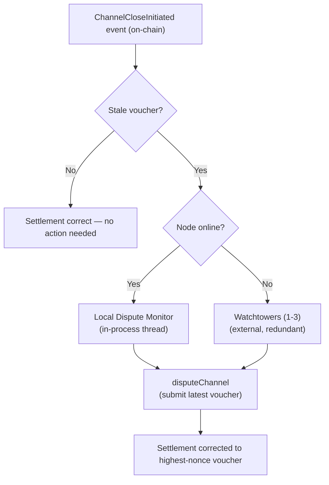

# ADR 007: Watchtower Design for Channel Disputes

**Date:** 2026-03-29
**Status:** Draft

## Context

ADR 003 defines a dispute window (default 48 hours for PoC, governable within 12h–72h) for payment channel settlement. Either party can counter a stale or fraudulent close by submitting a higher-nonce voucher during the window. This works if the counterparty is online — but if a node goes offline after a client submits a stale (low-amount) voucher, the node misses the dispute window and loses the difference between what it earned and what the stale voucher claims.

ADR 003 identifies this liveness gap explicitly (stale close, Option A) and proposes a watchtower as the solution. The tokenomics spec (Section 8) sketches economic parameters — 0.1% of channel deposit per 30-day monitoring period — but defers the protocol design. This ADR resolves both.

The threat is asymmetric in unidirectional channels. Vouchers are client-signed cumulative amounts; the node submits the highest voucher to maximise its payout. The stale-close attack is therefore a client submitting an old low-amount voucher to underpay the node. The reverse — a node submitting a lower voucher than it holds — harms only the node itself (the client gets a larger refund). Despite this asymmetry, the mechanism described here is symmetric: either party can delegate dispute protection to a watchtower.

## Decision

### 1. Watchtower Role

A watchtower is a non-custodial monitoring service that:

1. Watches for `ChannelCloseInitiated` events on the `StablePaymentChannel` contract
2. Holds the latest voucher for each registered channel
3. Submits a `disputeChannel` transaction if the on-chain close uses a lower-nonce voucher than what the watchtower holds

A watchtower **cannot steal funds** — vouchers authorise payment to the node, not to the watchtower. A watchtower **cannot worsen settlement** — `disputeChannel` only accepts vouchers with a strictly higher nonce than the current on-chain state. A watchtower **cannot grief** — submitting a higher-nonce voucher corrects settlement toward the true state.

### 2. Contract Integration

The `StablePaymentChannel.disputeChannel()` function must accept submissions from **any address**, not just the channel's client or provider. The voucher's EIP-712 signature (`ecrecover(signature) == channel.client`) is sufficient authorisation — no `msg.sender` access check is needed. The signature is verified against the EIP-712 domain separator defined in [ADR 003 — EIP-712 Voucher Signature](003-payments.md#eip-712-voucher-signature), which binds each voucher to a specific chain and contract deployment. Watchtower implementations must use the same domain separator when validating vouchers off-chain.

Required contract events for watchtower monitoring:

```solidity
event ChannelCloseInitiated(
    bytes32 indexed channelId,
    address indexed initiator,
    uint256 amount,
    uint256 nonce,
    uint256 disputeDeadline
);

event ChannelDisputed(
    bytes32 indexed channelId,
    address indexed disputor,
    uint256 newAmount,
    uint256 newNonce
);

event ChannelSettled(
    bytes32 indexed channelId,
    uint256 providerPayout,
    uint256 clientRefund,
    uint256 protocolFee
);
```

Watchtowers use `ChannelCloseInitiated` and `ChannelDisputed` for active dispute intervention. `ChannelSettled` signals that the dispute window has closed and the channel is finalised — watchtowers use this to stop monitoring the channel and clean up stored voucher state.

A successful `disputeChannel` call updates the on-chain `claimedAmount`, which changes the protocol fee computed at final settlement. See [ADR 003 — Fee Calculation on Disputed Closes](003-payments.md#fee-calculation-on-disputed-closes) for the full lifecycle.

No separate watchtower registry contract is needed. The watchtower relationship is purely off-chain — the watched party shares voucher state with the watchtower, and the watchtower submits disputes using its own EOA and gas.

### 3. Voucher Sharing Protocol

A new ALPN-scoped protocol: **`cdn/watchtower/v1`**, running over iroh QUIC alongside the existing protocols defined in ADR 005.

The watched party (typically the node) establishes a persistent connection to the watchtower and streams voucher updates:

```mermaid
sequenceDiagram
    participant W as Watched Party (Node)
    participant T as Watchtower

    W->>T: WatchtowerRegister {channel_id, deposit, counterparty, latest_voucher, fee_offer}
    T->>W: WatchtowerAccept {accepted, fee_rate, terms}

    loop Every voucher (at negotiated interval; default 1 MB)
        W->>T: VoucherUpdate {channel_id, amount, nonce, signature}
        T->>W: VoucherAck
    end

    W->>T: WatchtowerRevoke {channel_id}
```

**Frequency:** Every voucher — one update per voucher interval delivered, matching the negotiated voucher cadence from [ADR 003](003-payments.md#voucher-interval-negotiation). The default interval is 1 MB; for large blob transfers the interval may be negotiated up to 1024 MB. With larger intervals, the watchtower receives fewer updates. The watchtower must hold the absolute latest voucher to be effective. Each update is ~150 bytes; even at the default 1 MB cadence this is negligible overhead. See [Voucher state desynchronisation](#voucher-state-desynchronisation) for the security implications of larger intervals.

**Connection management:** If the QUIC connection drops, the watchtower retains the last received voucher and continues monitoring. The watched party should reconnect and resume updates. The watchtower's obligation persists as long as the channel is open and the monitoring period is paid for.

### 4. Discovery

**Initial approach (PoC through early production):** Off-chain, config-based. Node operators configure watchtower iroh NodeIds in their node config:

```toml
[watchtower]
peers = [
    "nodeid1...",
    "nodeid2...",
]
```

The node software connects to configured watchtowers at startup and registers channels as they are opened.

**Future (production at scale):** Watchtowers announce themselves on the global gossip topic (`cdn/global/v1`) with a `WatchtowerAnnounce` message containing their NodeId, Ethereum address, fee rate, and supported chain IDs. Clients and nodes discover watchtowers through gossip, filtered by fee rate and geographic proximity (RTT). An on-chain watchtower registry (extending the existing `NodeInfo` pattern) can be added if the market grows large enough to need trustless discovery.

### 5. Fee Model

| Parameter | Value |
| --- | --- |
| Base rate | 0.1% of channel deposit per 30-day monitoring period |
| Minimum fee | 0.50 USDC per 30-day period (floor to cover gas costs) |
| Denomination | USDC |
| Collection | Off-chain direct payment at registration time |
| Dispute gas bonus | 2× the L2 gas cost of a `disputeChannel` transaction, paid by watched party on successful dispute |

The fee is `max(0.1% × deposit, 0.50 USDC)`. At the minimum deposit of 1 USDC, the 0.1% rate yields $0.001 — far below gas costs — so the floor applies. For a 100 USDC deposit, the 0.1% rate yields $0.10, still below the floor. The floor becomes non-binding at deposits above 500 USDC.

**Payment method:** The watched party pays via a direct USDC transfer (signed ERC-20 `transfer` or `permit` + `transferFrom`) to the watchtower's Ethereum address at registration time. No contract modification needed. The watchtower verifies payment on-chain before accepting the registration.

**Gas economics:** A `disputeChannel` call on an L2 costs approximately $0.05–0.10. The dispute gas bonus (2× gas cost) ensures watchtowers are not penalised for actually performing their function. The bonus is paid off-chain by the watched party after the dispute settles — the watchtower provides the transaction hash as proof.

### 6. Redundancy

Each channel should be registered with **2–3 independent watchtowers**. The watched party establishes independent `cdn/watchtower/v1` connections to each and streams identical voucher updates.

Redundancy properties:
- **No coordination between watchtowers.** Each operates independently with its own copy of the latest voucher.
- **Multiple dispute submissions are harmless.** The contract accepts the highest-nonce voucher regardless of how many `disputeChannel` calls are made. Duplicate submissions waste gas but do not affect settlement.
- **Failure tolerance.** All watchtowers must fail simultaneously during the dispute window (default 48 hours) for the attack to succeed. With 3 independent operators, this requires correlated failure (shared infrastructure, coordinated attack, or bribery of all 3).

The watched party's software should monitor watchtower connection health and alert the operator if fewer than 2 watchtowers are connected for more than 1 hour.

### 7. Defense in Depth

Watchtowers are not the only line of defense. ADR 003 Option C — a local dispute monitor thread in the node binary — should be implemented alongside watchtower support. This lightweight process watches the chain for `ChannelCloseInitiated` events on channels the node is party to and auto-submits the latest voucher. It runs in-process, has zero latency to the voucher store, and handles the common case where the node is online but its main serving process is overloaded or restarting.

The defense stack is:

1. **Local dispute monitor** (in-process) — handles the node-is-online case
2. **Watchtowers** (external, redundant) — handles the node-is-offline case
3. **Dispute window (default 48h for PoC, governable 12h–72h)** — provides the time budget for both layers to respond



### 8. PoC Scope

| Aspect | PoC | Production |
| --- | --- | --- |
| Watchtower service | Not implemented | Required |
| `disputeChannel` access | No sender restriction (future-proof) | Same |
| Contract events | `ChannelCloseInitiated`, `ChannelDisputed`, `ChannelSettled` emitted | Same |
| Local dispute monitor | Recommended | Required |
| Discovery | N/A | Config-based → gossip → on-chain registry |
| Redundancy | N/A | 2–3 per channel |
| Fee model | N/A | 0.1% with 0.50 USDC floor |
| Watchtower staking | N/A | Deferred |

For PoC, the only action items are:

1. Ensure `disputeChannel` has no `msg.sender` restriction — voucher signature is the only authorisation
2. Emit `ChannelCloseInitiated`, `ChannelDisputed`, and `ChannelSettled` events
3. Optionally implement the local dispute monitor thread (Option C from ADR 003)

These three items future-proof the contract and node software for watchtower integration without implementing the watchtower service itself.

## Consequences

**Positive:**

- Closes the liveness gap identified in ADR 003 for stale close attacks — the primary unsolved payment security issue
- Non-custodial: watchtowers cannot steal funds, worsen settlement, or grief either party
- Minimal contract changes: `disputeChannel` already verifies the voucher signature; only the sender restriction removal and event additions are needed
- The `cdn/watchtower/v1` protocol reuses iroh QUIC transport, consistent with the networking stack in ADR 000
- Multiple watchtowers per channel provide redundancy without requiring coordination, consensus, or shared state between watchtowers
- Defense-in-depth layering (local monitor + watchtowers + dispute window) means no single component failure causes fund loss

**Negative:**

- Adds a new participant role with its own discovery, connectivity, and economic model — increases overall system complexity
- Off-chain fee payment is harder to enforce than on-chain deduction: a watchtower that stops getting paid may silently stop monitoring
- The watchtower must maintain a hot wallet with ETH for gas and monitor the chain continuously — non-trivial operational overhead that may limit the supply of watchtower operators
- Voucher sharing exposes channel activity patterns (amounts, frequency) to the watchtower. The privacy impact is low — vouchers are not secret (the counterparty already has them) — but it is a new data surface
- No on-chain accountability for watchtower liveness failure in the initial design. A watchtower that accepts fees but fails to dispute cannot be provably slashed until watchtower staking is implemented

### Fee Accountability

**PoC:** Fee payment is trust-based — the watched party sends USDC directly to the watchtower's address at registration. No escrow, no refund mechanism, no on-chain proof of service. A watchtower that accepts payment and disappears has no penalty. This is an accepted PoC limitation — the PoC does not implement watchtowers at all (see PoC Scope above), so the fee model is theoretical.

**Production:** Prepaid escrow with proof-of-monitoring. The watched party deposits the monitoring fee into a `WatchtowerEscrow` contract. The watchtower must submit periodic signed heartbeats (e.g., every 6 hours) proving it is monitoring the chain — each heartbeat includes the latest `ChannelCloseInitiated` event block number the watchtower has processed. If the watchtower misses N consecutive heartbeats (default: 3, i.e., 18 hours), the watched party can reclaim the escrowed fee. On successful completion of the monitoring period (no missed heartbeats, or a dispute was correctly submitted), the watchtower claims the escrowed fee. This provides on-chain accountability without requiring watchtower staking — the escrowed fee itself is the watchtower's bond.

## Attack Vectors

### Watchtower bribery

A malicious closer bribes the watchtower to withhold the counter-voucher during the dispute window.

Mitigated by redundancy: with 2–3 independent watchtowers, the attacker must bribe all of them. The bribe must exceed the watchtower's monitoring fee income plus reputational cost. For small channels the economics don't justify the coordination cost; for large channels the fee income and reputational stakes are proportionally higher.

---

### Collusion with counterparty

The watchtower and the attacker are the same entity or are colluding.

Mitigated by diverse selection: the watched party should choose watchtowers operated by different entities, ideally in different jurisdictions and on different infrastructure. Node software should warn if all configured watchtowers resolve to the same IP range or Ethereum address. Future on-chain watchtower staking would make collusion costlier (the colluding watchtower's stake is at risk if liveness failure is proven).

---

### Liveness failure (honest)

All watchtowers go offline simultaneously during a dispute window due to infrastructure failure, DDoS, or correlated outage.

The dispute window (48h PoC default, governable 12h–72h) is the primary buffer. For all 3 independent watchtowers to be offline for 24 consecutive hours requires a severe correlated event. The local dispute monitor (defense-in-depth) provides an additional layer — even if all watchtowers fail, the node itself can respond if it comes back online within the dispute window. Additionally, the watched party's software alerts the operator when watchtower connections drop, giving them time to manually submit the latest voucher.

---

### L2 sequencer censorship

The L2 sequencer censors the watchtower's `disputeChannel` transaction during the dispute window.

**Attack scenario.** A malicious closer (or a colluding sequencer) submits `closeChannel` with a stale voucher, then ensures all `disputeChannel` transactions are censored for the full dispute window. The watchtower falls back to L1 forced inclusion, but this takes up to ~24 hours (Arbitrum delayed inbox; OP Stack has a similar path). If the dispute window is also 24 hours, the effective dispute response time is **zero** — by the time the forced-inclusion transaction is processed, the window has expired.

**PoC mitigation.** The PoC default dispute window is raised to **48 hours** (172800 seconds). This guarantees at least 24 hours of effective dispute response time even under worst-case sequencer censorship on any L2 with a forced inclusion delay ≤ 24 hours. This is simple, L2-agnostic, and stays within the governance bounds (12h–72h, [ADR 009](009-governance.md)).

**Production mitigation — forced-inclusion deadline extension.** For production, the `StablePaymentChannel` contract implements a deadline extension mechanism: if a `disputeChannel` transaction arrives via L1 forced inclusion and the remaining dispute time is less than 24 hours, the `disputeDeadline` is automatically extended to `block.timestamp + 24 hours`. This allows production governance to set dispute windows shorter than 48 hours (down to the 12h minimum) without re-opening the censorship vulnerability.

Constraints on the extension mechanism:
- **One extension per close.** A second forced-inclusion dispute on the same channel does not trigger a further extension. This bounds the worst-case settlement delay to `disputeWindow + 24h`.
- **Only forced-inclusion transactions.** Normal sequencer-included `disputeChannel` calls do not trigger the extension, preventing abuse.
- **L2-specific detection.** Identifying a forced-inclusion transaction is inherently L2-specific. On Arbitrum, this can be detected via the `ArbSys` precompile or delayed inbox origin; on OP Stack, via L1 message origin. The exact detection logic is a parameter of the L2 chain selection decision (architecture.md, not yet decided) and will be finalized when the L2 is chosen.

---

### Fee extraction without service

A watchtower collects monitoring fees but never actually watches the chain.

Mitigated by periodic liveness testing: the watched party can open a test channel (small deposit), initiate a stale close, and verify the watchtower disputes within a reasonable time (e.g., 1 hour). If the watchtower fails the test, the watched party drops it and selects a replacement. This is off-chain verification — no contract support needed. Future watchtower staking with slashing for proven liveness failures provides stronger guarantees but is deferred.

---

### Voucher state desynchronisation

The QUIC connection between the watched party and watchtower drops. The watchtower holds an outdated voucher. A stale close occurs. The watchtower submits a counter-voucher that is newer than the stale close but not the absolute latest — settlement is better than the stale close but not optimal.

This is a partial-protection scenario, not a total failure. Mitigation: the watched party's software treats watchtower connection health as critical and alerts on disconnection. Automatic reconnection with full voucher resync on reconnect. The local dispute monitor covers the gap if the node is online. For the node-offline case, the most recent voucher the watchtower holds is still better than the stale voucher — the node recovers most of its earnings even if the absolute latest voucher is lost.

With negotiable voucher intervals ([ADR 003](003-payments.md#voucher-interval-negotiation)), larger gaps between voucher updates increase the potential value lost during a desynchronisation event. At a 100 MB interval and market rate, the worst case is the watchtower is one interval behind — a $0.001 discrepancy. At the governance maximum (~1 GB) and ceiling rate ($0.001/MB), the worst-case discrepancy is $1.024. Operators delivering high-value large blobs should weigh the tradeoff between fewer voucher round-trips and larger desynchronisation exposure when choosing an interval.
