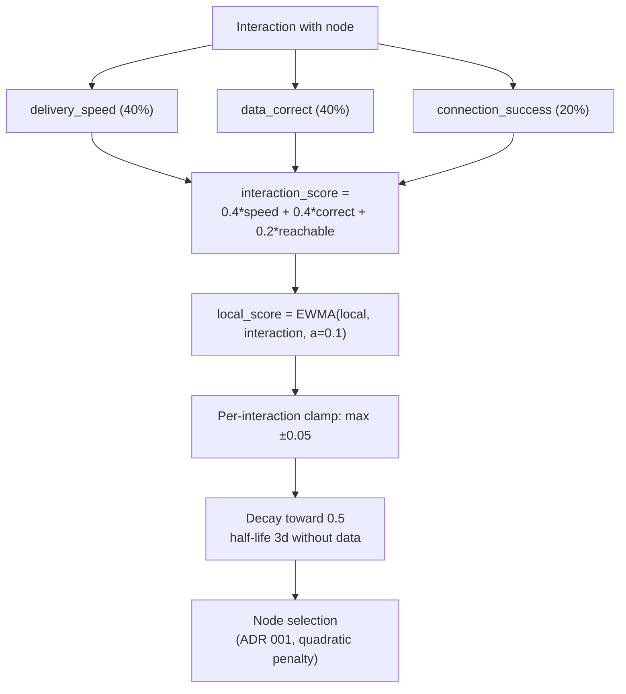

# ADR 008: Reputation System

**Date:** 2026-03-29
**Status:** Draft

## Context

> **Tokenomics cross-reference.** Per [ADR 026](026-tokenomics.md#adr-026-tokenomics), operator return is entirely USDC-denominated: per-byte settlement (60% operator base at the `FeeRouter`). Reputation is **not** an eligibility gate, a governance input, or a component of settlement or vote weight. The on-chain defenses against capacity-inflation are structural and independent of reputation: vote weight is sourced from `FeeRouter.bytesInWindow` per [ADR 036](036-served-bytes-voting-weight.md#adr-036-served-bytes-voting-weight) (proven delivered bytes, not declared capacity), and the super-linear capacity-bond curve makes over-declared capacity dead capital. Reputation influences only a client's own node-selection probability ([ADR 001](001-network.md#node-selection-algorithm)).

The network needs to rank nodes beyond staking alone. Staking provides Sybil resistance but does not measure service quality. Clients need to prefer fast, reliable nodes and avoid slow or unresponsive ones without on-chain proof for every quality metric.

Reputation is **local-only**: each node scores its peers from its own direct delivery observations, and nothing else. There is no network propagation of reputation, no cross-node aggregation, and no network-wide reputation score. A node's ranking of a peer reflects only interactions that node has witnessed itself — the same tit-for-tat principle BitTorrent uses for peer selection, which needs no global reputation to function at scale.

This is deliberate. Reputation is not the Sybil or corruption defense — stake, the capacity bond, mandatory progressive BLAKE3 verification, and no-payment-on-failed-delivery are (see [ADR 002](002-content-addressing.md#adr-002-content-addressing), [ADR 003](003-payments.md#adr-003-payment-model), [ADR 026](026-tokenomics.md#adr-026-tokenomics)). Reputation only tunes each client's selection probability among otherwise-eligible nodes. Keeping it local avoids the failure modes a shared, aggregated score would introduce: herding onto incumbents (a shared score concentrates load and starves cold nodes), an incumbency amplifier (credibility-weighted reporters), and a permanent attack surface (eclipse, coordinated negative reports, replay, clock-sync). A local score has none of these: a peer a node has never used stays neutral and fully selectable, so traffic keeps exploring rather than converging.

## Decision

### Local Scoring

Each node maintains a per-peer score derived solely from its own interactions. No network propagation, no reporter weighting, no on-chain reputation state.

- Score range: 0.0 to 1.0 (stored internally as u32, 0 to 1,000,000, for 6-decimal precision)
- Initial score for new nodes: 0.5 (neutral)
- A peer the node has never interacted with is **unscored** and treated as neutral (0.5) by the selection algorithm

### Local Score Calculation

After each interaction with a node, the node updates that peer's score using EWMA:

```
local_score = ewma(local_score, interaction_score, alpha=0.1)
```

Where interaction_score is:

| Metric | Score Contribution | Weight |
|--------|-------------------|--------|
| Delivery speed (bytes/sec vs. reference) | 0.0-1.0 (log scale) | 40% |
| Data correctness (BLAKE3 verified) | 0.0 or 1.0 (binary) | 40% ¹ |
| Connection success (reachable?) | 0.0 or 1.0 (binary) | 20% |

Formula: `interaction_score = 0.4 * speed_score + 0.4 * correctness + 0.2 * reachability`

> **¹ Why 40% for data correctness — same as delivery speed?** Reputation measures *service quality*, not *honesty*. Data correctness is one quality signal among several; the primary corruption deterrent is **economic** (no payment for failed delivery) **plus traffic loss** (reputation-driven node selection), not on-chain slashing. Content corruption is fully absorbed at the wire by progressive BLAKE3 verification at the client (mandatory in `cdn/client/v1` per [ADR 002](002-content-addressing.md#adr-002-content-addressing) / [ADR 005](005-protocol.md#adr-005-wire-protocol)) — a corrupt window yields no voucher, so the node is unpaid for the bandwidth shipping garbage; see [ADR 003 § Corrupted delivery](003-payments.md#corrupted-delivery). Reputation impact compounds on top: a single corruption event (a) zeros the correctness component (−0.4 on `interaction_score`), (b) drops `local_score` via EWMA, (c) degrades node selection via the quadratic reputation penalty (`1/max(reputation, 0.1)²` — [ADR 001](001-network.md#node-selection-algorithm)). Lost revenue plus the traffic-routing penalty make sustained corruption irrational. A higher reputation weight or an immediate local blacklist would over-penalize transient bao-pull failures that the EWMA already absorbs.

Normalization: `speed_score = clamp(ln(1 + actual_bps) / ln(1 + reference_bps), 0.0, 1.0)`, where `reference_bps` is a node-local configurable throughput that scores ~1.0 (default: 1 GiB/s = 1,073,741,824 bytes/sec). The log curve does not saturate at a flat baseline. Throughput above ~80 Mbps scores strictly higher as it climbs, so a materially faster node earns a materially better speed score rather than tying with every other high-throughput node.

EWMA with alpha=0.1 means recent interactions matter more but old interactions still contribute.

A throughput-floor or inactivity abort on the pull path produces no interaction outcome and never updates the EWMA. A pull that the requester abandons because its throughput fell below the floor is requester-local policy, the same class as an unsigned timeout: the slowness may come from the link, congestion, or the requester's own consumption, and a throughput signal is spoofable, so it is not evidence about the peer. The requester still stops using that peer for that blob — a local, reputation-neutral suppression — but the peer keeps its score. See [ADR 005 § Retry behavior](005-protocol.md#adr-005-wire-protocol).

### Score Decay

Scores decay toward neutral (0.5) over time without new data, so a peer that stops being used drifts back to unopinionated rather than holding a stale high or low score. The node applies closed-form half-life decay at read time, from the last update:

```
score_new = 0.5 + (score_old - 0.5) * 0.5 ^ (elapsed_secs / half_life_secs)
```

Each half-life halves the distance between the score and neutral. `half_life_secs` is a node-local configurable value, default 3 days (259,200 seconds). A `half_life_secs` of `0` disables decay. Examples at the default half-life:

- Score 1.0: +3 days = 0.75, +6 days = 0.625, +9 days = 0.5625
- Score 0.0: +3 days = 0.25, +6 days = 0.375, +9 days = 0.4375

Scores converge to 0.5 asymptotically, reaching within 0.05 of neutral after roughly 4.3 half-lives (about 13 days at the default).

The half-life is deliberately sub-weekly. A transiently dinged node re-enters selection within days rather than weeks, and no incumbent coasts on a stale high score for weeks after it stops delivering — both widen the serving set. [`Outcome::Unreachable`] reachability failures ride this same decay as an ordinary negative sample. There is no separate hard-crater penalty for a peer that becomes briefly unreachable.

| Parameter | Value |
|-----------|-------|
| Decay half-life | 3 days (259,200 s) by default, node-local configurable; `0` disables decay |
| Decay applied | Continuously from the last update, computed lazily at read time |
| Minimum score (floor) | 0.0 (selection algorithm clamps at 0.1 — see [ADR 001](001-network.md#node-selection-algorithm)) |

### Score Clamping

A single interaction can move a peer's `local_score` by at most 0.05 in either direction. This per-report cap prevents one bad interaction from destroying a good node's standing.

**Interaction with EWMA:** clamping applies to the delta produced by the EWMA update — compute the EWMA result, then cap the change at ±0.05. With alpha=0.1 the EWMA itself limits deltas to `0.1 × |interaction_score − local_score|`, so the clamp only binds when the score gap exceeds 0.5 (e.g., a node at 0.9 receiving a 0.0 interaction).

**Selection clamp:** independently of per-interaction clamping, the node selection formula in [ADR 001](001-network.md#node-selection-algorithm) clamps reputation to `max(reputation, 0.1)` to avoid division by zero. Nodes with reputation below 0.1 are scored identically (100× penalty vs. a perfect node) — effectively unselectable but not blacklisted.

### Tie-Breaking

When multiple nodes have the same unified selection score (within 1% — see [ADR 001, Node Selection Algorithm](001-network.md#node-selection-algorithm)), select by:

1. Geographic diversity (prefer nodes in regions not already selected)
2. Higher stake (more skin in the game)
3. Random (final tiebreaker)



## Consequences

### Positive

- A node's ranking of a peer always reflects its own experience — there is no subjective network score, no convergence problem, and no reporter-credibility incumbency advantage.
- No reputation propagation, no reporter weighting, no distinct-counterparty / settled-value machinery, no clock-sync dependency, and no eclipse or coordinated-reporting attack surface — none of it exists to attack or maintain.
- Naturally load-spreading: a peer a node has never used stays neutral (0.5) and fully selectable, so traffic keeps exploring new and cold nodes rather than herding onto established ones (the role BitTorrent gives optimistic unchoking).
- Score clamping limits the damage from any single bad interaction; decay prevents stale scores from persisting.
- Reputation is decoupled from settlement and governance entirely — an operator's USDC earnings and served-bytes vote weight ([ADR 036](036-served-bytes-voting-weight.md#adr-036-served-bytes-voting-weight)) never depend on any peer's opinion of it.

### Negative

- A node learns a peer is unreliable only by interacting with it — there is no early warning from other nodes' experience. This cost is bounded: mandatory progressive BLAKE3 verification plus no-payment-on-failed-delivery cap a bad interaction at roughly one unpaid window of wasted ingress, and the peer earns nothing for shipping garbage (see [ADR 003 § Corrupted delivery](003-payments.md#corrupted-delivery)).
- A node's view is inherently biased toward its own usage pattern. This is intended — local observation is the signal.
- Network-wide avoidance of a persistently bad actor is not automatic. Provable faults are handled by slashing ([ADR 028](028-slashing-appeals.md#adr-028-slashing-appeals-and-dispute-escalation)), not reputation; merely-mediocre nodes are down-weighted independently by each client that encounters them.
