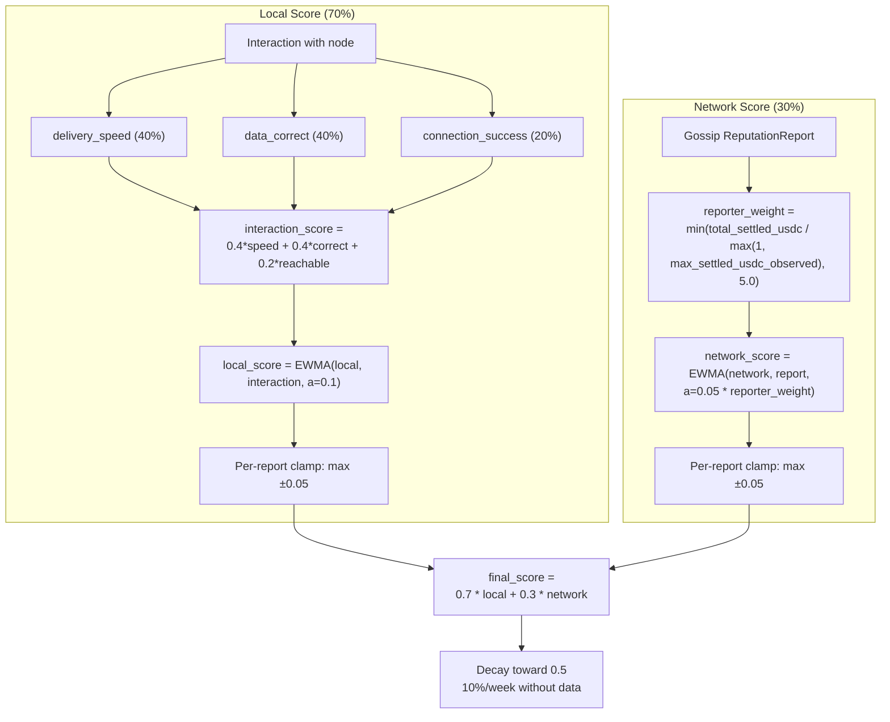
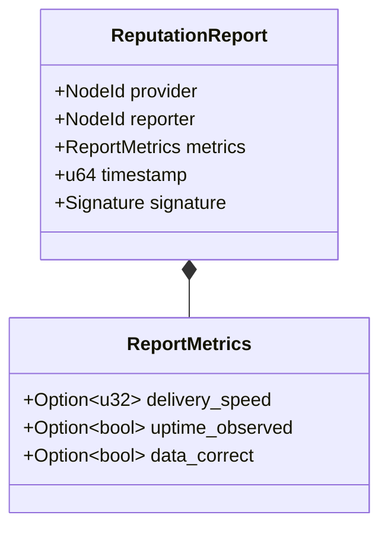

# ADR 008: Reputation System

**Date:** 2026-03-29
**Status:** Draft

## Context

The network needs a mechanism to rank nodes beyond staking alone. Staking provides Sybil resistance but does not measure service quality. Clients need a way to prefer fast, reliable nodes and avoid slow or unresponsive ones without requiring on-chain proof for every quality metric. A gossip-based reputation system using interaction-weighted scoring fills this gap.

## Decision

### 1. Three-Tier Architecture

| Tier | Mechanism |
|------|-----------|
| Local | Direct observations (delivery speed, uptime, data correctness) |
| Network | Gossip-propagated signed reports via iroh-gossip |
| On-chain | Stake weight for sybil resistance, slashing for provable faults |

### 2. Score Model

- Score range: 0.0 to 1.0 (stored internally as u32, 0 to 1,000,000, for 6-decimal precision)
- Initial score for new nodes: 0.5
- Weight: local observations 70%, network gossip 30%

### 3. Local Score Calculation

After each interaction with a node, the client updates its local score using EWMA:

```
local_score = ewma(local_score, interaction_score, alpha=0.1)
```

Where interaction_score is:

| Metric | Score Contribution | Weight |
|--------|-------------------|--------|
| Delivery speed (bytes/sec vs. expected) | 0.0-1.0 (linear scale) | 40% |
| Data correctness (BLAKE3 verified) | 0.0 or 1.0 (binary) | 40% |
| Connection success (reachable?) | 0.0 or 1.0 (binary) | 20% |

Formula: `interaction_score = 0.4 * speed_score + 0.4 * correctness + 0.2 * reachability`

EWMA with alpha=0.1 means recent interactions matter more but old interactions still contribute.

### 4. Network Score Aggregation

Reports received via iroh-gossip are aggregated using EWMA weighted by reporter credibility:

```
weight_cap = 5.0
raw_weight = total_settled_usdc(reporter) / max(1, max_settled_usdc_observed)
reporter_weight = min(raw_weight, weight_cap)
network_score = ewma(network_score, report.score, alpha=0.05 * reporter_weight)
```

- `total_settled_usdc(reporter)`: cumulative USDC value across all payment channels the reporter has settled on-chain (verifiable), counting channels where the reporter was **either the client or the provider**. Including both sides gives credit to nodes that pay for cache-miss pulls, not only nodes that receive payment for delivery. **Value-weighted, not count-weighted** — this prevents Sybil manipulation via many cheap channels (opening 100 channels with 1 USDC each gives the same weight as one channel with 100 USDC, making the attack cost proportional to desired influence rather than proportional to channel count).
- `max(1, max_settled_usdc_observed)`: the `max(1, ...)` guard prevents division by zero at network bootstrap when no channels have been settled yet. At bootstrap, all reporters have weight 0 (no settled value), so network scores remain at their initial value (0.5) until the first channels settle. **Note:** `max_settled_usdc_observed` is local to each node, so two nodes may compute different weights for the same reporter. This means network scores are inherently subjective and will not converge to a single global value — an accepted property of the design (see Consequences).
- `weight_cap`: caps reporter influence at 5× to prevent established high-earning nodes from having disproportionate control over network reputation. The cap preserves the anti-Sybil property (influence still scales with capital) while bounding the maximum incumbency advantage.
- Alpha is scaled by reporter weight: high-credibility reporters (more settled value) move the score faster

### 5. Combined Score

```
final_score = 0.7 * local_score + 0.3 * network_score
```

If a client has no local observations for a node (never interacted), it uses 100% network score.



### 6. Gossip Protocol

Dedicated gossip topic (`cdn/reputation/v1`) — all nodes subscribe. After interacting with a node, a node broadcasts a signed reputation report:

```rust
struct ReputationReport {
    provider: NodeId,
    reporter: NodeId,
    metrics: ReportMetrics,
    timestamp: u64,
    signature: Signature,
}

struct ReportMetrics {
    delivery_speed: Option<u32>,  // bytes/sec
    uptime_observed: Option<bool>,
    data_correct: Option<bool>,
}
```

Reports only accepted from staked nodes. **Client exclusion:** Only staked nodes may submit gossip reputation reports; clients (unstaked requesters) contribute to reputation only via their own local scores (Section 3). This is intentional — without a staking requirement, an attacker could spin up disposable clients to flood the gossip topic with cheap reputation reports, bypassing the economic cost that makes manipulation expensive. **Recency validation:** receivers MUST reject reports where either (a) `current_time - report.timestamp > max_report_age_secs` (too old) or (b) `report.timestamp > current_time + allowed_clock_skew_secs` (too far in the future). Defaults: `max_report_age_secs = 3600` (1 hour), `allowed_clock_skew_secs = 300` (5 minutes). This prevents replay of old reports and prevents reporters from using far-future timestamps to extend the replay window. The effective replay window is bounded to `max_report_age_secs + allowed_clock_skew_secs` (~65 minutes). **Gossip deduplication:** As with `NodeAnnounce` messages ([ADR 001, Node Discovery](001-network.md#node-discovery-gossip)), iroh-gossip's transport-layer deduplication (PlumTree seen-message tracking) prevents the same `ReputationReport` from being delivered to a node more than once via multiple epidemic paths. Unlike `NodeAnnounce`, no monotonic timestamp check is applied to reputation reports because the application layer is inherently tolerant of duplicates: the EWMA aggregation (Section 4) absorbs repeated data points with bounded impact thanks to the per-report clamp of ±0.05 (Section 8), and the rate limit of 1 report per (reporter, provider) pair per hour (Section 11) independently rejects replayed reports within the same window. No additional application-level seen-set is needed. **Clock sync dependency:** unlike the probe/stream timestamps (which are requester-generated and avoid clock sync — see ADR 005), reputation recency depends on loose clock agreement between reporter and receiver. The 1-hour + 5-minute window is tolerant of typical NTP drift but not of nodes with completely unsynchronized clocks.



### 7. Score Decay (Production Only)

Scores decay toward neutral (0.5) over time without new data. Applied iteratively each week:

```
score_new = score_old + (0.5 - score_old) * decay_rate
```

With `decay_rate = 0.10` (10% per week). Examples:

- Score 1.0: week 1 = 0.95, week 5 = 0.80, week 10 = 0.65, week 20 = 0.53
- Score 0.0: week 1 = 0.05, week 5 = 0.20, week 10 = 0.35, week 20 = 0.47

Scores converge to 0.5 asymptotically, reaching within 0.05 of neutral after ~30 weeks.

| Parameter | Value |
|-----------|-------|
| Decay rate | 10% per week (applied iteratively) |
| Decay starts after | 1 week with no new reports or interactions |
| Minimum score (floor) | 0.0 (selection algorithm clamps at 0.1 — see [ADR 001](001-network.md#node-selection-algorithm)) |
| Reporter weight cap | 5.0 (max `reporter_weight` value; bounds the EWMA alpha multiplier) |
| Scope | Production only — see [Section 12](#12-poc-scope) for PoC scope |

### 8. Score Clamping

A single reputation report (local or network) can move a node's `local_score` or `network_score` by at most 0.05 in either direction. The derived weighted `final_score` (70% local, 30% network) is not separately clamped. This per-report cap prevents one bad interaction from destroying a good node or one fake report from inflating a sybil.

**Interaction with EWMA:** Per-report clamping applies to the delta produced by the EWMA update for `local_score` and `network_score` — compute the EWMA result for the relevant component, then cap the change at ±0.05. For local scores (alpha=0.1), the EWMA itself limits deltas to `0.1 × |interaction_score − local_score|`, so per-report clamping only binds when the score gap exceeds 0.5 (e.g., a node at 0.9 receiving a 0.0 interaction). For network scores, high-weight reporters (alpha up to 0.25) can produce EWMA deltas up to 0.25, making per-report clamping the primary rate limiter — this is intentional, ensuring no single report, however credible, moves a component score by more than 0.05.

**Selection clamp:** Independently of per-report clamping, the node selection formula in [ADR 001](001-network.md#node-selection-algorithm) clamps reputation to `max(reputation, 0.1)` to avoid division by zero. Nodes with reputation below 0.1 are scored identically (100× penalty vs. a perfect node) — effectively unselectable but not blacklisted.

### 9. Tie-Breaking

When multiple nodes have the same unified selection score (within 1% — see [ADR 001, Node Selection Algorithm](001-network.md#node-selection-algorithm)), select by:

1. Lower current load (from `LoadHint` in `NodeAnnounce` gossip messages — see [ADR 001](001-network.md))
2. Geographic diversity (prefer nodes in regions not already selected)
3. Higher stake (more skin in the game)
4. Random (final tiebreaker)

### 10. Cold-Start Bootstrap

During the first 7 days after staking (or first 50 completed interactions, whichever comes first), new nodes receive a 10% selection bonus — scores temporarily boosted by 0.05 (additive), clamped to 1.0: `boosted_score = min(final_score + 0.05, 1.0)`. Local to each client, decays linearly over the bootstrap period.

### 11. Rate Limiting

- Max 1 report per (reporter, node) pair per hour
- Max 10 reports per reporter per hour
- Reports exceeding limits are silently dropped by receiving nodes
- Enforced locally by each node on received gossip messages

### 12. PoC Scope

| Aspect | PoC | Production |
| --- | --- | --- |
| Local score calculation | Implemented (EWMA from delivery interactions) | Same |
| Network gossip scores | Not implemented (no gossip aggregation) | Full implementation as described |
| Combined score | Local-only (`final_score = local_score`; no network component) | 70/30 local/network blend |
| Score decay | Not implemented (scores persist indefinitely) | 10%/week toward 0.5 |
| Score clamping | Not implemented (no per-report ±0.05 cap) | Per-report ±0.05 cap |
| Cold-start bootstrap bonus | Not implemented | +0.05 additive, linear decay over 7 days / 50 interactions |
| Rate limiting | Not implemented (no gossip to rate-limit) | Per Section 11 |
| ReputationReport gossip | Not implemented | Signed reports on `cdn/reputation/v1` topic |
| Tie-breaking | Simplified: lower load → random | Full 4-tier (load → geo → stake → random) |
| Initial score | 0.5 (same) | 0.5 |

For PoC, reputation is local-only — each client tracks its own observations of node performance (delivery speed, correctness, reachability) via EWMA. There is no gossip propagation, no decay, and no per-report clamping (the selection floor `max(reputation, 0.1)` from [ADR 001](001-network.md#node-selection-algorithm) still applies). The node selection algorithm in [ADR 001](001-network.md#node-selection-algorithm) uses `final_score = local_score` directly. This exercises the core scoring path (interaction → EWMA → selection weight) without the complexity of cross-node reputation aggregation.

PoC action items:

1. Implement `local_score` EWMA calculation (Section 3)
2. Wire `local_score` into the node selection formula as `reputation` ([ADR 001](001-network.md#node-selection-algorithm))
3. Store per-node local scores in memory (no persistence required for PoC)

## Consequences

### Positive

- Interaction-weighted scoring makes reputation manipulation expensive — you need real economic activity (settled payment channels), not just stake
- Local observations dominate (70%), so a node's own experience always outweighs the crowd
- Score clamping limits the damage from individual malicious reports
- Cold-start bootstrap gives new nodes enough traffic to build a real track record
- Decay prevents stale high scores from persisting indefinitely

### Negative

- Off-chain reputation is inherently subjective — no single ground truth
- A well-funded attacker can build real interaction history to manipulate scores; cost scales linearly with desired influence
- Reporter weight creates a residual incumbency advantage — established nodes with more settled USDC have more influence over network scores. The weight cap (5×) bounds this advantage but does not eliminate it
- Gossip-based propagation adds bandwidth overhead, though rate limiting bounds this
- The 70/30 local/network split means a client's view of the network is biased toward its own usage patterns
- PoC uses local-only scores (no gossip, no decay, no per-report clamping) — see [Section 12](#12-poc-scope) for full PoC scope
