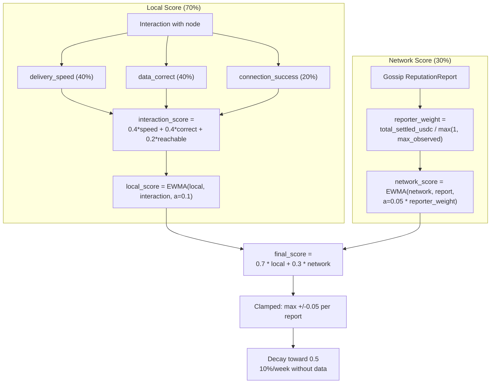
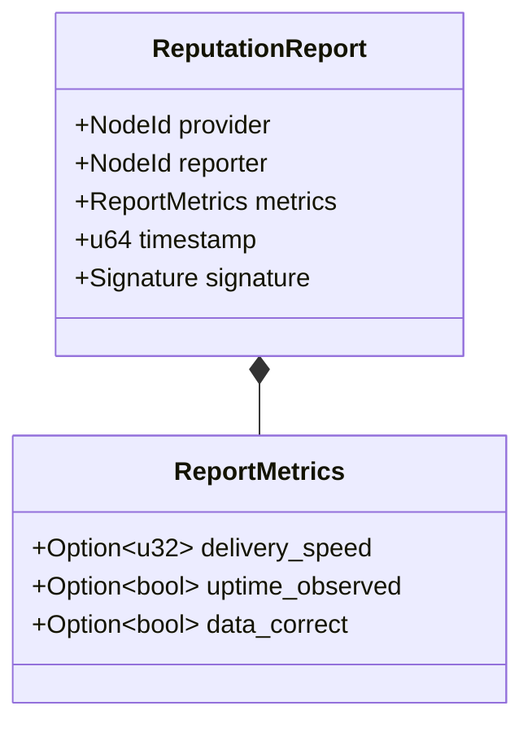

# ADR 008: Reputation System

**Date:** 2026-03-29
**Status:** Draft

## Context

The network needs a mechanism to rank nodes beyond staking alone. Staking provides Sybil resistance but does not measure service quality. Clients need a way to prefer fast, reliable nodes and avoid slow or unresponsive ones without requiring on-chain proof for every quality metric. A gossip-based reputation system using interaction-weighted scoring fills this gap.

## Decision

### 1. Three-Tier Architecture

| Tier | Mechanism |
|------|-----------|
| Local | Direct observations (delivery speed, uptime, data correctness) |
| Network | Gossip-propagated signed reports via iroh-gossip |
| On-chain | Stake weight for sybil resistance, slashing for provable faults |

### 2. Score Model

- Score range: 0.0 to 1.0 (stored internally as u32, 0 to 1,000,000, for 6-decimal precision)
- Initial score for new nodes: 0.5
- Weight: local observations 70%, network gossip 30%

### 3. Local Score Calculation

After each interaction with a node, the client updates its local score using EWMA:

```
local_score = ewma(local_score, interaction_score, alpha=0.1)
```

Where interaction_score is:

| Metric | Score Contribution | Weight |
|--------|-------------------|--------|
| Delivery speed (bytes/sec vs. expected) | 0.0-1.0 (linear scale) | 40% |
| Data correctness (BLAKE3 verified) | 0.0 or 1.0 (binary) | 40% |
| Connection success (reachable?) | 0.0 or 1.0 (binary) | 20% |

Formula: `interaction_score = 0.4 * speed_score + 0.4 * correctness + 0.2 * reachability`

EWMA with alpha=0.1 means recent interactions matter more but old interactions still contribute.

### 4. Network Score Aggregation

Reports received via iroh-gossip are aggregated using EWMA weighted by reporter credibility:

```
reporter_weight = total_settled_usdc(reporter) / max(1, max_settled_usdc_observed)
network_score = ewma(network_score, report.score, alpha=0.05 * reporter_weight)
```

- `total_settled_usdc(reporter)`: cumulative USDC value across all payment channels the reporter has settled on-chain (verifiable). **Value-weighted, not count-weighted** — this prevents Sybil manipulation via many cheap channels (opening 100 channels with 1 USDC each gives the same weight as one channel with 100 USDC, making the attack cost proportional to desired influence rather than proportional to channel count).
- `max(1, max_settled_usdc_observed)`: the `max(1, ...)` guard prevents division by zero at network bootstrap when no channels have been settled yet. At bootstrap, all reporters have weight 0 (no settled value), so network scores remain at their initial value (0.5) until the first channels settle.
- Alpha is scaled by reporter weight: high-credibility reporters (more settled value) move the score faster

### 5. Combined Score

```
final_score = 0.7 * local_score + 0.3 * network_score
```

If a client has no local observations for a node (never interacted), it uses 100% network score.



### 6. Gossip Protocol

Dedicated gossip topic (`reputation/v1`) — all nodes subscribe. After interacting with a node, a node broadcasts a signed reputation report:

```rust
struct ReputationReport {
    provider: NodeId,
    reporter: NodeId,
    metrics: ReportMetrics,
    timestamp: u64,
    signature: Signature,
}

struct ReportMetrics {
    delivery_speed: Option<u32>,  // bytes/sec
    uptime_observed: Option<bool>,
    data_correct: Option<bool>,
}
```

Reports only accepted from staked nodes. **Recency validation:** receivers MUST reject reports where `current_time - report.timestamp > max_report_age_secs` (default: 3600 seconds / 1 hour). This prevents replay of old reports — a report from weeks ago cannot be resubmitted to re-damage a recovered node's reputation. The `timestamp` is reporter-generated and cannot be verified for accuracy, but the recency check bounds the replay window: an attacker can replay a report for at most 1 hour after it was originally broadcast.



### 7. Score Decay (Production Only)

Scores decay toward neutral (0.5) over time without new data. Applied iteratively each week:

```
score_new = score_old + (0.5 - score_old) * decay_rate
```

With `decay_rate = 0.10` (10% per week). Examples:

- Score 1.0: week 1 = 0.95, week 5 = 0.80, week 10 = 0.65, week 20 = 0.53
- Score 0.0: week 1 = 0.05, week 5 = 0.20, week 10 = 0.35, week 20 = 0.47

Scores converge to 0.5 asymptotically, reaching within 0.05 of neutral after ~30 weeks.

| Parameter | Value |
|-----------|-------|
| Decay rate | 10% per week (applied iteratively) |
| Decay starts after | 1 week with no new reports or interactions |
| Minimum score (floor) | 0.0 |
| Scope | Production only (PoC uses static scores, no decay) |

### 8. Score Clamping

A single reputation report (local or network) can move a node's score by at most 0.05 in either direction. Prevents one bad interaction from destroying a good node or one fake report from inflating a sybil.

### 9. Tie-Breaking

When multiple nodes have the same unified selection score (within 1% — see [ADR 001, Node Selection Algorithm](001-network.md#node-selection-algorithm)), select by:

1. Lower current load (nodes include approximate load in gossip announcements)
2. Geographic diversity (prefer nodes in regions not already selected)
3. Higher stake (more skin in the game)
4. Random (final tiebreaker)

### 10. Cold-Start Bootstrap

During the first 7 days after staking (or first 50 completed interactions, whichever comes first), new nodes receive a 10% selection bonus — scores temporarily boosted by 0.05 (additive). Local to each client, decays linearly over the bootstrap period.

### 11. Rate Limiting

- Max 1 report per (reporter, node) pair per hour
- Max 10 reports per reporter per hour
- Reports exceeding limits are silently dropped by receiving nodes
- Enforced locally by each node on received gossip messages

## Consequences

### Positive

- Interaction-weighted scoring makes reputation manipulation expensive — you need real economic activity (settled payment channels), not just stake
- Local observations dominate (70%), so a node's own experience always outweighs the crowd
- Score clamping limits the damage from individual malicious reports
- Cold-start bootstrap gives new nodes enough traffic to build a real track record
- Decay prevents stale high scores from persisting indefinitely

### Negative

- Off-chain reputation is inherently subjective — no single ground truth
- A well-funded attacker can build real interaction history to manipulate scores; cost scales linearly with desired influence
- Gossip-based propagation adds bandwidth overhead, though rate limiting bounds this
- The 70/30 local/network split means a client's view of the network is biased toward its own usage patterns
- PoC uses static scores (no decay, no clamping) — production behavior is untested until migration
