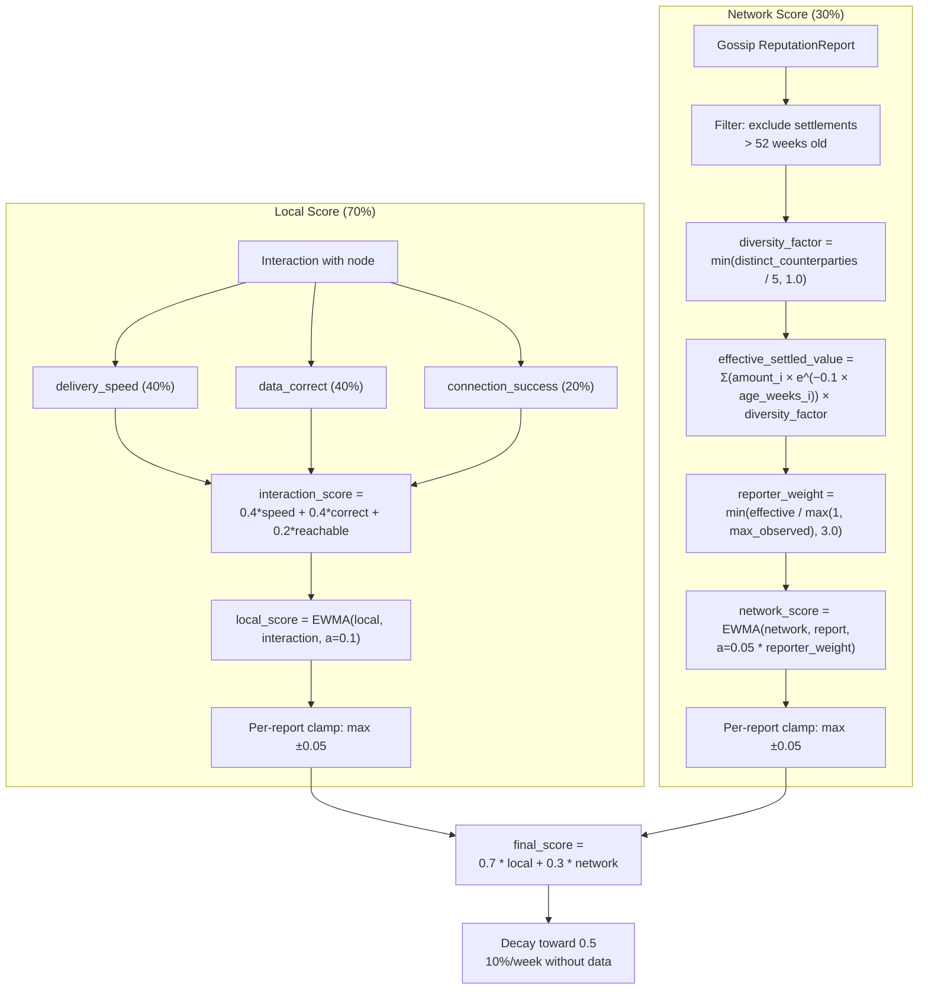
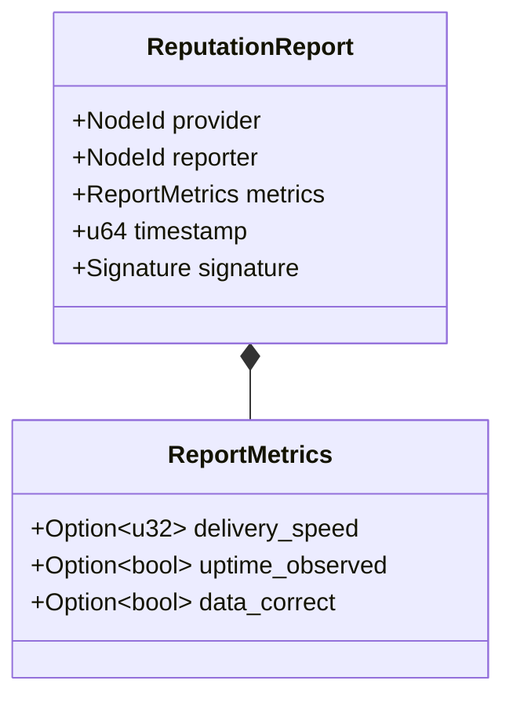

# ADR 008: Reputation System

**Date:** 2026-03-29
**Status:** Draft

## Context

> **Tokenomics cross-reference.** [ADR 026](026-gauge-boost-tokenomics.md) introduces a gauge-boost reward pool whose payout is weighted by `working_bytes` per operator. The byte counter alone is gameable via self-routed traffic; the on-chain defense is the [ADR 026 §3 per-operator gauge-share cap](026-gauge-boost-tokenomics.md#per-operator-gauge-share-cap). Reputation contributes complementary off-chain signal — operator-cluster detection, diversity-of-service signal, governance input for cap-tuning — but is not itself a gauge-eligibility gate. See Section 12.

The network needs to rank nodes beyond staking alone. Staking provides Sybil resistance but does not measure service quality. Clients need to prefer fast, reliable nodes and avoid slow or unresponsive ones without on-chain proof for every quality metric. A gossip-based reputation system using interaction-weighted scoring fills this gap.

## Decision

### 1. Three-Tier Architecture

| Tier | Mechanism |
|------|-----------|
| Local | Direct observations (delivery speed, uptime, data correctness) |
| Network | Gossip-propagated signed reports via iroh-gossip |
| On-chain | Stake weight for sybil resistance, slashing for provable faults |

### 2. Score Model

- Score range: 0.0 to 1.0 (stored internally as u32, 0 to 1,000,000, for 6-decimal precision)
- Initial score for new nodes: 0.5
- Weight: local observations 70%, network gossip 30%

### 3. Local Score Calculation

After each interaction with a node, the client updates its local score using EWMA:

```
local_score = ewma(local_score, interaction_score, alpha=0.1)
```

Where interaction_score is:

| Metric | Score Contribution | Weight |
|--------|-------------------|--------|
| Delivery speed (bytes/sec vs. expected) | 0.0-1.0 (linear scale) | 40% |
| Data correctness (BLAKE3 verified) | 0.0 or 1.0 (binary) | 40% ¹ |
| Connection success (reachable?) | 0.0 or 1.0 (binary) | 20% |

Formula: `interaction_score = 0.4 * speed_score + 0.4 * correctness + 0.2 * reachability`

> **¹ Why 40% for data correctness — same as delivery speed?** Reputation measures *service quality*, not *honesty*. Data correctness is one quality signal among several; the primary corruption deterrent is **economic** (no payment for failed delivery) **plus traffic loss** (reputation-driven node selection), not on-chain slashing. Content corruption is fully absorbed at the wire by progressive BLAKE3 verification at the client (mandatory in `cdn/client/v1` per [ADR 002](002-content-addressing.md) / [ADR 005](005-protocol.md)) — a corrupt window yields no voucher, so the node is unpaid for the bandwidth shipping garbage; see [ADR 003 §Corrupted delivery](003-payments.md#corrupted-delivery). Reputation impact compounds on top: a single corruption event (a) zeros the correctness component (−0.4 on `interaction_score`), (b) drops `local_score` via EWMA, (c) degrades node selection via the quadratic reputation penalty (`1/max(reputation, 0.1)²` — [ADR 001](001-network.md#node-selection-algorithm)). Lost revenue plus the traffic-routing penalty make sustained corruption irrational. A higher reputation weight or immediate local blacklist would over-penalize transient bao-pull failures (a brief upstream issue that resolves before retry) that the EWMA already absorbs.

Normalization: `speed_score = min(1.0, actual_bps / expected_bps)` where `expected_bps` is a node-local configurable baseline (default: 10 MiB/s = 10,485,760 bytes/sec).

EWMA with alpha=0.1 means recent interactions matter more but old interactions still contribute.

### 4. Network Score Aggregation

Reports received via iroh-gossip are aggregated using EWMA weighted by reporter credibility:

```
weight_cap = 3.0
raw_weight = effective_settled_value(reporter) / max(1, max_effective_settled_value_observed)
reporter_weight = min(raw_weight, weight_cap)
network_score = ewma(network_score, report.score, alpha=0.05 * reporter_weight)
```

> **EWMA/clamp interaction:** The per-report clamp (±0.05) binds when `reporter_weight × gap > 1`. At the 3× cap the clamp activates for gaps above ~0.33; at weight 2×, above 0.5. For gap ≤ 0.33, the full 0–3× weight range produces proportional EWMA deltas without hitting the clamp. For gaps 0.33–0.5, weights above `1/gap` are clamp-limited but lower weights still differentiate. For gaps > 0.5, all weights above 2× produce identical clamped deltas. The 3× cap keeps the full weight range effective for the common case (small gaps), accepting that large corrections are clamp-governed regardless of reporter credibility.

- `effective_settled_value(reporter)`: the reporter's cumulative settlement value after distinct-counterparty discount and time decay (Sections 4.1–4.2). Gross value is computed from all payment channels the reporter has settled on-chain, normalized to a common unit. **PoC:** only USDC channels exist, so gross value equals `total_settled_usdc`. **Production (open design question):** multi-token normalization for reporter weight needs a mechanism to compare settlement values across tokens with different price scales. [ADR 010](010-multi-token.md) explicitly does not include protocol-level price normalization — its `addToken` signature carries only rate bounds, not token classification. A future amendment to ADR 010 (e.g., a `bool isStablecoinEquivalent` flag on `addToken`, or a separate `setTokenWeight` governance function) is needed before production multi-token reporter weighting. Including both sides credits nodes that pay for cache-miss pulls, not only nodes that receive delivery payment. **Value-weighted, not count-weighted** — this prevents Sybil manipulation via many cheap channels (100 channels of 1 USDC give the same weight as one channel of 100 USDC, making attack cost proportional to desired influence, not channel count).
- `max(1, max_effective_settled_value_observed)`: the `max(1, ...)` guard prevents division by zero at network bootstrap before any channels settle. At bootstrap all reporters have weight 0, so network scores stay at 0.5 until the first channels settle. **Note:** `max_effective_settled_value_observed` is local to each node, so two nodes may compute different weights for the same reporter — network scores are inherently subjective and will not converge to a single global value (accepted property; see Consequences). Because effective values decay over time (Section 4.2), the max observed value drifts downward — recompute periodically (e.g., hourly or on each new `ChannelSettled` event) rather than caching indefinitely.
- `weight_cap`: caps reporter influence at 3× to prevent established high-earning nodes from disproportionately controlling network reputation. The 3× value sits just above the ~2× clamp-saturation threshold, so the full weight range is effective for typical score gaps while the per-report clamp governs extreme divergences. Preserves the anti-Sybil property (influence still scales with capital) while tightening maximum incumbency advantage.
- Alpha is scaled by reporter weight: high-credibility reporters (more settled value) move the score faster

#### 4.1 Distinct-Counterparty Discount

The `effective_settled_value` computation applies a distinct-counterparty discount to prevent wash trading via self-dealing channels. For each reporter, the indexer tracks two quantities from `ChannelSettled` events:

- `gross_settled_value`: sum of all settlement amounts across channels where the reporter was either client or provider (i.e., the sum before applying diversity discount and time decay)
- `distinct_counterparties`: count of unique counterparty addresses across all settled channels within the last 52 weeks (`settlement_max_age` — see Section 4.2)

The diversity factor scales the time-decayed settlement sum (see Section 4.2 for the full formula):

```
diversity_factor = min(distinct_counterparties / min_counterparties, 1.0)
```

Where `min_counterparties = 5` (governance-tunable; hardcoded floor: 2).

**Effect on wash trading:** An attacker cycling funds between two self-owned addresses has `distinct_counterparties = 1`, yielding `diversity_factor = 0.2` — an 80% reduction in effective weight. Full credit needs settlements with 5+ distinct counterparties, each requiring a separate staking deposit (minimum 50,000 TOKEN per [ADR 026 §7](026-gauge-boost-tokenomics.md#7-operator-economics-and-minimum-stake)) and its own capital cycling fees.

**Counterparty validation:** Only counterparty addresses that had a `StakingRegistry` NodeId binding at the time of channel settlement count toward `distinct_counterparties`. Unregistered addresses (pure clients without stake) do not count, since only staked nodes submit gossip reports (Section 6) and counterparty diversity matters only for reporter weight in the network score.

#### 4.2 Settled-Value Time Decay

Individual settlement contributions decay exponentially with age, forcing an attacker to continuously cycle capital (incurring the `FeeRouter` non-base skim of 60% per [ADR 026 §2](026-gauge-boost-tokenomics.md#2-feerouter-split-40407553) plus per-cycle L2 gas, on their own USDC) to maintain reporter weight:

```
settlement_weight_i = exp(-lambda * age_weeks_i)
effective_settled_value = sum(settled_amount_i * settlement_weight_i) * diversity_factor
```

Where `lambda = 0.1` per week (half-life ≈ 6.9 weeks) and `age_weeks_i` is the time since the `ChannelSettled` event was emitted for channel *i*. Settlements older than `settlement_max_age` (52 weeks) are excluded entirely.

**Decay examples:**

| Settlement age | Weight retained |
|----------------|-----------------|
| 1 week | ~90% |
| 7 weeks | ~50% |
| 20 weeks | ~13.5% |
| 52 weeks | ~0.5% (then excluded) |

**Implementation note:** The computation can be cached per-reporter and updated incrementally on each new `ChannelSettled` event. The 52-week max age bounds the iteration window.

| Parameter | Value |
|-----------|-------|
| `min_counterparties` | 5 (governance-tunable; hardcoded floor: 2) |
| `settlement_decay_lambda` | 0.1 per week (half-life ≈ 6.9 weeks) |
| `settlement_max_age` | 52 weeks (older settlements contribute 0) |
| `weight_cap` | 3.0 (max `reporter_weight` value; bounds the EWMA alpha multiplier) |

### 5. Combined Score

```
final_score = 0.7 * local_score + 0.3 * network_score
```

If a client has no local observations for a node (never interacted), it uses 100% network score.

#### Minimum reporter threshold

A node's network reputation score requires reports from at least 3 distinct staked reporters before departing from the default 0.5 neutral score. This defends against gossip-layer eclipse attacks where an attacker controls all of a victim's gossip peers on `cdn/reputation/v1` and injects fabricated reports. Until the threshold is met, the node is treated as unscored rather than positively or negatively rated.



### 6. Gossip Protocol

Dedicated gossip topic (`cdn/reputation/v1`) — all nodes subscribe. After interacting with a node, a node broadcasts a signed reputation report:

```rust
struct ReputationReport {
    provider: NodeId,
    reporter: NodeId,
    metrics: ReportMetrics,
    timestamp: u64,
    signature: Signature,
}

struct ReportMetrics {
    delivery_speed: Option<u32>,  // bytes/sec
    uptime_observed: Option<bool>,
    data_correct: Option<bool>,
}
```

Reports only accepted from staked nodes. **Client exclusion:** Only staked nodes may submit gossip reputation reports; clients (unstaked requesters) contribute only via their own local scores (Section 3). This is intentional — without a staking requirement, an attacker could spin up disposable clients to flood the gossip topic with cheap reports, bypassing the economic cost that makes manipulation expensive. **Recency validation:** receivers MUST reject reports where either (a) `current_time - report.timestamp > max_report_age_secs` (too old) or (b) `report.timestamp > current_time + allowed_clock_skew_secs` (too far in the future). Defaults: `max_report_age_secs = 3600` (1 hour), `allowed_clock_skew_secs = 300` (5 minutes). This prevents replay of old reports and reporters using far-future timestamps to extend the replay window. The effective replay window is bounded to `max_report_age_secs + allowed_clock_skew_secs` (~65 minutes). **Gossip deduplication:** As with `NodeAnnounce` messages ([ADR 001, Node Discovery](001-network.md#node-discovery-gossip)), iroh-gossip's transport-layer deduplication (PlumTree seen-message tracking) prevents the same `ReputationReport` being delivered to a node more than once via multiple epidemic paths. Unlike `NodeAnnounce`, no monotonic timestamp check is applied to reputation reports. While EWMA aggregation (Section 4) and per-report clamping (Section 8) limit the score impact of any single duplicate, the primary defense is the rate limit of 1 report per (reporter, node) pair per hour (Section 11), which independently rejects replayed reports within the same window. No additional message-id or content-hash seen-set is needed beyond the per-(reporter, node) rate-limit bookkeeping already required by Section 11. **Clock sync dependency:** unlike probe/stream timestamps (requester-generated, avoiding clock sync — see ADR 005), reputation recency depends on loose clock agreement between reporter and receiver. The 1-hour + 5-minute window tolerates typical NTP drift but not completely unsynchronized clocks.



### 7. Score Decay (Production Only)

Scores decay toward neutral (0.5) over time without new data. Applied iteratively each week:

```
score_new = score_old + (0.5 - score_old) * decay_rate
```

With `decay_rate = 0.10` (10% per week). Examples:

- Score 1.0: week 1 = 0.95, week 5 = 0.80, week 10 = 0.65, week 20 = 0.53
- Score 0.0: week 1 = 0.05, week 5 = 0.20, week 10 = 0.35, week 20 = 0.47

Scores converge to 0.5 asymptotically, reaching within 0.05 of neutral after ~30 weeks.

| Parameter | Value |
|-----------|-------|
| Decay rate | 10% per week (applied iteratively) |
| Decay starts after | 1 week with no new reports or interactions |
| Minimum score (floor) | 0.0 (selection algorithm clamps at 0.1 — see [ADR 001](001-network.md#node-selection-algorithm)) |

### 8. Score Clamping

A single reputation report (local or network) can move a node's `local_score` or `network_score` by at most 0.05 in either direction. The derived weighted `final_score` (70% local, 30% network) is not separately clamped. This per-report cap prevents one bad interaction from destroying a good node or one fake report from inflating a sybil.

**Interaction with EWMA:** Per-report clamping applies to the delta produced by the EWMA update for `local_score` and `network_score` — compute the EWMA result for the component, then cap the change at ±0.05. For local scores (alpha=0.1), the EWMA itself limits deltas to `0.1 × |interaction_score − local_score|`, so clamping only binds when the score gap exceeds 0.5 (e.g., a node at 0.9 receiving a 0.0 interaction). For network scores, high-weight reporters (alpha up to 0.15) can produce EWMA deltas up to 0.15, making per-report clamping the primary rate limiter — intentional, ensuring no single report, however credible, moves a component score by more than 0.05.

**Selection clamp:** Independently of per-report clamping, the node selection formula in [ADR 001](001-network.md#node-selection-algorithm) clamps reputation to `max(reputation, 0.1)` to avoid division by zero. Nodes with reputation below 0.1 are scored identically (100× penalty vs. a perfect node) — effectively unselectable but not blacklisted.

### 9. Tie-Breaking

When multiple nodes have the same unified selection score (within 1% — see [ADR 001, Node Selection Algorithm](001-network.md#node-selection-algorithm)), select by:

1. Lower current load (from `LoadHint` in `NodeAnnounce` gossip messages — see [ADR 001](001-network.md))
2. Geographic diversity (prefer nodes in regions not already selected)
3. Higher stake (more skin in the game)
4. Random (final tiebreaker)

### 10. Cold-Start Bootstrap

During the first 7 days after staking (or first 50 completed interactions, whichever comes first), new nodes receive a 10% selection bonus — scores temporarily boosted by 0.05 (additive), clamped to 1.0: `boosted_score = min(final_score + 0.05, 1.0)`. Local to each client, decays linearly over the bootstrap period.

**Anti-gaming: one-time bonus per operator.** Granted only once per operator Ethereum address. Clients check `StakingRegistry.getFirstRegisteredAt(operator)` against the chain's latest block timestamp. If `firstRegisteredAt > 0` and the first registration is older than 7 days, no bonus is applied, regardless of the current `registeredAt`. The 7-day bootstrap timer derives from `firstRegisteredAt`, not `registeredAt`. This prevents the unstake → re-stake cycle in the threat model. `firstRegisteredAt` is immutable once set and survives deregistration, auto-ejection, and re-registration (see [ADR 001](001-network.md#data-structure)).

### 11. Rate Limiting

- Max 1 report per (reporter, node) pair per hour
- Max 10 reports per reporter per hour
- Reports exceeding limits are silently dropped by receiving nodes
- Enforced locally by each node on received gossip messages

### 12. Gauge-Pool Wash-Trading: Reputation as Off-Chain Signal

[ADR 026 §3](026-gauge-boost-tokenomics.md#3-gauge-boost-formula) distributes 40% of fee revenue via a Curve-style gauge formula whose input is per-operator `bytes_delivered`. Without an integrity layer, an operator can inflate `bytes_delivered` by routing settlements through self-controlled clients. The on-chain defense is the [ADR 026 §3 per-operator gauge-share cap](026-gauge-boost-tokenomics.md#per-operator-gauge-share-cap) (default 5%, governable `[1%, 25%]`), which with the closed-pool gauge bucket structure makes wash-trading economically marginal at any reasonable TOKEN price.

Reputation contributes complementary off-chain signal:

- **Operator-cluster detection.** An operator running a sybil ring of "real-looking" clients (multiple funded channels, multiple identities) but providing degraded or fraudulent service to its real clients gets reputation-docked via Section 3 (delivery-speed and correctness failures) and Section 4 (gossip propagation). Low reputation reduces selection probability, lowering natural traffic and forcing more aggressive wash-trading to compensate — at which point the per-operator cap binds harder.
- **Diversity-of-service signal.** Operators with broader real client bases earn more gossip reports (Section 4 distinct-counterparty discount) than concentrated-traffic operators. This is a soft tokenomics preference for diverse-client operators, expressed via reputation-weighted node selection, not a hard on-chain gate.
- **Governance input.** Reputation distributions over time feed governance decisions on whether to tighten `MAX_GAUGE_SHARE_PER_OPERATOR` if persistent wash-trading patterns emerge. Reputation is the canary; the cap is the throttle.

There is no on-chain gauge-eligibility gate keyed on reputation. The cap binds equally for high-rep and low-rep operators. Reputation operates in selection probability ([ADR 001](001-network.md#node-selection-algorithm)) and as input to governance-level cap-tuning decisions, not as a per-epoch gate on gauge claims.

### 13. Regional-Coverage Reputation Signal

The reputation system exposes a per-operator **regional-coverage signal** — a derived metric (not a component of `final_score`) summarizing where an operator's verified deliveries originate geographically. Operators serving high-demand low-coverage regions receive a positive signal; operators serving only oversaturated regions receive a neutral signal.

**This signal is not an input to `final_score` or to gauge-pool eligibility (Section 12).** It is an externally-readable per-operator attribute computed from the same gossip reports that drive Sections 3–4, exposed alongside the main score so downstream programs can consume it without subscribing to anything new.

#### Region taxonomy

Regions are **ISO 3166-1 alpha-2 country codes** (e.g., `DE`, `US`, `JP`), stored as `bytes2` matching the gas-optimization convention in [ADR 011 § Contract: ContentBlacklist](011-content-takedown.md#contract-contentblacklist) and the packing used by [ADR 031 § Storage layout](031-content-blacklist-appeals-contract.md#1-storage-layout). This is the same choice that already drives `node.region` ([ADR 001](001-network.md)), `BlacklistEntry.region` ([ADR 011](011-content-takedown.md)), and `BlacklistAppeal.region` ([ADR 031](031-content-blacklist-appeals-contract.md)) — keeping all four surfaces at the same grain so the signal can be meaningfully cross-referenced against blacklist scope and operator declaration.

**Sub-national subdivisions are out of scope** for this ADR. ISO 3166-2 (`US-CA`, `DE-BY`, `CA-QC`, etc.) is the standard for finer granularity, and several compliance regimes — CCPA, Quebec Law 25, German Länder-level overlays — operate at that level. They are excluded here for two reasons:

1. **Grain mismatch with blacklist scope.** [ADR 011](011-content-takedown.md) regional blacklists, regional governance bodies, and the [ADR 031](031-content-blacklist-appeals-contract.md) appeal contract are all alpha-2 only. A reputation signal at finer grain than the compliance surface it feeds would silently overstate what it can certify.
2. **Sub-national regimes are not protocol-addressable.** CCPA, Quebec Law 25, etc. are data-controller obligations on the *publisher*, not the *CDN operator*. The protocol-level compliance surface (content takedowns) is country-level by construction.

If a future ADR needs sub-national reputation, all four surfaces — ADR 001 region attestation, ADR 011 blacklist regions, ADR 031 appeal regions, and the reputation buckets here — must move together. Per-surface upgrades are forbidden because they would introduce grain mismatch between the signal and what it claims to certify.

#### Storage and aggregation

For each operator a consuming node maintains a sparse map keyed on region:

```rust
struct CoverageBucket {
    score: f32,                  // [0.0, 1.0] — same scale as final_score
    last_interaction_at: u64,    // unix timestamp (seconds) of the most recent update
}

// Per-operator state, computed locally from received ReputationReports.
type RegionalCoverage = HashMap<[u8; 2], CoverageBucket>;
```

Only regions with at least one delivery interaction in the trailing decay window appear in the map — operators serving 5 regions carry 5 entries, not 197.

#### Update rule

On receipt of a `ReputationReport` from reporter `R` about operator `O`:

1. Look up `R.region` from the local peer table (the latest `NodeAnnounce` for `R`'s `NodeId` per [ADR 001 § Node Discovery](001-network.md#node-discovery-gossip)). Reports from reporters with no current `NodeAnnounce` or an unattested region are dropped from regional aggregation only — they still contribute to the main `network_score` per Section 4.
2. If no bucket exists for `R.region`, initialize `bucket.score = 0.5` (neutral) — same convention as the main scores in Section 3 — and proceed to step 3.
3. Compute `interaction_score` from `report.metrics` using the same formula as Section 3 (`0.4 × speed_score + 0.4 × correctness + 0.2 × reachability`).
4. Compute `reporter_weight` for `R` using the existing Section 4 machinery: `effective_settled_value(R)` with the §4.1 distinct-counterparty discount and §4.2 time decay applied, normalized against `max(1, max_effective_settled_value_observed)`, capped at the 3× `weight_cap`. Reporters with `reporter_weight = 0` (fresh-staked, no settled-channel history) have no effect on the bucket.
5. Update the bucket: `bucket.score = ewma(bucket.score, interaction_score, alpha = 0.05 × reporter_weight)` — same weighted-EWMA shape as `network_score` in Section 4. Cap the delta at ±0.05 per the Section 8 per-report clamp.
6. Set `bucket.last_interaction_at = now` (unix seconds).

#### Decay (mirrors Section 7)

Each `CoverageBucket` decays toward `0.5` (neutral) at the same per-week rate as the component scores in Section 7. Because lookups are lazy and elapsed time is arbitrary, the closed-form is canonical:

```
weeks_elapsed = (now - bucket.last_interaction_at) / SECONDS_PER_WEEK
score_decayed = 0.5 + (bucket.score - 0.5) * (0.9 ^ weeks_elapsed)
```

This is the same `1 - 0.10` per-step factor as Section 7 applied for `weeks_elapsed` steps; `weeks_elapsed` MAY be fractional (no quantization to whole weeks). Decay is computed per-bucket at lookup time from `last_interaction_at` — no background sweep. Buckets whose `score_decayed` is within `0.05` of neutral and whose `last_interaction_at` is older than `26 weeks` MAY be evicted from the sparse map as a storage-cleanup pass; the next lookup against an evicted region returns "no signal" rather than "neutral" so consumers can distinguish "never seen" from "decayed to neutral."

#### Consumer access

Downstream operational programs (regional deployment grants, hardware-leasing subsidies, staking-loan approvals) read the coverage map via a local read-only API on the reputation subsystem:

```rust
// "What's this operator's coverage in this region?"
fn coverage(operator: NodeId, region: [u8; 2]) -> Option<f32>;

// "Which regions does this operator serve?"
fn covered_regions(operator: NodeId) -> Vec<([u8; 2], f32)>;
```

No new gossip topic is introduced. The map is per-consumer (each node computes its own view from gossip), matching the subjectivity property in Section 4 — two consumers may compute different regional-coverage maps for the same operator, just as they may compute different `network_score` values.

Eligibility thresholds (e.g., "operator must have coverage ≥ 0.7 in at least 3 regions to qualify for the grant") belong to consuming programs, not this ADR. The reputation system commits only to publishing the signal in a form those programs can read.

Consumers should note the signal trusts the reporter's self-declared `node.region` from `NodeAnnounce`. Region attestation is self-claimed as the production posture per [ADR 030](030-node-region-self-attestation.md); the latency-contradiction mitigation in [ADR 001](001-network.md) catches gross lies but not adjacent-country or VPN-routed claims. Programs requiring stronger attestation should layer their own filter on top — e.g., only credit reports from reporters whose latency-contradiction rate is below a threshold.

## Consequences

### Positive

- Interaction-weighted scoring makes reputation manipulation expensive — you need real economic activity (settled payment channels), not just stake
- Distinct-counterparty discount and settlement time decay raise the cost of wash trading from a single self-dealing pair to requiring 5+ staking deposits (50,000 TOKEN each per [ADR 026 §7](026-gauge-boost-tokenomics.md#7-operator-economics-and-minimum-stake)) plus the per-cycle `FeeRouter` non-base skim (60% per [ADR 026 §2](026-gauge-boost-tokenomics.md#2-feerouter-split-40407553)) across 5+ counterparties — an order-of-magnitude increase in capital requirements
- Local observations dominate (70%), so a node's own experience always outweighs the crowd
- Score clamping limits the damage from individual malicious reports
- Cold-start bootstrap gives new nodes enough traffic to build a real track record
- Decay prevents stale high scores from persisting indefinitely
- Regional-coverage signal (Section 13) is exposed but not coupled to scoring or selection — downstream operational programs own deployment-grant decisions, keeping the reputation system narrowly focused on service-quality measurement

### Negative

- Off-chain reputation is inherently subjective — no single ground truth
- A well-funded attacker can still build real interaction history to manipulate scores, but must maintain settlements with at least 5 distinct counterparties and continuously cycle capital to counteract settlement decay. Cost scales linearly with desired influence and multiplicatively with the counterparty diversity requirement (capital in N distinct channels, each a separate staking deposit, not one recycled pair). Coordinated multi-party wash trading (5+ colluding nodes) remains possible but requires N staking deposits plus cycling fees
- Circular settlement detection (graph-based analysis of settlement flow patterns) is not in this version. A coordinated attacker operating 5+ staked nodes can still build wash-traded reputation, though at substantially higher capital cost. Future iterations may add graph-based detection as an additional layer
- Reporter weight creates a residual incumbency advantage — established nodes with more settled USDC have more influence over network scores. The 3× weight cap bounds this tightly — set just above the ~2× clamp-saturation point so the full range is effective for typical score gaps while limiting maximum influence
- Gossip propagation adds bandwidth overhead: at 1,000 nodes with all reporters at max rate (10 reports/hr), each node receives ~10,000 reports/hr (~2 MB/hr ingress), modest relative to `NodeAnnounce` traffic (~48 MB/hr at 60-second intervals). The strict rate limits (Section 11) keep reputation gossip well-bounded. See [ADR 001, Gossip Bandwidth Analysis](001-network.md#gossip-bandwidth-analysis) for the combined budget
- The 70/30 local/network split means a client's view of the network is biased toward its own usage patterns
- Coordinated negative gossip reports could push an operator's reputation down unfairly, reducing selection probability. Per-report clamping (Section 8) and the 3× reporter-weight cap (Section 4) limit the speed and magnitude of such attacks. Because reputation is not a gauge-eligibility gate (Section 12), an unfairly-docked operator still earns gauge proportional to their actual settled bytes (subject to the per-operator cap) — they only lose selection probability, a continuous penalty rather than a hard exclusion
