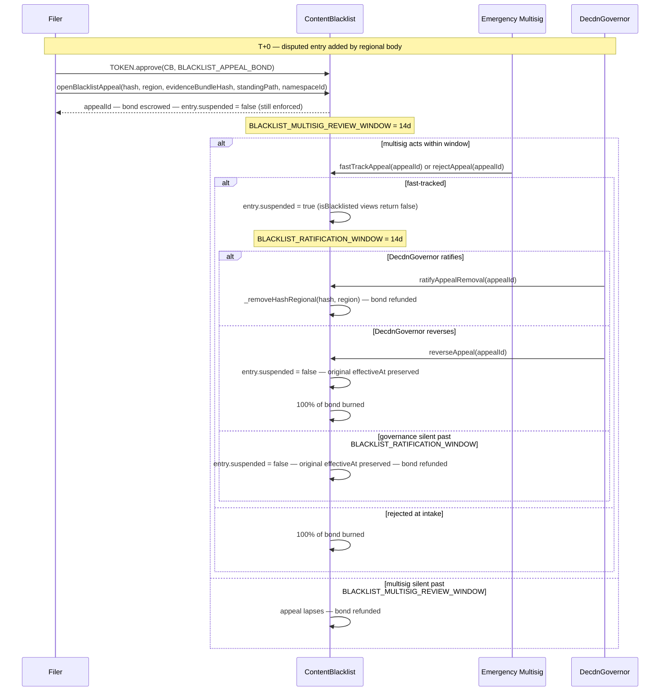

# ADR 011: Content Takedown and Hash Blacklisting

**Date:** 2026-03-30
**Status:** Accepted

## Context

deCDN is delivery infrastructure optimised for regional performance, not a censorship-resistant storage network. Node operators are businesses with real legal obligations: DMCA safe harbour (US), DSA hosting provider duties (EU), and national laws around illegal content (CSAM, terrorist material) require that operators have a working takedown mechanism. Without one, every operator runs uninsured legal exposure.

Origin assignment is the symmetric problem: which operators are authorized to act as origins for which content. Without a positive authority, origin assignment is purely off-protocol — content owners self-coordinate, the network has no Sybil resistance on origin claims, and there is no protocol-enforced redundancy for important content. Both halves of origin governance — negative (blacklisting) and positive (assignment) — share infrastructure (cross-contract integration, governance authority, runtime enforcement) and are specified together here.

No existing ADR addressed either question. This ADR establishes:

1. A governance-controlled on-chain hash blacklist
2. Regional governance bodies for jurisdiction-scoped takedowns
3. Node behavior when a hash or origin is blacklisted
4. An emergency fast-path for time-critical removals
5. The slashing regime for non-compliance
6. The known limitations of hash-based blacklisting and the mitigations available
7. A governance-controlled positive authority for origin assignment (`OriginAssignment`) — publisher-propose / DAO-ratify per registered namespace; namespace 0 (`namespaceId == 0`) has no authorized origins — built on the publisher/namespace identity primitive defined in [ADR 002](002-content-addressing.md#publisher-identity-and-namespaces)

## Decision

Content governance over origins has two symmetric authorities, both DAO-controlled:

- **Negative authority — `ContentBlacklist`.** Removes hashes and operators via two governance paths: a global path (network-wide removal) and a regional path (jurisdiction-scoped removal via a designated regional governance body). Nodes must evict blacklisted content and stop announcing it within a defined compliance window; serving a blacklisted hash after the compliance window is a slashable offense. Origin nodes that repeatedly source blacklisted content can themselves be blacklisted by NodeId or operator address, independent of any specific hash — the primary mitigation for hash evasion via trivial re-encoding.
- **Positive authority — `OriginAssignment`.** Authorizes specific operators to act as origins for specific namespaces (defined in [ADR 002 § Publisher Identity and Namespaces](002-content-addressing.md#publisher-identity-and-namespaces)). Publishers propose operator sets; governance ratifies each proposal via the standard timelock path. Namespace 0 (`namespaceId == 0`) has no authorized origins — content under it is served best-effort from cache/DHT per [ADR 002 § Retrieval by namespace](002-content-addressing.md#retrieval-by-namespace). `ContentBlacklist` and `OriginAssignment` integrate via runtime checks with lazy storage cleanup — see [§ Interaction with ContentBlacklist](#interaction-with-contentblacklist).

Each node also maintains a local denylist for operator-initiated removal without waiting for governance.

## Contract: ContentBlacklist

```solidity
interface IContentBlacklist {
    // Global governance path (standard voting + timelock) — GOVERNANCE_ROLE
    function addHashGlobal(bytes32 blake3Hash, string calldata reason) external;
    function removeHashGlobal(bytes32 blake3Hash) external;

    // Regional governance path — REGIONAL_BODY_ROLE, callable only by a
    // registered regional body. Both revert on the global sentinel, so a
    // regional body can never reach a global entry.
    function addHashRegional(string calldata region, bytes32 blake3Hash, string calldata reason) external;
    function removeHashRegional(string calldata region, bytes32 blake3Hash) external;

    // Operator blacklisting — global governance only
    function addOperator(address operator) external;
    function removeOperator(address operator) external;

    // Emergency multisig path (3-of-5, no timelock) — hash and origin.
    // Permanent (no sunset): unlawful-content removal discharges an ongoing
    // legal duty — see ADR 009, Emergency Multisig (capability-split sunset).
    // Only the protocol-wide pause sunsets at 12 months, not this path.
    // Emergency adds are GLOBAL by construction, hence no region parameter.
    // ONE-WAY: both revert if the target is already blacklisted by governance
    // (a hash entry with emergency == false, or an origin with no expiry
    // record). The emergency path may only ADD enforcement, never weaken it —
    // otherwise re-adding a governance entry would arm auto-expiry on it and
    // hand the multisig a delayed removeHashGlobal, which is GOVERNANCE_ROLE
    // only and reachable by no other multisig route. Re-adding over an existing
    // EMERGENCY entry stays permitted (category escalation, or re-arming one
    // that lapsed) — that sustains a takedown rather than undoing one.
    // Category determines emergency entry expiry:
    //   GENERAL — 14-day auto-expiry (default)
    //   CSAM, TERRORIST — 90-day auto-expiry (severe content must not be re-exposed due to governance latency)
    // enum Category { GENERAL, CSAM, TERRORIST }
    function emergencyAdd(bytes32 blake3Hash, uint8 category, string calldata reason) external;
    function emergencyAddOrigin(address operatorAddress, uint8 category, string calldata reason) external;

    // Emergency entries expire after their category-specific deadline unless ratified by governance.
    // Expiry is derived from the entry's addedAt timestamp: addedAt + expiryForCategory(category).
    // isBlacklisted returns false after this deadline unless a governance addHashGlobal
    // has been called for the same hash — re-adding under governance clears the
    // `emergency` flag, which is what makes the entry permanent.
    //
    // Permissionless materialization of that expiry. Reverts unless the entry is
    // an emergency entry past its deadline. Deleting the entry is what advances
    // getBlacklistVersion() and emits HashRemoved — without it the enforced set
    // would shrink with the counter frozen, and a delta-polling node would never
    // learn (see § Blacklist version). The origin variant is the only signal at
    // all on its side, since OriginBlacklistUpdated carries no version.
    function expireEmergencyEntry(bytes32 region, bytes32 blake3Hash) external;
    function expireEmergencyOrigin(address operatorAddress) external;

    // Compliance-window governance (see § Compliance Window). Both bounded to
    // [1 hour, 7 days]; the value is stamped onto an entry at add time, so a
    // change never moves the boundary for entries already added.
    function setComplianceWindow(uint64 newWindow) external;
    function setEmergencyComplianceWindow(uint64 newWindow) external;

    // Regional body registry — global governance only, except suspendRegionalBody
    // (emergency multisig). A body is bound to exactly one region and may only
    // write entries for that region: REGIONAL_BODY_ROLE alone is not authority.
    // `emergencyMultisig` names the EMERGENCY_MULTISIG_ROLE holder to check
    // signer-disjointness against; it is verified to hold the role, so it cannot
    // be pointed at a decoy (see § Signer non-overlap).
    function registerRegionalBody(bytes32 region, address body, address emergencyMultisig) external;
    function deregisterRegionalBody(bytes32 region) external;
    function suspendRegionalBody(bytes32 region) external;          // emergency multisig only
    function ratifyRegionalBodySuspension(bytes32 region) external; // within 14 days
    function unsuspendRegionalBody(bytes32 region) external;

    // Per-entry appeal flow (see § Blacklist Entry Appeals). Regional entries are
    // the primary case; global entries are filable by naming GLOBAL_REGION.
    // openBlacklistAppeal reverts on the UNSET region sentinel (bytes32(0)) and on
    // entries past their filing window. The filer declares one standing path:
    //   enum StandingPath { None, Publisher, Operator, TokenHolder } // 0,1,2,3
    // Eligibility is verified under the declared path only; the path is recorded
    // on the appeal and fixed for its lifetime. Bond pulled via TOKEN.transferFrom.
    function openBlacklistAppeal(
        bytes32 blake3Hash,
        string  calldata region,
        bytes32 evidenceBundleHash,
        uint8   standingPath,
        uint256 namespaceId    // Publisher path: the asserted namespace; ignored on other paths
    ) external returns (uint256 appealId);
    function fastTrackAppeal(uint256 appealId) external;        // emergency multisig only
    function unFastTrackAppeal(uint256 appealId) external;      // emergency multisig only — escape hatch, see § Contract surface
    function rejectAppeal(uint256 appealId) external;           // emergency multisig only
    function ratifyAppealRemoval(uint256 appealId) external;    // DecdnGovernor only
    function reverseAppeal(uint256 appealId) external;          // DecdnGovernor only

    // Permissionless cleanup. Reverts unless one admissibility condition holds:
    //   (a) multisig silent past BLACKLIST_MULTISIG_REVIEW_WINDOW (never fast-tracked), or
    //   (b) governance silent past BLACKLIST_RATIFICATION_WINDOW (post-fast-track), or
    //   (c) the underlying BlacklistEntry has been removed via removeHashGlobal /
    //       removeHashRegional global override (see § Global Override).
    // On success, refunds or burns the bond per § Bond and frequency caps for
    // the matched condition and emits BlacklistAppealLapsed. If the appeal had
    // entered interim-relief (entry.suspended == true), clears the suspension
    // and releases the body's concurrent-appeal slot; case (a) and any case
    // (c) firing before fast-track have no slot to release (entry never
    // entered interim-relief). Mirrors OriginAssignment.pruneBlacklistedAssignment.
    function cleanupExpiredAppeal(uint256 appealId) external;

    // Views
    function isBlacklisted(bytes32 blake3Hash) external view returns (bool);
    function isBlacklistedInRegion(bytes32 blake3Hash, string calldata region) external view returns (bool);
    function isOriginBlacklisted(address operatorAddress) external view returns (bool);
    function getEntry(bytes32 blake3Hash) external view returns (BlacklistEntry memory);
    function getBlacklistVersion() external view returns (uint256);

    // Events. `version` is the getBlacklistVersion() value AFTER the change, so a
    // delta consumer can order events and confirm no gap. Non-indexed: EVM topic
    // filters are set-membership, not range, so indexing it buys no range query
    // (see § Polling). Every hash-set change emits exactly one of the three below,
    // so the counter never advances with no matching log.
    event HashBlacklisted(bytes32 indexed region, bytes32 indexed blake3Hash, uint256 version, string reason);
    event HashRemoved(bytes32 indexed region, bytes32 indexed blake3Hash, uint256 version);
    event HashSuspensionUpdated(bytes32 indexed region, bytes32 indexed blake3Hash, uint256 version, bool suspended);
    // Origin blacklisting is a single toggle, deliberately OUTSIDE the version
    // mechanism: it carries no version and is enforced via OriginAssignment
    // cross-reference (§ Permissionless property), not the hash version poll.
    event OriginBlacklistUpdated(address indexed operatorAddress, bool blacklisted);
    event BlacklistAppealOpened(uint256 indexed appealId, bytes32 indexed blake3Hash, string region, address indexed filer, bytes32 evidenceBundleHash, uint8 standingPath);
    event BlacklistAppealFastTracked(uint256 indexed appealId);
    event BlacklistAppealUnFastTracked(uint256 indexed appealId);
    event BlacklistAppealRejected(uint256 indexed appealId);
    event BlacklistAppealRatified(uint256 indexed appealId);
    event BlacklistAppealReversed(uint256 indexed appealId);
    event BlacklistAppealLapsed(uint256 indexed appealId);
}

struct BlacklistEntry {
    bytes32 blake3Hash;
    uint256 addedAt;          // block timestamp when added
    uint256 effectiveAt;      // addedAt + the compliance window in force AT ADD TIME
                              // (emergencyComplianceWindow for emergency adds).
                              // Stamped, never derived: a later governance change
                              // to the window must not move the slash boundary
                              // under deliveries already served, and the original
                              // value must survive an appeal suspension.
    string  region;           // ISO 3166-1 alpha-2, or "" for global
    string  reason;           // free-form, e.g. "DMCA-2026-001", "CSAM", "DSA-DE-001"
    bool    emergency;        // true if added via emergency multisig path
    uint8   category;         // Category; determines the emergency auto-expiry term.
                              // Meaningless when emergency == false.
    bool    suspended;        // true while a regional appeal is in interim-relief
                              // or pending ratification; isBlacklisted views return
                              // false during this window. See § Blacklist Entry Appeals.
    uint256 suspendedAtUs;    // microsecond timestamp (block.timestamp * 1_000_000) at which
                              // suspended last flipped to true. Stored in microseconds to align
                              // with ADR 014's MAX_EVIDENCE_AGE_US arithmetic so SlashJudge can
                              // compare without unit conversion. 0 if never suspended.
}
```

> **Region representation.** The `region` field is **stored as `bytes2`** — ISO 3166-1 alpha-2 codes are always exactly 2 ASCII characters, with `bytes2(0)` as the global sentinel. The `string` form shown in the interface signatures, events, and the `BlacklistEntry` struct above is the external-boundary representation only; it is canonicalized to `bytes2` for storage (a `_toBytes2(string)` helper reverts on length ≠ 2 or non-ASCII-alpha input). The `BlacklistEntry` layout is the struct above; the gas-packed appeal-record storage layout is pinned in [ADR 031 § Storage layout](031-content-blacklist-appeals-contract.md#storage-layout).

### Blacklist version

`getBlacklistVersion()` returns a monotonically increasing counter incremented on every change to the enforced hash set, across all paths: every hash add, every hash removal, every appeal-driven suspend/resume, and every `expireEmergencyEntry`.

Emergency auto-expiry is the one set change that is not caused by a transaction, so it is the one that could break the counter's contract: the entry simply stops being enforceable when its deadline passes, with no write and no log. Views honour that deadline immediately — an expired entry is unenforceable whether or not anyone cleans it up — but a node that only fetches deltas when the counter advances would keep enforcing it forever. `expireEmergencyEntry` (and `expireEmergencyOrigin` on the origin side) closes the gap: permissionless, callable by anyone once the deadline passes, and it deletes the entry through the ordinary removal path so the counter advances and a `HashRemoved` lands in the log like any other removal. Suspension belongs in the counter because it flips what `isBlacklisted` reports — [§ Compliance Window](#compliance-window) and [§ Authority and flow](#authority-and-flow) both have operators detect appeal resumption off this poll cycle, which only holds if the toggle advances the version. A terminal appeal path acting on an entry that governance already removed mid-appeal ([§ Global Override](#global-override)) does **not** bump: nothing enforceable changed, and a spurious advance costs every node a wasted delta fetch. Nodes cache the last-seen version and only re-fetch deltas when the version advances, minimising RPC load.

### Reason field

Free-form string, stored on-chain for auditability. Operators can reference legal notice identifiers (e.g., DMCA case numbers, DSA notice IDs) or use short category labels.

### `region` field

Empty string means the entry applies globally. An ISO 3166-1 alpha-2 code scopes the entry to nodes that declare that region. A node is in scope if its declared region matches the entry's region or the entry is global.

## Regional Governance Bodies

A regional body is an address (multisig or governance contract) registered by global governance for a specific jurisdiction. It can issue region-scoped blacklist entries for its jurisdiction without a global vote, but cannot issue global entries or blacklist origins — those remain global governance only.

**Registration binds a body to exactly one region, and that binding is the authority.** Holding `REGIONAL_BODY_ROLE` is necessary but not sufficient: `addHashRegional` / `removeHashRegional` additionally require the caller to be the body registered for the region named in the call. Without that, any one registered body could write entries for every other jurisdiction, which would make the whole regional split decorative. The one-region-per-body rule is enforced in both directions (a region has at most one body; a body serves at most one region) so a suspension in one jurisdiction cannot be routed around by the same body acting in another.

**At launch:** No regional bodies are registered. The `DEFAULT_ADMIN_ROLE` holder (deployer pre-handover, `TimelockController` post-handover) acts as sole governance. The contract surface supports regional bodies from day one so they can be added by governance vote without a contract redeploy.

**Production-scale operation:** Regional bodies are expected for at minimum EU (DSA compliance) and US (DMCA). Each body is a 3-of-5 multisig constituted with signers who have legal presence in the relevant jurisdiction.

**Signer non-overlap with the emergency multisig.** The emergency multisig hears appeals against regional-body entries (see [§ Blacklist Entry Appeals](#blacklist-entry-appeals)), so a signer on both a regional body and the emergency multisig would grade their own homework. `registerRegionalBody(region, body, emergencyMultisig)` requires that the candidate body's signer set is disjoint from the current emergency multisig signer set; registration reverts on overlap.

Disjointness is verified on-chain where both sides expose a Safe-shaped `getOwners()` view: the two owner sets are compared pairwise, and a candidate owner that holds `EMERGENCY_MULTISIG_ROLE` directly is an overlap regardless of whether the multisig side turned out to be enumerable. The `emergencyMultisig` argument is checked to actually hold the role, so the probe cannot be aimed at a decoy address to manufacture a clean result. Where on-chain enumeration is infeasible for either implementation, registration still succeeds and the `RegionalBodyRegistered` event carries `signersVerified = false`; governance MUST then verify disjointness off-chain before passing the registration proposal and document it in the proposal. The event is the on-chain record of which of the two regimes applied to a given registration. Subsequent rotations on either side that introduce overlap are a governance obligation to detect and resolve — either rotate the overlapping signer out of the body or deregister the body before it issues another entry.

**Suspension:** The emergency multisig can suspend a regional body immediately via `suspendRegionalBody(region)`. Suspended bodies cannot issue new entries but existing entries remain active — suspension bounds the body's future authority, it is not a mass retraction of the jurisdiction's takedowns. Suspension must be ratified (`ratifyRegionalBodySuspension`) or reversed (`unsuspendRegionalBody`) by governance vote within 14 days, the same ratification window as emergency blacklist entries.

Governance silence past that window **lapses the suspension** and the body resumes writing, exactly as an unratified emergency entry expires. Both are unilateral multisig acts taken without a vote, and neither is a standing act of governance; sustaining one indefinitely on silence alone would let the multisig disable a jurisdiction permanently with no vote ever taken. Where a body genuinely must stay out, the durable instrument is `deregisterRegionalBody`, which is a governance act.

Regional bodies operate independently within their scope. A hash blacklisted by the EU body is a compliance obligation only for nodes that declare an EU region. A hash blacklisted globally is a compliance obligation for all nodes regardless of region.

## Blacklist Entry Appeals

Regional bodies acting in good faith can still issue entries that are later contested — a wrongly served takedown notice, a body that drifts outside its declared jurisdiction, or a notice that misidentifies content. Body-level `suspendRegionalBody` is the right tool for a systemically misbehaving body but the wrong tool for a single disputed entry: it freezes every entry the body has issued, including legitimate ones. This section specifies a per-entry path mirroring the fast-track + ratification structure used for regional-body suspension and for [ADR 028](028-slashing-appeals.md#adr-028-slashing-appeals-and-dispute-escalation), narrowed to the content-policy domain.

The two appeal paths are deliberately decoupled. [ADR 028](028-slashing-appeals.md#adr-028-slashing-appeals-and-dispute-escalation) covers operator-side restitution for slashes incurred during legitimate operational failure; the path defined here covers content-policy challenges to the underlying blacklist entry itself. Operators slashed under an entry later removed by this path may seek individual restitution via [ADR 028](028-slashing-appeals.md#adr-028-slashing-appeals-and-dispute-escalation), which already lists blacklist offenses as appealable.

### Scope

Appellable entries: **any live entry, regional or global.** Entries issued via `addHashRegional` carry a non-empty `region` and are filed against a registered regional body; they are what this fast-track was designed to dispute and remain its primary case. Global entries are filable too — `openBlacklistAppeal` takes the scope as an explicit argument and reverts only on the **unset** region sentinel (`bytes32(0)` → `MissingRegion`), never on the global sentinel. Callers must pass `GLOBAL_REGION` explicitly rather than relying on a default: silently rewriting an omitted argument to global scope would burn the filer's bond and 90-day rejection cooldown against an entry they never meant to contest.

Filing is not winning. The intent that global entries are the *harder* case is enforced by the relief machinery, not by a filing gate — an `Open` appeal carries zero interim relief, `fastTrackBlacklistAppeal` is `EMERGENCY_MULTISIG_ROLE`-gated, and ratification is reserved to DecdnGovernor. Two categories are therefore reachable but deliberately unattractive on the merits:

- **Emergency entries** (`emergencyAdd`, `emergencyAddOrigin`) are global by construction — the interface takes no `region` parameter — so they are contested under `GLOBAL_REGION`. They are additionally bounded by their category-specific auto-expiry from [§ Compliance Window](#compliance-window) (14d for `GENERAL`, 90d for `CSAM` / `TERRORIST`), and the slow-path DecdnGovernor `removeHashGlobal` proposal remains the primary route — see [§ Global Override](#global-override).
- **Global standard-vote entries** (`addHashGlobal`) have already passed the full DecdnGovernor process, so re-litigation on the merits still belongs in a standard governance amendment rather than this lighter-weight path. The slow-path override remains available and is the expected route.

Grounds for appeal:

- **(a) Out-of-scope.** The regional body issued an entry outside its declared jurisdiction (e.g., the EU body blacklisting content with no documented EU nexus).
- **(b) Procedural defect.** The body deviated from its own constituted process (e.g., a 3-of-5 multisig issued an entry with only two valid signatures).
- **(c) Substantive defect / wrongful takedown.** The underlying notice is invalid — a valid DMCA counter-notice was already filed, the publisher has jurisdictional immunity, the content does not match the notice.

**Bootstrap-window degradation.** During the bootstrap window described in [§ Regional Governance Bodies](#regional-governance-bodies) — no regional bodies registered, `DEFAULT_ADMIN_ROLE` holder acts as sole governance — the appeal path is structurally non-functional for a reason no contract check can express: `addHashGlobal` and emergency entries are issued by the same admin key that would sit on the multisig hearing the appeal. A global entry issued in this window is *filable* (see [§ Scope](#scope)), but it buys the filer nothing — the adjudicator and the issuer are the same party — while still escrowing the bond and arming the rejection cooldown. The slow-path global override (see [§ Global Override](#global-override)) is the operative recourse during the bootstrap window. The fast-track path becomes load-bearing only after the first regional body is registered by governance vote, when regional `addHashRegional` entries are issuable and an independent multisig + DecdnGovernor pairing exists to hear appeals. `openBlacklistAppeal` implementations MAY revert with `AppealPathNotYetActive` until the first regional body is registered, surfacing that degradation explicitly rather than letting a filer burn a bond on a self-adjudicated appeal.

### Standing

The filer declares one standing path at filing time via the `standingPath` parameter to `openBlacklistAppeal` (`uint8` enum: `Publisher = 1`, `Operator = 2`, `TokenHolder = 3`). The contract verifies eligibility under the declared path only and does not auto-select among paths a filer might qualify under, keeping the on-chain standing record unambiguous and verification single-branch per appeal.

1. **The affected publisher** per [ADR 002 § Publisher Identity and Namespaces](002-content-addressing.md#publisher-identity-and-namespaces) — the on-chain `PublisherRegistry.ownerOf(namespaceId)` for the namespace the filer asserts the disputed hash falls under. Path 1 is restricted to registered namespaces because the contract has no on-chain way to verify a "publisher of record" for namespace-0 content; parties without a registered namespace — content advocates, end-user proxies — use path 3 instead. The filer passes the `namespaceId` explicitly as a filing argument and the contract requires `ownerOf(namespaceId) == filer`. Because the hash→namespace association is off-chain ([ADR 002 § Hash-to-namespace association](002-content-addressing.md#hash-to-namespace-association)), this proves only that the filer controls the named namespace, not that the hash falls under it or who authored it — acceptable because path 1 confers no more than path 3 (any bond-poster already has standing) and standing alone grants no automatic outcome.
2. **Any operator currently in compliance scope.** An operator whose declared `node.region` matches the entry's region — i.e., one whose bond is exposed to slashing under the entry. On a **global** entry the region-match check does not apply: a global entry binds every region, so any in-scope operator has standing without a matching region. This catches operator-side disputes (compliance burden, jurisdictional mismatch with the operator's own legal posture). Because `node.region` is self-attested in `NodeAnnounce` (see [ADR 001](001-network.md#adr-001-network-topology-and-peer-mesh) and [ADR 030](030-node-region-self-attestation.md#adr-030-node-region-self-attestation)), an operator could in principle flip their `regionHint` immediately before filing to gain standing in any region. [ADR 030 § Region-stability window](030-node-region-self-attestation.md#region-stability-window) closes this surface: operator standing under path 2 additionally requires `block.timestamp - effective >= REGION_STABILITY_WINDOW` (where `effective` falls back to gate activation for pre-upgrade records; default 7 days, governable `[3d, 30d]` per the [ADR 009](009-governance.md#adr-009-governance-model) safety-bound pattern). Filings inside the window are not auto-rejected — they remain admissible at multisig discretion only, the soft-norm heightened-scrutiny fallback for legitimate post-relocation filers. The 1,000 TOKEN bond, the 90-day per-address frequency cap on successful appeals, and the perjury denylist are the additional deterrents on this path; there is no synthetic-standing clawback analogue because the operator bond is unbond-locked under [ADR 026 § Operator economics](026-tokenomics.md#operator-economics) and cannot be flash-acquired.
3. **Any TOKEN holder** who posts the appeal bond. Standing on this path is the escrowed appeal bond itself — there is no separate balance threshold. This opens a proxy path for end users, content advocates, and parties without a registered namespace without requiring on-chain content ownership. Because the bond is escrowed by the appeal it cannot be flash-loaned, so the deterrents against frivolous filings are the bond (fully burned on rejection), the perjury denylist, the per-address rejection cooldown, and the frequency cap below. A balance gate protects nothing these do not already protect (see [§ Bond and frequency caps](#bond-and-frequency-caps)).

Standing is verified at the filing transaction under the declared path. An operator who unbonds after filing does not lose standing for an already-open appeal — but cannot file new ones until standing is restored. Path 3 has no post-filing balance requirement: once the bond is escrowed the standing is settled, so there is nothing to re-check mid-flow. The declared path is fixed at filing.

**No synthetic-standing clawback.** Path-3 standing is the escrowed appeal bond itself, not a TOKEN-balance snapshot, so there is no post-filing balance re-check: an escrowed bond cannot be flash-loaned, leaving no synthetic standing to claw back. Operator and publisher standing are likewise not flash-acquirable — the operator bond is unbond-locked under [ADR 026 § Operator economics](026-tokenomics.md#operator-economics), and namespace ownership per [ADR 002](002-content-addressing.md#publisher-identity-and-namespaces) is registry-gated. `cleanupExpiredAppeal` therefore carries no balance-recheck admissibility condition; its lapse triggers are the two silence timeouts and the global-override removal only (see [§ Contract surface](#contract-surface)).

### Filing window

| Parameter | Default | Hard bounds | Rationale |
| --- | ---: | --- | --- |
| `BLACKLIST_APPEAL_FILING_WINDOW` | 14 days | `[3d, 30d]` | Shorter than [ADR 028 § Hard caps and frequency limits](028-slashing-appeals.md#hard-caps-and-frequency-limits)'s 30-day window because content delisting is reversible (the entry can be re-issued) and stakeholder action should be prompt while the disputed content is still relevant. |

Regional entries (`addHashRegional`) do not have a category-specific auto-expiry — they persist until removed by governance — so the filing window has a single bound. If the regional body that issued the entry is deregistered or suspended mid-appeal, the appeal continues unaffected: the contested entry remains the on-chain object, and the DecdnGovernor remains the ratification authority regardless of body status.

### Authority and flow

Appeals are heard by the existing **emergency multisig** under the same fast-track authority pattern [§ Regional Governance Bodies](#regional-governance-bodies) uses for body suspension and [ADR 028 § Contract surface](028-slashing-appeals.md#contract-surface) uses for `fastTrackAppeal` / `rejectAppeal`. This is **not a new multisig power** — it is a sub-mode of [ADR 009 § Emergency Multisig](009-governance.md#emergency-multisig)'s existing authority, reusing the 3-of-5 threshold, signing semantics, and post-incident reporting obligations.



The original `effectiveAt` is preserved across suspension. Resetting it to `block.timestamp + complianceWindow` on resumption was rejected because it would shield operators who never evicted: a dishonest operator already past the original compliance window when suspension began would get a fresh window on resumption, retroactively immunizing pre-suspension delivery. Evidence-age semantics handle the honest-operator case instead: the `MAX_EVIDENCE_AGE_US` clock from [ADR 014 § Evidence Staleness](014-on-chain-verification.md#evidence-staleness) is computed relative to `entry.suspendedAtUs` rather than the current block while a post-resumption challenge replays, so suspension neither retroactively immunizes pre-suspension evidence nor requires challengers to re-witness. Honest operators who continued serving during suspension (relying on `isBlacklisted == false`) are protected directly: deliveries timestamped inside the suspension window are inadmissible as slash evidence, because the views correctly returned `false` at delivery time. Operators detect resumption via the standard `getBlacklistVersion()` polling cycle (default 10 minutes — see [§ Polling](#polling)).

### Bond and frequency caps

| Parameter | Default | Hard bounds | Rationale |
| --- | ---: | --- | --- |
| `BLACKLIST_APPEAL_BOND` | 1,000 TOKEN | `[100, 10,000]` | Matches [ADR 028 § Appeal bond](028-slashing-appeals.md#appeal-bond) for operational parity. The two ADRs use distinct contract storage; defaults align but the parameters may diverge under governance. |
| `BLACKLIST_MULTISIG_REVIEW_WINDOW` | 14 days | `[3d, 30d]` | Same shape and bounds as [ADR 028 § Hard caps and frequency limits](028-slashing-appeals.md#hard-caps-and-frequency-limits)'s `MULTISIG_REVIEW_WINDOW`. |
| `BLACKLIST_RATIFICATION_WINDOW` | 14 days | (fixed) | Mirrors the 14-day ratification window used elsewhere in this ADR for body suspension. |
| `APPEAL_FILER_FREQUENCY` | 1 successful appeal per 90 days | (fixed) | Per filing address, regardless of declared `standingPath`. Resets on the date of the most recent ratified-success. Failed appeals consume bond but do not count against the cap. |
| `APPEAL_FILER_REJECTION_COOLDOWN` | 3 rejections per 90 days → 90-day cooldown | (fixed) | Per filing address. After the third `rejectAppeal` outcome against a single address within a rolling 90-day window, that address enters a 90-day cooldown during which `openBlacklistAppeal` reverts. Mitigates the pay-to-spam vector where a deep-pocketed griefer files indefinitely at 1,000 TOKEN per shot to keep the multisig triaging — the bond burn prices each filing but not the multisig's review-time externality. Structurally analogous to but weaker than the perjury denylist: rejection alone is not perjury, so the address is suspended only for the appeal path and only for a bounded duration. The 3-strike threshold is intentionally generous because individual rejections may reflect ambiguous evidence rather than bad faith. |
| `REGION_CONCURRENT_RELIEF_CAP` | 3 | (fixed) | Caps **active interim-relief states** (`entry.suspended == true`) per region, **not** filed-but-unresolved appeals — filings against a region remain unbounded. The multisig is the gate: once three of a region's entries are in interim-relief, `fastTrackAppeal` reverts on a fourth until one resolves (ratify / reverse / lapse / un-fast-track), forcing triage; filed-but-not-yet-fast-tracked appeals are unaffected. This avoids a denial-of-service vector where an adversary files three frivolous appeals to lock out legitimate filings — frivolous filings can be rejected at intake (`rejectAppeal`, 100% bond burn) without ever entering interim-relief. (Formerly `BODY_CONCURRENT_APPEAL_CAP` — renamed because enforcement is per region, not per requesting body.) |
| `FILER_CONCURRENT_RELIEF_CAP` | 2 | (fixed) | Per-`(filer, region)` sub-cap on active interim-relief states, layered under `REGION_CONCURRENT_RELIEF_CAP` and held strictly below it, so no single filer can monopolize a region's relief slots — at least one slot always stays reachable by other filers. Bounds an adversarial filer directly rather than relying on a one-body-per-region assumption. |

Bond outcomes:

- **Ratified-success:** bond refunded in full to the filer.
- **Reversal:** 100% of bond burned. Routing reversal proceeds to a regional-body operating-budget pool would create a perverse incentive — bodies would have direct economic motive to issue marginal-but-defensible entries that attract reversible appeals. Burn-only mirrors the [ADR 014 § Bond Handling](014-on-chain-verification.md#bond-handling) "no prevailing-party payout absent a neutral counter-party" model.
- **Lapse / governance silence:** bond refunded — the filer is not at fault for governance inaction.
- **Rejection at intake:** 100% of bond burned; no counter-bundle filer to credit (mirrors [ADR 028 § Appeal bond](028-slashing-appeals.md#appeal-bond)).

The bond is the primary economic deterrent against pro-forma filings; the per-filer 90-day cap, the per-filer rejection cooldown, and the perjury denylist below are the secondary deterrents.

**Sybil-via-addresses is an accepted limitation.** All per-filer caps (`APPEAL_FILER_FREQUENCY`, `APPEAL_FILER_REJECTION_COOLDOWN`, `FILER_CONCURRENT_RELIEF_CAP`, the perjury denylist) are keyed on the filing address. A holder with enough TOKEN can split funds across `n` addresses and file `n` parallel appeals, evading the per-address frequency cap. Two properties keep this bounded: (a) each filing requires a fresh `BLACKLIST_APPEAL_BOND` (1,000 TOKEN default), so a 10-frivolous-appeal campaign costs 10× the bond up front, fully burned on rejection; (b) the two-tier concurrent interim-relief cap — the per-region ceiling (`REGION_CONCURRENT_RELIEF_CAP`) constrains total interim-relief slots regardless of how many distinct addresses file, and the per-`(filer, region)` sub-cap (`FILER_CONCURRENT_RELIEF_CAP`) additionally bounds any single address. On-chain identity uniqueness is not a primitive available to this contract — pricing identity strictly would require external proof-of-personhood infrastructure outside this ADR's scope. The accepted trade-off: the deterrent surface for organised proxy filings is the bond + concurrent-relief economics, not the per-address counters.

### Evidence

The appeal bundle (referenced on-chain by `evidenceBundleHash`) must include a sworn EIP-712 declaration plus **at least one** of the following corroborating evidence types:

| Evidence type | Examples |
| --- | --- |
| (a) Counter-notice or legal opinion | Signed DMCA counter-notice; signed jurisdictional opinion; EIP-712-signed statement from the namespace publisher attesting non-infringement and identifying the original notice |
| (b) Jurisdictional documentation | The regional body's own constituting document or registration declaring its jurisdictional scope, paired with a documented nexus mismatch for ground (a) — out-of-scope |
| (c) Regional body process record | The body's published transparency log entry (or its absence) demonstrating procedural defect for ground (b) — wrong threshold met, off-quorum action, missing required publication |

Operational-failure evidence types from [ADR 028 § Eligibility and evidence standard](028-slashing-appeals.md#eligibility-and-evidence-standard) (gossip telemetry, peer-attested downtime) are **not** admissible here. The two domains use disjoint evidence sets; an operator whose grievance is "I was offline during the compliance window" must use the [ADR 028](028-slashing-appeals.md#adr-028-slashing-appeals-and-dispute-escalation) path. Filing such evidence on this path is grounds for rejection at intake, not perjury.

The sworn declaration is an EIP-712-signed statement (secp256k1, signed by the filer's registered Ethereum address) attesting that the evidence is genuine and that the filer has standing under [§ Standing](#standing). **Perjury — proven by post-hoc evidence — triggers full bond forfeit and adds the filer's address to a 365-day per-address filing denylist** maintained by `ContentBlacklist`. The denylist applies only to this appeal path; it does not affect the filer's TOKEN holdings, capacity-bond position, or any other protocol role.

### Interaction with active slashes

While `entry.suspended == true`:

- `isBlacklisted(hash)` and `isBlacklistedInRegion(hash, region)` return `false`. This short-circuits `SlashJudge` per [ADR 014](014-on-chain-verification.md#adr-014-on-chain-verification-for-slashing-evidence): a blacklist-offense challenge submitted during interim-relief reverts with `BlacklistEntrySuspended`, distinct from `HashNotBlacklisted`, so challengers can distinguish a never-blacklisted hash from a temporarily suspended one.
- New slash challenges for the disputed hash cannot be opened.
- Pre-suspension evidence is preserved across resumption. `BlacklistEntry.suspendedAtUs` records the microsecond timestamp (`block.timestamp * 1_000_000`) at which fast-track flipped `suspended = true`. On reversal or lapse, `SlashJudge` admits challenges whose `evidence.timestamp_us` falls in the half-open window `[(entry.addedAt + complianceWindow) * 1_000_000, entry.suspendedAtUs)` for `MAX_EVIDENCE_AGE_US` after resumption — the evidence-age clock is computed as `entry.suspendedAtUs - evidence.timestamp_us`, not `nowUs - evidence.timestamp_us`, so a multi-week appeal lifecycle does not retroactively immunize pre-suspension delivery whose evidence would otherwise age past [ADR 014 § Evidence Staleness](014-on-chain-verification.md#evidence-staleness)'s 5-day default. Evidence with `timestamp_us ≥ entry.suspendedAtUs` and predating the resumption block is **not** admissible — the views returned `false` at that delivery time, and operators relying on the suspended view must be protected. All comparisons use the microsecond unit established in [ADR 014 § Evidence Staleness](014-on-chain-verification.md#evidence-staleness) (`nowUs = block.timestamp * 1_000_000`).
- Already-resolved slashes against operators for the disputed hash are **not** auto-reversed. Operators in that position seek individual restitution via [ADR 028](028-slashing-appeals.md#adr-028-slashing-appeals-and-dispute-escalation) using the `slashId` of their original slash. The heightened-scrutiny guidance from [ADR 028 § Scope](028-slashing-appeals.md#scope) for blacklist appeals is somewhat relaxed when the underlying entry has been removed via the path here, since the operational-failure rationale is no longer the only viable defense.

Removing a wrongful entry going forward (this ADR) does not mechanically refund slashes already taken ([ADR 028](028-slashing-appeals.md#adr-028-slashing-appeals-and-dispute-escalation)); the decoupling is the explicit boundary stated in [§ Blacklist Entry Appeals](#blacklist-entry-appeals).

### Contract surface

The new entry points are listed in [§ Contract: ContentBlacklist](#contract-contentblacklist) above. Implementation notes:

- `openBlacklistAppeal` reverts if `region` is the **unset** sentinel (`bytes32(0)` → `MissingRegion`) — the caller must name the scope explicitly, passing `GLOBAL_REGION` to contest a global entry; global and emergency entries are in scope (see [§ Scope](#scope)). It also reverts if the entry is past its `BLACKLIST_APPEAL_FILING_WINDOW`, if the filer fails standing checks under the declared `standingPath`, if the filer is on the perjury denylist, or if the filer is in a rejection-cooldown window (see [§ Bond and frequency caps](#bond-and-frequency-caps) — `APPEAL_FILER_REJECTION_COOLDOWN`). Filings are not gated by the concurrent interim-relief caps — see the next bullet for where they apply. Bond is pulled via `TOKEN.transferFrom`; the appeal record is stored with the declared `standingPath` and `BlacklistAppealOpened` is emitted.
- `fastTrackAppeal` / `unFastTrackAppeal` / `rejectAppeal` are restricted to the emergency multisig (the same address with the same threshold as the existing `suspendRegionalBody` flow), under the sub-mode authority described in [§ Authority and flow](#authority-and-flow). `fastTrackAppeal` reverts if the contested entry's region already has `REGION_CONCURRENT_RELIEF_CAP` entries in interim-relief (`entry.suspended == true`), or if the filer already holds `FILER_CONCURRENT_RELIEF_CAP` interim-relief slots in that region; the multisig must wait for one to resolve, or use `rejectAppeal` to triage one of the existing pending appeals first. `rejectAppeal` is not cap-gated. `unFastTrackAppeal` is the multisig's escape hatch when post-fast-track evidence (perjury, late counter-evidence) shows the suspension was misjudged: it requires `entry.suspended == true` and that the appeal is still pre-ratification, clears `suspended` (releasing the relief slot — both the region and per-filer counters), preserves the original `effectiveAt`, leaves the bond escrowed, opens a fresh `BLACKLIST_MULTISIG_REVIEW_WINDOW` from the un-fast-track timestamp during which the multisig may call `rejectAppeal` (burn) or do nothing (lapse → refund), and emits `BlacklistAppealUnFastTracked`. It is a one-shot per appeal — the contract reverts on a second invocation against the same `appealId` to prevent the multisig from indefinitely cycling fast-track ↔ un-fast-track to re-arm review windows. `unFastTrackAppeal` does not by itself trigger the perjury denylist; that requires a subsequent `rejectAppeal` on the same appeal with the perjury flag set.
- `ratifyAppealRemoval` / `reverseAppeal` are restricted to GOVERNANCE_ROLE (DecdnGovernor). Ratification calls the contract's internal `_removeHashRegional` and emits both `BlacklistAppealRatified` and the standard `HashRemoved` event. Reversal clears `suspended`, **preserves the original `effectiveAt`** (per [§ Authority and flow](#authority-and-flow) — resetting was rejected to avoid shielding pre-suspension non-compliance), and burns the bond per [§ Bond and frequency caps](#bond-and-frequency-caps).
- The full ABI (per-appeal storage layout, exact event topics, gas-optimized struct packing) is specified in [ADR 031](031-content-blacklist-appeals-contract.md#adr-031-contentblacklist-appeal-contract-surface) — same approach as [ADR 028 § Contract surface](028-slashing-appeals.md#contract-surface), whose contract-implementation ADR is [ADR 032](_history/032-safety-reserve-appeals-contract.md#adr-032-safetyreserve-appeal-surface-contract-surface).

### Global Override

The slow-path override is independent of the appeal flow above: either removal function may be called directly, regardless of any open appeal. The two are **not** the same access-control surface. `removeHashGlobal` (global entries) is restricted to `GOVERNANCE_ROLE`, which DecdnGovernor proposals reach via the standard timelock. `removeHashRegional` (regional entries) is restricted to `REGIONAL_BODY_ROLE` and reverts on the `GLOBAL_REGION` sentinel — so it is a *regional body's* unilateral power, not a governance one, and governance reaches a regional entry only by holding that role. This distinction is load-bearing for the threat model: because regional entries are the appeal-relevant ones, the actor that triggers the mid-appeal removal path described below is usually a regional body acting alone, not a timelocked governance vote. The slow path is always available for cases that do not fit the fast-track — global standard-vote entries, frequency-capped filers, expired filing windows, or coordinated multi-region disputes that warrant a single DecdnGovernor decision rather than per-region multisig action.

If `removeHashGlobal` or `removeHashRegional` fires while an appeal is open against the same `(blake3Hash, region)` pair, the appeal is rendered moot. Bond refund and slot release happen lazily: the next call to `ratifyAppealRemoval`, `reverseAppeal`, or the permissionless `cleanupExpiredAppeal(appealId)` (see [§ Contract surface](#contract-surface)) observes the underlying entry no longer exists, treats the appeal as **lapsed** (not reversed) — so the bond is **refunded** under the lapse-path rule in [§ Bond and frequency caps](#bond-and-frequency-caps), not burned under the reversal-path rule — releases the body's concurrent-appeal slot, and emits `BlacklistAppealLapsed`. Subsequent calls against the appeal id then revert with `BlacklistAppealAlreadyClosed`. The contract does not auto-execute on `removeHashGlobal`/`removeHashRegional` because Solidity has no scheduler — the lazy pattern matches `OriginAssignment.pruneBlacklistedAssignment`'s permissionless-cleanup model.

## Compliance Window

One rule governs every path: an entry becomes slashable at `effectiveAt = addedAt + window`, where `window` is the parameter for the path that added it. Serving before `effectiveAt` is never an offense.

| Path | `window` | Parameter |
|------|----------|-----------|
| Standard governance vote (global) | 24 hours | `complianceWindow` |
| Regional governance body | 24 hours | `complianceWindow` |
| Emergency multisig add | 2 hours | `emergencyComplianceWindow` |

The emergency path is deliberately one-way with respect to governance: `emergencyAdd` / `emergencyAddOrigin` revert on a target governance has already blacklisted permanently. The multisig can always make enforcement stricter and never looser — `removeHashGlobal` is `GOVERNANCE_ROLE` only, and without this rule a re-add through the emergency path would arm auto-expiry on a standing governance decision and accomplish the same removal on a 14-day delay with no vote.

The 24-hour window accounts for nodes that are offline or have a long poll interval. The 2-hour emergency window is tight enough to matter for active illegal content while giving online nodes time to act. The emergency multisig blacklist path is permanent (no sunset): it discharges an ongoing legal duty to remove unlawful content. Under the capability-split sunset, only the protocol-wide pause expires at 12 months, not this path — see [ADR 009 § Emergency Multisig](009-governance.md#emergency-multisig).

Both windows are governable parameters sharing one set of hardcoded bounds: minimum 1 hour, maximum 7 days. The floor is what keeps the emergency path honest — governance cannot compress the window below a single default poll cycle and slash nodes for content they had no opportunity to learn about.

`effectiveAt` is stamped onto the entry at add time from the window then in force. Changing a window therefore affects only subsequent adds; it can neither retroactively expose already-served deliveries to a slash nor retroactively immunize them. `SlashJudge` anchors its slash-eligibility comparison to `effectiveAt`, not `addedAt`.

Entries with `suspended == true` (see [§ Blacklist Entry Appeals](#blacklist-entry-appeals)) accrue no compliance obligation while suspended: `isBlacklisted` and `isBlacklistedInRegion` return `false` and slashes for the suspended hash cannot be opened. On reversal or lapse the original `effectiveAt` is preserved — operators detect resumption via the next `getBlacklistVersion()` poll cycle (default 10 minutes; see [§ Polling](#polling)) and must evict before serving any new request. Honest operators who served during the suspension window are protected at the evidence layer, not via a compliance-window extension — see [§ Interaction with active slashes](#interaction-with-active-slashes).

### One-hour removal orders

Some statutory regimes bind the operator that receives a removal order to a sub-day deadline — the EU Terrorist Content Online Regulation's one-hour clock is the tightest. Such an order is discharged at the operator level: the receiving operator adds the hash to its [local denylist](#local-denylist), which takes effect on the next reload (no restart, no gossip, no governance round-trip) and is scoped to that operator's own node. This is the fastest removal path the protocol offers, it is entirely within the recipient's control, and it binds exactly what the order binds — the recipient's own serving.

The network does not build a sub-hour global propagation lane, and none is required. A removal order reaches one operator, not every node; the rest of the network is covered by the protocol-level paths — an emergency multisig `emergencyAdd` (effective immediately, `effectiveAt = addedAt`, two-hour compliance window) for network-wide removal, or a standard or regional governance add for the slower cases. The one-hour compliance-window floor above and the emergency multisig's mandate to discharge a one-hour-clock removal order (see [ADR 009 § Emergency Multisig](009-governance.md#emergency-multisig)) already size the on-chain mechanisms to this clock. A dedicated sub-hour global broadcast would add propagation surface and centralization pressure without changing what any single order requires.

## Hash Evasion and Origin Blacklisting

Hash-based blacklisting covers only exact copies of a blob. A one-byte change produces a completely different BLAKE3 hash and evades the blacklist — a known limitation shared by every hash-based content moderation system.

**The protocol's primary response is origin blacklisting.** If an origin-backed node repeatedly sources blacklisted content — whether the same blob or trivially re-encoded variants — governance can blacklist the operator's Ethereum address. `ContentBlacklist.addOperator()` calls `CapacityBond.ejectNode(operatorAddress)` via a cross-contract call; the `CapacityBond` grants the `ContentBlacklist` contract address the `BLACKLIST_ROLE`, permitting this call. A blacklisted origin:

- **Ejected from `CapacityBond`** — emits `EjectedByBlacklist`, sets the permanent `blacklistEjected` latch, and (when the operator had a registered node) sets `active = false` and emits `NodeAutoEjected` ([ADR 001](001-network.md#adr-001-network-topology-and-peer-mesh)). The node-deactivation effects follow the same code path as bond-shortfall auto-ejection ([ADR 026 § Slashing and burn](026-tokenomics.md#slashing-and-burn))
- **Effectively removed from every namespace's authorized origin set** at runtime; storage cleanup is lazy and permissionless via `pruneBlacklistedAssignment` — see [§ Interaction with ContentBlacklist](#interaction-with-contentblacklist)
- **Remaining bond enters forced unbonding** — the standard unbonding window applies (14 days default per [ADR 026 § Capacity-bond curve](026-tokenomics.md#capacity-bond-curve), governable [7, 60] days). Bond remains slashable during unbonding
- **Address banned while blacklisted** — cannot register new nodes under the same Ethereum address unless governance removes the blacklist entry via `removeOperator(operatorAddress)`. Re-entry otherwise requires a new identity funded with a fresh capacity bond (`bond = k × Mbps^α`; ≈50,000 TOKEN for a 1 Gbps entry tier at default `k=12.6`, `α=1.2` per [ADR 026 § Capacity-bond curve](026-tokenomics.md#capacity-bond-curve))
- **The operator's registered NodeId is excluded from peer tables** — gossip validation rejects messages from that blacklisted node, and any existing peer-table entry is removed when the `NodeAutoEjected` event is received (see [appendix-peer-table-eviction.md](appendix-peer-table-eviction.md#appendix-peer-table-eviction-policy))

> **Two ejection causes, one master gate.** `CapacityBond.ejected` is set by both recoverable slash auto-ejection (bond fell below `minBond/2`; [ADR 026 § Slashing and burn](026-tokenomics.md#slashing-and-burn)) and permanent governance blacklisting, but governance blacklisting additionally sets a separate `blacklistEjected` latch. `bond()` reinstatement clears `ejected` *only* when `blacklistEjected` is unset — so a blacklisted operator **cannot self-reinstate by re-bonding** above `minBond`. Lifting the blacklist is a governance action: `removeOperator` calls `CapacityBond.unEjectNode`, which clears the latch only; the operator then re-enters through the normal re-bond path (a fresh `bond()` reaching `minBond`, then `registerNode`). A purely slash-ejected operator (no blacklist) remains recoverable by re-bonding as before.

> **Ejection vs. slashing.** Origin blacklisting triggers ejection (forced unbonding of remaining bond), *not* the escalating slash schedule: the bond is not burned, it is returned after the unbonding period assuming no separate slashable offense occurs during unbonding. By contrast, *serving* a blacklisted hash after the compliance window is a slashable offense under the escalating schedule in [ADR 026 § Slashing and burn](026-tokenomics.md#slashing-and-burn), where the bond is partially burned and the challenger rewarded. A node operator can face both: slashing for serving blacklisted content, followed by origin blacklisting and ejection if the behavior persists.

This raises re-upload-evasion cost from trivial (change a byte) to significant — the operator must fund and register a new identity with a fresh capacity bond — so repeat evasion becomes progressively more expensive.

**Perceptual hashing is out of scope for the protocol.** Perceptual hash algorithms (PhotoDNA/PDQF for images, TMK for video) detect near-duplicate content but are content-type specific — there is no single perceptual hash for arbitrary binary blobs, and deCDN is content-agnostic. Perceptual hash checking for known illegal content categories is an operator obligation handled off-chain via industry hash databases — NCMEC's hash-sharing program for CSAM, and StopNCII for non-consensual intimate imagery — not a protocol primitive. This operator obligation is not left wholly discretionary: it is an acknowledged duty accepted at registration under [ADR 019 § Operator Safety Obligations](019-node-onboarding.md#operator-safety-obligations), which records operator assent on-chain without adding any content primitive here.

### Fast re-reporting path

When a re-encoded variant of a known-bad blob is identified, governance can add the new hash via the emergency multisig path (2-hour compliance window). Fast re-reporting combined with origin blacklisting makes sustained evasion operationally difficult even though no single mechanism closes the gap completely.

## Origin Assignment Authority

The mechanisms above describe the DAO's *negative* authority over origins: blacklisting bad actors. This section specifies the symmetric *positive* authority: which operators are authorized to act as origin backers for which content.

### Why positive authority is part of governance

Without positive authority, origin assignment is purely off-protocol — content owners independently configure backends and the network has no on-chain notion of "this operator is responsible for serving namespace X". This is workable for content owners who run their own infrastructure but provides no protocol-level guarantees: no Sybil resistance on origin claims (any bonded operator can claim to be an origin), no enforced redundancy (a single origin can be a single point of failure), no accountability path for takedown-compliance failures (governance can blacklist after the fact but cannot pre-authorize). Positive authority gives the DAO a tool to grant *and* withhold the origin role, mirroring the existing tool to remove it.

The publisher and namespace primitives are defined in [ADR 002 § Publisher Identity and Namespaces](002-content-addressing.md#publisher-identity-and-namespaces). Recap:

- A **publisher** is an Ethereum address that owns at least one namespace in `PublisherRegistry` (acquired implicitly on the first successful `createNamespace()` call; no separate registration step).
- A **namespace** is a publisher-owned `uint256` identifier for a content set and the unit of origin addressing; a request names the namespace its content is published under.
- **Namespace 0** (`namespaceId == 0`) has no publisher and no authorized origins; content served under it is best-effort from cache/DHT ([ADR 002 § Namespace 0](002-content-addressing.md#namespace-0)). Origin assignment applies only to registered namespaces, via the publisher-propose / DAO-ratify flow.

### Contract: OriginAssignment

```solidity
interface IOriginAssignment {
    // Publisher proposes a candidate origin set for one of their namespaces.
    // Reverts if msg.sender is not the namespace owner, if any operator is not
    // active in CapacityBond at proposal time, if operators.length == 0
    // (use revokeAssignment for explicit removal), or if operators.length
    // exceeds maxOriginsPerNamespace.
    function proposeAssignment(uint256 namespaceId, address[] calldata operators) external;

    // Governance ratifies a pending proposal after the assignment timelock.
    // Reverts if no pending proposal exists, if the timelock has not elapsed,
    // or if any pending operator is no longer active in CapacityBond or is
    // currently blacklisted in ContentBlacklist. On revert for either
    // validation reason, the pending proposal is auto-cleared so the
    // publisher can immediately submit a fresh `proposeAssignment` without a
    // separate cancellation step.
    function activateAssignment(uint256 namespaceId) external;

    // Publisher cancels their own pending proposal before activation.
    // Reverts if msg.sender is not the namespace owner, or if no pending
    // proposal exists. Equivalent to letting `proposeAssignment` overwrite,
    // but explicit for the case where the publisher wants to leave the
    // namespace in its current activated state without queuing a new set.
    function cancelAssignmentProposal(uint256 namespaceId) external;

    // Revocation paths:
    //  - Publisher may revoke a single operator from their own namespace at any time.
    //  - Governance may revoke an operator from any namespace.
    // Reverts if `operator` is not a member of the active set for `namespaceId`
    // — typo protection; revoking a non-member is always a programming error.
    // Revocation may drop the active set to zero; the namespace simply enters
    // the unassigned state until a new proposal is activated.
    function revokeAssignment(uint256 namespaceId, address operator) external;

    // Permissionless storage cleanup for blacklisted operators.
    // Reverts unless the operator is currently blacklisted in ContentBlacklist
    // (read via ContentBlacklist.isOriginBlacklisted). Callable by anyone — the
    // contract performs the lookup itself rather than trusting the caller. This
    // pattern avoids the unbounded gas cost of removing a blacklisted operator
    // from every namespace in one transaction; runtime authorization checks
    // (probe, peer table) consult ContentBlacklist directly so cleanup latency
    // does not affect security.
    function pruneBlacklistedAssignment(uint256 namespaceId, address operator) external;

    // Wires the read-direction integration with ContentBlacklist for
    // pruneBlacklistedAssignment. Called once during post-deploy initialization
    // (see ADR 016) and not expected to change thereafter; GOVERNANCE_ROLE only.
    function setContentBlacklist(address contentBlacklist) external;

    // Governable parameters with safety bounds (see ADR 009)
    function setMaxOriginsPerNamespace(uint256 cap) external;
    function setAssignmentTimelock(uint256 secondsDelay) external;

    // Views. For namespaceId == 0 these return empty / false — namespace 0
    // has no authorized origins.
    function isAuthorizedOrigin(uint256 namespaceId, address operator) external view returns (bool);
    function getOrigins(uint256 namespaceId) external view returns (address[] memory);
    function getPendingAssignment(uint256 namespaceId)
        external view returns (address[] memory operators, uint256 readyAt);

    // Events
    event AssignmentProposed(uint256 indexed namespaceId, address indexed proposer, address[] operators, uint256 readyAt);
    event AssignmentProposalCancelled(uint256 indexed namespaceId, address indexed proposer, bool autoCleared);
    event AssignmentActivated(uint256 indexed namespaceId, address[] operators);
    event AssignmentRevoked(uint256 indexed namespaceId, address indexed operator, address indexed by);
    event BlacklistedAssignmentPruned(uint256 indexed namespaceId, address indexed operator, address indexed pruner);
}
```

### Edge cases

- **Empty operator array (`operators.length == 0`)** — `proposeAssignment` reverts. `revokeAssignment` is the explicit removal path; a zero-length proposal would silently masquerade as a removal and obscure intent.
- **Proposal expiry** — none. Pending proposals sit indefinitely until `activateAssignment` (governance) or `cancelAssignmentProposal` (publisher). If governance is unresponsive, the publisher cancels and re-proposes; no expiry timer.
- **Re-proposal while a proposal is already pending** — `proposeAssignment` overwrites the existing pending proposal and resets `readyAt` to `block.timestamp + assignmentTimelock`. The old proposal is discarded; only the latest is observable. Emits `AssignmentProposalCancelled` (with `autoCleared = true`) for the discarded proposal followed by `AssignmentProposed` for the new one.
- **Activation-revert auto-clear** — when `activateAssignment` reverts because pending operators became inactive or blacklisted during the timelock window, the pending proposal is cleared and `AssignmentProposalCancelled(autoCleared=true)` fires; the publisher submits a fresh proposal without an explicit cancellation call.
- **`ContentBlacklist` unbound during the deployment window** — until `setContentBlacklist` is called post-deploy (see [ADR 016 § Post-Deployment Initialization](016-contract-interactions.md#post-deployment-initialization)), `activateAssignment` skips the blacklist check and validates only against `CapacityBond.isActive`. Once set the check is mandatory thereafter; `setContentBlacklist(address(0))` reverts to prevent regressing into the deployment-window state. `pruneBlacklistedAssignment` reverts until the binding is set.
- **`revokeAssignment` of a non-member operator** — reverts. Typo protection; the explicit error surfaces accidental address mismatches that would otherwise pass silently.

### Lifecycle

1. **Publisher proposal.** The publisher calls `proposeAssignment(namespaceId, operators)`. The contract validates that the proposer owns the namespace, that every candidate is currently active in `CapacityBond`, that `operators.length >= 1`, and that the operator count does not exceed `maxOriginsPerNamespace`. The proposal enters a pending state with `readyAt = block.timestamp + assignmentTimelock` (governance-bounded between 24 hours and 14 days; see [ADR 009](009-governance.md#adr-009-governance-model)).
2. **Governance ratification.** Governance reviews the proposal off-chain during the timelock window. After it elapses, a governance proposal calls `activateAssignment(namespaceId)`. Before replacing the active set, activation re-checks every pending operator against `CapacityBond.isActive` and `ContentBlacklist.isOriginBlacklisted` so a proposal cannot go live with operators that became inactive or were blacklisted during the delay window; if any operator now fails validation, activation reverts and the publisher must submit a fresh proposal. Successful activation replaces the namespace's authorized operator set atomically.
3. **Operator notification.** Operators in the activated set are now authorized to act as origins for the namespace. They configure their origin store locally and begin serving the namespace's content. The wire protocol does not distinguish origins from cache nodes at probe time — origin status is a publisher-level commitment surfaced via `getOrigins(namespaceId)` for off-chain consumers.
4. **Revocation.** A publisher may unilaterally remove an operator from their own namespace's set (e.g., the operator is performing poorly). Governance may revoke any operator from any namespace via the standard proposal path (e.g., the operator is misbehaving but has not yet crossed the blacklist threshold). Blacklisting (`ContentBlacklist.addOperator`) takes effect via runtime checks rather than a cross-call — see [§ Interaction with ContentBlacklist](#interaction-with-contentblacklist).

The two-step propose-then-ratify flow is deliberate: it gives publishers agency over which operators they trust (publishers know their content best) while keeping the DAO as the authority that confirms the assignment is consistent with protocol-wide policy (e.g., not concentrating too many namespaces on a small operator set, not assigning to operators with poor reputation). Either party can refuse to advance the flow — publishers by not proposing, governance by not ratifying — and the namespace simply continues with its existing assignment (or remains unassigned).

### Namespace 0

`namespaceId == 0` has no publisher and no authorized origins. `OriginAssignment` holds no set for it: `getOrigins(0)` is empty and `isAuthorizedOrigin(0, op)` is always false. Namespace-0 content is served best-effort from cache or DHT-discovered holders ([ADR 002 § Namespace 0](002-content-addressing.md#namespace-0)); the origin role does not apply to it.

### Unassigned namespaces

A registered namespace with no activated assignment is **unassigned**. No operator is authorized as origin for its content, but the protocol still permits cache-only serving from any bonded operator that happens to hold the blob — see [ADR 005 § cdn/probe/v1](005-protocol.md#cdnprobev1--latency-probe). A publisher who never proposes an assignment prevents any new origin from picking up the namespace's content from canonical storage; cached copies eventually expire. This is by design — it lets a publisher withdraw a content set from the network by leaving its namespace unassigned or revoking its origins.

### Duplicate-address rejection

The contract rejects proposals whose `operators` array contains duplicate addresses. Without this, a publisher could submit `[A, A, A]` and concentrate origin responsibility on one operator while appearing to commit to multiple. Activation also re-validates that every pending operator is still active and not blacklisted before the set goes live. Operator-set sizing — including how many operators a publisher commits per namespace — is a publisher/governance policy decision, not a contract invariant; the protocol does not enforce a redundancy floor beyond the requirement that `proposeAssignment` contain at least one operator (use `revokeAssignment` for explicit removal).

### Cross-contract integration

- `OriginAssignment` reads `PublisherRegistry.ownerOf(namespaceId)` to validate proposer ownership.
- `OriginAssignment` reads `CapacityBond.isActive(operator)` to validate origin candidates at proposal time. The check is opportunistic, not enforced at probe time — an operator who unbonds mid-assignment is filtered by clients via the standard bond-active check, not by `OriginAssignment` (avoiding expensive cross-contract checks on every assignment lookup).
- `OriginAssignment.pruneBlacklistedAssignment` reads `ContentBlacklist.isOriginBlacklisted(operator)` to decide whether to remove an entry. Permissionless callers can clean up storage one (`namespaceId`, operator) pair at a time.
- `ContentBlacklist.addOperator(operator)` does not call into `OriginAssignment` — see [§ Interaction with ContentBlacklist](#interaction-with-contentblacklist) below for the rationale and the runtime-check pattern.

### Interaction with ContentBlacklist

`ContentBlacklist.addOperator(operator)` does **not** call `OriginAssignment` to evict the operator from every namespace. The naïve approach — iterate every namespace the operator is assigned to and remove them in one transaction — is unbounded: an operator in N namespaces costs O(N) storage writes, and a prolific operator could exceed the block gas limit, blocking the blacklist transaction entirely.

Off-chain consumers of `OriginAssignment.getOrigins(namespaceId)` (clients selecting peers for first-fetch, off-chain monitors checking publisher availability commitments) cross-reference each returned operator against `ContentBlacklist.isOriginBlacklisted` and treat blacklisted entries as unauthorized regardless of stale `OriginAssignment` state. Storage cleanup happens lazily and permissionlessly via `OriginAssignment.pruneBlacklistedAssignment(namespaceId, operator)`: each call removes one entry; anyone may call it (the contract checks `ContentBlacklist.isOriginBlacklisted` itself, so the caller cannot grief by claiming a non-blacklisted operator is blacklisted). Reputation services and other public-good infrastructure will likely run pruning jobs.

Net: blacklisting an operator is O(1) on-chain (one ejection call) and storage cleanup is O(1) per call with no transaction-size limit — no design path requires iterating an operator's full namespace set.

### Permissionless property

This authority extends the DAO's role from negative-only (blacklisting) to positive-and-negative (assignment + blacklisting) for registered namespaces. Cache-only serving remains permissionless — any bonded operator may fetch cached blobs from authorized origins and re-serve them regardless of `OriginAssignment` membership; only the *origin* role becomes DAO-gated, via publisher-proposed sets. Namespace 0 has no authorized origins at all. See [ADR 001](001-network.md#adr-001-network-topology-and-peer-mesh) for the updated permissionless-role model.

## Node Behavior

### Polling

Nodes poll `getBlacklistVersion()` on a configurable interval (`blacklist_poll_interval`, default 10 minutes). When the version has advanced, the node fetches new entries since its last-seen version, filtered to its declared region plus global entries. Delta fetching relies on contract event logs. The three hash-entry events — `HashBlacklisted`, `HashRemoved`, and `HashSuspensionUpdated` — each carry the post-change `version`, and every advance of the counter emits exactly one of them, so a delta consumer never sees the version move with no matching log (silently under-enforcing a resumed hash is the compliance failure this poll cycle exists to prevent). The `version` is a **non-indexed** field: EVM topic filters match by set membership, not range, so there is no "version range" `eth_getLogs` query. The node instead keys the log query on a **block range** from its last-seen checkpoint and uses `version` to order the deltas and prove it has seen every revision with no gap — the counter answers *whether* to fetch, the events answer *what* changed. Origin blacklisting is deliberately outside this poll: `OriginBlacklistUpdated` carries no version, and origin enforcement flows through `OriginAssignment` cross-reference at selection time with lazy permissionless cleanup (see [§ Interaction with ContentBlacklist](#interaction-with-contentblacklist) and [§ Permissionless property](#permissionless-property)). Nodes SHOULD expose `blacklist_sync_lag_seconds` and `blacklist_version_behind` metrics for operational monitoring — see [Appendix: Observability](appendix-observability.md#appendix-observability-and-metrics).

#### Version sync recovery

If a node has been offline or missed multiple version bumps, delta fetching may be insufficient (events may have been pruned from the RPC provider's log retention window). The recovery strategy:

1. If the gap between `last_seen_version` and `current_version` is ≤ 100 versions: fetch deltas normally via contract events.
2. If the gap exceeds 100 versions (or the delta fetch fails): perform a full re-sync by calling `getBlacklistVersion()` and iterating all events from the contract's deployment block. This is expensive but correct.
3. As a fallback, if the full event log is unavailable (RPC provider pruned old events): the node fetches the current blacklist state by calling `isBlacklisted` for all hashes in its local cache. This is O(cache_size) RPC calls but ensures no stale content is served.

The node MUST NOT accept connections until its blacklist is synced to the current version.

**Pre-cache check:** Before caching any newly-fetched blob (whether from origin pull-through or peer pull), the node MUST check `isBlacklisted(hash)` and reject the blob if blacklisted. This enables proactive blacklisting of known-bad hashes before any node caches them.

On startup, nodes always fetch the full current blacklist (global + their region) before accepting connections.

### On Blacklist Event

When a node receives a new blacklisted hash, it must, **in order**:

1. **Stop publishing** — withdraw any DHT STORE records for the hash and stop re-publishing immediately ([ADR 022](022-content-discovery.md#adr-022--content-discovery-at-scale))
2. **Stop serving** — reject any new `StreamRequest` for the hash immediately, returning `HashBlacklisted`
3. **Evict from cache** — delete the blob from local storage within the compliance window

The publish-first ordering is critical: continuing to publish DHT records and probe-respond `has_blob: true` after the compliance window triggers phantom-blob slashing ([ADR 005 — `cdn/probe/v1`](005-protocol.md#cdnprobev1--latency-probe)). Disk eviction can be async; DHT-record and probe-response suppression must be synchronous.

When a node receives a blacklisted origin address, it additionally stops accepting any `StreamRequest` that presents a channel funded by that operator address, and removes all of that origin's NodeIds from its local peer table.

In-flight streams for a blacklisted hash — or on a channel funded by a newly blacklisted origin — are terminated at the next MB boundary, after the voucher for the bytes already delivered is collected. Termination is a stream reset with no `StreamEnd` sentinel, not an error frame: [ADR 005 § Stream errors](005-protocol.md#adr-005-wire-protocol) makes `VoucherRejected` the only `StreamError` that travels mid-stream, and the QUIC code is `NO_ERROR` so the client does not score the node as faulty for discharging a takedown ([ADR 013 § Application Error Codes](013-schema-evolution.md#application-error-codes)). A client that re-requests the hash gets the signed `HashBlacklisted` refusal from the open-time gate, and can request a refund of the unused channel balance.

### Regional Scope

A node applies only blacklist entries that are global or match its declared region (`node.region` in config). Entries for other regions are ignored. Nodes are not required to enforce takedowns outside their declared jurisdiction — regional compliance is the operator's legal obligation for their own node. A region change does not take effect for blacklist-scope or slash-eligibility purposes until it has been stable for `REGION_STABILITY_WINDOW`: during that window the node remains in scope for its previous region's entries in addition to the new region's, and `updateRegion` itself reverts before the window elapses (see [ADR 030 § Region-stability window](030-node-region-self-attestation.md#region-stability-window)). This forecloses a reactive flip out of a region the moment an entry lands.

Node region is self-reported and unverified at the protocol level. **Production posture:** self-attested regions are accepted at face value per [ADR 030](030-node-region-self-attestation.md#adr-030-node-region-self-attestation); the IP-geolocation oracle / third-party attestation path was considered and rejected. Reactive misdeclaration (flipping region after an entry lands) is foreclosed by the stability window above. A pre-positioned misdeclaration (a region declared false from registration) is *not* prevented by the protocol and, for a region-scoped entry, leaves the operator out of scope under [§ Slashing](#slashing) — the backstops are the operator's legal exposure under their actual jurisdiction's content law plus the continuous reputation penalty for latency-vs.-claim contradictions ([ADR 001 § Consequences](001-network.md#consequences)), the canonical soft mitigation. See [ADR 030 § Misdeclaration is operator legal exposure, not a protocol offense](030-node-region-self-attestation.md#misdeclaration-is-operator-legal-exposure-not-a-protocol-offense) for the full decomposition.

### Local Denylist

Each node supports a local denylist in config:

```toml
[content]
denied_hashes = [
    "abcdef1234...",              # bare 64-char lowercase hex, as in cache.pinned_hashes
]
denied_origins = [
    "0xOperatorAddress...",
]
```

Hashes take the same bare 64-character lowercase-hex form as `cache.pinned_hashes`, so an operator has one hash spelling across the whole config file. An invalid entry fails startup rather than being skipped: a typo in a takedown must not silently leave content served.

Local denylist entries take effect on the next reload and behave identically to governance blacklist entries. They are not gossiped to peers and require no governance action. This covers operators receiving direct legal notices affecting only their node, or operators proactively removing content they find objectionable.

The lists are hot-reloadable (`decdn node reload` / SIGHUP), which is load-bearing rather than convenient: [§ One-hour removal orders](#one-hour-removal-orders) makes this the only mechanism sized to a sub-day statutory deadline, and a restart-only denylist would put a daemon bounce — dropping every in-flight paid stream — on the critical path of discharging a legal order.

`denied_origins` is unioned with the on-chain origin blacklist at the delivery gate, so the wire refusal cannot distinguish a local entry from a governance one.

### StreamRequest Response

```rust
enum StreamError {
    // ... existing errors ...
    HashBlacklisted,      // hash is on the governance blacklist or local denylist
    OriginBlacklisted,    // the channel's operator address is blacklisted
    UnauthorizedOrigin,   // requester asked the node to act as origin (e.g., over a payment
                          // channel that flags origin-only delivery) but the node is not in
                          // the namespace's OriginAssignment set; cache-only delivery from
                          // this node remains available via a normal StreamRequest
}
```

The response does not distinguish between governance and local denylist sources — a client able to tell them apart could map an operator's private legal exposure by probing. Both answer `HashBlacklisted`, which requires the governance half to be gated on its own deny-set rather than falling through to the eviction arm: a hash refused as `EvictedSinceProbe` while no on-chain entry explains it is a hash the operator denied privately, so leaving governance on the eviction code would have made the *local* code the fingerprint. `EvictedSinceProbe` therefore now means an eviction with no blacklist entry behind it (corruption recovery, a manual `decdn node evict`). The governance/local distinction survives only in the operator's own metrics (`decdn_serve_stream_rejected_hash_denied_total` for the local list, `…_chain_hash_denied_total` for a governance entry), which no client can read.

Clients should retry on a different node for `HashBlacklisted`: a local entry binds only that node. `OriginBlacklisted` is not worth retrying anywhere — it is a statement about the requester's own funding address, so every node refuses identically until governance lifts the entry. `UnauthorizedOrigin` is distinct: the node is reachable and may have the blob, but cannot act as the canonical origin. Requesters that strictly require an origin source (rather than a cache copy) should retry against the namespace's authorized operator set (`OriginAssignment.getOrigins(namespaceId)`); requesters that accept cache delivery should retry the same node with the origin-only flag cleared.

## Slashing

Serving a blacklisted hash after the compliance window is a slashable offense, subject to the escalating schedule in [ADR 026 § Slashing and burn](026-tokenomics.md#slashing-and-burn). Repeated offenses trigger cumulative bond loss; nodes whose bond drops below 50% of the minimum are auto-ejected. Individual slash percentages are capped at 50% per offense ([ADR 009 § Safety bounds](009-governance.md#governable-parameters-with-safety-bounds)). The standard 100 TOKEN challenge bond from [ADR 026 § Slashing and burn](026-tokenomics.md#slashing-and-burn) applies.

### Slash evidence

The challenger submits:

- The `blake3Hash`
- A `ProbeResponse` with `has_blob: true` for the blacklisted hash, timestamped after the compliance window. On-chain verification uses the `slash_sig` scheme from [ADR 014 § Slash Signatures — secp256k1 EIP-712](014-on-chain-verification.md#slash-signatures--secp256k1-eip-712): the EIP-712 secp256k1 `slash_sig` is verified via `ecrecover` and the recovered address mapped to the node's identity via `CapacityBond.nodeIdOf`. This is the primary evidence path. Alternatively, a `StreamResponse` with `ok: true` for the blacklisted hash (binding `hash` and `channel_id` in the signed data) is also sufficient. Client-signed vouchers alone are NOT sufficient — vouchers do not contain the hash and the `channel_id → hash` binding is not on-chain verifiable.
- The `BlacklistEntry.effectiveAt` timestamp showing the compliance window had passed

The `ContentBlacklist` contract verifies that `effectiveAt` is in the past relative to the delivery timestamp and that the hash is still on the blacklist. If the hash was subsequently removed, the slash is invalid.

Regional slash eligibility: a node is only slashable for serving a hash it was in-scope to remove — a node that declared region `US` is not slashable for serving a hash blacklisted only by the EU regional body. "In-scope" here is the same three-leg predicate as [§ Regional Scope](#regional-scope), including the post-`updateRegion` stability window — but for the punitive slash path the ripening window is evaluated at the served `responseTs`, not at challenge-submission time (see [ADR 030 § Region-stability window](030-node-region-self-attestation.md#region-stability-window) item 2, the canonical specification). A node that had changed region within `REGION_STABILITY_WINDOW` of the serve remains slashable under its previous region's entries, so a region flip cannot shed slash exposure for an entry that was live in the prior region before the serve — nor can stalling the challenge until the change ripens evade it.

### Grace period for offline nodes

A slash requires an active challenger submitting evidence of a post-window delivery. Nodes that reconnect, sync the blacklist, and evict before serving any content are safe.

### Interaction with appeals

Slash challenges cannot be opened against operators while the disputed entry is in interim-relief (see [§ Blacklist Entry Appeals](#blacklist-entry-appeals)) — `SlashJudge` reads `isBlacklisted == false` from `ContentBlacklist` during the suspension window and rejects the challenge on that basis. Operators slashed under an entry that is *later* removed via the appeals path are not auto-restituted; the separate-filing rule and its rationale are stated in [§ Interaction with active slashes](#interaction-with-active-slashes).

## Consequences

### Positive

- Global and regional blacklisting coexist in one contract — no separate deployment for jurisdictions
- Regional bodies can act without a global governance vote, matching the speed of real-world legal processes (DSA requires expeditious removal)
- Origin blacklisting makes hash evasion progressively expensive — each re-upload requires a fresh capacity bond and a new identity
- Emergency path addresses CSAM and actively-exploited material without a 5-day vote cycle
- Reason field and on-chain audit trail support legal defensibility for operators
- Local denylist preserves operator autonomy for direct legal notices
- Origin assignment authority gives publishers a protocol-level way to commit specific operators to serving their content; the operator-set size is a publisher/governance decision, not a contract-enforced floor
- Symmetric blacklist/assignment infrastructure: a blacklisted operator is treated as unauthorized at every runtime check across every namespace they were authorized to serve, with lazy storage cleanup (see [§ Interaction with ContentBlacklist](#interaction-with-contentblacklist))
- Namespace 0 (`namespaceId == 0`) has no authorized origins and its content is served best-effort from cache/DHT; only registered namespaces carry a DAO-authorized origin set, so on-chain state is bounded by the number of namespaces rather than by content volume
- Per-entry appeals (see [§ Blacklist Entry Appeals](#blacklist-entry-appeals)) close the regional-blacklist due-process gap with a bounded fast-track, so a wrongly served takedown can be challenged without `suspendRegionalBody` freezing every other entry the body issued
- Appeal standing extends to publishers, affected operators, and any TOKEN holder who posts the appeal bond — content advocates and end-user proxies can file without on-chain content ownership, while the bond and frequency caps deter pro-forma filings
- Disjoint evidence sets across the two appeal paths (see [§ Blacklist Entry Appeals](#blacklist-entry-appeals)) map a single grievance cleanly to a single path

### Negative

- Hash-based blacklisting covers exact copies only; trivial re-encoding evades it. This is a fundamental limitation with no protocol-level solution for content-agnostic blobs
- Node region is self-reported and unverified; regional compliance relies on operator legal incentive, not cryptographic enforcement
- Governance becomes a content moderation body, requiring off-chain processes (abuse intake, legal review) the protocol does not define
- Multiple regional bodies add governance coordination overhead; regional bodies can disagree on scope
- Blacklisted content remains content-addressable and verifiable off-network; eviction stops CDN serving but does not prevent redistribution by other means
- Origin assignment authority places positive node-role authorization in governance scope alongside the existing negative authority (blacklisting). Capture risk and operator-concentration risk are governance concerns, not just off-protocol coordination concerns
- Cache-only role is permissionless per [ADR 001](001-network.md#adr-001-network-topology-and-peer-mesh); the origin role is governance-gated for registered namespaces via per-namespace `OriginAssignment`, and namespace 0 has no origin role at all — reliable retrieval requires the requester to know the namespace
- The appeal flow adds seven entry points (`openBlacklistAppeal` / `fastTrackAppeal` / `unFastTrackAppeal` / `rejectAppeal` / `ratifyAppealRemoval` / `reverseAppeal` / `cleanupExpiredAppeal`), per-appeal escrow accounting, a per-address perjury denylist, and a per-address rejection-cooldown counter to `ContentBlacklist`, increasing the contract's surface area and audit cost — same trade-off acknowledged in [ADR 028 § Contract surface](028-slashing-appeals.md#contract-surface)
- Filers must front `BLACKLIST_APPEAL_BOND` (1,000 TOKEN default) at filing time. For cold-start participants and small-balance TOKEN holders this is a real frictional cost. The bond is governance-bounded `[100, 10,000]` so governance can reduce it if observed filing volumes warrant
- The concurrent interim-relief caps and per-filer 90-day frequency cap trade off coverage for griefing resistance: a coordinated good-faith dispute against many entries in a single region can be queued behind the caps. Mitigations are observable on-chain (cap-reached events should be surfaced in operator tooling) and the slow-path DecdnGovernor override remains available for cases that overflow the fast-track

## Governance Process (Off-Chain)

The minimum viable process at launch:

1. A `takedown@` contact address is published alongside the node registry
2. Notices are triaged by the `DEFAULT_ADMIN_ROLE` holder (deployer pre-handover, then global governance multisig once `TimelockController` is wired)
3. Clearly illegal content (CSAM, actively-exploited material) → emergency multisig path
4. DMCA / DSA notices → appropriate governance body (global or regional) with the notice ID in the `reason` field
5. Repeat-offender origin nodes → global governance vote for origin blacklisting
6. Disputed regional entries → see [§ Blacklist Entry Appeals](#blacklist-entry-appeals) for the per-entry path. The slow-path global override (DecdnGovernor `removeHashGlobal` / `removeHashRegional` proposal) remains available for entries that fall outside the fast-track scope
