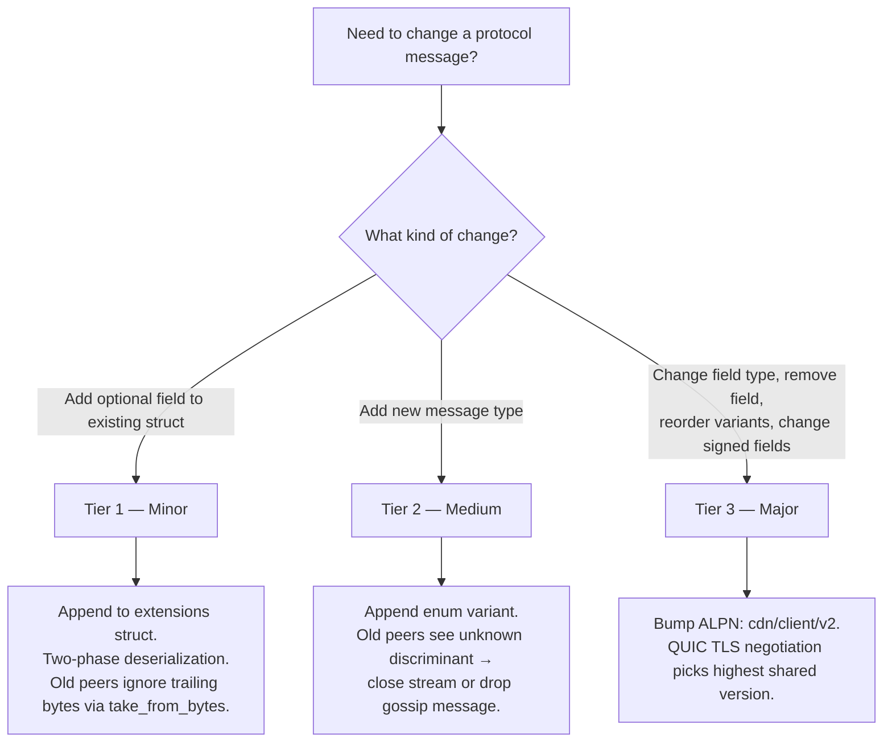
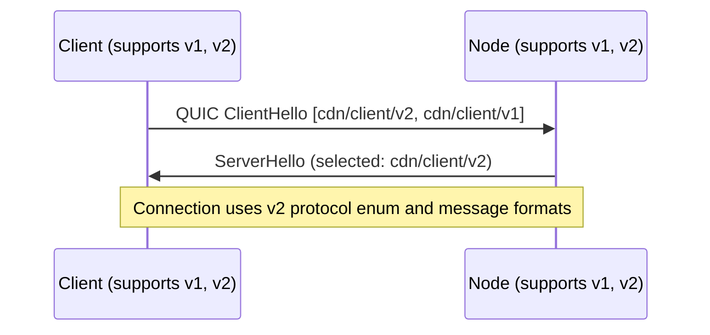
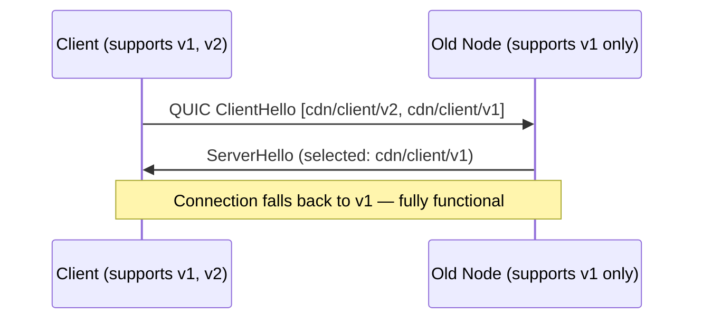

# ADR 013: Schema Evolution

**Date:** 2026-04-03
**Status:** Draft

## Context

All wire messages are serialized with [postcard](https://docs.rs/postcard) — a compact, no-std, serde-based binary format standard in the iroh ecosystem ([ADR 005](005-protocol.md)). Postcard is positional: fields are encoded in declaration order with no field tags, no per-field length delimiters, no schema versioning. `postcard::from_bytes` silently ignores trailing bytes; `postcard::take_from_bytes` returns the unconsumed remainder. Neither fails on trailing bytes — but on a QUIC byte stream with no message boundaries, the receiver cannot find where one message ends without explicit framing. [ADR 005](005-protocol.md) noted the limitation: "Postcard has no schema evolution story — adding fields requires a new ALPN version (`cdn/client/v2`); version negotiation must be planned before the first breaking change."

The codebase already has an ad-hoc pattern: `StreamRequest` appends `ethereum_address: Option<Address>` and `binding_signature: Option<Bytes>` with `#[serde(default)]` ([ADR 005](005-protocol.md)). ADR 005 called this a "one-time workaround" and stated "any future mandatory field addition still requires `cdn/client/v2`." It is unscalable. Gossip messages (`NodeAnnounce`, `ReputationReport`) have no ALPN negotiation — published to iroh-gossip topics whose names embed a version (`cdn/global/v1`), and changing a topic name partitions the gossip network.

Several messages contain cryptographically signed fields ([ADR 005](005-protocol.md)). Signatures are a byte-level commitment: appending a field to a signed struct makes old verifiers compute the signature over fewer bytes than the signer intended, causing verification failure. Signed field sets must be explicitly frozen per protocol version.

The project is pre-implementation. Defining framing and evolution conventions now avoids retrofitting after v1 — itself a breaking change.

## Decision

### Wire Framing

Every message on every QUIC stream (all ALPNs) is length-prefixed:

```
┌─────────────────────┬──────────────────────────────┐
│ varint(len)         │ postcard_bytes[0..len]        │
│ (1–5 bytes, LEB128) │ (protocol enum + payload)     │
└─────────────────────┴──────────────────────────────┘
```

The varint uses postcard's native varint encoding (continuation-bit scheme similar to LEB128). `MAX_MESSAGE_SIZE = 16 MiB` (16,777,216 bytes) — a single global protocol-level limit applied uniformly across all ALPNs; messages exceeding it are rejected before allocation. Per-ALPN protocol-level caps are rejected: typical messages are orders of magnitude below 16 MiB (see *DoS note*), and a future ALPN requiring >16 MiB would itself be a major-version change. **DoS note:** `read_frame` allocates `len` bytes, so a malicious peer could send a large length prefix to force allocation. The 16 MiB cap bounds per-stream allocation; QUIC's `MAX_STREAMS` transport parameter ([ADR 005](005-protocol.md)) bounds concurrent streams per connection — together limiting per-peer memory exposure. Operators on memory-constrained nodes SHOULD set a lower `MAX_MESSAGE_SIZE` as local policy; `cdn/probe/v1` messages never exceed ~200 bytes, and `cdn/client/v1` messages (excluding `ChunkData`) never exceed ~1 KiB.

The receiver reads the varint length, allocates and reads exactly that many bytes, then deserializes with `postcard::take_from_bytes` on the bounded slice. `take_from_bytes` succeeds even if the sender's struct has more fields than the receiver's definition — unconsumed trailing bytes are returned as a remainder. This is the key mechanism for forward-compatible minor evolution.

```rust
use postcard::take_from_bytes;
use serde::de::DeserializeOwned;

const MAX_MESSAGE_SIZE: u32 = 16 * 1024 * 1024; // 16 MiB

/// Read one length-prefixed frame from a QUIC RecvStream.
/// Returns the raw frame bytes for application-layer deserialization.
async fn read_frame(stream: &mut RecvStream) -> Result<Vec<u8>> {
    let len = read_varint_u32(stream).await?;
    if len > MAX_MESSAGE_SIZE {
        return Err(Error::MessageTooLarge(len));
    }
    let mut buf = vec![0u8; len as usize];
    stream.read_exact(&mut buf).await?;
    Ok(buf)
}

/// Write one length-prefixed frame to a QUIC SendStream.
/// `payload` is pre-serialized bytes (protocol enum + optional extensions).
async fn write_frame(stream: &mut SendStream, payload: &[u8]) -> Result<()> {
    write_varint_u32(stream, payload.len() as u32).await?;
    stream.write_all(payload).await?;
    Ok(())
}
```

These are low-level framing helpers. Application-layer deserialization is separate — the caller deserializes the protocol enum from the frame bytes with `take_from_bytes`, then optionally deserializes extensions from the remainder (see [Tier 1 — Minor](#tier-1--minor-no-coordination) and [Wire Layout](#wire-layout)).

#### `ChunkData` exemption

`ChunkData` payloads (1024-byte blob chunks) are already implicitly length-delimited by the QUIC stream's byte count and the voucher interval. They MUST still use varint-length framing for consistency — the receiver must distinguish `ChunkData` from `Voucher`/`VoucherAck` on the same stream via the protocol enum discriminant. The 1–2 byte overhead on 1024-byte chunks is ~0.1%.

### Protocol Enums

Each ALPN defines a single top-level enum wrapping all message types for that protocol, serialized as the outermost postcard value inside the length-prefixed frame. Postcard encodes enum variants with a varint discriminant (1 byte for variants 0–127), providing explicit, extensible message type tags on the wire.

```rust
/// cdn/probe/v1
#[derive(Serialize, Deserialize)]
enum ProbeMessage {
    Request(ProbeRequest),    // discriminant 0
    Response(ProbeResponse),  // discriminant 1
}

/// cdn/client/v1
#[derive(Serialize, Deserialize)]
enum ClientMessage {
    StreamRequest(StreamRequest),     // 0
    StreamResponse(StreamResponse),   // 1
    ChunkData(ChunkData),             // 2
    Voucher(Voucher),                 // 3
    VoucherAck,                       // 4
    StreamEnd,                        // 5
}
```

#### Variant ordering rule

Discriminants are assigned in declaration order (postcard default). New variants MUST be appended at the end. Reordering or removing variants is a major (breaking) change requiring an ALPN version bump.

#### Unknown variant handling

When a peer receives a message with an unknown enum discriminant:

- **QUIC stream protocols:** The receiver MUST close the individual stream with application error code `0x01` (`UNSUPPORTED_MESSAGE`). The QUIC connection and other streams are unaffected. The receiver SHOULD log the unknown discriminant at `WARN` level for operational visibility.
- **Gossip:** Unknown variants are silently dropped at the application layer (consistent with existing gossip validation — unknown messages are ignored). This is not a propagation barrier: iroh-gossip's PlumTree relay operates at the transport layer and forwards raw bytes to tree neighbors before the application deserializes the `GossipEnvelope`. Unknown variants reach all mesh nodes; only application-layer processing ignores them on nodes that do not understand them.

### Gossip Envelope

Gossip messages are published to iroh-gossip topics without ALPN negotiation. To enable schema evolution, all gossip payloads are wrapped in a `GossipEnvelope`:

```rust
/// Outermost wrapper for all gossip messages.
/// Serialized via postcard as the raw bytes passed to iroh-gossip.
#[derive(Serialize, Deserialize)]
struct GossipEnvelope {
    /// Envelope format version. Currently 1.
    version: u8,
    /// The actual gossip message.
    payload: GossipPayload,
}

#[derive(Serialize, Deserialize)]
enum GossipPayload {
    NodeAnnounce(NodeAnnounce),             // 0
    ReputationReport(ReputationReport),     // 1
}
```

#### Deserialization rule

Peers deserialize `GossipEnvelope` using `take_from_bytes`. If `version != 1` (unknown envelope version, including version 0 which is reserved/invalid), the message is silently dropped — the envelope format may have changed incompatibly. If the `GossipPayload` variant is unknown (new enum discriminant), it is also silently dropped. This ensures old peers safely ignore messages from newer peers without crashing or corrupting state.

#### Topic names vs. envelope version

Topic names (`cdn/global/v1`, `cdn/reputation/v1`) embed a version referring to the topic's semantic contract — its purpose, membership rules, validation semantics. `GossipEnvelope.version` handles wire format evolution independently. A topic name version bump (e.g., `cdn/global/v2`) is the gossip equivalent of a major ALPN bump and requires dual-subscription during transition.

##### Rule for choosing between envelope evolution and topic bump

- *Payload-shape changes* — new optional fields, new `GossipPayload` enum variants, additional unsigned outer fields → **envelope evolution**. Bump `GossipEnvelope.version` only if the envelope wire format itself changes; otherwise append to `GossipPayload` (Tier 2) or extend an inner message via the `Body` + outer fields pattern (Tier 1). The topic name does **not** change; no dual-subscription cost. Old peers safely ignore unknown payload variants per the [Deserialization rule](#deserialization-rule).
- *Topic-level changes* — who may publish, what registry/membership rule applies, what validation semantics gate acceptance, the topic's purpose → **topic name bump** (`cdn/global/v2`) with dual-subscription during the [Deprecation Timeline](#deprecation-timeline). Envelope-version evolution cannot express these because they alter the topic's trust contract; an old subscriber would accept messages under semantics it no longer enforces.

This dichotomy is load-bearing: topic bumps are expensive (every node and validating client dual-subscribes for the full deprecation window) and unnecessary for payload-shape changes that two-phase deserialization absorbs. The default for any backwards-compatible message change MUST be envelope evolution; topic bumps are reserved for genuine trust-contract changes.

#### Gossip validation interaction

Existing gossip validation rules ([ADR 001](001-network.md)) — signature verification, registry membership check, timestamp freshness, monotonic timestamp — operate on the inner `GossipPayload` after envelope unwrapping. The envelope is not signed; the inner message's signature covers the same fields as before.

### Three Tiers of Evolution



#### Tier 1 — Minor (no coordination)

Append optional fields to an existing struct using two-phase deserialization. This requires the length-prefixed framing above — the receiver knows exactly how many bytes belong to the message and can detect whether extension bytes are present.

##### Postcard limitation

Postcard is positional: `Option<T>` serializes as `0x00` (None) or `0x01 ++ T_bytes` (Some). If an old sender serializes a struct without a new trailing `Option<T>` field, the buffer ends before the Option discriminant byte; both `from_bytes` and `take_from_bytes` fail with `DeserializeUnexpectedEnd` — postcard has no mechanism to fill defaults for missing trailing fields. `#[serde(default)]` does not help: serde's `default` applies only when the *key* is absent (self-describing formats like JSON), not when the *bytes* are absent.

##### Two-phase deserialization

Split the struct into a frozen base and an extensions struct, then deserialize in two phases using the length-prefixed frame boundary:

```rust
use postcard::take_from_bytes;

/// Frozen base fields — never changes within a protocol version.
#[derive(Serialize, Deserialize)]
struct StreamRequestBase {
    hash: Hash,
    channel_id: ChannelId,
    byte_offset: u64,
    timestamp_us: u64,
}

/// Extension fields — new optional fields are appended here via Tier 1.
#[derive(Serialize, Deserialize, Default)]
struct StreamRequestExt {
    voucher_interval_mb: Option<u64>,
    ethereum_address: Option<Address>,
    binding_signature: Option<Bytes>,
}

fn deserialize_stream_request(buf: &[u8]) -> Result<(StreamRequestBase, StreamRequestExt)> {
    let (base, remainder) = take_from_bytes::<StreamRequestBase>(buf)?;
    let ext = if remainder.is_empty() {
        // Old sender — no extension bytes present. Fill defaults.
        StreamRequestExt::default()
    } else {
        // New sender — extension bytes present. Deserialize them.
        // Use take_from_bytes to tolerate further trailing bytes
        // from even-newer senders.
        take_from_bytes::<StreamRequestExt>(remainder)?.0
    };
    Ok((base, ext))
}
```

This provides bidirectional compatibility:

- **New sender → old receiver:** `take_from_bytes` on the base struct succeeds; trailing extension bytes are discarded.
- **Old sender → new receiver:** `take_from_bytes` on the base struct succeeds with no remainder; the receiver fills `StreamRequestExt::default()`.
- **Newer sender → new receiver:** `take_from_bytes` on the extensions struct succeeds; any further trailing bytes (from fields the receiver doesn't know about) are discarded.

#### Wire Layout

The two-phase pattern interacts with the protocol enum as follows. Within a single length-prefixed frame:

```
┌────────────────┬─────────────────────────┬───────────────────────┐
│ varint(len)    │ postcard(enum_variant +  │ postcard(ext_fields)  │
│ (frame prefix) │   base_fields)          │ (optional, may be     │
│                │                         │  absent from old      │
│                │                         │  senders)             │
└────────────────┴─────────────────────────┴───────────────────────┘
```

The protocol enum variant wraps the **base** struct only. Extension fields trail after the enum value within the same frame. The receiver deserializes the enum with `take_from_bytes`, returning the base message and a byte remainder. A non-empty remainder contains extension fields for that message type.

```rust
/// Application-layer deserialization for messages with extensions.
fn deserialize_client_msg(frame: &[u8]) -> Result<(ClientMessage, Option<StreamRequestExt>)> {
    let (msg, remainder) = take_from_bytes::<ClientMessage>(frame)?;
    let ext = match &msg {
        ClientMessage::StreamRequest(_) if !remainder.is_empty() => {
            Some(take_from_bytes::<StreamRequestExt>(remainder)?.0)
        }
        _ => None, // No extensions for this message type, or old sender
    };
    Ok((msg, ext))
}

/// Application-layer serialization for messages with extensions.
fn serialize_stream_request(base: &StreamRequestBase, ext: &StreamRequestExt) -> Result<Vec<u8>> {
    let msg = ClientMessage::StreamRequest(StreamRequest::from(base));
    let mut buf = postcard::to_allocvec(&msg)?;
    buf.extend_from_slice(&postcard::to_allocvec(ext)?);
    Ok(buf)
    // Caller passes `buf` to `write_frame(stream, &buf)`
}
```

Messages without extensions (e.g., `VoucherAck`, `StreamEnd`, `ChunkData`) have no trailing bytes — the `take_from_bytes` remainder is empty. The framing helpers (`read_frame`/`write_frame`) are agnostic to extensions; two-phase logic lives in per-message-type application code.

**Rules:**

- New extension fields MUST be `Option<T>` or types with a meaningful `Default` impl. Non-optional fields cannot be added via minor evolution.
- New extension fields MUST be appended to the end of the extensions struct. Field order within `*Ext` is frozen once released — insertions and reordering are major changes.
- New fields MUST NOT be included in any existing signature computation (see [Signed Field Freezing](#signed-field-freezing)).
- The base struct is frozen at the protocol version that introduced it. Moving fields between base and extensions is a major change.

This formalizes the pattern already used for `ethereum_address`, `binding_signature`, and `voucher_interval_mb` in `StreamRequest` ([ADR 005](005-protocol.md)) — no longer a one-time workaround but the standard minor evolution mechanism. The existing `Option<T>` fields with default semantics (`ethereum_address`/`binding_signature` with `#[serde(default)]`, `voucher_interval_mb` defaulting to 1 MB when absent) go in the extensions struct from the start, since the project is pre-implementation.

> Multi-stablecoin payments ([ADR 003](003-payments.md)) add **no** new wire field: the channel's stablecoin is bound by `channel_id` (which incorporates the token address) and by the existing signed `token` field in the EIP-712 voucher. So multi-stablecoin support is wire-compatible with `cdn/client/v1` and needs no version bump. This is the payoff of freezing the base struct pre-implementation — a field that would otherwise have forced a Tier 3 bump (postcard encodes structs positionally, so appending to an already-in-use `*Ext` breaks positional decoding) is simply not needed.

##### Example — adding `supported_versions` to `NodeAnnounce`

```rust
#[derive(Serialize, Deserialize)]
struct NodeAnnounceBody {
    node_id: NodeId,
    region: String,  // ISO 3166-1 alpha-2
    load: LoadHint,
    timestamp_us: u64,
}

#[derive(Serialize, Deserialize, Default)]
struct NodeAnnounceExt {
    // Added via minor evolution
    supported_versions: Option<Vec<String>>,
}

#[derive(Serialize, Deserialize)]
struct NodeAnnounce {
    body: NodeAnnounceBody,
    signature: Bytes,
    // Extensions follow — deserialized via two-phase pattern
}
```

Old peers deserialize `NodeAnnounce` without extensions — `take_from_bytes` on body + signature succeeds with no remainder, and the receiver fills `NodeAnnounceExt::default()`. New peers receiving old `NodeAnnounce` messages see `supported_versions: None`. The signature covers only `NodeAnnounceBody`, so extensions are freely evolvable (see [Signed Field Freezing](#signed-field-freezing)).

#### Tier 2 — Medium (new message types, no ALPN bump)

Append a new variant to the protocol enum. Old peers encountering an unknown varint discriminant handle it gracefully (stream close or gossip drop — see [Unknown variant handling](#protocol-enums)).

**Rules:**

- New variants MUST be appended at the end of the enum. Reordering or removal is a major change.
- The new message type MUST be non-critical for peers that do not understand it. If the message is required for protocol correctness, it is a major change.
- For QUIC protocols, the sender SHOULD be prepared for the receiver to close the stream with `UNSUPPORTED_MESSAGE` and fall back to behavior that does not require the new message type.

##### Example — adding a `Ping`/`Pong` keepalive to the delivery protocol

```rust
enum ClientMessage {
    StreamRequest(StreamRequest),     // 0
    StreamResponse(StreamResponse),   // 1
    ChunkData(ChunkData),             // 2
    Voucher(Voucher),                 // 3
    VoucherAck,                       // 4
    StreamEnd,                        // 5
    // Added via medium evolution
    Ping(PingRequest),                // 6
    Pong(PongResponse),              // 7
}
```

Old peers receiving `Ping` (discriminant 6) close the stream with `UNSUPPORTED_MESSAGE`; the sender detects this and falls back to QUIC-level keepalive.

#### Tier 3 — Major (ALPN version bump)

Required for changes that cannot be handled by minor or medium evolution:

- Removing a field from a struct
- Changing a field's type (e.g., `u64` → `u128`)
- Reordering or removing enum variants
- Adding a mandatory (non-optional) field
- Modifying the set of signed fields
- Changing the framing format itself

The ALPN string is bumped: `cdn/client/v1` → `cdn/client/v2`. Version coexistence is handled by QUIC ALPN negotiation (see [ALPN Version Negotiation](#alpn-version-negotiation)).

### Signed Field Freezing

Fields covered by a cryptographic signature are frozen at the protocol version that introduced them. Adding, removing, or reordering signed fields is a Tier 3 (major) change.

#### Rationale

Signatures are computed over a specific byte sequence produced by postcard serialization. If a newer sender appends a field to the signed struct, an older verifier computes the signature over fewer bytes — verification fails. If an older sender omits the field, a newer verifier expects more bytes — verification also fails. The signature is a bilateral commitment to the exact field set.

| Message | Signed fields | Unsigned fields (evolvable via Tier 1) |
| --- | --- | --- |
| `ProbeResponse` | `hash`, `has_blob`, `rate_per_mb`, `timestamp_us` | `total_bytes` |
| `StreamResponse` | `hash`, `ok`, `rate_per_mb`, `total_bytes`, `channel_id`, `timestamp_us`, `redirect` | `error`, `voucher_interval_mb` |
| `NodeAnnounce` | `node_id`, `region`, `load`, `timestamp_us` | *(none currently — see implementation note)* |
| `ReputationReport` | `provider`, `reporter`, `metrics`, `timestamp` | *(none currently)* |

#### Implementation note — separating signed and unsigned fields

For messages currently signed over all non-signature fields (e.g., `NodeAnnounce`), implementations SHOULD serialize signed fields into a dedicated inner struct (e.g., `NodeAnnounceBody`) and compute the signature over that struct's postcard bytes. Unsigned fields (added via minor evolution) live in the outer struct, outside the signed region:

```rust
/// Signed portion — field set is frozen per protocol version.
#[derive(Serialize, Deserialize)]
struct NodeAnnounceBody {
    node_id: NodeId,
    region: String,  // ISO 3166-1 alpha-2, e.g. "US"
    load: LoadHint,
    timestamp_us: u64,
}

/// Full wire message — extensions follow body + signature via two-phase deserialization.
#[derive(Serialize, Deserialize)]
struct NodeAnnounce {
    body: NodeAnnounceBody,
    signature: Bytes,
}

/// Extension fields — appended via Tier 1 minor evolution.
#[derive(Serialize, Deserialize, Default)]
struct NodeAnnounceExt {
    supported_versions: Option<Vec<String>>,
}
```

This separates the frozen signed region from the evolvable unsigned region via two-phase deserialization (see [Tier 1](#tier-1--minor-no-coordination)). The same pattern applies to `ProbeResponse`, `StreamResponse`, and `ReputationReport`.

#### Cross-ADR struct alignment

The `Body` + extensions pattern and type definitions here are the canonical reference for implementation. Struct definitions in [ADR 001](001-network.md), [ADR 005](005-protocol.md), and [ADR 008](008-reputation.md) retain their flat-struct representations for readability; implementations MUST follow the body/extensions split defined here. Those flat-struct definitions will be updated when implementation begins.

### ALPN Version Negotiation

QUIC ALPN negotiation is built into TLS 1.3 (RFC 7301). The client proposes supported ALPNs in `ClientHello`; the server selects the highest mutually supported version.





**Convention:** Clients propose versions in descending order (newest first). The server selects the highest version it supports. If the server supports none of the proposed versions, the TLS handshake fails with `no_application_protocol` alert and the client falls back to the next candidate node from probe results.

#### Multi-version support

A node MUST support at least the current and previous major version simultaneously during a transition period (see [Deprecation Timeline](#deprecation-timeline)). Both versions run as independent protocol handlers on the same `iroh::Endpoint`, which supports registering multiple ALPN handlers — each runs independently with no in-process version translation.

**Gossip has no ALPN negotiation.** Gossip evolution is handled entirely by the `GossipEnvelope` version field and the `GossipPayload` enum. Topic name version bumps are the gossip equivalent of a major ALPN bump and require dual-subscription during the transition period (nodes subscribe to both old and new topic names).

### Deprecation Timeline

| Milestone | Timeframe | Action |
| --- | --- | --- |
| New version released | T+0 | Nodes begin supporting both old and new versions |
| Adoption target | T+4 weeks | All nodes SHOULD support the new version. Clients begin preferring the new version |
| Old version removal | T+12 weeks | Old version support MAY be removed. Nodes that have not upgraded become unreachable by new clients |
| Gossip topic removal | T+12 weeks | Old gossip topic subscriptions MAY be dropped. Peers on old topics become invisible |

Deprecation schedules are announced via governance ([ADR 009](009-governance.md)). An on-chain `ProtocolVersions` registry contract is explicitly out of scope — off-chain governance announcement plus QUIC ALPN negotiation already covers the runtime path (clients try the newest version first, fall back on `no_application_protocol`), and a registry contract adds governance and integration complexity without operational payoff at the expected network scale. If a future scale or trust profile changes the calculus, the registry warrants its own ADR rather than a deferred follow-up here.

> **See also:** [`appendix-operator-upgrade-path.md`](appendix-operator-upgrade-path.md) sequences the operator-side actions for each tier — Tier 1/2 checklists, the Tier 3 rolling-upgrade procedure, and client / governance coordination touchpoints.

### Application Error Codes

QUIC application error codes used by this ADR:

| Code | Name | Meaning |
| --- | --- | --- |
| `0x00` | `NO_ERROR` | Normal stream/connection close. Also used when a failure does not map to any code below (e.g. read timeout) |
| `0x01` | `UNSUPPORTED_MESSAGE` | Received an unknown protocol enum variant |
| `0x02` | `MESSAGE_TOO_LARGE` | Received a length prefix exceeding `MAX_MESSAGE_SIZE` |
| `0x03` | `MALFORMED_MESSAGE` | Frame failed decoding. Covers postcard deserialization failure, varint parse errors, and transport I/O errors during frame read (since the receiver cannot distinguish a truncated frame from a malformed one at the application layer) |
| `0x10` | `RATE_LIMITED` | Connection rejected by the per-source or global rate limiter. Delivered via `CONNECTION_CLOSE` (not `RESET_STREAM`) because rejection happens before any application stream exists; the close-frame reason bytes carry a short layer label (e.g. `global-full`, `per-source`) so peers can pick an appropriate backoff. Peers that receive this code SHOULD back off before reconnecting; they MUST NOT treat it as a protocol error. |

#### Scope

These codes SHOULD be delivered via `RESET_STREAM` / `STOP_SENDING` so that other streams multiplexed on the same QUIC connection are unaffected. An ALPN that guarantees a 1:1 connection:stream topology (e.g. `cdn/probe/v1`) MAY additionally mirror the same code in the application-level `CONNECTION_CLOSE` frame so the peer observes a deterministic error code even when a stream reset races connection teardown. ALPNs that multiplex multiple streams per connection MUST NOT surface these codes at the connection level, as doing so would tear down unrelated streams.

Additional application error codes defined by other ADRs are unaffected. The codes above occupy the low range `0x00`–`0x0F`; ADRs allocating new codes SHOULD use `0x10` and above to avoid collisions.

## Consequences

### Positive

- Formalizes the optional-trailing-fields pattern from [ADR 005](005-protocol.md) as a standard, repeatable mechanism — no longer a one-time workaround
- Length-prefixed framing enables forward-compatible deserialization: receivers skip unknown trailing bytes without connection failure
- Protocol enums give explicit, type-safe message discrimination on every ALPN, replacing [Appendix: Encrypted Content Publishing](appendix-encrypted-content-publishing.md)'s ad-hoc 1-byte prefix with a uniform pattern
- The three-tier model provides a clear decision framework for every future protocol change
- Gossip envelope provides schema evolution for messages lacking ALPN negotiation, filling the gap identified in [ADR 005](005-protocol.md)
- ALPN negotiation is already supported by QUIC/TLS 1.3 and iroh — no custom handshake needed for major version transitions
- Signed field freezing makes implicit constraints explicit, preventing accidental signature-breaking changes
- The signed body / unsigned outer fields pattern enables minor evolution of messages that currently sign all fields, without an ALPN bump
- All conventions are defined before v1 implementation — no migration cost

### Negative

- Varint length prefix adds 1–5 bytes per message. For `ChunkData` (1024-byte payload), ~0.2% including the enum discriminant; for `ProbeRequest` (~40 bytes), ~5%. Both negligible
- `take_from_bytes` is marginally slower than `from_bytes` (tracks consumed position); negligible for this protocol's message sizes (sub-microsecond)
- Minor evolution can accumulate "dead weight" — added fields no longer useful, with no removal mechanism short of a major version bump. Unlikely to matter at this protocol's message sizes
- Signed field freezing means even minor improvements to signed structs (e.g., adding a field to `ProbeResponse`'s signed set) require a full ALPN version bump. Conservative by design — the unsigned outer fields pattern mitigates this for fields that need not be signed
- The `GossipEnvelope` wrapper adds 2–3 bytes (version byte + enum discriminant) per gossip message. For `NodeAnnounce` (~800 bytes), <0.4%
- Multi-version support during deprecation requires nodes to maintain two protocol handler codepaths simultaneously, increasing code complexity during transitions. The 12-week deprecation window bounds this cost
- Refactoring signed messages to the `Body` + outer fields pattern changes the struct layout relative to ADR 005's current definitions. Pre-implementation, so a design change not a migration — but it MUST be reflected in the `protocol` crate's type definitions from day one
