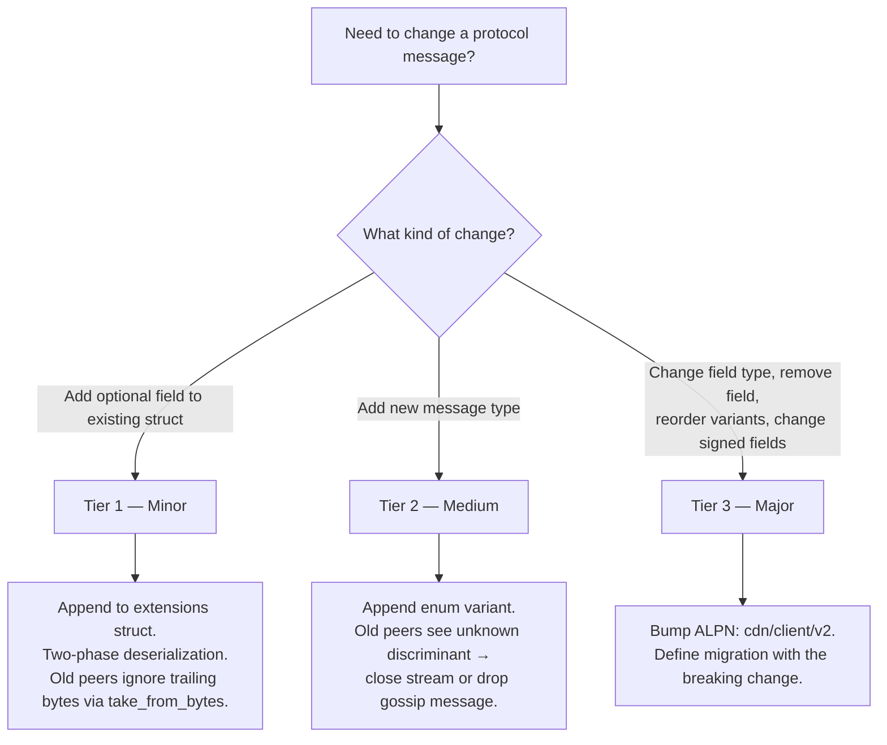

# ADR 013: Schema Evolution

**Date:** 2026-04-03
**Status:** Draft

## Context

All wire messages are serialized with [postcard](https://docs.rs/postcard) — a compact, no-std, serde-based binary format standard in the iroh ecosystem ([ADR 005](005-protocol.md#adr-005-wire-protocol)). Postcard is positional: fields are encoded in declaration order with no field tags, per-field length delimiters, or schema versioning. `postcard::from_bytes` silently ignores trailing bytes; `postcard::take_from_bytes` returns the unconsumed remainder. Neither fails on trailing bytes, but a QUIC byte stream has no message boundaries from which a receiver can determine where one message ends. Explicit framing is required.

`StreamRequest` already separates its frozen base from a separately encoded trailing `StreamRequestExt` ([ADR 005](005-protocol.md#adr-005-wire-protocol)). That two-phase pattern handles compatible optional growth and needs to be uniform across protocols. Gossip messages (`NodeAnnounce`) use iroh-gossip rather than a deCDN ALPN selector; their topic names embed a version (`cdn/global/v1`), and changing a topic name partitions the gossip network.

Several messages contain cryptographically signed fields ([ADR 005](005-protocol.md#adr-005-wire-protocol)). Signatures are a byte-level commitment: appending a field to a signed struct makes old verifiers compute the signature over fewer bytes than the signer intended, causing verification failure. Signed field sets must be explicitly frozen per protocol version.

The protocol therefore defines framing, compatible in-version changes, and the boundary at which a new ALPN or topic is required.

## Decision

### Wire Framing

Every message on every QUIC stream (all ALPNs) is length-prefixed:

```
┌─────────────────────┬──────────────────────────────┐
│ varint(len)         │ postcard_bytes[0..len]        │
│ (1–5 bytes, LEB128) │ (protocol enum + payload)     │
└─────────────────────┴──────────────────────────────┘
```

The varint uses postcard's native varint encoding (continuation-bit scheme similar to LEB128). `MAX_MESSAGE_SIZE = 16 MiB` (16,777,216 bytes) — a single global protocol-level limit applied uniformly across all ALPNs; messages exceeding it are rejected before allocation. The cap is global, not per-ALPN: typical messages are orders of magnitude below 16 MiB (see *DoS note*), and a future ALPN requiring >16 MiB would itself be a major-version change. **DoS note:** `read_frame` allocates `len` bytes, so a malicious peer could send a large length prefix to force allocation. The 16 MiB cap bounds per-stream allocation; QUIC's `MAX_STREAMS` transport parameter ([ADR 005](005-protocol.md#adr-005-wire-protocol)) bounds concurrent streams per connection — together limiting per-peer memory exposure. Operators on memory-constrained nodes SHOULD set a lower `MAX_MESSAGE_SIZE` as local policy; `cdn/probe/v1` messages never exceed ~200 bytes, and `cdn/client/v1` messages (excluding `ChunkData`) never exceed ~1 KiB.

The receiver reads the varint length, allocates and reads exactly that many bytes, then deserializes with `postcard::take_from_bytes` on the bounded slice. `take_from_bytes` succeeds even if the sender's struct has more fields than the receiver's definition — unconsumed trailing bytes are returned as a remainder. This is the key mechanism for forward-compatible minor evolution.

```rust
use postcard::take_from_bytes;
use serde::de::DeserializeOwned;

const MAX_MESSAGE_SIZE: u32 = 16 * 1024 * 1024; // 16 MiB

/// Read one length-prefixed frame from a QUIC RecvStream.
/// Returns the raw frame bytes for application-layer deserialization.
async fn read_frame(stream: &mut RecvStream) -> Result<Vec<u8>> {
    let len = read_varint_u32(stream).await?;
    if len > MAX_MESSAGE_SIZE {
        return Err(Error::MessageTooLarge(len));
    }
    let mut buf = vec![0u8; len as usize];
    stream.read_exact(&mut buf).await?;
    Ok(buf)
}

/// Write one length-prefixed frame to a QUIC SendStream.
/// `payload` is pre-serialized bytes (protocol enum + optional extensions).
async fn write_frame(stream: &mut SendStream, payload: &[u8]) -> Result<()> {
    write_varint_u32(stream, payload.len() as u32).await?;
    stream.write_all(payload).await?;
    Ok(())
}
```

These are low-level framing helpers. Application-layer deserialization is separate — the caller deserializes the protocol enum from the frame bytes with `take_from_bytes`, then optionally deserializes extensions from the remainder (see [Tier 1 — Minor](#tier-1--minor-no-coordination) and [Wire Layout](#wire-layout)).

#### `ChunkData` exemption

`ChunkData` payloads (1024-byte blob chunks) are already implicitly length-delimited by the QUIC stream's byte count and the voucher interval. They MUST still use varint-length framing for consistency — the receiver must distinguish `ChunkData` from `Voucher`/`VoucherAck` on the same stream via the protocol enum discriminant. The 1–2 byte overhead on 1024-byte chunks is ~0.1%.

#### Gossip Framing

The `MAX_MESSAGE_SIZE = 16 MiB` ceiling above applies to the deCDN-implemented ALPNs (`cdn/probe/v1`, `cdn/client/v1`, `cdn/dht/v1`) whose framing is owned by `decdn_protocol::framing`. Gossip messages travel through **iroh-gossip's own length-prefixed framing**, not deCDN's, and carry an independent per-frame ceiling enforced inside `iroh_gossip::net::util::read_lp` *before* the inbound `BytesMut` is resized. The deCDN value is:

- **`GOSSIP_MAX_FRAME = 16 KiB`** (`decdn_gossip::GOSSIP_MAX_FRAME`, wired into `Gossip::builder().max_message_size(...)` at runtime construction).

Rationale (analytical bounds from iroh-gossip 0.98 source):

- Data-frame floor ≈ **4.4 KiB**: maximally-padded `GossipEnvelope` (`NodeAnnounce` body + 64 B ed25519 signature + version byte ≈ 256 B envelope) + `MAX_TRAILING_BYTES` (4 KiB Tier-1 extension) + plumtree/topic message wrappers (variant tags, `MessageId`, `DeliveryScope`/`Round` ≈ 64 B) + iroh-gossip's 4 B u32 length prefix.
- HyParView control upper bound ≈ **1.7 KiB**: at default fanout (`shuffle_active_view_count=3`, `shuffle_passive_view_count=4`), a `Shuffle`/`ShuffleReply` carries up to 7 `PeerInfo` entries — each 32 B node id + opaque `PeerData` (~100-200 B for relay URL + direct addresses) — plus enum tags and `Ttl(u16)`.
- 16 KiB gives ~3.7× headroom over the data-frame floor and ~9× over HyParView control, leaving room for future Tier-1 extensions and `PeerData` growth (e.g. multi-relay nodes).

The upstream default (`DEFAULT_MAX_MESSAGE_SIZE = 4096`) is **insufficient**: it cannot carry our `MAX_TRAILING_BYTES` extension allowance even for a single legitimate announce. Pinning the value in code also defends against silent shifts on iroh-gossip minor-version bumps.

**Network-coordination invariant.** Unlike the per-ALPN ceilings above, `GOSSIP_MAX_FRAME` is enforced symmetrically by iroh-gossip on both send and receive paths. Tightening it on one deployment silently partitions the gossip swarm for legitimate HyParView control frames originating elsewhere (cf. [iroh-gossip#131](https://github.com/n0-computer/iroh-gossip/issues/131) — oversize publishes fail silently on the sender). Treat changes to this constant as **wire-compatibility events** requiring coordinated rollout. Do not surface this as an operator-tunable config key.

**Operator-policy scope.** The note above ("Operators on memory-constrained nodes SHOULD set a lower `MAX_MESSAGE_SIZE` as local policy") applies only to deCDN-owned ALPNs whose framing is decoded inside this node and cannot affect a peer; it does NOT apply to `GOSSIP_MAX_FRAME`.

**iroh-gossip dependency.** The cap is wired via `iroh_gossip::net::Gossip::builder().max_message_size(N)` (iroh-gossip ≥ 0.98). The minimum allowed value is `MIN_MAX_MESSAGE_SIZE = 512`.

### Protocol Enums

Each ALPN defines a single top-level enum wrapping all message types for that protocol, serialized as the outermost postcard value inside the length-prefixed frame. Postcard encodes enum variants with a varint discriminant (1 byte for variants 0–127), providing explicit, extensible message type tags on the wire.

```rust
/// cdn/probe/v1
#[derive(Serialize, Deserialize)]
enum ProbeMessage {
    Request(ProbeRequest),    // discriminant 0
    Response(ProbeResponse),  // discriminant 1
}

/// cdn/client/v1
#[derive(Serialize, Deserialize)]
enum ClientMessage {
    StreamRequest(StreamRequest),     // 0
    StreamResponse(StreamResponse),   // 1
    ChunkData(ChunkData),             // 2
    Voucher(Voucher),                 // 3
    VoucherAck,                       // 4
    StreamEnd,                        // 5
}
```

#### Variant ordering rule

Discriminants are assigned in declaration order (postcard default). New variants MUST be appended at the end. Reordering or removing variants is a major (breaking) change requiring an ALPN version bump.

#### Unknown variant handling

When a peer receives a message with an unknown enum discriminant:

- **QUIC stream protocols:** The receiver MUST close the individual stream with application error code `0x01` (`UNSUPPORTED_MESSAGE`). The QUIC connection and other streams are unaffected. The receiver SHOULD log the unknown discriminant at `WARN` level for operational visibility.
- **Gossip:** Unknown variants are silently dropped at the application layer (consistent with existing gossip validation — unknown messages are ignored). This is not a propagation barrier: iroh-gossip's PlumTree relay operates at the transport layer and forwards raw bytes to tree neighbors before the application deserializes the `GossipEnvelope`. Unknown variants reach all mesh nodes; only application-layer processing ignores them on nodes that do not understand them.

### Gossip Envelope

Gossip messages are published through iroh-gossip rather than a deCDN ALPN selector. All gossip payloads are wrapped in a `GossipEnvelope`; its version byte is a reserved sentinel and guard, not a capability advertisement or negotiation mechanism:

```rust
/// Outermost wrapper for all gossip messages.
/// Serialized via postcard as the raw bytes passed to iroh-gossip.
#[derive(Serialize, Deserialize)]
struct GossipEnvelope {
    /// Envelope format version. Currently 1.
    version: u8,
    /// The actual gossip message.
    payload: GossipPayload,
}

#[derive(Serialize, Deserialize)]
enum GossipPayload {
    NodeAnnounce(NodeAnnounce),             // 0
    // Future variants take discriminant 1, 2, … — old peers drop unknown
    // discriminants per the deserialization rule below.
}
```

#### Deserialization rule

Peers deserialize `GossipEnvelope` using `take_from_bytes`. If `version != 1` (unknown envelope version, including version 0 which is reserved/invalid), the message is silently dropped — the envelope format may have changed incompatibly. If the `GossipPayload` variant is unknown (new enum discriminant), it is also silently dropped. This ensures old peers safely ignore messages from newer peers without crashing or corrupting state.

#### Topic names vs. envelope version

Topic names (`cdn/global/v1`, `cdn/region/{cc}/v1`) embed a version referring to the topic's semantic contract — its purpose, membership rules, and validation semantics. `GossipEnvelope.version` guards the envelope wire format independently. A topic name version bump (e.g., `cdn/global/v2`) is the gossip equivalent of a major ALPN bump.

##### Rule for choosing between envelope evolution and topic bump

- *Payload-shape changes* — new optional fields, new `GossipPayload` enum variants, additional unsigned outer fields → **envelope evolution**. Bump `GossipEnvelope.version` only if the envelope wire format itself changes; otherwise append to `GossipPayload` (Tier 2) or extend an inner message via the `Body` + outer fields pattern (Tier 1). The topic name does **not** change. Old peers safely ignore unknown payload variants per the [Deserialization rule](#deserialization-rule).
- *Topic-level changes* — who may publish, what registry/membership rule applies, what validation semantics gate acceptance, the topic's purpose → **topic name bump** (`cdn/global/v2`). Envelope-version evolution cannot express these because they alter the topic's trust contract; an old subscriber would accept messages under semantics it no longer enforces. The concrete change defines its own migration plan.

This dichotomy is load-bearing: topic bumps require network coordination and are unnecessary for payload-shape changes that two-phase deserialization absorbs. The default for any backwards-compatible message change MUST be envelope evolution; topic bumps are reserved for genuine trust-contract changes.

#### Gossip validation interaction

Existing gossip validation rules ([ADR 001](001-network.md#adr-001-network-topology-and-peer-mesh)) — signature verification, registry membership check, timestamp freshness, monotonic timestamp — operate on the inner `GossipPayload` after envelope unwrapping. The envelope is not signed; the inner message's signature covers the same fields as before.

### Three Tiers of Evolution



#### Tier 1 — Minor (no coordination)

Append optional fields to an existing struct using two-phase deserialization. This requires the length-prefixed framing above — the receiver knows exactly how many bytes belong to the message and can detect whether extension bytes are present.

##### Postcard limitation

Postcard is positional: `Option<T>` serializes as `0x00` (None) or `0x01 ++ T_bytes` (Some). If an old sender serializes a struct without a new trailing `Option<T>` field, the buffer ends before the Option discriminant byte; both `from_bytes` and `take_from_bytes` fail with `DeserializeUnexpectedEnd` — postcard has no mechanism to fill defaults for missing trailing fields. `#[serde(default)]` does not help: serde's `default` applies only when the *key* is absent (self-describing formats like JSON), not when the *bytes* are absent.

##### Two-phase deserialization

Split the struct into a frozen base and an extensions struct, then deserialize in two phases using the length-prefixed frame boundary:

```rust
use postcard::take_from_bytes;

/// Frozen base fields — never changes within a protocol version.
#[derive(Serialize, Deserialize)]
struct StreamRequestBase {
    hash: Hash,
    namespace_id: U256,
    channel_id: ChannelId,
    byte_offset: u64,
    byte_len: u64,
    timestamp_us: u64,
}

/// Extension fields — new optional fields are appended here via Tier 1.
#[derive(Serialize, Deserialize, Default)]
struct StreamRequestExt {
    voucher_interval_mb: Option<u64>,
    binding: Option<ClientBinding>,
}

fn deserialize_stream_request(buf: &[u8]) -> Result<(StreamRequestBase, StreamRequestExt)> {
    let (base, remainder) = take_from_bytes::<StreamRequestBase>(buf)?;
    let ext = if remainder.is_empty() {
        // Old sender — no extension bytes present. Fill defaults.
        StreamRequestExt::default()
    } else {
        // New sender — extension bytes present. Deserialize them.
        // Use take_from_bytes to tolerate further trailing bytes
        // from even-newer senders.
        take_from_bytes::<StreamRequestExt>(remainder)?.0
    };
    Ok((base, ext))
}
```

This provides bidirectional compatibility:

- **New sender → old receiver:** `take_from_bytes` on the base struct succeeds; trailing extension bytes are discarded.
- **Old sender → new receiver:** `take_from_bytes` on the base struct succeeds with no remainder; the receiver fills `StreamRequestExt::default()`.
- **Newer sender → new receiver:** `take_from_bytes` on the extensions struct succeeds; any further trailing bytes (from fields the receiver doesn't know about) are discarded.

#### Wire Layout

The two-phase pattern interacts with the protocol enum as follows. Within a single length-prefixed frame:

```
┌────────────────┬─────────────────────────┬───────────────────────┐
│ varint(len)    │ postcard(enum_variant +  │ postcard(ext_fields)  │
│ (frame prefix) │   base_fields)          │ (optional, may be     │
│                │                         │  absent from old      │
│                │                         │  senders)             │
└────────────────┴─────────────────────────┴───────────────────────┘
```

The protocol enum variant wraps the **base** struct only. Extension fields trail after the enum value within the same frame. The receiver deserializes the enum with `take_from_bytes`, returning the base message and a byte remainder. A non-empty remainder contains extension fields for that message type.

```rust
/// Application-layer deserialization for messages with extensions.
fn deserialize_client_msg(frame: &[u8]) -> Result<(ClientMessage, Option<StreamRequestExt>)> {
    let (msg, remainder) = take_from_bytes::<ClientMessage>(frame)?;
    let ext = match &msg {
        ClientMessage::StreamRequest(_) if !remainder.is_empty() => {
            Some(take_from_bytes::<StreamRequestExt>(remainder)?.0)
        }
        _ => None, // No extensions for this message type, or old sender
    };
    Ok((msg, ext))
}

/// Application-layer serialization for messages with extensions.
fn serialize_stream_request(base: &StreamRequestBase, ext: &StreamRequestExt) -> Result<Vec<u8>> {
    let msg = ClientMessage::StreamRequest(StreamRequest::from(base));
    let mut buf = postcard::to_allocvec(&msg)?;
    buf.extend_from_slice(&postcard::to_allocvec(ext)?);
    Ok(buf)
    // Caller passes `buf` to `write_frame(stream, &buf)`
}
```

Messages without extensions (e.g., `VoucherAck`, `StreamEnd`, `ChunkData`) have no trailing bytes — the `take_from_bytes` remainder is empty. The framing helpers (`read_frame`/`write_frame`) are agnostic to extensions; two-phase logic lives in per-message-type application code.

**Rules:**

- New extension fields MUST be `Option<T>` or types with a meaningful `Default` impl. Non-optional fields cannot be added via minor evolution.
- New extension fields MUST be appended to the end of the extensions struct. Field order within `*Ext` is frozen once released — insertions and reordering are major changes.
- New fields MUST NOT be included in any existing signature computation (see [Signed Field Freezing](#signed-field-freezing)).
- The base struct is frozen at the protocol version that introduced it. Moving fields between base and extensions is a major change.

This formalizes the pattern used for `voucher_interval_mb` and the optional client identity `binding` in `StreamRequestExt` ([ADR 005](005-protocol.md#adr-005-wire-protocol)) as the standard minor evolution mechanism. The frozen `StreamRequest` base and its separately encoded trailing extensions implement the two-phase layout.

#### Tier 2 — Medium (new message types, no ALPN bump)

Append a new variant to the protocol enum. Old peers encountering an unknown varint discriminant handle it gracefully (stream close or gossip drop — see [Unknown variant handling](#protocol-enums)).

**Rules:**

- New variants MUST be appended at the end of the enum. Reordering or removal is a major change.
- The new message type MUST be non-critical for peers that do not understand it. If the message is required for protocol correctness, it is a major change.
- For QUIC protocols, the sender SHOULD be prepared for the receiver to close the stream with `UNSUPPORTED_MESSAGE` and fall back to behavior that does not require the new message type.

##### Example — adding a `Ping`/`Pong` keepalive to the delivery protocol

```rust
enum ClientMessage {
    StreamRequest(StreamRequest),     // 0
    StreamResponse(StreamResponse),   // 1
    ChunkData(ChunkData),             // 2
    Voucher(Voucher),                 // 3
    VoucherAck,                       // 4
    StreamEnd,                        // 5
    // Added via medium evolution
    Ping(PingRequest),                // 6
    Pong(PongResponse),              // 7
}
```

Old peers receiving `Ping` (discriminant 6) close the stream with `UNSUPPORTED_MESSAGE`; the sender detects this and falls back to QUIC-level keepalive.

#### Tier 3 — Major (ALPN version bump)

Required for changes that cannot be handled by minor or medium evolution:

- Removing a field from a struct
- Changing a field's type (e.g., `u64` → `u128`)
- Reordering or removing enum variants
- Adding a mandatory (non-optional) field
- Modifying the set of signed fields
- Changing the framing format itself

The ALPN string is bumped: `cdn/client/v1` → `cdn/client/v2`. This ADR does not prescribe version coexistence, selection, rollout, rollback, or retirement. The concrete breaking change requires a focused ADR that defines the migration against the runtime that exists at that time.

### Signed Field Freezing

Fields covered by a cryptographic signature are frozen at the protocol version that introduced them. Adding, removing, or reordering signed fields is a Tier 3 (major) change.

#### Rationale

Signatures are computed over a specific byte sequence produced by postcard serialization. If a newer sender appends a field to the signed struct, an older verifier computes the signature over fewer bytes — verification fails. If an older sender omits the field, a newer verifier expects more bytes — verification also fails. The signature is a bilateral commitment to the exact field set.

| Message | Signed fields | Unsigned fields (evolvable via Tier 1) |
| --- | --- | --- |
| `ProbeResponse` | `hash`, `has_blob`, `rate_per_mb`, `timestamp_us` | `total_bytes` |
| `StreamResponse` | `hash`, `ok`, `rate_per_mb`, `total_bytes`, `channel_id`, `timestamp_us`, `redirect` | `error`, `voucher_interval_mb` |
| `NodeAnnounce` | `node_id`, `region`, `timestamp_us` | *(none currently — see implementation note)* |

#### Implementation note — separating signed and unsigned fields

For messages currently signed over all non-signature fields (e.g., `NodeAnnounce`), implementations SHOULD serialize signed fields into a dedicated inner struct (e.g., `NodeAnnounceBody`) and compute the signature over that struct's postcard bytes. Unsigned fields (added via minor evolution) live in the outer struct, outside the signed region:

```rust
/// Signed portion — field set is frozen per protocol version.
#[derive(Serialize, Deserialize)]
struct NodeAnnounceBody {
    node_id: NodeId,
    region: String,  // ISO 3166-1 alpha-2, e.g. "US"
    timestamp_us: u64,
}

/// Full wire message — extensions follow body + signature via two-phase deserialization.
#[derive(Serialize, Deserialize)]
struct NodeAnnounce {
    body: NodeAnnounceBody,
    signature: Bytes,
}

```

Future unsigned extension fields trail `body + signature` and are decoded via two-phase deserialization (see [Tier 1](#tier-1--minor-no-coordination)). The same pattern applies to `ProbeResponse` and `StreamResponse`.

#### Cross-ADR struct alignment

The `Body` + extensions pattern and type definitions here are the canonical implementation reference. Struct definitions in [ADR 001](001-network.md#adr-001-network-topology-and-peer-mesh), [ADR 005](005-protocol.md#adr-005-wire-protocol), and [ADR 008](008-reputation.md#adr-008-reputation-system) retain flat representations for readability; wire implementations MUST follow the body/extensions split defined here.

### Application Error Codes

QUIC application error codes used by this ADR:

| Code | Name | Meaning |
| --- | --- | --- |
| `0x00` | `NO_ERROR` | Normal stream/connection close. Also used for transport-level conditions that aren't application-protocol faults — read timeout, short read, peer reset, mid-frame EOF. A peer observing `0x00` after a partial exchange MUST NOT apply the protocol-fault backoff/penalty associated with `0x03`. (Enforcement of the MUST NOT lives on the receiving peer's reputation/backoff layer — yet to be built; see [ADR 008 §Local Score Calculation](008-reputation.md#local-score-calculation). Without that layer the clause is purely normative.) |
| `0x01` | `UNSUPPORTED_MESSAGE` | Received an unknown protocol enum variant |
| `0x02` | `MESSAGE_TOO_LARGE` | Received a length prefix exceeding `MAX_MESSAGE_SIZE` |
| `0x03` | `MALFORMED_MESSAGE` | Frame failed application-layer decoding: postcard deserialization failure or varint parse error. Transport-level read failures (truncation, peer reset) are reported as `0x00` instead — the framing layer surfaces them as a distinct error variant (`FrameError::Io` vs `FrameError::Varint`/`Decode`), so a receiver does not have to collapse the two. |
| `0x10` | `RATE_LIMITED` | Connection rejected by the per-source or global rate limiter. Delivered via `CONNECTION_CLOSE` (not `RESET_STREAM`) because rejection happens before any application stream exists; the close-frame reason bytes carry a short layer label (e.g. `global-full`, `per-source`) so peers can pick an appropriate backoff. Peers that receive this code SHOULD back off before reconnecting; they MUST NOT treat it as a protocol error. |

#### Scope

These codes SHOULD be delivered via `RESET_STREAM` / `STOP_SENDING` so that other streams multiplexed on the same QUIC connection are unaffected. An ALPN that guarantees a 1:1 connection:stream topology (e.g. `cdn/probe/v1`) MAY additionally mirror the same code in the application-level `CONNECTION_CLOSE` frame so the peer observes a deterministic error code even when a stream reset races connection teardown. ALPNs that multiplex multiple streams per connection MUST NOT surface these codes at the connection level, as doing so would tear down unrelated streams.

Additional application error codes defined by other ADRs are unaffected. The codes above occupy the low range `0x00`–`0x0F`; ADRs allocating new codes SHOULD use `0x10` and above to avoid collisions.

## Consequences

### Positive

- Formalizes the optional-trailing-fields pattern from [ADR 005](005-protocol.md#adr-005-wire-protocol) as a standard, repeatable mechanism — no longer a one-time workaround
- Length-prefixed framing enables forward-compatible deserialization: receivers skip unknown trailing bytes without connection failure
- Protocol enums give explicit, type-safe message discrimination on every ALPN, replacing [Appendix: Encrypted Content Publishing](appendix-encrypted-content-publishing.md#appendix-encrypted-content-publishing-on-decdn)'s ad-hoc 1-byte prefix with a uniform pattern
- The three-tier model provides a clear decision framework for every future protocol change
- The gossip envelope provides a format sentinel and safe unknown-payload handling for messages outside deCDN's ALPN-routed protocols
- Signed field freezing makes implicit constraints explicit, preventing accidental signature-breaking changes
- The signed body / unsigned outer fields pattern enables minor evolution of messages that currently sign all fields, without an ALPN bump

### Negative

- Varint length prefix adds 1–5 bytes per message. For `ChunkData` (1024-byte payload), ~0.2% including the enum discriminant; for `ProbeRequest` (~40 bytes), ~5%. Both negligible
- `take_from_bytes` is marginally slower than `from_bytes` (tracks consumed position); negligible for this protocol's message sizes (sub-microsecond)
- Minor evolution can accumulate "dead weight" — added fields no longer useful, with no removal mechanism short of a major version bump. Unlikely to matter at this protocol's message sizes
- Signed field freezing means even minor improvements to signed structs (e.g., adding a field to `ProbeResponse`'s signed set) require a full ALPN version bump. Conservative by design — the unsigned outer fields pattern mitigates this for fields that need not be signed
- The `GossipEnvelope` wrapper adds 2–3 bytes (version byte + enum discriminant) per gossip message. For `NodeAnnounce` (~800 bytes), <0.4%
- The signed `Body` + unsigned outer-fields split is more complex than the flat message sketches used in other ADRs; wire implementations must preserve the split
