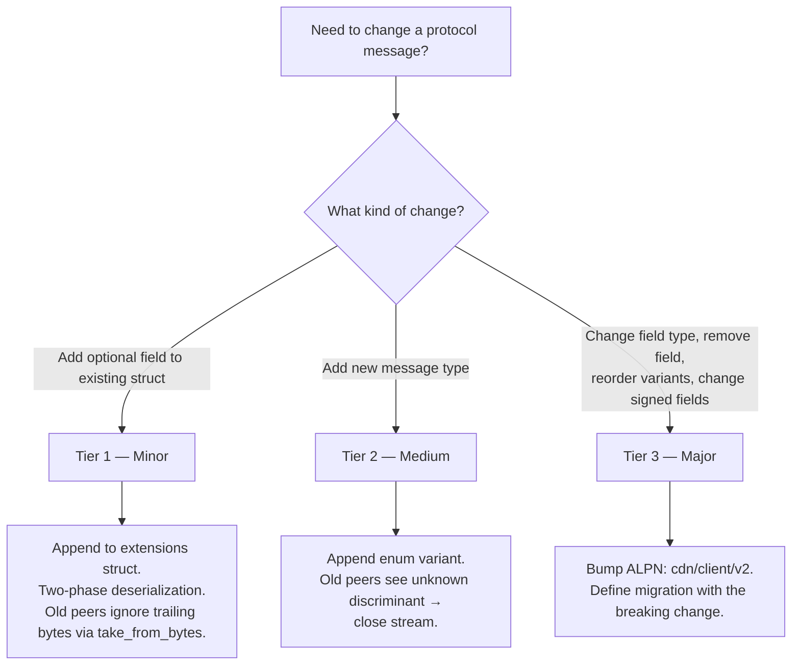

# ADR 013: Schema Evolution

**Date:** 2026-04-03
**Status:** Draft

## Context

All wire messages are serialized with [postcard](https://docs.rs/postcard) — a compact, no-std, serde-based binary format standard in the iroh ecosystem ([ADR 005](005-protocol.md#adr-005-wire-protocol)). Postcard is positional: fields are encoded in declaration order with no field tags, per-field length delimiters, or schema versioning. `postcard::from_bytes` silently ignores trailing bytes; `postcard::take_from_bytes` returns the unconsumed remainder. Neither fails on trailing bytes, but a QUIC byte stream has no message boundaries from which a receiver can determine where one message ends. Explicit framing is required.

`StreamRequest` already separates its frozen base from a separately encoded trailing `StreamRequestExt` ([ADR 005](005-protocol.md#adr-005-wire-protocol)). That two-phase pattern handles compatible optional growth. It needs to be uniform across the three ALPNs (`cdn/probe/v1`, `cdn/client/v1`, `cdn/dht/v1`).

Several messages contain cryptographically signed fields ([ADR 005](005-protocol.md#adr-005-wire-protocol)). Signatures are a byte-level commitment: appending a field to a signed struct makes old verifiers compute the signature over fewer bytes than the signer intended, causing verification failure. Signed field sets must be explicitly frozen per protocol version.

The protocol therefore defines framing, compatible in-version changes, and the boundary at which a new ALPN is required.

## Decision

### Wire Framing

Every message on every QUIC stream (all ALPNs) is length-prefixed:

```
┌─────────────────────┬──────────────────────────────┐
│ varint(len)         │ postcard_bytes[0..len]        │
│ (1–5 bytes, LEB128) │ (protocol enum + payload)     │
└─────────────────────┴──────────────────────────────┘
```

The varint uses postcard's native varint encoding (continuation-bit scheme similar to LEB128). `MAX_MESSAGE_SIZE = 16 MiB` (16,777,216 bytes) — a single global protocol-level limit applied uniformly across all ALPNs; messages exceeding it are rejected before allocation. The cap is global, not per-ALPN: typical messages are orders of magnitude below 16 MiB (see *DoS note*), and a future ALPN requiring >16 MiB would itself be a major-version change. **DoS note:** `read_frame` allocates `len` bytes, so a malicious peer could send a large length prefix to force allocation. The 16 MiB cap bounds per-stream allocation; QUIC's `MAX_STREAMS` transport parameter ([ADR 005](005-protocol.md#adr-005-wire-protocol)) bounds concurrent streams per connection — together limiting per-peer memory exposure. Operators on memory-constrained nodes SHOULD set a lower `MAX_MESSAGE_SIZE` as local policy; `cdn/probe/v1` messages never exceed ~200 bytes, and `cdn/client/v1` messages (excluding `ChunkData`) never exceed ~1 KiB. `ChunkData` is the one message far larger than the rest — a sender sizes it up to one `CHUNK_BYTES` payment interval (1 MiB), still well under the cap.

The receiver reads the varint length, allocates and reads exactly that many bytes, then deserializes with `postcard::take_from_bytes` on the bounded slice. `take_from_bytes` succeeds even if the sender's struct has more fields than the receiver's definition — unconsumed trailing bytes are returned as a remainder. This is the key mechanism for forward-compatible minor evolution.

```rust
use postcard::take_from_bytes;
use serde::de::DeserializeOwned;

const MAX_MESSAGE_SIZE: u32 = 16 * 1024 * 1024; // 16 MiB

/// Read one length-prefixed frame from a QUIC RecvStream.
/// Returns the raw frame bytes for application-layer deserialization.
async fn read_frame(stream: &mut RecvStream) -> Result<Vec<u8>> {
    let len = read_varint_u32(stream).await?;
    if len > MAX_MESSAGE_SIZE {
        return Err(Error::MessageTooLarge(len));
    }
    let mut buf = vec![0u8; len as usize];
    stream.read_exact(&mut buf).await?;
    Ok(buf)
}

/// Write one length-prefixed frame to a QUIC SendStream.
/// `payload` is pre-serialized bytes (protocol enum + optional extensions).
async fn write_frame(stream: &mut SendStream, payload: &[u8]) -> Result<()> {
    write_varint_u32(stream, payload.len() as u32).await?;
    stream.write_all(payload).await?;
    Ok(())
}
```

These are low-level framing helpers. Application-layer deserialization is separate — the caller deserializes the protocol enum from the frame bytes with `take_from_bytes`, then optionally deserializes extensions from the remainder (see [Tier 1 — Minor](#tier-1--minor-no-coordination) and [Wire Layout](#wire-layout)).

#### `ChunkData` exemption

`ChunkData` payloads are sender-sized blob chunks ([ADR 005](005-protocol.md#adr-005-wire-protocol)), so unlike every other message on the ALPN their length is not implied by the message type. They MUST use varint-length framing — it is what delimits one payload from the next, and the receiver must also distinguish `ChunkData` from `Voucher` and `ChunkPreimage` on the same stream via the protocol enum discriminant. `MAX_MESSAGE_SIZE` is the only ceiling on a payload, and it is enforced before allocation.

### Protocol Enums

Each ALPN defines a single top-level enum wrapping all message types for that protocol, serialized as the outermost postcard value inside the length-prefixed frame. Postcard encodes enum variants with a varint discriminant (1 byte for variants 0–127), providing explicit, extensible message type tags on the wire.

```rust
/// cdn/probe/v1
#[derive(Serialize, Deserialize)]
enum ProbeMessage {
    Request(ProbeRequest),    // discriminant 0
    Response(ProbeResponse),  // discriminant 1
}

/// cdn/client/v1
#[derive(Serialize, Deserialize)]
enum ClientMessage {
    StreamRequest(StreamRequest),     // 0
    StreamResponse(StreamResponse),   // 1
    ChunkData(ChunkData),             // 2
    Voucher(Voucher),                 // 3
    ChunkPreimage(ChunkPreimage),     // 4  — unsigned, 33-byte body (ADR 005)
    StreamEnd,                        // 5
    StreamError(StreamError),         // 6
}
```

`VARIANT_COUNT` is 7 after the insertion, and `crates/protocol/src/client.rs` pins it against the highest discriminant.

#### Variant ordering rule

Discriminants are assigned in declaration order (postcard default). New variants MUST be appended at the end. Reordering or removing variants is a major (breaking) change requiring an ALPN version bump. `ChunkPreimage` sits at 4, beside the `Voucher` it extends, rather than after `StreamEnd`: inserting it renumbers the tail, which is a straight in-place cut while `cdn/client/v1` is pre-deployment and there are no live peers. After the first deployment the same insertion would be a major change.

#### Unknown variant handling

When a peer receives a message with an unknown enum discriminant on a QUIC stream protocol, the receiver MUST close the individual stream with application error code `0x01` (`UNSUPPORTED_MESSAGE`). The QUIC connection and other streams are unaffected. The receiver SHOULD log the unknown discriminant at `WARN` level for operational visibility.

### Three Tiers of Evolution



#### Tier 1 — Minor (no coordination)

Append optional fields to an existing struct using two-phase deserialization. This requires the length-prefixed framing above — the receiver knows exactly how many bytes belong to the message and can detect whether extension bytes are present.

##### Postcard limitation

Postcard is positional: `Option<T>` serializes as `0x00` (None) or `0x01 ++ T_bytes` (Some). If an old sender serializes a struct without a new trailing `Option<T>` field, the buffer ends before the Option discriminant byte; both `from_bytes` and `take_from_bytes` fail with `DeserializeUnexpectedEnd` — postcard has no mechanism to fill defaults for missing trailing fields. `#[serde(default)]` does not help: serde's `default` applies only when the *key* is absent (self-describing formats like JSON), not when the *bytes* are absent.

##### Two-phase deserialization

Split the struct into a frozen base and an extensions struct, then deserialize in two phases using the length-prefixed frame boundary:

```rust
use postcard::take_from_bytes;

/// Frozen base fields — never changes within a protocol version.
#[derive(Serialize, Deserialize)]
struct StreamRequestBase {
    hash: Hash,
    namespace_id: U256,
    pool_id: PoolId,
    byte_offset: u64,
    byte_len: u64,
    timestamp_us: u64,
}

/// Extension fields — new optional fields are appended here via Tier 1.
#[derive(Serialize, Deserialize, Default)]
struct StreamRequestExt {
    binding: Option<ClientBinding>,
}

fn deserialize_stream_request(buf: &[u8]) -> Result<(StreamRequestBase, StreamRequestExt)> {
    let (base, remainder) = take_from_bytes::<StreamRequestBase>(buf)?;
    let ext = if remainder.is_empty() {
        // Old sender — no extension bytes present. Fill defaults.
        StreamRequestExt::default()
    } else {
        // New sender — extension bytes present. Deserialize them.
        // Use take_from_bytes to tolerate further trailing bytes
        // from even-newer senders.
        take_from_bytes::<StreamRequestExt>(remainder)?.0
    };
    Ok((base, ext))
}
```

This provides bidirectional compatibility:

- **New sender → old receiver:** `take_from_bytes` on the base struct succeeds; trailing extension bytes are discarded.
- **Old sender → new receiver:** `take_from_bytes` on the base struct succeeds with no remainder; the receiver fills `StreamRequestExt::default()`.
- **Newer sender → new receiver:** `take_from_bytes` on the extensions struct succeeds; any further trailing bytes (from fields the receiver doesn't know about) are discarded.

#### Wire Layout

The two-phase pattern interacts with the protocol enum as follows. Within a single length-prefixed frame:

```
┌────────────────┬─────────────────────────┬───────────────────────┐
│ varint(len)    │ postcard(enum_variant +  │ postcard(ext_fields)  │
│ (frame prefix) │   base_fields)          │ (optional, may be     │
│                │                         │  absent from old      │
│                │                         │  senders)             │
└────────────────┴─────────────────────────┴───────────────────────┘
```

The protocol enum variant wraps the **base** struct only. Extension fields trail after the enum value within the same frame. The receiver deserializes the enum with `take_from_bytes`, returning the base message and a byte remainder. A non-empty remainder contains extension fields for that message type.

```rust
/// Application-layer deserialization for messages with extensions.
fn deserialize_client_msg(frame: &[u8]) -> Result<(ClientMessage, Option<StreamRequestExt>)> {
    let (msg, remainder) = take_from_bytes::<ClientMessage>(frame)?;
    let ext = match &msg {
        ClientMessage::StreamRequest(_) if !remainder.is_empty() => {
            Some(take_from_bytes::<StreamRequestExt>(remainder)?.0)
        }
        _ => None, // No extensions for this message type, or old sender
    };
    Ok((msg, ext))
}

/// Application-layer serialization for messages with extensions.
fn serialize_stream_request(base: &StreamRequestBase, ext: &StreamRequestExt) -> Result<Vec<u8>> {
    let msg = ClientMessage::StreamRequest(StreamRequest::from(base));
    let mut buf = postcard::to_allocvec(&msg)?;
    buf.extend_from_slice(&postcard::to_allocvec(ext)?);
    Ok(buf)
    // Caller passes `buf` to `write_frame(stream, &buf)`
}
```

Messages without extensions (e.g., `StreamEnd`, `ChunkData`) have no trailing bytes — the `take_from_bytes` remainder is empty. The framing helpers (`read_frame`/`write_frame`) are agnostic to extensions; two-phase logic lives in per-message-type application code.

**Rules:**

- New extension fields MUST be `Option<T>` or types with a meaningful `Default` impl. Non-optional fields cannot be added via minor evolution.
- New extension fields MUST be appended to the end of the extensions struct. Field order within `*Ext` is frozen once released — insertions and reordering are major changes.
- New fields MUST NOT be included in any existing signature computation (see [Signed Field Freezing](#signed-field-freezing)).
- The base struct is frozen at the protocol version that introduced it. Moving fields between base and extensions is a major change.

This formalizes the pattern used for the optional client identity `binding` in `StreamRequestExt` ([ADR 005](005-protocol.md#adr-005-wire-protocol)) as the standard minor evolution mechanism. The frozen `StreamRequest` base and its separately encoded trailing extensions implement the two-phase layout.

#### Tier 2 — Medium (new message types, no ALPN bump)

Append a new variant to the protocol enum. Old peers encountering an unknown varint discriminant handle it gracefully (stream close — see [Unknown variant handling](#protocol-enums)).

**Rules:**

- New variants MUST be appended at the end of the enum. Reordering or removal is a major change.
- The new message type MUST be non-critical for peers that do not understand it. If the message is required for protocol correctness, it is a major change.
- For QUIC protocols, the sender SHOULD be prepared for the receiver to close the stream with `UNSUPPORTED_MESSAGE` and fall back to behavior that does not require the new message type.

##### Example — adding a `Ping`/`Pong` keepalive to the delivery protocol

```rust
enum ClientMessage {
    StreamRequest(StreamRequest),     // 0
    StreamResponse(StreamResponse),   // 1
    ChunkData(ChunkData),             // 2
    Voucher(Voucher),                 // 3
    ChunkPreimage(ChunkPreimage),     // 4
    StreamEnd,                        // 5
    StreamError(StreamError),         // 6
    // Added via medium evolution
    Ping(PingRequest),                // 7
    Pong(PongResponse),               // 8
}
```

Old peers receiving `Ping` (discriminant 7, the first unknown tail variant) close the stream with `UNSUPPORTED_MESSAGE`; the sender detects this and falls back to QUIC-level keepalive.

#### Tier 3 — Major (ALPN version bump)

Required for changes that cannot be handled by minor or medium evolution:

- Removing a field from a struct
- Changing a field's type (e.g., `u64` → `u128`)
- Reordering or removing enum variants
- Adding a mandatory (non-optional) field
- Modifying the set of signed fields
- Changing the framing format itself

The ALPN string is bumped: `cdn/client/v1` → `cdn/client/v2`. This ADR does not prescribe version coexistence, selection, rollout, rollback, or retirement. The concrete breaking change requires a focused ADR that defines the migration against the runtime that exists at that time.

### Signed Field Freezing

Fields covered by a cryptographic signature are frozen at the protocol version that introduced them. Adding, removing, or reordering signed fields is a Tier 3 (major) change.

#### Rationale

Signatures are computed over a specific byte sequence produced by postcard serialization. If a newer sender appends a field to the signed struct, an older verifier computes the signature over fewer bytes — verification fails. If an older sender omits the field, a newer verifier expects more bytes — verification also fails. The signature is a bilateral commitment to the exact field set.

| Message | Signed fields | Unsigned fields (evolvable via Tier 1) |
| --- | --- | --- |
| `ProbeResponse` | `hash`, `has_blob`, `rate_per_mb`, `timestamp_us` | `total_bytes` |
| `StreamResponse` | `hash`, `ok`, `rate_per_mb`, `total_bytes`, `pool_id`, `timestamp_us` | `error` |

#### Implementation note — separating signed and unsigned fields

A signed message holds its signed fields in a dedicated inner struct (e.g., `ProbeResponseBody`). The signature is an EIP-712 typed-data signature over that field set — **not** over the struct's postcard bytes. The distinction matters: the split isolates a *field set*, not a byte range, so where an unsigned field sits on the wire has no bearing on signature validity. Unsigned fields nonetheless live outside the frozen base, in a separately encoded extension, because that is what makes a later addition decodable by an older peer:

```rust
/// Signed portion — field set is frozen per protocol version.
#[derive(Serialize, Deserialize)]
struct ProbeResponseBody {
    hash: Hash,
    has_blob: bool,
    rate_per_mb: u64,
    timestamp_us: u64,
}

/// Frozen base — the signed body and the signature over it, nothing else.
#[derive(Serialize, Deserialize)]
struct ProbeResponse {
    body: ProbeResponseBody,
    slash_sig: Bytes,
}

/// Unsigned fields — a separate postcard value appended after the base.
#[derive(Serialize, Deserialize, Default)]
struct ProbeResponseExt {
    total_bytes: Option<u64>,
}
```

Unsigned extension fields trail `body + signature` as their own postcard value and are decoded two-phase (see [Tier 1](#tier-1--minor-no-coordination)). The same pattern applies to `StreamResponse` and to `cdn/dht/v1`, so all three ALPNs carry the seam.

A cross-half invariant — one that relates a signed field to an unsigned one, such as `StreamResponse`'s `ok` agreeing with its `error` — belongs on the extension's validator, which takes the signed value as an argument. Neither half can check it alone, so a receiver MUST run both validators.

#### Cross-ADR struct alignment

The `Body` + extensions pattern and type definitions here are the canonical implementation reference. Struct definitions in [ADR 001](001-network.md#adr-001-network-topology-and-peer-mesh), [ADR 005](005-protocol.md#adr-005-wire-protocol), and [ADR 008](008-reputation.md#adr-008-reputation-system) retain flat representations for readability; wire implementations MUST follow the body/extensions split defined here.

### Application Error Codes

QUIC application error codes used by this ADR:

| Code | Name | Meaning |
| --- | --- | --- |
| `0x00` | `NO_ERROR` | Normal stream/connection close. Also used for transport-level conditions that aren't application-protocol faults — read timeout, short read, peer reset, mid-frame EOF. A peer observing `0x00` after a partial exchange MUST NOT apply the protocol-fault backoff/penalty associated with `0x03`. (Enforcement of the MUST NOT lives on the receiving peer's reputation/backoff layer — yet to be built; see [ADR 008 §Local Score Calculation](008-reputation.md#local-score-calculation). Without that layer the clause is purely normative.) |
| `0x01` | `UNSUPPORTED_MESSAGE` | Received an unknown protocol enum variant |
| `0x02` | `MESSAGE_TOO_LARGE` | Received a length prefix exceeding `MAX_MESSAGE_SIZE` |
| `0x03` | `MALFORMED_MESSAGE` | Frame failed application-layer decoding: postcard deserialization failure or varint parse error. Transport-level read failures (truncation, peer reset) are reported as `0x00` instead — the framing layer surfaces them as a distinct error variant (`FrameError::Io` vs `FrameError::Varint`/`Decode`), so a receiver does not have to collapse the two. |
| `0x10` | `RATE_LIMITED` | Connection rejected by the per-source or global rate limiter. Delivered via `CONNECTION_CLOSE` (not `RESET_STREAM`) because rejection happens before any application stream exists; the close-frame reason bytes carry a short layer label (e.g. `global-full`, `per-source`) so peers can pick an appropriate backoff. Peers that receive this code SHOULD back off before reconnecting; they MUST NOT treat it as a protocol error. The requester reads this code: `decdn-client` types a `0x10` close or stream reset as `UpstreamRateLimited`, and the node-to-node pull path suppresses the `(peer, hash)` pair for a short window and records no reputation outcome (the same treatment as a handler-level `Overloaded` refusal). |

#### Scope

These codes SHOULD be delivered via `RESET_STREAM` / `STOP_SENDING` so that other streams multiplexed on the same QUIC connection are unaffected. An ALPN that guarantees a 1:1 connection:stream topology (e.g. `cdn/probe/v1`) MAY additionally mirror the same code in the application-level `CONNECTION_CLOSE` frame so the peer observes a deterministic error code even when a stream reset races connection teardown. ALPNs that multiplex multiple streams per connection MUST NOT surface these codes at the connection level, as doing so would tear down unrelated streams.

Additional application error codes defined by other ADRs are unaffected. The codes above occupy the low range `0x00`–`0x0F`; ADRs allocating new codes SHOULD use `0x10` and above to avoid collisions.

## Consequences

### Positive

- Formalizes the optional-trailing-fields pattern from [ADR 005](005-protocol.md#adr-005-wire-protocol) as a standard, repeatable mechanism rather than a one-time workaround
- Length-prefixed framing enables forward-compatible deserialization: receivers skip unknown trailing bytes without connection failure
- Protocol enums give explicit, type-safe message discrimination on every ALPN instead of ad-hoc discriminator bytes
- The three-tier model provides a clear decision framework for every future protocol change
- Signed field freezing makes implicit constraints explicit, preventing accidental signature-breaking changes
- The signed body / unsigned outer fields pattern enables minor evolution of messages that currently sign all fields, without an ALPN bump

### Negative

- Varint length prefix adds 1–5 bytes per message. Negligible against a `ChunkData` payload, which a sender sizes at up to one `CHUNK_BYTES` payment interval; ~5% on a `ProbeRequest` (~40 bytes), which is small in absolute terms
- `take_from_bytes` is marginally slower than `from_bytes` (tracks consumed position); negligible for this protocol's message sizes (sub-microsecond)
- Minor evolution can accumulate "dead weight" — added fields no longer useful, with no removal mechanism short of a major version bump. Unlikely to matter at this protocol's message sizes
- Signed field freezing means even minor improvements to signed structs (e.g., adding a field to `ProbeResponse`'s signed set) require a full ALPN version bump. Conservative by design — the unsigned outer fields pattern mitigates this for fields that need not be signed
- The signed `Body` + unsigned outer-fields split is more complex than the flat message sketches used in other ADRs; wire implementations must preserve the split
