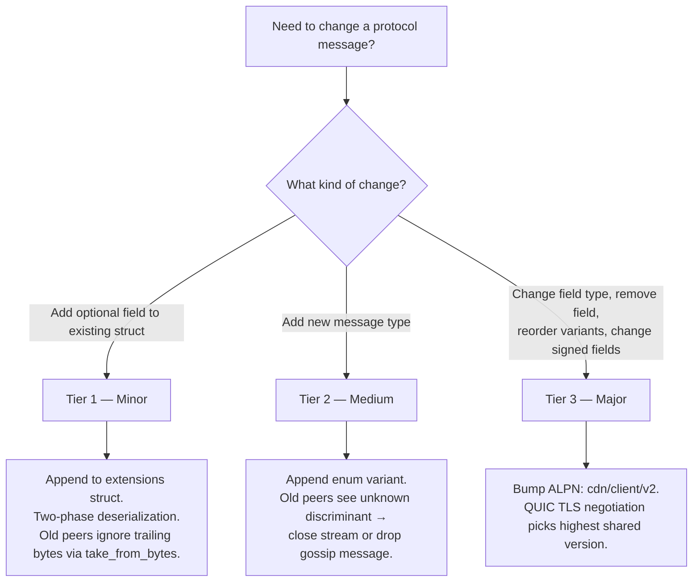
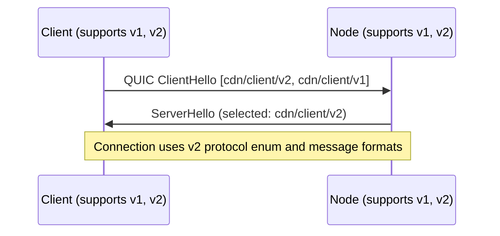
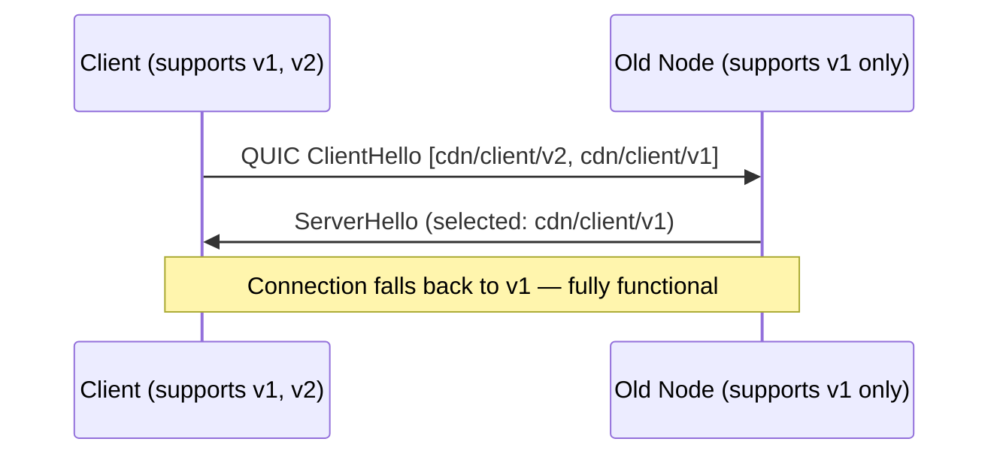

# ADR 013: Schema Evolution

**Date:** 2026-04-03
**Status:** Draft

## Context

All wire messages in the deCDN protocol are serialized with [postcard](https://docs.rs/postcard) — a compact, no-std-friendly, serde-based binary format standard in the iroh ecosystem ([ADR 005](005-protocol.md)). Postcard is positional: it encodes struct fields in declaration order with no field tags, no length delimiters around individual fields, and no built-in schema versioning. `postcard::from_bytes` silently ignores trailing bytes after deserialization (it does not return or report them), while `postcard::take_from_bytes` returns the unconsumed remainder. Neither function fails on trailing bytes — but on a QUIC byte stream with no inherent message boundaries, the receiver cannot know when one message ends and the next begins without explicit framing. [ADR 005](005-protocol.md) identified the broader limitation: "Postcard has no schema evolution story — adding fields requires a new ALPN version (`cdn/client/v2`); version negotiation must be planned before the first breaking change."

The codebase already contains two ad-hoc evolution patterns:

1. **Optional trailing fields.** `StreamRequest` appends `ethereum_address: Option<Address>` and `binding_signature: Option<Bytes>` with `#[serde(default)]` ([ADR 005](005-protocol.md)). ADR 005 called this a "one-time workaround" and stated that "any future mandatory field addition still requires `cdn/client/v2`."
2. **1-byte message type prefix.** `cdn/keys/v1` (the companion app-server protocol) differentiates three stream types with a raw byte prefix (`0x01`, `0x02`, `0x03`) ([ADR 006](006-e2e-encryption.md)). This is an ad-hoc discrimination scheme specific to one ALPN.

These patterns address real needs but are inconsistent with each other and unscalable. Meanwhile, gossip messages (`NodeAnnounce`, `ReputationReport`) have no ALPN negotiation at all — they are published to iroh-gossip topics whose names embed a version (`cdn/global/v1`), but changing a topic name partitions the gossip network.

Additionally, several protocol messages contain cryptographically signed fields ([ADR 005](005-protocol.md)). Signatures create a byte-level commitment: if a new field is appended to a signed struct, old verifiers compute the signature over fewer bytes than the signer intended, causing verification failure. Signed field sets must be explicitly frozen per protocol version.

The project is pre-implementation. Defining framing and evolution conventions now avoids the cost of retrofitting after v1 deployment — which would itself be a breaking change.

## Decision

### Wire Framing

Every message on every QUIC stream (all ALPNs) is length-prefixed:

```
┌─────────────────────┬──────────────────────────────┐
│ varint(len)         │ postcard_bytes[0..len]        │
│ (1–5 bytes, LEB128) │ (protocol enum + payload)     │
└─────────────────────┴──────────────────────────────┘
```

The varint uses postcard's native varint encoding (a continuation-bit scheme similar to LEB128). Maximum message size: `MAX_MESSAGE_SIZE = 16 MiB` (16,777,216 bytes). Messages exceeding this limit are rejected before allocation. This limit applies uniformly across all ALPNs for PoC simplicity; production deployments MAY tighten this per-ALPN (see [Open Questions](#open-questions)). **DoS note:** Since `read_frame` allocates a buffer of `len` bytes, a malicious peer could send a large length prefix to force allocation. The 16 MiB cap bounds per-stream allocation, and QUIC's `MAX_STREAMS` transport parameter ([ADR 005](005-protocol.md)) bounds concurrent streams per connection — together limiting total memory exposure per peer. Operators running memory-constrained nodes SHOULD set a lower `MAX_MESSAGE_SIZE` as a local policy; `cdn/probe/v1` messages never exceed ~200 bytes, and `cdn/client/v1` messages (excluding `ChunkData`) never exceed ~1 KiB.

The receiver reads the varint length, allocates and reads exactly that many bytes, then deserializes with `postcard::take_from_bytes` on the bounded slice. `take_from_bytes` succeeds even if the sender's struct has more fields than the receiver's definition — the unconsumed trailing bytes are returned as a remainder. This is the key mechanism for forward-compatible minor evolution.

```rust
use postcard::take_from_bytes;
use serde::de::DeserializeOwned;

const MAX_MESSAGE_SIZE: u32 = 16 * 1024 * 1024; // 16 MiB

/// Read one length-prefixed frame from a QUIC RecvStream.
/// Returns the raw frame bytes for application-layer deserialization.
async fn read_frame(stream: &mut RecvStream) -> Result<Vec<u8>> {
    let len = read_varint_u32(stream).await?;
    if len > MAX_MESSAGE_SIZE {
        return Err(Error::MessageTooLarge(len));
    }
    let mut buf = vec![0u8; len as usize];
    stream.read_exact(&mut buf).await?;
    Ok(buf)
}

/// Write one length-prefixed frame to a QUIC SendStream.
/// `payload` is pre-serialized bytes (protocol enum + optional extensions).
async fn write_frame(stream: &mut SendStream, payload: &[u8]) -> Result<()> {
    write_varint_u32(stream, payload.len() as u32).await?;
    stream.write_all(payload).await?;
    Ok(())
}
```

These are low-level framing helpers. Application-layer deserialization is handled separately — the caller deserializes the protocol enum from the frame bytes using `take_from_bytes`, then optionally deserializes extensions from the remainder (see [Tier 1 — Minor](#tier-1--minor-no-coordination) and [Wire Layout](#wire-layout) for the full deserialization flow).

**`ChunkData` exemption.** `ChunkData` payloads (1024-byte blob chunks in the delivery protocol) are already implicitly length-delimited by the QUIC stream's byte count and the voucher interval. However, they MUST still use varint-length framing for consistency — the receiver must be able to distinguish `ChunkData` from `Voucher` or `VoucherAck` messages on the same stream via the protocol enum discriminant. The 1–2 byte framing overhead on 1024-byte chunks is ~0.1%.

### Protocol Enums

Each ALPN defines a single top-level enum that wraps all message types for that protocol. The enum is serialized as the outermost postcard value inside the length-prefixed frame. Postcard encodes enum variants with a varint discriminant (1 byte for variants 0–127), providing explicit, extensible message type tags on the wire.

```rust
/// cdn/probe/v1
#[derive(Serialize, Deserialize)]
enum ProbeMessage {
    Request(ProbeRequest),    // discriminant 0
    Response(ProbeResponse),  // discriminant 1
}

/// cdn/client/v1
#[derive(Serialize, Deserialize)]
enum ClientMessage {
    StreamRequest(StreamRequest),     // 0
    StreamResponse(StreamResponse),   // 1
    ChunkData(ChunkData),             // 2
    Voucher(Voucher),                 // 3
    VoucherAck,                       // 4
    StreamEnd,                        // 5
}

/// cdn/watchtower/v1
#[derive(Serialize, Deserialize)]
enum WatchtowerMessage {
    Register(WatchtowerRegister),     // 0
    Accept(WatchtowerAccept),         // 1
    VoucherUpdate(VoucherUpdate),     // 2
    VoucherAck,                       // 3
    Revoke(WatchtowerRevoke),         // 4
    RevokeAck(WatchtowerRevokeAck),   // 5
}

/// cdn/keys/v1 — companion protocol (app server). Replaces the 1-byte type prefix from ADR 006
#[derive(Serialize, Deserialize)]
enum KeysMessage {
    EpochKeyAuth(EpochKeyAuth),               // 0
    EpochKey(EpochKey),                       // 1
    EpochKeyRevoked(EpochKeyRevoked),         // 2
    PlayRequest(PlayRequest),                 // 3
    PlayResponse(PlayResponse),               // 4
    OfflineLeaseRequest(OfflineLeaseRequest), // 5
    OfflineLeaseResponse(OfflineLeaseResponse), // 6
}
```

**Variant ordering rule.** Discriminants are assigned in declaration order (postcard default). New variants MUST be appended at the end. Reordering or removing variants is a major (breaking) change requiring an ALPN version bump.

**`KeysMessage` supersedes ADR 006's 1-byte prefix.** (This enum is part of the companion app-server protocol, not the core CDN protocol suite — see [ADR 006](006-e2e-encryption.md).) Since the project is pre-implementation, the `0x01`/`0x02`/`0x03` prefix scheme from [ADR 006](006-e2e-encryption.md) has never been deployed. `cdn/keys/v1` uses the same protocol-enum framing as all other ALPNs. The functional mapping is: `0x01` (epoch key stream) → `EpochKeyAuth`/`EpochKey`/`EpochKeyRevoked`; `0x02` (play request) → `PlayRequest`/`PlayResponse`; `0x03` (offline lease) → `OfflineLeaseRequest`/`OfflineLeaseResponse`. The finer-grained enum variants allow request and response messages to be distinguished by type rather than by stream direction.

**Unknown variant handling.** When a peer receives a message with an unknown enum discriminant:

- **QUIC stream protocols:** The receiver MUST close the individual stream with application error code `0x01` (`UNSUPPORTED_MESSAGE`). The QUIC connection and other streams are unaffected. The receiver SHOULD log the unknown discriminant at `WARN` level for operational visibility.
- **Gossip:** Unknown variants are silently dropped at the application layer (consistent with existing gossip validation rules — unknown messages are ignored). This does not create a propagation barrier: iroh-gossip's PlumTree relay operates at the transport layer and forwards raw message bytes to tree neighbors before the application deserializes the `GossipEnvelope`. Unknown variants reach all nodes in the mesh; only application-layer processing ignores them on nodes that do not understand them.

### Gossip Envelope

Gossip messages are published to iroh-gossip topics without ALPN negotiation. To enable schema evolution, all gossip payloads are wrapped in a `GossipEnvelope`:

```rust
/// Outermost wrapper for all gossip messages.
/// Serialized via postcard as the raw bytes passed to iroh-gossip.
#[derive(Serialize, Deserialize)]
struct GossipEnvelope {
    /// Envelope format version. Currently 1.
    version: u8,
    /// The actual gossip message.
    payload: GossipPayload,
}

#[derive(Serialize, Deserialize)]
enum GossipPayload {
    NodeAnnounce(NodeAnnounce),             // 0
    ReputationReport(ReputationReport),     // 1
    WatchtowerAnnounce(WatchtowerAnnounce), // 2 (planned — ADR 007)
    RateChange(RateChange),                 // 3 (ADR 005)
}
```

**Deserialization rule.** On receiving a gossip message, peers deserialize `GossipEnvelope` using `take_from_bytes`. If `version != 1` (unknown envelope version, including version 0 which is reserved/invalid), the message is silently dropped — the envelope format itself may have changed in incompatible ways. If the `GossipPayload` variant is unknown (new enum discriminant), the message is also silently dropped. This ensures old peers safely ignore messages from newer peers without crashing or corrupting state.

**Topic names vs. envelope version.** Topic names (`cdn/global/v1`, `cdn/reputation/v1`) embed a version that refers to the topic's semantic contract — its purpose, membership rules, and validation semantics. The `GossipEnvelope.version` handles wire format evolution independently. A topic name version bump (e.g., `cdn/global/v2`) is the gossip equivalent of a major ALPN bump and requires dual-subscription during transition.

**Gossip validation interaction.** Existing gossip validation rules ([ADR 001](001-network.md)) — signature verification, registry membership check, timestamp freshness, monotonic timestamp — operate on the inner `GossipPayload` after envelope unwrapping. The envelope itself is not signed; the inner message's signature covers the same fields as before.

### Three Tiers of Evolution



#### Tier 1 — Minor (no coordination)

Append optional fields to an existing struct using two-phase deserialization. This requires the length-prefixed framing defined above — the receiver knows exactly how many bytes belong to the message and can detect whether extension bytes are present.

**Postcard limitation.** Postcard is positional: `Option<T>` is serialized as `0x00` (None) or `0x01 ++ T_bytes` (Some). If an old sender serializes a struct without a new trailing `Option<T>` field, the buffer ends before the Option discriminant byte. Both `from_bytes` and `take_from_bytes` fail with `DeserializeUnexpectedEnd` — postcard has no mechanism to fill defaults for missing trailing fields. A simple `#[serde(default)]` annotation does not help because serde's `default` only applies when the *key* is absent (relevant for self-describing formats like JSON), not when the *bytes* are absent.

**Two-phase deserialization.** The solution is to split the struct into a frozen base and an extensions struct, then deserialize in two phases using the length-prefixed frame boundary:

```rust
use postcard::take_from_bytes;

/// Frozen base fields — never changes within a protocol version.
#[derive(Serialize, Deserialize)]
struct StreamRequestBase {
    hash: Hash,
    channel_id: ChannelId,
    byte_offset: u64,
    timestamp_us: u64,
}

/// Extension fields — new optional fields are appended here via Tier 1.
#[derive(Serialize, Deserialize, Default)]
struct StreamRequestExt {
    voucher_interval_mb: Option<u64>,
    ethereum_address: Option<Address>,
    binding_signature: Option<Bytes>,
}

fn deserialize_stream_request(buf: &[u8]) -> Result<(StreamRequestBase, StreamRequestExt)> {
    let (base, remainder) = take_from_bytes::<StreamRequestBase>(buf)?;
    let ext = if remainder.is_empty() {
        // Old sender — no extension bytes present. Fill defaults.
        StreamRequestExt::default()
    } else {
        // New sender — extension bytes present. Deserialize them.
        // Use take_from_bytes to tolerate further trailing bytes
        // from even-newer senders.
        take_from_bytes::<StreamRequestExt>(remainder)?.0
    };
    Ok((base, ext))
}
```

This provides bidirectional compatibility:
- **New sender → old receiver:** `take_from_bytes` on the base struct succeeds; trailing extension bytes are discarded.
- **Old sender → new receiver:** `take_from_bytes` on the base struct succeeds with no remainder; the receiver fills `StreamRequestExt::default()`.
- **Newer sender → new receiver:** `take_from_bytes` on the extensions struct succeeds; any further trailing bytes (from fields the receiver doesn't know about) are discarded.

#### Wire Layout

The two-phase pattern interacts with the protocol enum as follows. Within a single length-prefixed frame, the wire layout is:

```
┌────────────────┬─────────────────────────┬───────────────────────┐
│ varint(len)    │ postcard(enum_variant +  │ postcard(ext_fields)  │
│ (frame prefix) │   base_fields)          │ (optional, may be     │
│                │                         │  absent from old      │
│                │                         │  senders)             │
└────────────────┴─────────────────────────┴───────────────────────┘
```

The protocol enum variant wraps the **base** struct only. Extension fields trail after the enum value within the same frame. The receiver deserializes the enum with `take_from_bytes`, which returns the base message and a byte remainder. If the remainder is non-empty, it contains extension fields for that message type.

```rust
/// Application-layer deserialization for messages with extensions.
fn deserialize_client_msg(frame: &[u8]) -> Result<(ClientMessage, Option<StreamRequestExt>)> {
    let (msg, remainder) = take_from_bytes::<ClientMessage>(frame)?;
    let ext = match &msg {
        ClientMessage::StreamRequest(_) if !remainder.is_empty() => {
            Some(take_from_bytes::<StreamRequestExt>(remainder)?.0)
        }
        _ => None, // No extensions for this message type, or old sender
    };
    Ok((msg, ext))
}

/// Application-layer serialization for messages with extensions.
fn serialize_stream_request(base: &StreamRequestBase, ext: &StreamRequestExt) -> Result<Vec<u8>> {
    let msg = ClientMessage::StreamRequest(StreamRequest::from(base));
    let mut buf = postcard::to_allocvec(&msg)?;
    buf.extend_from_slice(&postcard::to_allocvec(ext)?);
    Ok(buf)
    // Caller passes `buf` to `write_frame(stream, &buf)`
}
```

Messages without extensions (e.g., `VoucherAck`, `StreamEnd`, `ChunkData`) have no trailing bytes — the remainder from `take_from_bytes` is empty. The framing helpers (`read_frame`/`write_frame`) are agnostic to extensions; the two-phase logic lives in per-message-type application code.

**Rules:**
- New extension fields MUST be `Option<T>` or types with a meaningful `Default` impl. Non-optional fields cannot be added via minor evolution.
- New extension fields MUST be appended to the end of the extensions struct. Field order within `*Ext` is frozen once released — insertions and reordering are major changes.
- New fields MUST NOT be included in any existing signature computation (see [Signed Field Freezing](#signed-field-freezing)).
- The base struct is frozen at the protocol version that introduced it. Moving fields between base and extensions is a major change.

This formalizes the pattern already used for `ethereum_address`, `binding_signature`, and `voucher_interval_mb` in `StreamRequest` ([ADR 005](005-protocol.md)). It is no longer a one-time workaround — it is the standard minor evolution mechanism. The existing `Option<T>` fields with default semantics (`ethereum_address` and `binding_signature` with `#[serde(default)]`, and `voucher_interval_mb` which defaults to 1 MB when absent) will be placed in the extensions struct from the start, since the project is pre-implementation.

> ADR 010 (multi-token, post-PoC) adds `payment_token: Option<Address>` to `StreamRequestExt`. Per the extension field rules above, it is `Option<T>` with `#[serde(default)]`. This field is omitted from the PoC wire format and will be appended as a Tier 1 minor extension when multi-token support is implemented.

**Example — adding `supported_versions` to `NodeAnnounce`:**

```rust
#[derive(Serialize, Deserialize)]
struct NodeAnnounceBody {
    node_id: NodeId,
    region: String,  // ISO 3166-1 alpha-2
    load: LoadHint,
    popular_hashes: Vec<Hash>,
    timestamp_us: u64,
}

#[derive(Serialize, Deserialize, Default)]
struct NodeAnnounceExt {
    // Added via minor evolution
    supported_versions: Option<Vec<String>>,
}

#[derive(Serialize, Deserialize)]
struct NodeAnnounce {
    body: NodeAnnounceBody,
    signature: Bytes,
    // Extensions follow — deserialized via two-phase pattern
}
```

Old peers deserialize `NodeAnnounce` without extensions — `take_from_bytes` on the body + signature succeeds with no remainder, and the receiver fills `NodeAnnounceExt::default()`. New peers that receive old `NodeAnnounce` messages see `supported_versions: None`. The signature covers only `NodeAnnounceBody`, so extensions are freely evolvable (see [Signed Field Freezing](#signed-field-freezing)).

#### Tier 2 — Medium (new message types, no ALPN bump)

Append a new variant to the protocol enum. Old peers that encounter an unknown varint discriminant handle it gracefully (stream close or gossip drop — see [Unknown variant handling](#protocol-enums)).

**Rules:**
- New variants MUST be appended at the end of the enum. Reordering or removal is a major change.
- The new message type MUST be non-critical for peers that do not understand it. If the message is required for protocol correctness, it is a major change.
- For QUIC protocols, the sender SHOULD be prepared for the receiver to close the stream with `UNSUPPORTED_MESSAGE` and fall back to behavior that does not require the new message type.

**Example — adding a `Ping`/`Pong` keepalive to the delivery protocol:**

```rust
enum ClientMessage {
    StreamRequest(StreamRequest),     // 0
    StreamResponse(StreamResponse),   // 1
    ChunkData(ChunkData),             // 2
    Voucher(Voucher),                 // 3
    VoucherAck,                       // 4
    StreamEnd,                        // 5
    // Added via medium evolution
    Ping(PingRequest),                // 6
    Pong(PongResponse),              // 7
}
```

Old peers receiving `Ping` (discriminant 6) close the stream with `UNSUPPORTED_MESSAGE`. The sender detects this and falls back to QUIC-level keepalive.

#### Tier 3 — Major (ALPN version bump)

Required for changes that cannot be handled by minor or medium evolution:
- Removing a field from a struct
- Changing a field's type (e.g., `u64` → `u128`)
- Reordering or removing enum variants
- Adding a mandatory (non-optional) field
- Modifying the set of signed fields
- Changing the framing format itself

The ALPN string is bumped: `cdn/client/v1` → `cdn/client/v2`. Version coexistence is handled by QUIC ALPN negotiation (see [ALPN Version Negotiation](#alpn-version-negotiation)).

### Signed Field Freezing

Fields covered by a cryptographic signature are frozen at the protocol version that introduced them. Adding, removing, or reordering signed fields is a Tier 3 (major) change.

**Rationale.** Signatures are computed over a specific byte sequence produced by postcard serialization. If a newer sender appends a field to the signed struct, an older verifier computes the signature over fewer bytes — verification fails. Conversely, if an older sender omits the field, a newer verifier expects more bytes — verification also fails. The signature creates a bilateral commitment to the exact field set.

| Message | Signed fields | Unsigned fields (evolvable via Tier 1) |
| --- | --- | --- |
| `ProbeResponse` | `hash`, `has_blob`, `rate_per_mb`, `timestamp_us` | `total_bytes` |
| `StreamResponse` | `hash`, `ok`, `rate_per_mb`, `total_bytes`, `channel_id`, `timestamp_us`, `redirect` | `error`, `voucher_interval_mb` |
| `NodeAnnounce` | `node_id`, `region`, `load`, `popular_hashes`, `timestamp_us` | *(none currently — see implementation note)* |
| `ReputationReport` | `provider`, `reporter`, `metrics`, `timestamp` | *(none currently)* |

**Implementation note — separating signed and unsigned fields.** For messages that are currently signed over all non-signature fields (e.g., `NodeAnnounce`), implementations SHOULD serialize signed fields into a dedicated inner struct (e.g., `NodeAnnounceBody`) and compute the signature over that struct's postcard bytes. Unsigned fields (added via minor evolution) live in the outer struct, outside the signed region:

```rust
/// Signed portion — field set is frozen per protocol version.
#[derive(Serialize, Deserialize)]
struct NodeAnnounceBody {
    node_id: NodeId,
    region: String,  // ISO 3166-1 alpha-2, e.g. "US"
    load: LoadHint,
    popular_hashes: Vec<Hash>,
    timestamp_us: u64,
}

/// Full wire message — extensions follow body + signature via two-phase deserialization.
#[derive(Serialize, Deserialize)]
struct NodeAnnounce {
    body: NodeAnnounceBody,
    signature: Bytes,
}

/// Extension fields — appended via Tier 1 minor evolution.
#[derive(Serialize, Deserialize, Default)]
struct NodeAnnounceExt {
    supported_versions: Option<Vec<String>>,
}
```

This pattern cleanly separates the frozen signed region from the evolvable unsigned region via two-phase deserialization (see [Tier 1](#tier-1--minor-no-coordination)). The same pattern applies to `ProbeResponse`, `StreamResponse`, and `ReputationReport`.

**Cross-ADR struct alignment.** The `Body` + extensions pattern and type definitions here are the canonical reference for implementation. Struct definitions in [ADR 001](001-network.md), [ADR 005](005-protocol.md), and [ADR 008](008-reputation.md) retain their existing flat-struct representations for readability; implementations MUST follow the body/extensions split defined here. The flat-struct definitions in those ADRs will be updated when implementation begins.

### ALPN Version Negotiation

QUIC ALPN negotiation is built into TLS 1.3 (RFC 7301). The client proposes a list of supported ALPNs in `ClientHello`; the server selects the highest mutually supported version.





**Convention:** Clients propose versions in descending order (newest first). The server selects the highest version it supports. If the server supports none of the proposed versions, the TLS handshake fails with `no_application_protocol` alert and the client falls back to the next candidate node from probe results.

**Multi-version support.** A node MUST support at least the current and previous major version simultaneously during a transition period (see [Deprecation Timeline](#deprecation-timeline)). Both versions run as independent protocol handlers on the same `iroh::Endpoint`. iroh's `Endpoint` supports registering multiple ALPN handlers — each version's handler runs independently with no in-process version translation.

**Gossip has no ALPN negotiation.** Gossip evolution is handled entirely by the `GossipEnvelope` version field and the `GossipPayload` enum. Topic name version bumps are the gossip equivalent of a major ALPN bump and require dual-subscription during the transition period (nodes subscribe to both old and new topic names).

### Deprecation Timeline

**PoC:** No formal deprecation period. All nodes are operator-controlled and can be updated simultaneously. Breaking changes are coordinated out-of-band.

**Production:**

| Milestone | Timeframe | Action |
| --- | --- | --- |
| New version released | T+0 | Nodes begin supporting both old and new versions |
| Adoption target | T+4 weeks | All nodes SHOULD support the new version. Clients begin preferring the new version |
| Old version removal | T+12 weeks | Old version support MAY be removed. Nodes that have not upgraded become unreachable by new clients |
| Gossip topic removal | T+12 weeks | Old gossip topic subscriptions MAY be dropped. Peers on old topics become invisible |

Deprecation schedules are announced via governance ([ADR 009](009-governance.md)). A future governance-maintained on-chain `ProtocolVersions` registry could formalize version sunset dates — deferred, not required for PoC.

### Application Error Codes

QUIC application error codes used by this ADR:

| Code | Name | Meaning |
| --- | --- | --- |
| `0x01` | `UNSUPPORTED_MESSAGE` | Received an unknown protocol enum variant. Stream closed; connection unaffected |
| `0x02` | `MESSAGE_TOO_LARGE` | Received a length prefix exceeding `MAX_MESSAGE_SIZE`. Stream closed |
| `0x03` | `MALFORMED_MESSAGE` | Frame passed length validation but payload failed deserialization. Stream closed |

These codes are scoped to individual QUIC streams (sent via `RESET_STREAM` or `STOP_SENDING`), not connections. Additional application error codes defined by other ADRs are unaffected.

## Open Questions

1. **Gossip topic migration.** When a gossip topic requires a major version bump (e.g., `cdn/global/v2`), should nodes subscribe to both old and new topics during transition, or is the `GossipEnvelope` version field sufficient for all foreseeable gossip evolution? Recommendation: envelope-only for payload changes; topic bump reserved for changes to topic membership rules or validation semantics.
2. **Signed field evolution via extension fields.** Could a future "signature v2" scheme allow appending unsigned extension fields to signed messages — signing a hash of the canonical fields and placing extensions outside the signed region? This would enable minor evolution of currently-frozen messages without an ALPN bump. Deferred — not needed for v1, and the `Body` + unsigned outer fields pattern (see [Signed Field Freezing](#signed-field-freezing)) is sufficient for now.
3. **Per-ALPN `MAX_MESSAGE_SIZE`.** Should different ALPNs have different maximum message sizes? `cdn/probe/v1` messages are small (<200 bytes) while future `cdn/client/v1` extensions could be larger. A per-ALPN limit would tighten bounds. Recommendation: single global limit for simplicity in v1; per-ALPN limits can be introduced as a configuration change (no wire format impact).

## ADRs Affected

- **[ADR 005](005-protocol.md):** Serialization section updated to reference this ADR. Schema evolution negative consequence resolved. The `voucher_interval_mb` "one-time workaround" language replaced with reference to the standard minor evolution mechanism.
- **[ADR 006](006-e2e-encryption.md):** The 1-byte message type prefix for `cdn/keys/v1` is superseded by the `KeysMessage` protocol enum defined here. `cdn/keys/v1` is a companion protocol operated by the app server, not a core CDN protocol — this ADR standardizes its framing for consistency but does not change its architectural role.
- **[ADR 001](001-network.md):** Gossip validation now operates on payloads unwrapped from `GossipEnvelope`.
- **[architecture.md](architecture.md):** New ADR 013 entry added to the Architectural Decisions section.

## Consequences

**Positive:**

- Formalizes the optional-trailing-fields pattern from [ADR 005](005-protocol.md) as a standard, repeatable mechanism — no longer a one-time workaround
- Length-prefixed framing enables forward-compatible deserialization: receivers can skip unknown trailing bytes without connection failure
- Protocol enums give explicit, type-safe message discrimination on every ALPN, replacing [ADR 006](006-e2e-encryption.md)'s ad-hoc 1-byte prefix with a uniform pattern
- The three-tier model provides a clear decision framework for every future protocol change, reducing design ambiguity
- Gossip envelope provides schema evolution for messages that lack ALPN negotiation, filling the gap identified in [ADR 005](005-protocol.md)
- ALPN negotiation is already supported by QUIC/TLS 1.3 and iroh — no custom handshake protocol is needed for major version transitions
- Signed field freezing makes implicit constraints explicit, preventing accidental signature-breaking changes
- The signed body / unsigned outer fields pattern enables minor evolution of messages that currently sign all fields, without requiring an ALPN bump
- All conventions are defined before v1 implementation — there is no migration cost

**Negative:**

- Varint length prefix adds 1–5 bytes of overhead per message. For `ChunkData` (1024-byte payload), this is ~0.2% overhead including the enum discriminant. For `ProbeRequest` (~40 bytes), this is ~5%. Both are negligible
- `take_from_bytes` is marginally slower than `from_bytes` due to tracking the consumed position. The difference is negligible for the message sizes in this protocol (sub-microsecond)
- Minor evolution (appending optional fields) can accumulate "dead weight" — fields that were added but are no longer useful. There is no mechanism to remove them without a major version bump. In practice, this is unlikely to be a problem for the message sizes in this protocol
- Signed field freezing means even minor improvements to signed structs (e.g., adding a useful field to `ProbeResponse`'s signed set) require a full ALPN version bump. This is conservative by design — the unsigned outer fields pattern mitigates this for fields that do not need to be signed
- The `GossipEnvelope` wrapper adds 2–3 bytes (version byte + enum discriminant) to every gossip message. For `NodeAnnounce` (~800 bytes), this is <0.4% overhead
- Multi-version support during deprecation requires nodes to maintain two protocol handler codepaths simultaneously, increasing code complexity during transitions. The 12-week deprecation window bounds this cost
- Refactoring signed messages to use the `Body` + outer fields pattern changes the struct layout relative to what ADR 005 currently defines. Since this is pre-implementation, this is a design change, not a migration — but it must be reflected in the `protocol` crate's type definitions from day one
