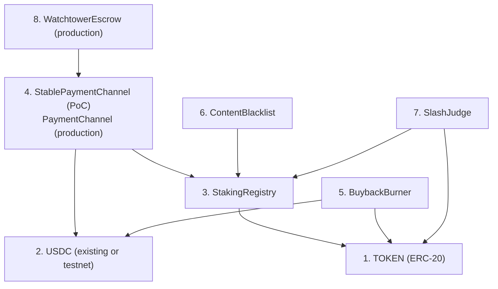
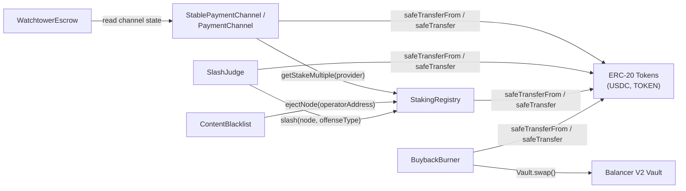
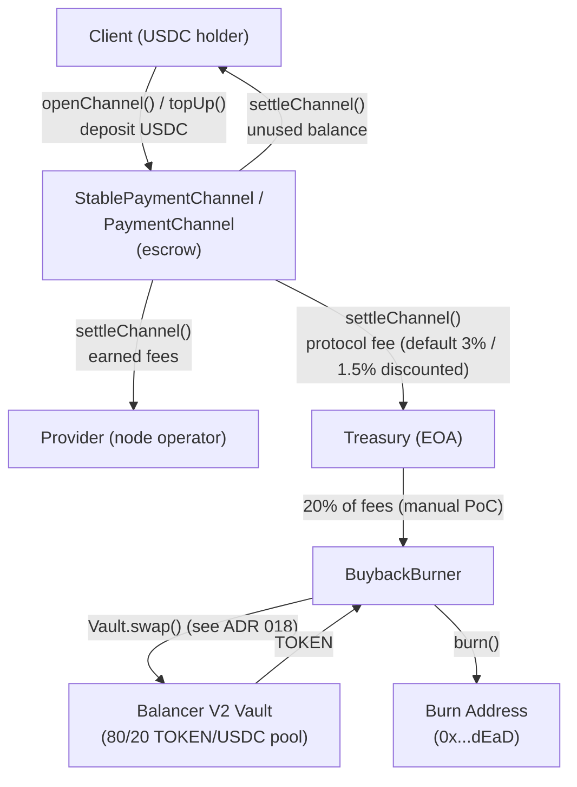
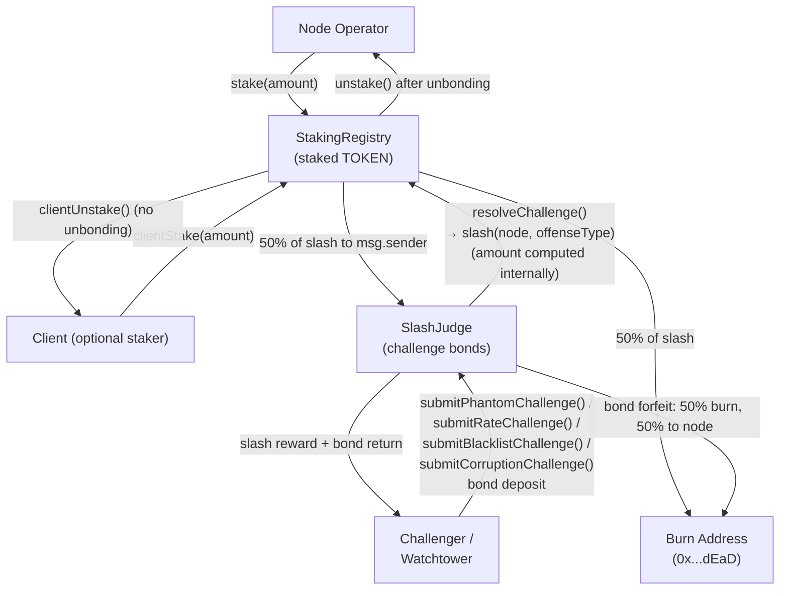

# ADR 016: Smart Contract Interaction Model

**Date:** 2026-04-04
**Status:** Draft

## Context

The deCDN deploys multiple interacting smart contracts with cross-contract calls, role-based access control, and funds custody. Individual contracts are specified across [ADR 003](003-payments.md), [ADR 004](004-tokenomics.md), [ADR 007](007-watchtower.md), [ADR 009](009-governance.md), [ADR 010](010-multi-token.md), [ADR 011](011-content-takedown.md), and [ADR 014](014-on-chain-verification.md). However, no single document maps the full interaction surface: who calls whom, which contracts hold funds, who is authorized to do what, and where reentrancy risks exist.

This ADR consolidates that analysis into a single reference for security audits and implementation. It does not introduce new functionality — it systematizes what other ADRs already specify.

## Decision

### 1. Contract Inventory

All on-chain contracts inherit from [OpenZeppelin Contracts](https://docs.openzeppelin.com/contracts/) to minimize custom security-critical code.

| Contract | ADR | Holds Funds | Token Types | OZ Base Contracts | Phase |
| --- | --- | --- | --- | --- | --- |
| TOKEN (ERC-20) | [004](004-tokenomics.md) | No (fungible token) | — | `ERC20`, `ERC20Permit` (recommended; enables gasless approvals) | PoC + Production |
| StakingRegistry | [003](003-payments.md), [004](004-tokenomics.md) | Yes | TOKEN | `AccessControl`, `ReentrancyGuard`, `Pausable` | PoC + Production |
| StablePaymentChannel | [003](003-payments.md) | Yes | USDC | `Ownable`, `ReentrancyGuard`, `Pausable`, `EIP712` | PoC only |
| PaymentChannel | [010](010-multi-token.md) | Yes | Governance-approved ERC-20s | `AccessControl`, `ReentrancyGuard`, `Pausable`, `EIP712` | Production only |
| BuybackBurner | [004](004-tokenomics.md) | Yes | USDC, TOKEN (transient) | `AccessControl`, `ReentrancyGuard`, `Pausable` | PoC (accumulate-only) + Production |
| ContentBlacklist | [011](011-content-takedown.md) | No | — | `AccessControl`, `ReentrancyGuard` | PoC + Production |
| SlashJudge | [014](014-on-chain-verification.md) | Yes | TOKEN (challenge bonds) | `AccessControl`, `ReentrancyGuard`, `Pausable`, `EIP712` | PoC + Production |
| WatchtowerEscrow | [007](007-watchtower.md) | Yes | USDC | `ReentrancyGuard`, `Pausable`, `EIP712` | Production only |

**No proxy deployment patterns.** No deCDN contract uses proxy (upgradeable) deployment patterns. Production contract upgrades deploy new contracts at new addresses with state migration as described in Section 6. This constraint ensures that EIP-712 domain separators computed in constructors (as `immutable`) remain valid for the contract's lifetime — a proxy migration to a different address or chain would invalidate all existing voucher signatures.

**Build toolchain:** [Foundry](https://book.getfoundry.sh/) (forge, cast, anvil) for compilation, testing, and deployment.

### 2. Deployment Order and Initialization Dependencies

Contracts must be deployed in dependency order — each contract's constructor requires the addresses of contracts deployed before it.



#### Constructor Dependencies

| Step | Contract | Constructor Requires |
| --- | --- | --- |
| 1 | TOKEN | None. **PoC:** freely mintable testnet token with `onlyOwner` mint ([ADR 004](004-tokenomics.md)). **Production:** fixed 1B supply, no mint function. |
| 2 | USDC | External (testnet faucet or mainnet address) |
| 3 | StakingRegistry | TOKEN address, `minStake` (1,000 TOKEN), `unbondingPeriod` (7 days PoC) |
| 4a | StablePaymentChannel (PoC) | Constructor args: USDC address, `treasuryAddress`, `disputeWindow` (48h). Initialized in constructor body: StakingRegistry address, `feePercentage` (300 bps), `discountedFeePercentage` (150 bps), `maxChannelDuration` (90 days), rate bounds ([ADR 003](003-payments.md)) |
| 4b | PaymentChannel (production) | StakingRegistry address, Governor address |
| 5 | BuybackBurner | TOKEN address, USDC address, Balancer V2 Vault address, `bytes32` pool id (see [ADR 018](018-liquidity-strategy.md)) |
| 6 | ContentBlacklist | `ContentBlacklist(address stakingRegistry)`. StakingRegistry address is required for `ejectNode()` cross-contract call. [ADR 011](011-content-takedown.md) describes the call but not the constructor interface; this ADR formalizes it. |
| 7 | SlashJudge | StakingRegistry address, TOKEN address, `challengeBond` (100 TOKEN PoC / 50 TOKEN production), `counterEvidenceWindow` (24h) |
| 8 | WatchtowerEscrow | StablePaymentChannel/PaymentChannel address, `heartbeatInterval`, `missThreshold`, `feeRateBps`, `minFee`, `monitoringPeriod` |

#### Post-Deployment Initialization

After all contracts are deployed, the deployer must execute these transactions before the system accepts user traffic:

1. **Grant `BLACKLIST_ROLE`** on StakingRegistry to ContentBlacklist:
   ```solidity
   stakingRegistry.grantRole(BLACKLIST_ROLE, address(contentBlacklist));
   ```

2. **Grant `SLASH_ROLE`** on StakingRegistry to SlashJudge:
   ```solidity
   stakingRegistry.grantRole(SLASH_ROLE, address(slashJudge));
   ```

3. **Add initial token to PaymentChannel** (production only):
   ```solidity
   paymentChannel.addToken(USDC_ADDRESS, rateFloor, rateCeiling);
   ```

4. **Register regional governance bodies** (production, if applicable):
   ```solidity
   contentBlacklist.registerRegionalBody(regionCode, bodyAddress);
   ```

5. **Transfer admin roles** to Governor + timelock (production):
   ```solidity
   // For each contract with AccessControl:
   contract.grantRole(DEFAULT_ADMIN_ROLE, address(timelockController));
   contract.revokeRole(DEFAULT_ADMIN_ROLE, deployer);
   ```

> **Production hardening:** Production deployments SHOULD execute `grantRole(DEFAULT_ADMIN_ROLE, timelockController)` and `revokeRole(DEFAULT_ADMIN_ROLE, deployer)` in a single multicall transaction to minimize the dual-admin window between the two operations.

> **Deployment atomicity.** The post-deployment initialization steps (1–5) SHOULD be executed atomically via a multicall contract or a deployment script that reverts on any failure. A partially initialized system (e.g., `SLASH_ROLE` granted but `BLACKLIST_ROLE` not yet) could create a window where some security mechanisms work but others do not. Between deployment and initialization completion, `StakingRegistry` SHOULD reject `registerNode` calls (e.g., via a `paused` initial state or a deployment flag) to prevent nodes from registering before the security infrastructure is fully wired. For the PoC, a Foundry deployment script with sequential `vm.broadcast()` calls provides sufficient atomicity.

### 3. Cross-Contract Call Graph



#### Complete Call Table

| Caller | Callee | Function | Authorization | Mutates Callee State |
| --- | --- | --- | --- | --- |
| StablePaymentChannel | StakingRegistry | `getStakeMultiple(provider)` | Public (read-only) | No |
| StablePaymentChannel | IERC20 (USDC) | `safeTransferFrom()` | Caller must have allowance | Yes |
| StablePaymentChannel | IERC20 (USDC) | `safeTransfer()` | Caller holds balance | Yes |
| PaymentChannel | StakingRegistry | `getStakeMultiple(provider)` | Public (read-only) | No |
| PaymentChannel | IERC20 (per-token) | `safeTransferFrom()` / `safeTransfer()` | Caller must have allowance/balance | Yes |
| ContentBlacklist | StakingRegistry | `ejectNode(operatorAddress)` | `BLACKLIST_ROLE` | Yes |
| SlashJudge | StakingRegistry | `slash(node, offenseType)` | `SLASH_ROLE` | Yes |
| SlashJudge | IERC20 (TOKEN) | `safeTransferFrom()` / `safeTransfer()` | Caller must have allowance/balance | Yes |
| StakingRegistry | IERC20 (TOKEN) | `safeTransferFrom()` / `safeTransfer()` | Caller must have allowance/balance | Yes |
| BuybackBurner | Balancer V2 Vault | `swap(SingleSwap, FundManagement, limit, deadline)` | USDC must be approved to the Vault (not to the pool) | Yes |
| BuybackBurner | IERC20 (USDC, TOKEN) | `safeTransferFrom()` / `safeTransfer()` | Caller must have allowance/balance | Yes |
| WatchtowerEscrow | StablePaymentChannel / PaymentChannel | Channel state reads | Public (read-only) | No |

**Note:** No contract calls governance functions on another deCDN contract. Cross-contract state mutations are limited to `ejectNode()` and `slash()`, both protected by dedicated roles.

### 4. Fund Flow Diagrams

#### USDC Flow (Payments)



**Fee allocation** from protocol fees ([ADR 004](004-tokenomics.md)):

| Allocation | Share | Recipient |
| --- | --- | --- |
| Development fund | 40% | Treasury |
| Bug bounties & audits | 20% | Treasury |
| Ecosystem grants | 20% | Treasury |
| Token buyback & burn | 20% | BuybackBurner |

In PoC, sub-allocation is manual (admin key). In production, treasury disbursement requires a governance proposal ([ADR 009](009-governance.md)).

#### TOKEN Flow (Staking & Slashing)



#### Contracts Holding Funds Summary

| Contract | Token | Source | Release Condition |
| --- | --- | --- | --- |
| StablePaymentChannel / PaymentChannel | USDC (PoC) / approved ERC-20s (production) | Client deposits | `settleChannel()`, `reclaimExpired()`, `forceCloseChannel()` |
| StakingRegistry | TOKEN | Node operator stakes, client priority stakes | `unstake()` after unbonding (operators), `clientUnstake()` anytime (clients) |
| SlashJudge | TOKEN | Challenger bond deposits | `resolveChallenge()` (slash reward + bond return to challenger) or bond forfeiture |
| BuybackBurner | USDC (accumulated), TOKEN (transient) | Treasury transfers | `executeBuyback()` (production; accumulate-only in PoC) |
| WatchtowerEscrow | USDC | Prepaid watchtower fees | Heartbeat-based payouts, reclaim on liveness failure |

### 5. Access Control Matrix

All role-based access uses OpenZeppelin `AccessControl`. The `DEFAULT_ADMIN_ROLE` holder can grant and revoke all other roles. Named roles below (`KEEPER_ROLE`, `GOVERNANCE_ROLE`, `EMERGENCY_ROLE`) formalize the implicit access patterns described across source ADRs into concrete `AccessControl` role identifiers for implementation.

#### Role Assignments

| Role | Contract | Authorized Functions | PoC Holder | Production Holder |
| --- | --- | --- | --- | --- |
| `DEFAULT_ADMIN_ROLE` | All contracts | Grant/revoke roles, set parameters | Deployer EOA | `TimelockController` (2-day delay) |
| `BLACKLIST_ROLE` | StakingRegistry | `ejectNode()` | ContentBlacklist contract | ContentBlacklist contract |
| `SLASH_ROLE` | StakingRegistry | `slash()` | SlashJudge contract | SlashJudge contract |
| `KEEPER_ROLE` | BuybackBurner | `executeBuyback()` | Admin / disabled | Keeper bot or governance |
| `GOVERNANCE_ROLE` | ContentBlacklist | `addHash()`, `removeHash()`, `addOrigin()`, `removeOrigin()`, `registerRegionalBody()` | Admin | Governor via timelock |
| `EMERGENCY_ROLE` | ContentBlacklist (emergency functions), fund-holding contracts (`pause()`) | `emergencyAdd()`, `emergencyAddOrigin()`, `suspendRegionalBody()` (ContentBlacklist); `pause()` (Pausable contracts only) | Admin | 3-of-5 multisig (12-month sunset) |
| Regional body | ContentBlacklist | `addHashRegional(region)` | Not used in PoC | Per-jurisdiction multisig |

#### Governance-Controlled Parameters

Full parameter table with safety bounds is in [ADR 009](009-governance.md#governable-parameters-with-safety-bounds). Key bounds:

| Parameter | Min | Max | Contract |
| --- | --- | --- | --- |
| Protocol fee | 0 bps | 2000 bps (20%) | StablePaymentChannel / PaymentChannel |
| Slash % per offense | 5% | 50% | StakingRegistry |
| Dispute window | 12h | 72h | StablePaymentChannel / PaymentChannel |
| Minimum stake | 100 TOKEN | 100,000 TOKEN | StakingRegistry |
| Challenge bond | 1 TOKEN | 1,000 TOKEN | SlashJudge (note: [ADR 009](009-governance.md) lists this under StakingRegistry; SlashJudge is correct per [ADR 014](014-on-chain-verification.md)) |
| Unbonding period | 3 days | 30 days | StakingRegistry |

Safety bounds are `immutable` — hardcoded in constructors, not overridable by governance or admin.

#### Emergency Multisig (Production)

- 3-of-5 threshold multisig
- Can pause fund-holding contracts (`Pausable.pause()`)
- Can add emergency blacklist entries (hashes and origins)
- Can suspend regional governance bodies
- **Cannot** withdraw treasury funds, modify fee parameters, or grant roles
- **12-month sunset:** All emergency functions revert after `block.timestamp > deployTimestamp + 365 days` ([ADR 009](009-governance.md#emergency-multisig))
- Emergency blacklist entries expire after 14 days unless ratified by governance

### 6. Reentrancy Analysis

Every state-mutating function that makes an external call is listed below with its guards and call pattern.

#### StablePaymentChannel / PaymentChannel

| Function | External Calls | Guards |
| --- | --- | --- |
| `openChannel()` | `IERC20.safeTransferFrom()`, `StakingRegistry.getStakeMultiple()` (read) | `nonReentrant`, checks-effects-interactions |
| `topUp()` | `IERC20.safeTransferFrom()` | `nonReentrant`, checks-effects-interactions |
| `settleChannel()` | `IERC20.safeTransfer()` × 3 (provider, treasury, client) | `nonReentrant`, checks-effects-interactions |
| `reclaimExpired()` | `IERC20.safeTransfer()` | `nonReentrant`, checks-effects-interactions |
| `forceCloseChannel()` | None (state change only) | N/A |

#### StakingRegistry

| Function | External Calls | Guards |
| --- | --- | --- |
| `stake()` | `IERC20.safeTransferFrom()` (TOKEN) | `nonReentrant`, checks-effects-interactions |
| `unstake()` | `IERC20.safeTransfer()` (TOKEN) | `nonReentrant`, checks-effects-interactions |
| `clientStake()` | `IERC20.safeTransferFrom()` (TOKEN) | `nonReentrant`, checks-effects-interactions |
| `clientUnstake()` | `IERC20.safeTransfer()` (TOKEN) | `nonReentrant`, checks-effects-interactions |
| `slash()` | `IERC20.safeTransfer()` (TOKEN, 50% to `msg.sender` i.e. SlashJudge), burn (50%) | `nonReentrant`, checks-effects-interactions, `SLASH_ROLE` |
| `ejectNode()` | None (state change only) | `BLACKLIST_ROLE` |
| `getStakeMultiple()` | None (read-only) | N/A |

#### SlashJudge

| Function | External Calls | Guards |
| --- | --- | --- |
| `submitPhantomChallenge()` | `IERC20.safeTransferFrom()` (TOKEN bond deposit) | `nonReentrant`, checks-effects-interactions |
| `submitRateChallenge()` | `IERC20.safeTransferFrom()` (TOKEN bond deposit) | `nonReentrant`, checks-effects-interactions |
| `submitBlacklistChallenge()` | `IERC20.safeTransferFrom()` (TOKEN bond deposit), `ContentBlacklist.getEntry()` (read) | `nonReentrant`, checks-effects-interactions |
| `submitCorruptionChallenge()` | `IERC20.safeTransferFrom()` (TOKEN bond deposit) | `nonReentrant`, checks-effects-interactions |
| `counterChallenge()` | `IERC20.safeTransfer()` (bond forfeit: 50% burn, 50% to node) | `nonReentrant`, checks-effects-interactions |
| `resolveChallenge()` | `StakingRegistry.slash()`, `IERC20.safeTransfer()` (slash reward + bond return to challenger) | `nonReentrant`, checks-effects-interactions |

#### BuybackBurner

| Function | External Calls | Guards |
| --- | --- | --- |
| `executeBuyback()` | `BalancerV2Vault.swap()` (swaps contract-held USDC), `IERC20.safeTransfer()` (TOKEN to burn) | `nonReentrant`, checks-effects-interactions, `KEEPER_ROLE` |

> **MEV protection (production).** See [ADR 018 — Buyback execution via Balancer](018-liquidity-strategy.md#buyback-execution-via-balancer) for the authoritative policy. In summary: Balancer's weighted-pool curve reduces (but does not eliminate) price-impact concerns compared to concentrated liquidity, and `executeBuyback` MAY split large buybacks into `subSwapCount` sub-swaps spaced by `subSwapMinBlockGap` blocks. The recommended production path is to route buybacks through CoW Swap, which provides native batch-auction MEV protection and routes through the Balancer pool when it is best-execution. The `maxBuybackAmount` parameter MUST be enforced to limit per-transaction MEV exposure regardless of venue.

#### WatchtowerEscrow

| Function | External Calls | Guards |
| --- | --- | --- |
| `depositFee()` | `IERC20.safeTransferFrom()` (USDC fee deposit) | `nonReentrant`, checks-effects-interactions |
| `submitHeartbeat()` | None (state change only) | N/A |
| `claimFees()` | `IERC20.safeTransfer()` (USDC to watchtower) | `nonReentrant`, checks-effects-interactions |
| `reclaimOnLivenessFailure()` | `IERC20.safeTransfer()` (USDC to watched party) | `nonReentrant`, checks-effects-interactions |
| Channel state reads | `StablePaymentChannel`/`PaymentChannel.getChannel()` (read-only) | N/A |

#### Multi-Token Reentrancy Considerations

Production `PaymentChannel` accepts arbitrary governance-approved ERC-20s ([ADR 010](010-multi-token.md)). Even with `SafeERC20` and `nonReentrant`, governance must vet tokens before allowlisting:

- **Reject:** Fee-on-transfer tokens, rebase tokens, pausable tokens, tokens with transfer hooks (ERC-777) that could re-enter
- **Accept:** Standard IERC20 tokens with no callback mechanisms
- **Mitigations in contract code:** `nonReentrant` blocks all re-entry regardless of token behavior; `SafeERC20` handles non-reverting transfers and missing return values

All ERC-20 interactions use OpenZeppelin `SafeERC20` to handle non-standard token implementations ([ADR 003](003-payments.md), [ADR 010](010-multi-token.md)).

### 7. OpenZeppelin Framework Usage

Every deCDN contract should inherit from audited OpenZeppelin base contracts rather than implementing security primitives from scratch.

| OZ Contract | Used By | Purpose |
| --- | --- | --- |
| `Ownable` | StablePaymentChannel (PoC) | Admin-key governance for PoC-only contract |
| `AccessControl` | StakingRegistry, PaymentChannel, ContentBlacklist, SlashJudge, BuybackBurner | Role-based function authorization |
| `ReentrancyGuard` | All fund-holding contracts | `nonReentrant` modifier on state-mutating functions with external calls |
| `Pausable` | All fund-holding contracts | Emergency pause capability |
| `SafeERC20` | All contracts interacting with ERC-20 tokens | Safe wrappers for `transfer`, `transferFrom`, `approve` |
| `EIP712` | StablePaymentChannel, PaymentChannel, SlashJudge, WatchtowerEscrow | Domain separator for voucher/slash/heartbeat signature verification |
| `ERC20` + `ERC20Permit` | TOKEN | Standard fungible token with gasless approvals |
| `Governor` | Production governance | Token-weighted voting |
| `GovernorVotes` | Production governance | TOKEN as voting token |
| `GovernorTimelockControl` | Production governance | 2-day timelock on parameter changes |
| `TimelockController` | Production governance | Queued execution of governance proposals |

**Rationale:** OpenZeppelin Contracts are the most widely audited Solidity library, used by the majority of production DeFi protocols. Using audited primitives for access control, reentrancy protection, token handling, and governance eliminates entire classes of implementation bugs and reduces the surface area that a security audit must cover to deCDN-specific business logic.

### 8. PoC vs Production Contract Topology

| Aspect | PoC | Production |
| --- | --- | --- |
| Payment contract | `StablePaymentChannel` (USDC only) | `PaymentChannel` (multi-token allowlist) |
| Governance | Admin key (single EOA) | OpenZeppelin Governor + 2-day timelock |
| Emergency multisig | Admin key | 3-of-5 multisig with 12-month sunset |
| BuybackBurner | Accumulate-only (execution disabled) | Active (keeper or governance triggered) |
| WatchtowerEscrow | Not deployed | Deployed |
| TOKEN minting | `onlyOwner` mint for testnet flexibility | No mint function; fixed 1B supply |
| Regional bodies | Not used | Jurisdiction-scoped multisigs |
| Contract migration | N/A | New `PaymentChannel` deployed; PoC `StablePaymentChannel` decommissioned |

**Migration path:** Production deploys a new `PaymentChannel` contract (not an upgrade of `StablePaymentChannel`). Per [ADR 010](010-multi-token.md), no phased migration is required because the PoC `StablePaymentChannel` has no real users or funds in production; the PoC contract is decommissioned rather than operated in a close-only mode alongside `PaymentChannel`.

## Consequences

**Positive:**
- Single reference document for all contract interactions, reducing audit scope ambiguity
- Explicit deployment order prevents initialization-order bugs
- Access control matrix makes privilege escalation paths visible and auditable
- OZ base contract prescriptions eliminate classes of implementation bugs before code is written

**Negative:**
- Must be kept in sync as other ADRs evolve — any change to contract interfaces in ADRs 003, 004, 007, 009, 010, 011, or 014 requires updating this document
- Does not cover off-chain interaction patterns (voucher exchange, gossip, probing) — those remain in their respective ADRs

## References

- [ADR 003 — Payment Model](003-payments.md): StablePaymentChannel specification
- [ADR 004 — Dual-Currency Token Model](004-tokenomics.md): StakingRegistry, BuybackBurner, slashing schedule
- [ADR 007 — Watchtower Design](007-watchtower.md): WatchtowerEscrow
- [ADR 009 — Governance Model](009-governance.md): Safety bounds, Governor, emergency multisig
- [ADR 010 — Multi-Token Payment Support](010-multi-token.md): PaymentChannel, token allowlist
- [ADR 011 — Content Takedown](011-content-takedown.md): ContentBlacklist, origin ejection
- [ADR 014 — On-Chain Verification](014-on-chain-verification.md): SlashJudge, challenge bonds
- [OpenZeppelin Contracts](https://docs.openzeppelin.com/contracts/): Base contract framework
