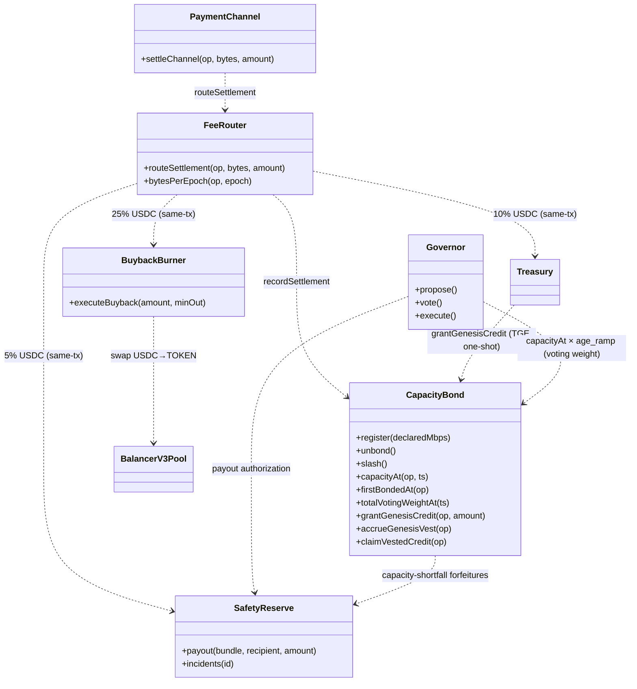
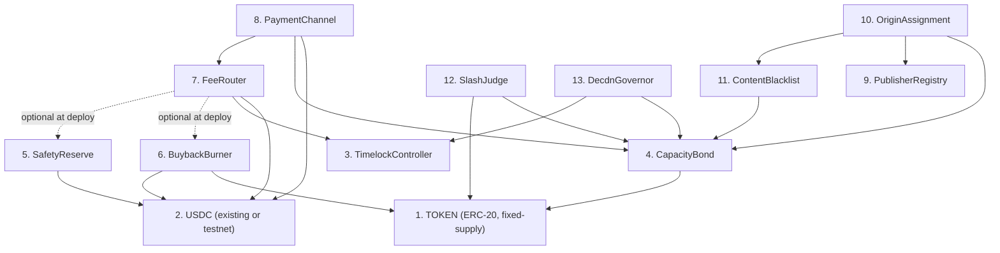
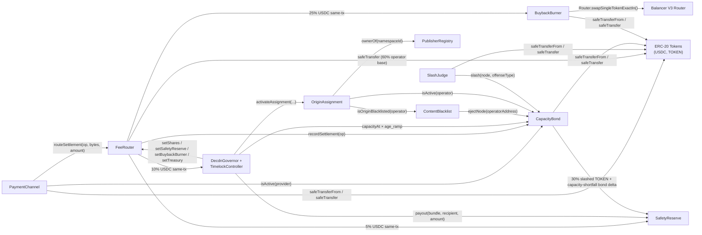
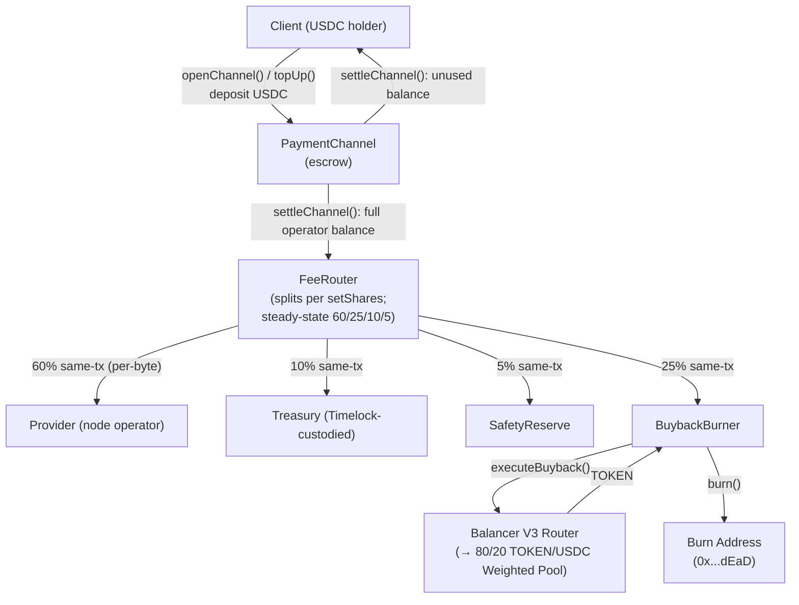
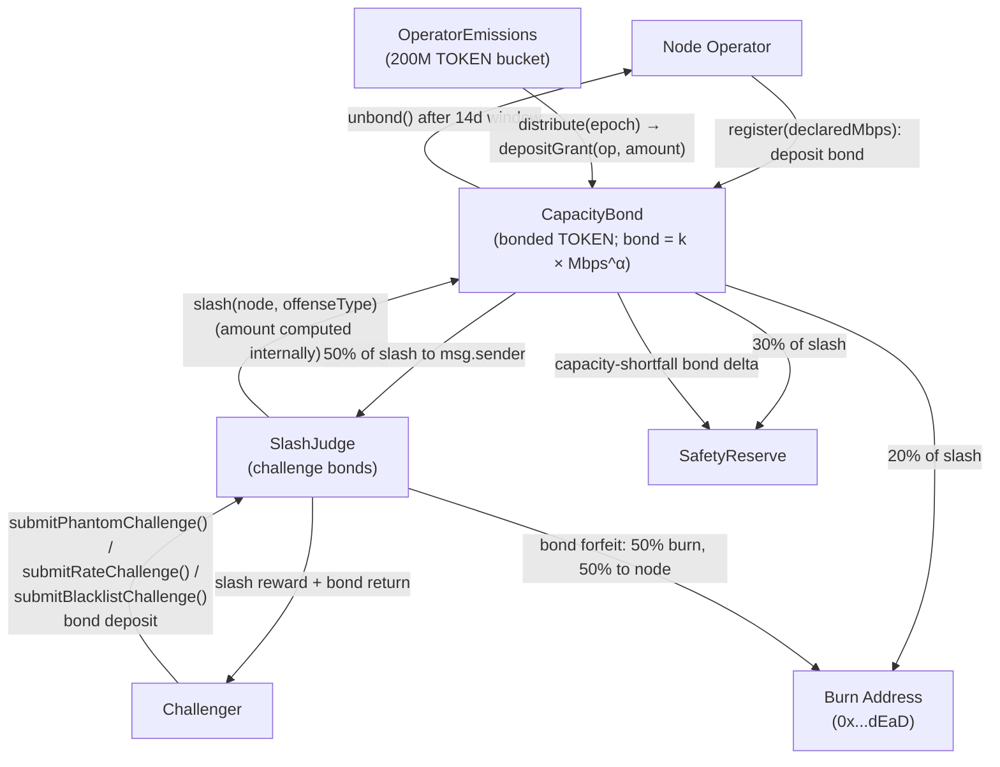

# ADR 016: Smart Contract Interaction Model

**Date:** 2026-05-25 (substantial rewrite under [spec v2.1 — work-token redesign](../docs/superpowers/specs/2026-05-24-work-token-tokenomics-redesign-v2.1.md))
**Status:** Draft

## Context

The deCDN deploys multiple interacting smart contracts with cross-contract calls, role-based access control, and funds custody. Individual contracts are specified across [ADR 003](003-payments.md#adr-003-payment-model), [ADR 009](009-governance.md#adr-009-governance-model), [ADR 011](011-content-takedown.md#adr-011-content-takedown-and-hash-blacklisting), [ADR 014](014-on-chain-verification.md#adr-014-on-chain-verification-for-slashing-evidence), and [ADR 026](026-tokenomics.md#adr-026-tokenomics). However, no single document maps the full interaction surface: who calls whom, which contracts hold funds, who is authorized to do what, and where reentrancy risks exist.

This ADR consolidates that analysis into a single reference for security audits and implementation. It does not introduce new functionality — it systematizes what other ADRs already specify.

> **[ADR 026](026-tokenomics.md#adr-026-tokenomics) driver.** The contract surface in this ADR follows the v2.2 no-emission rewrite of [ADR 026](026-tokenomics.md#adr-026-tokenomics). `FeeRouter` ships as a four-bucket settlement distributor; `CapacityBond` (renamed from the prior `StakingRegistry`, with the capacity-curve lock-to-capacity logic added, plus a `PendingCredit` extension that holds and vests Genesis Bond Credits) is the operator-registry contract; `SafetyReserve` and `BuybackBurner` are wired with adjusted flows. The retired `VotingEscrow`, `DelegatorBuyer`, and `OperatorEmissions` contracts are not part of the v2.2 surface (`OperatorEmissions` was v2.1-only and is deleted under v2.2). Read [ADR 026](026-tokenomics.md#adr-026-tokenomics) first for the economic model; this ADR is the integration view.

## Decision

### Contract Inventory

All on-chain contracts inherit from [OpenZeppelin Contracts](https://docs.openzeppelin.com/contracts/) to minimize custom security-critical code. The full surface ships in a single audit pass; per-bucket economics are governance-tunable from day one (see [§ Tunable Economics](#tunable-economics) below) so the network can launch with a simplified split and dial up burn / treasury / safety as the dependent infrastructure stabilizes.

| Contract | ADR | Holds Funds | Token Types | OZ Base Contracts |
| --- | --- | --- | --- | --- |
| TOKEN (ERC-20) | [026](026-tokenomics.md#adr-026-tokenomics) | No (fungible token) | — | `ERC20`, `ERC20Burnable`, `ERC20Permit` (fixed-supply per [ADR 026 § Supply and distribution](026-tokenomics.md#supply-and-distribution); no post-genesis mint function; `ERC20Burnable` is the sink for the 20% burn leg of the slashing path per [ADR 026 § Slashing and burn](026-tokenomics.md#slashing-and-burn); `ERC20Votes` is intentionally omitted because Governor vote weight is sourced from `CapacityBond.capacityAt × age_ramp` per [ADR 026 § Governance](026-tokenomics.md#governance), so the per-transfer checkpoint cost is not earned) |
| CapacityBond | [003](003-payments.md#adr-003-payment-model), [026](026-tokenomics.md#adr-026-tokenomics) | Yes | TOKEN | `AccessControl`, `ReentrancyGuard`, `Pausable`, `EIP712` (operator-registry contract; renamed from the prior `StakingRegistry` under v2.1. Adds the lock-to-capacity curve `bond = k × Mbps^α` per [ADR 026 § Capacity-bond curve](026-tokenomics.md#capacity-bond-curve), capacity-shortfall auto-downgrade slashing per [ADR 026 § Capacity-shortfall slashing](026-tokenomics.md#capacity-shortfall-slashing), `isActive(operator)` per [ADR 003](003-payments.md#adr-003-payment-model) `ICapacityBond`, `capacityAt(operator)` and `firstBondedAt(operator)` for the `age_ramp` source on `DecdnGovernor`, and `bindNodeId` / `reclaimNodeId` for the NodeId↔Ethereum-address binding from PR #668; under v2.2 also holds and vests PendingCredit positions for Genesis Bond Credits per [ADR 026 § Genesis Bond Credits](026-tokenomics.md#genesis-bond-credits)) |
| PaymentChannel | [003](003-payments.md#adr-003-payment-model) | Yes | USDC | `Ownable`, `ReentrancyGuard`, `Pausable`, `EIP712` (USDC-only; the USDC address is fixed at deployment; `settleChannel` forwards full balance to `FeeRouter.routeSettlement` rather than skimming inline) |
| FeeRouter | [026](026-tokenomics.md#adr-026-tokenomics) | Yes (transient) | USDC (transient; all four buckets transfer same-tx) | `AccessControl`, `ReentrancyGuard`, `Pausable` (four-bucket settlement distributor: 60% operator base / 25% buyback-and-burn / 10% treasury / 5% safety per [ADR 026 § FeeRouter split](026-tokenomics.md#feerouter-split); no epoch buckets, no claim windows under v2.1) |
| SafetyReserve | [026](026-tokenomics.md#adr-026-tokenomics), [028](028-slashing-appeals.md#adr-028-slashing-appeals-and-dispute-escalation) | Yes | USDC (5% router bucket + slashing redirect + capacity-shortfall forfeitures), TOKEN (transient until keeper swap) | `AccessControl`, `ReentrancyGuard`, `Pausable` (includes [ADR 028](028-slashing-appeals.md#adr-028-slashing-appeals-and-dispute-escalation) appeal extensions: `openSlashAppeal` / `fastTrackAppeal` / `rejectAppeal` / `ratifyAppeal` / `reverseAppeal`; also receives capacity-shortfall bond deltas from `CapacityBond` per [ADR 026 § Capacity-shortfall slashing](026-tokenomics.md#capacity-shortfall-slashing)) |
| BuybackBurner | [018](018-liquidity-strategy.md#adr-018-liquidity-strategy-balancer-8020-pol), [026](026-tokenomics.md#adr-026-tokenomics) | Yes | USDC, TOKEN (transient) | `AccessControl`, `ReentrancyGuard`, `Pausable` (Balancer V3 swap-and-burn path; receives 25% of every settlement under v2.1, 5× the prior design's volume) |
| ContentBlacklist | [011](011-content-takedown.md#adr-011-content-takedown-and-hash-blacklisting) | No | — | `AccessControl`, `ReentrancyGuard` (full surface: hash-level — global + regional — operator-level — `addOrigin` / `removeOrigin` / `isOriginBlacklisted` — and the [ADR 011 § Blacklist Entry Appeals](011-content-takedown.md#blacklist-entry-appeals) API) |
| PublisherRegistry | [002](002-content-addressing.md#adr-002-content-addressing) | No | — | `AccessControl` (no `ReentrancyGuard`: the contract makes no external calls and holds no funds, so a reentrancy guard would be dead weight — every function is pure storage bookkeeping) |
| OriginAssignment | [011](011-content-takedown.md#adr-011-content-takedown-and-hash-blacklisting) | No | — | `AccessControl`, `ReentrancyGuard` |
| SlashJudge | [014](014-on-chain-verification.md#adr-014-on-chain-verification-for-slashing-evidence) | Yes | TOKEN (challenge bonds) | `AccessControl`, `ReentrancyGuard`, `Pausable`, `EIP712` |
| DecdnGovernor | [009](009-governance.md#adr-009-governance-model) | No | — | OZ `Governor` + `GovernorCountingSimple` + `GovernorTimelockControl` with a custom capacity vote source: reads `CapacityBond.capacityAt(operator) × age_ramp(operator, ts)` and `CapacityBond.totalVotingWeightAt(ts)` directly (since `CapacityBond` is not `IVotes`, OZ's `GovernorVotes` / `GovernorVotesQuorumFraction` are not used). Thin wrapper supplying fixed deCDN defaults: timestamp clock, 1-day voting delay, 7-day vote, 0.1% proposal threshold, 4% quorum, 5% per-operator voting cap. EIP-712 delegation per Governor Bravo (voting power delegable, bond non-delegable) per [ADR 026 § Governance](026-tokenomics.md#governance). |
| TimelockController | [009](009-governance.md#adr-009-governance-model) | Yes (treasury custodian) | USDC | OZ `TimelockController` (no custom code; 48h delay; holds the 10% protocol-treasury bucket per [ADR 026 § FeeRouter split](026-tokenomics.md#feerouter-split) and is the `DEFAULT_ADMIN_ROLE` of every contract above) |

#### Contract Architecture (classDiagram)

The diagram below shows the full contract surface and its primary call relationships. `CapacityBond` is the operator-registry contract; `Governor` reads `capacityAt × age_ramp` from it as the voting-weight source. Under v2.2, `CapacityBond` also holds the 50M TOKEN Genesis Bond Credit allocation in `PendingCredit` positions per operator and vests them over 24mo via continued operation; there is no separate emissions contract.



The full FeeRouter four-bucket split (60/25/10/5) is specified in [ADR 026 § FeeRouter split](026-tokenomics.md#feerouter-split). All four legs transfer in the settlement transaction under v2.1; there are no epoch buckets, no pull-claim windows, no gauge formula. This ADR does not duplicate the bucket table; the launch-default share configuration and the tunability mechanism are in [§ Tunable Economics](#tunable-economics) below.

#### Tunable Economics

The four-bucket structure ships from day one, but every bucket share and every dependency address is governance-mutable. This lets the network launch with a simplified split — a typical default is `90% operator / 5% buyback / 5% treasury / 0% safety` — and dial up the burn / treasury / safety legs as `SafetyReserve` and `BuybackBurner` are deployed and as the dependent ADRs ([026](026-tokenomics.md#adr-026-tokenomics), [028](028-slashing-appeals.md#adr-028-slashing-appeals-and-dispute-escalation)) settle into operational defaults.

The pattern has three knobs, all under `GOVERNANCE_ROLE` (i.e. the `TimelockController`):

1. **Bucket shares.** `FeeRouter.setShares(operatorBaseBps, buybackBps, treasuryBps, safetyBps)` updates the four-bucket split in basis points. Sum-to-10000 invariant enforced; cross-validated against dependency addresses (see knob 2). Per-share bounds enforced per [ADR 026 § Governable parameters with safety bounds](026-tokenomics.md#governable-parameters-with-safety-bounds): operator [40, 90], burn [5, 50], treasury [0, 30], safety [0, 20]. Steady-state target is `6000 / 2500 / 1000 / 500`.
2. **Dependency addresses.** `FeeRouter.setSafetyReserve(addr)`, `setBuybackBurner(addr)`, `setTreasury(addr)` may be called any time. **Cross-validation:** `setShares(...)` reverts if any non-zero share has its destination set to `address(0)` — so a bucket can only become live once its sink contract is wired in. Same applies in reverse: `set*(address(0))` reverts if the corresponding share is non-zero.
3. **Helper-contract addresses on signing contracts.** `PaymentChannel.setFeeRouter(addr)` (per [ADR 003](003-payments.md#adr-003-payment-model)) lets governance re-point the router target without redeploying the payment channel. The EIP-712 domain separator is unaffected because it does not include the FeeRouter address; see [§ No proxy deployment patterns](#no-proxy-deployment-patterns) below for the full carve-out.

**Inactive buckets accumulate zero with no reverts.** All four legs execute inline against their `safeTransfer` paths; at zero share, the leg short-circuits before the transfer call. No code path reverts when a bucket is off — the contract is uniformly dormant on the disabled legs. There are no epoch buckets, claim functions, sweep paths, or USDC→TOKEN swap pipelines under v2.1: the prior design's gauge bucket, delegator bucket, `claimBoost`/`claimDelegator`, `executeDelegatorSwap`, and `sweepUnclaimed` machinery is deleted.

**Activation sequence is governance-driven.** When `SafetyReserve` and `BuybackBurner` are deployed and audited, governance calls the relevant `set*(addr)` then `setShares(...)` to allocate the bucket. Because share updates pass through the standard 48h timelock, bucket activations are externally observable in advance.

**Launch deployment.** `FeeRouter` deploys with zero-address dependencies for `SafetyReserve` / `BuybackBurner` if those aren't co-deployed (see [§ Deployment Order](#deployment-order-and-initialization-dependencies) below). The launch share configuration honors the cross-validation invariant — only buckets whose destinations are wired may be set non-zero.

#### Contract: FeeRouter

```solidity
interface IFeeRouter {
    // Called by `PaymentChannel.settleChannel`. Forwards the operator's
    // full USDC balance through the four-bucket split per ADR 026
    // § FeeRouter split: 60% operator base, 25% buyback, 10% treasury,
    // 5% safety. All four legs transfer same-tx. Derives the current
    // epoch as `uint64(block.timestamp / EPOCH_LENGTH)`, increments the
    // internal `bytesPerEpoch[operator][epoch]` analytics counter (see
    // below), and calls `CapacityBond.recordSettlement(operator)` via
    // `SETTLEMENT_REPORTER_ROLE` to update `lastSettlementAt`.
    // Reverts if paused.
    function routeSettlement(
        address operator,
        uint256 bytesDelivered,
        uint256 amount
    ) external;

    // Populated inline by routeSettlement; analytics-only under v2.1 (no
    // gauge formula). Read by `OperatorEmissions.distribute(epoch)` as
    // the per-operator delivery signal for the service-emission curve.
    function bytesPerEpoch(address operator, uint64 epoch) external view returns (uint256);

    // Configured shares (bps) and dependency addresses. INVARIANT: these
    // are governance-set state (via `setShares` / `setSharesAndDestinations`),
    // NOT operator-asserted and NOT derived from settlement state. Array
    // order matches `setShares`: [operatorBase, buyback, treasury, safety].
    function getShares() external view returns (uint256[4] memory);
    function safetyReserve() external view returns (address);
    function buybackBurner() external view returns (address);
    function treasury() external view returns (address);

    // Atomic shares + dependency-address update in one timelock proposal,
    // so the cross-validation invariant ([§ Tunable Economics](#tunable-economics)
    // — non-zero share requires non-zero destination) holds at every
    // observable state. Use for activation flips; per-knob setters below
    // are for routine post-wiring governance.
    struct ShareDestinations {
        address safetyReserve;
        address buybackBurner;
        address treasury;
    }
    function setSharesAndDestinations(
        uint256[4] calldata sharesBps,
        ShareDestinations calldata dests
    ) external;

    // Per-knob setters. Each must satisfy the cross-validation invariant:
    // `setShares` reverts if any non-zero share targets `address(0)`;
    // each `set*(address(0))` reverts if the corresponding share is
    // non-zero. Order of operations: zero out the share first, then
    // re-point the destination.
    function setShares(uint256[4] calldata sharesBps) external;
    function setSafetyReserve(address newSafetyReserve) external;
    function setBuybackBurner(address newBuybackBurner) external;
    function setTreasury(address newTreasury) external;

    // `pause()` blocks `routeSettlement`. `PaymentChannel`
    // close/dispute are independent and remain available — settlement
    // queues until `unpause`.
    function pause() external;
    function unpause() external;

    // ─── Events ───────────────────────────────────────────────────────
    // `epoch` is FeeRouter-derived as `uint64(block.timestamp / EPOCH_LENGTH)`.
    event Settled(
        address indexed operator,
        uint256 bytesDelivered,
        uint256 amount,
        uint64 indexed epoch
    );
    event SharesUpdated(uint256[4] newShares);
    event SafetyReserveUpdated(address indexed oldAddr, address indexed newAddr);
    event BuybackBurnerUpdated(address indexed oldAddr, address indexed newAddr);
    event TreasuryUpdated(address indexed oldAddr, address indexed newAddr);
}
```

**Notes:**

- **Epoch length is immutable** (1 week, constructor-set, [ADR 026 § FeeRouter split](026-tokenomics.md#feerouter-split)). Changing it post-deploy shifts every stored epoch index; a change ships as a fresh `FeeRouter` with state migration ([§ No proxy deployment patterns](#no-proxy-deployment-patterns)). Under v2.1 there are no epoch-bucket payouts — the epoch counter is purely an analytics / service-emission distribution timestamp.
- **`bytesPerEpoch` is analytics-only.** It is no longer a payout input; the four-bucket split is per-byte at settlement time. `OperatorEmissions.distribute(epoch)` is the only consumer at scale.
- **Wash-trading defense.** Faking bytes does not increase revenue (operator base is per-byte at settlement, paid by the client; wash trades don't bring in real USDC). Capacity-shortfall slashing (see `CapacityBond`) auto-downgrades operators whose actual delivery is below `min_delivery_ratio × declared_capacity`, so inflating apparent share via wash trading is structurally limited.
- **No `initialize(...)` helper** — proxies are forbidden ([§ No proxy deployment patterns](#no-proxy-deployment-patterns)); constructor + post-deploy `setSharesAndDestinations` from `TimelockController` suffices.

##### No proxy deployment patterns

No deCDN contract uses proxy (upgradeable) deployment patterns. Production contract upgrades deploy new contracts at new addresses with state migration as described in Section 6. This constraint ensures that EIP-712 domain separators computed in constructors (as `immutable`) remain valid for the contract's lifetime — a proxy migration to a different address or chain would invalidate all existing voucher signatures.

**Carve-out for non-signing helper addresses.** The immutability constraint applies only to fields included in voucher / challenge domain separators on the signing contracts (`PaymentChannel`, `SlashJudge`, `CapacityBond.bindNode`). Helper-contract addresses referenced by signing contracts — `feeRouter` on `PaymentChannel`, `capacityBond` on `SlashJudge`, `contentBlacklist` on `OriginAssignment`, and the `setSafetyReserve` / `setBuybackBurner` / `setTreasury` setters on `FeeRouter` — may be re-pointed via `GOVERNANCE_ROLE`-gated setters under the standard 48h timelock. Helper addresses are not domain-separator inputs, so re-pointing them does not invalidate any existing signatures.

**Build toolchain:** [Foundry](https://book.getfoundry.sh/) (forge, cast, anvil) for compilation, testing, and deployment.

#### Contract: CapacityBond

Under v2.2, `CapacityBond` absorbs the responsibilities of the (now-deleted) `OperatorEmissions` contract by hosting the 50M TOKEN Genesis Bond Credit allocation directly. Per-operator `PendingCredit` positions vest linearly over 24 months of continued operation per [ADR 026 § Genesis Bond Credits](026-tokenomics.md#genesis-bond-credits). The interface below specifies only the genesis-credit entrypoints added under v2.2; the broader `CapacityBond` surface (`register`, `unbond`, `slash`, `capacityAt`, `firstBondedAt`, `totalVotingWeightAt`, `recordSettlement`, `bindNodeId` / `reclaimNodeId`, `isActive`) is covered in [§ Contract Inventory](#contract-inventory), [§ Contract Architecture](#contract-architecture-classdiagram), [§ Cross-Contract Call Graph](#cross-contract-call-graph), and [§ Off-Chain Read API](#off-chain-read-api-client--node-bootstrap).

```solidity
interface ICapacityBond {
    // ============================================================
    // Genesis Bond Credits (v2.2 § Genesis Bond Credits in ADR 026)
    // ============================================================

    /// Per-operator pending credit accounting. `total` is set once at TGE
    /// by the Treasury via `grantGenesisCredit`; `vested` accrues over
    /// 24mo via `accrueGenesisVest`. The operator may claim the vested
    /// portion into bonded TOKEN via `claimVestedCredit`. Unvested
    /// portion is slashable on the same terms as voluntarily-bonded
    /// TOKEN.
    struct PendingCredit {
        uint128 total;
        uint128 vested;
        uint64  grantedAt;
    }

    function pendingCredit(address operator) external view returns (PendingCredit memory);

    /// One-shot grant at TGE. Callable only by Treasury within the
    /// `GENESIS_CREDIT_WINDOW` (default 30 days post-deploy). After the
    /// window closes, the function permanently reverts. Requires
    /// `pendingCredit(op).total == 0` (one grant per operator). Pulls
    /// TOKEN from Treasury via `safeTransferFrom`.
    function grantGenesisCredit(address operator, uint256 amount) external;

    /// Permissionless, idempotent. Updates `pendingCredit[op].vested`
    /// to reflect epochs since `grantedAt` during which the operator
    /// was `isActive(op) && !isSlashed(op)`. Safe to call from any
    /// bond-mutating tx as a refresh.
    function accrueGenesisVest(address operator) external;

    /// Moves the currently-vested portion from `pendingCredit[op].vested`
    /// into the operator's `bondedAmount`. Callable by the operator at
    /// any time. After claim, the credit is functionally voluntary bond
    /// (per ADR 026 §Genesis Bond Credits, vested-claimed credit is no
    /// longer separately slashable as pending credit).
    function claimVestedCredit(address operator) external;
}
```

The Genesis Bond Credit entrypoints replace v2.1's external `depositGrant(operator, amount)` hook that was called by the (now-deleted) `OperatorEmissions` contract. The 50M TOKEN Genesis Bond Credit allocation is held by `CapacityBond` itself (transferred in at TGE via the batched `grantGenesisCredit` calls), with per-operator vesting tracked in the `pendingCredit` mapping. Slashing of an operator's position applies to both `bondedAmount` and `pendingCredit[op].total - pendingCredit[op].vested` simultaneously.

### Deployment Order and Initialization Dependencies

Contracts must be deployed in dependency order — each contract's constructor requires the addresses of contracts deployed before it. `FeeRouter` accepts `address(0)` for `SafetyReserve` / `BuybackBurner` at construction; the cross-validation invariant in [§ Tunable Economics](#tunable-economics) ensures any non-zero share has a non-zero destination, so the launch share configuration determines which dependencies must already be wired.



#### Constructor Dependencies

| Step | Contract | Constructor Requires |
| --- | --- | --- |
| 1 | TOKEN | Initial holder, initial supply (1B fixed per [ADR 026](026-tokenomics.md#adr-026-tokenomics) [§ Supply and distribution](026-tokenomics.md#supply-and-distribution)), owner. No `mint()` function; testnet seeding happens via the constructor `_mint(initialHolder, 1_000_000_000e18)`. |
| 2 | USDC | External (testnet faucet or mainnet address) |
| 3 | TimelockController | OZ `TimelockController(minDelay, proposers, executors, admin)` — `minDelay` is 48h ([ADR 009](009-governance.md#adr-009-governance-model)). Deployed early so its address is available to `FeeRouter` as the treasury bucket destination and to every `AccessControl`-bearing contract as the eventual `DEFAULT_ADMIN_ROLE` holder. `proposers` is initialized empty and `PROPOSER_ROLE` is granted to `DecdnGovernor` post-deploy (step 13); `executors` is `[address(0)]` (anyone may execute after the delay). |
| 4 | CapacityBond | TOKEN address, capacity-curve params (`k` and `α` per [ADR 026 § Capacity-bond curve](026-tokenomics.md#capacity-bond-curve); defaults `k=12.6`, `α=1.2`), `MAX_CAPACITY_PER_OPERATOR` (default 200 Gbps), `min_delivery_ratio` (default 70%), `age_ramp_months` (default 6), `unbondingPeriod` (14 days per [ADR 026 § Capacity-bond curve — Bond lifecycle](026-tokenomics.md#capacity-bond-curve)). Adds capacity-shortfall slashing per [ADR 026 § Capacity-shortfall slashing](026-tokenomics.md#capacity-shortfall-slashing). Renamed from the prior `StakingRegistry`; the `bindNodeId` / `reclaimNodeId` surface from PR #668 carries over unchanged. |
| 5 | SafetyReserve | USDC address, Governor address (payout authorizer; may be `address(0)` at deploy and set via `setGovernor` once `DecdnGovernor` is deployed), emergency-multisig address (fast-track approver under hard caps), `appealWindow` (48h) per [ADR 026 § Safety and insurance reserve (5% bucket)](026-tokenomics.md#safety-and-insurance-reserve-5-bucket). [ADR 028](028-slashing-appeals.md#adr-028-slashing-appeals-and-dispute-escalation) appeal extensions are part of the same contract — no separate deployment. |
| 6 | BuybackBurner | TOKEN address, USDC address, Balancer V3 Router address, initial pool contract `address` (may be zero-address at deploy and set later via `setPool(address)` — see [ADR 003](003-payments.md#buybackburner) for the interface and [ADR 018](018-liquidity-strategy.md#adr-018-liquidity-strategy-balancer-8020-pol) for the venue rationale). **Inflow source:** `FeeRouter` (25% of every settlement under v2.1, per [ADR 026 § Slashing and burn](026-tokenomics.md#slashing-and-burn)). **Router address and naming:** see [ADR 018 § Buyback execution via Balancer V3](018-liquidity-strategy.md#buyback-execution-via-balancer-v3). **Approvals note:** `BuybackBurner` MUST self-approve the Balancer V3 **Vault** address (distinct from the Router) during initialization — the Vault pulls input tokens from `msg.sender`. |
| 7 | FeeRouter | USDC address, **`TimelockController` address** (treasury bucket destination), `epochLength` (1 week; analytics-only under v2.1), launch split shares per [ADR 026 § Governable parameters with safety bounds](026-tokenomics.md#governable-parameters-with-safety-bounds) (cross-validated against dependency addresses). **Dependency addresses** (`safetyReserve`, `buybackBurner`) may both be `address(0)` at deploy and set later via the governance-mutable setters in [§ Tunable Economics](#tunable-economics); the cross-validation invariant ensures any non-zero share has a non-zero destination at construction time. Steady-state target shares are `6000 / 2500 / 1000 / 500` in basis points. |
| 8 | PaymentChannel | USDC address, CapacityBond address, FeeRouter address, `disputeWindow` (48h), `maxChannelDuration` (90 days), rate bounds ([ADR 003](003-payments.md#adr-003-payment-model)). `settleChannel` does not skim a protocol fee inline — it transfers the full operator USDC balance to `FeeRouter.routeSettlement(operator, bytesDelivered, amount)` in the same transaction. `setFeeRouter(address)` is governance-mutable per [§ No proxy deployment patterns](#no-proxy-deployment-patterns) carve-out. |
| 9 | PublisherRegistry | None. Permissionless namespace creation (publisher identity is implicit on first call); namespace cap and ownership-transfer timelock are stored on `PublisherRegistry` itself and updated via governable setters (`setMaxNamespacesPerPublisher`, `setNamespaceTransferTimelock`) per [ADR 002 § Contract: PublisherRegistry](002-content-addressing.md#contract-publisherregistry). |
| 10 | OriginAssignment | CapacityBond, PublisherRegistry, ContentBlacklist (latter may be zero at deploy; bound via `setContentBlacklist`). Min-redundancy, timelock, and default-open parameters are governance-controlled. See [ADR 011 § Origin Assignment Authority](011-content-takedown.md#origin-assignment-authority) and [§ OriginAssignment construction notes](#originassignment-construction-notes) below. |
| 11 | ContentBlacklist | `ContentBlacklist(address capacityBond)`. CapacityBond address is required for `ejectNode()`. `ContentBlacklist` does not cross-call `OriginAssignment`; security relies on runtime checks (see [ADR 011 § Interaction with ContentBlacklist](011-content-takedown.md#interaction-with-contentblacklist)). After deployment, `OriginAssignment.setContentBlacklist(address)` is called once via the deployer / admin to wire the read direction (`OriginAssignment.pruneBlacklistedAssignment` queries `ContentBlacklist.isOriginBlacklisted`). |
| 12 | SlashJudge | CapacityBond address, TOKEN address, `challengeBond` (100 TOKEN), `counterEvidenceWindow` (24h) |
| 13 | DecdnGovernor | OZ Governor wrapper composing `Governor` + `GovernorCountingSimple` + `GovernorTimelockControl`, with a custom capacity vote source (`_getVotes` → `CapacityBond.capacityAt × age_ramp`; `quorum` / `proposalThreshold` → `CapacityBond.totalVotingWeightAt`). Constructor wires `CapacityBond` (vote source, non-zero) + `TimelockController` (execution target) + the fixed [ADR 009](009-governance.md#adr-009-governance-model) defaults (timestamp clock, 1-day delay, 7-day vote, 0.1% proposal threshold, 4% quorum, 5% per-operator voting cap). EIP-712 delegation per Governor Bravo. After deployment, `TimelockController.grantRole(PROPOSER_ROLE, address(decdnGovernor))` (and `CANCELLER_ROLE`); execution is open (`executors == [address(0)]`, step 3). |

#### OriginAssignment construction notes

- **Default-open allow-list at deploy.** Entries keyed by `namespaceId == 0` start empty; default-open content has no authorized origin until governance seats the first allow-list via `setDefaultOpenAllowlist`. `isAuthorizedOrigin(0, op)` is strict membership from t=0.
- **Default-open governance entry points.** `setDefaultOpenAllowlist`, `addDefaultOpenOperator`, `removeDefaultOpenOperator`, `setDefaultOpenMaxOrigins` all carry `GOVERNANCE_ROLE` and run under the Governor's standard 48h timelock.
- **ContentBlacklist binding.** Until `setContentBlacklist(address)` is called post-deploy (see [§ Post-Deployment Initialization](#post-deployment-initialization) below), `pruneBlacklistedAssignment` reverts — it cannot read `isOriginBlacklisted` against the zero address. This does not block usage: off-chain consumers of `getOrigins(...)` cross-reference `ContentBlacklist.isOriginBlacklisted` directly via RPC.

#### Post-Deployment Initialization

After all contracts are deployed, the deployer must execute these transactions before the system accepts user traffic:

1. **Grant `BLACKLIST_ROLE`** on CapacityBond to ContentBlacklist:

   ```solidity
   capacityBond.grantRole(BLACKLIST_ROLE, address(contentBlacklist));
   ```

2. **Bind ContentBlacklist into OriginAssignment** (one-shot read wiring):

   ```solidity
   originAssignment.setContentBlacklist(address(contentBlacklist));
   ```

   This authorizes `OriginAssignment.pruneBlacklistedAssignment` to query `ContentBlacklist.isOriginBlacklisted` for permissionless storage cleanup. Until this call is made, prune calls revert; runtime authorization checks (probe, peer table) consult both contracts directly via the off-chain RPC path and are unaffected.

3. **Grant `SLASH_ROLE`** on CapacityBond to SlashJudge:

   ```solidity
   capacityBond.grantRole(SLASH_ROLE, address(slashJudge));
   ```

   Pair the slash-redirect inflow grant in the same multicall:

   ```solidity
   safetyReserve.grantRole(SLASH_INFLOW_REPORTER_ROLE, address(capacityBond));
   ```

   This authorizes `CapacityBond.slash` to call `SafetyReserve.recordSlashInflow(operator, amount)` for the 30% slashed-TOKEN redirect per [ADR 026 § Slashing and burn](026-tokenomics.md#slashing-and-burn) (challenger 50% / SafetyReserve 30% / burn 20%). Capacity-shortfall slashing flows through the same redirect path: the bond delta is forfeit to `SafetyReserve` per [ADR 026 § Capacity-shortfall slashing](026-tokenomics.md#capacity-shortfall-slashing). **Slash currency:** the bond is denominated in TOKEN, so the redirected share lands in `SafetyReserve` as TOKEN. `SafetyReserve` exposes a keeper-triggered swap (`swapAccumulatedTokens`) into the [ADR 018](018-liquidity-strategy.md#adr-018-liquidity-strategy-balancer-8020-pol) Balancer V3 80/20 pool. USDC is the only currency available for `payout`; until swapped, slashed TOKEN is held as part of `SafetyReserve`'s assets-under-management.

4. **Grant `ROUTER_CALLER_ROLE` on FeeRouter to PaymentChannel:**

   ```solidity
   feeRouter.grantRole(ROUTER_CALLER_ROLE, address(paymentChannel));
   ```

   This authorizes `PaymentChannel.settleChannel` to invoke `FeeRouter.routeSettlement(operator, bytesDelivered, amount)`. Without this grant the settlement path reverts.

5. **Grant `SETTLEMENT_REPORTER_ROLE` on CapacityBond to FeeRouter:**

   ```solidity
   capacityBond.grantRole(SETTLEMENT_REPORTER_ROLE, address(feeRouter));
   ```

   See [§ Cross-Contract Call Graph](#cross-contract-call-graph) below; `lastSettlementAt[operator]` is updated on each `routeSettlement` call.

6. **Grant `GENESIS_GRANTOR_ROLE` on CapacityBond to Treasury (one-shot, scoped to `GENESIS_CREDIT_WINDOW`):**

   ```bash
   cast send $CAPACITY_BOND \
     "grantRole(bytes32,address)" \
     $(cast keccak "GENESIS_GRANTOR_ROLE") \
     $TREASURY \
     --rpc-url $RPC --private-key $GOVERNANCE_KEY
   ```

   This authorizes Treasury to call `CapacityBond.grantGenesisCredit(operator, amount)` within the TGE window (default 30 days post-deploy) per [ADR 026 § Genesis Bond Credits](026-tokenomics.md#genesis-bond-credits). After the window closes the role is functionally moot — the entrypoint reverts on the time-window guard regardless of caller authorization. Governance may revoke the role explicitly after the window for hygiene.

7. **Register regional governance bodies** (when jurisdictional bodies are constituted):

   ```solidity
   contentBlacklist.registerRegionalBody(regionCode, bodyAddress);
   ```

8. **Transfer admin roles** to `TimelockController`:

   ```solidity
   // For each contract with AccessControl:
   contract.grantRole(DEFAULT_ADMIN_ROLE, address(timelockController));
   contract.revokeRole(DEFAULT_ADMIN_ROLE, deployer);
   ```

> **Admin handover hardening:** Deployments SHOULD execute `grantRole(DEFAULT_ADMIN_ROLE, timelockController)` and `revokeRole(DEFAULT_ADMIN_ROLE, deployer)` in a single multicall transaction to minimize the dual-admin window between the two operations.

> **Deployment atomicity.** The post-deployment initialization steps (1–8) SHOULD be executed atomically via a multicall contract or a deployment script that reverts on any failure. A partially initialized system (e.g., `SLASH_ROLE` granted but `BLACKLIST_ROLE` not yet, or `ROUTER_CALLER_ROLE` not yet granted to `PaymentChannel`) could create a window where some security mechanisms work but settlements revert or land in the wrong contract. Between deployment and initialization completion, `CapacityBond` SHOULD reject `register` calls (e.g., via a `paused` initial state or a deployment flag) to prevent nodes from registering before the security infrastructure is fully wired. A Foundry deployment script with sequential `vm.broadcast()` calls provides sufficient atomicity at launch scale.

### Cross-Contract Call Graph



#### Complete Call Table

| Caller | Callee | Function | Authorization | Mutates Callee State |
| --- | --- | --- | --- | --- |
| PaymentChannel | CapacityBond | `isActive(provider)` | Public (read-only) | No |
| PaymentChannel | IERC20 (USDC) | `safeTransferFrom()` | Caller must have allowance | Yes |
| PaymentChannel | IERC20 (USDC) | `safeTransfer()` | Caller holds balance | Yes |
| PaymentChannel | FeeRouter | `routeSettlement(operator, bytesDelivered, amount)` | `ROUTER_CALLER_ROLE` on FeeRouter ([ADR 026 § FeeRouter split](026-tokenomics.md#feerouter-split)) | Yes |
| FeeRouter | CapacityBond | `recordSettlement(operator)` | `SETTLEMENT_REPORTER_ROLE` (granted to FeeRouter post-deploy; updates `CapacityBond.lastSettlementAt[operator]` only — the `bytesPerEpoch` analytics counter is FeeRouter-internal and incremented inline within `routeSettlement`) | Yes |
| FeeRouter | BuybackBurner | `safeTransfer()` (25% USDC same-tx) | Caller holds balance | Yes |
| FeeRouter | SafetyReserve | `safeTransfer()` (5% USDC same-tx) | Caller holds balance | Yes |
| FeeRouter | Treasury wallet | `safeTransfer()` (10% USDC same-tx) | Caller holds balance | Yes |
| FeeRouter | IERC20 (USDC) | `safeTransfer()` (60% operator base, same-tx) | Caller holds balance | Yes |
| Treasury | CapacityBond | `grantGenesisCredit(op, amount)` (TGE one-shot; allocates Genesis Bond Credit per [ADR 026 § Genesis Bond Credits](026-tokenomics.md#genesis-bond-credits)) | `GENESIS_GRANTOR_ROLE` on CapacityBond | Yes |
| Governor | FeeRouter | `setShares(operatorBaseBps, buybackBps, treasuryBps, safetyBps)`, `setSafetyReserve(addr)`, `setBuybackBurner(addr)`, `setTreasury(addr)` | `GOVERNANCE_ROLE` on FeeRouter; sum-to-10000 invariant; per-share bounds enforced; cross-validated against dependency addresses (see [§ Tunable Economics](#tunable-economics)) | Yes |
| Governor | CapacityBond | `capacityAt(operator)`, `firstBondedAt(operator)`, `totalVotingWeightAt(ts)` (vote-weight source); `setAlpha`, `setK`, `setMaxCapacityPerOperator`, `setMinDeliveryRatio`, `setAgeRampMonths`, `setUnbondingPeriod` (parameter updates) | Public (read-only) for views; `GOVERNANCE_ROLE` for setters | View: No / Setters: Yes |
| Governor | SafetyReserve | `payout(bundle, recipient, amount)` | `PAYOUT_AUTHORIZER_ROLE` (Governor + emergency-multisig within hard caps; [ADR 026 § Safety and insurance reserve (5% bucket)](026-tokenomics.md#safety-and-insurance-reserve-5-bucket)) | Yes |
| ContentBlacklist | CapacityBond | `ejectNode(operatorAddress)` | `BLACKLIST_ROLE` | Yes |
| OriginAssignment | CapacityBond | `isActive(operator)` | Public (read-only) | No |
| OriginAssignment | PublisherRegistry | `ownerOf(namespaceId)` | Public (read-only) | No |
| OriginAssignment | ContentBlacklist | `isOriginBlacklisted(operator)` | Public (read-only) | No |
| Governor | OriginAssignment | `activateAssignment(namespaceId)`, `revokeAssignment(namespaceId, operator)`, `setMaxOriginsPerNamespace(cap)`, `setAssignmentTimelock(seconds)`, `setDefaultOpenAllowlist(operators[])`, `addDefaultOpenOperator(operator)`, `removeDefaultOpenOperator(operator)`, `setDefaultOpenMaxOrigins(cap)`, `setContentBlacklist(address)` | `GOVERNANCE_ROLE` on OriginAssignment | Yes |
| SlashJudge | CapacityBond | `slash(node, offenseType)` | `SLASH_ROLE` | Yes |
| SlashJudge | IERC20 (TOKEN) | `safeTransferFrom()` / `safeTransfer()` | Caller must have allowance/balance | Yes |
| CapacityBond | IERC20 (TOKEN) | `safeTransferFrom()` / `safeTransfer()` | Caller must have allowance/balance | Yes |
| CapacityBond | SafetyReserve | `safeTransfer()` of TOKEN (30% of slashed bond; the remaining 50% goes to the challenger and 20% burns per [ADR 026 § Slashing and burn](026-tokenomics.md#slashing-and-burn)). Capacity-shortfall slashing forfeits the bond delta to `SafetyReserve` per [ADR 026 § Capacity-shortfall slashing](026-tokenomics.md#capacity-shortfall-slashing). `SafetyReserve` swaps the accumulated TOKEN balance to USDC via a keeper-triggered call into the [ADR 018](018-liquidity-strategy.md#adr-018-liquidity-strategy-balancer-8020-pol) Balancer V3 80/20 pool. | Caller holds balance | Yes |
| BuybackBurner | Balancer V3 Router | `swapSingleTokenExactIn(pool, tokenIn, tokenOut, exactAmountIn, minAmountOut, deadline, wethIsEth, userData)` | `BuybackBurner` self-approves the **Balancer V3 Vault** address (NOT the Router) during its initialization — the Vault pulls input tokens from the `msg.sender` of the Router call. This is the V3 footgun; see [ADR 018 § Buyback execution via Balancer V3](018-liquidity-strategy.md#buyback-execution-via-balancer-v3) | Yes |
| BuybackBurner | IERC20 (USDC, TOKEN) | `safeTransferFrom()` / `safeTransfer()` | Caller must have allowance/balance | Yes |

**Note:** No contract calls governance functions on another deCDN contract. Cross-contract state mutations are limited to `ejectNode()`, `slash()`, `routeSettlement()`, `recordSettlement()`, `grantGenesisCredit()`, and `payout()` — each protected by a dedicated role.

#### Off-Chain Read API (Client / Node Bootstrap)

The cross-contract call table above covers contract-to-contract interactions only. Off-chain components — clients and nodes — also need a stable set of view functions for cold-start peer discovery and live state inspection. These are specified in detail in the referenced ADRs but were not surfaced here, leaving room for them to be missed during contract scaffolding.

| Caller | Callee | Function | Used by | Reference |
| --- | --- | --- | --- | --- |
| Off-chain client/node | CapacityBond | `getActiveNodeCount() returns (uint256)` | Bootstrap pagination loop | [ADR 001](001-network.md#adr-001-network-topology-and-peer-mesh), [ADR 012](012-client.md#adr-012-client-architecture-bootstrap-and-trust-model), [ADR 019](019-node-onboarding.md#adr-019-node-onboarding-and-bootstrapping-flow) |
| Off-chain client/node | CapacityBond | `getActiveNodes(uint256 offset, uint256 limit) returns (NodeInfo[])` | Cold-start peer discovery | [ADR 001](001-network.md#adr-001-network-topology-and-peer-mesh), [ADR 012](012-client.md#adr-012-client-architecture-bootstrap-and-trust-model), [ADR 019](019-node-onboarding.md#adr-019-node-onboarding-and-bootstrapping-flow) |
| Off-chain client/node | CapacityBond | `getFirstBondedAt(address ethAddress) returns (uint256)` | Reputation cold-start bonus window (`ethAddress` is the operator address that registered the node) | [ADR 001](001-network.md#adr-001-network-topology-and-peer-mesh), [ADR 008](008-reputation.md#adr-008-reputation-system), [ADR 019](019-node-onboarding.md#adr-019-node-onboarding-and-bootstrapping-flow) |
| Off-chain client/node | CapacityBond | `nodeIdOf(address operator) returns (bytes32 nodeId, bool active)` | Bundled per-operator binding + activity lookup; the canonical operator→NodeId step in the on-chain origin-discovery fallback (intersected with `OriginAssignment.getOrigins(...)` and filtered against `ContentBlacklist.isOriginBlacklisted`). Bundles the binding read and active flag to avoid a second RPC. Storage per [ADR 003 § NodeId-to-Ethereum Binding](003-payments.md#nodeid-to-ethereum-binding) | [ADR 003](003-payments.md#nodeid-to-ethereum-binding), [ADR 022](022-content-discovery.md#adr-022--content-discovery-at-scale) |
| Off-chain client/node | CapacityBond | `isActive(address operator) returns (bool)` | Single-purpose per-operator activity check; consumed by `OriginAssignment.proposeAssignment` / `activateAssignment` / default-open allow-list setters per [ADR 011](011-content-takedown.md#adr-011-content-takedown-and-hash-blacklisting) where callers work with operator addresses and don't need the NodeId binding. Equivalent to the `active` field of `nodeIdOf(operator)` | [ADR 003](003-payments.md#nodeid-to-ethereum-binding), [ADR 011](011-content-takedown.md#adr-011-content-takedown-and-hash-blacklisting) |
| Off-chain client/node | PublisherRegistry | `namespaceOf(bytes32 blake3Hash) returns (uint256[])` | Probe-time and request-time check: set of non-zero namespaces claiming this hash (empty array → default-open semantics); per [ADR 002 § Multi-claim semantics](002-content-addressing.md#multi-claim-semantics) | [ADR 002](002-content-addressing.md#adr-002-content-addressing), [ADR 005](005-protocol.md#adr-005-wire-protocol) |
| Off-chain client/node | OriginAssignment | `isAuthorizedOrigin(uint256 namespaceId, address operator) returns (bool)` | Probe-time check: is this operator authorized to act as origin for this namespace | [ADR 005](005-protocol.md#adr-005-wire-protocol), [ADR 011](011-content-takedown.md#adr-011-content-takedown-and-hash-blacklisting) |
| Off-chain client/node | OriginAssignment | `getOrigins(uint256 namespaceId) returns (address[])` | Discovery: list of authorized origin operators for a namespace; `getOrigins(0)` returns the default-open allow-list | [ADR 011](011-content-takedown.md#adr-011-content-takedown-and-hash-blacklisting), [ADR 022](022-content-discovery.md#adr-022--content-discovery-at-scale) |

##### Bootstrap pattern

(per [ADR 012 § Bootstrap](012-client.md#bootstrap-procedure)): paginated `getActiveNodes(offset, 100)` calls until a page returns fewer than `limit` results. For PoC scale (tens of nodes) a single call suffices; the pagination pattern is preserved so the same code works at production scale.

**Liveness caveat:** the registry is a cold-start *seed list*, not a liveness oracle. The chain has no liveness signal, so returned operators include staked-but-offline nodes. Clients filter to live peers via gossip (`NodeAnnounce` TTL) and probe RTT after bootstrap.

##### Settlement-Weighted Bootstrap Ranking

For a paid CDN, the registry exposes an on-chain signal stronger than registration order: **settlement activity**. Every `closeChannel` / `settleChannel` is on-chain proof that the operator served bytes to a paying client — backward-looking, expensive to fake (real counterparty paying real USDC), and already going on-chain via `PaymentChannel`. Clients use it to bias bootstrap toward proven deliverers; staked-but-dead nodes sink to the bottom but remain reachable.

Contract surface:

| Element | Purpose |
| --- | --- |
| `CapacityBond.lastSettlementAt[operator]` (`uint64`) | Timestamp of last settlement; updated by `FeeRouter` on each `routeSettlement` |
| `SETTLEMENT_REPORTER_ROLE` on `CapacityBond` | Granted to `FeeRouter` |
| `CapacityBond.recordSettlement(operator)` | Single-purpose, role-gated; one SSTORE (~5K gas) |
| `getActiveNodes(...)` returns `(operator, nodeId, lastSettlementAt, declaredCapacityMbps)` tuples | Raw signals, not policy — clients sort off-chain. Capacity-tier callers can fetch `capacityAt(operator)` per-node on demand. |

Design principles for forward compatibility:

1. **Return raw signals, not policy.** Surface timestamps + flags as views; let off-chain decide ranking. New ranking logic ships as client updates, not contract migrations.
2. **Region stays off-chain for now.** Region already lives in signed `NodeAnnounce` (gossip). Registry remains globally-flat; clients filter regionally via gossip after bootstrap. If on-chain regional sharding ever becomes necessary, it's an additive `bytes2 region => EnumerableSet` map — non-breaking.

Cold-start operators (`lastSettlementAt == 0`) sink to the bottom by recency but are not excluded — they get probed once early settlers are exhausted, settle their first channel, and rise. A short on-boarding grace window can be added in a follow-up if needed.

### Fund Flow Diagrams

#### USDC Flow (Payments)

The unified payments flow — settlement always passes through `FeeRouter`; bucket-share defaults at launch versus steady state are governance-tunable per [§ Tunable Economics](#tunable-economics):



The canonical four-bucket split is in [ADR 026 § FeeRouter split](026-tokenomics.md#feerouter-split); this ADR does not duplicate the bucket table. All four legs transfer in the settlement transaction under v2.1 — no epoch buckets, no claim windows. Treasury disbursement requires a governance proposal ([ADR 009](009-governance.md#adr-009-governance-model)).

#### TOKEN Flow (Bonding & Slashing)



**Slashing distribution** ([ADR 026 § Slashing and burn](026-tokenomics.md#slashing-and-burn)):

| Destination | Share |
| --- | ---: |
| Challenger reward | 50% |
| SafetyReserve | 30% |
| Burn | 20% |

Capacity-shortfall slashing ([ADR 026 § Capacity-shortfall slashing](026-tokenomics.md#capacity-shortfall-slashing)) is a separate deterministic path: bond delta forfeit 100% to `SafetyReserve`, no challenger, no burn.

#### Contracts Holding Funds Summary

| Contract | Token | Source | Release Condition |
| --- | --- | --- | --- |
| PaymentChannel | USDC | Client deposits | `settleChannel()`, `reclaimExpired()` |
| FeeRouter | None (transient only) | `PaymentChannel.settleChannel` | All four legs (60% operator base, 25% buyback, 10% treasury, 5% safety) transfer same-tx; the contract holds no persistent balance under v2.1 |
| CapacityBond | TOKEN | Operator `register` deposits + `OperatorEmissions.depositGrant` writes | `unbond()` after 14-day unbonding window (only liquid path for granted TOKEN) |
| OperatorEmissions | TOKEN | Constructor allocation (200M) | `distribute(epoch)` writes per-operator grants into `CapacityBond` via `depositGrant`; bucket sunsets to Treasury when exhausted or by governance |
| SafetyReserve | USDC (5% router bucket; primary holding) + TOKEN (slashing redirect + capacity-shortfall forfeitures; swapped to USDC via keeper) | `FeeRouter`, `CapacityBond` slashing paths | `payout(bundle, recipient, amount)` USDC-only after evidence bundle, Governor (or emergency-multisig within hard caps), and 48h appeal window ([ADR 026 § Safety and insurance reserve (5% bucket)](026-tokenomics.md#safety-and-insurance-reserve-5-bucket)) |
| SlashJudge | TOKEN | Challenger bond deposits | Synchronous resolution inside each `submit*Challenge` (slash reward + bond return to challenger on success; revert on failed verification) |
| BuybackBurner | USDC (accumulated), TOKEN (transient) | 25% USDC same-tx from `FeeRouter` ([ADR 026 § Slashing and burn](026-tokenomics.md#slashing-and-burn)) | `executeBuyback()` |
| TimelockController | USDC (10% protocol-treasury bucket) | 10% USDC same-tx from `FeeRouter` | Treasury disbursement requires a `DecdnGovernor` proposal under the standard 48h timelock ([ADR 009](009-governance.md#adr-009-governance-model)) |

(`PublisherRegistry` and `OriginAssignment` hold no funds — they are pure registry contracts.)

### Access Control Matrix

All role-based access uses OpenZeppelin `AccessControl`. The `DEFAULT_ADMIN_ROLE` holder can grant and revoke all other roles. Named roles below (`KEEPER_ROLE`, `GOVERNANCE_ROLE`, `EMERGENCY_ROLE`) formalize the implicit access patterns described across source ADRs into concrete `AccessControl` role identifiers for implementation.

#### Additive contract surface

New top-level contracts integrate with the launch-time set via standard `AccessControl` role grants — governance can grant new roles or revoke existing ones via the standard 7-day vote + 48-hour timelock path, without contract changes, state migration, or redeploy of the existing contracts. The launch-time interface surface (function signatures and events on `PaymentChannel`, `FeeRouter`, `SafetyReserve`, `CapacityBond`, `OperatorEmissions`, `BuybackBurner`, `SlashJudge`) is treated as stable for cross-contract integration. Concretely: `openChannel` is permissionless, `SafetyReserve.payout(bundleHash, recipient, amount)` accepts arbitrary evidence-bundle hashes (per [ADR 026 § Safety and insurance reserve (5% bucket)](026-tokenomics.md#safety-and-insurance-reserve-5-bucket)), TOKEN is `ERC20Burnable` (per [ADR 026 § Supply and distribution](026-tokenomics.md#supply-and-distribution)), and no contract is locked to a specific set of integrators. Future contract surfaces deploy as additive top-level contracts, not as upgrades or migrations of the launch set.

#### Role Assignments

| Role | Contract | Authorized Functions | At-launch holder | Steady-state holder |
| --- | --- | --- | --- | --- |
| `DEFAULT_ADMIN_ROLE` | All contracts | Grant/revoke roles, set parameters | Deployer EOA | `TimelockController` (2-day delay) |
| `BLACKLIST_ROLE` | CapacityBond | `ejectNode()` | ContentBlacklist contract | ContentBlacklist contract |
| `GOVERNANCE_ROLE` | OriginAssignment | `activateAssignment()`, `revokeAssignment()`, `setMaxOriginsPerNamespace()`, `setAssignmentTimelock()`, `setDefaultOpenAllowlist()`, `addDefaultOpenOperator()`, `removeDefaultOpenOperator()`, `setDefaultOpenMaxOrigins()` | Admin | Governor via timelock |
| `SLASH_ROLE` | CapacityBond | `slash()` | SlashJudge contract | SlashJudge contract |
| `SETTLEMENT_REPORTER_ROLE` | CapacityBond | `recordSettlement(operator)` | FeeRouter | FeeRouter; see [§ Cross-Contract Call Graph](#cross-contract-call-graph) |
| `SLASH_INFLOW_REPORTER_ROLE` | SafetyReserve | `recordSlashInflow(operator, amount)` | CapacityBond | CapacityBond; granted post-deploy. Mirrors `SETTLEMENT_REPORTER_ROLE` — gives auditors a clean event to track slash-redirect provenance |
| `BOND_GRANTOR_ROLE` | CapacityBond | `depositGrant(operator, amount)` | OperatorEmissions | OperatorEmissions; granted post-deploy so the service-emission distribution writes auto-bonded TOKEN back into the operator's bond |
| `KEEPER_ROLE` | BuybackBurner, SafetyReserve | `executeBuyback()` (BuybackBurner), `swapAccumulatedTokens(amountIn, minOut)` (SafetyReserve) | Admin / disabled | Keeper bot or governance |
| `ROUTER_CALLER_ROLE` | FeeRouter | `routeSettlement(op, bytes, amount)` | PaymentChannel | PaymentChannel (and any future settlement-emitting contract) |
| `PAYOUT_AUTHORIZER_ROLE` | SafetyReserve | `payout(bundle, recipient, amount)` | n/a | Governor via timelock; emergency multisig within hard caps ([ADR 026 § Safety and insurance reserve (5% bucket)](026-tokenomics.md#safety-and-insurance-reserve-5-bucket)) |
| `GOVERNANCE_ROLE` | ContentBlacklist, FeeRouter, CapacityBond, OperatorEmissions | `addHash()`, `removeHash()`, `addOrigin()`, `removeOrigin()`, `registerRegionalBody()` (ContentBlacklist); `setShares(...)`, `setSafetyReserve(...)`, `setBuybackBurner(...)`, `setTreasury(...)` (FeeRouter); `setAlpha`, `setK`, `setMaxCapacityPerOperator`, `setMinDeliveryRatio`, `setAgeRampMonths`, `setUnbondingPeriod` (CapacityBond); `setEmissionCurve`, `sunsetBucket` (OperatorEmissions) | Admin | Governor via timelock |
| `EMERGENCY_ROLE` | ContentBlacklist (emergency functions), fund-holding contracts (`pause()`), SafetyReserve (fast-track payout under hard caps) | `emergencyAdd()`, `emergencyAddOrigin()`, `suspendRegionalBody()` (ContentBlacklist); `pause()` (Pausable contracts only); `payout(...)` under hard caps (SafetyReserve) | Admin | 3-of-5 multisig (12-month sunset) |
| Regional body | ContentBlacklist | `addHashRegional(region)` | Not registered at launch | Per-jurisdiction multisig |

#### Governance-Controlled Parameters

Full parameter table with safety bounds is in [ADR 009](009-governance.md#governable-parameters-with-safety-bounds) and [ADR 026 § Governable parameters with safety bounds](026-tokenomics.md#governable-parameters-with-safety-bounds). Key bounds:

| Parameter | Min | Max | Contract |
| --- | --- | --- | --- |
| Slash % per offense | 5% | 50% | CapacityBond |
| Dispute window | 12h | 72h | PaymentChannel |
| Challenge bond | 1 TOKEN | 1,000 TOKEN | SlashJudge |
| **Unbonding period** | **7 days** | **60 days** | **CapacityBond (default 14d under v2.1)** |
| **α (capacity-curve exponent)** | **1.0** | **1.8** | **CapacityBond (default 1.2)** |
| **k (capacity-curve constant, TOKEN)** | **bounded by 1G-tier bond ∈ [10K, 200K TOKEN]** | | **CapacityBond (default 12.6 → 50K TOKEN at 1G)** |
| **`MAX_CAPACITY_PER_OPERATOR`** | **50 Gbps** | **1000 Gbps** | **CapacityBond (default 200 Gbps)** |
| **`min_delivery_ratio`** | **50%** | **90%** | **CapacityBond (default 70%)** |
| **`age_ramp_months`** | **1** | **24** | **CapacityBond (default 6 months)** |
| **Per-operator voting cap** | **1%** | **25%** | **DecdnGovernor (default 5%)** |

The four FeeRouter shares (with bounds 40–90 / 5–50 / 0–30 / 0–20 and defaults 60/25/10/5) are governed in `FeeRouter` per [ADR 026 § Governable parameters with safety bounds](026-tokenomics.md#governable-parameters-with-safety-bounds); sum-to-100% across the four shares is enforced on every governance update.

#### Emergency Multisig (Production)

- 3-of-5 threshold multisig
- Can pause fund-holding contracts (`Pausable.pause()`)
- Can add emergency blacklist entries (hashes and origins)
- Can suspend regional governance bodies
- **Cannot** withdraw treasury funds, modify fee parameters, or grant roles
- **12-month sunset:** All emergency functions revert after `block.timestamp > deployTimestamp + 365 days` ([ADR 009](009-governance.md#emergency-multisig))
- Emergency blacklist entries expire after 14 days unless ratified by governance

### Reentrancy Analysis

Every state-mutating function that makes an external call is listed below with its guards and call pattern.

#### PaymentChannel

| Function | External Calls | Guards |
| --- | --- | --- |
| `openChannel()` | `IERC20.safeTransferFrom()`, `CapacityBond.isActive()` (read) | `nonReentrant`, checks-effects-interactions |
| `topUp()` | `IERC20.safeTransferFrom()` | `nonReentrant`, checks-effects-interactions |
| `settleChannel()` | `IERC20.safeTransfer()` (unused balance to client), `FeeRouter.routeSettlement(operator, bytesDelivered, amount)` (full operator balance forwarded; FeeRouter performs the four-way split internally) | `nonReentrant`, checks-effects-interactions; FeeRouter is `nonReentrant`-guarded on `routeSettlement` to defend against re-entry through the operator-base `safeTransfer` |
| `reclaimExpired()` | `IERC20.safeTransfer()` | `nonReentrant`, checks-effects-interactions |

#### CapacityBond

| Function | External Calls | Guards |
| --- | --- | --- |
| `register(declaredMbps)` | `IERC20.safeTransferFrom()` (TOKEN bond deposit) | `nonReentrant`, checks-effects-interactions; declared capacity ≤ `MAX_CAPACITY_PER_OPERATOR`; bond amount ≥ `k × Mbps^α` |
| `unbond()` | `IERC20.safeTransfer()` (TOKEN, after 14-day unbonding window) | `nonReentrant`, checks-effects-interactions; slashable during the unbonding window |
| `slash(node, offenseType)` | `IERC20.safeTransfer()` (TOKEN: 50% challenger / 30% SafetyReserve / 20% burn per [ADR 026 § Slashing and burn](026-tokenomics.md#slashing-and-burn)) | `nonReentrant`, checks-effects-interactions, `SLASH_ROLE` |
| `slashCapacityShortfall(op)` | `IERC20.safeTransfer()` (TOKEN bond delta to SafetyReserve per [ADR 026 § Capacity-shortfall slashing](026-tokenomics.md#capacity-shortfall-slashing)) | `nonReentrant`, checks-effects-interactions; permissionless — deterministic on probe data; reverts if the operator's 4-week verified delivery is not below `min_delivery_ratio × declared_capacity` |
| `depositGrant(operator, amount)` | None (state change only; pulls TOKEN from caller via `safeTransferFrom`) | `nonReentrant`, checks-effects-interactions, `BOND_GRANTOR_ROLE` (held by `OperatorEmissions`) |
| `recordSettlement(operator)` | None (single SSTORE updating `lastSettlementAt[operator]`) | `SETTLEMENT_REPORTER_ROLE` |
| `ejectNode()` | None (state change only) | `BLACKLIST_ROLE` |
| `capacityAt(operator, ts)`, `firstBondedAt(operator)`, `totalVotingWeightAt(ts)`, `isActive(operator)` | None (read-only) | N/A |

#### OperatorEmissions

| Function | External Calls | Guards |
| --- | --- | --- |
| `distribute(epoch)` | `FeeRouter.bytesPerEpoch()` × N operators (read), `IERC20.safeApprove()` + `CapacityBond.depositGrant(op, amount)` × N operators (each grant pulls TOKEN from `OperatorEmissions` into the operator's bond) | `nonReentrant`, checks-effects-interactions; idempotent per epoch (second call for the same epoch reverts); only permitted if the bucket has not been sunset |
| `setEmissionCurve(curve)` | None (state change only) | `GOVERNANCE_ROLE` (Governor via timelock) |
| `sunsetBucket()` | `IERC20.safeTransfer()` (residual TOKEN to Treasury) | `nonReentrant`, checks-effects-interactions, `GOVERNANCE_ROLE`; only permitted once the transition thresholds in [ADR 026 § Governance](026-tokenomics.md#governance) have been met for ≥6 months or the 200M cap is reached |

#### SlashJudge

| Function | External Calls | Guards |
| --- | --- | --- |
| `submitPhantomChallenge()` | `IERC20.safeTransferFrom()` (TOKEN bond deposit), `CapacityBond.slash()`, `IERC20.safeTransfer()` (slash reward + bond return on success) | `nonReentrant`, checks-effects-interactions |
| `submitRateChallenge()` | `IERC20.safeTransferFrom()` (TOKEN bond deposit), `CapacityBond.slash()`, `IERC20.safeTransfer()` (slash reward + bond return on success) | `nonReentrant`, checks-effects-interactions |
| `submitBlacklistChallenge()` | `IERC20.safeTransferFrom()` (TOKEN bond deposit), `ContentBlacklist.getEntry()` (read), `CapacityBond.slash()`, `IERC20.safeTransfer()` (slash reward + bond return on success) | `nonReentrant`, checks-effects-interactions |

#### BuybackBurner

| Function | External Calls | Guards |
| --- | --- | --- |
| `executeBuyback()` | `BalancerV3Router.swapSingleTokenExactIn()` (swaps contract-held USDC; Router forwards to Vault which pulls input tokens via Vault-scoped allowance), `IERC20.safeTransfer()` (TOKEN to burn) | `nonReentrant`, checks-effects-interactions, `KEEPER_ROLE` |

> **MEV protection (production).** See [ADR 018 — Buyback execution via Balancer V3](018-liquidity-strategy.md#buyback-execution-via-balancer-v3) for the authoritative policy. In summary: Balancer's weighted-pool curve reduces (but does not eliminate) price-impact concerns compared to concentrated liquidity, and `executeBuyback` MAY split large buybacks into `subSwapCount` sub-swaps spaced by `subSwapMinBlockGap` blocks. **Direct Router execution with TWAP + `minTokenOut` guards is the primary production path and the required fallback.** Routing through CoW Swap is a conditional add-on that requires operator verification of CoW solver routing against the deployed Balancer V3 pool (per [ADR 018](018-liquidity-strategy.md#adr-018-liquidity-strategy-balancer-8020-pol)'s activation criteria); if CoW routing is unavailable or regresses, direct Router + TWAP remains correct. The `maxBuybackAmount` parameter MUST be enforced to limit per-transaction MEV exposure regardless of venue.

> **Inflow source.** Under [ADR 026 § Slashing and burn](026-tokenomics.md#slashing-and-burn), `BuybackBurner` receives the buyback share (25% of every settlement at steady state under v2.1) same-tx from `FeeRouter`; share is governance-tunable per [§ Tunable Economics](#tunable-economics). The 5× volume increase relative to the prior design's 5% share is load-bearing on the per-epoch liquidity cap in [ADR 018](018-liquidity-strategy.md#adr-018-liquidity-strategy-balancer-8020-pol). The `executeBuyback` mechanics, `KEEPER_ROLE`-gating, and Vault-scoped self-approval pattern are independent of the share value.

#### FeeRouter

| Function | External Calls | Guards |
| --- | --- | --- |
| `routeSettlement(operator, bytesDelivered, amount)` | `IERC20.safeTransfer()` × 4 (operator base 60%, BuybackBurner 25%, Treasury 10%, SafetyReserve 5%; all four legs same-tx), `CapacityBond.recordSettlement(operator)`. Derives `epoch = uint64(block.timestamp / EPOCH_LENGTH)` and increments the FeeRouter-internal `bytesPerEpoch[operator][epoch]` analytics counter inline. Emits `Settled`. Off-chain reputation indexers correlate this `Settled` event with `PaymentChannel.ChannelSettled(channelId, ...)` from the same transaction to recover the channel context. | `nonReentrant`, checks-effects-interactions, `ROUTER_CALLER_ROLE` |
| `setShares(...)`, `setSafetyReserve(addr)`, `setBuybackBurner(addr)`, `setTreasury(addr)` | None (state change only) | `GOVERNANCE_ROLE` (Governor via timelock); sum-to-100% across the four router shares enforced; per-share bounds enforced ([ADR 026 § Governable parameters with safety bounds](026-tokenomics.md#governable-parameters-with-safety-bounds)); cross-validated against dependency addresses |

> **Cashflow invariant.** The 40% lower bound on the operator-base share is enforced at the contract level (`AccessControl` bound check) and guarantees operators always receive enough liquid USDC to cover infrastructure costs even under extreme governance proposals. See [ADR 026 § Governable parameters with safety bounds](026-tokenomics.md#governable-parameters-with-safety-bounds).

> **No claim machinery.** Under v2.1 `FeeRouter` has no `claimBoost`, `claimDelegator`, `executeDelegatorSwap`, `sweepUnclaimed`, or other epoch-bucket payout paths. All four bucket transfers happen in `routeSettlement`. The prior design's pull-claim surface is deleted entirely.

#### SafetyReserve

| Function | External Calls | Guards |
| --- | --- | --- |
| `payout(bundle, recipient, amount)` | `IERC20.safeTransfer()` (USDC to recipient) | `nonReentrant`, checks-effects-interactions, `PAYOUT_AUTHORIZER_ROLE` (Governor via timelock; emergency multisig under hard caps); attested incident bundle REQUIRED; 48h appeal window REQUIRED before disbursement; post-incident registry write atomic with disbursement ([ADR 026 § Safety and insurance reserve (5% bucket)](026-tokenomics.md#safety-and-insurance-reserve-5-bucket)) |
| `recordIncident(bundle)` | None (event + storage write) | Public; bundle signature verified against attestor allowlist |
| `challengeIncident(id, evidence)` | None (storage write) | Public during 48h appeal window; valid challenge pauses disbursement pending Governor resolution |

> **Spending control invariant.** No path on `SafetyReserve` exists for unattested or non-Governor-authorized payouts. The four-gate check (evidence bundle + Governor or emergency-multisig within hard caps + 48h appeal + post-incident registry write) is enforced atomically inside `payout`; partial paths revert.

#### PublisherRegistry

| Function | External Calls | Guards |
| --- | --- | --- |
| `createNamespace()` | None (state change only) | Permissionless; per-address namespace cap (`maxNamespacesPerPublisher`) enforced. First successful call implicitly registers the caller as a publisher. |
| `initiateNamespaceTransfer()` | None (state change only) | Caller must own the namespace |
| `finalizeNamespaceTransfer()` | None (state change only) | Pending transfer must exist; caller must be the pending recipient (explicit acceptance); current time ≥ `readyAt`; recipient must be under `maxNamespacesPerPublisher` (the anti-squatting cap is enforced on receipt too, so it can't be bypassed by transferring in namespaces minted under throwaway addresses — self-transfers are exempt) |
| `cancelNamespaceTransfer()` | None (state change only) | Caller must be the current owner |
| `claimContent()` | None (state change only) | Caller must own the namespace; multi-claim per [ADR 002 § Multi-claim semantics](002-content-addressing.md#multi-claim-semantics) — reverts only if THIS namespace has already claimed THIS hash (idempotency); other namespaces' prior claims do not block |

No external calls; no funds held. The contract therefore inherits no `ReentrancyGuard` — there is no external call to re-enter through, so a guard would be dead weight (every function is pure storage bookkeeping).

#### OriginAssignment

| Function | External Calls | Guards |
| --- | --- | --- |
| `proposeAssignment(namespaceId, operators[])` | `PublisherRegistry.ownerOf(namespaceId)` (read), `CapacityBond.isActive(operator)` per operator (read) | Caller must own the namespace; `operators.length >= 1` and `<= maxOriginsPerNamespace`; `operators` array MUST contain unique addresses (duplicates revert) |
| `activateAssignment(...)` | `CapacityBond.isActive(operator)` per pending operator (read), `ContentBlacklist.isOriginBlacklisted(operator)` per pending operator (read) | `GOVERNANCE_ROLE`; pending proposal must exist; every pending operator must still be active and not blacklisted at activation time |
| `revokeAssignment(namespaceId, operator)` | None (state change only) | Either `GOVERNANCE_ROLE` or namespace owner; revocation may drop the active set to zero — the namespace simply re-enters the unassigned state |
| `pruneBlacklistedAssignment(namespaceId, operator)` | `ContentBlacklist.isOriginBlacklisted(operator)` (read) | Permissionless; reverts if operator is not currently blacklisted in `ContentBlacklist`; works for `namespaceId == 0` as well |
| `setMaxOriginsPerNamespace(uint256)`, `setAssignmentTimelock(uint256)` | None (state change only) | `GOVERNANCE_ROLE`; safety bounds enforced ([ADR 009](009-governance.md#adr-009-governance-model)); both apply to non-zero namespaces only |
| `setDefaultOpenAllowlist(operators[])`, `addDefaultOpenOperator(operator)`, `removeDefaultOpenOperator(operator)` | `CapacityBond.isActive(operator)` per operator (read) | `GOVERNANCE_ROLE`; resulting set size must be `<= defaultOpenMaxOrigins`; duplicates revert; runs under the Governor's standard 48h timelock |
| `setDefaultOpenMaxOrigins(uint256)` | None (state change only) | `GOVERNANCE_ROLE`; safety bounds enforced ([ADR 009](009-governance.md#adr-009-governance-model)) within `[20, 500]` |
| `isAuthorizedOrigin()`, `getOrigins()`, `getPendingAssignment()` | None (read-only) | N/A |

The contract holds no funds. It maintains an `EnumerableSet` of currently-authorized operators per namespace, including the default-open allow-list under `namespaceId == 0`. Off-chain consumers of `getOrigins(namespaceId)` cross-reference each returned operator against `ContentBlacklist.isOriginBlacklisted` and treat blacklisted entries as unauthorized regardless of stale `OriginAssignment` state, so storage cleanup via `pruneBlacklistedAssignment` is a lazy optimisation rather than a security primitive.

#### Payment-Channel Reentrancy

`PaymentChannel` moves USDC on `openChannel`, `topUp`, `settleChannel`, and `reclaimExpired`. All such functions use `nonReentrant` guards and follow checks-effects-interactions, and all ERC-20 interactions use OpenZeppelin `SafeERC20` ([ADR 003](003-payments.md#adr-003-payment-model)). The payment token is USDC, fixed at deployment — a standard ERC-20 with no fee-on-transfer, rebase, default-pausable, or transfer-hook behavior.

### OpenZeppelin Framework Usage

Every deCDN contract should inherit from audited OpenZeppelin base contracts rather than implementing security primitives from scratch.

| OZ Contract | Used By | Purpose |
| --- | --- | --- |
| `Ownable` | PaymentChannel | Admin-key escape hatch for the USDC-only payment-channel contract (handed to `TimelockController` after deployment) |
| `AccessControl` | CapacityBond, OperatorEmissions, ContentBlacklist, PublisherRegistry, OriginAssignment, SlashJudge, BuybackBurner, FeeRouter, SafetyReserve | Role-based function authorization |
| `ReentrancyGuard` | All fund-holding contracts | `nonReentrant` modifier on state-mutating functions with external calls |
| `Pausable` | All fund-holding contracts | Emergency pause capability |
| `SafeERC20` | All contracts interacting with ERC-20 tokens | Safe wrappers for `transfer`, `transferFrom`, `approve` |
| `EIP712` | PaymentChannel, SlashJudge, CapacityBond (`bindNode`), SafetyReserve (attested incident bundles) | Domain separator for voucher/slash/incident-bundle signature verification |
| `SignatureChecker` | PaymentChannel, CapacityBond, SlashJudge, SafetyReserve | Unified EOA + ERC-1271 smart account signature verification ([ADR 024](024-account-abstraction.md#adr-024-account-abstraction-and-safe-smart-wallet-support)) |
| `ERC20` + `ERC20Burnable` + `ERC20Permit` | TOKEN | Fixed-supply fungible token; burnable (for the slashing-path burn leg) with gasless approvals. `ERC20Votes` is intentionally omitted — Governor vote weight is sourced from `CapacityBond.capacityAt × age_ramp` per [ADR 026 § Governance](026-tokenomics.md#governance) |
| `Governor` + `GovernorCountingSimple` + `GovernorTimelockControl` | DecdnGovernor | Capacity-weighted voting; voting weight sourced from `CapacityBond.capacityAt × age_ramp` per [ADR 026 § Governance](026-tokenomics.md#governance). EIP-712 delegation (Governor Bravo); 5% per-operator voting cap; OZ's `GovernorVotes` / `GovernorVotesQuorumFraction` are not used because `CapacityBond` is not `IVotes` |
| `TimelockController` | TimelockController | Queued execution of governance proposals (48h delay); custodian of the protocol-treasury 10% bucket per [ADR 026 § FeeRouter split](026-tokenomics.md#feerouter-split) |

**Rationale:** OpenZeppelin Contracts are the most widely audited Solidity library, used by the majority of production DeFi protocols. Using audited primitives for access control, reentrancy protection, token handling, and governance eliminates entire classes of implementation bugs and reduces the surface area that a security audit must cover to deCDN-specific business logic.

### Launch vs Steady-State Configuration

The contract surface is identical at launch and at steady state — every contract in [§ Contract Inventory](#contract-inventory) ships in a single audit pass. Behavioral differences across the network's lifecycle are governance-tunable parameters, not contract redeployments.

| Aspect | At launch (typical) | At steady state |
| --- | --- | --- |
| `FeeRouter.setShares` | `9000 / 500 / 500 / 0` (operator / buyback / treasury / safety) — only legs whose destinations are wired may be non-zero; activate the safety leg once `SafetyReserve` is wired | `6000 / 2500 / 1000 / 500` per [ADR 026 § FeeRouter split](026-tokenomics.md#feerouter-split) |
| `FeeRouter` dependency addresses | `safetyReserve / buybackBurner = address(0)` permitted at deploy; `setSafetyReserve(addr)` / `setBuybackBurner(addr)` activate them | All wired |
| `DEFAULT_ADMIN_ROLE` holder | Deployer EOA (handed off to `TimelockController` immediately post-deploy per [§ Post-Deployment Initialization](#post-deployment-initialization) step 8) | `TimelockController` |
| `DecdnGovernor` activity | Deployed but in bootstrap-multisig phase (first 6–12 months); transition to full operator-weighted DAO voting when active operators ≥ 30 AND total declared capacity ≥ 100 Gbps per [ADR 026 § Governance](026-tokenomics.md#governance) | Active proposal stream under capacity-weighted voting |
| Emergency multisig | Active (12-month sunset; fast-track `SafetyReserve.payout` under hard caps; bootstrap-governance multisig overlaps for the first 6–12 months) | Active until sunset, then disabled |
| Default-open allow-list | Empty at deploy; default-open content has no authorized origin until governance seats the first allow-list | Operator set actively maintained by governance |
| Regional governance bodies | Not registered | Per-jurisdiction multisigs registered as needed |
| `BuybackBurner.executeBuyback` | Callable from day one; share = 0 means no USDC to swap until `setShares` raises the buyback bucket | Routinely keeper-triggered; 5× volume vs prior design |
| `OperatorEmissions.distribute` | Idle until first epoch with verified operator deliveries | Monthly/per-epoch cadence; bucket sunsets after the 200M TOKEN cap is reached or via governance |
| Slashing distribution | 50% challenger / 30% SafetyReserve / 20% burn ([ADR 026 § Slashing and burn](026-tokenomics.md#slashing-and-burn)); capacity-shortfall path forfeits bond delta to SafetyReserve 100% | Same |
| `TOKEN` supply | 1B fixed at genesis; no mint function | Same |
| Operator bond | `bond_required(declaredMbps) = k × Mbps^α` per [ADR 026 § Capacity-bond curve](026-tokenomics.md#capacity-bond-curve); defaults `k=12.6`, `α=1.2` (≈50K TOKEN at 1 Gbps) | Same; α and k governable within the bounds in [ADR 026 § Governable parameters with safety bounds](026-tokenomics.md#governable-parameters-with-safety-bounds) |

**No contract migration is planned.** Tunable parameters and governance-mutable dependency addresses (per [§ Tunable Economics](#tunable-economics)) carry the system from launch to steady state without redeployment.

## Consequences

### Positive

- Single reference document for all contract interactions, reducing audit scope ambiguity
- Explicit deployment order prevents initialization-order bugs
- Access control matrix makes privilege escalation paths visible and auditable
- OZ base contract prescriptions eliminate classes of implementation bugs before code is written
- v2.1 net-subtractive: `VotingEscrow` and `DelegatorBuyer` are deleted; `FeeRouter` simplifies from six buckets to four with no epoch / claim / snapshot machinery; one new contract (`OperatorEmissions`); `StakingRegistry` renamed `CapacityBond` with the capacity-curve logic added

### Negative

- Must be kept in sync as other ADRs evolve — any change to contract interfaces in ADRs 003, 009, 011, 014, or 026 requires updating this document
- Does not cover off-chain interaction patterns (voucher exchange, gossip, probing) — those remain in their respective ADRs
- The contract surface still includes three fund-holding contracts (`CapacityBond`, `SafetyReserve`, `OperatorEmissions`) plus the transient-only `FeeRouter`, requiring full audit coverage; net audit scope is smaller than the prior design but not zero

## References

- [ADR 003 — Payment Model](003-payments.md#adr-003-payment-model): PaymentChannel specification, `PaymentChannel.settleChannel` → `FeeRouter` routing
- [ADR 009 — Governance Model](009-governance.md#adr-009-governance-model): Safety bounds, Governor, emergency multisig
- [ADR 002 — Content Addressing](002-content-addressing.md#adr-002-content-addressing): PublisherRegistry, namespaces, content claims
- [ADR 011 — Content Takedown](011-content-takedown.md#adr-011-content-takedown-and-hash-blacklisting): ContentBlacklist, origin ejection, OriginAssignment, DAO origin authority
- [ADR 014 — On-Chain Verification](014-on-chain-verification.md#adr-014-on-chain-verification-for-slashing-evidence): SlashJudge, challenge bonds
- [ADR 018 — Liquidity Strategy](018-liquidity-strategy.md#adr-018-liquidity-strategy-balancer-8020-pol): Balancer V3 80/20 pool, MEV protection, POL custody, BuybackBurner execution
- [ADR 026 — Tokenomics](026-tokenomics.md#adr-026-tokenomics): FeeRouter four-bucket split (60/25/10/5), CapacityBond curve, OperatorEmissions, SafetyReserve, slashing distribution, governable bounds (v2.1 work-token rewrite)
- [OpenZeppelin Contracts](https://docs.openzeppelin.com/contracts/): Base contract framework
