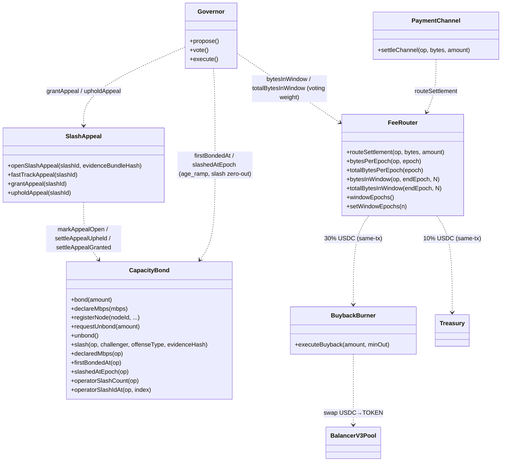
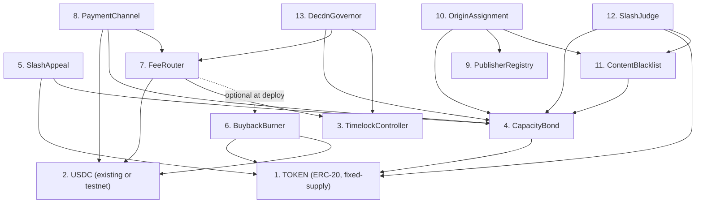
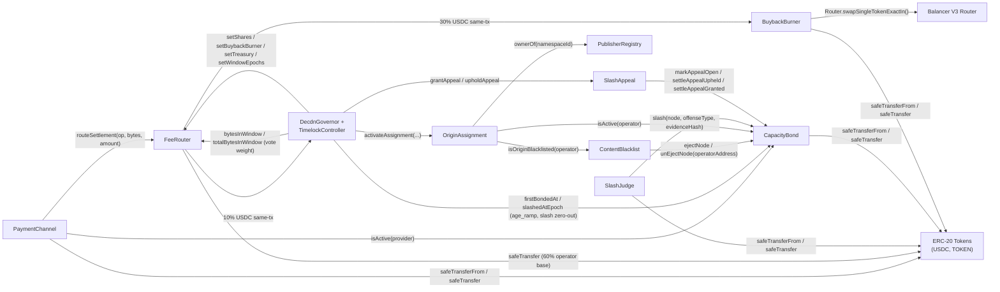
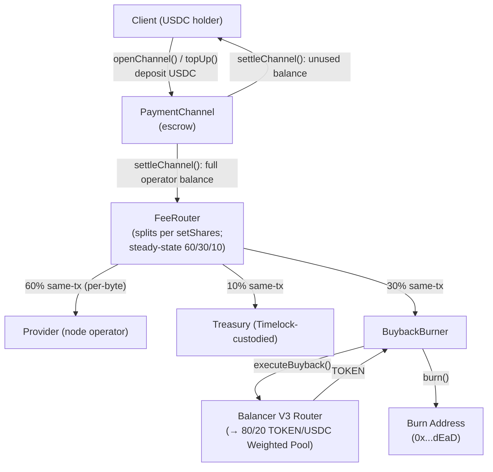
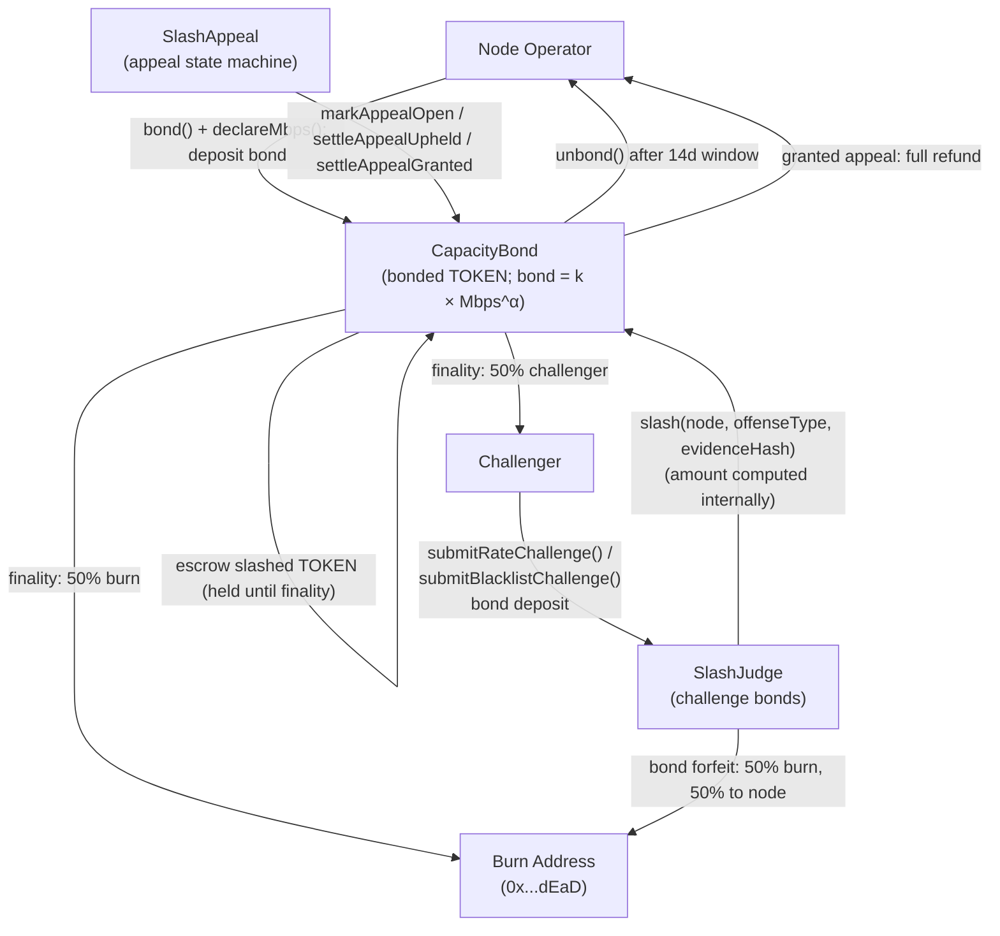

# ADR 016: Smart Contract Interaction Model

**Date:** 2026-05-27
**Status:** Draft

## Context

The deCDN deploys multiple interacting smart contracts with cross-contract calls, role-based access control, and funds custody. Individual contracts are specified across [ADR 003](003-payments.md#adr-003-payment-model), [ADR 009](009-governance.md#adr-009-governance-model), [ADR 011](011-content-takedown.md#adr-011-content-takedown-and-hash-blacklisting), [ADR 014](014-on-chain-verification.md#adr-014-on-chain-verification-for-slashing-evidence), and [ADR 026](026-tokenomics.md#adr-026-tokenomics). However, no single document maps the full interaction surface: who calls whom, which contracts hold funds, who is authorized to do what, and where reentrancy risks exist.

This ADR consolidates that analysis into a single reference for security audits and implementation. It does not introduce new functionality — it systematizes what other ADRs already specify.

> **[ADR 026](026-tokenomics.md#adr-026-tokenomics) driver.** `FeeRouter` is a three-bucket settlement distributor; `CapacityBond` is the operator-registry contract (capacity-bond curve, escrow-on-slash, NodeId binding); `SlashAppeal` and `BuybackBurner` integrate with it. Read [ADR 026](026-tokenomics.md#adr-026-tokenomics) first for the economic model; this ADR is the integration view.

## Decision

### Contract Inventory

All on-chain contracts inherit from [OpenZeppelin Contracts](https://docs.openzeppelin.com/contracts/) to minimize custom security-critical code. The full surface ships in a single audit pass; per-bucket economics are governance-tunable from day one (see [§ Tunable Economics](#tunable-economics) below) so the network can launch with a simplified split and dial up burn / treasury as the dependent infrastructure stabilizes.

| Contract | ADR | Holds Funds | Token Types | OZ Base Contracts |
| --- | --- | --- | --- | --- |
| TOKEN (ERC-20) | [026](026-tokenomics.md#adr-026-tokenomics) | No (fungible token) | — | `ERC20`, `ERC20Burnable`, `ERC20Permit` (fixed-supply per [ADR 026 § Supply and distribution](026-tokenomics.md#supply-and-distribution); no post-genesis mint function; `ERC20Burnable` is the sink for the 50% burn leg of the slashing path — 50% challenger / 50% burn at finality, the prior 30% safety-reserve leg having been folded into burn when the `SafetyReserve` contract was retired — per [ADR 026 § Slashing and burn](026-tokenomics.md#slashing-and-burn); `ERC20Votes` is intentionally omitted because Governor vote weight is derived from `FeeRouter` epoch accounting, not from per-account checkpoint structures, per [ADR 036](036-served-bytes-voting-weight.md#adr-036-served-bytes-voting-weight), so the per-transfer checkpoint cost is not earned) |
| CapacityBond | [003](003-payments.md#adr-003-payment-model), [026](026-tokenomics.md#adr-026-tokenomics) | Yes | TOKEN | `AccessControl`, `ReentrancyGuard`, `Pausable`, `EIP712` (operator-registry contract. Exposes the lock-to-capacity curve `bond = k × Mbps^α` per [ADR 026 § Capacity-bond curve](026-tokenomics.md#capacity-bond-curve), `isActive(operator)` per [ADR 003](003-payments.md#adr-003-payment-model) `ICapacityBond`, `declaredMbps(operator)` for capacity-tier checks, `firstBondedAt(operator)` for the `age_ramp` source on `DecdnGovernor` per [ADR 036](036-served-bytes-voting-weight.md#adr-036-served-bytes-voting-weight), `slashedAtEpoch(operator)` for the slash-aware voting-weight zero-out per [ADR 036 § Slashing zero-out](036-served-bytes-voting-weight.md#slashing-zero-out), and `bindNodeId` / `reclaimNodeId` for the NodeId↔Ethereum-address binding) |
| PaymentChannel | [003](003-payments.md#adr-003-payment-model) | Yes | USDC | `AccessControl`, `ReentrancyGuard`, `Pausable`, `EIP712` (USDC-only; the USDC address is fixed at deployment; `settleChannel` forwards full balance to `FeeRouter.routeSettlement` rather than skimming inline) |
| FeeRouter | [026](026-tokenomics.md#adr-026-tokenomics) | Yes (transient) | USDC (transient; all three buckets transfer same-tx) | `AccessControl`, `ReentrancyGuard`, `Pausable` (three-bucket settlement distributor: 60% operator base / 30% buyback-and-burn / 10% treasury per [ADR 026 § FeeRouter split](026-tokenomics.md#feerouter-split); no epoch buckets, no claim windows) |
| SlashAppeal | [026](026-tokenomics.md#adr-026-tokenomics), [028](028-slashing-appeals.md#adr-028-slashing-appeals-and-dispute-escalation) | Yes (TOKEN appeal bonds only) | TOKEN (appeal bonds) | `AccessControl`, `ReentrancyGuard`, `Pausable` (slash-appeal state machine per [ADR 028](028-slashing-appeals.md#adr-028-slashing-appeals-and-dispute-escalation): `openSlashAppeal` / `fastTrackAppeal` / `rejectAppeal` / `grantAppeal` / `upholdAppeal` / `cleanupExpiredAppeal`; drives `CapacityBond`'s escrow-on-slash settle hooks) |
| BuybackBurner | [018](018-liquidity-strategy.md#adr-018-liquidity-strategy-balancer-8020-pol), [026](026-tokenomics.md#adr-026-tokenomics) | Yes | USDC, TOKEN (transient) | `AccessControl`, `ReentrancyGuard`, `Pausable` (Balancer V3 swap-and-burn path; receives 30% of every settlement) |
| ContentBlacklist | [011](011-content-takedown.md#adr-011-content-takedown-and-hash-blacklisting) | No | — | `AccessControl`, `ReentrancyGuard` — not `Pausable`, because the unlawful-content-removal duty is permanent and must survive the pause sunset ([§ Emergency Multisig](#emergency-multisig-production)) (full surface: hash-level — global + regional — operator-level — `addOperator` / `removeOperator` — origin-level — `isOriginBlacklisted` / `setOriginBlacklist` — plus the enumeration views `getScopeRegions` / `blacklistedHashCount` / `blacklistedHashes` / `blacklistedAddressCount` / `blacklistedAddresses` that let the compliance layer rebuild blacklist state without replaying takedown events) |
| PublisherRegistry | [002](002-content-addressing.md#adr-002-content-addressing) | No | — | `AccessControl` (no `ReentrancyGuard`: the contract makes no external calls and holds no funds, so a reentrancy guard would be dead weight — every function is pure storage bookkeeping) |
| OriginAssignment | [011](011-content-takedown.md#adr-011-content-takedown-and-hash-blacklisting) | No | — | `AccessControl`, `ReentrancyGuard` |
| SlashJudge | [014](014-on-chain-verification.md#adr-014-on-chain-verification-for-slashing-evidence) | Yes | TOKEN (challenge bonds) | `AccessControl`, `ReentrancyGuard`, `Pausable`, `EIP712` |
| DecdnGovernor | [009](009-governance.md#adr-009-governance-model), [036](036-served-bytes-voting-weight.md#adr-036-served-bytes-voting-weight) | No | — | OZ `Governor` + `GovernorCountingSimple` + `GovernorTimelockControl` with a custom served-bytes vote source: reads `FeeRouter.bytesInWindow(operator, epoch(ts), windowEpochs)` and `FeeRouter.totalBytesInWindow(epoch(ts), windowEpochs)` for the bytes-weighted weight basis, and `CapacityBond.firstBondedAt(operator)` + `CapacityBond.slashedAtEpoch(operator)` for the tenure ramp and slash zero-out per [ADR 036 § Formula](036-served-bytes-voting-weight.md#formula). Vote weight is derived from FeeRouter epoch accounting, not per-account checkpoints, so OZ's `GovernorVotes` / `GovernorVotesQuorumFraction` are not used. Thin wrapper supplying fixed deCDN defaults: timestamp clock, 1-day voting delay, 7-day vote, 0.1% proposal threshold, 4% quorum, 5% per-operator voting cap (applied against bytes-weighted total). EIP-712 delegation per Governor Bravo (voting power delegable, bond non-delegable) per [ADR 026 § Governance](026-tokenomics.md#governance). |
| TimelockController | [009](009-governance.md#adr-009-governance-model) | Yes (treasury custodian) | USDC | OZ `TimelockController` (no custom code; 48h delay; holds the 10% protocol-treasury bucket per [ADR 026 § FeeRouter split](026-tokenomics.md#feerouter-split) and is the `DEFAULT_ADMIN_ROLE` of every contract above) |

#### Contract Architecture (classDiagram)

The diagram below shows the full contract surface and its primary call relationships. `FeeRouter` is the canonical served-bytes accountant; `Governor` reads `bytesInWindow` and `totalBytesInWindow` from it as the voting-weight basis per [ADR 036](036-served-bytes-voting-weight.md#adr-036-served-bytes-voting-weight), and reads `firstBondedAt` + `slashedAtEpoch` from `CapacityBond` for the tenure ramp and slash zero-out. `CapacityBond` is the operator-registry contract. There is no separate emissions contract.



The full FeeRouter three-bucket split (60/30/10) is specified in [ADR 026 § FeeRouter split](026-tokenomics.md#feerouter-split). All three legs transfer in the settlement transaction; there are no epoch buckets, no pull-claim windows, no gauge formula. This ADR does not duplicate the bucket table; the launch-default share configuration and the tunability mechanism are in [§ Tunable Economics](#tunable-economics) below.

#### Tunable Economics

The three-bucket structure ships from day one, but every bucket share and every dependency address is governance-mutable. This lets the network launch with a simplified split — a typical default is `90% operator / 5% buyback / 5% treasury` — and dial up the burn / treasury legs as `BuybackBurner` is deployed and as the dependent ADRs ([026](026-tokenomics.md#adr-026-tokenomics), [028](028-slashing-appeals.md#adr-028-slashing-appeals-and-dispute-escalation)) settle into operational defaults.

The pattern has three knobs, all under `GOVERNANCE_ROLE` (i.e. the `TimelockController`):

1. **Bucket shares.** `FeeRouter.setShares([operatorBaseBps, buybackBps, treasuryBps])` updates the three-bucket split in basis points. Sum-to-10000 invariant enforced; cross-validated against dependency addresses (see knob 2). Per-share bounds enforced per [ADR 026 § Governable parameters with safety bounds](026-tokenomics.md#governable-parameters-with-safety-bounds): operator [40, 90], burn [5, 50], treasury [0, 30]. Steady-state target is `6000 / 3000 / 1000`.
2. **Dependency addresses.** `FeeRouter.setBuybackBurner(addr)`, `setTreasury(addr)` may be called any time. **Cross-validation:** `setShares(...)` reverts if any non-zero share has its destination set to `address(0)` — so a bucket can only become live once its sink contract is wired in. Same applies in reverse: `set*(address(0))` reverts if the corresponding share is non-zero.
3. **Helper-contract addresses on signing contracts.** `PaymentChannel.setFeeRouter(addr)` (per [ADR 003](003-payments.md#adr-003-payment-model)) lets governance re-point the router target without redeploying the payment channel. The EIP-712 domain separator is unaffected because it does not include the FeeRouter address; see [§ No proxy deployment patterns](#no-proxy-deployment-patterns) below for the full carve-out.

**Inactive buckets accumulate zero with no reverts.** All three legs execute inline against their `safeTransfer` paths; at zero share, the leg short-circuits before the transfer call. No code path reverts when a bucket is off — the contract is uniformly dormant on the disabled legs. There are no epoch buckets, claim functions, sweep paths, or USDC→TOKEN swap pipelines on `FeeRouter`.

**Activation sequence is governance-driven.** When `BuybackBurner` is deployed and audited, governance calls `setBuybackBurner(addr)` then `setShares(...)` to allocate the bucket. Because share updates pass through the standard 48h timelock, bucket activations are externally observable in advance.

**Launch deployment.** `FeeRouter` deploys with a zero-address dependency for `BuybackBurner` if it isn't co-deployed (see [§ Deployment Order](#deployment-order-and-initialization-dependencies) below). The launch share configuration honors the cross-validation invariant — only buckets whose destinations are wired may be set non-zero. The buyback bucket is dormant by default: `buybackBurner == address(0)` and the split is `[9000, 0, 1000]`.

**Optional deploy-time genesis activation.** The deploy script carries an off-by-default option to activate the buyback bucket at genesis. With it off, the launch is dormant exactly as above. With it on, the script runs the governance activation bundle in-script — seed the venue pool, deploy the concrete burner with Timelock-held roles, `setSharesAndDestinations([6000, 3000, 1000], {buybackBurner, treasury})`, grant the keeper `KEEPER_ROLE` — before the [§ Deployment Order](#deployment-order-and-initialization-dependencies) role handoff, so the burner is handed to the Timelock alongside every other target. This exists because at genesis the served-bytes voting weight that gates the governance path (and therefore governance quorum per [ADR 036](036-served-bytes-voting-weight.md#adr-036-served-bytes-voting-weight)) is zero, so the standard activation cannot run until the network has served bytes. The venue is a deploy-time selection — Balancer V3 or Uniswap V3, behind the venue-neutral `BuybackBurner` (see [ADR 018 § Venue-neutral burner selection](018-liquidity-strategy.md#venue-neutral-burner-selection)). It is a testnet/genesis convenience; production activation stays governance-gated (see [ADR 018 § Activation Criteria](018-liquidity-strategy.md#activation-criteria-production) and [§ Deploy-time genesis activation](018-liquidity-strategy.md#deploy-time-genesis-activation)). No new contract surface, fallback path, or privileged role is introduced — activation is the same `setSharesAndDestinations` call, run before the deployer's `GOVERNANCE_ROLE` is handed off.

#### Contract: FeeRouter

```solidity
interface IFeeRouter {
    // Called by `PaymentChannel.settleChannel`. Forwards the operator's
    // full USDC balance through the three-bucket split per ADR 026
    // § FeeRouter split: 60% operator base, 30% buyback, 10% treasury.
    // All three legs transfer same-tx. Derives the current
    // epoch as `uint64(block.timestamp / EPOCH_LENGTH)`, increments both
    // `bytesPerEpoch[operator][epoch]` and `totalBytesPerEpoch[epoch]`
    // (the governance-canonical vote-weight source per ADR 036).
    // Reverts if paused.
    function routeSettlement(
        address operator,
        uint256 bytesDelivered,
        uint256 amount
    ) external;

    // Per-operator, per-epoch served bytes — populated inline by
    // routeSettlement. The governance vote-weight source per ADR 036:
    // DecdnGovernor sums this counter over the trailing `windowEpochs`
    // epochs via `bytesInWindow` to derive an operator's served-bytes
    // weight. Also used off-chain for dashboards.
    function bytesPerEpoch(address operator, uint64 epoch) external view returns (uint256);

    // Global per-epoch served bytes — populated inline by
    // routeSettlement alongside `bytesPerEpoch`. Used by DecdnGovernor
    // via `totalBytesInWindow` for the bytes-weighted total in the
    // per-operator vote cap, quorum, and proposal-threshold checks per
    // ADR 036.
    function totalBytesPerEpoch(uint64 epoch) external view returns (uint256);

    // Trailing-window helpers consumed by DecdnGovernor's `_getVotes`
    // and quorum / proposalThreshold paths per ADR 036 § Formula. Each
    // performs an O(N) loop of cold SLOADs across the requested window.
    // `endEpoch` is the inclusive last epoch in the sum, typically
    // `uint64(proposalSnapshot / EPOCH_LENGTH)`.
    function bytesInWindow(
        address operator,
        uint64 endEpoch,
        uint64 N
    ) external view returns (uint256);

    function totalBytesInWindow(
        uint64 endEpoch,
        uint64 N
    ) external view returns (uint256);

    // Governance-mutable trailing-window length (default 13, bounded
    // [4, 26] per ADR 036 § Governable parameters). Stored on FeeRouter
    // as the single source of truth for the window length DecdnGovernor
    // reads from.
    function windowEpochs() external view returns (uint64);
    function setWindowEpochs(uint64 n) external;

    // Configured shares (bps) and dependency addresses. INVARIANT: these
    // are governance-set state (via `setShares` / `setSharesAndDestinations`),
    // NOT operator-asserted and NOT derived from settlement state. Array
    // order matches `setShares`: [operatorBase, buyback, treasury].
    function getShares() external view returns (uint256[3] memory);
    function buybackBurner() external view returns (address);
    function treasury() external view returns (address);

    // Atomic shares + dependency-address update in one timelock proposal,
    // so the cross-validation invariant ([§ Tunable Economics](#tunable-economics)
    // — non-zero share requires non-zero destination) holds at every
    // observable state. Use for activation flips; per-knob setters below
    // are for routine post-wiring governance.
    struct ShareDestinations {
        address buybackBurner;
        address treasury;
    }
    function setSharesAndDestinations(
        uint256[3] calldata sharesBps,
        ShareDestinations calldata dests
    ) external;

    // Per-knob setters. Each must satisfy the cross-validation invariant:
    // `setShares` reverts if any non-zero share targets `address(0)`;
    // each `set*(address(0))` reverts if the corresponding share is
    // non-zero. Order of operations: zero out the share first, then
    // re-point the destination.
    function setShares(uint256[3] calldata sharesBps) external;
    function setBuybackBurner(address newBuybackBurner) external;
    function setTreasury(address newTreasury) external;

    // `pause()` blocks `routeSettlement`. `PaymentChannel`
    // close/dispute are independent and remain available — settlement
    // queues until `unpause`.
    function pause() external;
    function unpause() external;

    // ─── Events ───────────────────────────────────────────────────────
    // `epoch` is FeeRouter-derived as `uint64(block.timestamp / EPOCH_LENGTH)`.
    event Settled(
        address indexed operator,
        uint256 bytesDelivered,
        uint256 amount,
        uint64 indexed epoch
    );
    event SharesUpdated(uint256[3] newShares);
    event BuybackBurnerUpdated(address indexed oldAddr, address indexed newAddr);
    event TreasuryUpdated(address indexed oldAddr, address indexed newAddr);
    event WindowEpochsUpdated(uint64 oldValue, uint64 newValue);
}
```

**Notes:**

- **Epoch length is immutable** (1 week, constructor-set, [ADR 026 § FeeRouter split](026-tokenomics.md#feerouter-split)). Changing it post-deploy shifts every stored epoch index; a change ships as a fresh `FeeRouter` with state migration ([§ No proxy deployment patterns](#no-proxy-deployment-patterns)). The three-bucket split is per-byte at settlement time (no epoch-bucket payouts); `bytesPerEpoch` and `totalBytesPerEpoch` are governance-canonical because `DecdnGovernor` derives served-bytes vote weight from them per [ADR 036](036-served-bytes-voting-weight.md#adr-036-served-bytes-voting-weight). A `FeeRouter` migration therefore resets the governance vote-weight history — operator vote weight is zero until traffic refills the trailing window post-migration. Operational consideration documented in [ADR 036 § Consequences > Negative](036-served-bytes-voting-weight.md#negative).
- **`bytesPerEpoch` and `totalBytesPerEpoch` are the governance vote-weight source.** Under [ADR 036](036-served-bytes-voting-weight.md#adr-036-served-bytes-voting-weight), `DecdnGovernor._getVotes` calls `bytesInWindow(operator, endEpoch, windowEpochs)` and `totalBytesInWindow(endEpoch, windowEpochs)` for the per-operator served-bytes weight and the cap denominator. Per-byte settlement does the inline write; off-chain dashboards continue to read the same counters.
- **Wash-trading defense.** Faking bytes does not increase revenue (operator base is per-byte at settlement, paid by the client; wash trades don't bring in real USDC). Governance vote weight is sourced from `FeeRouter.bytesInWindow` per [ADR 036](036-served-bytes-voting-weight.md#adr-036-served-bytes-voting-weight) — proven delivered bytes, not declared capacity — so an over-declared tier cannot translate into governance influence either. The super-linear capacity-bond curve makes over-declared capacity a dead-capital drag with no governance or revenue upside.
- **No `initialize(...)` helper** — proxies are forbidden ([§ No proxy deployment patterns](#no-proxy-deployment-patterns)); constructor + post-deploy `setSharesAndDestinations` from `TimelockController` suffices.

##### No proxy deployment patterns

No deCDN contract uses proxy (upgradeable) deployment patterns. Production contract upgrades deploy new contracts at new addresses with state migration as described in Section 6. This constraint ensures that EIP-712 domain separators computed in constructors (as `immutable`) remain valid for the contract's lifetime — a proxy migration to a different address or chain would invalidate all existing voucher signatures.

**Carve-out for non-signing helper addresses.** The immutability constraint applies only to fields included in voucher / challenge domain separators on the signing contracts (`PaymentChannel`, `SlashJudge`, `CapacityBond.bindNodeId` / `CapacityBond.registerNode`). Helper-contract addresses referenced by signing contracts — `feeRouter` on `PaymentChannel`, `capacityBond` on `SlashJudge`, `contentBlacklist` on `OriginAssignment`, and the `setBuybackBurner` / `setTreasury` setters on `FeeRouter` — may be re-pointed via `GOVERNANCE_ROLE`-gated setters under the standard 48h timelock. Helper addresses are not domain-separator inputs, so re-pointing them does not invalidate any existing signatures.

**Build toolchain:** [Foundry](https://book.getfoundry.sh/) (forge, cast, anvil) for compilation, testing, and deployment.

#### Contract: CapacityBond

`CapacityBond` is the operator-registry contract: voluntary TOKEN bond on the capacity-bond curve, NodeId binding, the `firstBondedAt` / `slashedAtEpoch` reads consumed by `DecdnGovernor`, and the escrow-on-slash settle hooks consumed by `SlashAppeal`. There is no on-chain operator-credit grant/vest surface — slashing applies only to the operator's voluntary bond (`bondOf(op)`), and a granted appeal refunds the escrowed bond liquid. Each `slash` persists a `SlashRecord` — carrying the `offenseType` ([ADR 014](014-on-chain-verification.md#adr-014-on-chain-verification-for-slashing-evidence) offense taxonomy index) and the `evidenceHash` (the `SlashJudge` evidence digest the slash resolved) alongside the escrow bookkeeping — and appends its `slashId` to a per-operator append-only list enumerable via `operatorSlashCount` / `operatorSlashIdAt`. The full surface (`bond`, `requestUnbond`, `unbond`, `declareMbps`, `registerNode`, `deregisterNode`, `slash`, `firstBondedAt`, `bondOf`, `slashedAtEpoch`, `operatorSlashCount`, `operatorSlashIdAt`, `bindNodeId` / `reclaimNodeId`, `isActive`) is covered in [§ Contract Inventory](#contract-inventory), [§ Contract Architecture](#contract-architecture-classdiagram), [§ Cross-Contract Call Graph](#cross-contract-call-graph), and [§ Off-Chain Read API](#off-chain-read-api-client--node-bootstrap).

### Deployment Order and Initialization Dependencies

Contracts must be deployed in dependency order — each contract's constructor requires the addresses of contracts deployed before it. `FeeRouter` accepts `address(0)` for `BuybackBurner` at construction; the cross-validation invariant in [§ Tunable Economics](#tunable-economics) ensures any non-zero share has a non-zero destination, so the launch share configuration determines which dependencies must already be wired.



#### Constructor Dependencies

| Step | Contract | Constructor Requires |
| --- | --- | --- |
| 1 | TOKEN | Initial holder, initial supply (1B fixed per [ADR 026](026-tokenomics.md#adr-026-tokenomics) [§ Supply and distribution](026-tokenomics.md#supply-and-distribution)), owner. No `mint()` function; testnet seeding happens via the constructor `_mint(initialHolder, 1_000_000_000e18)`. |
| 2 | USDC | External (testnet faucet or mainnet address) |
| 3 | TimelockController | OZ `TimelockController(minDelay, proposers, executors, admin)` — `minDelay` is 48h ([ADR 009](009-governance.md#adr-009-governance-model)). Deployed early so its address is available to `FeeRouter` as the treasury bucket destination and to every `AccessControl`-bearing contract as the eventual `DEFAULT_ADMIN_ROLE` holder. `proposers` is initialized empty and `PROPOSER_ROLE` is granted post-deploy (step 13) — to `DecdnGovernor` by default, or to the bootstrap multisig instead during the [ADR 009 § Bootstrap-multisig phase](009-governance.md#bootstrap-multisig-phase); `executors` is `[address(0)]` (anyone may execute after the delay). |
| 4 | CapacityBond | TOKEN address, Ed25519 verifier address, admin address, `minBond`, `unbondingPeriod` (14 days per [ADR 026 § Capacity-bond curve — Bond lifecycle](026-tokenomics.md#capacity-bond-curve)), `multiaddrUpdateCooldown`, `maxMultiaddrSize`, `regionStabilityWindow`. The capacity-curve coefficients (`kConstant`/`alphaWad`; defaults `k=12.6`, `α=1.2`) and the declared-capacity band (`minCapacityMbps`/`maxCapacityMbps`; defaults 10 Mbps / 200 Gbps) per [ADR 026 § Capacity-bond curve](026-tokenomics.md#capacity-bond-curve) are **not** constructor arguments — they are storage initialized to these defaults in the constructor and governance-tunable post-deploy via `setK` / `setAlpha` / `setMinCapacityMbps` / `setMaxCapacityMbps`. `age_ramp_months` is **not** a `CapacityBond` parameter at all; it lives on `DecdnGovernor` (`setAgeRampMonths`, step 13). Exposes `bindNodeId` / `reclaimNodeId` for NodeId rebinding. |
| 5 | SlashAppeal | TOKEN address, CapacityBond address, admin address, emergency-multisig address (fast-track approver), `appealBond` (default 1000 TOKEN, bounded `[100, 10_000]e18`) per [ADR 028](028-slashing-appeals.md#adr-028-slashing-appeals-and-dispute-escalation). Drives `CapacityBond`'s escrow-on-slash settle hooks via `SLASH_APPEAL_ROLE` (granted post-deploy, step 5 of [§ Post-Deployment Initialization](#post-deployment-initialization)). |
| 6 | BuybackBurner | TOKEN address, USDC address, Balancer V3 Router address, initial pool contract `address` (may be zero-address at deploy and set later via `setPool(address)` — see [ADR 003](003-payments.md#buybackburner) for the interface and [ADR 018](018-liquidity-strategy.md#adr-018-liquidity-strategy-balancer-8020-pol) for the venue rationale). **Inflow source:** `FeeRouter` (30% of every settlement per [ADR 026 § Slashing and burn](026-tokenomics.md#slashing-and-burn)). **Router address and naming:** see [ADR 018 § Buyback execution via Balancer V3](018-liquidity-strategy.md#buyback-execution-via-balancer-v3). **Approvals note:** `BuybackBurner` MUST self-approve the Balancer V3 **Vault** address (distinct from the Router) during initialization — the Vault pulls input tokens from `msg.sender`. |
| 7 | FeeRouter | USDC address, **`TimelockController` address** (treasury bucket destination), `epochLength` (1 week; the canonical served-bytes voting-weight clock per [ADR 036](036-served-bytes-voting-weight.md#adr-036-served-bytes-voting-weight)), launch split shares per [ADR 026 § Governable parameters with safety bounds](026-tokenomics.md#governable-parameters-with-safety-bounds) (cross-validated against dependency addresses). **Dependency address** (`buybackBurner`) may be `address(0)` at deploy and set later via the governance-mutable setter in [§ Tunable Economics](#tunable-economics); the cross-validation invariant ensures any non-zero share has a non-zero destination at construction time. Steady-state target shares are `6000 / 3000 / 1000` in basis points. |
| 8 | PaymentChannel | USDC address, CapacityBond address, FeeRouter address, `disputeWindow` (48h), `maxChannelDuration` (90 days), `deliveryFloor` ([ADR 003](003-payments.md#adr-003-payment-model)). `settleChannel` does not skim a protocol fee inline — it transfers the full operator USDC balance to `FeeRouter.routeSettlement(operator, bytesDelivered, amount)` in the same transaction. `setFeeRouter(address)` is governance-mutable per [§ No proxy deployment patterns](#no-proxy-deployment-patterns) carve-out. |
| 9 | PublisherRegistry | None. Permissionless namespace creation (publisher identity is implicit on first call); namespace cap and ownership-transfer timelock are stored on `PublisherRegistry` itself and updated via governable setters (`setMaxNamespacesPerPublisher`, `setNamespaceTransferTimelock`) per [ADR 002 § Contract: PublisherRegistry](002-content-addressing.md#contract-publisherregistry). |
| 10 | OriginAssignment | CapacityBond, PublisherRegistry, ContentBlacklist (latter may be zero at deploy; bound via `setContentBlacklist`). Min-redundancy and timelock parameters are governance-controlled. See [ADR 011 § Origin Assignment Authority](011-content-takedown.md#origin-assignment-authority) and [§ OriginAssignment construction notes](#originassignment-construction-notes) below. |
| 11 | ContentBlacklist | `ContentBlacklist(address capacityBond)`. CapacityBond address is required for `ejectNode()`. `ContentBlacklist` does not cross-call `OriginAssignment`; security relies on runtime checks (see [ADR 011 § Interaction with ContentBlacklist](011-content-takedown.md#interaction-with-contentblacklist)). After deployment, `OriginAssignment.setContentBlacklist(address)` is called once via the deployer / admin to wire the read direction (`OriginAssignment.pruneBlacklistedAssignment` queries `ContentBlacklist.isOriginBlacklisted`). |
| 12 | SlashJudge | CapacityBond address, TOKEN address, ContentBlacklist address (read source for blacklist challenges), `challengeBond` (100 TOKEN, bounded `[1, 1000]e18`), `maxEvidenceAgeUs` (5 days in µs, bounded `[1d, 30d]`), admin address (`DEFAULT_ADMIN_ROLE` + `GOVERNANCE_ROLE`). All four addresses are rejected as zero. The constructor additionally enforces `maxEvidenceAgeUs < CapacityBond.unbondingPeriod × 1e6` (the registry stores seconds; evidence age is microseconds) — see [ADR 014](014-on-chain-verification.md#adr-014-on-chain-verification-for-slashing-evidence). There is no counter-evidence window: a passing reveal slashes synchronously per [ADR 014 § Bond Handling](014-on-chain-verification.md#bond-handling). Deploy after ContentBlacklist (row 11); the reverse binding is wired post-deploy via `CapacityBond.setSlashJudge`. |
| 13 | DecdnGovernor | OZ Governor wrapper composing `Governor` + `GovernorCountingSimple` + `GovernorTimelockControl`, with a custom served-bytes vote source per [ADR 036 § Formula](036-served-bytes-voting-weight.md#formula) (`_getVotes` → `FeeRouter.bytesInWindow / totalBytesInWindow` capped, multiplied by `age_ramp(CapacityBond.firstBondedAt)`, zeroed if `CapacityBond.slashedAtEpoch` falls inside the window; `quorum` / `proposalThreshold` → `FeeRouter.totalBytesInWindow`). Constructor wires `FeeRouter` (bytes vote source, non-zero) + `CapacityBond` (tenure-ramp + slash-zero-out source, non-zero) + `TimelockController` (execution target) + the fixed [ADR 009](009-governance.md#adr-009-governance-model) defaults (timestamp clock, 1-day delay, 7-day vote, 0.1% proposal threshold, 4% quorum, 5% per-operator voting cap applied against bytes-weighted total). EIP-712 delegation per Governor Bravo. After deployment, `TimelockController.grantRole(PROPOSER_ROLE, address(decdnGovernor))` (and `CANCELLER_ROLE`); execution is open (`executors == [address(0)]`, step 3). A deploy that opts into the [ADR 009 § Bootstrap-multisig phase](009-governance.md#bootstrap-multisig-phase) grants those two roles to the bootstrap multisig instead and leaves the Governor with neither, so it is deployed and vote-wired but cannot propose until the transition batch moves both roles to it. The Governor's constructor arguments are identical in both cases. |

#### OriginAssignment construction notes

- **Namespace 0.** `namespaceId == 0` has no authorized origins: no set is seated for it, `getOrigins(0)` is empty, and `isAuthorizedOrigin(0, op)` is always false.
- **ContentBlacklist binding.** Until `setContentBlacklist(address)` is called post-deploy (see [§ Post-Deployment Initialization](#post-deployment-initialization) below), `pruneBlacklistedAssignment` reverts — it cannot read `isOriginBlacklisted` against the zero address. This does not block usage: off-chain consumers of `getOrigins(...)` cross-reference `ContentBlacklist.isOriginBlacklisted` directly via RPC.

#### Post-Deployment Initialization

After all contracts are deployed, the deployer must execute these transactions before the system accepts user traffic:

1. **Grant `BLACKLIST_ROLE`** on CapacityBond to ContentBlacklist:

   ```solidity
   capacityBond.grantRole(BLACKLIST_ROLE, address(contentBlacklist));
   ```

2. **Bind ContentBlacklist into OriginAssignment** (one-shot read wiring):

   ```solidity
   originAssignment.setContentBlacklist(address(contentBlacklist));
   ```

   This authorizes `OriginAssignment.pruneBlacklistedAssignment` to query `ContentBlacklist.isOriginBlacklisted` for permissionless storage cleanup. Until this call is made, prune calls revert; runtime authorization checks (probe, peer table) consult both contracts directly via the off-chain RPC path and are unaffected.

3. **Grant `SLASH_ROLE`** on CapacityBond to SlashJudge:

   ```solidity
   capacityBond.grantRole(SLASH_ROLE, address(slashJudge));
   ```

   This authorizes `SlashJudge` to call `CapacityBond.slash`, which reduces the operator's bond and escrows the slashed TOKEN in `CapacityBond` (escrow-on-slash per [ADR 026 § Slashing and burn](026-tokenomics.md#slashing-and-burn)). Nothing is redirected to another contract at slash time — the escrow is distributed (50% challenger / 50% burn) or refunded to the operator at appeal finality.

4. **Grant `ROUTER_CALLER_ROLE` on FeeRouter to PaymentChannel:**

   ```solidity
   feeRouter.grantRole(ROUTER_CALLER_ROLE, address(paymentChannel));
   ```

   This authorizes `PaymentChannel.settleChannel` to invoke `FeeRouter.routeSettlement(operator, bytesDelivered, amount)`. Without this grant the settlement path reverts.

5. **Grant `SLASH_APPEAL_ROLE` on CapacityBond to SlashAppeal:**

   ```solidity
   capacityBond.grantRole(SLASH_APPEAL_ROLE, address(slashAppeal));
   ```

   This authorizes `SlashAppeal` to drive the escrow-on-slash settle hooks on `CapacityBond` — `markAppealOpen` (lock the escrow when an appeal is filed), `settleAppealUpheld` (distribute 50/50 when the slash stands), and `settleAppealGranted` (refund the operator's escrowed TOKEN and recompute the multi-slash `slashedAtEpoch` watermark, restoring served-bytes voting weight per [ADR 036 § Slashing zero-out](036-served-bytes-voting-weight.md#slashing-zero-out)) — per [ADR 028 § Contract surface](028-slashing-appeals.md#contract-surface). Without this grant no appeal can lock or resolve a slash's escrow.

6. **Register regional governance bodies** (when jurisdictional bodies are constituted):

   ```solidity
   contentBlacklist.registerRegionalBody(regionCode, bodyAddress, emergencyMultisig);
   ```

   The body is bound to `regionCode` and may only write entries for it. The third
   argument names the `EMERGENCY_MULTISIG_ROLE` holder to check signer
   disjointness against — see [ADR 011 § Signer non-overlap](011-content-takedown.md#regional-governance-bodies).
   The call reverts on overlap; where either side is not signer-enumerable it
   succeeds with `RegionalBodyRegistered.signersVerified == false`, and the
   proposal must document the off-chain disjointness check.

7. **Transfer admin roles** to `TimelockController`:

   ```solidity
   // For each contract with AccessControl:
   contract.grantRole(DEFAULT_ADMIN_ROLE, address(timelockController));
   contract.revokeRole(DEFAULT_ADMIN_ROLE, deployer);
   ```

> **Admin handover hardening:** Deployments SHOULD execute `grantRole(DEFAULT_ADMIN_ROLE, timelockController)` and `revokeRole(DEFAULT_ADMIN_ROLE, deployer)` in a single multicall transaction to minimize the dual-admin window between the two operations.

> **Deployment atomicity.** The post-deployment initialization steps (1–7) SHOULD be executed atomically via a multicall contract or a deployment script that reverts on any failure. A partially initialized system (e.g., `SLASH_ROLE` granted but `BLACKLIST_ROLE` not yet, or `ROUTER_CALLER_ROLE` not yet granted to `PaymentChannel`) could create a window where some security mechanisms work but settlements revert or land in the wrong contract. Between deployment and initialization completion, `CapacityBond` SHOULD reject `bond` / `registerNode` calls (e.g., via a `paused` initial state or a deployment flag) to prevent nodes from registering before the security infrastructure is fully wired. A Foundry deployment script with sequential `vm.broadcast()` calls provides sufficient atomicity at launch scale.

> **Optional genesis buyback activation.** When the deploy-time genesis-activation option is enabled (off by default; see [§ Tunable Economics](#tunable-economics)), the buyback bundle — seed the venue pool, deploy the concrete burner (Timelock-held roles, emergency-multisig pauser), `setSharesAndDestinations([6000, 3000, 1000], …)`, grant the keeper — runs after the peer-role wiring and before step 7 (the admin/GOVERNANCE_ROLE handoff), so the deployer's still-held `GOVERNANCE_ROLE` on `FeeRouter` and on the new burner can flip the split and set the keeper, and the burner is then handed to the Timelock in step 7 with every other target. With the option off, this step is skipped and genesis is dormant (`buybackBurner == address(0)`, split `[9000, 0, 1000]`). The venue (Balancer V3 or Uniswap V3) is a deploy-time selection.

### Cross-Contract Call Graph



#### Complete Call Table

| Caller | Callee | Function | Authorization | Mutates Callee State |
| --- | --- | --- | --- | --- |
| PaymentChannel | CapacityBond | `isActive(provider)` | Public (read-only) | No |
| PaymentChannel | IERC20 (USDC) | `safeTransferFrom()` | Caller must have allowance | Yes |
| PaymentChannel | IERC20 (USDC) | `safeTransfer()` | Caller holds balance | Yes |
| PaymentChannel | FeeRouter | `routeSettlement(operator, bytesDelivered, amount)` | `ROUTER_CALLER_ROLE` on FeeRouter ([ADR 026 § FeeRouter split](026-tokenomics.md#feerouter-split)) | Yes |
| FeeRouter | BuybackBurner | `safeTransfer()` (30% USDC same-tx) | Caller holds balance | Yes |
| FeeRouter | Treasury wallet | `safeTransfer()` (10% USDC same-tx) | Caller holds balance | Yes |
| FeeRouter | IERC20 (USDC) | `safeTransfer()` (60% operator base, same-tx) | Caller holds balance | Yes |
| Governor | FeeRouter | `bytesInWindow(operator, endEpoch, N)`, `totalBytesInWindow(endEpoch, N)`, `bytesPerEpoch(operator, epoch)`, `totalBytesPerEpoch(epoch)`, `windowEpochs()` (vote-weight source per [ADR 036](036-served-bytes-voting-weight.md#adr-036-served-bytes-voting-weight)); `setShares([operatorBaseBps, buybackBps, treasuryBps])`, `setBuybackBurner(addr)`, `setTreasury(addr)`, `setWindowEpochs(n)` (parameter updates) | Public (read-only) for views; `GOVERNANCE_ROLE` on FeeRouter for setters; sum-to-10000 invariant; per-share bounds enforced; cross-validated against dependency addresses (see [§ Tunable Economics](#tunable-economics)); `windowEpochs` bounded `[4, 26]` per [ADR 036 § Governable parameters with safety bounds](036-served-bytes-voting-weight.md#governable-parameters-with-safety-bounds) | View: No / Setters: Yes |
| Governor | CapacityBond | `firstBondedAt(operator)`, `slashedAtEpoch(operator)` (vote-weight inputs per [ADR 036](036-served-bytes-voting-weight.md#adr-036-served-bytes-voting-weight)); `declaredMbps(operator)`, `bondRequired(mbps)` (capacity-tier reads only); `setMinBond`, `setMinCapacityMbps`, `setMaxCapacityMbps`, `setUnbondingPeriod`, `setK`, `setAlpha` (parameter updates). The bond-curve coefficients (`k`, `α`) **are** on-chain-tunable via `setK` / `setAlpha`, and the coupling `activeBond ≥ bondRequired(declaredMbps)` is enforced at `declareMbps` / `requestUnbond` / `registerNode` (curve math in the linked `BondMath` library): α bounded `[1.0, 1.8]`, `k` bounded so the 1 Gbps tier ∈ [10K, 200K TOKEN] per [ADR 026 § Capacity-bond curve](026-tokenomics.md#capacity-bond-curve). The `age_ramp` months parameter is governable, but on `DecdnGovernor` (`setAgeRampMonths`), not `CapacityBond`. | Public (read-only) for views; `GOVERNANCE_ROLE` for setters | View: No / Setters: Yes |
| Governor | DecdnGovernor (self) | `setVoteCapBps(bps)`, `setAgeRampMonths(months)` — self-governance of the served-bytes vote-weight tunables ([ADR 036 § Formula](036-served-bytes-voting-weight.md#formula)); both checkpointed via `Checkpoints.Trace208` (snapshots read at proposal time) and emit `VoteCapBpsUpdated` / `AgeRampMonthsUpdated` | `onlyGovernance` (executed through the Governor's own timelock); `voteCapBps` bounded `[1%, 25%]` (100–2500 bps), `ageRampMonths` bounded `[1, 24]` | View: No / Setters: Yes |
| Governor | SlashAppeal | `grantAppeal(slashId)`, `upholdAppeal(slashId)`, `setAppealBond(n)` | `GOVERNANCE_ROLE` on SlashAppeal | Yes |
| Emergency multisig | SlashAppeal | `fastTrackAppeal(slashId)`, `rejectAppeal(slashId)` | `EMERGENCY_MULTISIG_ROLE` on SlashAppeal | Yes |
| ContentBlacklist | CapacityBond | `ejectNode(operatorAddress)` (on `addOperator`; sets the permanent `blacklistEjected` latch), `unEjectNode(operatorAddress)` (on `removeOperator`; clears the latch — re-entry then follows the normal re-bond path per [ADR 011 § Hash Evasion and Origin Blacklisting](011-content-takedown.md#hash-evasion-and-origin-blacklisting)) | `BLACKLIST_ROLE` | Yes |
| OriginAssignment | CapacityBond | `isActive(operator)` | Public (read-only) | No |
| OriginAssignment | PublisherRegistry | `ownerOf(namespaceId)` | Public (read-only) | No |
| OriginAssignment | ContentBlacklist | `isOriginBlacklisted(operator)` | Public (read-only) | No |
| Governor | OriginAssignment | `activateAssignment(namespaceId)`, `revokeAssignment(namespaceId, operator)`, `setMaxOriginsPerNamespace(cap)`, `setAssignmentTimelock(seconds)`, `setContentBlacklist(address)` | `GOVERNANCE_ROLE` on OriginAssignment | Yes |
| SlashJudge | CapacityBond | `slash(node, challenger, offenseType, evidenceHash)` — `SlashJudge` forwards the `SlashJudge`-side evidence digest as `evidenceHash`, which `CapacityBond` persists on the `SlashRecord` alongside `offenseType` | `SLASH_ROLE` | Yes |
| SlashJudge | IERC20 (TOKEN) | `safeTransferFrom()` / `safeTransfer()` | Caller must have allowance/balance | Yes |
| CapacityBond | IERC20 (TOKEN) | `safeTransferFrom()` / `safeTransfer()` (escrow refund to operator on a granted appeal, or challenger 50% leg at finality; remaining burn leg via `token.burn`) | Caller must have allowance/balance | Yes |
| SlashAppeal | CapacityBond | `markAppealOpen(slashId)` (lock escrow), `settleAppealUpheld(slashId)` (distribute 50/50), `settleAppealGranted(slashId)` (refund operator + recompute the multi-slash `slashedAtEpoch` watermark, restoring served-bytes voting weight per [ADR 036 § Slashing zero-out](036-served-bytes-voting-weight.md#slashing-zero-out)) — per [ADR 028 § Contract surface](028-slashing-appeals.md#contract-surface). | `SLASH_APPEAL_ROLE` on CapacityBond | Yes |
| BuybackBurner | Balancer V3 Router | `swapSingleTokenExactIn(pool, tokenIn, tokenOut, exactAmountIn, minAmountOut, deadline, wethIsEth, userData)` | `BuybackBurner` self-approves the **Balancer V3 Vault** address (NOT the Router) during its initialization — the Vault pulls input tokens from the `msg.sender` of the Router call. This is the V3 footgun; see [ADR 018 § Buyback execution via Balancer V3](018-liquidity-strategy.md#buyback-execution-via-balancer-v3) | Yes |
| BuybackBurner | IERC20 (USDC, TOKEN) | `safeTransferFrom()` / `safeTransfer()` | Caller must have allowance/balance | Yes |

**Note:** No contract calls governance functions on another deCDN contract. Cross-contract state mutations are limited to `ejectNode()`, `unEjectNode()`, `slash()`, `routeSettlement()`, and the escrow-on-slash settle hooks (`markAppealOpen` / `settleAppealUpheld` / `settleAppealGranted`) — each protected by a dedicated role.

#### Off-Chain Read API (Client / Node Bootstrap)

The cross-contract call table above covers contract-to-contract interactions only. Off-chain components — clients and nodes — also need a stable set of view functions for cold-start peer discovery and live state inspection. These are specified in detail in the referenced ADRs but were not surfaced here, leaving room for them to be missed during contract scaffolding.

Enumerable state carries a `count()` + paged `getter(offset, limit)` pair so a consumer rebuilds a list from chain state rather than replaying event logs. Pages clamp to the backing length (an `offset` past the end returns an empty page); `CapacityBond.operatorSlashIdAt` instead reverts `SlashIndexOutOfRange` on an out-of-range index, matching its use as a bounded backward walk from `operatorSlashCount`. These are additive view surfaces — no state, event, or write path changes.

| Caller | Callee | Function | Used by | Reference |
| --- | --- | --- | --- | --- |
| Off-chain client/node | CapacityBond | `getActiveNodeCount() returns (uint256)` | Bootstrap pagination loop | [ADR 001](001-network.md#adr-001-network-topology-and-peer-mesh), [ADR 012](012-client.md#adr-012-client-architecture-bootstrap-and-trust-model), [ADR 019](019-node-onboarding.md#adr-019-node-onboarding-and-bootstrapping-flow) |
| Off-chain client/node | CapacityBond | `getActiveNodes(uint256 offset, uint256 limit) returns (NodeInfo[])` | Cold-start peer discovery | [ADR 001](001-network.md#adr-001-network-topology-and-peer-mesh), [ADR 012](012-client.md#adr-012-client-architecture-bootstrap-and-trust-model), [ADR 019](019-node-onboarding.md#adr-019-node-onboarding-and-bootstrapping-flow) |
| Off-chain client/node | CapacityBond | `firstBondedAt(address operator) returns (uint64)` | `age_ramp` governance-weight anchor (`operator` is the Ethereum address that registered the node) | [ADR 019](019-node-onboarding.md#adr-019-node-onboarding-and-bootstrapping-flow), [ADR 026](026-tokenomics.md#governance) |
| Off-chain client/node | CapacityBond | `nodeIdOf(address operator) returns (bytes32 nodeId, bool active)` | Bundled per-operator binding + activity lookup; the canonical operator→NodeId step in the on-chain origin-discovery fallback (intersected with `OriginAssignment.getOrigins(...)` and filtered against `ContentBlacklist.isOriginBlacklisted`). Bundles the binding read and active flag to avoid a second RPC. Storage per [ADR 003 § NodeId-to-Ethereum Binding](003-payments.md#nodeid-to-ethereum-binding) | [ADR 003](003-payments.md#nodeid-to-ethereum-binding), [ADR 022](022-content-discovery.md#adr-022--content-discovery-at-scale) |
| Off-chain client/node | CapacityBond | `isActive(address operator) returns (bool)` | Single-purpose per-operator activity check; consumed by `OriginAssignment.proposeAssignment` / `activateAssignment` per [ADR 011](011-content-takedown.md#adr-011-content-takedown-and-hash-blacklisting) where callers work with operator addresses and don't need the NodeId binding. Equivalent to the `active` field of `nodeIdOf(operator)` | [ADR 003](003-payments.md#nodeid-to-ethereum-binding), [ADR 011](011-content-takedown.md#adr-011-content-takedown-and-hash-blacklisting) |
| Off-chain client/node | CapacityBond | `bondOf(address operator) returns (uint256)` | Current bonded TOKEN for an operator. Nodes use it to prioritize probe acceptance for registered-operator (node-to-node) requesters per [ADR 003 § Admission and Priority](003-payments.md#admission-and-priority). | [ADR 003 § Admission and Priority](003-payments.md#admission-and-priority) |
| Off-chain client/node | CapacityBond | `slashedAtEpoch(address operator) returns (uint64)` | Epoch of this operator's most recent slash; zero if never slashed. `DecdnGovernor._getVotes` reads it for the slash-aware voting-weight zero-out per [ADR 036 § Slashing zero-out](036-served-bytes-voting-weight.md#slashing-zero-out). | [ADR 036 § Slashing zero-out](036-served-bytes-voting-weight.md#slashing-zero-out) |
| Off-chain client/node | OriginAssignment | `isAuthorizedOrigin(uint256 namespaceId, address operator) returns (bool)` | Probe-time check: is this operator authorized to act as origin for this namespace | [ADR 005](005-protocol.md#adr-005-wire-protocol), [ADR 011](011-content-takedown.md#adr-011-content-takedown-and-hash-blacklisting) |
| Off-chain client/node | OriginAssignment | `getOrigins(uint256 namespaceId) returns (address[])` | Discovery: list of authorized origin operators for a namespace; `getOrigins(0)` is empty — namespace 0 has no authorized origins | [ADR 011](011-content-takedown.md#adr-011-content-takedown-and-hash-blacklisting), [ADR 022](022-content-discovery.md#adr-022--content-discovery-at-scale) |
| Off-chain client/node | CapacityBond | `operatorSlashCount(address operator) returns (uint256)`, `operatorSlashIdAt(address operator, uint256 index) returns (uint256 slashId)` | Enumerate an operator's slash history (`slashId` → `SlashRecord`) directly from chain state instead of replaying the `Slashed` log tail; `operatorSlashIdAt` reverts `SlashIndexOutOfRange` past the end | [ADR 014](014-on-chain-verification.md#adr-014-on-chain-verification-for-slashing-evidence), [ADR 028](028-slashing-appeals.md#adr-028-slashing-appeals-and-dispute-escalation) |
| Off-chain client/node | ContentBlacklist | `getScopeRegions(address operator) returns (bytes32[])`, `blacklistedHashCount(bytes32 region) returns (uint256)`, `blacklistedHashes(bytes32 region, uint256 offset, uint256 limit) returns (bytes32[])`, `blacklistedAddressCount() returns (uint256)`, `blacklistedAddresses(uint256 offset, uint256 limit) returns (address[])` | Enumerate blacklist state — an operator's scoped regions, a region's blacklisted hashes, and the blacklisted address union (origins and operators) — for the compliance layer without replaying takedown events | [ADR 011](011-content-takedown.md#adr-011-content-takedown-and-hash-blacklisting) |
| Off-chain client/node | OriginAssignment | `assignedNamespaceCount() returns (uint256)`, `assignedNamespaces(uint256 offset, uint256 limit) returns (uint256[])` | Enumerate every namespace with a live origin assignment from chain state, for discovery indexers that would otherwise replay assignment events | [ADR 011](011-content-takedown.md#adr-011-content-takedown-and-hash-blacklisting), [ADR 022](022-content-discovery.md#adr-022--content-discovery-at-scale) |
| Off-chain client/node | PaymentChannel | `providerChannelCount(address provider) returns (uint256)`, `providerChannels(address provider, uint256 offset, uint256 limit) returns (bytes32[])`, `clientChannels(address client, uint256 offset, uint256 limit) returns (bytes32[])` | Enumerate a provider's or client's channel ids from chain state — nodes and clients recover open channels after a restart without replaying `ChannelOpened` logs | [ADR 003](003-payments.md#adr-003-payment-model) |

##### Bootstrap pattern

(per [ADR 012 § Bootstrap](012-client.md#bootstrap-procedure)): paginated `getActiveNodes(offset, 100)` calls until a page returns fewer than `limit` results. For PoC scale (tens of nodes) a single call suffices; the pagination pattern is preserved so the same code works at production scale.

**Liveness caveat:** the registry is a cold-start *seed list*, not a liveness oracle. The chain has no liveness signal, so returned operators include staked-but-offline nodes. Clients filter to live peers via gossip (`NodeAnnounce` TTL) and probe RTT after bootstrap.

##### Bootstrap Ranking

Design principles for forward compatibility:

1. **Return raw signals, not policy.** Surface registry views; let off-chain decide ranking. New ranking logic ships as client updates, not contract migrations.
2. **Region is on-chain, but the registry index is not sharded by it.** An operator's declared region is `CapacityBond` state — `NodeInfo.regionHint`, plus `regionPrev` / `regionLastChanged` for the stability window ([ADR 030 § Region-stability window](030-node-region-self-attestation.md#region-stability-window)) — and the compliance layer reads it there: `ContentBlacklist.isHashBlacklistedForOperator` and `SlashJudge`'s blacklist-challenge gate ([ADR 014 § Blacklist violation](014-on-chain-verification.md#blacklist-violation)) both resolve regional scope on-chain. What stays off-chain is *discovery* ranking: the registry index remains globally flat, `regionHint` rides along in each `getActiveNodes` tuple, and clients filter regionally themselves after bootstrap. If a region-keyed index ever becomes necessary for scale, it is an additive `bytes32 region => EnumerableSet` map — non-breaking.

Ranking is entirely a client concern and needs no dedicated on-chain surface. `getActiveNodes(...)` returns `NodeInfo[]` (`nodeId`, `ethAddress`, `active`, `lastMultiaddrUpdate`, `multiaddrs`, `regionHint`) as the cold-start peer set, with declared capacity read separately via `declaredMbps(operator)`. From there a client orders region-first, probes the top-K for liveness and blob-holding, and ranks by probe result — a strictly fresher signal than any historical on-chain record, since it answers "will this peer serve me *now*" rather than "did this peer serve someone once". A client that wants a settlement-recency prior before spending its first probe can index `FeeRouter.Settled(operator, bytes, amount, epoch)`, which already carries the operator address; that needs no `CapacityBond` surface and no cross-contract call.

### Fund Flow Diagrams

#### USDC Flow (Payments)

The unified payments flow — settlement always passes through `FeeRouter`; bucket-share defaults at launch versus steady state are governance-tunable per [§ Tunable Economics](#tunable-economics):



The canonical three-bucket split is in [ADR 026 § FeeRouter split](026-tokenomics.md#feerouter-split); this ADR does not duplicate the bucket table. All three legs transfer in the settlement transaction — no epoch buckets, no claim windows. Treasury disbursement requires a governance proposal ([ADR 009](009-governance.md#adr-009-governance-model)).

#### TOKEN Flow (Bonding & Slashing)



**Slashing distribution at finality** ([ADR 026 § Slashing and burn](026-tokenomics.md#slashing-and-burn)) — the slashed TOKEN is escrowed in `CapacityBond` until appeal finality, then:

| Destination | Share |
| --- | ---: |
| Challenger reward | 50% |
| Burn | 50% |

(A granted appeal instead refunds 100% of the escrow to the operator — see [ADR 028](028-slashing-appeals.md#adr-028-slashing-appeals-and-dispute-escalation).)

#### Contracts Holding Funds Summary

| Contract | Token | Source | Release Condition |
| --- | --- | --- | --- |
| PaymentChannel | USDC | Client deposits | `settleChannel()`, `reclaimExpired()` |
| FeeRouter | None (transient only) | `PaymentChannel.settleChannel` | All three legs (60% operator base, 30% buyback, 10% treasury) transfer same-tx; the contract holds no persistent balance |
| CapacityBond | TOKEN | Operator `bond(amount)` deposits + slashed TOKEN held in per-`slashId` escrow until finality (`escrowedTotal`) | `unbond()` after 14-day unbonding window; slash escrow released by `finalizeUnappealedSlash` / the `SLASH_APPEAL_ROLE` settle hooks |
| SlashAppeal | TOKEN (appeal bonds only) | Appellant `openSlashAppeal` bond deposits | Bond refunded in full on a granted appeal or ratification-window lapse; burned in full on rejection, uphold, or review-window lapse — no slash escrow is held here |
| SlashJudge | TOKEN | Challenger bond deposits | Synchronous resolution inside each `submit*Challenge` (slash reward + bond return to challenger on success; revert on failed verification) |
| BuybackBurner | USDC (accumulated), TOKEN (transient) | 30% USDC same-tx from `FeeRouter` ([ADR 026 § Slashing and burn](026-tokenomics.md#slashing-and-burn)) | `executeBuyback()` |
| TimelockController | USDC (10% protocol-treasury bucket) | 10% USDC same-tx from `FeeRouter` | Treasury disbursement requires a `DecdnGovernor` proposal under the standard 48h timelock ([ADR 009](009-governance.md#adr-009-governance-model)) |

(`PublisherRegistry` and `OriginAssignment` hold no funds — they are pure registry contracts.)

### Access Control Matrix

All role-based access uses OpenZeppelin `AccessControl`. The `DEFAULT_ADMIN_ROLE` holder can grant and revoke all other roles. Named roles below (`KEEPER_ROLE`, `GOVERNANCE_ROLE`, `EMERGENCY_MULTISIG_ROLE`, `PAUSER_ROLE`) formalize the implicit access patterns described across source ADRs into concrete `AccessControl` role identifiers for implementation.

#### Additive contract surface

New top-level contracts integrate with the launch-time set via standard `AccessControl` role grants — governance can grant new roles or revoke existing ones via the standard 7-day vote + 48-hour timelock path, without contract changes, state migration, or redeploy of the existing contracts. The launch-time interface surface (function signatures and events on `PaymentChannel`, `FeeRouter`, `SlashAppeal`, `CapacityBond`, `BuybackBurner`, `SlashJudge`) is treated as stable for cross-contract integration. The pledge is scoped to what is deployed: it binds from the launch deployment onward, and signature changes ahead of that deployment — where no integrator and no live channel exists to break — are ordinary design work, not breaks of it. Concretely: `openChannel` is permissionless, the escrow-on-slash settle hooks on `CapacityBond` are `SLASH_APPEAL_ROLE`-gated, TOKEN is `ERC20Burnable` (per [ADR 026 § Supply and distribution](026-tokenomics.md#supply-and-distribution)), and no contract is locked to a specific set of integrators. Future contract surfaces deploy as additive top-level contracts, not as upgrades or migrations of the launch set.

#### Role Assignments

| Role | Contract | Authorized Functions | At-launch holder | Steady-state holder |
| --- | --- | --- | --- | --- |
| `DEFAULT_ADMIN_ROLE` | All contracts | Grant/revoke roles, set parameters | Deployer EOA | `TimelockController` (2-day delay) |
| `BLACKLIST_ROLE` | CapacityBond | `ejectNode()`, `unEjectNode()` | ContentBlacklist contract | ContentBlacklist contract |
| `GOVERNANCE_ROLE` | OriginAssignment | `activateAssignment()`, `revokeAssignment()`, `setMaxOriginsPerNamespace()`, `setAssignmentTimelock()` | Admin | Governor via timelock |
| `SLASH_ROLE` | CapacityBond | `slash()` | SlashJudge contract | SlashJudge contract |
| `SLASH_APPEAL_ROLE` | CapacityBond | `markAppealOpen(slashId)`, `settleAppealUpheld(slashId)`, `settleAppealGranted(slashId)` — the escrow-on-slash settle hooks; `settleAppealGranted` also clears `slashedAtEpoch`, restoring served-bytes voting weight per [ADR 036 § Slashing zero-out](036-served-bytes-voting-weight.md#slashing-zero-out) | SlashAppeal | SlashAppeal; granted post-deploy. Per [ADR 028 § Contract surface](028-slashing-appeals.md#contract-surface) |
| `EMERGENCY_MULTISIG_ROLE` | SlashAppeal | `fastTrackAppeal(slashId)`, `rejectAppeal(slashId)` | Emergency multisig | 3-of-5 multisig ([ADR 009 § Emergency Multisig](009-governance.md#emergency-multisig)) |
| `KEEPER_ROLE` | BuybackBurner | `executeBuyback()` | Admin / disabled | Keeper bot or governance |
| `ROUTER_CALLER_ROLE` | FeeRouter | `routeSettlement(op, bytes, amount)` | PaymentChannel | PaymentChannel (and any future settlement-emitting contract) |
| `GOVERNANCE_ROLE` | ContentBlacklist, FeeRouter, CapacityBond, SlashAppeal, PaymentChannel, SlashJudge, BuybackBurner, PublisherRegistry | `addHash()`, `removeHash()`, `addOperator()`, `removeOperator()`, `registerRegionalBody()` (ContentBlacklist); `setShares(...)`, `setBuybackBurner(...)`, `setTreasury(...)`, `setWindowEpochs(...)` (FeeRouter); `setMinBond`, `setMinCapacityMbps`, `setMaxCapacityMbps`, `setUnbondingPeriod`, `setK`, `setAlpha` (CapacityBond); `grantAppeal`, `upholdAppeal`, `setAppealBond` (SlashAppeal); `setFeeRouter`, `setDisputeWindow`, `setRateBounds` (PaymentChannel); `setChallengeBond`, `setMaxEvidenceAge` (SlashJudge); `setKeeper`, `setSlippageTolerance`, `setMinBuybackAmount`, `setMaxBuybackAmount`, `setEpochLiquidityCapFraction`, `rescueUSDC` (BuybackBurner); `setMaxNamespacesPerPublisher`, `setNamespaceTransferTimelock` (PublisherRegistry) | Admin | Governor via timelock |
| `EMERGENCY_MULTISIG_ROLE` | ContentBlacklist | `emergencyAdd()`, `emergencyAddOrigin()`, `suspendRegionalBody()` | Emergency multisig | 3-of-5 multisig; permanent, no sunset ([ADR 009 § Emergency Multisig](009-governance.md#emergency-multisig)) |
| `PAUSER_ROLE` | Every `SunsettingPausable` contract (CapacityBond, PaymentChannel, FeeRouter, SlashAppeal, SlashJudge, BuybackBurner) | `pause()`, `unpause()` | Emergency multisig | 3-of-5 multisig; `pause()` reverts after each contract's immutable `pauseDeadline` (12 months from its construction) |
| Regional body | ContentBlacklist | `addHashRegional(region)` | Not registered at launch | Per-jurisdiction multisig |

#### Governance-Controlled Parameters

Full parameter table with safety bounds is in [ADR 009](009-governance.md#governable-parameters-with-safety-bounds) and [ADR 026 § Governable parameters with safety bounds](026-tokenomics.md#governable-parameters-with-safety-bounds). Key bounds:

| Parameter | Min | Max | Contract |
| --- | --- | --- | --- |
| Slash % per offense | 5% | 50% | CapacityBond |
| Dispute window | 48h | 72h | PaymentChannel |
| Challenge bond | 1 TOKEN | 1,000 TOKEN | SlashJudge |
| **Unbonding period** | **7 days** | **60 days** | **CapacityBond (default 14d)** |
| **α (capacity-curve exponent)** | **1.0** | **1.8** | **CapacityBond (default 1.2)** |
| **k (capacity-curve constant, TOKEN)** | **bounded by 1G-tier bond ∈ [10K, 200K TOKEN]** | | **CapacityBond (default 12.6 → 50K TOKEN at 1G)** |
| **`maxCapacityMbps`** (declared-capacity ceiling) | **50 Gbps** | **1000 Gbps** | **CapacityBond (`setMaxCapacityMbps`, default 200 Gbps)** |
| **`minCapacityMbps`** (declared-capacity floor) | **10 Mbps** | **1 Gbps (1000 Mbps)** | **CapacityBond (`setMinCapacityMbps`, default 10 Mbps)** |
| **`age_ramp_months`** | **1** | **24** | **DecdnGovernor (`setAgeRampMonths`, default 6 months) — not `CapacityBond`** |
| **Per-operator voting cap** | **1%** | **25%** | **DecdnGovernor (default 5%)** |
| **`windowEpochs`** (served-bytes voting window) | **4** | **26** | **FeeRouter (default 13 epochs ≈ 1 quarter) per [ADR 036](036-served-bytes-voting-weight.md#adr-036-served-bytes-voting-weight)** |

The three FeeRouter shares (with bounds 40–90 / 5–50 / 0–30 and defaults 60/30/10) are governed in `FeeRouter` per [ADR 026 § Governable parameters with safety bounds](026-tokenomics.md#governable-parameters-with-safety-bounds); sum-to-100% across the three shares is enforced on every governance update.

#### Emergency Multisig (Production)

- 3-of-5 threshold multisig
- Can pause every `SunsettingPausable` contract (`pause()`). `ContentBlacklist` is deliberately not pausable
- Can add emergency blacklist entries (hashes and origins)
- Can suspend regional governance bodies
- **Cannot** withdraw treasury funds, modify fee parameters, or grant roles
- **Capability-split sunset:** the protocol-wide `pause()` reverts after each contract's own `pauseDeadline`, fixed at construction as `block.timestamp + 365 days` (immutable, per-contract, via the shared `SunsettingPausable` base). The narrow unlawful-content-removal functions — `emergencyAdd()`, `emergencyAddOrigin()`, and `suspendRegionalBody()` — do **not** sunset, because they discharge a permanent, time-critical legal duty and touch no economic, treasury, or governance lever ([ADR 009 § Emergency Multisig](009-governance.md#emergency-multisig))
- Emergency blacklist entries expire after 14 days unless ratified by governance

### Reentrancy Analysis

Every state-mutating function that makes an external call is listed below with its guards and call pattern.

#### PaymentChannel

| Function | External Calls | Guards |
| --- | --- | --- |
| `openChannel(provider, deposit, voucherSigner)` | `IERC20.safeTransferFrom()`, `CapacityBond.isActive()` (read) | `nonReentrant`, checks-effects-interactions |
| `topUp()` | `IERC20.safeTransferFrom()` | `nonReentrant`, checks-effects-interactions |
| `settleChannel()` | `IERC20.safeTransfer()` (unused balance to client), `FeeRouter.routeSettlement(operator, bytesDelivered, amount)` (full operator balance forwarded; FeeRouter performs the four-way split internally) | `nonReentrant`, checks-effects-interactions; FeeRouter is `nonReentrant`-guarded on `routeSettlement` to defend against re-entry through the operator-base `safeTransfer` |
| `reclaimExpired()` | `IERC20.safeTransfer()` | `nonReentrant`, checks-effects-interactions |

#### CapacityBond

| Function | External Calls | Guards |
| --- | --- | --- |
| `bond(amount)` | `IERC20.safeTransferFrom()` (TOKEN bond deposit) | `nonReentrant`, `whenNotPaused`; `amount > 0`. `bond` only *increases* `activeBond`, so the bond-curve coupling cannot be violated here; it is enforced where `activeBond` or `declaredMbps` move adversely — `declareMbps` / `requestUnbond` / `registerNode` (see the call-graph row). |
| `declareMbps(mbps)` | None | `whenNotPaused`; declared capacity within `[minCapacityMbps, maxCapacityMbps]` (out-of-band reverts); and `activeBond ≥ bondRequired(mbps)` — the bond-curve coupling (reverts `BondBelowCurve`) per [ADR 026 § Capacity-bond curve](026-tokenomics.md#capacity-bond-curve) |
| `requestUnbond(amount)` | None (state change only) | `nonReentrant`, `whenNotPaused`, checks-effects-interactions (bond balance is finalized first); the post-decrement `activeBond ≥ bondRequired(declaredMbps)` curve check (reverts `BondBelowCurve`); starts the 14-day unbonding window |
| `unbond()` | `IERC20.safeTransfer()` (TOKEN; reclaims the unbonded amount after a prior `requestUnbond(amount)` once the 14-day window has elapsed) | `nonReentrant`, checks-effects-interactions; the bonded amount remains slashable throughout the unbonding window |
| `slash(node, challenger, offenseType, evidenceHash)` | None at slash time — the slashed TOKEN is moved into per-`slashId` escrow (`escrowedTotal`); distribution happens at finality. Mints a `SlashRecord` (persisting `offenseType` and the passed-in `evidenceHash`) and appends its `slashId` to the operator's append-only slash list read by `operatorSlashCount` / `operatorSlashIdAt`. Stamps `slashedAtEpoch[op] = uint64(block.timestamp / EPOCH_LENGTH)` for the served-bytes voting-weight zero-out per [ADR 036 § Slashing zero-out](036-served-bytes-voting-weight.md#slashing-zero-out). | `nonReentrant`, checks-effects-interactions, `SLASH_ROLE` |
| `finalizeUnappealedSlash(slashId)` | `IERC20.safeTransfer()` (50% challenger), `token.burn()` (50%) — after the filing window with no appeal | `nonReentrant`, `whenNotPaused`; permissionless |
| `markAppealOpen` / `settleAppealUpheld` / `settleAppealGranted` | escrow lock / distribute 50-50 / refund operator + recompute the multi-slash `slashedAtEpoch` watermark | `nonReentrant` (settle paths), `SLASH_APPEAL_ROLE` (held by `SlashAppeal`) |
| `ejectNode()` | None (state change only; always sets the permanent `blacklistEjected` latch, and sets the `ejected` master gate + node-deactivation effects on the first ejection — a no-op on those if the operator was already ejected) | `BLACKLIST_ROLE` |
| `unEjectNode()` | None (state change only; clears the `blacklistEjected` latch, idempotent — re-entry follows the normal re-bond path) | `BLACKLIST_ROLE` |
| `declaredMbps(operator)`, `firstBondedAt(operator)`, `slashedAtEpoch(operator)`, `isActive(operator)`, `operatorSlashCount(operator)`, `operatorSlashIdAt(operator, index)` | None (read-only) | N/A |

#### SlashJudge

| Function | External Calls | Guards |
| --- | --- | --- |
| `submitRateChallenge()` | `IERC20.safeTransferFrom()` (TOKEN bond deposit), `CapacityBond.slash()`, `IERC20.safeTransfer()` (slash reward + bond return on success) | `nonReentrant`, checks-effects-interactions |
| `submitBlacklistChallenge()` | `IERC20.safeTransferFrom()` (TOKEN bond deposit), `ContentBlacklist.getHashEntry(region, hash)` (read, once per scope leg), `CapacityBond.regionScopeData(operator)` (read, regional legs only), `CapacityBond.slash()`, `IERC20.safeTransfer()` (slash reward + bond return on success) | `nonReentrant`, checks-effects-interactions |

#### BuybackBurner

| Function | External Calls | Guards |
| --- | --- | --- |
| `executeBuyback()` | `BalancerV3Router.swapSingleTokenExactIn()` (swaps contract-held USDC; Router forwards to Vault which pulls input tokens via Vault-scoped allowance), `IERC20.safeTransfer()` (TOKEN to burn) | `nonReentrant`, checks-effects-interactions, `KEEPER_ROLE` |

> **MEV protection (production).** See [ADR 018 — Buyback execution via Balancer V3](018-liquidity-strategy.md#buyback-execution-via-balancer-v3) for the authoritative policy. In summary: Balancer's weighted-pool curve reduces (but does not eliminate) price-impact concerns compared to concentrated liquidity, and `executeBuyback` MAY split large buybacks into `subSwapCount` sub-swaps spaced by `subSwapMinBlockGap` blocks. **Direct Router execution with TWAP + `minTokenOut` guards is the primary production path and the required fallback.** Routing through CoW Swap is a conditional add-on that requires operator verification of CoW solver routing against the deployed Balancer V3 pool (per [ADR 018](018-liquidity-strategy.md#adr-018-liquidity-strategy-balancer-8020-pol)'s activation criteria); if CoW routing is unavailable or regresses, direct Router + TWAP remains correct. The `maxBuybackAmount` parameter MUST be enforced to limit per-transaction MEV exposure regardless of venue.

> **Inflow source.** Per [ADR 026 § Slashing and burn](026-tokenomics.md#slashing-and-burn), `BuybackBurner` receives the buyback share (30% of every settlement at steady state) same-tx from `FeeRouter`; the share is governance-tunable per [§ Tunable Economics](#tunable-economics). This inflow rate sets the per-epoch liquidity cap requirement in [ADR 018](018-liquidity-strategy.md#adr-018-liquidity-strategy-balancer-8020-pol). The `executeBuyback` mechanics, `KEEPER_ROLE`-gating, and Vault-scoped self-approval pattern are independent of the share value.

#### FeeRouter

| Function | External Calls | Guards |
| --- | --- | --- |
| `routeSettlement(operator, bytesDelivered, amount)` | `IERC20.safeTransfer()` × 3 (operator base 60%, BuybackBurner 30%, Treasury 10%; all three legs same-tx). Derives `epoch = uint64(block.timestamp / EPOCH_LENGTH)` and increments both `bytesPerEpoch[operator][epoch]` and `totalBytesPerEpoch[epoch]` inline — the governance-canonical served-bytes vote-weight source per [ADR 036](036-served-bytes-voting-weight.md#adr-036-served-bytes-voting-weight). Emits `Settled`. Off-chain fraud detectors ([Appendix: Fraud Detection](appendix-fraud-detection.md#appendix-permissionless-stale-close-detection)) correlate this `Settled` event with `PaymentChannel.ChannelSettled(channelId, ...)` from the same transaction to recover the channel context. | `nonReentrant`, checks-effects-interactions, `ROUTER_CALLER_ROLE` |
| `setShares(...)`, `setBuybackBurner(addr)`, `setTreasury(addr)`, `setWindowEpochs(n)` | None (state change only) | `GOVERNANCE_ROLE` (Governor via timelock); sum-to-100% across the three router shares enforced; per-share bounds enforced ([ADR 026 § Governable parameters with safety bounds](026-tokenomics.md#governable-parameters-with-safety-bounds)); cross-validated against dependency addresses. `setWindowEpochs` bounded `[4, 26]` per [ADR 036 § Governable parameters](036-served-bytes-voting-weight.md#governable-parameters-with-safety-bounds) |

> **Cashflow invariant.** The 40% lower bound on the operator-base share is enforced at the contract level (`AccessControl` bound check) and guarantees operators always receive enough liquid USDC to cover infrastructure costs even under extreme governance proposals. See [ADR 026 § Governable parameters with safety bounds](026-tokenomics.md#governable-parameters-with-safety-bounds).

> **No claim machinery.** `FeeRouter` has no `claimBoost`, `claimDelegator`, `executeDelegatorSwap`, `sweepUnclaimed`, or other epoch-bucket payout paths. All three bucket transfers happen in `routeSettlement`.

#### SlashAppeal

| Function | External Calls | Guards |
| --- | --- | --- |
| `openSlashAppeal(slashId, evidenceBundleHash)` | `CapacityBond.slashRecords()` (read), `IERC20.safeTransferFrom()` (APPEAL_BOND), `CapacityBond.markAppealOpen()` | `nonReentrant`, `whenNotPaused`; filing window + frequency cap + one-shot guard |
| `fastTrackAppeal(slashId)` / `rejectAppeal(slashId)` | `rejectAppeal`: `CapacityBond.settleAppealUpheld()`, `token.burn()` | `EMERGENCY_MULTISIG_ROLE` |
| `grantAppeal(slashId)` | `CapacityBond.settleAppealGranted()`, `IERC20.safeTransfer()` (bond refund) | `nonReentrant`, `GOVERNANCE_ROLE` |
| `upholdAppeal(slashId)` | `CapacityBond.settleAppealUpheld()` (slash escrow 50% challenger / 50% burn), `token.burn()` (full appeal bond) | `nonReentrant`, `GOVERNANCE_ROLE` |
| `cleanupExpiredAppeal(slashId)` | settle hook + bond burn/refund per lapse branch | `nonReentrant`; permissionless |

> **No reserve, no USDC.** `SlashAppeal` holds only TOKEN appeal bonds. All slash-escrow movement is delegated to `CapacityBond`; a granted appeal refunds the operator's own escrowed TOKEN — there is no insurance pool and no USDC payout path.

#### PublisherRegistry

| Function | External Calls | Guards |
| --- | --- | --- |
| `createNamespace()` | None (state change only) | Permissionless; per-address namespace cap (`maxNamespacesPerPublisher`) enforced. First successful call implicitly registers the caller as a publisher. |
| `initiateNamespaceTransfer()` | None (state change only) | Caller must own the namespace |
| `finalizeNamespaceTransfer()` | None (state change only) | Pending transfer must exist; caller must be the pending recipient (explicit acceptance); current time ≥ `readyAt`; recipient must be under `maxNamespacesPerPublisher` (the anti-squatting cap is enforced on receipt too, so it can't be bypassed by transferring in namespaces minted under throwaway addresses — self-transfers are exempt) |
| `cancelNamespaceTransfer()` | None (state change only) | Caller must be the current owner |

No external calls; no funds held. The contract therefore inherits no `ReentrancyGuard` — there is no external call to re-enter through, so a guard would be dead weight (every function is pure storage bookkeeping).

#### OriginAssignment

| Function | External Calls | Guards |
| --- | --- | --- |
| `proposeAssignment(namespaceId, operators[])` | `PublisherRegistry.ownerOf(namespaceId)` (read), `CapacityBond.isActive(operator)` per operator (read) | Caller must own the namespace; `operators.length >= 1` and `<= maxOriginsPerNamespace`; `operators` array MUST contain unique addresses (duplicates revert) |
| `activateAssignment(...)` | `CapacityBond.isActive(operator)` per pending operator (read), `ContentBlacklist.isOriginBlacklisted(operator)` per pending operator (read) | `GOVERNANCE_ROLE`; pending proposal must exist; every pending operator must still be active and not blacklisted at activation time |
| `revokeAssignment(namespaceId, operator)` | None (state change only) | Either `GOVERNANCE_ROLE` or namespace owner; revocation may drop the active set to zero — the namespace simply re-enters the unassigned state |
| `pruneBlacklistedAssignment(namespaceId, operator)` | `ContentBlacklist.isOriginBlacklisted(operator)` (read) | Permissionless; reverts if operator is not currently blacklisted in `ContentBlacklist` |
| `setMaxOriginsPerNamespace(uint256)`, `setAssignmentTimelock(uint256)` | None (state change only) | `GOVERNANCE_ROLE`; safety bounds enforced ([ADR 009](009-governance.md#adr-009-governance-model)) |
| `isAuthorizedOrigin()`, `getOrigins()`, `getPendingAssignment()` | None (read-only) | N/A |

The contract holds no funds. It maintains an `EnumerableSet` of currently-authorized operators per registered namespace (`namespaceId != 0`). Off-chain consumers of `getOrigins(namespaceId)` cross-reference each returned operator against `ContentBlacklist.isOriginBlacklisted` and treat blacklisted entries as unauthorized regardless of stale `OriginAssignment` state, so storage cleanup via `pruneBlacklistedAssignment` is a lazy optimisation rather than a security primitive.

#### Payment-Channel Reentrancy

`PaymentChannel` moves USDC on `openChannel`, `topUp`, `settleChannel`, and `reclaimExpired`. All such functions use `nonReentrant` guards and follow checks-effects-interactions, and all ERC-20 interactions use OpenZeppelin `SafeERC20` ([ADR 003](003-payments.md#adr-003-payment-model)). The payment token is USDC, fixed at deployment — a standard ERC-20 with no fee-on-transfer, rebase, default-pausable, or transfer-hook behavior.

### OpenZeppelin Framework Usage

Every deCDN contract should inherit from audited OpenZeppelin base contracts rather than implementing security primitives from scratch.

| OZ Contract | Used By | Purpose |
| --- | --- | --- |
| `AccessControl` | CapacityBond, PaymentChannel, FeeRouter, SlashAppeal, SlashJudge, BuybackBurner, ContentBlacklist, OriginAssignment, PublisherRegistry | Role-based function authorization. Every contract other than TOKEN and DecdnGovernor uses it; there is no owner-key surface anywhere in the system — `DEFAULT_ADMIN_ROLE` is the single admin handle and is held by `TimelockController` after deployment |
| `ReentrancyGuard` | Every `AccessControl` contract except PublisherRegistry | `nonReentrant` modifier on state-mutating functions with external calls. PublisherRegistry omits it: pure storage bookkeeping with no external calls and no funds |
| `Pausable` (via the shared `SunsettingPausable` base) | CapacityBond, PaymentChannel, FeeRouter, SlashAppeal, SlashJudge, BuybackBurner | Emergency pause capability, gated by `PAUSER_ROLE` and expiring at each contract's immutable `pauseDeadline` per [§ Emergency Multisig](#emergency-multisig-production). ContentBlacklist is deliberately not pausable — its unlawful-content-removal duty is permanent |
| `SafeERC20` | All contracts interacting with ERC-20 tokens | Safe wrappers for `transfer`, `transferFrom`, `approve` |
| `EIP712` | PaymentChannel, SlashJudge, CapacityBond (`bindNodeId`, `registerNode`) | Domain separator for voucher/slash/binding signature verification. DecdnGovernor gets its domain separator through OZ `Governor` rather than inheriting `EIP712` directly |
| `SignatureChecker` | PaymentChannel, CapacityBond, SlashJudge, DecdnGovernor | Unified EOA + ERC-1271 smart account signature verification ([ADR 024](024-account-abstraction.md#adr-024-account-abstraction-and-safe-smart-wallet-support)); DecdnGovernor uses it for EIP-712 vote delegation |
| `ERC20` + `ERC20Burnable` + `ERC20Permit` | TOKEN | Fixed-supply fungible token; burnable (for the slashing-path burn leg) with gasless approvals. `ERC20Votes` is intentionally omitted — Governor vote weight is derived from `FeeRouter` epoch accounting per [ADR 036](036-served-bytes-voting-weight.md#adr-036-served-bytes-voting-weight), not from per-account checkpoint structures |
| `Governor` + `GovernorCountingSimple` + `GovernorTimelockControl` | DecdnGovernor | Served-bytes-weighted voting; voting weight derived from `FeeRouter.bytesInWindow / totalBytesInWindow` × `age_ramp(CapacityBond.firstBondedAt)`, with slashing zero-out via `CapacityBond.slashedAtEpoch`, per [ADR 036 § Formula](036-served-bytes-voting-weight.md#formula). EIP-712 delegation (Governor Bravo); 5% per-operator voting cap applied against bytes-weighted total; OZ's `GovernorVotes` / `GovernorVotesQuorumFraction` are not used because vote weight is derived from FeeRouter epoch accounting rather than per-account checkpoints |
| `TimelockController` | TimelockController | Queued execution of governance proposals (48h delay); custodian of the protocol-treasury 10% bucket per [ADR 026 § FeeRouter split](026-tokenomics.md#feerouter-split) |

**Rationale:** OpenZeppelin Contracts are the most widely audited Solidity library, used by the majority of production DeFi protocols. Using audited primitives for access control, reentrancy protection, token handling, and governance eliminates entire classes of implementation bugs and reduces the surface area that a security audit must cover to deCDN-specific business logic.

### Launch vs Steady-State Configuration

The contract surface is identical at launch and at steady state — every contract in [§ Contract Inventory](#contract-inventory) ships in a single audit pass. Behavioral differences across the network's lifecycle are governance-tunable parameters, not contract redeployments.

| Aspect | At launch (typical) | At steady state |
| --- | --- | --- |
| `FeeRouter.setShares` | `9000 / 500 / 500` (operator / buyback / treasury) — a **5% buyback-and-burn leg at launch**; only legs whose destinations are wired may be non-zero, so activate the buyback leg once `BuybackBurner` is wired | `6000 / 3000 / 1000` per [ADR 026 § FeeRouter split](026-tokenomics.md#feerouter-split) — the **30% buyback-and-burn leg** is the steady-state target the public "30% burned" framing refers to; it is reached by governance ramp, not active at launch |
| `FeeRouter` dependency addresses | `buybackBurner = address(0)` permitted at deploy; `setBuybackBurner(addr)` activates it | All wired |
| `DEFAULT_ADMIN_ROLE` holder | Deployer EOA (handed off to `TimelockController` immediately post-deploy per [§ Post-Deployment Initialization](#post-deployment-initialization) step 7) | `TimelockController` |
| `DecdnGovernor` activity | Deployed but in bootstrap-multisig phase (first 6–12 months); transition to full operator-weighted DAO voting via a one-shot transition the multisig executes when the operator set is broad enough per [ADR 026 § Governance](026-tokenomics.md#governance) | Active proposal stream under served-bytes-weighted voting per [ADR 036](036-served-bytes-voting-weight.md#adr-036-served-bytes-voting-weight) |
| Emergency multisig | Active (capability-split sunset: `pause()` expires at 12 months, unlawful-content removal permanent; fast-track / reject slash appeals on `SlashAppeal`; bootstrap-governance multisig overlaps for the first 6–12 months) | `pause()` sunset; unlawful-content-removal capability permanent |
| Regional governance bodies | Not registered | Per-jurisdiction multisigs registered as needed |
| `BuybackBurner.executeBuyback` | Callable from day one; share = 0 means no USDC to swap until `setShares` raises the buyback bucket | Routinely keeper-triggered at steady-state buyback share |
| Slashing distribution | Escrow-on-slash; at finality 50% challenger / 50% burn, or full refund on a granted appeal ([ADR 026 § Slashing and burn](026-tokenomics.md#slashing-and-burn)) | Same |
| `TOKEN` supply | 1B fixed at genesis; no mint function | Same |
| Operator bond | `bond_required(declaredMbps) = k × Mbps^α` per [ADR 026 § Capacity-bond curve](026-tokenomics.md#capacity-bond-curve); defaults `k=12.6`, `α=1.2` (≈50K TOKEN at 1 Gbps) | Same; α and k governable within the bounds in [ADR 026 § Governable parameters with safety bounds](026-tokenomics.md#governable-parameters-with-safety-bounds) |

**No contract migration is planned.** Tunable parameters and governance-mutable dependency addresses (per [§ Tunable Economics](#tunable-economics)) carry the system from launch to steady state without redeployment.

## Consequences

### Positive

- Single reference document for all contract interactions, reducing audit scope ambiguity
- Explicit deployment order prevents initialization-order bugs
- Access control matrix makes privilege escalation paths visible and auditable
- OZ base contract prescriptions eliminate classes of implementation bugs before code is written
- Contract surface is intentionally small: `FeeRouter` is a three-bucket settlement distributor with no epoch / claim / snapshot machinery; `CapacityBond` carries the capacity-curve bond and escrow-on-slash; there is no separate emissions contract and no standing insurance reserve

### Negative

- Must be kept in sync as other ADRs evolve — any change to contract interfaces in ADRs 003, 009, 011, 014, or 026 requires updating this document
- Does not cover off-chain interaction patterns (voucher exchange, gossip, probing) — those remain in their respective ADRs
- Five contracts custody funds — `CapacityBond` (operator bonds + slash escrow), `PaymentChannel` (USDC channel deposits), `SlashAppeal` (slash-appeal bonds), `SlashJudge` (challenge bonds), and `BuybackBurner` (USDC held between buybacks) — alongside the transient-only `FeeRouter` and the treasury-custodian `TimelockController`, so the audit must cover value flow across the whole surface rather than one or two escrow contracts

## References

- [ADR 003 — Payment Model](003-payments.md#adr-003-payment-model): PaymentChannel specification, `PaymentChannel.settleChannel` → `FeeRouter` routing
- [ADR 009 — Governance Model](009-governance.md#adr-009-governance-model): Safety bounds, Governor, emergency multisig
- [ADR 002 — Content Addressing](002-content-addressing.md#adr-002-content-addressing): PublisherRegistry, namespaces
- [ADR 011 — Content Takedown](011-content-takedown.md#adr-011-content-takedown-and-hash-blacklisting): ContentBlacklist, origin ejection, OriginAssignment, DAO origin authority
- [ADR 014 — On-Chain Verification](014-on-chain-verification.md#adr-014-on-chain-verification-for-slashing-evidence): SlashJudge, challenge bonds
- [ADR 018 — Liquidity Strategy](018-liquidity-strategy.md#adr-018-liquidity-strategy-balancer-8020-pol): Balancer V3 80/20 pool, MEV protection, POL custody, BuybackBurner execution
- [ADR 026 — Tokenomics](026-tokenomics.md#adr-026-tokenomics): FeeRouter three-bucket split (60/30/10), CapacityBond curve, escrow-on-slash distribution, governable bounds
- [ADR 028 — Slashing Appeals](028-slashing-appeals.md#adr-028-slashing-appeals-and-dispute-escalation): SlashAppeal state machine, escrow-on-slash settle hooks
- [OpenZeppelin Contracts](https://docs.openzeppelin.com/contracts/): Base contract framework
