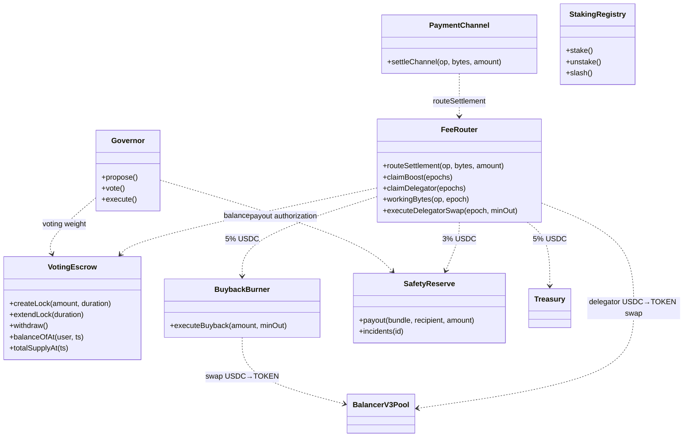
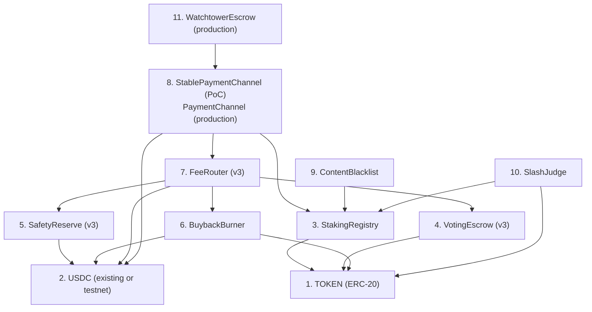
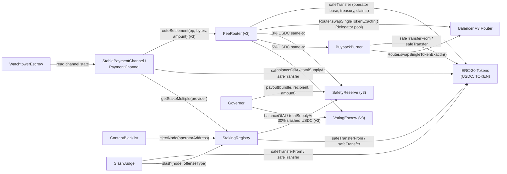
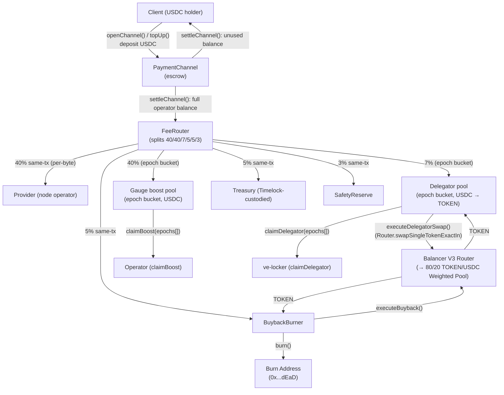
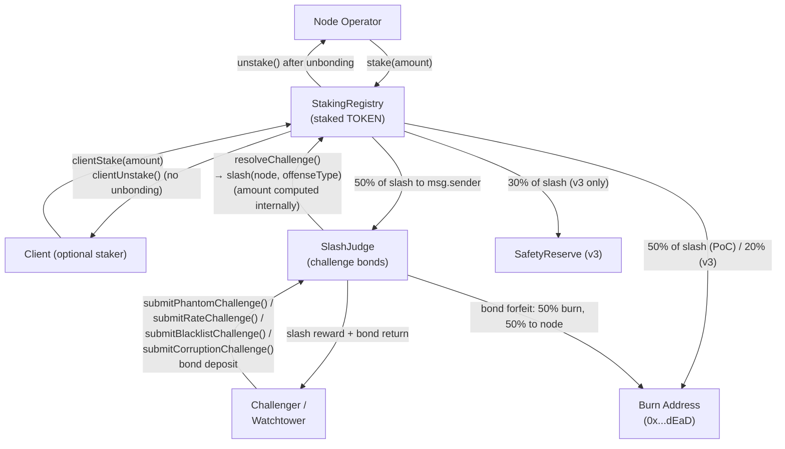

# ADR 016: Smart Contract Interaction Model

**Date:** 2026-04-04
**Status:** Draft

## Context

The deCDN deploys multiple interacting smart contracts with cross-contract calls, role-based access control, and funds custody. Individual contracts are specified across [ADR 003](003-payments.md), [ADR 004](004-tokenomics.md) (superseded by [ADR 026](026-gauge-boost-tokenomics.md)), [ADR 007](007-watchtower.md), [ADR 009](009-governance.md), [ADR 010](010-multi-token.md), [ADR 011](011-content-takedown.md), [ADR 014](014-on-chain-verification.md), and [ADR 026](026-gauge-boost-tokenomics.md). However, no single document maps the full interaction surface: who calls whom, which contracts hold funds, who is authorized to do what, and where reentrancy risks exist.

This ADR consolidates that analysis into a single reference for security audits and implementation. It does not introduce new functionality — it systematizes what other ADRs already specify.

> **Tokenomics v3 driver.** The contract surface in this ADR is materially expanded by [ADR 026 — Tokenomics v3](026-gauge-boost-tokenomics.md), which adds `FeeRouter`, `VotingEscrow`, and `SafetyReserve`, and rewires `PaymentChannel`, `StakingRegistry`, `BuybackBurner`, and `Governor`. Read ADR 026 first for the economic model; this ADR is the integration view.

## Decision

### 1. Contract Inventory

All on-chain contracts inherit from [OpenZeppelin Contracts](https://docs.openzeppelin.com/contracts/) to minimize custom security-critical code.

| Contract | ADR | Holds Funds | Token Types | OZ Base Contracts | Phase |
| --- | --- | --- | --- | --- | --- |
| TOKEN (ERC-20) | [004](004-tokenomics.md), [026](026-gauge-boost-tokenomics.md) | No (fungible token) | — | `ERC20`, `ERC20Permit` (recommended; enables gasless approvals) | PoC + Production |
| StakingRegistry | [003](003-payments.md), [004](004-tokenomics.md), [026](026-gauge-boost-tokenomics.md) | Yes | TOKEN | `AccessControl`, `ReentrancyGuard`, `Pausable` | PoC + Production |
| StablePaymentChannel | [003](003-payments.md) | Yes | USDC | `Ownable`, `ReentrancyGuard`, `Pausable`, `EIP712` | PoC only |
| PaymentChannel | [010](010-multi-token.md), [026](026-gauge-boost-tokenomics.md) | Yes | Governance-approved ERC-20s | `AccessControl`, `ReentrancyGuard`, `Pausable`, `EIP712` | Production only |
| FeeRouter | [026](026-gauge-boost-tokenomics.md) | Yes | USDC (transient + epoch buckets), TOKEN (delegator-pool epoch buckets) | `AccessControl`, `ReentrancyGuard`, `Pausable` | Production (v3 launch) |
| VotingEscrow | [026](026-gauge-boost-tokenomics.md) | Yes | TOKEN (locked, non-transferable) | `ReentrancyGuard`, `Pausable` | Production (v3 launch) |
| SafetyReserve | [026](026-gauge-boost-tokenomics.md) | Yes | USDC (3% bucket + slashing redirect) | `AccessControl`, `ReentrancyGuard`, `Pausable` | Production (v3 launch) |
| BuybackBurner | [004](004-tokenomics.md), [018](018-liquidity-strategy.md), [026](026-gauge-boost-tokenomics.md) | Yes | USDC, TOKEN (transient) | `AccessControl`, `ReentrancyGuard`, `Pausable` | PoC (accumulate-only) + Production |
| ContentBlacklist | [011](011-content-takedown.md) | No | — | `AccessControl`, `ReentrancyGuard` | PoC + Production |
| SlashJudge | [014](014-on-chain-verification.md) | Yes | TOKEN (challenge bonds) | `AccessControl`, `ReentrancyGuard`, `Pausable`, `EIP712` | PoC + Production |
| WatchtowerEscrow | [007](007-watchtower.md) | Yes | USDC | `ReentrancyGuard`, `Pausable`, `EIP712` | Production only |

**Deferred / optional contracts (forward-referenced):**

| Contract | ADR | Status |
| --- | --- | --- |
| DelegatorBuyer (or `BuybackBurner` multi-output extension) | [026](026-gauge-boost-tokenomics.md) §6 | Implementation choice deferred — either a parallel contract or a `BuybackBurner` mode performs the delegator-pool 7% USDC→TOKEN swap. Selected during v3 implementation. |
| SveToken (native liquid-ve wrapper) | future ADR 028 | Frax sfrxETH-style wrapper around `VotingEscrow` ve-positions. Deferred; targeted for ship within 6 months of mainnet to pre-empt third-party Convex-capture. |

#### Contract Architecture (v3, classDiagram)

The diagram below shows the v3 contract surface and its primary call relationships. Reproduced from [ADR 026](026-gauge-boost-tokenomics.md)'s source design spec §9.5 with the existing-ADR-016 contracts (`StakingRegistry`, `Governor`, etc.) included for orientation. `StakingRegistry` is unconnected on the fee-router path because it is independent of settlement — it governs slashable stake and is read by gossip / peer-validation logic ([ADR 001](001-network.md), [ADR 003](003-payments.md)) rather than by `FeeRouter`.



The full FeeRouter six-bucket split (40/40/7/5/5/3), epoch-bucket mechanics, and gauge-boost formula are specified in [ADR 026](026-gauge-boost-tokenomics.md) §2–§3; this ADR does not duplicate the bucket table.

**No proxy deployment patterns.** No deCDN contract uses proxy (upgradeable) deployment patterns. Production contract upgrades deploy new contracts at new addresses with state migration as described in Section 6. This constraint ensures that EIP-712 domain separators computed in constructors (as `immutable`) remain valid for the contract's lifetime — a proxy migration to a different address or chain would invalidate all existing voucher signatures.

**Build toolchain:** [Foundry](https://book.getfoundry.sh/) (forge, cast, anvil) for compilation, testing, and deployment.

### 2. Deployment Order and Initialization Dependencies

Contracts must be deployed in dependency order — each contract's constructor requires the addresses of contracts deployed before it.



#### Constructor Dependencies

| Step | Contract | Constructor Requires |
| --- | --- | --- |
| 1 | TOKEN | None. **PoC:** freely mintable testnet token with `onlyOwner` mint ([ADR 004](004-tokenomics.md)). **Production (v3):** fixed 1B supply, no mint function ([ADR 026](026-gauge-boost-tokenomics.md) §1). |
| 2 | USDC | External (testnet faucet or mainnet address) |
| 3 | StakingRegistry | TOKEN address, `minStake` (PoC 1,000 TOKEN; **v3 production: 50,000 TOKEN** per [ADR 026](026-gauge-boost-tokenomics.md) §7), `unbondingPeriod` (7 days). **v3:** discount-threshold parameters removed; the discounted-fee mechanic is replaced by the gauge-boost flow in `FeeRouter`. |
| 4 | VotingEscrow (v3 production) | TOKEN address, `minLockDuration` (1 week), `maxLockDuration` (4 years). No `create_lock_for` privileged path; auto-ve-lock removed in v3. Implements `balanceOfAt(user, ts)` and `totalSupplyAt(ts)` historical checkpointing ([ADR 026](026-gauge-boost-tokenomics.md) §4). |
| 5 | SafetyReserve (v3 production) | USDC address, Governor address (payout authorizer), emergency-multisig address (fast-track approver under hard caps), `appealWindow` (48h) ([ADR 026](026-gauge-boost-tokenomics.md) §5). |
| 6 | BuybackBurner | TOKEN address, USDC address, Balancer V3 Router address, initial pool contract `address` (may be zero-address at deploy and set later via `setPool(address)` — see [ADR 003](003-payments.md#buybackburner) for the interface and [ADR 018](018-liquidity-strategy.md) for the venue rationale). The pool address remains governance-mutable post-deploy via `setPool(address)`; the constructor value is an initial convenience, not a hard requirement. **v3 inflow source:** `FeeRouter` rather than manual treasury transfer ([ADR 026](026-gauge-boost-tokenomics.md) §8); the contract surface is otherwise unchanged. **Router naming note:** the canonical Router `0xEAedc32a51c510d35ebC11088fD5fF2b47aACF2E` is labelled `v3-router-v2` in the Balancer deployments registry — "v2" is the second iteration of the Balancer V3 Router artifact, NOT Balancer V2 protocol routing (see [ADR 018](018-liquidity-strategy.md#buyback-execution-via-balancer-v3)). **Approvals note:** `BuybackBurner` MUST self-approve the Balancer V3 **Vault** address (distinct from the Router) during its initialization — the Vault pulls input tokens from the `msg.sender` of the Router call, which is `BuybackBurner` itself. This is the V3 footgun; see [ADR 018](018-liquidity-strategy.md#buyback-execution-via-balancer-v3). |
| 7 | FeeRouter (v3 production) | USDC address, TOKEN address, VotingEscrow address, BuybackBurner address, SafetyReserve address, treasury wallet address, Balancer V3 Router + pool addresses (for the delegator-pool USDC→TOKEN swap; may share `BuybackBurner`'s configuration), `epochLength` (1 week), `claimWindow` (26 epochs), default split shares (40/40/7/5/5/3 per [ADR 026](026-gauge-boost-tokenomics.md) §2), and `boostFloor` (0.4) per [ADR 026](026-gauge-boost-tokenomics.md) §3. Sum-to-100% across the six router shares is enforced on every governance update. |
| 8a | StablePaymentChannel (PoC) | Constructor args: USDC address, `treasuryAddress`, `disputeWindow` (48h). Initialized in constructor body: StakingRegistry address, `feePercentage` (300 bps), `discountedFeePercentage` (150 bps), `maxChannelDuration` (90 days), rate bounds ([ADR 003](003-payments.md)) |
| 8b | PaymentChannel (v3 production) | StakingRegistry address, Governor address, **FeeRouter address** ([ADR 026](026-gauge-boost-tokenomics.md) §2). `settleChannel` no longer skims a protocol fee; it transfers the full operator USDC balance to `FeeRouter.routeSettlement(operator, bytesDelivered, amount)` in the same transaction. The `feePercentage` / `discountedFeePercentage` constructor arguments from the PoC contract are removed. |
| 9 | ContentBlacklist | `ContentBlacklist(address stakingRegistry)`. StakingRegistry address is required for `ejectNode()` cross-contract call. [ADR 011](011-content-takedown.md) describes the call but not the constructor interface; this ADR formalizes it. |
| 10 | SlashJudge | StakingRegistry address, TOKEN address, `challengeBond` (100 TOKEN PoC / 50 TOKEN production), `counterEvidenceWindow` (24h) |
| 11 | WatchtowerEscrow | StablePaymentChannel/PaymentChannel address, `heartbeatInterval`, `missThreshold`, `feeRateBps`, `minFee`, `monitoringPeriod` |

#### Post-Deployment Initialization

After all contracts are deployed, the deployer must execute these transactions before the system accepts user traffic:

1. **Grant `BLACKLIST_ROLE`** on StakingRegistry to ContentBlacklist:

   ```solidity
   stakingRegistry.grantRole(BLACKLIST_ROLE, address(contentBlacklist));
   ```

2. **Grant `SLASH_ROLE`** on StakingRegistry to SlashJudge:

   ```solidity
   stakingRegistry.grantRole(SLASH_ROLE, address(slashJudge));
   ```

   **v3:** also grant a slashing-redirect role so SlashJudge can route 30% of slashed stake to `SafetyReserve` per [ADR 026](026-gauge-boost-tokenomics.md) §8 (challenger 50% / SafetyReserve 30% / burn 20%); the address `SafetyReserve` becomes a recipient of slashed USDC (or TOKEN swapped via the existing Balancer V3 path — implementation choice deferred).

3. **(v3) Grant `ROUTER_CALLER_ROLE` on FeeRouter to PaymentChannel:**

   ```solidity
   feeRouter.grantRole(ROUTER_CALLER_ROLE, address(paymentChannel));
   ```

   This authorizes `PaymentChannel.settleChannel` to invoke `FeeRouter.routeSettlement(operator, bytesDelivered, amount)`. Without this grant the v3 settlement path reverts.

4. **(v3) Grant `SETTLEMENT_REPORTER_ROLE` on StakingRegistry to FeeRouter** (and to `PaymentChannel` if the bootstrap-ranking signal is sourced from settlement events):

   ```solidity
   stakingRegistry.grantRole(SETTLEMENT_REPORTER_ROLE, address(feeRouter));
   ```

   See §3 below; `lastSettlementAt[operator]` is updated on each `routeSettlement` call.

5. **Add initial token to PaymentChannel** (production only):

   ```solidity
   paymentChannel.addToken(USDC_ADDRESS, rateFloor, rateCeiling);
   ```

6. **Register regional governance bodies** (production, if applicable):

   ```solidity
   contentBlacklist.registerRegionalBody(regionCode, bodyAddress);
   ```

7. **Transfer admin roles** to Governor + timelock (production):

   ```solidity
   // For each contract with AccessControl:
   contract.grantRole(DEFAULT_ADMIN_ROLE, address(timelockController));
   contract.revokeRole(DEFAULT_ADMIN_ROLE, deployer);
   ```

> **Production hardening:** Production deployments SHOULD execute `grantRole(DEFAULT_ADMIN_ROLE, timelockController)` and `revokeRole(DEFAULT_ADMIN_ROLE, deployer)` in a single multicall transaction to minimize the dual-admin window between the two operations.

> **Deployment atomicity.** The post-deployment initialization steps (1–7) SHOULD be executed atomically via a multicall contract or a deployment script that reverts on any failure. A partially initialized system (e.g., `SLASH_ROLE` granted but `BLACKLIST_ROLE` not yet, or `ROUTER_CALLER_ROLE` not yet granted to `PaymentChannel`) could create a window where some security mechanisms work but settlements revert or land in the wrong contract. Between deployment and initialization completion, `StakingRegistry` SHOULD reject `registerNode` calls (e.g., via a `paused` initial state or a deployment flag) to prevent nodes from registering before the security infrastructure is fully wired. For the PoC, a Foundry deployment script with sequential `vm.broadcast()` calls provides sufficient atomicity.

### 3. Cross-Contract Call Graph



#### Complete Call Table

| Caller | Callee | Function | Authorization | Mutates Callee State |
| --- | --- | --- | --- | --- |
| StablePaymentChannel | StakingRegistry | `getStakeMultiple(provider)` | Public (read-only) | No |
| StablePaymentChannel | IERC20 (USDC) | `safeTransferFrom()` | Caller must have allowance | Yes |
| StablePaymentChannel | IERC20 (USDC) | `safeTransfer()` | Caller holds balance | Yes |
| PaymentChannel (v3) | StakingRegistry | `getStakeMultiple(provider)` | Public (read-only) | No |
| PaymentChannel (v3) | IERC20 (per-token) | `safeTransferFrom()` / `safeTransfer()` | Caller must have allowance/balance | Yes |
| PaymentChannel (v3) | FeeRouter | `routeSettlement(operator, bytesDelivered, amount)` | `ROUTER_CALLER_ROLE` on FeeRouter ([ADR 026](026-gauge-boost-tokenomics.md) §2) | Yes |
| FeeRouter (v3) | VotingEscrow | `balanceOfAt(user, ts)`, `totalSupplyAt(ts)` | Public (read-only) | No |
| FeeRouter (v3) | StakingRegistry | `recordSettlement(operator)` | `SETTLEMENT_REPORTER_ROLE` (granted to FeeRouter post-deploy; settlement counter moves with the routing call) | Yes |
| FeeRouter (v3) | BuybackBurner | `safeTransfer()` (5% USDC same-tx) | Caller holds balance | Yes |
| FeeRouter (v3) | SafetyReserve | `safeTransfer()` (3% USDC same-tx) | Caller holds balance | Yes |
| FeeRouter (v3) | Treasury wallet | `safeTransfer()` (5% USDC same-tx) | Caller holds balance | Yes |
| FeeRouter (v3) | IERC20 (USDC, TOKEN) | `safeTransfer()` (operator 40% base, claim payouts) | Caller holds balance | Yes |
| FeeRouter (v3) | Balancer V3 Router | `swapSingleTokenExactIn(...)` (delegator-pool USDC→TOKEN; may be delegated to a `DelegatorBuyer` or `BuybackBurner` extension) | Vault-scoped self-approval, `KEEPER_ROLE` for `executeDelegatorSwap` | Yes |
| Governor (v3) | VotingEscrow | `balanceOfAt(user, ts)`, `totalSupplyAt(ts)` | Public (read-only) | No |
| Governor (v3) | SafetyReserve | `payout(bundle, recipient, amount)` | `PAYOUT_AUTHORIZER_ROLE` (Governor + emergency-multisig within hard caps; [ADR 026](026-gauge-boost-tokenomics.md) §5) | Yes |
| ContentBlacklist | StakingRegistry | `ejectNode(operatorAddress)` | `BLACKLIST_ROLE` | Yes |
| SlashJudge | StakingRegistry | `slash(node, offenseType)` | `SLASH_ROLE` | Yes |
| SlashJudge | IERC20 (TOKEN) | `safeTransferFrom()` / `safeTransfer()` | Caller must have allowance/balance | Yes |
| StakingRegistry | IERC20 (TOKEN) | `safeTransferFrom()` / `safeTransfer()` | Caller must have allowance/balance | Yes |
| StakingRegistry (v3) | SafetyReserve | `safeTransfer()` (30% of slashed stake; the remaining 50% goes to the challenger and 20% burns per [ADR 026](026-gauge-boost-tokenomics.md) §8) | Caller holds balance | Yes |
| BuybackBurner | Balancer V3 Router | `swapSingleTokenExactIn(pool, tokenIn, tokenOut, exactAmountIn, minAmountOut, deadline, wethIsEth, userData)` | `BuybackBurner` self-approves the **Balancer V3 Vault** address (NOT the Router) during its initialization — the Vault pulls input tokens from the `msg.sender` of the Router call. This is the V3 footgun; see [ADR 018](018-liquidity-strategy.md#buyback-execution-via-balancer-v3) | Yes |
| BuybackBurner | IERC20 (USDC, TOKEN) | `safeTransferFrom()` / `safeTransfer()` | Caller must have allowance/balance | Yes |
| WatchtowerEscrow | StablePaymentChannel / PaymentChannel | Channel state reads | Public (read-only) | No |

**Note:** No contract calls governance functions on another deCDN contract. Cross-contract state mutations are limited to `ejectNode()`, `slash()`, `routeSettlement()`, `recordSettlement()`, and `payout()` — each protected by a dedicated role.

#### Off-Chain Read API (Client / Node Bootstrap)

The cross-contract call table above covers contract-to-contract interactions only. Off-chain components — clients and nodes — also need a stable set of view functions for cold-start peer discovery and live state inspection. These are specified in detail in the referenced ADRs but were not surfaced here, leaving room for them to be missed during contract scaffolding.

| Caller | Callee | Function | Used by | Reference |
| --- | --- | --- | --- | --- |
| Off-chain client/node | StakingRegistry | `getActiveNodeCount() returns (uint256)` | Bootstrap pagination loop | [ADR 001](001-network.md), [ADR 012](012-client.md), [ADR 019](019-node-onboarding.md) |
| Off-chain client/node | StakingRegistry | `getActiveNodes(uint256 offset, uint256 limit) returns (NodeInfo[])` | Cold-start peer discovery | [ADR 001](001-network.md), [ADR 012](012-client.md), [ADR 019](019-node-onboarding.md) |
| Off-chain client/node | StakingRegistry | `getFirstRegisteredAt(address ethAddress) returns (uint256)` | Reputation cold-start bonus window (`ethAddress` is the operator address that registered the node) | [ADR 001](001-network.md), [ADR 008](008-reputation.md), [ADR 019](019-node-onboarding.md) |

**Bootstrap pattern** (per [ADR 012 §Bootstrap](012-client.md#bootstrap-procedure)): paginated `getActiveNodes(offset, 100)` calls until a page returns fewer than `limit` results. For PoC scale (tens of nodes) a single call suffices; the pagination pattern is preserved so the same code works at production scale.

**Liveness caveat:** the registry is a cold-start *seed list*, not a liveness oracle. The chain has no liveness signal, so returned operators include staked-but-offline nodes. Clients filter to live peers via gossip (`NodeAnnounce` TTL) and probe RTT after bootstrap.

##### Settlement-Weighted Bootstrap Ranking

For a paid CDN, the registry exposes an on-chain signal stronger than registration order: **settlement activity**. Every `closeChannel` / `settleChannel` is on-chain proof that the operator served bytes to a paying client — backward-looking, expensive to fake (real counterparty paying real USDC), and already going on-chain via `StablePaymentChannel`. Clients use it to bias bootstrap toward proven deliverers; staked-but-dead nodes sink to the bottom but remain reachable.

Contract surface:

| Element | Purpose |
| --- | --- |
| `StakingRegistry.lastSettlementAt[operator]` (`uint64`) | Timestamp of last settlement; updated by `StablePaymentChannel` (PoC) or by `FeeRouter` on each `routeSettlement` (v3 production) |
| `SETTLEMENT_REPORTER_ROLE` on `StakingRegistry` | Granted to `StablePaymentChannel` (PoC) and to `FeeRouter` (v3 production) |
| `StakingRegistry.recordSettlement(operator)` | Single-purpose, role-gated; one SSTORE (~5K gas) |
| `getActiveNodes(...)` returns `(operator, nodeId, lastSettlementAt)` tuples | Raw signals, not policy — clients sort off-chain. Stake-tier callers can fetch `getStakeMultiple(operator)` per-node on demand. |

Design principles for forward compatibility:

1. **Return raw signals, not policy.** Surface timestamps + flags as views; let off-chain decide ranking. New ranking logic ships as client updates, not contract migrations.
2. **Region stays off-chain for now.** Region already lives in signed `NodeAnnounce` (gossip). Registry remains globally-flat; clients filter regionally via gossip after bootstrap. If on-chain regional sharding ever becomes necessary, it's an additive `bytes2 region => EnumerableSet` map — non-breaking.

Cold-start operators (`lastSettlementAt == 0`) sink to the bottom by recency but are not excluded — they get probed once early settlers are exhausted, settle their first channel, and rise. A short on-boarding grace window can be added in a follow-up if needed.

### 4. Fund Flow Diagrams

#### USDC Flow (Payments)

The PoC flow (`StablePaymentChannel` + manual treasury → buyback) is documented in [ADR 003](003-payments.md) and [ADR 004](004-tokenomics.md). The v3 production flow:



The canonical 40/40/7/5/5/3 split is in [ADR 026](026-gauge-boost-tokenomics.md) §2; this ADR does not duplicate the bucket table. Treasury disbursement requires a governance proposal ([ADR 009](009-governance.md)).

#### TOKEN Flow (Staking & Slashing)



**Slashing distribution by phase:**

| Destination | PoC ([ADR 004](004-tokenomics.md)) | v3 production ([ADR 026](026-gauge-boost-tokenomics.md) §8) |
| --- | ---: | ---: |
| Challenger reward | 50% | 50% |
| SafetyReserve | 0% | 30% |
| Burn | 50% | 20% |

#### Contracts Holding Funds Summary

| Contract | Token | Source | Release Condition |
| --- | --- | --- | --- |
| StablePaymentChannel / PaymentChannel | USDC (PoC) / approved ERC-20s (production) | Client deposits | `settleChannel()`, `reclaimExpired()`, `forceCloseChannel()` |
| FeeRouter (v3) | USDC (gauge + delegator epoch buckets, transient base/treasury/burn/safety legs); TOKEN (delegator-pool epoch buckets after USDC→TOKEN swap) | `PaymentChannel.settleChannel` | `claimBoost(epochs[])` (operators); `claimDelegator(epochs[])` (ve-lockers); same-tx forwards to BuybackBurner / Treasury / SafetyReserve / operator base (40%); 26-epoch claim window then sweep to treasury |
| VotingEscrow (v3) | TOKEN (locked, non-transferable) | User `createLock` deposits | `withdraw()` after lock expiry only; no early exit, no `create_lock_for` privileged path ([ADR 026](026-gauge-boost-tokenomics.md) §4) |
| SafetyReserve (v3) | USDC (3% router bucket + 30% slashing redirect) | `FeeRouter`, `StakingRegistry` slashing path | `payout(bundle, recipient, amount)` after evidence bundle, Governor (or emergency-multisig within hard caps), and 48h appeal window ([ADR 026](026-gauge-boost-tokenomics.md) §5) |
| StakingRegistry | TOKEN | Node operator stakes, client priority stakes | `unstake()` after unbonding (operators), `clientUnstake()` anytime (clients) |
| SlashJudge | TOKEN | Challenger bond deposits | `resolveChallenge()` (slash reward + bond return to challenger) or bond forfeiture |
| BuybackBurner | USDC (accumulated), TOKEN (transient) | PoC: treasury transfers. v3: 5% USDC same-tx from `FeeRouter` ([ADR 026](026-gauge-boost-tokenomics.md) §8) | `executeBuyback()` (production; accumulate-only in PoC) |
| WatchtowerEscrow | USDC | Prepaid watchtower fees | Heartbeat-based payouts, reclaim on liveness failure |

### 5. Access Control Matrix

All role-based access uses OpenZeppelin `AccessControl`. The `DEFAULT_ADMIN_ROLE` holder can grant and revoke all other roles. Named roles below (`KEEPER_ROLE`, `GOVERNANCE_ROLE`, `EMERGENCY_ROLE`) formalize the implicit access patterns described across source ADRs into concrete `AccessControl` role identifiers for implementation.

#### Role Assignments

| Role | Contract | Authorized Functions | PoC Holder | Production Holder |
| --- | --- | --- | --- | --- |
| `DEFAULT_ADMIN_ROLE` | All contracts | Grant/revoke roles, set parameters | Deployer EOA | `TimelockController` (2-day delay) |
| `BLACKLIST_ROLE` | StakingRegistry | `ejectNode()` | ContentBlacklist contract | ContentBlacklist contract |
| `SLASH_ROLE` | StakingRegistry | `slash()` | SlashJudge contract | SlashJudge contract |
| `SETTLEMENT_REPORTER_ROLE` | StakingRegistry | `recordSettlement(operator)` | StablePaymentChannel | FeeRouter (v3); see §3 |
| `KEEPER_ROLE` | BuybackBurner, FeeRouter (v3) | `executeBuyback()` (BB), `executeDelegatorSwap(epoch, minOut)` (FeeRouter) | Admin / disabled | Keeper bot or governance |
| `ROUTER_CALLER_ROLE` (v3) | FeeRouter | `routeSettlement(op, bytes, amount)` | n/a | PaymentChannel (and any future settlement-emitting contract) |
| `PAYOUT_AUTHORIZER_ROLE` (v3) | SafetyReserve | `payout(bundle, recipient, amount)` | n/a | Governor via timelock; emergency multisig within hard caps ([ADR 026](026-gauge-boost-tokenomics.md) §5) |
| `GOVERNANCE_ROLE` | ContentBlacklist, FeeRouter (v3 share parameters / `boostFloor`) | `addHash()`, `removeHash()`, `addOrigin()`, `removeOrigin()`, `registerRegionalBody()` (ContentBlacklist); `setShares(...)`, `setBoostFloor(...)` (FeeRouter) | Admin | Governor via timelock |
| `EMERGENCY_ROLE` | ContentBlacklist (emergency functions), fund-holding contracts (`pause()`), SafetyReserve (fast-track payout under hard caps) | `emergencyAdd()`, `emergencyAddOrigin()`, `suspendRegionalBody()` (ContentBlacklist); `pause()` (Pausable contracts only); `payout(...)` under hard caps (SafetyReserve) | Admin | 3-of-5 multisig (12-month sunset) |
| Regional body | ContentBlacklist | `addHashRegional(region)` | Not used in PoC | Per-jurisdiction multisig |

#### Governance-Controlled Parameters

Full parameter table with safety bounds is in [ADR 009](009-governance.md#governable-parameters-with-safety-bounds). Key bounds:

| Parameter | Min | Max | Contract |
| --- | --- | --- | --- |
| Protocol fee (PoC) | 0 bps | 2000 bps (20%) | StablePaymentChannel |
| Slash % per offense | 5% | 50% | StakingRegistry |
| Dispute window | 12h | 72h | StablePaymentChannel / PaymentChannel |
| Minimum stake (PoC) | 100 TOKEN | 100,000 TOKEN | StakingRegistry |
| **Minimum stake (v3 production)** | **50,000 TOKEN (default)** | **per [ADR 026](026-gauge-boost-tokenomics.md) §7** | **StakingRegistry — discount-threshold logic removed** |
| Challenge bond | 1 TOKEN | 1,000 TOKEN | SlashJudge (note: [ADR 009](009-governance.md) lists this under StakingRegistry; SlashJudge is correct per [ADR 014](014-on-chain-verification.md)) |
| Unbonding period | 3 days | 30 days | StakingRegistry |
| **VotingEscrow lock duration (v3)** | **1 week (min)** | **4 years (max)** | **VotingEscrow** (`immutable`) |

The six v3 FeeRouter shares (with their bounds and defaults) and `boostFloor` are governed in `FeeRouter` per [ADR 026 §11](026-gauge-boost-tokenomics.md#11-governable-parameters-with-safety-bounds); sum-to-100% across the six shares is enforced on every governance update. Other safety bounds are `immutable` — hardcoded in constructors, not overridable by governance or admin.

#### Emergency Multisig (Production)

- 3-of-5 threshold multisig
- Can pause fund-holding contracts (`Pausable.pause()`)
- Can add emergency blacklist entries (hashes and origins)
- Can suspend regional governance bodies
- **Cannot** withdraw treasury funds, modify fee parameters, or grant roles
- **12-month sunset:** All emergency functions revert after `block.timestamp > deployTimestamp + 365 days` ([ADR 009](009-governance.md#emergency-multisig))
- Emergency blacklist entries expire after 14 days unless ratified by governance

### 6. Reentrancy Analysis

Every state-mutating function that makes an external call is listed below with its guards and call pattern.

#### StablePaymentChannel / PaymentChannel

| Function | External Calls | Guards |
| --- | --- | --- |
| `openChannel()` | `IERC20.safeTransferFrom()`, `StakingRegistry.getStakeMultiple()` (read) | `nonReentrant`, checks-effects-interactions |
| `topUp()` | `IERC20.safeTransferFrom()` | `nonReentrant`, checks-effects-interactions |
| `settleChannel()` (PoC) | `IERC20.safeTransfer()` × 3 (provider, treasury, client) | `nonReentrant`, checks-effects-interactions |
| `settleChannel()` (v3 production) | `IERC20.safeTransfer()` (unused balance to client), `FeeRouter.routeSettlement(operator, bytesDelivered, amount)` (full operator balance forwarded; FeeRouter performs the six-way split internally) | `nonReentrant`, checks-effects-interactions; FeeRouter is `nonReentrant`-guarded on `routeSettlement` to defend against re-entry through the operator-base `safeTransfer` |
| `reclaimExpired()` | `IERC20.safeTransfer()` | `nonReentrant`, checks-effects-interactions |
| `forceCloseChannel()` | None (state change only) | N/A |

#### StakingRegistry

| Function | External Calls | Guards |
| --- | --- | --- |
| `stake()` | `IERC20.safeTransferFrom()` (TOKEN) | `nonReentrant`, checks-effects-interactions |
| `unstake()` | `IERC20.safeTransfer()` (TOKEN) | `nonReentrant`, checks-effects-interactions |
| `clientStake()` | `IERC20.safeTransferFrom()` (TOKEN) | `nonReentrant`, checks-effects-interactions |
| `clientUnstake()` | `IERC20.safeTransfer()` (TOKEN) | `nonReentrant`, checks-effects-interactions |
| `slash()` (PoC) | `IERC20.safeTransfer()` (TOKEN, 50% to `msg.sender` i.e. SlashJudge), burn (50%) | `nonReentrant`, checks-effects-interactions, `SLASH_ROLE` |
| `slash()` (v3) | `IERC20.safeTransfer()` (TOKEN: 50% challenger / 30% SafetyReserve / 20% burn per [ADR 026](026-gauge-boost-tokenomics.md) §8) | `nonReentrant`, checks-effects-interactions, `SLASH_ROLE` |
| `recordSettlement(operator)` (v3) | None (single SSTORE) | `SETTLEMENT_REPORTER_ROLE` |
| `ejectNode()` | None (state change only) | `BLACKLIST_ROLE` |
| `getStakeMultiple()` | None (read-only) | N/A |

#### SlashJudge

| Function | External Calls | Guards |
| --- | --- | --- |
| `submitPhantomChallenge()` | `IERC20.safeTransferFrom()` (TOKEN bond deposit) | `nonReentrant`, checks-effects-interactions |
| `submitRateChallenge()` | `IERC20.safeTransferFrom()` (TOKEN bond deposit) | `nonReentrant`, checks-effects-interactions |
| `submitBlacklistChallenge()` | `IERC20.safeTransferFrom()` (TOKEN bond deposit), `ContentBlacklist.getEntry()` (read) | `nonReentrant`, checks-effects-interactions |
| `submitCorruptionChallenge()` | `IERC20.safeTransferFrom()` (TOKEN bond deposit) | `nonReentrant`, checks-effects-interactions |
| `counterChallenge()` | `IERC20.safeTransfer()` (bond forfeit: 50% burn, 50% to node) | `nonReentrant`, checks-effects-interactions |
| `resolveChallenge()` | `StakingRegistry.slash()`, `IERC20.safeTransfer()` (slash reward + bond return to challenger) | `nonReentrant`, checks-effects-interactions |

#### BuybackBurner

| Function | External Calls | Guards |
| --- | --- | --- |
| `executeBuyback()` | `BalancerV3Router.swapSingleTokenExactIn()` (swaps contract-held USDC; Router forwards to Vault which pulls input tokens via Vault-scoped allowance), `IERC20.safeTransfer()` (TOKEN to burn) | `nonReentrant`, checks-effects-interactions, `KEEPER_ROLE` |

> **MEV protection (production).** See [ADR 018 — Buyback execution via Balancer V3](018-liquidity-strategy.md#buyback-execution-via-balancer-v3) for the authoritative policy. In summary: Balancer's weighted-pool curve reduces (but does not eliminate) price-impact concerns compared to concentrated liquidity, and `executeBuyback` MAY split large buybacks into `subSwapCount` sub-swaps spaced by `subSwapMinBlockGap` blocks. **Direct Router execution with TWAP + `minTokenOut` guards is the primary production path and the required fallback.** Routing through CoW Swap is a conditional add-on that requires operator verification of CoW solver routing against the deployed Balancer V3 pool (per ADR 018's activation criteria); if CoW routing is unavailable or regresses, direct Router + TWAP remains correct. The `maxBuybackAmount` parameter MUST be enforced to limit per-transaction MEV exposure regardless of venue.

> **v3 inflow source.** Under [ADR 026](026-gauge-boost-tokenomics.md) §8, `BuybackBurner` no longer receives USDC via manual treasury transfer — it receives 5% of every settlement same-tx from `FeeRouter`. Inflow rate is ~8× higher per unit network revenue (5% of 100% vs ADR 004's 20% × 3% = 0.6% effective). The `executeBuyback` mechanics, `KEEPER_ROLE`-gating, and Vault-scoped self-approval pattern are unchanged.

#### FeeRouter (v3 production)

| Function | External Calls | Guards |
| --- | --- | --- |
| `routeSettlement(operator, bytesDelivered, amount)` | `IERC20.safeTransfer()` × 5 (operator base 40%, BuybackBurner 5%, Treasury 5%, SafetyReserve 3%; gauge 40% and delegator 7% retained in epoch buckets), `StakingRegistry.recordSettlement(operator)` | `nonReentrant`, checks-effects-interactions, `ROUTER_CALLER_ROLE` |
| `claimBoost(epochs[])` | `IERC20.safeTransfer()` (USDC to claiming operator), `VotingEscrow.balanceOfAt(...)` × N epochs (read), `VotingEscrow.totalSupplyAt(...)` × N epochs (read) | `nonReentrant`, checks-effects-interactions; epoch must be finalized |
| `claimDelegator(epochs[])` | `IERC20.safeTransfer()` (TOKEN to claiming ve-locker), `VotingEscrow.balanceOfAt(...)` × N (read), `VotingEscrow.totalSupplyAt(...)` × N (read) | `nonReentrant`, checks-effects-interactions; epoch's delegator-pool USDC→TOKEN swap must be settled |
| `executeDelegatorSwap(epoch, minOut)` | `BalancerV3Router.swapSingleTokenExactIn()` (Vault-scoped self-approval, same V3 footgun pattern as `BuybackBurner`) | `nonReentrant`, checks-effects-interactions, `KEEPER_ROLE`; per-epoch liquidity caps and TWAP-window guards REQUIRED ([ADR 026](026-gauge-boost-tokenomics.md) §6) |
| `setShares(...)`, `setBoostFloor(...)` | None (state change only) | `GOVERNANCE_ROLE` (Governor via timelock); sum-to-100% across the six router shares enforced; per-share bounds enforced ([ADR 026](026-gauge-boost-tokenomics.md) §11) |
| `sweepUnclaimed(epoch)` | `IERC20.safeTransfer()` (USDC/TOKEN to treasury) | `nonReentrant`, checks-effects-interactions; only callable after the 26-epoch claim window expires |

> **Cashflow invariant.** The 20% lower bound on the node-base share is `immutable` and guarantees operators always receive enough liquid USDC to cover at least a meaningful fraction of infrastructure costs even under extreme governance proposals. See [ADR 026](026-gauge-boost-tokenomics.md) §11.

#### VotingEscrow (v3 production)

| Function | External Calls | Guards |
| --- | --- | --- |
| `createLock(amount, duration)` | `IERC20.safeTransferFrom()` (TOKEN) | `nonReentrant`, checks-effects-interactions; `duration ∈ [1 week, 4 years]` (`immutable` bounds) |
| `extendLock(duration)` | None (state change only) | `nonReentrant`; new expiry capped at `now + 4 years`; lock shortening NOT allowed |
| `withdraw()` | `IERC20.safeTransfer()` (TOKEN) | `nonReentrant`, checks-effects-interactions; only callable after lock expiry; **no early-exit penalty path** |
| `balanceOfAt(user, ts)`, `totalSupplyAt(ts)` | None (read-only; per-lock checkpoint binary search) | N/A |

> **No `create_lock_for` privileged path.** Auto-ve-lock-on-vest is removed in v3 ([ADR 026](026-gauge-boost-tokenomics.md) §1, §4). All ve-positions are voluntarily created by the locker. **No slashing path on ve-locked TOKEN** — the slashing-immunity invariant is enforced by the absence of any `slash` / `burn` / `sweep` entry point on `VotingEscrow`. Operator stake (slashable) lives in `StakingRegistry`; ve-positions (non-slashable) live here. An operator may hold any combination but the contracts never share state.

#### SafetyReserve (v3 production)

| Function | External Calls | Guards |
| --- | --- | --- |
| `payout(bundle, recipient, amount)` | `IERC20.safeTransfer()` (USDC to recipient) | `nonReentrant`, checks-effects-interactions, `PAYOUT_AUTHORIZER_ROLE` (Governor via timelock; emergency multisig under hard caps); attested incident bundle REQUIRED; 48h appeal window REQUIRED before disbursement; post-incident registry write atomic with disbursement ([ADR 026](026-gauge-boost-tokenomics.md) §5) |
| `recordIncident(bundle)` | None (event + storage write) | Public; bundle signature verified against attestor allowlist |
| `challengeIncident(id, evidence)` | None (storage write) | Public during 48h appeal window; valid challenge pauses disbursement pending Governor resolution |

> **Spending control invariant.** No path on `SafetyReserve` exists for unattested or non-Governor-authorized payouts. The four-gate check (evidence bundle + Governor or emergency-multisig within hard caps + 48h appeal + post-incident registry write) is enforced atomically inside `payout`; partial paths revert.

#### WatchtowerEscrow

| Function | External Calls | Guards |
| --- | --- | --- |
| `depositFee()` | `IERC20.safeTransferFrom()` (USDC fee deposit) | `nonReentrant`, checks-effects-interactions |
| `submitHeartbeat()` | None (state change only) | N/A |
| `claimFees()` | `IERC20.safeTransfer()` (USDC to watchtower) | `nonReentrant`, checks-effects-interactions |
| `reclaimOnLivenessFailure()` | `IERC20.safeTransfer()` (USDC to watched party) | `nonReentrant`, checks-effects-interactions |
| Channel state reads | `StablePaymentChannel`/`PaymentChannel.getChannel()` (read-only) | N/A |

#### Multi-Token Reentrancy Considerations

Production `PaymentChannel` accepts arbitrary governance-approved ERC-20s ([ADR 010](010-multi-token.md)). Even with `SafeERC20` and `nonReentrant`, governance must vet tokens before allowlisting:

- **Reject:** Fee-on-transfer tokens, rebase tokens, pausable tokens, tokens with transfer hooks (ERC-777) that could re-enter
- **Accept:** Standard IERC20 tokens with no callback mechanisms
- **Mitigations in contract code:** `nonReentrant` blocks all re-entry regardless of token behavior; `SafeERC20` handles non-reverting transfers and missing return values

All ERC-20 interactions use OpenZeppelin `SafeERC20` to handle non-standard token implementations ([ADR 003](003-payments.md), [ADR 010](010-multi-token.md)).

### 7. OpenZeppelin Framework Usage

Every deCDN contract should inherit from audited OpenZeppelin base contracts rather than implementing security primitives from scratch.

| OZ Contract | Used By | Purpose |
| --- | --- | --- |
| `Ownable` | StablePaymentChannel (PoC) | Admin-key governance for PoC-only contract |
| `AccessControl` | StakingRegistry, PaymentChannel, ContentBlacklist, SlashJudge, BuybackBurner, FeeRouter (v3), SafetyReserve (v3) | Role-based function authorization |
| `ReentrancyGuard` | All fund-holding contracts | `nonReentrant` modifier on state-mutating functions with external calls |
| `Pausable` | All fund-holding contracts | Emergency pause capability |
| `SafeERC20` | All contracts interacting with ERC-20 tokens | Safe wrappers for `transfer`, `transferFrom`, `approve` |
| `EIP712` | StablePaymentChannel, PaymentChannel, SlashJudge, WatchtowerEscrow, SafetyReserve (v3, for attested incident bundles) | Domain separator for voucher/slash/heartbeat/incident-bundle signature verification |
| `SignatureChecker` | StablePaymentChannel, PaymentChannel, StakingRegistry, SlashJudge, SafetyReserve (v3) | Unified EOA + ERC-1271 smart account signature verification ([ADR 024](024-account-abstraction.md)) |
| `ERC20` + `ERC20Permit` | TOKEN | Standard fungible token with gasless approvals |
| `Governor` | Production governance | Token-weighted voting (v3: voting weight sourced from `VotingEscrow.balanceOfAt` rather than `TOKEN.getPastVotes`) |
| `GovernorVotes` | Production governance | **PoC/ADR 004:** TOKEN as voting token. **v3:** replaced by a `VotingEscrow`-backed vote source per [ADR 026](026-gauge-boost-tokenomics.md) §9 |
| `GovernorTimelockControl` | Production governance | 2-day timelock on parameter changes |
| `TimelockController` | Production governance | Queued execution of governance proposals; custodian of v3 protocol-treasury 5% bucket |

**Rationale:** OpenZeppelin Contracts are the most widely audited Solidity library, used by the majority of production DeFi protocols. Using audited primitives for access control, reentrancy protection, token handling, and governance eliminates entire classes of implementation bugs and reduces the surface area that a security audit must cover to deCDN-specific business logic.

### 8. PoC vs Production Contract Topology

| Aspect | PoC | Production (v3) |
| --- | --- | --- |
| Payment contract | `StablePaymentChannel` (USDC only) | `PaymentChannel` (multi-token allowlist), routes full operator balance to `FeeRouter` |
| Settlement-fee mechanic | Skim at settlement contract (3% / 1.5% discounted) | `FeeRouter` six-bucket split (40/40/7/5/5/3) per [ADR 026](026-gauge-boost-tokenomics.md) §2 |
| FeeRouter | Not deployed | Deployed; epoch buckets, claim-based gauge / delegator pools |
| VotingEscrow | Not deployed | Deployed; voluntary ve-locking, no `create_lock_for` |
| SafetyReserve | Not deployed | Deployed; receives 3% router bucket + 30% slashing redirect; payouts gated per [ADR 026](026-gauge-boost-tokenomics.md) §5 |
| Governance | Admin key (single EOA) | OpenZeppelin Governor + 2-day timelock; voting weight = `VotingEscrow.balanceOfAt` |
| Emergency multisig | Admin key | 3-of-5 multisig with 12-month sunset (also fast-track SafetyReserve payouts under hard caps) |
| BuybackBurner | Accumulate-only (execution disabled) | Active (keeper or governance triggered); inflow from `FeeRouter` (5% same-tx) rather than manual treasury transfer |
| WatchtowerEscrow | Not deployed | Deployed |
| TOKEN minting | `onlyOwner` mint for testnet flexibility | No mint function; fixed 1B supply |
| Minimum stake | 1,000 TOKEN | 50,000 TOKEN ([ADR 026](026-gauge-boost-tokenomics.md) §7); discount-threshold logic removed |
| Slashing distribution | 50% challenger / 50% burn | 50% challenger / 30% SafetyReserve / 20% burn ([ADR 026](026-gauge-boost-tokenomics.md) §8) |
| Regional bodies | Not used | Jurisdiction-scoped multisigs |
| Contract migration | N/A | New `PaymentChannel` + v3 contracts deployed; PoC `StablePaymentChannel` decommissioned |

**Migration path:** Production deploys a new `PaymentChannel` contract (not an upgrade of `StablePaymentChannel`). Per [ADR 010](010-multi-token.md), no phased migration is required because the PoC `StablePaymentChannel` has no real users or funds in production; the PoC contract is decommissioned rather than operated in a close-only mode alongside `PaymentChannel`.

## Consequences

**Positive:**

- Single reference document for all contract interactions, reducing audit scope ambiguity
- Explicit deployment order prevents initialization-order bugs
- Access control matrix makes privilege escalation paths visible and auditable
- OZ base contract prescriptions eliminate classes of implementation bugs before code is written

**Negative:**

- Must be kept in sync as other ADRs evolve — any change to contract interfaces in ADRs 003, 004, 007, 009, 010, 011, 014, or 026 requires updating this document
- Does not cover off-chain interaction patterns (voucher exchange, gossip, probing) — those remain in their respective ADRs
- v3 surface adds three new fund-holding contracts (`FeeRouter`, `VotingEscrow`, `SafetyReserve`) plus optional `DelegatorBuyer`, materially expanding audit scope vs the ADR 004 baseline

## References

- [ADR 003 — Payment Model](003-payments.md): StablePaymentChannel specification, v3 `PaymentChannel.settleChannel` → `FeeRouter` routing
- [ADR 004 — Dual-Currency Token Model](004-tokenomics.md) (superseded by ADR 026): StakingRegistry, BuybackBurner, slashing schedule
- [ADR 007 — Watchtower Design](007-watchtower.md): WatchtowerEscrow
- [ADR 009 — Governance Model](009-governance.md): Safety bounds, Governor, emergency multisig
- [ADR 010 — Multi-Token Payment Support](010-multi-token.md): PaymentChannel, token allowlist
- [ADR 011 — Content Takedown](011-content-takedown.md): ContentBlacklist, origin ejection
- [ADR 014 — On-Chain Verification](014-on-chain-verification.md): SlashJudge, challenge bonds
- [ADR 018 — Liquidity Strategy](018-liquidity-strategy.md): Balancer V3 80/20 pool, MEV protection, POL custody, BuybackBurner execution
- [ADR 026 — Tokenomics v3 (Gauge-Boost Design)](026-gauge-boost-tokenomics.md): FeeRouter six-bucket split, VotingEscrow, SafetyReserve, gauge-boost formula, v3 slashing distribution
- [OpenZeppelin Contracts](https://docs.openzeppelin.com/contracts/): Base contract framework
