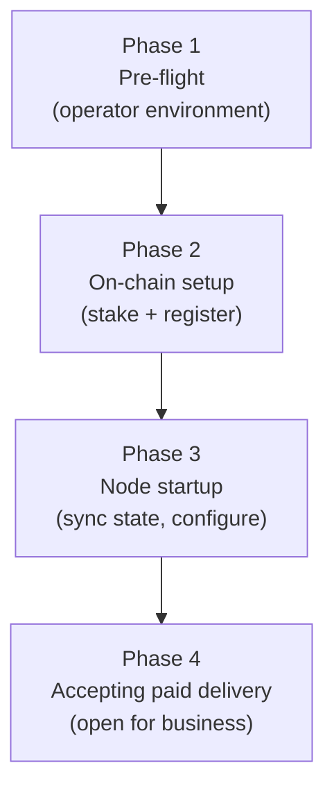

# ADR 019: Node Onboarding and Bootstrapping Flow

**Date:** 2026-04-08
**Status:** Draft

## Context

Existing ADRs specify individual node-lifecycle components in isolation — staking in [ADR 026](026-tokenomics.md#adr-026-tokenomics), on-chain registration in [ADR 001](001-network.md#adr-001-network-topology-and-peer-mesh), payment channel bindings in [ADR 003](003-payments.md#adr-003-payment-model), blacklist sync in [ADR 011](011-content-takedown.md#adr-011-content-takedown-and-hash-blacklisting), contract deployment order in [ADR 016](016-contract-interactions.md#adr-016-smart-contract-interaction-model). No single document describes the complete ordered procedure from "operator has a server" to "actively accepting paid delivery requests."

This blocks PoC testnet participation: operators have no canonical reference, and missing or mis-ordered steps produce silent protocol failures (probe and slash timestamps rejected because the clock is unsynchronized; connections refused because the blacklist was not fetched). This ADR defines the authoritative onboarding flow.

## Decision

Node onboarding proceeds in four sequential phases. A node MUST NOT advance to the next phase until all MUST-level requirements of the current phase are satisfied.



### Phase 1 — Pre-flight (Operator Environment)

Before any on-chain or protocol activity:

1. **Provision server.** Minimum recommended spec: 4 vCPU, 8 GB RAM, 1 TB SSD, 5 TB/month egress. See [ADR 026 § Operator economics](026-tokenomics.md#operator-economics) for operator economics.

2. **Synchronize clock.** The node MUST run NTP (or equivalent) and MUST verify the local clock offset is within 10 seconds of UTC before proceeding. A correct clock underpins voucher freshness and the probe and slashing timestamp windows: vouchers carry timestamps, and probe-derived slash evidence is bounded by a maximum evidence age ([ADR 005](005-protocol.md#adr-005-wire-protocol), [ADR 014](014-on-chain-verification.md#adr-014-on-chain-verification-for-slashing-evidence)). A skewed clock produces stale vouchers and out-of-window slash timestamps.

3. **Generate iroh identity.** Run the node binary's `keys generate` (or equivalent) subcommand. This produces an **ed25519 key pair** whose public key is the iroh `NodeId`. The private key MUST be stored securely:
   - **PoC:** encrypted file on disk (passphrase-protected or operator-managed).
   - **Production:** platform keychain or HSM. See [ADR 012](012-client.md#adr-012-client-architecture-bootstrap-and-trust-model) for key management guidance (the same tiers apply to node keys).

4. **Prepare Ethereum key.** The operator needs an Ethereum address (`ethAddress`) with sufficient funds:
   - **TOKEN:** at minimum **`k × declared_Mbps^α`** for the capacity bond ([ADR 026 § Capacity-bond curve](026-tokenomics.md#capacity-bond-curve)). At defaults `k=12.6`, `α=1.2`: ~50K TOKEN for a 1 Gbps tier, ~795K TOKEN for 10 Gbps, ~12.6M TOKEN for 100 Gbps. Declared capacity must be at least `MIN_CAPACITY_PER_OPERATOR` (default 10 Mbps, ~200 TOKEN); a declaration below the floor reverts. There is no discount-stake threshold; operators do not earn additional yield by bonding above their declared capacity. Operators lacking the entry-tier bond may qualify for externally-funded operator-onboarding programs (see [ADR 026 § Bootstrap mechanism — pre-seed USDC](026-tokenomics.md#bootstrap-mechanism--pre-seed-usdc)).
   - **Native gas token:** ~$0.50–$1.00 for the Phase 2 transactions at typical L2 gas prices.
   - **Optional USDC:** only required if the operator intends to open outbound payment pools immediately (e.g., to pay origin-backed nodes for cache-miss pulls). Clients open pools that pay the node without any USDC on the node side.

   - **Wallet, gas sponsorship, and session keys.** A plain EOA keystore is the documented default, and it is the only wallet that can sign `slash_sig` acceptably today — a paying client verifies the `StreamResponse` signature off-chain by recovering the signer against the node's registered address, so a Safe-addressed operator cannot complete a paid delivery. Production migrates the operator wallet to a Safe (2-of-3) with ERC-7579 session keys for the high-frequency `slash_sig` signing path and an ERC-4337 paymaster for gas-in-USDC; see [ADR 024](024-account-abstraction.md#adr-024-account-abstraction-and-safe-smart-wallet-support) for the full design and the [Operator Key-Rotation Runbook](appendix-operator-key-rotation.md#appendix-operator-key-rotation-runbook) for the optional EOA → Safe migration and its constraints.

5. **Choose region.** Determine the ISO 3166-1 alpha-2 country code best representing the node's physical location. Self-reported, accepted at face value as the production posture ([ADR 001](001-network.md#adr-001-network-topology-and-peer-mesh), [ADR 011](011-content-takedown.md#adr-011-content-takedown-and-hash-blacklisting), [ADR 030](030-node-region-self-attestation.md#adr-030-node-region-self-attestation)). Submitted on-chain as `regionHint` — it determines which regional blacklists the node must enforce.

6. **Configure origin backend (optional).** If the node will act as an origin-backed
   node (serving specific content from S3/R2/B2/NFS/local disk), configure backend
   credentials and content set before proceeding. Cache-only serving is permissionless
   at the protocol layer — any staked node may serve cached blobs and pass them on for
   payment. To be recognised as an *authorized origin* for a registered namespace, the
   namespace's publisher must seat the operator via `OriginAssignment.addOrigin`, which
   requires the publisher itself to have been vetted by governance ([ADR 011 § Origin Assignment Authority](011-content-takedown.md#origin-assignment-authority)).
   Content served under namespace 0 (`namespaceId == 0`) has no origin role — no operator can be an
   authorized origin for it (see
   [ADR 011 § Namespace 0](011-content-takedown.md#namespace-0)).
   These steps run on the publisher's or governance's timeline, independent of node
   onboarding.

---

### Phase 2 — On-chain Setup

All transactions must be confirmed on-chain before proceeding to Phase 3.

#### Optional: funding the bond via USDC swap

Steps 2.1–2.2 assume the operator already holds TOKEN. `decdn setup` also accepts `--pay-bond-with usdc` (default `token`) for operators who would rather bring USDC instead. In USDC mode, `setup` acquires the bond shortfall — `bond_required(declaredMbps)` less TOKEN already held — through an exact-out USDC→TOKEN swap on a config-selected venue (`uniswap-v3` or `balancer-v3`) before submitting the approve and bond transactions below. `--max-slippage-bps` (default 300) bounds the swap's `amountInMaximum` alongside a swap deadline; if the venue's execution price impact exceeds 300 bps, the operator is warned and must confirm before the swap proceeds. The swap and the bond deposit remain separate transactions: a bond call that fails after a successful swap leaves the operator holding the swapped TOKEN, and re-running `setup` swaps nothing further, retrying only the bond step. `setup` submits no privileged transaction in either mode — the swap, like the approve and bond calls it precedes, is a standard self-custodial transaction the operator signs.

#### Step 2.1 — Approve TOKEN transfer

Call `TOKEN.approve(capacityBond, amount)` where `amount ≥ bond_required(declared_Mbps)` per the curve `bond = k × Mbps^α` ([ADR 026 § Capacity-bond curve](026-tokenomics.md#capacity-bond-curve)). This ERC-20 approval authorizes `CapacityBond` to pull the bond deposit.

**Gas:** ~$0.03 (one-time; re-registrations reuse the allowance if set high enough).

#### Step 2.2 — Register at declared capacity

Call `CapacityBond.bond(bond_required(declaredMbps))` to deposit `bond_required(declaredMbps)` TOKEN, then `CapacityBond.declareMbps(declaredMbps)` to self-attest capacity (the band check lives on `declareMbps`). `declaredMbps` must fall within `[MIN_CAPACITY_PER_OPERATOR, MAX_CAPACITY_PER_OPERATOR]` (default `[10 Mbps, 200 Gbps]`); a declaration outside the band reverts. Declared capacity is operator-self-attested at registration; there is no on-chain verification against actual delivery (vote weight is sourced from `FeeRouter.bytesInWindow` per [ADR 036](036-served-bytes-voting-weight.md#adr-036-served-bytes-voting-weight), not from `declaredMbps`, so over-declaration provides no governance upside; the super-linear bond curve is the structural disincentive). Changing tiers is permitted at any time by re-calling `declareMbps(newMbps)` — topping up bond via `bond(...)` or reducing it via `requestUnbond(amount)` + `unbond()` after the unbonding window. There is no atomic `register`-style deposit/refund on the shipped surface; a bond reduction is subject to the 14-day unbonding window.

The bond locks immediately and is slashable from this point forward, including during the **14-day unbonding window** if the node later unbonds ([ADR 026 § Capacity-bond curve](026-tokenomics.md#capacity-bond-curve)).

**No separate ve-position exists.** The bond is the only TOKEN-side requirement on operators. There is no optional lock for additional yield; non-operator TOKEN holders earn nothing and have no governance weight ([ADR 026 § Governance](026-tokenomics.md#governance)).

**Gas:** ~$0.05.

#### Step 2.3 — Register node

Call `CapacityBond.registerNode(nodeId, multiaddrs, regionHint, termsHash, bindingSignature, ed25519Signature)`.

This single transaction atomically:

- Requires `termsHash == currentTermsHash` and verifies the EIP-712 `bindingSignature` over `RegisterNode(nodeId, bindingNonce[ethAddress], termsHash)`, establishing the `nodeId → ethAddress` mapping for slash evidence and payment attribution and recording the operator's terms acceptance ([§ Operator Safety Obligations](#operator-safety-obligations)).
- Verifies the `ed25519Signature` over `keccak256(abi.encodePacked(nodeId, ethAddress, chainId, registrationNonce[nodeId]))`, proving the operator controls the iroh private key (prevents NodeId squatting). (`ethAddress` is `msg.sender` and `chainId` is `block.chainid` on-chain; this ADR uses operator-perspective names for consistency with the signing pseudo-code below.)
- Records `NodeInfo` (including `firstBondedAt` if this is the node's first-ever registration — the immutable anchor of the operator's `age_ramp` governance weight per [ADR 026 § Governance](026-tokenomics.md#governance)).
- Sets `active = true` in the registry.
- Emits `TermsAccepted(nodeId, termsHash, timestamp)`.

**Constructing `multiaddrs`:** The iroh `Endpoint` is not yet bound in Phase 2, so hole-punched addresses are unavailable at registration time:

- **Direct-address nodes (known public IP/port):** provide the stable QUIC address.
- **NAT'd nodes:** register with the iroh relay address as a placeholder (`quic-v1/relay/<relay-url>`). After Phase 3 binds the endpoint and iroh establishes relay connectivity, call `updateMultiaddrs` with the actual `Endpoint::direct_addresses()` values. The relay address keeps the node reachable in the interim.

See [NAT and Multiaddr Handling](#nat-and-multiaddr-handling) below for the full relay → direct address promotion flow.

**Constructing signatures:**

```
bindingSignature = EIP-712 sign(ethKey, RegisterNode { nodeId, nonce: bindingNonce[ethAddress], termsHash })
ed25519Signature = ed25519 sign(nodePrivKey,
                    keccak256(abi.encodePacked(nodeId, ethAddress, chainId, registrationNonce[nodeId])))
```

Both signing operations are supported by the `decdn` CLI (`decdn node register` prints the required parameters, signs locally, submits the transaction). The binding signature covers `termsHash`, so registration records the operator's acceptance of the current operator terms in the same signature — see [§ Operator Safety Obligations](#operator-safety-obligations). `registerNode` requires `termsHash == currentTermsHash` and emits `TermsAccepted(nodeId, termsHash, timestamp)` ([ADR 003 § NodeId Binding](003-payments.md#nodeid-to-ethereum-binding)). Rebinding a NodeId later (`bindNodeId`, key rotation) signs the narrower `BindNodeId` payload and carries no `termsHash`.

**Gas:** ~$0.26–$0.46 (includes on-chain ed25519 verification via Solidity library; one-time per node lifetime).

**Emitted events:** `NodeRegistered`, `NodeIdBound` — off-chain indexers and other nodes' registry caches reflect the new node within one sub-second L2 block.

### Phase 3 — Node Startup (State Synchronization)

The node process MUST complete all of the following steps before opening any QUIC listener or accepting incoming connections.

#### Step 3.1 — Fetch the rate floor

Call `PaymentPool.getRateBounds()`. Verify that `deliveryFloor` fits in `u64` (see [ADR 003 § Startup](003-payments.md#rate-bounds-refresh)). If it exceeds `u64::MAX`, the node MUST refuse to start and log an error.

The node SHOULD subscribe to on-chain `RateBoundsUpdated` events for real-time updates. Periodic polling (`rate_bounds_poll_interval`, default 1 hour) is the fallback ([ADR 003](003-payments.md#adr-003-payment-model)).

#### Step 3.2 — Sync content blacklist

Enumerate the full current deny-set from the `ContentBlacklist` contract at a single pinned block — the blacklisted address union (`blacklistedAddresses`, kept to the live members of `isOriginBlacklisted || isOperatorBlacklisted`) and the node's in-scope hashes (`getScopeRegions` then `blacklistedHashes` per region, liveness-filtered by `isHashBlacklistedForOperator`). The node MUST NOT accept connections until this enumeration completes successfully ([ADR 011](011-content-takedown.md#enumerating-the-deny-set)).

After the initial enumeration, the node follows the contract's blacklist events for live updates and periodically re-enumerates as the backstop. There is no version checkpoint to record: every boot rebuilds the complete deny-set, so a node returning from any downtime is immediately current.

#### Step 3.3 — Build initial node view from on-chain registry

Query `CapacityBond.getRegisteredNodes(offset=0, limit=100)` to bootstrap the local node view. For PoC (tens of nodes) a single call suffices; for larger networks, paginate until all active nodes are fetched.

This registry snapshot is the initial node view. The node subscribes to `NodeRegistered`, `NodeMultiaddrUpdated`, `NodeDeregistered`, and `NodeAutoEjected` events to keep the view fresh ([ADR 001 § Node Discovery (Registry)](001-network.md#node-discovery-registry)).

If the RPC endpoint is unavailable, retry with exponential backoff (3 attempts at 1s, 5s, 30s). If all retries fail, the node cannot start (no node view = cannot participate in DHT lookups or probing).

#### Step 3.4 — Configure local rate

Set the node's `rate_per_mb` at or above the floor fetched in Step 3.1, satisfying `deliveryFloor ≤ rate_per_mb ≤ MAX_RATE_PER_MB`. This rate is advertised in `ProbeResponse` messages. Probes are the canonical rate-discovery channel; rate changes propagate through fresh probe responses ([ADR 005](005-protocol.md#adr-005-wire-protocol)).

### Phase 4 — Accepting Paid Delivery

After Phases 1–3, the node is fully operational and should accept traffic. On-chain registration alone makes the node discoverable: peers reading the `CapacityBond` active set find it and begin probing it for content.

After Phase 3, the node can accept connections immediately, even before every peer's registry view reflects the new registration. Sub-second L2 block times keep that convergence window small.

**Acceptance criteria (all must hold):**

| # | Check | How to verify |
|---|-------|---------------|
| 1 | Node is active in the on-chain registry | `CapacityBond.isActiveNode(nodeId)` returns `true` |
| 2 | Rate floor loaded | Node has `deliveryFloor` in memory |
| 3 | Blacklist synced | Local blacklist is at the current `blacklistVersion` |
| 4 | QUIC listener open | `iroh::Endpoint` bound and listening on configured port(s) |
| 5 | Multiaddrs synchronized | On-chain multiaddrs match `iroh::Endpoint::direct_addresses()` (or relay placeholder if direct addresses are not yet resolved) |

A node satisfying all five criteria is ready to:

- Respond to `ProbeRequest` messages on `cdn/probe/v1`
- Accept `StreamRequest` messages on `cdn/client/v1`
- Earn USDC via voucher-based payment pools opened by clients and other nodes

#### Criterion 1 is enforced, not advisory

The node refuses every `StreamRequest` on `cdn/client/v1` while criterion 1 is
false. The refusal happens before the node spends money or sends bytes.

This rule protects the network, not the node. A node outside the active set
cannot be slashed. `SlashJudge` finds an accused node through its on-chain
binding. A node that sells bytes from outside the set therefore sells bytes that
no penalty can cover. The node loses only income when it refuses. The network
loses its only enforcement lever when it does not.

The node reads criterion 1 from the same registry projection that gates DHT
admission. That projection starts from a `getRegisteredNodes` enumeration at
bring-up. It then follows the `CapacityBond` membership events, and it
re-enumerates on a periodic backstop. One projection serves both consumers, so
the serve gate and DHT admission always agree.

The gate is live. An operator who completes Phase 2 against a daemon that is
already running does not restart it. The registration event reaches the
projection, and the node starts to sell within one poll interval.

The gate is not a probe gate. A node that fails criterion 1 still answers
`ProbeRequest` on `cdn/probe/v1`, because a probe is unpaid and is the canonical
rate-discovery channel. The node also continues to *buy* bytes on its own
cache-miss leg. The rule is "may not sell", not "may not participate".

**Wire code.** The refusal signs `NotFound`, which is the same code as a cache
miss. The two are deliberately indistinguishable. A distinct code would give any
client a cheap oracle for which operators cannot currently sell. The operator
sees the true cause in the `decdn_serve_stream_rejected_not_registered_total`
counter and in the `registry_active` field of `decdn node health`. Both are
local to the operator.

**Diagnostics stay separate.** The bring-up binding self-check
(§Operator Safety Obligations) keeps its advisory role. It tells the operator
*which* problem they have — an unbound key, or a key that does not match the
binding. The gate only decides whether the node may sell.

**Startup readiness log:** The node SHOULD emit a structured log line (e.g., `INFO node_ready registry=true rate_floor=true blacklist_version=42 active_nodes=12`) once all five criteria hold, so operators can confirm correct startup without grepping multiple log sources.

### NAT and Multiaddr Handling

iroh handles NAT traversal transparently via QUIC hole-punching and relay fallback. Operators need not configure port forwarding.

**Address lifecycle:**

1. On startup, `iroh::Endpoint::local_addr()` returns the local bind address (e.g., `0.0.0.0:PORT`).
2. iroh discovers external addresses via STUN and direct connection attempts, populating `Endpoint::direct_addresses()` — the addresses peers use to connect.
3. If hole-punching fails, iroh uses a relay server as fallback. Relay addresses are in the iroh `NodeAddr` but not registered on-chain (not stable).

**Multiaddr registration:**

- On initial registration (Phase 2, Step 2.3), if iroh has already bound its endpoint (possible if the binary generates registration parameters after starting iroh), include all known direct addresses in `multiaddrs`.
- If registration precedes iroh startup (e.g., a separate setup tool), register with a placeholder or known static IP/port, then call `updateMultiaddrs` once direct addresses are established.

**Multiaddr refresh:**

- When `Endpoint::direct_addresses()` changes (iroh emits an event), call `CapacityBond.updateMultiaddrs(newMultiaddrs)` to keep the registry current.
- **PoC:** No cooldown — updates can be submitted on any change (~$0.03/call).
- **Production:** A governable cooldown prevents rapid address flipping by a compromised key ([ADR 003 § Multiaddr Update Policy](003-payments.md#multiaddr-update-policy)).

**Multiaddr encoding:** `multiaddrs` is a packed `bytes` field: a sequence of `(uint16 length, bytes data)` entries. Each entry is a QUIC multiaddr string (e.g., `/ip4/203.0.113.10/udp/4433/quic-v1`). Maximum total size: 1,024 bytes (governable).

### Re-Onboarding after Deregistration or Auto-Ejection

A node that voluntarily deregistered or was auto-ejected (bond dropped below 50% of the minimum bond for its declared tier due to slashing — see [ADR 026 § Slashing and burn](026-tokenomics.md#slashing-and-burn)) must re-onboard. The flow is identical to initial onboarding with three differences:

1. **`firstBondedAt` is preserved.** The `firstBondedAt` field in `CapacityBond` is immutable once set. The `age_ramp` ([ADR 026 § Governance](026-tokenomics.md#governance)) therefore resumes from the original bonded date, so a re-onboarding operator does not restart the age-ramp clock.

2. **`registrationNonce` is incremented.** On deregistration, `registrationNonce[nodeId]` is incremented. The operator must sign fresh `ed25519Signature` and `bindingSignature` parameters with the new nonce before calling `registerNode` again.

3. **`declaredMbps` is cleared — automatically on the deregistration path only.** `deregisterNode` (`decdn node deregister`) resets the declared capacity tier to 0, releasing the `bond_required(declaredMbps)` floor on the bond ([ADR 026 § Capacity-bond curve](026-tokenomics.md#capacity-bond-curve)). The bond itself is untouched, so re-registration after a *voluntary* deregistration needs no new funds — `registerNode` is gated only by `minBond` while the tier is 0 — but Step 2.2's `declareMbps` must be repeated to serve at a tier again. **Auto-ejection does not clear the tier**, so an operator who wants to *rejoin* faces two gates in sequence: `registerNode` reverts `OperatorEjected` while the ejection latch is set, and the latch is cleared only by `bond()` bringing the balance back over `minBond` (a *blacklist* latch is not clearable this way at all — it needs governance's `unEjectNode`). Once past that, `registerNode` re-checks `bond_required(declaredMbps)` against the standing tier, so rejoining at the old tier means re-bonding to its curve cost. An operator who wants to *exit* instead releases the tier with `declareMbps(0)`, which the contract accepts from any inactive operator (`decdn node unbond --all` issues it) — otherwise the floor would keep pinning `bond_required(declaredMbps)` with no `deregisterNode` available to clear it. Note the standing tier is not itself a trap on the bond: `declareMbps` enforces no monotonicity, so declaring *down* to `MIN_CAPACITY_PER_OPERATOR` has always released everything above that tier's curve cost.

If the node's iroh identity was replaced (key rotation), use `CapacityBond.bindNodeId()` after re-registration to associate the new `nodeId` with the same `ethAddress` — see [ADR 003 § NodeId Binding](003-payments.md#nodeid-to-ethereum-binding). The old `nodeId` mapping is cleared.

### Operator Safety Obligations

Cache-and-serve operators handle third-party content the network does not inspect. The protocol is content-agnostic by design: it defines no on-chain content gate and no protocol offense for failing to run any particular content-screening pipeline, because there is no on-chain ground truth for whether an off-chain pipeline runs — the same reason region attestation rejects an oracle ([ADR 030 § Self-attestation is canonical](030-node-region-self-attestation.md#self-attestation-is-canonical)). Leaving safety duties wholly discretionary is nonetheless a hazard: an operator that runs no screening is more exposed to the criminal-content statutes that copyright safe harbors do not reach, and one operator's incident damages the whole network's standing. Onboarding therefore records an **acknowledged operator duty** rather than a silent discretion, without adding any content primitive to the protocol.

**Acceptance at registration.** Accepting the network's operator terms is a precondition of registration. The terms ship as text embedded in the node software; `decdn node register` (and `decdn setup`) displays them and requires an explicit affirmative acknowledgement before proceeding — registration does not continue without it. Acceptance is carried in the EIP-712 registration signature the operator already produces at [Step 2.3](#step-23--register-node): the signed payload covers `termsHash = keccak256(termsText)` (the `RegisterNode` typed struct in [ADR 003 § NodeId Binding](003-payments.md#nodeid-to-ethereum-binding)), and the contract emits `TermsAccepted(nodeId, termsHash, timestamp)`. The displayed text is the exact preimage of the hash, so the operator assents to precisely the bytes recorded on-chain — there is no external document to fetch or substitute.

**Governance-canonical terms version.** `CapacityBond` holds the canonical `currentTermsHash` as a governance parameter, swapped through `setCurrentTermsHash` under `GOVERNANCE_ROLE` (`DecdnGovernor` after timelock) — the same control surface as the other tunable parameters, with no privileged owner path. Registration enforces the current version: `registerNode` reverts if the submitted `termsHash` does not equal `currentTermsHash`. A hash carries no `[floor, ceiling]` safety rail because it has no monotonic direction; the rail is instead a governance norm that every proposal setting `currentTermsHash` references the document text and its review record. Governance *adopts* the canonical version — it does not author or adjudicate the wording. A terms revision is therefore an ordinary parameter change: the network may launch with an initial version and adopt a reviewed successor later by bumping the hash, with no contract migration.

Enforcement is evaluated **at registration only**. A later bump of `currentTermsHash` binds new registrants; operators already registered under a prior version keep their recorded acceptance, which continues to evidence notice and assent at the time they joined. Tooling may prompt existing operators to re-accept a new version, but the cache-serving role does not require it.

Registration-time-only on-chain enforcement does not freeze an operator's obligations at their accepted version. The terms bind each operator to revisions adopted through the canonical governance process, so governance retains authority to act on a breach of the *current* terms — including ejection under the content-takedown rules ([ADR 011 § Hash Evasion and Origin Blacklisting](011-content-takedown.md#hash-evasion-and-origin-blacklisting)) — regardless of which `termsHash` an operator's on-chain record carries. The recorded hash fixes the version a node *assented to*, not the ceiling of what governance may enforce.

**Globally applicable terms.** The terms bind operators across jurisdictions without prescribing any single jurisdiction's mechanism. Three layers carry this:

1. **Acknowledgement of applicable law.** The operator represents awareness of, and commitment to comply with, the content laws applicable to them, including any mandatory reporting obligations for illegal content in their jurisdiction. This incorporates each operator's own law by reference rather than naming one regime, so the same text is valid everywhere.
2. **Region-routed obligations.** Jurisdiction-specific duties attach through the operator's declared `regionHint` ([ADR 030](030-node-region-self-attestation.md#adr-030-node-region-self-attestation)) and the corresponding regional governance body ([ADR 011 § Regional Scope](011-content-takedown.md#regional-scope)). The region declaration is the routing key; the universal text stays generic.
3. **Universal knowledge-triggered floor.** The operator commits that, on actual knowledge that specific content is illegal, they will cease serving it and report it where their law requires. The floor is knowledge-triggered, not a mandate to run proactive scanning — proactive scanning is lawful in some jurisdictions and constrained in others, so it is not imposed in the universal text.

Mechanism-specific guidance — particular hash-match databases, reporting endpoints such as national CSAM hotlines — is region-scoped operator documentation, deliberately kept out of the hashed terms so the canonical text and its hash stay stable across jurisdictions. Every clause is phrased as an operator duty ("the operator will…"), never as a network guarantee; the network does not represent that any content is screened.

**Two compliance paths.** The duty is universal, but operators meet it through different postures:

- **Cache operators** accept the terms; their content surface is governed reactively — unvetted content that lands in cache is removed through [`ContentBlacklist`](011-content-takedown.md#adr-011-content-takedown-and-hash-blacklisting) (the enforcement path for held content), and the operator's own local denylist. The cache role itself is content-addressed and permissionless: a node does not pre-authorize a serve by inspecting which namespace a request names (the `namespaceId` is a routing hint, [ADR 002 § Hash-to-namespace association](002-content-addressing.md#hash-to-namespace-association)).
- **Authorized origins** are seated by a governance-vetted publisher through [ADR 011 § Origin Assignment Authority](011-content-takedown.md#origin-assignment-authority); the network can condition that authorization on continued acceptance of the current terms, concentrating the heavier ongoing duty on the smaller, accountable origin set rather than on every cache operator.

**What the record is and is not.** The on-chain `TermsAccepted` record is evidence of notice and assent and a basis for governance to act on a breach. It is not proof that any screening runs — the protocol cannot verify off-chain behavior and deliberately does not try. Its value is to foreclose the unaware-operator posture and give the network a documented operator-duty floor, while substantive enforcement remains with the operator's own jurisdiction.

## Consequences

### Positive

- Operators have a single, ordered reference for joining the PoC testnet.
- All startup prerequisites (rate floor, blacklist, registry) are explicitly ordered, eliminating a silent-failure class.
- The acceptance criteria table (Phase 4) provides a machine-checkable health signal for readiness probes and operational monitoring.
- Re-onboarding (post-ejection) is explicitly covered, preventing nonce confusion.
- Onboarding records an explicit operator-duty floor, foreclosing the unaware-operator posture without adding any on-chain content gate.
- Terms versioning is an ordinary governance parameter (`currentTermsHash`), so the network can launch with an initial version and adopt a reviewed successor by a hash bump, with no contract migration.

### Negative

- Phase 2 requires three ordered on-chain transactions (`approve`, `stake`, `registerNode`), each confirmed before the node can start. Sub-second L2 block times keep this fast, but operator tooling must handle nonce management across them.
- Multiaddr registration before iroh starts requires either a static IP/port (suitable for most VPS deployments) or a two-step workflow (start node, observe addresses, then register or update).
- Cold-start reputation (0.5, a 4× score penalty vs. a reputable node) means new nodes must price aggressively or build a track record before they compete for traffic. This is a known and accepted property of [ADR 008](008-reputation.md#adr-008-reputation-system).
- The `TermsAccepted` record evidences assent, not compliance; substantive screening remains unverifiable on-chain and is enforced only by the operator's jurisdiction.
- Enforcing the current terms hash at registration means an un-upgraded CLI carrying a stale `termsHash` cannot register until it updates to the current terms text.

## Deferred & Open

- **Node onboarding CLI tool.** A `decdn setup` command that walks through Phases 1–2 interactively, generates keys, builds the `registerNode` calldata, and submits the transactions would reduce operator error significantly.
- **Automated multiaddr refresh.** The node runtime should watch `Endpoint::direct_addresses()` and call `updateMultiaddrs` automatically on change.
