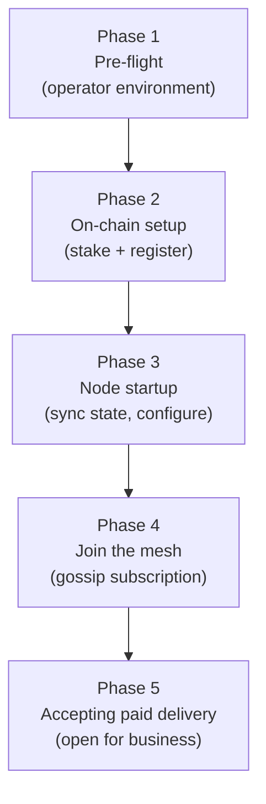

# ADR 019: Node Onboarding and Bootstrapping Flow

**Date:** 2026-04-08
**Status:** Draft

## Context

Existing ADRs specify individual components of the node lifecycle in isolation — staking in [ADR 026](026-gauge-boost-tokenomics.md), on-chain registration in [ADR 001](001-network.md), payment channel bindings in [ADR 003](003-payments.md), gossip validation in [ADR 001](001-network.md), blacklist sync in [ADR 011](011-content-takedown.md), and contract deployment order in [ADR 016](016-contract-interactions.md). No single document describes the complete, ordered procedure that takes a node from "operator has a server" to "actively accepting paid delivery requests."

This gap blocks PoC testnet participation — node operators have no canonical reference, and missing or mis-ordered steps produce silent protocol failures (e.g., gossip messages rejected without error because the clock is not synchronized, or connections refused because the blacklist has not been fetched).

This ADR defines the authoritative onboarding flow.

## Decision

Node onboarding proceeds in five sequential phases. A node MUST NOT advance to the next phase until all MUST-level requirements of the current phase are satisfied.



### Phase 1 — Pre-flight (Operator Environment)

Before any on-chain or protocol activity:

1. **Provision server.** Minimum recommended spec: 4 vCPU, 8 GB RAM, 1 TB SSD, 5 TB/month egress. See [ADR 026 §7](026-gauge-boost-tokenomics.md#7-operator-economics-and-minimum-stake) for operator economics.

2. **Synchronize clock.** The node MUST run NTP (or equivalent) and MUST verify the local clock offset is within 10 seconds of UTC before proceeding. Clock skew ≥ 60 s causes gossip messages to be silently rejected by all peers ([ADR 001](001-network.md#clock-synchronization)). Nodes SHOULD expose a `decdn_gossip_messages_rejected_total` Prometheus counter with the `reason="clock_skew"` label ([Appendix: Observability](appendix-observability.md#26-gossip-metrics)).

3. **Generate iroh identity.** Run the node binary with a `keys generate` (or equivalent) subcommand. This produces an **ed25519 key pair** whose public key is the iroh `NodeId`. The private key MUST be stored securely:
   - **PoC:** encrypted file on disk (passphrase-protected or operator-managed).
   - **Production:** platform keychain or HSM. See [ADR 012](012-client.md) for key management guidance (the same tiers apply to node keys).

4. **Prepare Ethereum key.** The operator needs an Ethereum address (`ethAddress`) with sufficient funds:
   - **TOKEN:** at minimum **50,000 TOKEN** for the minimum stake deposit ([ADR 026 § 7](026-gauge-boost-tokenomics.md#7-operator-economics-and-minimum-stake)). There is no discount-stake threshold; operators who want amplified return on capital ve-lock TOKEN in `VotingEscrow` for gauge boost ([ADR 026 § 3](026-gauge-boost-tokenomics.md#3-gauge-boost-formula)) rather than staking above a threshold for fee discount. Operators who lack the 50K minimum may qualify for externally-funded operator-onboarding programs (see [ADR 026 §10](026-gauge-boost-tokenomics.md#10-bootstrap-mechanism-pre-seed-usdc)).
   - **Native gas token:** approximately $0.50–$1.00 for the Phase 2 transactions at typical L2 gas prices.
   - **Optional USDC:** only required if the operator intends to open outbound payment channels immediately (e.g., to pay origin-backed nodes for cache-miss pulls). Clients will open inbound channels to the node without any USDC on the node side.

   - **Wallet, gas sponsorship, and session keys.** PoC accepts a plain EOA. Production migrates the operator wallet to a Safe (2-of-3 recommended) with ERC-7579 session keys for the high-frequency `slash_sig` signing path and an ERC-4337 paymaster for gas-in-USDC; see [ADR 024](024-account-abstraction.md) for the full design and the [Operator Key-Rotation Runbook](appendix-operator-key-rotation.md) for the EOA → Safe migration.

5. **Choose region.** Determine the ISO 3166-1 alpha-2 country code that best represents the node's physical location. This value is self-reported and unverified in PoC ([ADR 001](001-network.md), [ADR 011](011-content-takedown.md)). It will be submitted on-chain as `regionHint` and broadcast in `NodeAnnounce` messages — it affects which gossip topics the node publishes to and which regional blacklists it must enforce.

6. **Configure origin backend (optional).** If the node will act as an origin-backed node
   (serving specific content from S3/R2/B2/NFS/local disk), configure the backend access
   credentials and content set before proceeding. Cache-only serving is permissionless at
   the protocol layer — any staked node may serve cached blobs and pass them on for
   payment. To be recognised as an *authorized origin* for a registered namespace, the
   namespace's publisher must propose the operator via `OriginAssignment.proposeAssignment`
   and the DAO must ratify after timelock ([ADR 011 § Origin Assignment Authority](011-content-takedown.md#origin-assignment-authority));
   for default-open content (`namespaceId == 0`), the operator must be in the
   DAO-maintained allow-list (subject to the bootstrap rule — see
   [ADR 011 § Default-open allow-list](011-content-takedown.md#default-open-allow-list)).
   These steps happen on the publisher's or governance's timeline and are independent of
   node onboarding.

---

### Phase 2 — On-chain Setup

All transactions must be confirmed on-chain before proceeding to Phase 3.

#### Step 2.1 — Approve TOKEN transfer

Call `TOKEN.approve(stakingRegistry, amount)` where `amount ≥ minStake` (**50,000 TOKEN** under [ADR 026 § 7](026-gauge-boost-tokenomics.md#7-operator-economics-and-minimum-stake)). This ERC-20 approval authorizes `StakingRegistry` to pull the stake deposit.

**Gas:** ~$0.03 (one-time; subsequent re-stakes reuse the allowance if it was set above `minStake`).

#### Step 2.2 — Stake TOKEN

Call `StakingRegistry.stake(amount)` with `amount ≥ 50,000 TOKEN`.

The stake is locked immediately. It is slashable from this point forward, including during the unbonding period if the node later deregisters (14-day unbonding by default per [ADR 030 §7](030-blake3-merkle-verification.md#7-interaction-with-stake-unbonding--unbondingperiod-raised-to-14-d); governable per [ADR 026 §11](026-gauge-boost-tokenomics.md#11-governable-parameters-with-safety-bounds)).

**ve-position is separate.** Operator stake in `StakingRegistry` and any ve-locked TOKEN in `VotingEscrow` are independent positions per [ADR 026 § 4](026-gauge-boost-tokenomics.md#4-voting-escrow-votingescrow). ve-locked TOKEN is non-slashable and does not satisfy the minimum stake requirement; neither does staked TOKEN earn gauge boost. An operator who wants gauge boost must hold both.

**Gas:** ~$0.05.

#### Step 2.3 — Register node

Call `StakingRegistry.registerNode(nodeId, multiaddrs, regionHint, bindingSignature, ed25519Signature)`.

This single transaction atomically:

- Verifies the EIP-712 `bindingSignature` over `BindNodeId(nodeId, bindingNonce[ethAddress])`, establishing the `nodeId → ethAddress` mapping for slash evidence and payment attribution.
- Verifies the `ed25519Signature` over `keccak256(abi.encodePacked(nodeId, ethAddress, chainId, registrationNonce[nodeId]))`, proving the operator controls the iroh private key (prevents NodeId squatting). (`ethAddress` is `msg.sender` and `chainId` is `block.chainid` in the on-chain context; this ADR uses the operator-perspective names for consistency with the signing pseudo-code below.)
- Records `NodeInfo` (including `firstRegisteredAt` if this is the node's first-ever registration — used for cold-start bootstrap eligibility in [ADR 008](008-reputation.md#10-cold-start-bootstrap)).
- Sets `active = true` in the registry.

**Constructing `multiaddrs`:** The iroh `Endpoint` is not yet bound in Phase 2, so hole-punched addresses are not available at registration time. Use the following approach:

- **Direct-address nodes (known public IP/port):** provide the stable QUIC address.
- **NAT'd nodes:** register with the iroh relay address as a placeholder (`quic-v1/relay/<relay-url>`). After Phase 3 binds the endpoint and iroh establishes relay connectivity, call `updateMultiaddrs` with the actual `Endpoint::direct_addresses()` values. The relay address ensures peers can still reach the node in the interim.

See [NAT and Multiaddr Handling](#nat-and-multiaddr-handling) below for the full relay → direct address promotion flow.

**Constructing signatures:**

```
bindingSignature = EIP-712 sign(ethKey, BindNodeId { nodeId, nonce: bindingNonce[ethAddress] })
ed25519Signature = ed25519 sign(nodePrivKey,
                    keccak256(abi.encodePacked(nodeId, ethAddress, chainId, registrationNonce[nodeId])))
```

Both signing operations are supported by the `decdn` CLI (`decdn node register` subcommand prints the required parameters, signs locally, and submits the transaction).

**Gas:** ~$0.26–$0.46 (includes on-chain ed25519 verification via Solidity library; this is a one-time cost per node lifetime).

**Emitted events:** `NodeRegistered`, `NodeIdBound` — off-chain indexers and other nodes' registry caches will reflect the new node within one sub-second L2 block.

### Phase 3 — Node Startup (State Synchronization)

The node process MUST complete all of the following steps before opening any QUIC listener or accepting incoming connections.

#### Step 3.1 — Fetch rate bounds

Call `StablePaymentChannel.getRateBounds()` (PoC) or `PaymentChannel.getRateBounds(token)` (production). Verify that both `deliveryFloor` and `deliveryCeiling` fit in `u64` (see [ADR 003 § Startup](003-payments.md#rate-bounds-refresh)). If either value exceeds `u64::MAX`, the node MUST refuse to start and log an error.

The node SHOULD subscribe to on-chain `RateBoundsUpdated` events for real-time updates. Periodic polling (`rate_bounds_poll_interval`, default 1 hour) is the fallback ([ADR 003](003-payments.md)).

#### Step 3.2 — Sync content blacklist

Fetch the full current blacklist (global entries + the node's declared region entries) from the `ContentBlacklist` contract. Record the current `blacklistVersion`. The node MUST NOT accept connections until this sync completes successfully ([ADR 011](011-content-takedown.md#polling)).

After initial sync, the node polls `getBlacklistVersion()` every `blacklist_poll_interval` (default 10 minutes) for incremental updates.

#### Step 3.3 — Build initial peer table from on-chain registry

Query `StakingRegistry.getActiveNodes(offset=0, limit=100)` to bootstrap the peer table. For PoC (tens of nodes), a single call suffices. For larger networks, paginate until all active nodes are fetched.

This registry snapshot is the initial peer table. Gossip updates (Phase 4) will keep it fresh. The node also subscribes to `NodeRegistered`, `NodeMultiaddrUpdated`, `NodeDeregistered`, and `NodeAutoEjected` events to maintain a local registry cache used during gossip validation ([ADR 001](001-network.md#registry-cache)).

If the RPC endpoint is unavailable, retry with exponential backoff (3 attempts at 1s, 5s, 30s). If all retries fail, the node cannot start (no peer table = cannot participate in gossip, DHT lookups, or probing).

#### Step 3.4 — Configure local rate

Set the node's `rate_per_mb` within the bounds fetched in Step 3.1. This rate is advertised in `ProbeResponse` messages and must satisfy `deliveryFloor ≤ rate_per_mb ≤ deliveryCeiling`. Probes are the canonical rate-discovery channel; rate changes propagate through fresh probe responses ([ADR 005](005-protocol.md)).

### Phase 4 — Joining the Mesh (Gossip Subscription)

Once startup state is synchronized, the node joins the iroh-gossip mesh.

#### Step 4.1 — Subscribe to gossip topics

Subscribe to the following topics:

- `cdn/global/v1` — all staked nodes publish and subscribe.
- `cdn/region/{cc}/v1` — subscribe to the node's own declared region topic.
- `cdn/reputation/v1` — reputation reports (production only; see [ADR 008](008-reputation.md)).

Topic names are string literals used as iroh-gossip topic IDs.

#### Step 4.2 — Publish first `NodeAnnounce`

Construct and sign a `NodeAnnounce` message:

```rust
NodeAnnounce {
    node_id:        <iroh NodeId>,
    region:         <ISO 3166-1 alpha-2, e.g. "DE">,
    load:           LoadHint { active_streams: 0, bandwidth_utilization: 0 },
    timestamp_us:   <current unix microseconds>,
    signature:      <ed25519 over NodeAnnounceBody via postcard>,
}
```

Publish to `cdn/global/v1` and to `cdn/region/{cc}/v1`. The announce interval is operator-configurable (PoC default: 60 seconds).

After this publish, the node appears in peers' peer tables (subject to gossip validation: active registry membership, valid signature, fresh timestamp, valid region — see [ADR 001](001-network.md#gossip-validation)). Peers discovering the new node will begin probing it for content.

#### Step 4.3 — Observe incoming `NodeAnnounce` messages

Process incoming `NodeAnnounce` messages from existing peers, populating the local peer table. After a full gossip cycle (≥ 1 announce interval, i.e., ~60 seconds), the peer table should converge to the full active node set.

The node is not required to wait for convergence before proceeding to Phase 5 — it can accept connections immediately after Phase 3, even with a sparse peer table.

### Phase 5 — Accepting Paid Delivery

After Phases 1–4, the node is fully operational and should be accepting traffic.

**Acceptance criteria (all must hold):**

| # | Check | How to verify |
|---|-------|---------------|
| 1 | Node is active in the on-chain registry | `StakingRegistry.isActiveNode(nodeId)` returns `true` |
| 2 | Rate bounds loaded | Node has `deliveryFloor` and `deliveryCeiling` in memory |
| 3 | Blacklist synced | Local blacklist is at the current `blacklistVersion` |
| 4 | QUIC listener open | `iroh::Endpoint` bound and listening on configured port(s) |
| 5 | Gossip subscribed | Node is subscribed to `cdn/global/v1` and regional topic |
| 6 | `NodeAnnounce` published | At least one announce sent since startup |
| 7 | Multiaddrs synchronized | On-chain multiaddrs match `iroh::Endpoint::direct_addresses()` (or relay placeholder if direct addresses are not yet resolved) |

A node that satisfies all seven criteria is ready to:

- Respond to `ProbeRequest` messages on `cdn/probe/v1`
- Accept `StreamRequest` messages on `cdn/client/v1`
- Earn USDC via voucher-based payment channels opened by clients and other nodes

**Startup readiness log:** The node SHOULD emit a structured log line (e.g., `INFO node_ready registry=true rate_bounds=true blacklist_version=42 peers=12`) once all seven criteria are satisfied, so operators can confirm correct startup without grepping multiple log sources.

### NAT and Multiaddr Handling

iroh handles NAT traversal transparently via QUIC hole-punching and relay fallback. Node operators do not need to configure port forwarding.

**Address lifecycle:**

1. On startup, `iroh::Endpoint::local_addr()` returns the local bind address (e.g., `0.0.0.0:PORT`).
2. iroh discovers external addresses via STUN and direct connection attempts, populating `Endpoint::direct_addresses()`. These are the addresses that peers will use to connect.
3. If hole-punching fails, iroh uses a relay server as fallback. Relay addresses are included in the iroh `NodeAddr` but are not registered on-chain (they are not stable).

**Multiaddr registration:**

- On initial registration (Phase 2, Step 2.3), if iroh has already bound its endpoint (possible if the binary generates the registration parameters after starting iroh), include all known direct addresses in `multiaddrs`.
- If registration happens before iroh is started (e.g., a separate setup tool), register with a placeholder or known static IP/port, then call `updateMultiaddrs` once direct addresses are established.

**Multiaddr refresh:**

- When `Endpoint::direct_addresses()` changes (iroh emits an event), call `StakingRegistry.updateMultiaddrs(newMultiaddrs)` to keep the registry current.
- **PoC:** No cooldown — updates can be submitted on any change (~$0.03/call).
- **Production:** A governable cooldown prevents rapid address flipping by a compromised key ([ADR 001](001-network.md#multiaddr-update-policy)).

**Multiaddr encoding:** `multiaddrs` is a packed `bytes` field: a sequence of `(uint16 length, bytes data)` entries. Each entry is a QUIC multiaddr string (e.g., `/ip4/203.0.113.10/udp/4433/quic-v1`). Maximum total size: 1,024 bytes (governable).

### Re-Onboarding after Deregistration or Auto-Ejection

A node that voluntarily deregistered or was auto-ejected (stake dropped below 50% of `minStake` due to slashing — see [ADR 026 § 8](026-gauge-boost-tokenomics.md#8-slashing-and-burn)) must re-onboard. The flow is identical to initial onboarding with two differences:

1. **`firstRegisteredAt` is preserved.** The cold-start bootstrap bonus (ADR 008) is not re-granted — the `firstRegisteredAt` field in `StakingRegistry` is immutable once set, and the bonus is one-time per operator address.

2. **`registrationNonce` is incremented.** On deregistration, `registrationNonce[nodeId]` is incremented. The operator must sign fresh `ed25519Signature` and `bindingSignature` parameters using the new nonce value before calling `registerNode` again.

If the node's iroh identity has been replaced (key rotation), use `StakingRegistry.bindNodeId()` after re-registration to associate the new `nodeId` with the same `ethAddress` — see [ADR 003 § NodeId Binding](003-payments.md#nodeid-to-ethereum-binding). The old `nodeId` mapping is cleared.

## Consequences

**Positive:**

- Operators have a single, ordered reference for joining the PoC testnet.
- All startup prerequisites (rate bounds, blacklist, registry) are explicitly ordered, eliminating the silent-failure class identified in Issue #190.
- The acceptance criteria table (Phase 5) provides a machine-checkable health signal for readiness probes and operational monitoring.
- Re-onboarding (post-ejection) is explicitly covered, preventing nonce confusion.

**Negative:**

- Phase 2 requires three on-chain transactions (`approve`, `stake`, `registerNode`), which must be submitted in order and confirmed before the node can start. Sub-second L2 block times keep this fast, but the operator tooling must handle nonce management across these transactions.
- Multiaddr registration before iroh is started requires either a static IP/port (suitable for most VPS deployments) or a two-step workflow (start node, observe addresses, then register or update).
- Cold-start reputation (0.5, a 4× score penalty vs. a reputable node) means new nodes must price aggressively or wait out the 7-day bootstrap period to compete for traffic. This is a known and accepted property of [ADR 008](008-reputation.md).

## Future Work

- **Node onboarding CLI tool.** A `decdn setup` command that walks through Phases 1–2 interactively, generates keys, builds the `registerNode` calldata, and submits the transactions would reduce operator error significantly.
- **Automated multiaddr refresh.** The node runtime should watch `Endpoint::direct_addresses()` and call `updateMultiaddrs` automatically on change.
- **Geolocation verification.** Self-reported `regionHint` is an accepted PoC risk. Production should use a decentralized oracle or attestation service — see Issue #190, gap 7.
- ~~**Delegated voucher signer.**~~ Resolved — [ADR 024](024-account-abstraction.md) specifies Safe session keys for high-frequency signing (vouchers and slash_sig), replacing the delegated signer approach.
