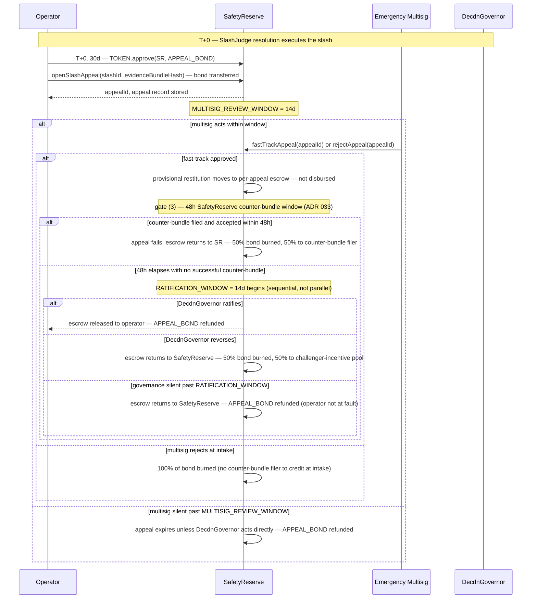

# ADR 028: Slashing Appeals and Dispute Escalation

**Date:** 2026-05-06
**Status:** Draft

## Context

The protocol slashes operator bonds at 5% / 15% / 50% escalation tiers ([ADR 026 § Slashing and burn](026-tokenomics.md#slashing-and-burn)). The one narrow due-process window today — the `SafetyReserve` **48-hour appeal window** ([ADR 009 § SafetyReserve Payout Authorization](009-governance.md#safetyreserve-payout-authorization), [ADR 026 § Safety and insurance reserve (5% bucket)](026-tokenomics.md#safety-and-insurance-reserve-5-bucket)) — protects reserve payouts, not slashes; an operator cannot directly invoke it. All three `SlashJudge` offenses — phantom delivery, rate manipulation, blacklist violation — execute immediately on successful on-chain verification with **no counter-evidence window** ([ADR 014 § Bond Handling](014-on-chain-verification.md#bond-handling)). Operators hit while offline have zero in-protocol recourse.

Without a documented escalation path, every legitimate-outage slash (network outage, NTP drift, regional ISP failure, hosting-provider incident) becomes either a permanent operator loss (damages onboarding/trust) or an ad-hoc emergency-multisig discretion event (unbounded multisig precedent). A bounded mechanism is needed before mainnet. This ADR adds a governance-level appeal layered on the existing slash machinery — no new governance bodies, no changes to slash execution, no on-chain stake reversal. The narrower regional-blacklist appeal mechanism is out of scope and tracked separately under [ADR 011](011-content-takedown.md#adr-011-content-takedown-and-hash-blacklisting).

## Decision

A node operator may file a **slashing appeal** within 30 days of a `SlashJudge` resolution. Appeals are heard by the existing emergency multisig under a fast-track authority mirroring [ADR 011 § Regional Governance Bodies](011-content-takedown.md#regional-governance-bodies)' suspension pattern: interim relief granted by the multisig (3-of-5), ratified or reversed by the operator-weighted Governor within 14 days (post-transition; bootstrap-multisig phase ratifies under bootstrap rules per [ADR 009 § Bootstrap-multisig phase](009-governance.md#bootstrap-multisig-phase)). Successful appeals are remedied by `SafetyReserve` restitution, an eligible payout category already enumerated in [ADR 026 § Safety and insurance reserve (5% bucket)](026-tokenomics.md#safety-and-insurance-reserve-5-bucket) ("Incorrect slashing / appeal reversals"). The on-chain slash and the operator's lifetime offense counter ([ADR 026 § Slashing and burn](026-tokenomics.md#slashing-and-burn)) are not modified.

### Scope

All three `SlashJudge` offense types are appealable: phantom, rate manipulation, blacklist. Each executes immediately at submit time with no in-protocol counter-evidence opportunity ([ADR 014 § Bond Handling](014-on-chain-verification.md#bond-handling)); the legitimate-outage rationale applies to all three.

The eligibility bar ([§ Eligibility and evidence standard](#eligibility-and-evidence-standard)) is the gate against frivolous appeals, not the offense type. **Scope limitation: [ADR 028](028-slashing-appeals.md#adr-028-slashing-appeals-and-dispute-escalation) covers appeals against the *slash event itself* on operational-failure grounds — the operator could not comply because of an outage, NTP drift, or similar.** Appeals against the *underlying [`ContentBlacklist`](011-content-takedown.md#contract-contentblacklist) entry* — disputing whether the blacklisted hash belongs on the list — are out of scope and tracked separately under [ADR 011](011-content-takedown.md#adr-011-content-takedown-and-hash-blacklisting). [§ Eligibility and evidence standard](#eligibility-and-evidence-standard)'s evidence standard does not admit content-policy arguments; only the [§ Eligibility and evidence standard](#eligibility-and-evidence-standard) operational-failure evidence types are admissible. The multisig is expected to apply heightened scrutiny to blacklist-offense appeals (deliberate moderation noncompliance, not operational failure); this guidance is not coded into the contract.

**Genesis Bond Credits (v2.2).** A slashed operator's pending unvested Genesis Bond Credit (`pendingCredit[op].total - pendingCredit[op].vested` on `CapacityBond` per [ADR 026 § Genesis Bond Credits](026-tokenomics.md#genesis-bond-credits)) is subject to the same slashing rates and distribution as voluntarily-bonded TOKEN. The vested-but-unclaimed portion is no longer separately slashable — it has functionally become voluntarily-bonded TOKEN and is slashed as part of `bondedAmount`. The slashing primitive in `CapacityBond._slash` iterates both pools atomically; no separate appeal path applies. Appeals flow is unchanged regardless of which pool the slash originated from.

### Appeal flow



The operator action — `openSlashAppeal(slashId, evidenceBundleHash)` — is a new entry point on `SafetyReserve`. The post-authorization gates (48-hour appeal window, post-incident reporting) are those already enumerated in [ADR 009 § SafetyReserve Payout Authorization](009-governance.md#safetyreserve-payout-authorization). The fast-track / ratification structure is the same pattern [ADR 011 § Regional Governance Bodies](011-content-takedown.md#regional-governance-bodies) uses for regional-body suspension.

**Escrow-until-ratification is the canonical disbursement path.** On `fastTrackAppeal`, the equivalent USDC payout moves from the SafetyReserve general balance into a per-appeal escrow account inside `SafetyReserve`, released to the operator only on ratification. This eliminates clawback exposure entirely: a reversal returns the escrowed funds to the general balance. The trade-off — operator working-capital exposure during the ratification window — is a Negative consequence below.

### Eligibility and evidence standard

To file an appeal the operator must include in the on-chain evidence bundle (referenced by `evidenceBundleHash`) **at least two of** the following corroborating evidence types, plus a sworn declaration:

| Evidence type | Examples |
| --- | --- |
| (a) Cryptographically signed third-party attestation | ISP outage notice, cloud-provider RCA / status-page incident ID with vendor signature, NTP server log, IXP outage bulletin |
| (b) Verifiable network telemetry | Gossip-mesh disconnection witnessed by ≥3 reputable peers per [ADR 008](008-reputation.md#adr-008-reputation-system); probe-fan-out timeouts logged by independent probers during the slash window |
| (c) Co-signed attestation from another registered node operator | EIP-712-signed statement from a reputable peer operator per [ADR 008](008-reputation.md#adr-008-reputation-system) confirming observed downtime in the same datacenter / region |

The sworn declaration is an EIP-712-signed statement (secp256k1, signed by the operator's registered Ethereum address — distinct from the Ed25519 wire identity used in `cdn/probe/v1` and `cdn/client/v1`), attesting under penalty of stake that the outage was genuine and no slashable offense was committed during the window. **Perjury — proven by post-hoc evidence — is grounds for re-slashing at the next escalation tier (5%→15%→50%; if already at the 50% tier, perjury triggers immediate auto-ejection per [ADR 026 § Slashing and burn](026-tokenomics.md#slashing-and-burn) and full forfeit of the remaining stake) and full forfeit of the appeal bond, in addition to the original slash.** The re-slash executes via the standard `SlashJudge.submit*Challenge()` flow with the sworn declaration entered as evidence.

Evidence type (b) is the on-chain-verifiable path; (a) and (c) are off-chain-rooted but hash-referenced on-chain. The bundle format mirrors `SafetyReserve`'s existing attested-incident-bundle format ([ADR 033 § Spending controls](033-safety-insurance-reserve.md#spending-controls)).

**Conflict tiebreaker.** If counter-evidence surfaces during the 48-hour SafetyReserve appeal window contradicting the operator's bundle (e.g., ≥3 reputable peers attest the operator was *up* during the slash window, contradicting (b) gossip-disconnection witnesses), the emergency multisig adjudicates. Category (a) signed third-party records are weighted above category (b) gossip telemetry on conflict; category (c) co-signed peer attestations are advisory only when (a) and (b) disagree. The multisig's adjudication decision is recorded in the post-incident registry alongside the conflicting evidence.

### Appeal bond

The operator posts `APPEAL_BOND` in TOKEN at the time of filing. Default 1,000 TOKEN; governable with hard bounds `[100, 10,000]` per [ADR 009](009-governance.md#adr-009-governance-model) safety-bound pattern. Bond economics mirror [ADR 014 § Bond Handling](014-on-chain-verification.md#bond-handling):

- **Successful appeal (ratified by DecdnGovernor):** bond refunded to operator in full.
- **Multisig rejects at intake (no fast-track granted):** 100% of bond burned. No counter-bundle filer exists to credit at intake; this case has no direct analog in [ADR 014 § Bond Handling](014-on-chain-verification.md#bond-handling).
- **Failed appeal — successful counter-bundle in 48h `SafetyReserve` window:** mirrors [ADR 014 § Bond Handling](014-on-chain-verification.md#bond-handling) bond split — 50% of bond burned, 50% routed *directly to the counter-bundle filer* as the prevailing party.
- **Failed appeal — DecdnGovernor reverses (no counter-bundle filer):** 50% of bond burned, 50% credited to a `SafetyReserve` challenger-incentive pool used to compensate parties who file successful counter-bundles in *future* 48h windows. (This case has no specific prevailing party to route to directly.)
- **Governance silent past `MULTISIG_REVIEW_WINDOW` or `RATIFICATION_WINDOW`:** bond refunded — the operator is not at fault for governance inaction, and the appeal lapses without economic penalty.

The bond is the primary economic deterrent against pro-forma appeals filed hoping for multisig sympathy. The 365-day frequency cap ([§ Hard caps and frequency limits](#hard-caps-and-frequency-limits)) and the perjury re-slash ([§ Eligibility and evidence standard](#eligibility-and-evidence-standard)) are secondary deterrents.

### Hard caps and frequency limits

| Parameter | Default | Hard bounds | Rationale |
| --- | ---: | --- | --- |
| `APPEAL_FILING_WINDOW` | 30 days | `[7d, 90d]` | Allows operators to discover the slash, gather logs, and file. 30d matches the issue-403 suggestion. |
| `APPEAL_BOND` | 1,000 TOKEN | `[100, 10,000]` | High enough to deter abuse, low enough that an operator with a genuine outage will pay it. |
| `MULTISIG_REVIEW_WINDOW` | 14 days | `[3d, 30d]` | Time the emergency multisig has to grant interim relief. After this, the appeal expires unless governance acts directly. |
| `RATIFICATION_WINDOW` | 14 days | (fixed, mirrors [ADR 011](011-content-takedown.md#regional-governance-bodies)) | DecdnGovernor must ratify or reverse within this window. Same window as regional-body suspension. |
| `MAX_APPEAL_RESTITUTION` | 1× minimum bond for the operator's declared tier, denominated in USDC at the slash block's TWAP | (fixed) | An appeal cannot net the operator more than the slashable bond floor for its tier ([ADR 026 § Operator economics](026-tokenomics.md#operator-economics)). Larger slashes are restituted up to this cap; the operator absorbs the residual. The TOKEN→USDC conversion uses the same Balancer V3 80/20 pool TWAP that [ADR 018](018-liquidity-strategy.md#adr-018-liquidity-strategy-balancer-8020-pol) uses for buyback-and-burn — specifically the same window length and oracle path as [ADR 018 § Buyback execution via Balancer V3](018-liquidity-strategy.md#buyback-execution-via-balancer-v3) — read at the slash block, not the appeal block, so the cap does not move with TOKEN price during the 30-day filing window. Reusing one oracle parameter set keeps appeal and buyback numerics auditable from a single configuration. |
| `OPERATOR_APPEAL_FREQUENCY` | 1 accepted appeal per 365 days | (fixed) | Prevents a serially-failing operator from rolling outage appeals indefinitely. Resets on the date the *previous* successful appeal was ratified. |

**Window timing invariant.** `APPEAL_FILING_WINDOW`, `MULTISIG_REVIEW_WINDOW`, and `RATIFICATION_WINDOW` are sequential, each on its own clock starting from a distinct event (slash block, `openSlashAppeal` block, `fastTrackAppeal` block respectively). They are independently governable with no ordering relationship between their bounds — `MULTISIG_REVIEW_WINDOW` may exceed `APPEAL_FILING_WINDOW`, and an appeal filed at the last block of `APPEAL_FILING_WINDOW` is still processed for the full review and ratification windows after the filing window closes (the filing window gates *when* an appeal may be opened, not how long it has to conclude). `SafetyReserve` enforces this at the contract layer: `openSlashAppeal` reverts if `block.timestamp - slashBlock.timestamp > APPEAL_FILING_WINDOW`, but no setter or post-filing path consults `APPEAL_FILING_WINDOW` again. Updates to the three parameters are independent and require no paired update (cf. [ADR 009 § Governable Parameters with Safety Bounds](009-governance.md#governable-parameters-with-safety-bounds), which uses paired cross-parameter invariants only where parameters have a genuine ordering relationship).

`MAX_APPEAL_RESTITUTION` payouts count against `SafetyReserve`'s existing per-incident and per-rolling-window USDC ceilings ([ADR 009 § Emergency Multisig](009-governance.md#emergency-multisig) gate (4)) — appeals share the reserve's overall solvency budget with all other payout categories.

**SafetyReserve insolvency at ratification.** If `SafetyReserve` cannot fund full restitution at ratification time (rolling-window cap reached, or insufficient general balance after concurrent incidents), the appeal succeeds in principle but the unfunded portion is recorded as a *pending claim* with a monotonic `claimId` at the current accrual epoch. Gates 1–3 of the four [ADR 033 § Spending controls](033-safety-insurance-reserve.md#spending-controls) (attested bundle, authorization, 48-hour appeal window) were checked through the appeal flow ending at `ratifyAppeal`; gate 4 (post-incident reporting) writes atomically on each disbursement. Once queued, no further multisig action is required. The bond is refunded regardless. Disbursement is permissionless head-of-queue when reserve solvency permits, per [ADR 033 § Cross-category payout ordering](033-safety-insurance-reserve.md#cross-category-payout-ordering) — epoch-FIFO across all payout categories with `claimId` as a within-epoch monotonic tiebreaker, no category prioritized over another.

**Cluster-slash residual exposure.** All three slashable offenses require the operator's own signed messages ([ADR 014 § Bond Handling](014-on-chain-verification.md#bond-handling)), so an external adversary cannot drive a cluster of slashes — the failure mode is operator misconfiguration (buggy release, NTP drift, blacklist sync gap). On a cluster, the operator consumes the `OPERATOR_APPEAL_FREQUENCY` slot on the most clear-cut case and absorbs the residual on the others; an additional-appeals mechanism would only restitute USDC, since [§ Reputation handling](#reputation-handling) keeps the reputation cost and lifetime offense counter regardless. Reputation decay ([ADR 008](008-reputation.md#adr-008-reputation-system)) and the pending-claim path bound the residual. Governance can revisit `OPERATOR_APPEAL_FREQUENCY` if observed volume warrants.

### Contract surface

This ADR specifies the contract surface at the semantic level — function signatures, modifiers, authorization gates. Storage layout, per-appeal escrow accounting, event-parameter shapes, and the permissionless `cleanupExpiredAppeal` lapse handler are pinned in [ADR 032 — SafetyReserve appeal-surface contract surface](032-safety-reserve-appeals-contract.md#adr-032-safetyreserve-appeal-surface-contract-surface). The `SafetyReserve` contract is extended with:

```solidity
// `slashId` is allocated and emitted by SlashJudge.Slashed
// (ADR 014 § SlashJudge Contract — globally monotonic, non-zero, single counter across all three offense types).
// `evidenceBundleHash` MUST equal the `evidenceHash` field of the referenced `Slashed` event.
function openSlashAppeal(uint256 slashId, bytes32 evidenceBundleHash) external returns (uint256 appealId);
function fastTrackAppeal(uint256 appealId) external onlyEmergencyMultisig;
function rejectAppeal(uint256 appealId) external onlyEmergencyMultisig;
function ratifyAppeal(uint256 appealId) external onlyGovernor;
function reverseAppeal(uint256 appealId) external onlyGovernor;
// Permissionless lapse handler — see [ADR 032 § State machine](032-safety-reserve-appeals-contract.md#state-machine).
function cleanupExpiredAppeal(uint256 appealId) external;
```

`openSlashAppeal` requires the bond transfer (`TOKEN.transferFrom` of `APPEAL_BOND`) and a non-zero `evidenceBundleHash`; it stores the appeal record and emits `SlashAppealOpened`. The restitution disbursement on ratification is routed through the existing `payout(bundleHash, recipient, amount)` entry point so [ADR 033 § Interface stability](033-safety-insurance-reserve.md#interface-stability)'s contract-stable signature for incident payouts is preserved — appeals are an additional *authorization* path into the same payout machinery, not new payout machinery. Subsequent gates are the same four payout gates from [ADR 033 § Spending controls](033-safety-insurance-reserve.md#spending-controls): attested bundle, authorization (multisig fast-track), 48-hour appeal window, post-incident reporting — applied **sequentially**, in that order (the [§ Appeal flow](#appeal-flow) mermaid reflects this: the 48h counter-bundle window completes before the 14-day ratification window opens, not in parallel).

**Multisig capability scope.** `fastTrackAppeal` and `rejectAppeal` are sub-modes of [ADR 009 § Emergency Multisig](009-governance.md#emergency-multisig)'s existing capability (4) "SafetyReserve fast-track authorization" — they consume appeal-specific arguments and emit appeal-specific events but do **not** create a new multisig power. The 3-of-5 threshold, signing semantics, and post-incident reporting obligations are unchanged from [ADR 009](009-governance.md#emergency-multisig), which enumerates these appeal-specific entry points inline under capability (4).

**Dependency on `SlashJudge` slash identifiers.** The `slashId` argument refers to the `Slashed(uint256 indexed slashId, address indexed operator, OffenseType offenseType, uint256 amount, bytes32 evidenceHash)` event canonicalised in [ADR 014 § `Slashed` event and `slashId` allocation](014-on-chain-verification.md#slashed-event-and-slashid-allocation). That ADR pins the event for all three offense types (phantom, rate, blacklist) — each resolving synchronously at submit time — and pins `slashId` as a globally monotonic non-zero counter. Operators reference this `slashId` directly in `openSlashAppeal`, with `evidenceBundleHash` matching the event's `evidenceHash` field. Without [ADR 014](014-on-chain-verification.md#adr-014-on-chain-verification-for-slashing-evidence)'s `Slashed` emission, no appeal can be filed.

Extending the existing `SafetyReserve` contract — rather than a new `SlashAppealRegistry` — preserves the deployment budget, reuses the payout machinery, and keeps the public payout registry as the single source of truth for who received protocol restitution and why. The trade-off is acknowledged in [Cross-ADR Impact](#cross-adr-impact): if `SafetyReserve` is ever split (e.g., separate reserves per incident category), the appeal-authorization functions must migrate alongside the slash-restitution payout category.

### Reputation handling

A successful appeal **does not** reverse the operator's reputation event ([ADR 008](008-reputation.md#adr-008-reputation-system)); the operator bears the residual reputation cost. This is deliberate:

- Reputation is a peer-aggregated signal, not contract state — reversing it post-hoc is technically expensive and weakens its meaning as an ongoing observability metric.
- Bearing the reputation cost pressures against frivolous outage appeals: a genuine-outage operator accepts the hit because the alternative (the slash) is worse; a marginal-claim operator has less incentive to file since the reputation stays.
- Reputation decay and reset paths in [ADR 008](008-reputation.md#adr-008-reputation-system) provide a slower restoration on continued good behavior.

The lifetime offense counter ([ADR 026 § Slashing and burn](026-tokenomics.md#slashing-and-burn)) is similarly **not** decremented. The escalation tier (5%→15%→50%) advances on the next offense as if the slash had stood. This preserves the deterrent: an appeal restitutes capital, not standing.

### Frivolous-appeal abuse model

Modeled abuse paths and counters:

| Abuse path | Counter |
| --- | --- |
| Operator A is slashed legitimately, files appeal hoping multisig sympathy. | `APPEAL_BOND` forfeit on reversal; perjury re-slash ([§ Eligibility and evidence standard](#eligibility-and-evidence-standard)) if sworn declaration is contradicted by the multisig's review; reputation cost stands ([§ Reputation handling](#reputation-handling)). |
| Operator commits a real offense, fabricates an outage to escape consequences. | Each [§ Eligibility and evidence standard](#eligibility-and-evidence-standard) evidence type is cryptographically bound to a third party whose own signing identity is at risk on perjury: (a) requires a verifiable third-party signature (ISP, cloud provider, NTP source); (b) requires peer-gossip telemetry that other parties have signed; (c) requires an EIP-712 signature from a peer operator whose reputation and stake are themselves on the line. The ≥2-of-3 requirement therefore forces collusion across at least two independent signing parties, and fabrication of any source is provable post-hoc by the original signer disclaiming the signature — triggering the perjury re-slash. |
| Operator games the 365-day frequency cap by spreading offenses across calendar years. | Cap is rolling, not calendar-bound — measured from the previous successful ratification date. |
| Sybil operator network co-signs each other's (c) attestations. | Co-signers must be reputable peer operators per [ADR 008](008-reputation.md#adr-008-reputation-system); reputation is itself peer-aggregated, raising the cost of building a sybil ring high enough to qualify as a witness. |
| Multisig grants interim relief, but ratification fails — operator could withdraw restitution before the reversal lands. | Closed by design: [§ Appeal flow](#appeal-flow)'s escrow-until-ratification rule moves the restitution into a per-appeal escrow on `fastTrackAppeal` and only releases on `ratifyAppeal`. A `reverseAppeal` simply returns the escrowed funds to the SafetyReserve general balance — there is no operator-held capital to claw back. |
| Sybil ring of operators each file appeals to drain the SafetyReserve below incident-response thresholds. | `MAX_APPEAL_RESTITUTION` cap + `SafetyReserve` per-rolling-window USDC ceiling ([ADR 009](009-governance.md#emergency-multisig)) bound the worst case; sybil sets large enough to exceed those caps must each pass the [§ Eligibility and evidence standard](#eligibility-and-evidence-standard) ≥2-evidence-source bar including reputable peer attestations, raising the cost of building the ring above the reserve damage it could cause. SafetyReserve insolvency triggers the deferred-claim path ([§ Hard caps and frequency limits](#hard-caps-and-frequency-limits)), so a drain attack cannot deny the reserve to other incident categories indefinitely. |

## Consequences

### Positive

- Closes the issue-403 gap with a bounded, documented mechanism — no ad-hoc multisig discretion for legitimate-outage cases.
- Reuses existing primitives: `SafetyReserve` contract, emergency multisig, DecdnGovernor, [ADR 014 § Bond Handling](014-on-chain-verification.md#bond-handling) bond economics, [ADR 011](011-content-takedown.md#regional-governance-bodies) ratification pattern. No new governance body, no new contract.
- Operator relief is bounded and predictable: the multisig fast-track decision lands within `MULTISIG_REVIEW_WINDOW` (default 14 days) and disbursement follows ratification within at most another ~16 days (48h SafetyReserve counter-bundle window + 14d ratification, sequential), vs. the ~9-day minimum + indefinite proposal-drafting latency of a Governor-only path.
- Operator trust improves — onboarding pitches can point to a documented appeal path rather than "trust the multisig."
- Reputation and offense-count are preserved, so the repeat-behavior deterrent is intact.

### Negative

- Adds six new entry points (`openSlashAppeal`, `fastTrackAppeal`, `rejectAppeal`, `ratifyAppeal`, `reverseAppeal`, plus the permissionless `cleanupExpiredAppeal` introduced in [ADR 032 § Multisig capability scope](032-safety-reserve-appeals-contract.md#multisig-capability-scope)) plus per-appeal escrow accounting to `SafetyReserve`, increasing surface area and audit cost.
- Operators must front `APPEAL_BOND` (1,000 TOKEN default) to file — a real frictional cost at PoC TOKEN prices for genuinely-affected smaller operators. Cold-start considerations may motivate a lower default during the PoC window.
- Escrow-until-ratification ([§ Appeal flow](#appeal-flow)) means the operator sees no disbursed restitution until DecdnGovernor ratification — up to ~16 days after the multisig fast-track. For larger slashes this is real working-capital exposure; the trade-off is buying out clawback exposure entirely.
- Evidence standard (≥2 corroborating sources) is documentation-heavy for solo operators without enterprise-grade observability.
- **TOKEN→USDC market risk.** `MAX_APPEAL_RESTITUTION` is denominated in USDC at the slash-block TWAP ([§ Hard caps and frequency limits](#hard-caps-and-frequency-limits)). The full appeal lifecycle — 30-day filing window + multisig review + 48-hour SafetyReserve appeal + 14-day ratification — can run up to ~60 days, during which TOKEN may appreciate against USDC. The operator receives a fixed-USDC restitution that may buy back fewer TOKEN than were slashed, leaving them short of pre-slash standing even after a successful appeal. The slash-block TWAP is deliberate (settling at appeal-block TWAP would expose `SafetyReserve` to TOKEN price moves and incentivize timing the appeal); operators bear the residual price risk.

### Risks

- **Multisig precedent drift.** Even with ratification oversight, repeated fast-tracking of borderline appeals could harden a soft norm of "the multisig will always grant interim relief." Mitigation: ratification reversals public, and the post-incident registry tracks fast-track decisions vs. ratification outcomes as an observable metric.
- **Reserve solvency.** A correlated outage (regional cloud provider failure) could trigger many simultaneous appeals against the same `SafetyReserve` budget. The per-rolling-window cap from [ADR 009](009-governance.md#emergency-multisig) bounds the worst case at the cost of pro-rata rationing across affected operators.
- **Sworn-declaration enforcement gap.** The perjury re-slash relies on post-hoc evidence surfacing. If post-hoc evidence is hard to obtain (private RPC logs, ISP records aged off), perjury becomes practically un-prosecutable. The bond forfeit and frequency cap remain as backup deterrents.
- **Cross-subsidy / depletion ratio.** A 50% slash on a near-entry-tier (1 Gbps, ~50K TOKEN bond) operator nets `SafetyReserve` ~30% × bond from inflow ([ADR 026 § Slashing and burn](026-tokenomics.md#slashing-and-burn) distribution: 50% challenger / 30% reserve / 20% burn), while a successful appeal can pay out up to 1× entry-tier bond — a worst-case ~3.3× depletion ratio for that incident, rising further if the slash tier was 5% or 15% rather than 50%. The reserve thus funds a cross-subsidy from non-slash inflows (FeeRouter 5% safety bucket per [ADR 026 § FeeRouter split](026-tokenomics.md#feerouter-split)) into slash restitution. This cross-subsidy is accepted explicitly for bonds at or near the entry tier, where restitution can fully cover the slash; for operators bonded well above the entry tier (high-capacity tiers under the `bond = k × Mbps^α` curve per [ADR 026 § Capacity-bond curve](026-tokenomics.md#capacity-bond-curve)), a 50% slash exceeds `MAX_APPEAL_RESTITUTION` and the operator absorbs the residual ([§ Hard caps and frequency limits](#hard-caps-and-frequency-limits)). The protocol prioritizes reserve solvency over full-restitution-for-edge-tier; restitution caps at the entry-tier bond level, not the actual slash amount. Reserve sizing in [ADR 026 § Safety and insurance reserve (5% bucket)](026-tokenomics.md#safety-and-insurance-reserve-5-bucket) must accommodate this depletion ratio. The deferred-claim path bounds the worst case at the cost of operator working-capital exposure during depletion windows.
- **Reputation hit persists across appeal.** [§ Reputation handling](#reputation-handling) deliberately preserves reputation, so a slashed operator's [ADR 008](008-reputation.md#adr-008-reputation-system) reputation hit is not reversed on a successful appeal. The hit lowers selection probability ([ADR 001 node selection](001-network.md#node-selection-algorithm)), reducing real `bytes_delivered` and therefore the operator's USDC fee revenue under the four-bucket FeeRouter split per [ADR 026 § FeeRouter split](026-tokenomics.md#feerouter-split). For high-volume operators this can be a far larger economic loss than the restituted slash. Restoration follows the slower [ADR 008](008-reputation.md#adr-008-reputation-system) decay paths. The operator absorbs this residual cost; the [§ Reputation handling](#reputation-handling) rationale (reversing peer-aggregated reputation post-hoc weakens its meaning as an ongoing signal) is the explicit trade-off.

## Cross-ADR Impact

- Storage layout, per-appeal escrow accounting ([§ Appeal flow](#appeal-flow)), and the six event signatures are pinned in [ADR 032](032-safety-reserve-appeals-contract.md#adr-032-safetyreserve-appeal-surface-contract-surface), which also adds the permissionless `cleanupExpiredAppeal(appealId)` lapse handler (see [ADR 032 § State machine](032-safety-reserve-appeals-contract.md#state-machine)).
- **`SafetyReserve` future split.** If the reserve is ever decomposed into per-category contracts (slash-restitution vs. SLA-breach vs. payment-channel downtime), the slash-restitution category must migrate together with: (1) the six [§ Contract surface](#contract-surface) entry points (`openSlashAppeal` / `fastTrackAppeal` / `rejectAppeal` / `ratifyAppeal` / `reverseAppeal` / `cleanupExpiredAppeal`, per [ADR 032 § Multisig capability scope](032-safety-reserve-appeals-contract.md#multisig-capability-scope)); (2) per-appeal escrow accounting ([§ Appeal flow](#appeal-flow)); (3) the pending-claim register ([§ Hard caps and frequency limits](#hard-caps-and-frequency-limits), including the cross-category epoch-FIFO queue pinned in [ADR 033 § Cross-category payout ordering](033-safety-insurance-reserve.md#cross-category-payout-ordering)); (4) the challenger-incentive pool state ([§ Appeal bond](#appeal-bond)). Migration MUST preserve [§ Appeal flow](#appeal-flow)'s escrow semantics — a known, intentional coupling cost of the [§ Contract surface](#contract-surface)-reuse decision, revisited only at split time.
- Regional-blacklist appeals are tracked separately under [ADR 011](011-content-takedown.md#adr-011-content-takedown-and-hash-blacklisting); the two appeal paths are deliberately decoupled (different evidence standards and stakeholder pools).
