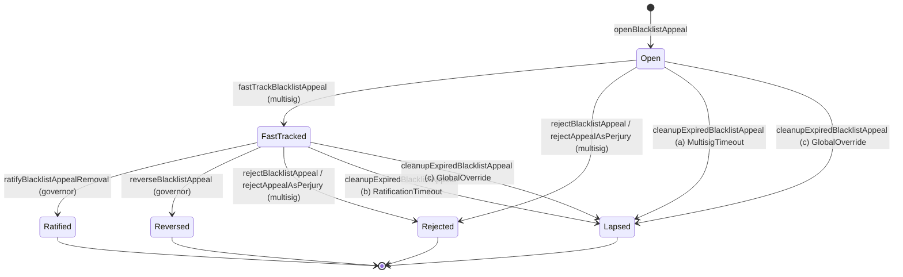

# ADR 031: ContentBlacklist appeal-contract surface

**Date:** 2026-05-14
**Status:** Accepted

## Context

[ADR 011 § Blacklist Entry Appeals](011-content-takedown.md#blacklist-entry-appeals) specifies the semantics of the per-entry blacklist-appeal flow (regional-only scope, standing paths and synthetic-standing clawback, evidence requirements, bond and frequency caps, the multisig fast-track + DecdnGovernor ratification authority, the per-body concurrent-appeal cap, and the lifecycle across `openBlacklistAppeal` → (`fastTrackBlacklistAppeal` | `rejectBlacklistAppeal`) → (`ratifyBlacklistAppealRemoval` | `reverseBlacklistAppeal` | lapse)). High-level signatures appear in the [`IContentBlacklist` interface](011-content-takedown.md#contract-contentblacklist). [ADR 011 § Contract surface](011-content-takedown.md#contract-surface):

> The full ABI (per-appeal storage layout, exact event topics, gas-optimized struct packing) is deferred to a future contract-implementation ADR — same approach as [ADR 028 § Contract surface](028-slashing-appeals.md#contract-surface).

This ADR is that contract-implementation ADR. It pins the per-appeal storage layout, canonical event topic ordering, gas-packed struct layout, and surface-level integration with the rest of `ContentBlacklist` (suspension flag manipulation, internal `_removeHashRegional` call, `cleanupExpiredBlacklistAppeal` admissibility checks), giving the implementation in `contracts/` a single canonical reference.

It is the blacklist-side analogue of the slash-appeal entry points on the `SlashAppeal` contract pinned in [ADR 028 § Contract surface](028-slashing-appeals.md#contract-surface).

This ADR does **not** re-litigate most [ADR 011](011-content-takedown.md#adr-011-content-takedown-and-hash-blacklisting) semantic decisions — bond size, filing windows, standing paths, evidence rules, regional-only scope, or the interaction with `SlashJudge`. Restatements here are for self-containedness; the canonical decision authority remains [ADR 011](011-content-takedown.md#adr-011-content-takedown-and-hash-blacklisting). The one departure: the synthetic-standing clawback it specifies is **dropped** here — `StandingPath.TokenHolder` standing is the escrowed appeal bond itself (no balance threshold), and an escrowed bond cannot be flash-loaned, so there is nothing for a clawback to defend against.

> **Target spec, not a 1:1 as-built ABI reference.** This document pins the *intended* contract surface. The deployed `contracts/src/ContentBlacklist.sol` ships a deliberate subset, with the simplifications enumerated in its contract header. Storage and signature blocks below describe the destination, not the current deployment — the as-built contract notably uses a 0-indexed `_appeals` array (no `None` sentinel) rather than the `appeals` mapping + `appealCounter` shown here, review/ratification deadlines computed from `openedAt` / `fastTrackedAt` + window constants rather than a stored `reviewWindowEndsAt` and enforced only on the permissionless cleanup path (see § Deadline enforcement is permissionless-only — a deliberate design point, not a gap), and lapse paths that currently burn the bond. Standing is enforced at filing for all three paths (audit I-3): Publisher and Operator each prove a credential, while TokenHolder standing is the escrowed appeal bond itself — there is no `appealFilerTokenThreshold` balance gate and no synthetic-standing clawback. The clawback is **dropped, not deferred**: an escrowed bond cannot be flash-loaned, so there is nothing to fake, and a balance gate would protect nothing the bond + `hasActiveAppeal` + rejection cooldown + perjury denylist do not already protect. The perjury denylist also ships, but records the bad-faith adjudication through the `BlacklistAppealRejectedAsPerjury` event rather than the struct's `perjuryFlagged` flag (still a target-only field).

## Decision

The appeal surface lives on the existing `ContentBlacklist` contract as an extension of [ADR 011 § Contract: ContentBlacklist](011-content-takedown.md#contract-contentblacklist), not as a separate appeal-registry contract. Rationale parallel to [ADR 028 § Contract surface](028-slashing-appeals.md#contract-surface): appeal records reference entries already on `ContentBlacklist`, the ratification path mutates `ContentBlacklist` state (`entry.suspended`, `entry.suspendedAt`, `_removeHashRegional`), and cleanup admissibility tests depend on `ContentBlacklist` views — splitting across two contracts would force every lifecycle transition through cross-call hops with no audit-surface savings.

### Storage layout

Two enums and one struct describe an appeal; auxiliary mappings carry the per-filer and per-region caps from [ADR 011 § Bond and frequency caps](011-content-takedown.md#bond-and-frequency-caps).

```solidity
enum AppealStatus {
    None,           // 0 — sentinel; appeals[0] is uninitialized
    Open,           // 1 — bond escrowed; multisig has not yet acted
    FastTracked,    // 2 — entry.suspended = true; awaiting DecdnGovernor ratification
    Ratified,       // 3 — terminal: _removeHashRegional executed; bond refunded
    Reversed,       // 4 — terminal: entry.suspended cleared; bond burned
    Rejected,       // 5 — terminal: rejected at intake or after fast-track; bond burned
    Lapsed          // 6 — terminal: cleanupExpiredBlacklistAppeal fired; bond refunded (all lapse conditions refund; see § cleanupExpiredBlacklistAppeal)
}

enum StandingPath {
    None,           // 0 — invalid sentinel
    Publisher,      // 1 — publisherRegistry.ownerOf(namespaceId) == filer (hash->namespace is off-chain, ADR 002)
    Operator,       // 2 — operator with node.region matching entry.region
    TokenHolder     // 3 — no extra credential: the escrowed appeal bond is the standing (no balance threshold, no synthetic-standing clawback)
}

struct BlacklistAppeal {
    // ─── Slot 0 (32 bytes) ─────────────────────────────────────
    bytes32 blake3Hash;             // disputed hash
    // ─── Slot 1 (32 bytes) ─────────────────────────────────────
    bytes32 evidenceBundleHash;     // off-chain bundle reference (EIP-712-signed declaration + corroborating evidence)
    // ─── Slot 2 (32 bytes, packed) ─────────────────────────────
    address filer;                  // 20 bytes
    uint64  openedAt;               // 8 bytes — second-resolution timestamp at filing
    uint8   standingPath;           // 1 byte — StandingPath enum, fixed at filing
    uint8   status;                 // 1 byte — AppealStatus enum
    uint8   perjuryFlagged;         // 1 byte — non-zero iff rejection was flagged as perjury (triggers denylist)
    bytes1  _pad0;                  // 1 byte — explicit padding for slot completion
    // ─── Slot 3 (32 bytes) ─────────────────────────────────────
    uint256 bond;                   // escrowed TOKEN amount (BLACKLIST_APPEAL_BOND at filing time)
    // ─── Slot 4 (32 bytes, packed) ─────────────────────────────
    uint64  fastTrackedAt;          // 8 bytes — non-zero iff entered FastTracked
    uint64  reviewWindowEndsAt;     // 8 bytes — running deadline for the active review window (multisig pre-fast-track, DecdnGovernor post-fast-track)
    bytes16 _pad1;                  // 16 bytes — explicit padding for slot completion
    // ─── Slot 5 (32 bytes) ─────────────────────────────────────
    bytes32 region;                 // packed region key per ADR 011 § Region representation; never bytes32(0)
}

mapping(uint256 => BlacklistAppeal) public appeals;
uint256 public appealCounter;   // monotonic; appeals[0] reserved as None sentinel; first real id is 1
```

**Region representation.** `region` is a `bytes32` packed region key, identical at every layer to [ADR 011 § Region representation](011-content-takedown.md#contract-contentblacklist) — no `string` boundary form and no canonicalization step. The unset sentinel `bytes32(0)` is invalid for an appeal (`openBlacklistAppeal` reverts on `region == bytes32(0)`); the global sentinel `bytes32("GLOBAL")` is valid, since global entries are filable by naming it explicitly.

**Auxiliary mappings:**

```solidity
// APPEAL_FILER_FREQUENCY — 1 successful appeal per 90 days, per filer (ADR 011)
mapping(address => uint64) public lastRatifiedSuccessAt;

// APPEAL_FILER_REJECTION_COOLDOWN — 3 rejections in rolling 90d → 90d cooldown (ADR 011)
struct RejectionWindow {
    uint64[3] rejections;     // second-resolution timestamps; 0 marks an empty slot
    uint64    cooldownUntilAt; // non-zero while a cooldown is active
}
mapping(address => RejectionWindow) public filerRejections;

// Perjury denylist — 365d per-address suspension from the appeal path (ADR 011 § Evidence)
mapping(address => uint64) public perjuryDenylistUntilAt;

// Interim-relief concurrent fast-track cap — two-tier (ADR 011):
//   REGION_CONCURRENT_RELIEF_CAP (3) — per-region ceiling on active slots.
//   FILER_CONCURRENT_RELIEF_CAP  (2) — per-(filer, region) sub-cap, strictly
//   below the region ceiling, so no single filer can monopolize a region's
//   slots. (The earlier per-region-only key assumed one body per region; the
//   per-filer sub-cap drops that assumption and bounds an adversarial filer
//   directly. The region ceiling is retained as a second backstop.)
mapping(bytes32 => uint8) public regionActiveReliefCount;
mapping(bytes32 => mapping(address => uint8)) public filerRegionActiveRelief;

// Bond escrow accounting — TOKEN held by the contract for active appeals.
// Public view; not used in cap arithmetic. Auxiliary to per-appeal `bond` field above
// for off-chain solvency dashboards.
uint256 public totalBondsEscrowed;
```

**`TOKEN` reference** is the existing immutable `IERC20 public immutable TOKEN` already required by `ContentBlacklist` for the bond pull; no additional constructor argument.

**`PublisherRegistry` reference** is an immutable `IPublisherRegistryStanding` constructor argument (audit I-3): the Publisher standing check needs `ownerOf`, and a security-critical standing gate must not be left unset or re-pointed. The deployment builds `PublisherRegistry` (which needs only `admin`) before `ContentBlacklist`. The TokenHolder path carries no threshold parameter: standing is the escrowed appeal bond, so there is no `appealFilerTokenThreshold` to configure or govern.

### Function signatures and revert table

The five entry points from `IContentBlacklist`, plus permissionless `cleanupExpiredBlacklistAppeal`, are pinned below with full revert conditions, state transitions, side effects, and emitted events.

```solidity
function openBlacklistAppeal(
    bytes32 blake3Hash,
    bytes32 region,                      // packed region key; see ADR 011 § Region representation
    bytes32 evidenceBundleHash,
    uint8   standingPath,
    uint256 namespaceId                  // Publisher path: the claiming namespace; ignored on other paths
) external returns (uint256 appealId);
```

| Revert | Trigger |
| --- | --- |
| `MissingRegion()` | `region == bytes32(0)`, the unset sentinel. Callers must name a scope explicitly — including `bytes32("GLOBAL")` for a global entry (see [ADR 011 § Scope](011-content-takedown.md#scope)) |
| `EntryNotFound()` | No `BlacklistEntry` exists for `(blake3Hash, region)` |
| `FilingWindowClosed()` | `block.timestamp ≥ entry.addedAt + BLACKLIST_APPEAL_FILING_WINDOW` |
| `InvalidStandingPath()` | `standingPath` is not in `{Publisher, Operator, TokenHolder}` |
| `StandingCheckFailed()` | The filer fails the declared `standingPath` check: **Publisher** — `publisherRegistry.ownerOf(namespaceId) != msg.sender`; **Operator** — region mismatch; **TokenHolder** — never fails a standing check (the escrowed appeal bond is the standing, so the only gate is the bond `safeTransferFrom` itself). As-built, Publisher/Operator failures collapse to a single `UnauthorizedStanding(standingPath)` (Operator region mismatch additionally surfaces `OperatorRegionMismatch`). |
| `FilerPerjuryDenylisted()` | `perjuryDenylistUntilAt[msg.sender] > block.timestamp` |
| `FilerInRejectionCooldown()` | `filerRejections[msg.sender].cooldownUntilAt > block.timestamp` |
| `EmptyEvidenceBundleHash()` | `evidenceBundleHash == bytes32(0)` |
| `BondTransferFailed()` | `TOKEN.transferFrom(msg.sender, address(this), BLACKLIST_APPEAL_BOND)` reverts or returns false |
| `AppealPathNotYetActive()` | Optional: first regional body not yet registered per [ADR 011](011-content-takedown.md#adr-011-content-takedown-and-hash-blacklisting) bootstrap-window degradation note |

**State transitions:** `appealCounter` increments; `appeals[appealCounter] = BlacklistAppeal{status: Open, openedAt: block.timestamp, reviewWindowEndsAt: block.timestamp + BLACKLIST_MULTISIG_REVIEW_WINDOW, ...}`; `totalBondsEscrowed += BLACKLIST_APPEAL_BOND`. `standingPath == TokenHolder` requires no post-filing checkpoint: standing is the escrowed bond itself, so there is no balance re-check to schedule.

**Emits:** `BlacklistAppealOpened(appealId, blake3Hash, region, filer, evidenceBundleHash, standingPath)`.

---

```solidity
function fastTrackBlacklistAppeal(uint256 appealId) external onlyEmergencyMultisig;
```

| Revert | Trigger |
| --- | --- |
| `AppealNotFound()` | `appeals[appealId].status == None` |
| `AppealNotEligibleForFastTrack()` | `status != Open` (the sole pre-fast-track state; see § State machine) |
| `RegionalCapHit(region, cap)` | `regionActiveReliefCount[appeal.region] ≥ REGION_CONCURRENT_RELIEF_CAP` |
| `FilerReliefCapHit(filer, cap)` | `filerRegionActiveRelief[appeal.region][appeal.filer] ≥ FILER_CONCURRENT_RELIEF_CAP` |

There is no upper-deadline revert on this path: the multisig may fast-track an `Open` appeal at any time, with the permissionless cleanup-lapse as the only window-driven settlement (see § Deadline enforcement is permissionless-only).

**State transitions:** `status = FastTracked`; `fastTrackedAt = block.timestamp`; `reviewWindowEndsAt = block.timestamp + BLACKLIST_RATIFICATION_WINDOW`; `regionActiveReliefCount[appeal.region]++` **and** `filerRegionActiveRelief[appeal.region][appeal.filer]++`; on the parent entry, `entry.suspended = true`, `entry.suspendedAt = block.timestamp`. The `ContentBlacklist` views `isBlacklisted` / `isBlacklistedInRegion` immediately return false for the parent entry per [ADR 011 § Interaction with active slashes](011-content-takedown.md#interaction-with-active-slashes).

**Emits:** `BlacklistAppealFastTracked(appealId)`.

---

```solidity
function rejectBlacklistAppeal(uint256 appealId) external onlyEmergencyMultisig;
function rejectAppealAsPerjury(uint256 appealId) external onlyEmergencyMultisig;
```

`rejectAppealAsPerjury` is a sibling entry point for the [ADR 011 § Evidence](011-content-takedown.md#evidence) case where the sworn declaration was false. It does everything `rejectBlacklistAppeal` does (burn the bond, record the rolling-window rejection), plus sets `perjuryDenylistUntilAt[appeal.filer] = block.timestamp + PERJURY_DENYLIST_DURATION` (365 days, a fixed constant with no governance setter). Multisig may call either against an `Open` or `FastTracked` appeal; on a `FastTracked` appeal the suspension is released as a side effect (clears `entry.suspended` and decrements `regionActiveReliefCount` before terminating).

| Revert | Trigger |
| --- | --- |
| `AppealNotFound()` | `appeals[appealId].status == None` |
| `AppealAlreadyTerminal()` | `status ∈ {Ratified, Reversed, Rejected, Lapsed}` |

**State transitions (both functions):** `status = Rejected`; bond is burned via `TOKEN.burn(appeal.bond)` (`ContentBlacklist` holds and burns directly — TOKEN is `ERC20Burnable` per [ADR 026 § Burnability](026-tokenomics.md#burnability)); `totalBondsEscrowed -= appeal.bond`; record a new entry in `filerRejections[appeal.filer]` (rolling window); if the rolling window contains three rejections within the lookback, set `cooldownUntilAt`. If `status` was `FastTracked` at the moment of rejection: also clear `entry.suspended = false` and `regionActiveReliefCount[appeal.region]--` (preserving `entry.suspendedAt`).

**Emits:** `BlacklistAppealRejected(appealId)`. Perjury rejections additionally emit `BlacklistAppealRejectedAsPerjury(appealId, filer, until)`.

---

```solidity
function ratifyBlacklistAppealRemoval(uint256 appealId) external onlyGovernor;
function reverseBlacklistAppeal(uint256 appealId) external onlyGovernor;
```

Both require `status == FastTracked`; neither carries an upper deadline — the governor may ratify or reverse a `FastTracked` appeal at any time, with the permissionless cleanup-lapse as the only window-driven settlement (see § Deadline enforcement is permissionless-only). Both terminate.

`ratifyBlacklistAppealRemoval`:

- `status = Ratified`; `regionActiveReliefCount[appeal.region]--`.
- Internal call `_removeHashRegional(appeal.blake3Hash, appeal.region)` — same body as the public `removeHashRegional` but bypassing the `GOVERNANCE_ROLE` check (caller is already `onlyGovernor` per the modifier on this entry point). This emits the standard `HashRemoved(blake3Hash, version, region)` event from `ContentBlacklist`.
- Bond refund: `TOKEN.transfer(appeal.filer, appeal.bond)`; `totalBondsEscrowed -= appeal.bond`; `lastRatifiedSuccessAt[appeal.filer] = block.timestamp`.
- **Emits:** `BlacklistAppealRatified(appealId)` followed by `HashRemoved(...)`.

`reverseBlacklistAppeal`:

- `status = Reversed`; `regionActiveReliefCount[appeal.region]--`; `entry.suspended = false`. `entry.effectiveAt` is **preserved** per [ADR 011 § Authority and flow](011-content-takedown.md#authority-and-flow) to avoid retroactively shielding pre-suspension non-compliance.
- Bond burn: `TOKEN.burn(appeal.bond)`; `totalBondsEscrowed -= appeal.bond`.
- **Emits:** `BlacklistAppealReversed(appealId)`.

---

```solidity
function cleanupExpiredBlacklistAppeal(uint256 appealId) external;
```

Permissionless. Reverts unless one of the three admissibility conditions from [ADR 011 § Contract: ContentBlacklist](011-content-takedown.md#contract-contentblacklist) cleanup interface holds:

| Condition | Test | Bond outcome |
| --- | --- | --- |
| (a) multisig silent past `BLACKLIST_MULTISIG_REVIEW_WINDOW` | `status == Open && block.timestamp ≥ reviewWindowEndsAt` | refund |
| (b) governance silent past `BLACKLIST_RATIFICATION_WINDOW` | `status == FastTracked && block.timestamp ≥ reviewWindowEndsAt` | refund |
| (c) global override fired | `status ∈ {Open, FastTracked} && _entryExists(appeal.blake3Hash, appeal.region) == false` | refund (per [ADR 011 § Global Override](011-content-takedown.md#global-override)) |

The synthetic-standing clawback is intentionally absent — `StandingPath.TokenHolder` standing is the escrowed bond, so there is no post-filing balance re-check and no burn-on-clawback lapse condition.

**State transitions:** `status = Lapsed` for all three conditions — the terminal-status set is intentionally minimal. Every lapse condition refunds the bond; the matched condition is surfaced through the `LapseReason` indexed sub-field on `BlacklistAppealLapsed` (see § Event topic ordering) so off-chain consumers can attribute the lapse without parsing follow-on `Transfer` events. If `status` was `FastTracked` when cleanup fires: `regionActiveReliefCount[appeal.region]--`; `entry.suspended = false`; `entry.suspendedAt` preserved. `totalBondsEscrowed -= appeal.bond`.

**Emits:** `BlacklistAppealLapsed(appealId, reason)` where `reason` is a `u8` enum (`MultisigTimeout = 1, RatificationTimeout = 2, GlobalOverride = 3`) mapping 1:1 to the three conditions above.

After cleanup, subsequent calls against the same `appealId` revert with `BlacklistAppealAlreadyClosed()`.

### Deadline enforcement is permissionless-only

The `BLACKLIST_MULTISIG_REVIEW_WINDOW` and `BLACKLIST_RATIFICATION_WINDOW` deadlines are enforced **only** on the permissionless `cleanupExpiredBlacklistAppeal` path, which lapses an appeal once its window has elapsed. The privileged transitions — `fastTrackBlacklistAppeal` (multisig), `ratifyBlacklistAppealRemoval` / `reverseBlacklistAppeal` (governor) — carry **no upper deadline**: a trusted role may act for as long as the appeal stays in an actionable state (`Open` for fast-track, `FastTracked` for ratify/reverse).

The windows therefore bound trusted-role latency only as a *fallback*. If a trusted role goes silent past its window, any caller invokes `cleanupExpiredBlacklistAppeal` to lapse the appeal, release any interim-relief slot, and settle the bond per the matched cleanup condition. There is no separate hard-deadline revert on the trusted paths, and the `reviewWindowEndsAt` field exists only as the cleanup path's stored deadline (per-window, recomputed at each transition).

This is intentional. The trusted roles are the appeal's adjudicators, not adversaries to be time-boxed; a stale-but-correct adjudication is preferable to a forced lapse, and a single deadline source — the cleanup path — avoids a redundant timing branch in every privileged transition. The one consequence is a race: once a window has elapsed, both the trusted transition and `cleanupExpiredBlacklistAppeal` are admissible, and whichever lands first wins. Each reaches a coherent terminal state (`Ratified` / `Reversed` / `Rejected` vs. `Lapsed`), so the interleaving is immaterial to invariant safety only — the settlement outcome (the bond disposition, plus whether the hash ends up removed or the blacklist entry re-activated) differs by which path resolves first, and both outcomes are valid for an appeal whose window has run.

### Event topic ordering

| Event | Topic 1 (indexed) | Topic 2 (indexed) | Topic 3 (indexed) | Non-indexed data |
| --- | --- | --- | --- | --- |
| `BlacklistAppealOpened` | `appealId` | `blake3Hash` | `region` (bytes32) | `filer` (address), `evidenceBundleHash` (bytes32), `standingPath` (uint8) |
| `BlacklistAppealFastTracked` | `appealId` | — | — | (none) |
| `BlacklistAppealRejected` | `appealId` | — | — | (none) |
| `BlacklistAppealRejectedAsPerjury` | `appealId` | `filer` | — | `until` (uint64) |
| `BlacklistAppealRatified` | `appealId` | — | — | (none) |
| `BlacklistAppealReversed` | `appealId` | — | — | (none) |
| `BlacklistAppealLapsed` | `appealId` | `reason` (uint8) | — | (none) |

Indexer convention: clients keying on `(appealId)` use topic 1 across all events; clients reconciling appeals against parent entries key on `(blake3Hash, region)` from `BlacklistAppealOpened` and follow the lifecycle by `appealId`. That reconciliation is why `region` takes the third topic slot ahead of `filer`: a `bytes32` region is topic-native and matches how the parent-entry side indexes it on `HashBlacklisted` / `HashRemoved`. `filer` is recovered from the event data.

### State machine



### Integration with ContentBlacklist core

- **`entry.suspended` writes** happen only from `fastTrackBlacklistAppeal` (true), `reverseBlacklistAppeal` (false, preserving `suspendedAt`), `rejectBlacklistAppeal` / `rejectAppealAsPerjury` on a `FastTracked` appeal (false, preserving `suspendedAt`), and `cleanupExpiredBlacklistAppeal` cases (b) and (c) (false, preserving `suspendedAt`). No other path mutates `suspended`.
- **`entry.suspendedAt` is monotonic per entry.** Once written by a fast-track, it is preserved across `reverseBlacklistAppeal` and `cleanupExpiredBlacklistAppeal` so [ADR 014 § Evidence Staleness](014-on-chain-verification.md#evidence-staleness) can compute evidence age against the historical suspension boundary. A subsequent fresh `fastTrackBlacklistAppeal` on the same entry overwrites with the new boundary; this is acceptable because each fast-track defines its own suspension epoch.
- **`_removeHashRegional` internal call** from `ratifyBlacklistAppealRemoval` reuses the same body as the public `removeHashRegional` (which is `onlyGovernor` per [ADR 011](011-content-takedown.md#adr-011-content-takedown-and-hash-blacklisting)). The internal variant skips the role check (caller is already `onlyGovernor` on `ratifyBlacklistAppealRemoval`) and emits `HashRemoved` exactly once.
- **`regionActiveReliefCount` and `filerRegionActiveRelief` decrement points** are identical (both counters move together): `rejectBlacklistAppeal` / `rejectAppealAsPerjury` on a `FastTracked` appeal, `ratifyBlacklistAppealRemoval`, `reverseBlacklistAppeal`, and `cleanupExpiredBlacklistAppeal` cases (b) and (c) — every transition out of `FastTracked`. Increment of both is exclusive to `fastTrackBlacklistAppeal`.

### Multisig capability scope

`fastTrackBlacklistAppeal`, `rejectBlacklistAppeal`, and `rejectAppealAsPerjury` are sub-modes of [ADR 009 § Emergency Multisig](009-governance.md#emergency-multisig)'s existing `suspendRegionalBody` capability — same 3-of-5 threshold, same signing semantics, same post-incident reporting obligations. They do **not** introduce a new multisig power. [ADR 009 § Emergency Multisig](009-governance.md#emergency-multisig) enumerates these appeal-specific entry points as sub-modes of the regional-body-suspension capability (capability 3), alongside the analogous slash-appeal sub-modes (`SlashAppeal.fastTrackAppeal` / `rejectAppeal`) under capability 4.

### Gas-optimization notes

- **`region` as `bytes32`.** Per [ADR 011 § Contract: ContentBlacklist](011-content-takedown.md#contract-contentblacklist), the canonical region representation is `bytes32` at every layer. `openBlacklistAppeal` takes the packed key directly, so there is no canonicalization helper and no boundary conversion to get wrong — the appeal record's key is byte-identical to the parent entry's mapping key. The cost is one full slot for `region` rather than a packed 2 bytes, which is what a 16-byte declarable region requires.
- **Struct packing.** The `BlacklistAppeal` struct is laid out across 6 slots (192 bytes total) with explicit padding fields marking unused slot space. Future field additions append to slot 4 (which has 16 bytes of free padding) or open a slot 6; `region` occupies slot 5 alone, since a full-word key cannot share one.
- **`RejectionWindow` packing.** The fixed-length `uint64[3]` plus `uint64 cooldownUntilAt` fit in a single 32-byte slot, so `filerRejections` is one SLOAD per cap check.
- **`appeals[0]` reserved.** Reading uninitialized appeal records (`appealId == 0` or unallocated) returns `status == None`; functions revert with `AppealNotFound()` on `status == None`. The contract does not store `0`-indexed entries.

## Consequences

### Positive

- Pins storage layout and event schema as a single source of truth, removing the cross-derivation cost between [ADR 011](011-content-takedown.md#adr-011-content-takedown-and-hash-blacklisting)'s narrative form and the eventual Solidity.
- Parallel structure to [ADR 032](_history/032-safety-reserve-appeals-contract.md#adr-032-safetyreserve-appeal-surface-contract-surface) keeps both appeal-contract surfaces — slashing and blacklist — auditable under one pattern.
- Permissionless `cleanupExpiredBlacklistAppeal` plus the three admissibility conditions removes any contract dependency on a privileged scheduler; bond settlement and slot release are eventually consistent through any caller.

### Negative

- Five-slot struct + four auxiliary mappings per appeal carry non-trivial storage cost. Expected volume is low (most regional entries are never appealed; bond + frequency caps + per-body cap bound the active set), but high-volume regional adversarial activity multiplies storage cost linearly.

### Risks

- **`_pad0` / `_pad1` field accuracy.** Packed slot calculations assume Solidity's standard packing rules; a compiler version change altering slot semantics could silently relocate fields. The implementation MUST include a Foundry storage-layout test (`forge inspect ContentBlacklist storageLayout`) pinned to expected slot offsets.
- **Region key provenance.** `region` is `bytes32` end to end with no canonicalization step, so the appeal record and the parent entry cannot drift in format. A reviewer should instead confirm that callers derive the key the same way the scope predicate does — left-aligned zero-padded packing, matching `bytes32("literal")` — since a mis-packed key silently files against a region no entry uses.

## References

- [ADR 011 § Blacklist Entry Appeals](011-content-takedown.md#blacklist-entry-appeals) — semantic spec.
- [ADR 028 § Contract surface](028-slashing-appeals.md#contract-surface) — companion contract surface (slash appeals).
- [ADR 026 § Burnability](026-tokenomics.md#burnability) — `ERC20Burnable` interface used for bond burns.
- [ADR 014 § Evidence Staleness](014-on-chain-verification.md#evidence-staleness) — consumer of `entry.suspendedAt`.
