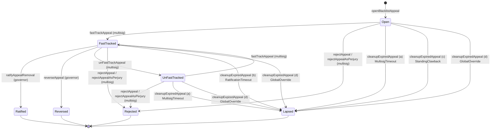

# ADR 031: ContentBlacklist appeal-contract surface

**Date:** 2026-05-14
**Status:** Draft

## Context

[ADR 011 § Blacklist Entry Appeals](011-content-takedown.md#blacklist-entry-appeals) specifies the semantics of the per-entry blacklist-appeal flow (regional-only scope, standing paths and synthetic-standing clawback, evidence requirements, bond and frequency caps, the multisig fast-track + ve-Governor ratification authority, the per-body concurrent-appeal cap, and the lifecycle across `openBlacklistAppeal` → (`fastTrackAppeal` | `rejectAppeal`) → (`ratifyAppealRemoval` | `reverseAppeal` | lapse)). High-level signatures appear in the [`IContentBlacklist` interface](011-content-takedown.md#contract-contentblacklist). ADR 011 § Contract surface defers the implementation details:

> The full ABI (per-appeal storage layout, exact event topics, gas-optimized struct packing) is deferred to a future contract-implementation ADR — same approach as [ADR 028 §6](028-slashing-appeals.md#6-contract-surface).

This ADR is that contract-implementation ADR. It pins the per-appeal storage layout, canonical event topic ordering, gas-packed struct layout, and surface-level integration with the rest of `ContentBlacklist` (suspension flag manipulation, internal `_removeHashRegional` call, `cleanupExpiredAppeal` admissibility checks), giving the implementation in `contracts/` a single canonical reference.

It is the blacklist-side analogue of [#524](https://github.com/decdn/decdn/issues/524) (ADR 032), which does the same for [ADR 028 §6](028-slashing-appeals.md#6-contract-surface)'s slash-appeal entry points on `SafetyReserve`.

This ADR does **not** re-litigate ADR 011 semantic decisions — bond size, filing windows, standing paths, evidence rules, regional-only scope, the synthetic-standing clawback, or the interaction with `SlashJudge`. Restatements here are for self-containedness; the canonical decision authority remains ADR 011.

## Decision

The appeal surface lives on the existing `ContentBlacklist` contract as an extension of [ADR 011 § Contract: ContentBlacklist](011-content-takedown.md#contract-contentblacklist), not as a separate appeal-registry contract. Rationale parallel to [ADR 028 §6](028-slashing-appeals.md#6-contract-surface): appeal records reference entries already on `ContentBlacklist`, the ratification path mutates `ContentBlacklist` state (`entry.suspended`, `entry.suspendedAtUs`, `_removeHashRegional`), and cleanup admissibility tests depend on `ContentBlacklist` views — splitting across two contracts would force every lifecycle transition through cross-call hops with no audit-surface savings.

### 1. Storage layout

Two enums and one struct describe an appeal; auxiliary mappings carry the per-filer and per-region caps from [ADR 011 § Bond and frequency caps](011-content-takedown.md#bond-and-frequency-caps).

```solidity
enum AppealStatus {
    None,           // 0 — sentinel; appeals[0] is uninitialized
    Open,           // 1 — bond escrowed; multisig has not yet acted
    FastTracked,    // 2 — entry.suspended = true; awaiting ve-Governor ratification
    Ratified,       // 3 — terminal: _removeHashRegional executed; bond refunded
    Reversed,       // 4 — terminal: entry.suspended cleared; bond burned
    Rejected,       // 5 — terminal: rejected at intake or after un-fast-track; bond burned
    Lapsed,         // 6 — terminal: cleanupExpiredAppeal fired; bond refunded except for the synthetic-standing clawback case which burns (see § cleanupExpiredAppeal)
    UnFastTracked   // 7 — non-terminal; fast-track reversed by multisig, awaiting fresh review window
}

enum StandingPath {
    None,           // 0 — invalid sentinel
    Publisher,      // 1 — PublisherRegistry.ownerOf(namespaceId) for the disputed hash's namespace
    Operator,       // 2 — operator with node.region matching entry.region
    TokenHolder     // 3 — TOKEN balance ≥ APPEAL_FILER_TOKEN_THRESHOLD; subject to synthetic-standing clawback
}

struct BlacklistAppeal {
    // ─── Slot 0 (32 bytes) ─────────────────────────────────────
    bytes32 blake3Hash;             // disputed hash
    // ─── Slot 1 (32 bytes) ─────────────────────────────────────
    bytes32 evidenceBundleHash;     // off-chain bundle reference (EIP-712-signed declaration + corroborating evidence)
    // ─── Slot 2 (32 bytes, packed) ─────────────────────────────
    address filer;                  // 20 bytes
    uint64  openedAtUs;             // 8 bytes — microsecond timestamp at filing
    uint8   standingPath;           // 1 byte — StandingPath enum, fixed at filing
    uint8   status;                 // 1 byte — AppealStatus enum
    uint8   perjuryFlagged;         // 1 byte — non-zero iff rejection was flagged as perjury (triggers denylist)
    bytes1  _pad0;                  // 1 byte — explicit padding for slot completion
    // ─── Slot 3 (32 bytes) ─────────────────────────────────────
    uint256 bond;                   // escrowed TOKEN amount (BLACKLIST_APPEAL_BOND at filing time)
    // ─── Slot 4 (32 bytes, packed) ─────────────────────────────
    uint64  fastTrackedAtUs;        // 8 bytes — non-zero iff entered FastTracked; refreshed on UnFastTracked → FastTracked re-entry
    uint64  reviewWindowEndsUs;     // 8 bytes — running deadline for the active review window (multisig pre-fast-track, ve-Governor post-fast-track)
    bytes2  region;                 // 2 bytes — ISO 3166-1 alpha-2 per ADR 011's bytes2 gas-optimization
    uint8   alreadyUnFastTracked;   // 1 byte — non-zero iff unFastTrackAppeal has ever fired on this appeal (enforces one-shot per ADR 011)
    bytes13 _pad1;                  // 13 bytes — explicit padding for slot completion
}

mapping(uint256 => BlacklistAppeal) public appeals;
uint256 public appealCounter;   // monotonic; appeals[0] reserved as None sentinel; first real id is 1
```

**Region representation.** `region` is stored as `bytes2` per the [ADR 011 gas-optimization note](011-content-takedown.md#contract-contentblacklist). The mapping is `bytes2 ↔ ISO 3166-1 alpha-2`; the global sentinel `bytes2(0)` is invalid for an appeal (`openBlacklistAppeal` reverts on `region == bytes2(0)`).

**Auxiliary mappings:**

```solidity
// APPEAL_FILER_FREQUENCY — 1 successful appeal per 90 days, per filer (ADR 011)
mapping(address => uint64) public lastRatifiedSuccessUs;

// APPEAL_FILER_REJECTION_COOLDOWN — 3 rejections in rolling 90d → 90d cooldown (ADR 011)
struct RejectionWindow {
    uint64[3] rejections;     // microsecond timestamps; 0 marks an empty slot
    uint64    cooldownUntilUs; // non-zero while a cooldown is active
}
mapping(address => RejectionWindow) public filerRejections;

// Perjury denylist — 365d per-address suspension from the appeal path (ADR 011 § Evidence)
mapping(address => uint64) public perjuryDenylistUntilUs;

// BODY_CONCURRENT_APPEAL_CAP — at most 3 active interim-relief slots per region (ADR 011)
// One body per region (ADR 011 § Regional Governance Bodies), so keying on region is sufficient.
mapping(bytes2 => uint8) public regionActiveReliefCount;

// Bond escrow accounting — TOKEN held by the contract for active appeals.
// Public view; not used in cap arithmetic. Auxiliary to per-appeal `bond` field above
// for off-chain solvency dashboards.
uint256 public totalBondsEscrowed;
```

**`TOKEN` reference** is the existing immutable `IERC20 public immutable TOKEN` already required by `ContentBlacklist` for the bond pull; no additional constructor argument.

### 2. Function signatures and revert table

The five entry points from `IContentBlacklist`, plus permissionless `cleanupExpiredAppeal`, are pinned below with full revert conditions, state transitions, side effects, and emitted events.

```solidity
function openBlacklistAppeal(
    bytes32 blake3Hash,
    string  calldata region,             // hot-path canonicalized to bytes2 internally; see ADR 011
    bytes32 evidenceBundleHash,
    uint8   standingPath
) external returns (uint256 appealId);
```

| Revert | Trigger |
| --- | --- |
| `EmptyRegion()` | `region` canonicalizes to `bytes2(0)` (global entries are out of scope per ADR 011) |
| `EntryNotFound()` | No `BlacklistEntry` exists for `(blake3Hash, region)` |
| `FilingWindowClosed()` | `block.timestamp ≥ entry.addedAt + BLACKLIST_APPEAL_FILING_WINDOW` |
| `InvalidStandingPath()` | `standingPath` is not in `{Publisher, Operator, TokenHolder}` |
| `StandingCheckFailed()` | The filer fails the declared `standingPath` check (e.g., not the namespace owner, region mismatch, balance below `APPEAL_FILER_TOKEN_THRESHOLD`) |
| `FilerOnPerjuryDenylist()` | `perjuryDenylistUntilUs[msg.sender] > nowUs` |
| `FilerInRejectionCooldown()` | `filerRejections[msg.sender].cooldownUntilUs > nowUs` |
| `EmptyEvidenceBundleHash()` | `evidenceBundleHash == bytes32(0)` |
| `BondTransferFailed()` | `TOKEN.transferFrom(msg.sender, address(this), BLACKLIST_APPEAL_BOND)` reverts or returns false |
| `AppealPathNotYetActive()` | Optional: first regional body not yet registered per ADR 011 bootstrap-window degradation note |

**State transitions:** `appealCounter` increments; `appeals[appealCounter] = BlacklistAppeal{status: Open, openedAtUs: nowUs, reviewWindowEndsUs: nowUs + BLACKLIST_MULTISIG_REVIEW_WINDOW, ...}`; `totalBondsEscrowed += BLACKLIST_APPEAL_BOND`. The synthetic-standing clawback check for `standingPath == TokenHolder` schedules a second checkpoint at `openedAtUs + STANDING_LOOKBACK_SECONDS * 1_000_000` — the on-chain second-check fires through `cleanupExpiredAppeal` admissibility condition (c) once the lookback elapses; the contract does not auto-schedule.

**Emits:** `BlacklistAppealOpened(appealId, blake3Hash, region, filer, evidenceBundleHash, standingPath)`.

---

```solidity
function fastTrackAppeal(uint256 appealId) external onlyEmergencyMultisig;
```

| Revert | Trigger |
| --- | --- |
| `AppealNotFound()` | `appeals[appealId].status == None` |
| `AppealNotEligibleForFastTrack()` | `status != Open && status != UnFastTracked` (the two pre-fast-track states; see § State machine) |
| `ReviewWindowExpired()` | `nowUs ≥ appeals[appealId].reviewWindowEndsUs` |
| `BodyConcurrentCapReached()` | `regionActiveReliefCount[appeal.region] ≥ BODY_CONCURRENT_APPEAL_CAP` |

**State transitions:** `status = FastTracked`; `fastTrackedAtUs = nowUs`; `reviewWindowEndsUs = nowUs + BLACKLIST_RATIFICATION_WINDOW`; `regionActiveReliefCount[appeal.region]++`; on the parent entry, `entry.suspended = true`, `entry.suspendedAtUs = nowUs`. The `ContentBlacklist` views `isBlacklisted` / `isBlacklistedInRegion` immediately return false for the parent entry per ADR 011 § Interaction with active slashes.

**Emits:** `BlacklistAppealFastTracked(appealId)`.

---

```solidity
function unFastTrackAppeal(uint256 appealId) external onlyEmergencyMultisig;
```

| Revert | Trigger |
| --- | --- |
| `AppealNotFound()` | `appeals[appealId].status == None` |
| `AppealNotFastTracked()` | `status != FastTracked` (also subsumes the "already-terminal" cases — `Ratified`, `Reversed`, `Rejected`, `Lapsed` — none of which have `status == FastTracked`) |
| `AlreadyUnFastTracked()` | `appeals[appealId].alreadyUnFastTracked != 0` — one-shot per ADR 011, enforced by the Slot 4 flag |

**State transitions:** `status = UnFastTracked`; `alreadyUnFastTracked = 1`; `entry.suspended = false`; `entry.suspendedAtUs` is **preserved** for the closed window so post-resumption evidence-age arithmetic per [ADR 014 § Evidence Staleness](014-on-chain-verification.md#evidence-staleness) sees the historical suspension boundary; `regionActiveReliefCount[appeal.region]--`; `reviewWindowEndsUs = nowUs + BLACKLIST_MULTISIG_REVIEW_WINDOW` (fresh window opens). Bond stays escrowed; `totalBondsEscrowed` unchanged.

**Emits:** `BlacklistAppealUnFastTracked(appealId)`.

---

```solidity
function rejectAppeal(uint256 appealId) external onlyEmergencyMultisig;
function rejectAppealAsPerjury(uint256 appealId) external onlyEmergencyMultisig;
```

`rejectAppealAsPerjury` is a sibling entry point for the ADR 011 § Evidence case where post-hoc evidence shows the sworn declaration was false. It does everything `rejectAppeal` does, plus sets `appeals[appealId].perjuryFlagged = 1` and `perjuryDenylistUntilUs[appeal.filer] = nowUs + 365 days * 1_000_000`. Multisig may call either against an `Open`, `UnFastTracked`, or `FastTracked` appeal; on a `FastTracked` appeal the suspension is released as a side effect (mirrors `unFastTrackAppeal` slot accounting before terminating).

| Revert | Trigger |
| --- | --- |
| `AppealNotFound()` | `appeals[appealId].status == None` |
| `AppealAlreadyTerminal()` | `status ∈ {Ratified, Reversed, Rejected, Lapsed}` |

**State transitions (both functions):** `status = Rejected`; bond is burned via `TOKEN.burn(appeal.bond)` (`ContentBlacklist` holds and burns directly — TOKEN is `ERC20Burnable` per [ADR 026 §1 Burnability](026-gauge-boost-tokenomics.md#burnability)); `totalBondsEscrowed -= appeal.bond`; record a new entry in `filerRejections[appeal.filer]` (rolling window); if the rolling window contains three rejections within the lookback, set `cooldownUntilUs`. If `status` was `FastTracked` at the moment of rejection: also clear `entry.suspended = false` and `regionActiveReliefCount[appeal.region]--` (preserving `entry.suspendedAtUs` per `unFastTrackAppeal` semantics).

**Emits:** `BlacklistAppealRejected(appealId)`. Perjury-flagged rejections additionally emit `BlacklistAppealPerjuryRecorded(appealId, filer, perjuryDenylistUntilUs)`.

---

```solidity
function ratifyAppealRemoval(uint256 appealId) external onlyGovernor;
function reverseAppeal(uint256 appealId) external onlyGovernor;
```

Both require `status == FastTracked` and `nowUs < reviewWindowEndsUs`. Both terminate.

`ratifyAppealRemoval`:

- `status = Ratified`; `regionActiveReliefCount[appeal.region]--`.
- Internal call `_removeHashRegional(appeal.blake3Hash, appeal.region)` — same body as the public `removeHashRegional` but bypassing the `GOVERNANCE_ROLE` check (caller is already `onlyGovernor` per the modifier on this entry point). This emits the standard `HashRemoved(blake3Hash, version, region)` event from `ContentBlacklist`.
- Bond refund: `TOKEN.transfer(appeal.filer, appeal.bond)`; `totalBondsEscrowed -= appeal.bond`; `lastRatifiedSuccessUs[appeal.filer] = nowUs`.
- **Emits:** `BlacklistAppealRatified(appealId)` followed by `HashRemoved(...)`.

`reverseAppeal`:

- `status = Reversed`; `regionActiveReliefCount[appeal.region]--`; `entry.suspended = false`. `entry.effectiveAt` is **preserved** per ADR 011 § Authority and flow — resetting was rejected to avoid retroactively shielding pre-suspension non-compliance.
- Bond burn: `TOKEN.burn(appeal.bond)`; `totalBondsEscrowed -= appeal.bond`.
- **Emits:** `BlacklistAppealReversed(appealId)`.

---

```solidity
function cleanupExpiredAppeal(uint256 appealId) external;
```

Permissionless. Reverts unless one of the four admissibility conditions from [ADR 011 § Contract: ContentBlacklist](011-content-takedown.md#contract-contentblacklist) cleanup interface holds:

| Condition | Test | Bond outcome |
| --- | --- | --- |
| (a) multisig silent past `BLACKLIST_MULTISIG_REVIEW_WINDOW` | `status == Open && nowUs ≥ reviewWindowEndsUs` | refund |
| (b) governance silent past `BLACKLIST_RATIFICATION_WINDOW` | `status == FastTracked && nowUs ≥ reviewWindowEndsUs` | refund |
| (c) synthetic-standing clawback fired | `status == Open && standingPath == TokenHolder && nowUs ≥ openedAtUs + STANDING_LOOKBACK_SECONDS * 1_000_000 && TOKEN.balanceOf(filer) < APPEAL_FILER_TOKEN_THRESHOLD` | **burn** (100%) |
| (d) global override fired | `status ∈ {Open, FastTracked} && _entryExists(appeal.blake3Hash, appeal.region) == false` | refund (per ADR 011 § Global Override — treats as lapse, not reversal) |

**State transitions:** `status = Lapsed` for all four conditions — the terminal-status set is intentionally minimal. The bond outcome (refund for a, b, d; burn for c) is determined by the matched condition per the table above, surfaced through the `LapseReason` indexed sub-field on `BlacklistAppealLapsed` (see § Event topic ordering) so off-chain consumers can distinguish refund-vs-burn cases without parsing follow-on `Transfer` events. If `status` was `FastTracked` when cleanup fires: `regionActiveReliefCount[appeal.region]--`; `entry.suspended = false`; `entry.suspendedAtUs` preserved. `totalBondsEscrowed -= appeal.bond`.

**Emits:** `BlacklistAppealLapsed(appealId, reason)` where `reason` is a `u8` enum (`MultisigTimeout = 1, RatificationTimeout = 2, StandingClawback = 3, GlobalOverride = 4`) mapping 1:1 to the four conditions above.

After cleanup, subsequent calls against the same `appealId` revert with `BlacklistAppealAlreadyClosed()`.

### 3. Event topic ordering

| Event | Topic 1 (indexed) | Topic 2 (indexed) | Topic 3 (indexed) | Non-indexed data |
| --- | --- | --- | --- | --- |
| `BlacklistAppealOpened` | `appealId` | `blake3Hash` | `filer` | `region` (bytes2), `evidenceBundleHash` (bytes32), `standingPath` (uint8) |
| `BlacklistAppealFastTracked` | `appealId` | — | — | (none) |
| `BlacklistAppealUnFastTracked` | `appealId` | — | — | (none) |
| `BlacklistAppealRejected` | `appealId` | — | — | (none) |
| `BlacklistAppealPerjuryRecorded` | `appealId` | `filer` | — | `perjuryDenylistUntilUs` (uint64) |
| `BlacklistAppealRatified` | `appealId` | — | — | (none) |
| `BlacklistAppealReversed` | `appealId` | — | — | (none) |
| `BlacklistAppealLapsed` | `appealId` | `reason` (uint8) | — | (none) |

Indexer convention: clients keying on `(appealId)` use topic 1 across all events; clients reconciling appeals against parent entries key on `(blake3Hash, region)` from `BlacklistAppealOpened` and follow the lifecycle by `appealId`. `region` is non-indexed because `bytes2` topics would force `keccak256` matching for a 2-byte value — wasteful — and the parent-entry side `HashBlacklisted` already indexes the hash.

### 4. State machine



`UnFastTracked → FastTracked` is one-shot per ADR 011 § Contract surface — a second `unFastTrackAppeal` against the same `appealId` reverts with `AlreadyUnFastTracked`.

### 5. Integration with ContentBlacklist core

- **`entry.suspended` writes** happen only from `fastTrackAppeal` (true), `unFastTrackAppeal` (false, preserving `suspendedAtUs`), `reverseAppeal` (false, preserving `suspendedAtUs`), `rejectAppeal` / `rejectAppealAsPerjury` on a `FastTracked` appeal (false, preserving `suspendedAtUs`), and `cleanupExpiredAppeal` cases (b) and (d) (false, preserving `suspendedAtUs`). No other path mutates `suspended`.
- **`entry.suspendedAtUs` is monotonic per entry.** Once written by a fast-track, it is preserved across `unFastTrackAppeal`, `reverseAppeal`, and `cleanupExpiredAppeal` so [ADR 014 § Evidence Staleness](014-on-chain-verification.md#evidence-staleness) can compute evidence age against the historical suspension boundary. A subsequent fresh `fastTrackAppeal` on the same entry overwrites with the new boundary; this is acceptable because each fast-track defines its own suspension epoch.
- **`_removeHashRegional` internal call** from `ratifyAppealRemoval` reuses the same body as the public `removeHashRegional` (which is `onlyGovernor` per ADR 011). The internal variant skips the role check (caller is already `onlyGovernor` on `ratifyAppealRemoval`) and emits `HashRemoved` exactly once.
- **`regionActiveReliefCount` decrement points** are: `unFastTrackAppeal`, `rejectAppeal` / `rejectAppealAsPerjury` on a `FastTracked` appeal, `ratifyAppealRemoval`, `reverseAppeal`, and `cleanupExpiredAppeal` cases (b) and (d) — every transition out of `FastTracked`. Increment is exclusive to `fastTrackAppeal`.

### 6. Multisig capability scope

`fastTrackAppeal`, `unFastTrackAppeal`, `rejectAppeal`, and `rejectAppealAsPerjury` are sub-modes of [ADR 009 § Emergency Multisig](009-governance.md#emergency-multisig)'s existing `suspendRegionalBody` capability — same 3-of-5 threshold, same signing semantics, same post-incident reporting obligations. They do **not** introduce a new multisig power. [ADR 009](009-governance.md#emergency-multisig)'s capability enumeration should be editorially expanded to list the appeal-specific entry points as sub-modes of the regional-body capability (parallel to the recommendation in [ADR 028 §6](028-slashing-appeals.md#6-contract-surface) for SafetyReserve appeals).

### 7. Gas-optimization notes

- **`region` as `bytes2`.** Per ADR 011's gas-optimization note on `BlacklistEntry`, the production region representation is `bytes2`. The `openBlacklistAppeal` external entry takes `string calldata region` for ADR-conformant interface stability but canonicalizes internally to `bytes2` for storage. Helpers (`_toBytes2(string)`) revert on length ≠ 2 or non-ASCII-alpha characters per ISO 3166-1 alpha-2.
- **Struct packing.** The `BlacklistAppeal` struct is laid out across 5 slots (160 bytes total) with explicit padding fields marking unused slot space. Future field additions append to slot 4 (which has 14 bytes of free padding) or open a slot 5.
- **`RejectionWindow` packing.** The fixed-length `uint64[3]` plus `uint64 cooldownUntilUs` fit in a single 32-byte slot, so `filerRejections` is one SLOAD per cap check.
- **`appeals[0]` reserved.** Reading uninitialized appeal records (`appealId == 0` or unallocated) returns `status == None`; functions revert with `AppealNotFound()` on `status == None`. The contract does not store `0`-indexed entries.

## Consequences

### Positive

- Pins storage layout and event schema as a single source of truth, removing the cross-derivation cost between ADR 011's narrative form and the eventual Solidity.
- Parallel structure to [#524](https://github.com/decdn/decdn/issues/524) (ADR 032) keeps both appeal-contract surfaces — slashing and blacklist — auditable under one pattern.
- Permissionless `cleanupExpiredAppeal` plus the four admissibility conditions removes any contract dependency on a privileged scheduler; bond settlement and slot release are eventually consistent through any caller.

### Negative

- Five-slot struct + four auxiliary mappings per appeal carry non-trivial storage cost. Expected volume is low (most regional entries are never appealed; bond + frequency caps + per-body cap bound the active set), but high-volume regional adversarial activity multiplies storage cost linearly.
- Multisig capability scope is implicit: `ADR 009` enumerates four capabilities; the blacklist-appeal entry points are sub-modes of capability (1) (regional-body suspension) but not yet listed. An ADR 009 editorial pass is owed.

### Risks

- **`_pad0` / `_pad1` field accuracy.** Packed slot calculations assume Solidity's standard packing rules; a compiler version change altering slot semantics could silently relocate fields. The implementation MUST include a Foundry storage-layout test (`forge inspect ContentBlacklist storageLayout`) pinned to expected slot offsets.
- **`region` canonicalization at the function boundary.** `openBlacklistAppeal` taking `string calldata region` and canonicalizing to `bytes2` diverges from the rest of `ContentBlacklist`'s internal API. A reviewer should confirm every internal write site uses the `bytes2` form to avoid silent format mismatch between the appeal record and the parent entry.

## References

- [ADR 011 § Blacklist Entry Appeals](011-content-takedown.md#blacklist-entry-appeals) — semantic spec.
- [ADR 028 §6](028-slashing-appeals.md#6-contract-surface) — companion contract surface (slash appeals).
- [ADR 026 §1 Burnability](026-gauge-boost-tokenomics.md#burnability) — `ERC20Burnable` interface used for bond burns.
- [ADR 014 § Evidence Staleness](014-on-chain-verification.md#evidence-staleness) — consumer of `entry.suspendedAtUs`.
