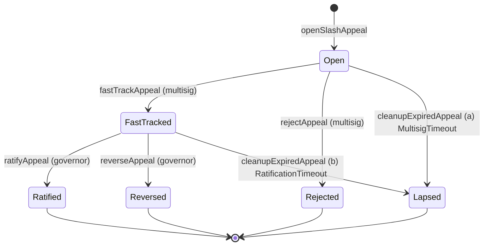

# ADR 032: SafetyReserve appeal-surface contract surface

**Date:** 2026-05-14
**Status:** Draft

## Context

[ADR 028 § Slashing Appeals](028-slashing-appeals.md) specifies the semantics of the post-slash appeal flow: 30-day filing window, multisig fast-track + ve-Governor ratification, per-appeal escrow, bond economics, and the 365-day per-operator frequency cap. [ADR 028 §6](028-slashing-appeals.md#6-contract-surface) names five new entry points on `SafetyReserve` and pins the `Slashed`-event coupling, and the [`ISafetyReserve` interface](026-gauge-boost-tokenomics.md#contract-safetyreserve) in ADR 026 §5 carries five appeal-flow event-name stubs — but storage layout, per-appeal escrow accounting, and the full Solidity event signatures (including `SlashAppealLapsed`, named in ADR 028's [Forward references](028-slashing-appeals.md#forward-references-follow-up-adrs) but absent from ADR 026 §5's stub) live nowhere canonical.

This ADR is the contract-implementation ADR for the slash-appeal surface — the slashing-side analogue of [ADR 031 — ContentBlacklist appeal-contract surface](031-content-blacklist-appeals-contract.md), which performs the same job for [ADR 011 § Blacklist Entry Appeals](011-content-takedown.md#blacklist-entry-appeals). It pins the per-appeal storage layout, the per-appeal escrow accounting from [ADR 028 §2](028-slashing-appeals.md#2-appeal-flow), all six canonical event signatures (resolving the `SlashAppealLapsed` gap), the state machine, and the integration with the cross-category pending-claim queue from [ADR 026 §5 Cross-category payout ordering](026-gauge-boost-tokenomics.md#cross-category-payout-ordering) (PR [#522](https://github.com/decdn/decdn/pull/522)). [#452](https://github.com/decdn/decdn/issues/452) consumes this ADR as its contract spec.

This ADR does **not** re-litigate semantic decisions made in ADR 028 — bond size, filing windows, evidence rules, frequency caps, the 48-hour SafetyReserve counter-bundle window, restitution caps, or the reputation-preservation rule. Where this ADR restates such elements it is for self-containedness of the contract spec; the canonical decision authority remains ADR 028 and ADR 026 §5. Parameter values (`APPEAL_BOND`, `MULTISIG_REVIEW_WINDOW`, `RATIFICATION_WINDOW`, `MAX_APPEAL_RESTITUTION`, `OPERATOR_APPEAL_FREQUENCY`) are pinned in [#451](https://github.com/decdn/decdn/issues/451) and remain ADR 028 §5's responsibility. Reserve sizing against the 3.3× depletion ratio is tracked at [decdn/finance#3](https://github.com/decdn/finance/issues/3). Audit-pinned constants and gas-optimization micro-tuning are out of scope.

## Decision

The appeal surface lives on the existing `SafetyReserve` contract as an extension of [ADR 026 § Contract: SafetyReserve](026-gauge-boost-tokenomics.md#contract-safetyreserve), not as a separate appeal-registry contract. Rationale parallel to [ADR 028 §6](028-slashing-appeals.md#6-contract-surface): the appeal records reference `SlashJudge.Slashed` events but route restitution through `SafetyReserve.payout()`, the four [ADR 026 §5 spending controls](026-gauge-boost-tokenomics.md#spending-controls) gate both appeal-authorized and direct-authorized payouts uniformly, and the per-appeal escrow lives in the same general-balance accounting that the rest of `SafetyReserve` maintains. Splitting them across two contracts would force every appeal lifecycle transition through cross-call hops without any audit-surface savings — and would re-open the deployment-budget question already settled in [ADR 028 §6 final paragraph](028-slashing-appeals.md#6-contract-surface).

### 1. Storage layout

One enum, two user-defined value types (UDVTs), and one struct describe an appeal; one auxiliary mapping (per-operator frequency cap) and three contract-level counters (appeal id, bond aggregate, lien aggregate) carry the cross-appeal accounting.

```solidity
// User-defined value types for unit-safe time arithmetic.
// EpochIndex and MicroTimestamp are both uint64 at the storage layer (8 bytes,
// same as raw uint64) but the Solidity compiler refuses implicit conversion
// between them, so a future field addition cannot silently mix epoch indices
// with microsecond timestamps. Zero runtime cost. See §Risks "Mixed time units"
// for the hazard this retires.
type EpochIndex is uint64;      // FeeRouter 1-week epoch (ADR 026 §2 Epoch mechanics)
type MicroTimestamp is uint64;  // microsecond wall-clock (block.timestamp * 1_000_000)

enum AppealStatus {
    None,        // 0 — sentinel; appeals[0] is uninitialized
    Open,        // 1 — bond escrowed; multisig has not yet acted
    FastTracked, // 2 — escrowAmount lien recorded against general balance; awaiting ve-Governor ratification
    Ratified,    // 3 — terminal: lien released and equivalent amount disbursed via payout(); bond refunded
    Reversed,    // 4 — terminal: lien released (funds remained in general balance); bond split per ADR 028 §4
    Rejected,    // 5 — terminal: rejected at intake; bond burned 100% per ADR 028 §4
    Lapsed       // 6 — terminal: governance silent; bond refunded (and lien released, if previously fast-tracked)
}

struct Appeal {
    // ─── Slot 0 (32 bytes) ─────────────────────────────────────
    bytes32       evidenceBundleHash;     // MUST equal SlashJudge.Slashed.evidenceHash for the referenced slashId
    // ─── Slot 1 (32 bytes, packed) ─────────────────────────────
    address       appellant;              // 20 bytes — operator who filed; recipient of restitution on ratification
    EpochIndex    openedEpoch;            // 8 bytes — FeeRouter 1-week epoch at filing
    uint8         status;                 // 1 byte — AppealStatus enum
    bytes3        _pad0;                  // 3 bytes — explicit padding for slot completion
    // ─── Slot 2 (32 bytes) ─────────────────────────────────────
    uint256       slashId;                // SlashJudge.Slashed.slashId (ADR 014 §2 — globally monotonic, non-zero)
    // ─── Slot 3 (32 bytes) ─────────────────────────────────────
    uint256       bond;                   // escrowed TOKEN amount (APPEAL_BOND at filing time)
    // ─── Slot 4 (32 bytes) ─────────────────────────────────────
    uint256       escrowAmount;           // USDC lien recorded on fastTrackAppeal (0 until fast-track; participates in the §2 solvency invariant, not a separate balance — see §2 "Escrow is a lien, not a sub-account")
    // ─── Slot 5 (32 bytes, packed) ─────────────────────────────
    MicroTimestamp reviewWindowEndsUs;    // 8 bytes — running deadline for the active review window (multisig pre-fast-track, ve-Governor post-fast-track)
    bytes24       _pad1;                  // 24 bytes — explicit padding for slot completion
}

mapping(uint256 => Appeal) public appeals;
uint256 public appealCounter;   // monotonic; appeals[0] reserved as None sentinel; first real id is 1

// OPERATOR_APPEAL_FREQUENCY — 1 accepted appeal per 365 days, per operator (ADR 028 §5).
// Stored as the microsecond timestamp at which the operator's most-recent successful
// `ratifyAppeal` settled; `ratifyAppeal` reverts if the operator's prior ratification is
// inside the cap window. Mirrors ADR 031's `lastRatifiedSuccessUs` convention.
mapping(address => MicroTimestamp) public lastAcceptedAppealUs;

// Bond escrow accounting — TOKEN held by the contract for active appeals.
// Public view; auxiliary to the per-appeal `bond` field above for off-chain solvency dashboards.
uint256 public totalAppealBondsEscrowed;

// USDC lien aggregate — sum of `escrowAmount` across all appeals with `status == FastTracked`.
// Maintained incrementally (incremented in `fastTrackAppeal`, decremented in `ratifyAppeal` /
// `reverseAppeal` / `cleanupExpiredAppeal` case (b)). Participates in the §2 solvency invariant
// so `payout()` and `fastTrackAppeal` can both check liens without iterating `appeals`.
uint256 public totalEscrowLien;
```

The per-category pending-claim queue is **not** declared here. It lives on `SafetyReserve` proper as the canonical disbursement infrastructure for the four [ADR 026 §5 spending controls](026-gauge-boost-tokenomics.md#spending-controls), with the ordering pinned at [ADR 026 §5 Cross-category payout ordering](026-gauge-boost-tokenomics.md#cross-category-payout-ordering) (`(accrualEpoch asc, claimId asc)`). ADR 032 owns only the per-appeal record; integration is at §5 below.

`openedEpoch` is typed as `EpochIndex` (FeeRouter 1-week epoch per [ADR 026 §2 Epoch mechanics](026-gauge-boost-tokenomics.md#epoch-mechanics)) — this aligns appeals with the `accrualEpoch` keying of the pending-claim queue (§5) so off-chain consumers reconciling appeal-to-claim flow do not need a separate timestamp-to-epoch conversion. The frequency-cap check, by contrast, uses the `MicroTimestamp`-typed `lastAcceptedAppealUs` so the "365 days" bound is enforced exactly (not coarse-grained to whole FeeRouter epochs). `MULTISIG_REVIEW_WINDOW` and `RATIFICATION_WINDOW` are measured in seconds per ADR 028 §5 hard bounds, so `reviewWindowEndsUs` is a `MicroTimestamp` matching the convention used in ADR 031's `BlacklistAppeal` (with the added UDVT discipline introduced here — ADR 031 stores the equivalent fields as raw `uint64`, and a future editorial pass may retrofit those to UDVTs for cross-ADR consistency).

The UDVT split is what makes mixed-unit fields collision-safe: a careless `appeal.openedEpoch == appeal.reviewWindowEndsUs` comparison fails to compile, and a setter that accidentally writes `nowUs` into `openedEpoch` is rejected by the type system. The §Risks "Mixed time units in storage" entry below documents the residual hazard surface that UDVTs do **not** cover.

### 2. Per-appeal escrow accounting

[ADR 028 §2 — Escrow-until-ratification](028-slashing-appeals.md#2-appeal-flow) is the canonical disbursement path: on `fastTrackAppeal`, the equivalent USDC payout is reserved against the SafetyReserve general balance via a per-appeal lien, and only released to the operator on ratification. **Escrow is a lien, not a sub-account.** The reserved USDC stays in `SafetyReserve`'s general USDC accumulator; `escrowAmount` on the `Appeal` record is a per-appeal earmark that participates in solvency arithmetic (the invariant below) but is not a separate balance the contract tracks two ways. This avoids the double-debit pitfall: there is no second USDC transfer between general balance and escrow at fast-track time, and there is no transfer back at ratification — only the lien comes and goes. The six entry points and their escrow / bond bookkeeping are:

| Entry point | Escrow effect (`escrowAmount` field + lien) | Bond effect | Caller |
| --- | --- | --- | --- |
| `openSlashAppeal(slashId, evidenceBundleHash)` | none yet (`escrowAmount == 0`) | `TOKEN.transferFrom(msg.sender, address(this), APPEAL_BOND)`; `totalAppealBondsEscrowed += APPEAL_BOND` | permissionless (appellant) |
| `fastTrackAppeal(appealId)` | `escrowAmount = restitutionUsdcAmount`; `totalEscrowLien += escrowAmount` (lien recorded; no USDC transfer) | held | emergency multisig — [ADR 009](009-governance.md#emergency-multisig) capability (4) |
| `ratifyAppeal(appealId)` | `totalEscrowLien -= escrowAmount` (lien released), then invoke `payout(evidenceBundleHash, appellant, escrowAmount)` — disburses through the [ADR 026 §5 stable interface](026-gauge-boost-tokenomics.md#interface-stability), returning `incidentId` (recorded in `SlashAppealRatified`); on solvency-insolvent path the claim is queued per §5 below | refund: `TOKEN.transfer(appellant, bond)`; `totalAppealBondsEscrowed -= bond` | ve-Governor |
| `reverseAppeal(appealId)` | `totalEscrowLien -= escrowAmount` (lien released; funds remain in general balance) | split per ADR 028 §4: 50% burn via `TOKEN.burn(bond/2)`, 50% routed per § Bond-routing dispatch below; `totalAppealBondsEscrowed -= bond` | ve-Governor |
| `rejectAppeal(appealId)` | none (`escrowAmount == 0`, not yet fast-tracked) | 100% burn: `TOKEN.burn(bond)`; `totalAppealBondsEscrowed -= bond` | emergency multisig — [ADR 009](009-governance.md#emergency-multisig) capability (4) |
| `cleanupExpiredAppeal(appealId)` | if previously fast-tracked: `totalEscrowLien -= escrowAmount` (lien released); otherwise zero | refund: `TOKEN.transfer(appellant, bond)`; `totalAppealBondsEscrowed -= bond` (operator not at fault per ADR 028 §4) | permissionless |

**Solvency invariant** (enforced atomically inside `fastTrackAppeal` and any other call that increments `totalEscrowLien`):

> `totalEscrowLien + Σ pendingClaim.amount ≤ generalBalance` (USDC, net of bond TOKEN holdings)

where `totalEscrowLien` is the sum of `escrowAmount` across all appeals with `status == FastTracked`, `generalBalance` is the contract's USDC balance, and `pendingClaim.amount` is canonical in [ADR 026 §5](026-gauge-boost-tokenomics.md#cross-category-payout-ordering). The check is inline at `fastTrackAppeal`; the call reverts on insolvency rather than over-committing. `payout()` reads the same invariant atomically (with `totalEscrowLien` already decremented by the time it executes inside `ratifyAppeal`, so the lien-released funds are visible to its solvency check), and queues an unfunded portion as a pending claim if the reserve is insolvent at disbursement time.

**Checks-Effects-Interactions ordering at `ratifyAppeal`.** The lien-release-then-payout sequence MUST follow CEI: (1) check frequency cap and `status == FastTracked`; (2) set `appeals[appealId].status = Ratified`, decrement `totalEscrowLien -= escrowAmount`, update `lastAcceptedAppealUs[appellant] = nowUs`, refund bond via `TOKEN.transfer(appellant, bond)`, decrement `totalAppealBondsEscrowed -= bond`; (3) THEN invoke `payout(evidenceBundleHash, appellant, escrowAmount)` and emit `SlashAppealRatified` with the returned `incidentId`. The interaction (`payout`'s downstream USDC transfer to `appellant`) is last. A re-entrant call from a contract `appellant` finds the appeal already in terminal `Ratified` state with the lien released, so the re-entry cannot double-spend the escrow. The same CEI discipline applies on `reverseAppeal` (effects: status, lien, bond split — before the bond-split `TOKEN.transfer`) and on `cleanupExpiredAppeal` (effects: status, lien, bond refund — before the `TOKEN.transfer`).

**Bond-routing dispatch (`reverseAppeal`).** ADR 028 §4 distinguishes two reversal cases by where the 50%-non-burn share of the bond goes:

- *Failed appeal via successful counter-bundle in the 48h gate-3 window:* 50% routed directly to the counter-bundle filer (prevailing-party model from [ADR 014 § Bond Handling](014-on-chain-verification.md#bond-handling)).
- *Failed appeal via ve-Governor reversal with no counter-bundle:* 50% credited to a `SafetyReserve` challenger-incentive pool used to compensate parties who file successful counter-bundles in *future* 48h windows.

The dispatch reads `SafetyReserve`'s gate-3 state for the parent appeal authorization to decide: if a counter-bundle was filed and accepted against this fast-track's `bundleHash`, the recorded filer is the recipient; otherwise the share goes to the challenger-incentive pool address. The gate-3 state lives in `SafetyReserve` proper (alongside the four spending controls) — no per-appeal storage field is required here. The implementation surfaces the recipient via the `bondSplitRecipient` non-indexed field on `SlashAppealReversed` (§3) so off-chain consumers can distinguish the two cases without parsing follow-on `Transfer` events.

Disbursement of `escrowAmount` on `ratifyAppeal` routes through the same `payout(bundleHash, recipient, amount)` interface so [ADR 026 §5 Interface stability](026-gauge-boost-tokenomics.md#interface-stability)'s contract-stable signature is preserved — appeals are an additional *authorization* path into the same payout machinery, not parallel payout machinery. The four [ADR 026 §5 spending controls](026-gauge-boost-tokenomics.md#spending-controls) all apply: (1) attested bundle (`evidenceBundleHash` cross-checked against `SlashJudge.Slashed.evidenceHash` per ADR 028 §6), (2) authorization (multisig fast-track + ve-Governor ratification), (3) 48-hour SafetyReserve counter-bundle window (sequential, between fast-track and ratification per ADR 028 §2 mermaid), (4) post-incident reporting (atomic on `payout()` settlement).

### 3. Solidity event signatures (all six, pinned)

```solidity
event SlashAppealOpened(uint256 indexed appealId, uint256 indexed slashId, address indexed appellant, bytes32 evidenceBundleHash, uint256 bond);
event SlashAppealFastTracked(uint256 indexed appealId, uint256 escrowAmount);
event SlashAppealRejected(uint256 indexed appealId, uint256 bondSlashed);
event SlashAppealRatified(uint256 indexed appealId, uint256 indexed incidentId, address recipient, uint256 restitutionAmount);
event SlashAppealReversed(uint256 indexed appealId, uint256 escrowReturned, address bondSplitRecipient, uint256 bondSplitAmount);
event SlashAppealLapsed(uint256 indexed appealId, uint256 escrowReturned, uint256 bondRefunded);
```

The event-topic table for indexer convention:

| Event | Topic 1 (indexed) | Topic 2 (indexed) | Topic 3 (indexed) | Non-indexed data |
| --- | --- | --- | --- | --- |
| `SlashAppealOpened` | `appealId` | `slashId` | `appellant` | `evidenceBundleHash` (bytes32), `bond` (uint256) |
| `SlashAppealFastTracked` | `appealId` | — | — | `escrowAmount` (uint256) |
| `SlashAppealRejected` | `appealId` | — | — | `bondSlashed` (uint256) |
| `SlashAppealRatified` | `appealId` | `incidentId` | — | `recipient` (address), `restitutionAmount` (uint256) |
| `SlashAppealReversed` | `appealId` | — | — | `escrowReturned` (uint256), `bondSplitRecipient` (address), `bondSplitAmount` (uint256) |
| `SlashAppealLapsed` | `appealId` | — | — | `escrowReturned` (uint256), `bondRefunded` (uint256) |

Indexer convention: clients keying on `(appealId)` use topic 1 across all events; clients reconciling appeals against parent slashes key on `(slashId)` from `SlashAppealOpened` and follow the lifecycle by `appealId`. `appellant` is indexed on `SlashAppealOpened` so operator-facing UIs can subscribe to "my appeals" without scanning every `SlashAppealOpened` payload; subsequent lifecycle events drop the operator topic because the `appealId` index suffices for joins. `incidentId` is indexed on `SlashAppealRatified` so off-chain consumers can join directly against `SafetyReserve.Paid(id, recipient, …)` (whose `id` is indexed per [ADR 026 § Contract: SafetyReserve](026-gauge-boost-tokenomics.md#contract-safetyreserve)) — `incidentId == SafetyReserve.Paid.id` for the disbursement triggered by this ratification. No `evidenceBundleHash` / `recipient` join is needed.

`SlashAppealLapsed.escrowReturned` is `0` when lapse fires from `Open` (no fast-track preceded it, the operator-not-at-fault case from ADR 028 §4 "Governance silent past `MULTISIG_REVIEW_WINDOW`"), and equals the previously-escrowed USDC when lapse fires from `FastTracked` (the operator-not-at-fault case from ADR 028 §4 "Governance silent past `RATIFICATION_WINDOW`"). The field is kept on the event in both cases so off-chain consumers do not need to read prior state to determine whether escrow was active at lapse.

`SlashAppealReversed.bondSplitRecipient` is the address that receives the 50%-non-burn share of the bond per ADR 028 §4 (counter-bundle filer if gate-3 resolved with a successful counter-bundle, otherwise the challenger-incentive pool address). `bondSplitAmount` is the non-burn share (i.e., `bond / 2` net of any rounding); the burned half is emitted separately as a standard `ERC20Burnable.Transfer(_, address(0), _)` event from the TOKEN contract.

### 4. State machine



`cleanupExpiredAppeal(appealId)` admissibility table:

| Condition | Test | Bond outcome | Escrow outcome |
| --- | --- | --- | --- |
| (a) multisig silent past `MULTISIG_REVIEW_WINDOW` | `status == Open && nowUs ≥ reviewWindowEndsUs` | refund | n/a (`escrowAmount == 0`) |
| (b) governance silent past `RATIFICATION_WINDOW` | `status == FastTracked && nowUs ≥ reviewWindowEndsUs` | refund | release lien on `escrowAmount` (funds remain in general balance) |

Both conditions terminate at `status = Lapsed` and emit `SlashAppealLapsed(appealId, escrowReturned, bondRefunded)`. Calls against the same `appealId` after cleanup revert with `AppealAlreadyTerminal`. The reason code is not indexed; the `(escrowReturned == 0)` test distinguishes case (a) from case (b) for off-chain consumers, parallel to ADR 031's `LapseReason` enum but with only two conditions instead of four. ADR 031's conditions (c) `StandingClawback` and (d) `GlobalOverride` have no analogue in slash appeals — there is no standing-path machinery and no global-override path on `SafetyReserve`.

**Frequency-cap check on `ratifyAppeal`.** Reverts if `nowUs - lastAcceptedAppealUs[appeal.appellant] < OPERATOR_APPEAL_FREQUENCY` (365 days in microseconds for the default cap). On success, `lastAcceptedAppealUs[appeal.appellant] = nowUs`. The cap is checked **at ratification**, not at filing, so a rejected or lapsed appeal does not consume the operator's annual budget — consistent with ADR 028 §5 ("Resets on the date the *previous* successful appeal was ratified"). Storing the ratification timestamp (rather than the appeal-opened timestamp) is what makes "resets on the date the previous successful appeal was ratified" exact: an appeal that takes 30 days from filing to ratification anchors the next-eligible date 365 days after its ratification, not 365 days after its filing.

**`reviewWindowEndsUs` lifecycle.** Set to `nowUs + MULTISIG_REVIEW_WINDOW` at `openSlashAppeal`; refreshed at `fastTrackAppeal` to `nowUs + SafetyReserve.appealWindow() + RATIFICATION_WINDOW` — the post-fast-track deadline includes the gate-3 counter-bundle lead-in (the governable `appealWindow` parameter exposed on `SafetyReserve` per [ADR 026 § Contract: SafetyReserve](026-gauge-boost-tokenomics.md#contract-safetyreserve)'s `setAppealWindow` setter, default 48 hours per [ADR 026 §5 Spending controls](026-gauge-boost-tokenomics.md#spending-controls) gate 3) plus the full ratification window. Referencing the parameter name rather than hardcoding "48h" keeps the ADR accurate if governance retunes `appealWindow`. The 48h gate-3 itself is governed by `SafetyReserve`'s gate-3 state and is not duplicated into `reviewWindowEndsUs`; including its duration in the deadline computation is what makes `cleanupExpiredAppeal` condition (b) "governance silent past `RATIFICATION_WINDOW`" fire at the correct time rather than `appealWindow()` early. Cleared (left as historical) on any terminal transition.

### 5. Cross-category ordering hook

ADR 032 owns only the per-appeal record. The cross-category pending-claim queue is canonical in [ADR 026 §5 Cross-category payout ordering](026-gauge-boost-tokenomics.md#cross-category-payout-ordering): the queue is keyed on `(accrualEpoch asc, claimId asc)`, where `accrualEpoch` is the FeeRouter 1-week epoch in which the original `payout()` authorization first hit insolvency and `claimId` is a `SafetyReserve`-monotonic counter assigned at authorization time.

On `ratifyAppeal`, the contract invokes `payout(evidenceBundleHash, appellant, escrowAmount)` and the return value (the assigned incident `id`) is emitted as the indexed `incidentId` topic of `SlashAppealRatified` (§3). ADR 032 does **not** add a per-appeal storage field tracking that handle — the event index is sufficient: indexers join `SlashAppealRatified.incidentId` directly against `SafetyReserve.Paid.id` (both indexed) to reconcile appeal → disbursement → pending-claim flow. If the reserve was insolvent at the call site, the pending-claim entry is observable from `SafetyReserve`'s own pending-claim state under the same `incidentId`.

The disbursement of queued claims is permissionless and follows the head-of-queue path pinned at [ADR 026 §5 Cross-category payout ordering](026-gauge-boost-tokenomics.md#cross-category-payout-ordering) ("any caller may invoke a `disbursePending()` head-of-queue path when reserve solvency permits"). No second-stage authorization is required and no per-payout-category priority signal exists. ADR 032 inherits both properties unchanged.

### 6. Multisig capability scope

`fastTrackAppeal` and `rejectAppeal` are sub-modes of [ADR 009 § Emergency Multisig](009-governance.md#emergency-multisig)'s existing capability (4) "SafetyReserve fast-track authorization" per [ADR 028 §6 Multisig capability scope](028-slashing-appeals.md#6-contract-surface) — same 3-of-5 threshold, same signing semantics, same post-incident reporting obligations. They do **not** introduce a new multisig power. PR [#522](https://github.com/decdn/decdn/pull/522) already amended ADR 009's capability (4) to enumerate these two entry points by name.

`cleanupExpiredAppeal` is a sixth external entry point on `SafetyReserve` introduced by this ADR. It is **permissionless** (anyone can poke once the active review window has elapsed), parallel to ADR 031's `cleanupExpiredAppeal`. It does **not** introduce a new multisig power and does not consume ADR 009 capability (4) — it merely settles state that the multisig and ve-Governor chose not to act on. The sixth entry point expands ADR 028 §6's enumerated five to six; the editorial expansion lands in this PR alongside §3 above.

`ratifyAppeal` and `reverseAppeal` remain `onlyGovernor` per ADR 028 §6. No change to the governor surface.

## Consequences

### Positive

- Pins the storage layout and event schema so the [#452](https://github.com/decdn/decdn/issues/452) implementation has a single source of truth, removing the cross-derivation cost between ADR 028's narrative form and the eventual Solidity.
- Parallel structure to [ADR 031](031-content-blacklist-appeals-contract.md) keeps both appeal-contract surfaces — slashing and blacklist — auditable under the same pattern: slot-aligned struct, event-topic table, Mermaid state machine, permissionless cleanup.
- Permissionless `cleanupExpiredAppeal` plus the two admissibility conditions removes any contract dependency on a privileged scheduler; escrow return, bond refund, and slot release are eventually consistent through any caller.
- Adding `SlashAppealLapsed` to [ADR 026 §5](026-gauge-boost-tokenomics.md#contract-safetyreserve)'s interface stub closes the gap between ADR 026 and ADR 028's Forward references — the six-event set is now canonical in three places (ADR 032 §3, ADR 026 §5, the eventual Solidity).

### Negative

- Six-slot `Appeal` struct plus one auxiliary mapping (`lastAcceptedAppealUs`) and three contract-level uint256 counters (`appealCounter`, `totalAppealBondsEscrowed`, `totalEscrowLien`) carry non-trivial storage cost. Expected volume is low per ADR 028 §8 ("single-digit appeals per quarter at PoC scale, low-tens at production scale"), but high-volume correlated-outage events could multiply per-appeal storage linearly within a short window.
- Adds a sixth external entry point (`cleanupExpiredAppeal`) to `SafetyReserve` — widens the public ABI by one permissionless function plus its two-condition admissibility branch. [ADR 028 §6](028-slashing-appeals.md#6-contract-surface)'s function list, Negative consequence, and forward-reference are updated in lockstep within this PR.
- `SlashAppealReversed`'s `bondSplitRecipient` non-indexed field couples the appeal event schema to `SafetyReserve`'s gate-3 counter-bundle state. If the gate-3 mechanism is ever decoupled from `SafetyReserve` (e.g., moved to a dedicated counter-bundle registry), the event payload changes shape. This coupling is intentional for PoC and is acknowledged in [ADR 028 § Forward references — SafetyReserve future split](028-slashing-appeals.md#forward-references-follow-up-adrs).

### Risks

- **`_pad0` / `_pad1` field accuracy.** The packed slot calculations assume Solidity's standard packing rules; a compiler version change altering slot semantics could silently relocate fields. The implementation MUST include a Foundry storage-layout test (`forge inspect SafetyReserve storageLayout`) pinned to expected slot offsets, mirroring ADR 031's risk note. In addition, the implementation MUST include named Foundry invariant tests covering the lien aggregate and the state-machine constraints:
  - `invariant_lienEqualsSumOfFastTracked` — `totalEscrowLien == Σ appeals[i].escrowAmount where appeals[i].status == AppealStatus.FastTracked`. Catches a missing decrement on any terminal transition out of `FastTracked`.
  - `invariant_fastTrackedImpliesEscrow` — `appeals[i].status == AppealStatus.FastTracked` implies `appeals[i].escrowAmount > 0`. Catches a fast-track that opens with zero restitution or a stale-record bug.
  - `invariant_terminalIsSticky` — once `appeals[i].status ∈ {Ratified, Reversed, Rejected, Lapsed}`, no entry point may transition it out. Catches a missed `AppealAlreadyTerminal` guard.
  - `invariant_bondAccounting` — `totalAppealBondsEscrowed == Σ appeals[i].bond where appeals[i].status ∈ {Open, FastTracked}`. Catches a missing decrement on any bond-release path.

  These invariants are the contractual enforcement boundary for the field-level constraints that §1's UDVT discipline does **not** cover (UDVTs catch unit confusion at compile time; invariant tests catch aggregate-vs-component drift at runtime).
- **Mixed time units in storage — residual surface.** §1's `EpochIndex` / `MicroTimestamp` UDVTs prevent the compiler from silently comparing an epoch index against a microsecond timestamp, but they do **not** prevent: (a) explicit `EpochIndex.unwrap` / `MicroTimestamp.unwrap` casts that bypass the type system, (b) external setters that take raw `uint64` and write into a UDVT-typed slot without unit checks, or (c) arithmetic involving constants where the literal's unit is ambiguous (e.g., `OPERATOR_APPEAL_FREQUENCY` in microseconds vs seconds). The implementation MUST keep UDVT `unwrap` usage rare and explicit, MUST type setter parameters with the UDVT (not raw `uint64`), and MUST express all time-constant literals as named constants whose name encodes the unit (e.g., `OPERATOR_APPEAL_FREQUENCY_US`, matching ADR 014's `MAX_EVIDENCE_AGE_US` convention).

## Alternatives Considered

- **Dedicated `SlashAppealRegistry` contract.** Rejected for the reason stated under [§ Decision](#decision): cross-contract hops on every transition, no audit-surface savings, and the `payout()` integration would need to be re-exposed. Mirrors ADR 031's rejection of `BlacklistAppealRegistry`.
- **Per-appeal `counterBundleFiler` storage field.** Considered for §2's bond-routing dispatch (counter-bundle filer recorded at gate-3 acceptance, read at `reverseAppeal`). Rejected: the gate-3 state already exists on `SafetyReserve` proper; duplicating it into the `Appeal` struct would cost another slot per appeal and require two writes (gate-3 + appeal) on every counter-bundle acceptance. The current design reads gate-3 state directly and surfaces the recipient via the `bondSplitRecipient` event field.
- **Five-condition `LapseReason` enum (ADR 031 style).** Rejected: slash appeals have only two lapse triggers (multisig timeout, ratification timeout), with no standing-path or global-override analogue. A two-enum mapping would over-engineer the case set; the `(escrowReturned == 0)` test suffices for off-chain disambiguation.

## ADRs Affected

- **[ADR 026 § Contract: SafetyReserve](026-gauge-boost-tokenomics.md#contract-safetyreserve):** the `ISafetyReserve` interface stub for slash-appeal extensions is updated in this PR to (a) add the missing `SlashAppealLapsed` event and (b) pin all six event signatures' parameter lists consistently with §3 above. The comment block immediately preceding the stub points at this ADR as the authority on storage and event semantics.
- **[ADR 028 § Forward references](028-slashing-appeals.md#forward-references-follow-up-adrs):** the "future contract-implementation ADR will pin…" bullet is replaced with a back-reference to this ADR.
- **[ADR 028 § Consequences — Negative](028-slashing-appeals.md#negative):** the "Adds five new entry points" sentence is updated to "Adds six new entry points" reflecting the `cleanupExpiredAppeal` introduced here.
- **[architecture.md § Chapter 5 — Verification & enforcement](architecture.md#chapter-5--verification--enforcement)** and **[§ Architectural Decisions](architecture.md#architectural-decisions):** ADR 032 added to the Chapter 5 reading order and the numeric per-ADR index.
- **`decdn/CLAUDE.md`:** the "Next ADR number is 030" line is bumped to "Next ADR number is 033", and the ADR-number provenance note records ADR 032 (`032-safety-reserve-appeals-contract.md`, this ADR) and ADR 031 (`031-content-blacklist-appeals-contract.md`) as canonical, with ADR 030 assigned by in-flight PR #565.

## References

- [ADR 028 — Slashing Appeals and Dispute Escalation](028-slashing-appeals.md) — semantic spec.
- [ADR 031 — ContentBlacklist appeal-contract surface](031-content-blacklist-appeals-contract.md) — companion contract surface (blacklist appeals); structural precedent for this ADR.
- [ADR 026 § Contract: SafetyReserve](026-gauge-boost-tokenomics.md#contract-safetyreserve) — interface stub updated by this ADR.
- [ADR 026 §5 Cross-category payout ordering](026-gauge-boost-tokenomics.md#cross-category-payout-ordering) — queue semantics inherited by ratified appeals (PR [#522](https://github.com/decdn/decdn/pull/522)).
- [ADR 014 §2 `Slashed` event and `slashId` allocation](014-on-chain-verification.md#slashed-event-and-slashid-allocation) — `slashId` and `evidenceBundleHash` coupling.
- [ADR 014 § Bond Handling](014-on-chain-verification.md#bond-handling) — bond-split precedent for `reverseAppeal`'s counter-bundle-filer dispatch.
- [ADR 009 § Emergency Multisig](009-governance.md#emergency-multisig) — capability (4) "SafetyReserve fast-track authorization" enumerates `fastTrackAppeal` and `rejectAppeal`.
- Issue [#524](https://github.com/decdn/decdn/issues/524) — tracking issue (resolves Risk 2 of [#453](https://github.com/decdn/decdn/issues/453)).
- Issue [#452](https://github.com/decdn/decdn/issues/452) — downstream implementation tracker.
