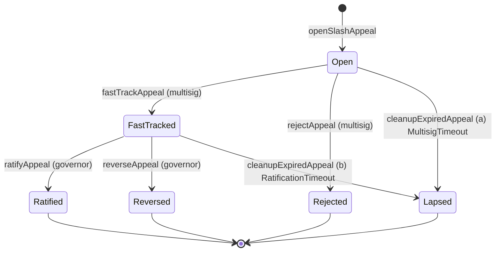

# ADR 032: SafetyReserve appeal-surface contract surface

> **Status:** Retired 2026-05-29 under the SafetyReserve removal. The `SafetyReserve` contract no longer exists. The slash-appeal state machine it pinned (storage layout, escrow lien accounting, six event signatures, the permissionless `cleanupExpiredAppeal` lapse handler) is re-homed to the standalone `SlashAppeal` contract under the escrow-on-slash model; the canonical contract surface is now pinned in [ADR 028 § Contract surface](../028-slashing-appeals.md#contract-surface). Restitution is paid in escrowed TOKEN by `CapacityBond`, not USDC by a reserve, so the escrow-lien / `MAX_APPEAL_RESTITUTION` / TWAP machinery is gone. Original ADR body preserved verbatim below for historical reference; do not link to from canonical ADRs.

**Date:** 2026-05-14
**Status (pre-retirement):** Draft

## Context

[ADR 028 § Slashing Appeals](../028-slashing-appeals.md#adr-028-slashing-appeals-and-dispute-escalation) specifies the post-slash appeal-flow semantics (30-day filing window, multisig fast-track + DecdnGovernor ratification, per-appeal escrow, bond economics, 365-day per-operator frequency cap). [ADR 028 § Contract surface](../028-slashing-appeals.md#contract-surface) names five `SafetyReserve` entry points and pins the `Slashed`-event coupling; the [`ISafetyReserve` interface](033-safety-insurance-reserve.md#contract-safetyreserve) in [ADR 033](033-safety-insurance-reserve.md#adr-033-safety-and-insurance-reserve) carries five appeal-flow event-name stubs. Storage layout, per-appeal escrow accounting, and the full Solidity event signatures (including `SlashAppealLapsed`, named in [ADR 028](../028-slashing-appeals.md#adr-028-slashing-appeals-and-dispute-escalation)'s [Cross-ADR Impact](../028-slashing-appeals.md#cross-adr-impact) but absent from [ADR 033](033-safety-insurance-reserve.md#adr-033-safety-and-insurance-reserve)'s stub) live nowhere canonical.

This is the contract-implementation ADR for the slash-appeal surface — the slashing-side analogue of [ADR 031 — ContentBlacklist appeal-contract surface](../031-content-blacklist-appeals-contract.md#adr-031-contentblacklist-appeal-contract-surface), which does the same for [ADR 011 § Blacklist Entry Appeals](../011-content-takedown.md#blacklist-entry-appeals). It pins the per-appeal storage layout, the per-appeal escrow accounting from [ADR 028 § Appeal flow](../028-slashing-appeals.md#appeal-flow), all six canonical event signatures (resolving the `SlashAppealLapsed` gap), the state machine, and the integration with the cross-category pending-claim queue from [ADR 033 § Cross-category payout ordering](033-safety-insurance-reserve.md#cross-category-payout-ordering).

This ADR does **not** re-litigate [ADR 028](../028-slashing-appeals.md#adr-028-slashing-appeals-and-dispute-escalation) semantic decisions (bond size, filing windows, evidence rules, frequency caps, the 48-hour SafetyReserve counter-bundle window, restitution caps, reputation-preservation rule); restatements here are for self-containedness, with canonical authority remaining [ADR 028](../028-slashing-appeals.md#adr-028-slashing-appeals-and-dispute-escalation) and [ADR 033](033-safety-insurance-reserve.md#adr-033-safety-and-insurance-reserve). Parameter values (`APPEAL_BOND`, `MULTISIG_REVIEW_WINDOW`, `RATIFICATION_WINDOW`, `MAX_APPEAL_RESTITUTION`, `OPERATOR_APPEAL_FREQUENCY`) remain [ADR 028 § Hard caps and frequency limits](../028-slashing-appeals.md#hard-caps-and-frequency-limits)'s responsibility. Reserve sizing against the 3.3× depletion ratio, audit-pinned constants, and gas micro-tuning are out of scope.

## Decision

The appeal surface lives on the existing `SafetyReserve` contract as an extension of [ADR 033 § Contract: SafetyReserve](033-safety-insurance-reserve.md#contract-safetyreserve), not as a separate appeal-registry contract. Rationale parallel to [ADR 028 § Contract surface](../028-slashing-appeals.md#contract-surface): appeal records reference `SlashJudge.Slashed` events but route restitution through `SafetyReserve.payout()`, the four [ADR 033 § spending controls](033-safety-insurance-reserve.md#spending-controls) gate appeal-authorized and direct-authorized payouts uniformly, and per-appeal escrow lives in the same general-balance accounting as the rest of `SafetyReserve`. Splitting across two contracts would force every lifecycle transition through cross-call hops with no audit-surface savings, re-opening the deployment-budget question settled in [ADR 028 § Contract surface](../028-slashing-appeals.md#contract-surface).

### Storage layout

One enum, two user-defined value types (UDVTs), and one struct describe an appeal; one auxiliary mapping (per-operator frequency cap) and three contract-level counters (appeal id, bond aggregate, lien aggregate) carry the cross-appeal accounting.

```solidity
// UDVTs for unit-safe time arithmetic. Both are uint64 at the storage layer
// (8 bytes, zero runtime cost) but are not implicitly convertible, so a future
// field addition cannot mix epoch indices with microsecond timestamps.
// See §Risks "Mixed time units" for the residual hazard surface.
type EpochIndex is uint64;      // FeeRouter 1-week epoch counter; governance-canonical for vote weight per ADR 036
type MicroTimestamp is uint64;  // microsecond wall-clock (block.timestamp * 1_000_000)

enum AppealStatus {
    None,        // 0 — sentinel; appeals[0] is uninitialized
    Open,        // 1 — bond escrowed; multisig has not yet acted
    FastTracked, // 2 — escrowAmount lien recorded against general balance; awaiting DecdnGovernor ratification
    Ratified,    // 3 — terminal: lien released and equivalent amount disbursed via payout(); bond refunded
    Reversed,    // 4 — terminal: lien released (funds remained in general balance); bond split per ADR 028 § Appeal bond
    Rejected,    // 5 — terminal: rejected at intake; bond burned 100% per ADR 028 § Appeal bond
    Lapsed       // 6 — terminal: governance silent; bond refunded (and lien released, if previously fast-tracked)
}

struct Appeal {
    // ─── Slot 0 (32 bytes) ─────────────────────────────────────
    bytes32       evidenceBundleHash;     // MUST equal SlashJudge.Slashed.evidenceHash for the referenced slashId
    // ─── Slot 1 (32 bytes, packed) ─────────────────────────────
    address       appellant;              // 20 bytes — operator who filed; recipient of restitution on ratification
    EpochIndex    openedEpoch;            // 8 bytes — FeeRouter 1-week epoch at filing
    uint8         status;                 // 1 byte — AppealStatus enum
    bytes3        _pad0;                  // 3 bytes — explicit padding for slot completion
    // ─── Slot 2 (32 bytes) ─────────────────────────────────────
    uint256       slashId;                // SlashJudge.Slashed.slashId (ADR 014 § SlashJudge Contract — globally monotonic, non-zero)
    // ─── Slot 3 (32 bytes) ─────────────────────────────────────
    uint256       bond;                   // escrowed TOKEN amount (APPEAL_BOND at filing time)
    // ─── Slot 4 (32 bytes) ─────────────────────────────────────
    uint256       escrowAmount;           // USDC lien recorded on fastTrackAppeal (0 until fast-track; participates in the § Per-appeal escrow accounting solvency invariant, not a separate balance — see § Per-appeal escrow accounting "Escrow is a lien, not a sub-account")
    // ─── Slot 5 (32 bytes, packed) ─────────────────────────────
    MicroTimestamp reviewWindowEndsUs;    // 8 bytes — running deadline for the active review window (multisig pre-fast-track, DecdnGovernor post-fast-track)
    bytes24       _pad1;                  // 24 bytes — explicit padding for slot completion
}

mapping(uint256 => Appeal) public appeals;
uint256 public appealCounter;   // monotonic; appeals[0] reserved as None sentinel; first real id is 1

// OPERATOR_APPEAL_FREQUENCY — 1 accepted appeal per 365 days, per operator (ADR 028 § Hard caps and frequency limits).
// Microsecond timestamp of the operator's most-recent successful `ratifyAppeal`;
// `ratifyAppeal` reverts if the prior ratification is inside the cap window.
// Mirrors ADR 031's `lastRatifiedSuccessUs` convention.
mapping(address => MicroTimestamp) public lastAcceptedAppealUs;

// Bond escrow accounting — TOKEN held for active appeals. Auxiliary to the
// per-appeal `bond` field for off-chain solvency dashboards.
uint256 public totalAppealBondsEscrowed;

// USDC lien aggregate — Σ `escrowAmount` over appeals with `status == FastTracked`.
// Maintained incrementally (incremented in `fastTrackAppeal`, decremented in
// `ratifyAppeal` / `reverseAppeal` / `cleanupExpiredAppeal` case (b)). Participates
// in the § Per-appeal escrow accounting solvency invariant so `payout()` and `fastTrackAppeal` check liens
// without iterating `appeals`.
uint256 public totalEscrowLien;
```

The per-category pending-claim queue is **not** declared here. It lives on `SafetyReserve` proper as the canonical disbursement infrastructure for the four [ADR 033 § spending controls](033-safety-insurance-reserve.md#spending-controls), ordering pinned at [ADR 033 § Cross-category payout ordering](033-safety-insurance-reserve.md#cross-category-payout-ordering) (`(accrualEpoch asc, claimId asc)`). [ADR 032](032-safety-reserve-appeals-contract.md#adr-032-safetyreserve-appeal-surface-contract-surface) owns only the per-appeal record; integration is at [§ Cross-category ordering hook](#cross-category-ordering-hook).

`openedEpoch` is `EpochIndex` (FeeRouter 1-week epoch per [ADR 026 § FeeRouter split](../026-tokenomics.md#feerouter-split)) to align appeals with the `accrualEpoch` keying of the pending-claim queue ([§ Cross-category ordering hook](#cross-category-ordering-hook)), avoiding a timestamp-to-epoch conversion for off-chain consumers. The frequency-cap check uses the `MicroTimestamp`-typed `lastAcceptedAppealUs` so the 365-day bound is exact, not coarse-grained to whole epochs. `MULTISIG_REVIEW_WINDOW` and `RATIFICATION_WINDOW` are seconds per [ADR 028 § Hard caps and frequency limits](../028-slashing-appeals.md#hard-caps-and-frequency-limits) hard bounds, so `reviewWindowEndsUs` is a `MicroTimestamp`, matching [ADR 031](../031-content-blacklist-appeals-contract.md#adr-031-contentblacklist-appeal-contract-surface)'s `BlacklistAppeal` convention — [ADR 031](../031-content-blacklist-appeals-contract.md#adr-031-contentblacklist-appeal-contract-surface) stores the equivalent fields as raw `uint64`; a future editorial pass may retrofit those to UDVTs for consistency. The residual hazard UDVTs do **not** cover is in § Risks "Mixed time units in storage".

### Per-appeal escrow accounting

[ADR 028 § Appeal flow](../028-slashing-appeals.md#appeal-flow) is the canonical disbursement path: on `fastTrackAppeal`, the equivalent USDC payout is reserved against the SafetyReserve general balance via a per-appeal lien, released to the operator only on ratification. **Escrow is a lien, not a sub-account.** The reserved USDC stays in `SafetyReserve`'s general USDC accumulator; `escrowAmount` on the `Appeal` record is a per-appeal earmark that participates in solvency arithmetic (invariant below) but is not a separate balance tracked two ways. This avoids the double-debit pitfall: no second USDC transfer between general balance and escrow at fast-track, and no transfer back at ratification — only the lien comes and goes. The six entry points and their escrow / bond bookkeeping:

| Entry point | Escrow effect (`escrowAmount` field + lien) | Bond effect | Caller |
| --- | --- | --- | --- |
| `openSlashAppeal(slashId, evidenceBundleHash)` | none yet (`escrowAmount == 0`) | `TOKEN.transferFrom(msg.sender, address(this), APPEAL_BOND)`; `totalAppealBondsEscrowed += APPEAL_BOND` | permissionless (appellant) |
| `fastTrackAppeal(appealId)` | `escrowAmount = restitutionUsdcAmount`; `totalEscrowLien += escrowAmount` (lien recorded; no USDC transfer) | held | emergency multisig — [ADR 009](../009-governance.md#emergency-multisig) capability (4) |
| `ratifyAppeal(appealId)` | `totalEscrowLien -= escrowAmount` (lien released), then invoke `payout(evidenceBundleHash, appellant, escrowAmount)` — disburses through the [ADR 033 § stable interface](033-safety-insurance-reserve.md#interface-stability), returning `incidentId` (recorded in `SlashAppealRatified`); on solvency-insolvent path the claim is queued per [§ Cross-category ordering hook](#cross-category-ordering-hook) below | refund: `TOKEN.transfer(appellant, bond)`; `totalAppealBondsEscrowed -= bond` | DecdnGovernor |
| `reverseAppeal(appealId)` | `totalEscrowLien -= escrowAmount` (lien released; funds remain in general balance) | split per [ADR 028 § Appeal bond](../028-slashing-appeals.md#appeal-bond): 50% burn via `TOKEN.burn(bond/2)`, 50% routed per § Bond-routing dispatch below; `totalAppealBondsEscrowed -= bond` | DecdnGovernor |
| `rejectAppeal(appealId)` | none (`escrowAmount == 0`, not yet fast-tracked) | 100% burn: `TOKEN.burn(bond)`; `totalAppealBondsEscrowed -= bond` | emergency multisig — [ADR 009](../009-governance.md#emergency-multisig) capability (4) |
| `cleanupExpiredAppeal(appealId)` | if previously fast-tracked: `totalEscrowLien -= escrowAmount` (lien released); otherwise zero | refund: `TOKEN.transfer(appellant, bond)`; `totalAppealBondsEscrowed -= bond` (operator not at fault per [ADR 028 § Appeal bond](../028-slashing-appeals.md#appeal-bond)) | permissionless |

**Solvency invariant** (enforced atomically inside `fastTrackAppeal` and any other call that increments `totalEscrowLien`):

> `totalEscrowLien + Σ pendingClaim.amount ≤ generalBalance` (USDC, net of bond TOKEN holdings)

where `totalEscrowLien` is the sum of `escrowAmount` across all appeals with `status == FastTracked`, `generalBalance` is the contract's USDC balance, and `pendingClaim.amount` is canonical in [ADR 033 § Cross-category payout ordering](033-safety-insurance-reserve.md#cross-category-payout-ordering). The check is inline at `fastTrackAppeal`; the call reverts on insolvency rather than over-committing. `payout()` reads the same invariant atomically (with `totalEscrowLien` already decremented by the time it executes inside `ratifyAppeal`, so the lien-released funds are visible to its solvency check), and queues an unfunded portion as a pending claim if the reserve is insolvent at disbursement time.

**Checks-Effects-Interactions ordering at `ratifyAppeal`.** The lien-release-then-payout sequence MUST follow CEI: (1) check frequency cap and `status == FastTracked`; (2) set `appeals[appealId].status = Ratified`, decrement `totalEscrowLien -= escrowAmount`, update `lastAcceptedAppealUs[appellant] = nowUs`, refund bond via `TOKEN.transfer(appellant, bond)`, decrement `totalAppealBondsEscrowed -= bond`; (3) THEN invoke `payout(evidenceBundleHash, appellant, escrowAmount)` and emit `SlashAppealRatified` with the returned `incidentId`. The interaction (`payout`'s downstream USDC transfer to `appellant`) is last. A re-entrant call from a contract `appellant` finds the appeal already in terminal `Ratified` state with the lien released, so the re-entry cannot double-spend the escrow. The same CEI discipline applies on `reverseAppeal` (effects: status, lien, bond split — before the bond-split `TOKEN.transfer`) and on `cleanupExpiredAppeal` (effects: status, lien, bond refund — before the `TOKEN.transfer`).

**Bond-routing dispatch (`reverseAppeal`).** [ADR 028 § Appeal bond](../028-slashing-appeals.md#appeal-bond) distinguishes two reversal cases by where the 50%-non-burn share of the bond goes:

- *Failed appeal via successful counter-bundle in the 48h gate-3 window:* 50% routed directly to the counter-bundle filer (prevailing-party model from [ADR 014 § Bond Handling](../014-on-chain-verification.md#bond-handling)).
- *Failed appeal via DecdnGovernor reversal with no counter-bundle:* 50% credited to a `SafetyReserve` challenger-incentive pool used to compensate parties who file successful counter-bundles in *future* 48h windows.

The dispatch reads `SafetyReserve`'s gate-3 state for the parent appeal authorization: if a counter-bundle was filed and accepted against this fast-track's `bundleHash`, the recorded filer is the recipient; otherwise the share goes to the challenger-incentive pool address. Gate-3 state lives in `SafetyReserve` proper (alongside the four spending controls) — no per-appeal storage field required. The recipient is surfaced via the `bondSplitRecipient` non-indexed field on `SlashAppealReversed` ([§ Solidity event signatures (all six, pinned)](#solidity-event-signatures-all-six-pinned)) so off-chain consumers distinguish the two cases without parsing follow-on `Transfer` events.

Disbursement of `escrowAmount` on `ratifyAppeal` routes through the same `payout(bundleHash, recipient, amount)` interface, preserving [ADR 033 § Interface stability](033-safety-insurance-reserve.md#interface-stability)'s contract-stable signature — appeals are an additional *authorization* path into the same payout machinery, not parallel machinery. The four [ADR 033 § spending controls](033-safety-insurance-reserve.md#spending-controls) all apply: (1) attested bundle (`evidenceBundleHash` cross-checked against `SlashJudge.Slashed.evidenceHash` per [ADR 028 § Contract surface](../028-slashing-appeals.md#contract-surface)), (2) authorization (multisig fast-track + DecdnGovernor ratification), (3) 48-hour SafetyReserve counter-bundle window (sequential, between fast-track and ratification per [ADR 028 § Appeal flow](../028-slashing-appeals.md#appeal-flow) mermaid), (4) post-incident reporting (atomic on `payout()` settlement).

### Solidity event signatures (all six, pinned)

```solidity
event SlashAppealOpened(uint256 indexed appealId, uint256 indexed slashId, address indexed appellant, bytes32 evidenceBundleHash, uint256 bond);
event SlashAppealFastTracked(uint256 indexed appealId, uint256 escrowAmount);
event SlashAppealRejected(uint256 indexed appealId, uint256 bondSlashed);
event SlashAppealRatified(uint256 indexed appealId, uint256 indexed incidentId, address recipient, uint256 restitutionAmount);
event SlashAppealReversed(uint256 indexed appealId, uint256 escrowReturned, address bondSplitRecipient, uint256 bondSplitAmount);
event SlashAppealLapsed(uint256 indexed appealId, uint256 escrowReturned, uint256 bondRefunded);
```

The event-topic table for indexer convention:

| Event | Topic 1 (indexed) | Topic 2 (indexed) | Topic 3 (indexed) | Non-indexed data |
| --- | --- | --- | --- | --- |
| `SlashAppealOpened` | `appealId` | `slashId` | `appellant` | `evidenceBundleHash` (bytes32), `bond` (uint256) |
| `SlashAppealFastTracked` | `appealId` | — | — | `escrowAmount` (uint256) |
| `SlashAppealRejected` | `appealId` | — | — | `bondSlashed` (uint256) |
| `SlashAppealRatified` | `appealId` | `incidentId` | — | `recipient` (address), `restitutionAmount` (uint256) |
| `SlashAppealReversed` | `appealId` | — | — | `escrowReturned` (uint256), `bondSplitRecipient` (address), `bondSplitAmount` (uint256) |
| `SlashAppealLapsed` | `appealId` | — | — | `escrowReturned` (uint256), `bondRefunded` (uint256) |

Indexer convention: clients keying on `(appealId)` use topic 1 across all events; clients reconciling appeals against parent slashes key on `(slashId)` from `SlashAppealOpened` then follow by `appealId`. `appellant` is indexed on `SlashAppealOpened` for "my appeals" subscriptions; subsequent lifecycle events drop the operator topic since `appealId` suffices for joins. `incidentId` is indexed on `SlashAppealRatified` to join directly against `SafetyReserve.Paid(id, recipient, …)` (`id` indexed per [ADR 033 § Contract: SafetyReserve](033-safety-insurance-reserve.md#contract-safetyreserve)) — `incidentId == SafetyReserve.Paid.id` for the disbursement this ratification triggered. No `evidenceBundleHash` / `recipient` join needed.

`SlashAppealLapsed.escrowReturned` is `0` when lapse fires from `Open` (no fast-track preceded; [ADR 028 § Appeal bond](../028-slashing-appeals.md#appeal-bond) "Governance silent past `MULTISIG_REVIEW_WINDOW`"), and equals the previously-escrowed USDC when lapse fires from `FastTracked` ([ADR 028 § Appeal bond](../028-slashing-appeals.md#appeal-bond) "Governance silent past `RATIFICATION_WINDOW`"). The field is on the event in both cases so consumers need not read prior state to know whether escrow was active at lapse.

`SlashAppealReversed.bondSplitRecipient` receives the 50%-non-burn bond share per [ADR 028 § Appeal bond](../028-slashing-appeals.md#appeal-bond) (counter-bundle filer if gate-3 resolved with a successful counter-bundle, else the challenger-incentive pool address). `bondSplitAmount` is the non-burn share (`bond / 2` net of rounding); the burned half is emitted separately as `ERC20Burnable.Transfer(_, address(0), _)` from the TOKEN contract.

### State machine



`cleanupExpiredAppeal(appealId)` admissibility table:

| Condition | Test | Bond outcome | Escrow outcome |
| --- | --- | --- | --- |
| (a) multisig silent past `MULTISIG_REVIEW_WINDOW` | `status == Open && nowUs ≥ reviewWindowEndsUs` | refund | n/a (`escrowAmount == 0`) |
| (b) governance silent past `RATIFICATION_WINDOW` | `status == FastTracked && nowUs ≥ reviewWindowEndsUs` | refund | release lien on `escrowAmount` (funds remain in general balance) |

Both conditions terminate at `status = Lapsed` and emit `SlashAppealLapsed(appealId, escrowReturned, bondRefunded)`. Calls against the same `appealId` after cleanup revert with `AppealAlreadyTerminal`. The reason code is not indexed; the `(escrowReturned == 0)` test distinguishes case (a) from (b) for off-chain consumers, parallel to [ADR 031](../031-content-blacklist-appeals-contract.md#adr-031-contentblacklist-appeal-contract-surface)'s `LapseReason` enum but with two conditions instead of four. [ADR 031](../031-content-blacklist-appeals-contract.md#adr-031-contentblacklist-appeal-contract-surface)'s conditions (c) `StandingClawback` and (d) `GlobalOverride` have no analogue here — no standing-path machinery and no global-override path on `SafetyReserve`.

**Frequency-cap check on `ratifyAppeal`.** Reverts if `nowUs - lastAcceptedAppealUs[appeal.appellant] < OPERATOR_APPEAL_FREQUENCY` (365 days in microseconds, default cap). On success, `lastAcceptedAppealUs[appeal.appellant] = nowUs`. Checked **at ratification**, not at filing, so a rejected or lapsed appeal does not consume the operator's annual budget — consistent with [ADR 028 § Hard caps and frequency limits](../028-slashing-appeals.md#hard-caps-and-frequency-limits) ("Resets on the date the *previous* successful appeal was ratified"). Storing the ratification timestamp (not the appeal-opened timestamp) makes that rule exact: a 30-day-to-ratify appeal anchors the next-eligible date 365 days after ratification, not after filing.

**`reviewWindowEndsUs` lifecycle.** Set to `nowUs + MULTISIG_REVIEW_WINDOW` at `openSlashAppeal`; refreshed at `fastTrackAppeal` to `nowUs + SafetyReserve.appealWindow() + RATIFICATION_WINDOW` — the post-fast-track deadline includes the gate-3 counter-bundle lead-in (governable `appealWindow` per [ADR 033 § Contract: SafetyReserve](033-safety-insurance-reserve.md#contract-safetyreserve)'s `setAppealWindow` setter, default 48 hours per [ADR 033 § Spending controls](033-safety-insurance-reserve.md#spending-controls) gate 3) plus the full ratification window. Referencing the parameter name rather than hardcoding "48h" keeps the ADR accurate if governance retunes `appealWindow`. The 48h gate-3 is governed by `SafetyReserve`'s gate-3 state and not duplicated into `reviewWindowEndsUs`; including its duration in the deadline is what makes `cleanupExpiredAppeal` condition (b) fire at the correct time rather than `appealWindow()` early. Cleared (left as historical) on any terminal transition.

### Cross-category ordering hook

[ADR 032](032-safety-reserve-appeals-contract.md#adr-032-safetyreserve-appeal-surface-contract-surface) owns only the per-appeal record. The cross-category pending-claim queue is canonical in [ADR 033 § Cross-category payout ordering](033-safety-insurance-reserve.md#cross-category-payout-ordering): keyed on `(accrualEpoch asc, claimId asc)`, where `accrualEpoch` is the FeeRouter 1-week epoch the original `payout()` authorization first hit insolvency and `claimId` is a `SafetyReserve`-monotonic counter assigned at authorization time.

On `ratifyAppeal`, the contract invokes `payout(evidenceBundleHash, appellant, escrowAmount)` and the returned incident `id` is emitted as the indexed `incidentId` topic of `SlashAppealRatified` ([§ Solidity event signatures (all six, pinned)](#solidity-event-signatures-all-six-pinned)). [ADR 032](032-safety-reserve-appeals-contract.md#adr-032-safetyreserve-appeal-surface-contract-surface) does **not** add a per-appeal storage field tracking that handle — the event index suffices: indexers join `SlashAppealRatified.incidentId` against `SafetyReserve.Paid.id` (both indexed) to reconcile appeal → disbursement → pending-claim flow. If the reserve was insolvent at the call site, the pending-claim entry is observable from `SafetyReserve`'s own pending-claim state under the same `incidentId`.

Disbursement of queued claims is permissionless via the head-of-queue path pinned at [ADR 033 § Cross-category payout ordering](033-safety-insurance-reserve.md#cross-category-payout-ordering) ("any caller may invoke a `disbursePending()` head-of-queue path when reserve solvency permits"). No second-stage authorization is required and no per-payout-category priority signal exists; [ADR 032](032-safety-reserve-appeals-contract.md#adr-032-safetyreserve-appeal-surface-contract-surface) inherits both unchanged.

### Multisig capability scope

`fastTrackAppeal` and `rejectAppeal` are sub-modes of [ADR 009 § Emergency Multisig](../009-governance.md#emergency-multisig)'s existing capability (4) "SafetyReserve fast-track authorization" per [ADR 028 § Contract surface](../028-slashing-appeals.md#contract-surface) — same 3-of-5 threshold, signing semantics, and post-incident reporting obligations. They do **not** introduce a new multisig power. [ADR 009](../009-governance.md#adr-009-governance-model)'s capability (4) already enumerates these two by name.

`cleanupExpiredAppeal` is a sixth external entry point on `SafetyReserve` introduced by this ADR. It is **permissionless** (anyone can poke once the active review window has elapsed), parallel to [ADR 031](../031-content-blacklist-appeals-contract.md#adr-031-contentblacklist-appeal-contract-surface)'s `cleanupExpiredAppeal`. It does **not** introduce a new multisig power and does not consume [ADR 009](../009-governance.md#adr-009-governance-model) capability (4) — it settles state the multisig and DecdnGovernor chose not to act on. The sixth entry point expands [ADR 028 § Contract surface](../028-slashing-appeals.md#contract-surface)'s enumerated five to six; the editorial expansion lands in this PR alongside [§ Solidity event signatures (all six, pinned)](#solidity-event-signatures-all-six-pinned).

`ratifyAppeal` and `reverseAppeal` remain `onlyGovernor` per [ADR 028 § Contract surface](../028-slashing-appeals.md#contract-surface). No change to the governor surface.

## Consequences

### Positive

- Pins the storage layout and event schema as a single source of truth, removing cross-derivation between [ADR 028](../028-slashing-appeals.md#adr-028-slashing-appeals-and-dispute-escalation)'s narrative and the eventual Solidity.
- Parallel structure to [ADR 031](../031-content-blacklist-appeals-contract.md#adr-031-contentblacklist-appeal-contract-surface) keeps both appeal-contract surfaces auditable under one pattern: slot-aligned struct, event-topic table, Mermaid state machine, permissionless cleanup.
- Permissionless `cleanupExpiredAppeal` plus the two admissibility conditions removes any dependency on a privileged scheduler; escrow return, bond refund, and slot release are eventually consistent through any caller.
- Adding `SlashAppealLapsed` to [ADR 033 § Contract: SafetyReserve](033-safety-insurance-reserve.md#contract-safetyreserve)'s interface stub closes the [ADR 033](033-safety-insurance-reserve.md#adr-033-safety-and-insurance-reserve) / [ADR 028](../028-slashing-appeals.md#adr-028-slashing-appeals-and-dispute-escalation) forward-reference gap — the six-event set is now canonical in three places ([ADR 032 § Solidity event signatures (all six, pinned)](032-safety-reserve-appeals-contract.md#solidity-event-signatures-all-six-pinned), [ADR 033](033-safety-insurance-reserve.md#adr-033-safety-and-insurance-reserve), the eventual Solidity).

### Negative

- Six-slot `Appeal` struct plus one auxiliary mapping (`lastAcceptedAppealUs`) and three uint256 counters (`appealCounter`, `totalAppealBondsEscrowed`, `totalEscrowLien`) carry non-trivial storage cost. Volume is low per [ADR 028 § Frivolous-appeal abuse model](../028-slashing-appeals.md#frivolous-appeal-abuse-model) ("single-digit appeals per quarter at PoC scale, low-tens at production scale"), but correlated-outage events could multiply per-appeal storage linearly in a short window.
- Adds a sixth external entry point (`cleanupExpiredAppeal`) — widens the public ABI by one permissionless function plus its two-condition admissibility branch. [ADR 028 § Contract surface](../028-slashing-appeals.md#contract-surface)'s function list, Negative consequence, and forward-reference are updated in lockstep in this PR.
- `SlashAppealReversed`'s `bondSplitRecipient` non-indexed field couples the appeal event schema to `SafetyReserve`'s gate-3 counter-bundle state. If gate-3 is ever decoupled from `SafetyReserve` (e.g., a dedicated counter-bundle registry), the event payload changes shape. The coupling is intentional for PoC and acknowledged in [ADR 028 § Cross-ADR Impact — SafetyReserve future split](../028-slashing-appeals.md#cross-adr-impact).

### Risks

- **`_pad0` / `_pad1` field accuracy.** Packed slot calculations assume Solidity's standard packing rules; a compiler version change could silently relocate fields. The implementation MUST include a Foundry storage-layout test (`forge inspect SafetyReserve storageLayout`) pinned to expected slot offsets, mirroring [ADR 031](../031-content-blacklist-appeals-contract.md#adr-031-contentblacklist-appeal-contract-surface)'s risk note. The implementation MUST also include named Foundry invariant tests covering the lien aggregate and state-machine constraints:
  - `invariant_lienEqualsSumOfFastTracked` — `totalEscrowLien == Σ appeals[i].escrowAmount where appeals[i].status == AppealStatus.FastTracked`. Catches a missing decrement on any terminal transition out of `FastTracked`.
  - `invariant_fastTrackedImpliesEscrow` — `appeals[i].status == AppealStatus.FastTracked` implies `appeals[i].escrowAmount > 0`. Catches a fast-track that opens with zero restitution or a stale-record bug.
  - `invariant_terminalIsSticky` — once `appeals[i].status ∈ {Ratified, Reversed, Rejected, Lapsed}`, no entry point may transition it out. Catches a missed `AppealAlreadyTerminal` guard.
  - `invariant_bondAccounting` — `totalAppealBondsEscrowed == Σ appeals[i].bond where appeals[i].status ∈ {Open, FastTracked}`. Catches a missing decrement on any bond-release path.

  These invariants are the contractual enforcement boundary for field-level constraints [§ Storage layout](#storage-layout)'s UDVT discipline does **not** cover (UDVTs catch unit confusion at compile time; invariant tests catch aggregate-vs-component drift at runtime).
- **Mixed time units in storage — residual surface.** [§ Storage layout](#storage-layout)'s `EpochIndex` / `MicroTimestamp` UDVTs prevent the compiler from silently comparing an epoch index against a microsecond timestamp, but do **not** prevent: (a) explicit `EpochIndex.unwrap` / `MicroTimestamp.unwrap` casts bypassing the type system, (b) external setters taking raw `uint64` and writing a UDVT-typed slot without unit checks, or (c) arithmetic with constants whose literal unit is ambiguous (e.g., `OPERATOR_APPEAL_FREQUENCY` microseconds vs seconds). The implementation MUST keep UDVT `unwrap` usage rare and explicit, MUST type setter parameters with the UDVT (not raw `uint64`), and MUST express all time-constant literals as named constants encoding the unit (e.g., `OPERATOR_APPEAL_FREQUENCY_US`, matching [ADR 014](../014-on-chain-verification.md#adr-014-on-chain-verification-for-slashing-evidence)'s `MAX_EVIDENCE_AGE_US`).

## References

- [ADR 028 — Slashing Appeals and Dispute Escalation](../028-slashing-appeals.md#adr-028-slashing-appeals-and-dispute-escalation) — semantic spec.
- [ADR 031 — ContentBlacklist appeal-contract surface](../031-content-blacklist-appeals-contract.md#adr-031-contentblacklist-appeal-contract-surface) — companion contract surface (blacklist appeals); structural precedent for this ADR.
- [ADR 033 § Contract: SafetyReserve](033-safety-insurance-reserve.md#contract-safetyreserve) — interface stub updated by this ADR.
- [ADR 033 § Cross-category payout ordering](033-safety-insurance-reserve.md#cross-category-payout-ordering) — queue semantics inherited by ratified appeals.
- [ADR 014 § `Slashed` event and `slashId` allocation](../014-on-chain-verification.md#slashed-event-and-slashid-allocation) — `slashId` and `evidenceBundleHash` coupling.
- [ADR 014 § Bond Handling](../014-on-chain-verification.md#bond-handling) — bond-split precedent for `reverseAppeal`'s counter-bundle-filer dispatch.
- [ADR 009 § Emergency Multisig](../009-governance.md#emergency-multisig) — capability (4) "SafetyReserve fast-track authorization" enumerates `fastTrackAppeal` and `rejectAppeal`.
