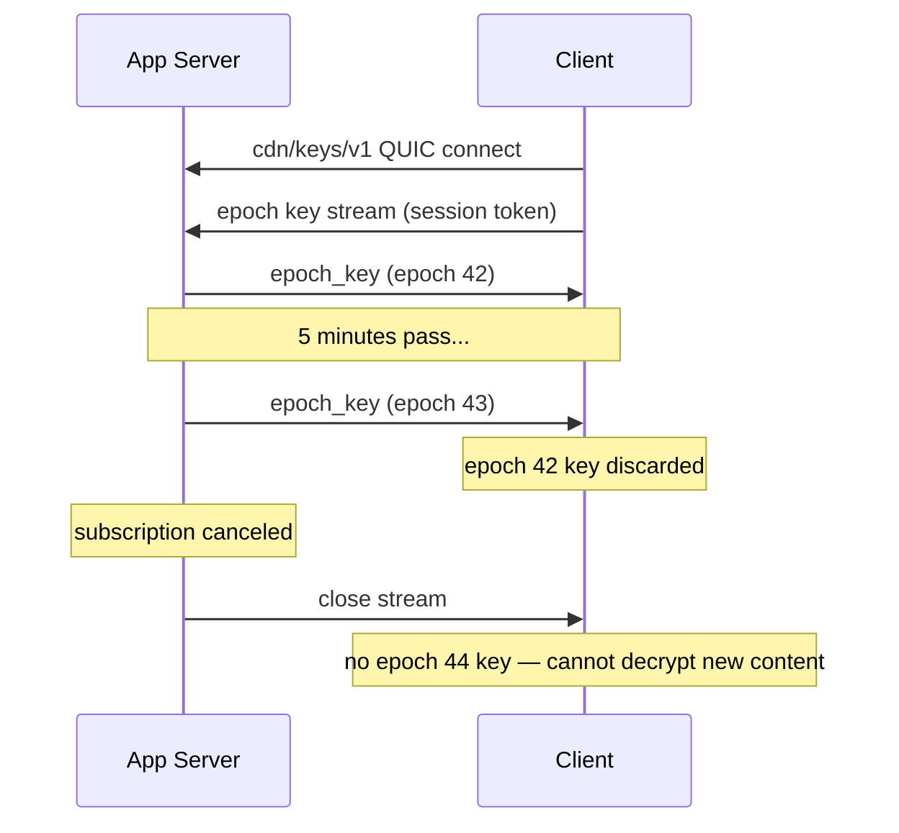
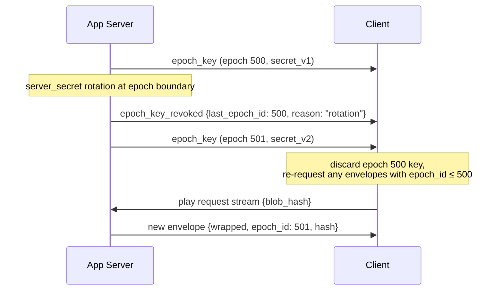
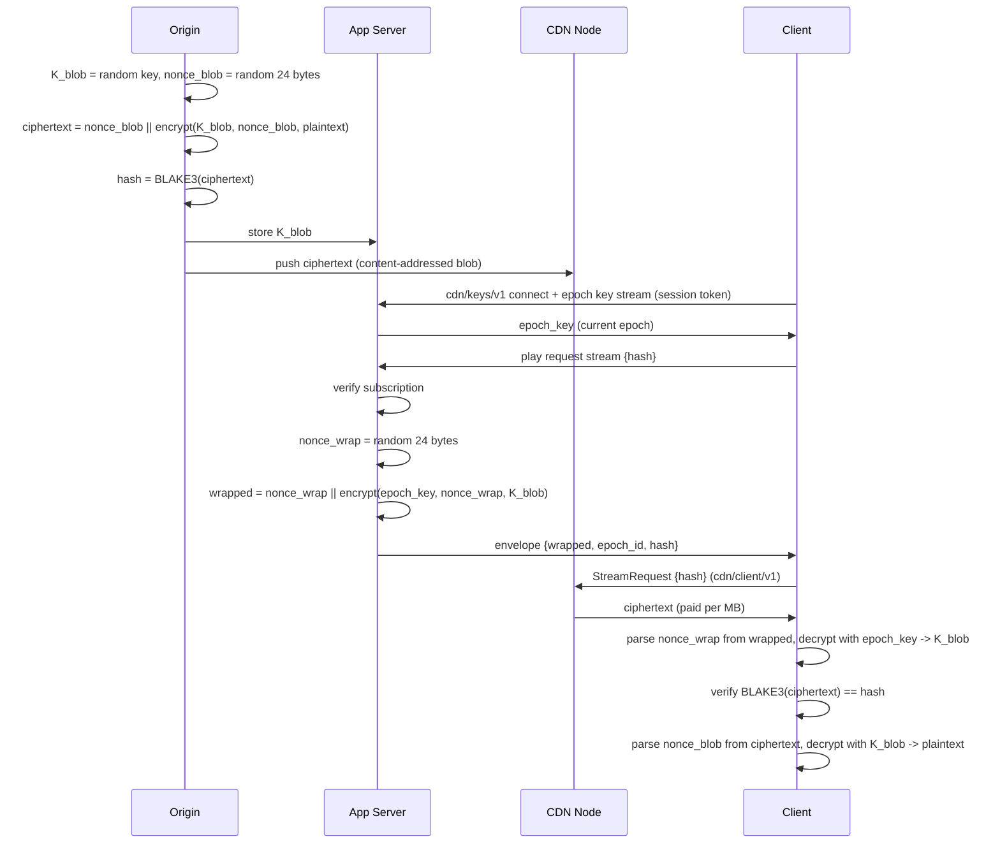
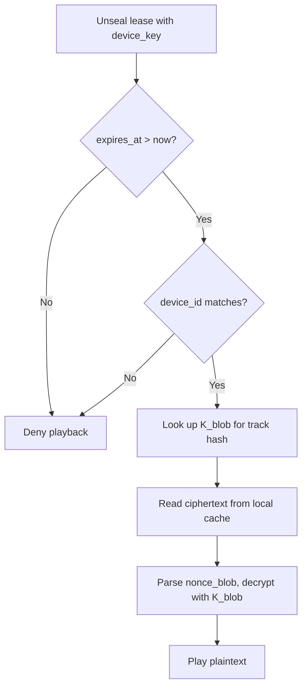
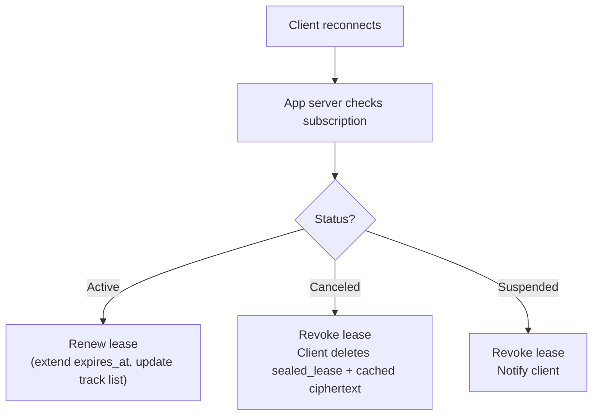

# Appendix: Encrypted Content Publishing on deCDN

> **This is an appendix, not a core protocol ADR.** The deCDN protocol is encryption-agnostic — content addressing means the network shuttles bytes, plaintext or ciphertext is the publisher's choice. This document specifies one deployment pattern for an encrypted-content publishing system on top of deCDN, including the companion app server and `cdn/keys/v1` ALPN — neither of which are CDN protocol participants. Alternative encryption schemes (e.g., direct symmetric distribution, group-keyed) are acceptable.

> **Not end-to-end encryption.** True E2E means per-recipient encryption — incompatible with content-addressed caching where one blob is served to many clients. This appendix specifies **subscription-gated access to commonly-encrypted content**: each blob is content-level encrypted once at ingest with a random `K_blob`; the same ciphertext is served to all authorized clients; access is granted and revoked at the key-distribution layer via epoch-rotated wrapping. The closest formal analogues are **broadcast encryption** and **conditional access**.

## Context

CDN nodes deliver content but should not be able to read it. QUIC provides transport encryption, but nodes see plaintext at rest and during forwarding for unencrypted blobs. For subscription-gated streaming (e.g., a Spotify-clone scenario), content must use content-level encryption with subscription-gated decryption: only authorized, actively-subscribed clients can decrypt delivered blobs, and revocation must be possible without re-encrypting content.

The encryption scheme must satisfy these constraints:

- Content-addressing (BLAKE3) must remain global — the same track produces the same hash for all clients and across all time periods
- CDN nodes, protocol, payment channels, and caching must remain unchanged
- Access must be revocable when a subscription expires, without re-encrypting content
- A compromised client must not gain access to the full catalog — blast radius must be proportional to what was individually requested
- There is no single master key whose compromise unlocks all content

## Decision

**Envelope encryption with epoch-rotated key distribution.**

Two independent layers: a permanent content layer and an ephemeral key delivery layer.

### Content Layer (at ingest, once per blob)

The origin generates a random symmetric key per blob, encrypts the content, and stores both ciphertext and key:

```
K_blob      = random 256-bit key
nonce_blob  = random 24-byte nonce
ciphertext  = nonce_blob || XChaCha20-Poly1305(K_blob, nonce_blob, plaintext)
hash        = BLAKE3(ciphertext)
```

The stored blob is `nonce (24 bytes) || AEAD output (encrypted data + 16-byte tag)`. The BLAKE3 hash covers the nonce, so content-addressing is unaffected. The client reads the first 24 bytes as the nonce before decrypting. Since each blob is encrypted exactly once with a CSPRNG-generated nonce, nonce collision is cryptographically negligible.

`K_blob` is stored in the app server's key store (never on CDN nodes). The ciphertext (including its prepended nonce) is pushed to the CDN network as an ordinary content-addressed blob. CDN nodes only ever see ciphertext.

XChaCha20-Poly1305 is chosen over AES-256-GCM: its 24-byte nonce eliminates nonce-reuse risk with random generation, and it needs no hardware AES support. All nonces MUST be generated from a CSPRNG. All XChaCha20-Poly1305 outputs in this scheme use the `nonce (24 bytes) || AEAD output` wire format: first 24 bytes are the nonce, remainder is the AEAD encrypted data and authentication tag.

### Key Delivery Layer (per play request)

#### App Server (External Component)

An app server gates access and delivers `K_blob` to authorized clients. It is operated by the content provider and is **not** a CDN protocol participant (no gossip, probing, or staking), but shares the iroh QUIC transport layer with the network, communicating with clients over iroh QUIC on the `cdn/keys/v1` ALPN ([ADR 005](005-protocol.md)). It handles subscription auth, billing integration, and key management — content-provider concerns — while reusing the same transport stack the client already has for CDN delivery.

The app server accepts `cdn/keys/v1` connections from clients. A single connection carries three stream types, discriminated by the `KeysMessage` protocol enum ([ADR 013](013-schema-evolution.md)) — each message is varint-length-prefixed and the enum discriminant identifies the message type, consistent with all other ALPNs:

- **Epoch key stream** (`EpochKeyAuth`/`EpochKey`/`EpochKeyRevoked` variants, long-lived, bidirectional) — client sends `{session_token}`, server pushes `epoch_key` and `epoch_key_revoked` events. Server closes the stream on subscription expiry. Doubles as a presence signal for concurrent stream limiting.
- **Play request** (`PlayRequest`/`PlayResponse` variants, short-lived, request-response) — client sends `{blob_hash}`, server responds with `{wrapped, epoch_id, blob_hash}`. The client's subscription is already authenticated on the epoch key stream.
- **Offline lease request** (`OfflineLeaseRequest`/`OfflineLeaseResponse` variants, short-lived, request-response) — client sends `{track_hashes[], device_id}`, server responds with the lease structure (see [Offline Playback](#offline-playback-lease-based-access)).

The QUIC handshake mutually authenticates the client's iroh NodeId and encrypts the channel (TLS 1.3). The session token on the epoch key stream binds the iroh identity to the provider's subscriber account.

**Authentication sequencing:** The client MUST establish an authenticated epoch key stream (`EpochKeyAuth`) before opening play request or offline lease streams. The app server MUST reject play/lease streams (`PlayRequest`, `OfflineLeaseRequest`) on connections without an active, authenticated epoch key stream — responding with an error and closing the stream. This binds every play/lease request to a verified subscriber session.

The technology stack, deployment model, and auth mechanism are provider choices — the CDN protocol only requires the app server accepts `cdn/keys/v1` connections and the client possesses the correct epoch key and envelope before issuing a `StreamRequest` to a CDN node.

#### Key Wrapping Protocol

The app server gates access and delivers `K_blob` to authorized clients using two mechanisms combined:

**Epoch keys** rotate on a fixed interval (default: 5 minutes). The app server derives each epoch key deterministically:

```
epoch_id  = floor(now_unix / 300)
epoch_key = BLAKE3_derive_key("decdn-epoch-key-v1", provider_node_id || server_secret || epoch_id.to_le_bytes())
```

Uses BLAKE3's `derive_key` mode (not keyed hash). The context string is hardcoded and application-specific per BLAKE3's API contract. Key material is concatenated as: `provider_node_id` (raw 32-byte Ed25519 public key) || `server_secret` (32 bytes, `CSPRNG`-generated) || `epoch_id` (8-byte little-endian `u64`). The provider's NodeId is in the key material (not the context string) to prevent cross-provider key collisions if two providers share the same `server_secret`. Implementations MUST assert `server_secret.len() == 32` before key derivation.

**Per-request envelope:** On each play request, the app server verifies the client's subscription is active, then wraps `K_blob` with the current epoch key:

```
nonce_wrap = random 24-byte nonce
wrapped    = nonce_wrap || XChaCha20-Poly1305(epoch_key, nonce_wrap, K_blob)
envelope   = {wrapped, epoch_id, blob_hash}
```

The envelope is sent directly over the authenticated `cdn/keys/v1` QUIC stream. QUIC TLS 1.3 provides confidentiality and mutual authentication — no additional asymmetric encryption layer (such as `crypto_box_seal`) is needed. This eliminates the X25519 key from the client's key set: the client needs only its iroh Ed25519 key (QUIC authentication) and its Ethereum secp256k1 key (payments). See [ADR 012](012-client.md) for the full client key management specification.

To decrypt the blob, the client needs both the envelope and the current epoch key.

**Epoch key delivery:** Epoch keys are pushed to clients over the epoch key stream on the `cdn/keys/v1` connection. The client opens a long-lived bidirectional QUIC stream (`EpochKeyAuth` — see [ADR 013](013-schema-evolution.md)) and sends its session token. The app server validates the token, then pushes epoch keys as they rotate. When the subscription expires or is canceled, the server closes the stream and the client receives no further epoch keys.



##### Rotation signaling

When the app server rotates `server_secret` (see periodic rotation mitigation under [Consequences](#consequences)), it sends an `epoch_key_revoked` event on the epoch key stream notifying clients that outstanding epoch keys are being invalidated:

```
epoch_key_revoked = {
    last_epoch_id: u64,   // last epoch ID derived from the outgoing server_secret
    reason: "rotation"    // extensible — e.g., "emergency" for unscheduled rotation
}
```

The event is followed immediately by the next `epoch_key` push (the first key derived from the new `server_secret`), so clients transition without a gap.



**Client behavior on `epoch_key_revoked`:**

1. Discard the cached epoch key for `last_epoch_id` (and any earlier epoch keys, if retained)
2. Any envelopes referencing `epoch_id <= last_epoch_id` are stale — the client must re-request them via a play request stream to obtain envelopes wrapped with the new epoch key
3. Wait for the immediately following `epoch_key` push before attempting to decrypt new content

**Disconnected clients:** A client whose `cdn/keys/v1` connection dropped before receiving the `epoch_key_revoked` event discovers the rotation when it attempts to unwrap an envelope with a stale epoch key: the XChaCha20-Poly1305 AEAD decryption fails (authentication tag mismatch). On AEAD failure during blob key unwrapping, the client SHOULD reconnect to the app server and re-request the affected envelope via a play request stream. This is not a new failure mode — a dropped connection already prevents receiving new epoch keys (see above), so the client must reconnect regardless.

### Client Decryption Flow

```
1. Receive envelope {wrapped, epoch_id, blob_hash} from app server (cdn/keys/v1 play request stream)
2. Parse nonce_wrap (first 24 bytes) from wrapped
3. Decrypt remainder with epoch_key and nonce_wrap -> K_blob
4. Fetch ciphertext from CDN via existing protocol (StreamRequest{blob_hash})
5. Verify BLAKE3(ciphertext) == blob_hash
6. Parse nonce_blob (first 24 bytes) from ciphertext
7. Decrypt remainder with K_blob and nonce_blob -> plaintext
8. Discard K_blob from memory after use
```

### Full System Flow



### Offline Playback (lease-based access)

The online scheme (epoch keys over a persistent connection) assumes connectivity. Offline playback requires a second access mode trading revocation speed for availability.

**Offline lease issuance:** When a client requests offline access for specific tracks, the app server builds a lease and the client seals it locally with a device-bound key:

```
Client requests offline access for tracks [hash_1, hash_2, ..., hash_n]

App server:
  1. Verify subscription is active
  2. Verify device count is within limit (max 3-5 per account)
  3. Verify track count is within limit (max 500 per device)
  4. Build lease:

     lease = {
         version: 1,
         k_blobs: {hash_1: K_1, hash_2: K_2, ...},
         issued_at: 1743300000,
         expires_at: 1745892000,       // 30 days
         device_id: "device_xyz",
         account_id: "alice"
     }

  5. Return lease to client over cdn/keys/v1 offline lease request stream (OfflineLeaseResponse)
     // Authenticated QUIC connection; TLS 1.3 provides confidentiality
     // for the plaintext K_blob values. Client already authenticated
     // via the epoch key stream.

Client (on device):
  6. Seal lease to device keystore for at-rest protection:

     sealed_lease = AEAD_Seal(device_key, lease)
     // device_key: 256-bit symmetric key managed by the platform keystore:
     //   iOS: Keychain (hardware-backed where available; non-exportable)
     //   Android: Hardware-backed Keystore (AES-256-GCM; non-exportable)
     //   Desktop: OS credential store (key may be returned to user-space; less secure)
     // On mobile, the keystore performs the AEAD internally and the
     // client holds only an opaque key handle. On desktop, the app may
     // retrieve device_key and MUST zeroize it from process memory
     // immediately after use. Primitive is platform-dependent (typically AES-256-GCM).

  7. Store sealed_lease on disk
```

**Offline playback flow:**



> **Note:** The `expires_at` check is client-enforced only; a tampered client can bypass it. Actual revocation relies on the lease TTL combined with the check-in protocol — without a renewed lease, the client cannot obtain `K_blob` values for new epochs.

**Content download:** Before going offline, the client downloads tracks through the normal CDN protocol (`cdn/client/v1`, paid per MB); ciphertext is stored in local cache. Identical to online streaming — the CDN protocol does not distinguish streaming from download-for-offline.

**Check-in and revocation:** When connectivity returns, the client contacts the app server to renew or revoke the lease:



If the client never checks in, the lease expires at `expires_at` and offline playback stops. The client retains cached ciphertext but cannot decrypt it without a valid lease.

**Relationship to the online scheme:** The two modes are complementary and coexist.

| | Online (epoch keys) | Offline (lease) |
| --- | --- | --- |
| Key source | Epoch key via `cdn/keys/v1` + envelope | Sealed lease from device keystore |
| K_blob lifetime in client | Transient — in memory, discarded after play | Persistent — on disk, sealed to device key |
| Revocation speed | ~5 minutes (epoch boundary) | Up to 30 days (lease TTL) |
| Server dependency | Continuous | None until lease expires |
| Content source | CDN nodes (streamed) | Local cache (pre-downloaded) |
| Blast radius if compromised | K_blobs for tracks played in current epoch | K_blobs for all tracks in lease (up to 500) |

The offline lease intentionally weakens two properties of the online scheme: K_blob values persist on disk rather than transiently in memory, and revocation is delayed from 5 minutes to the lease TTL. Accepted tradeoff — the same one every major streaming service makes; no cryptographic solution provides both offline playback and instant revocation.

**Device key compromise (jailbroken devices):** If a device's keystore is compromised, the attacker can unseal the lease and extract all K_blob values in it. Blast radius is bounded by `max_tracks` (up to 500 tracks per device). Mitigations are operational, not cryptographic:

- Device attestation (iOS App Attest, Android Play Integrity) — refuse to issue leases to compromised devices
- Device limit per account (3-5) — bounds the total exposure per subscriber
- Per-account audio watermarking — pirated tracks trace back to the source account
- Behavioral detection — flag accounts that download max tracks, never stream online, and churn subscriptions

## Alternatives Considered

The four publishing-shape alternatives evaluated against the chosen design (client-enforced expiry, decryption proxy, proxy re-encryption, per-client ECIES) are recorded in [`_history/alternatives-pre-launch.md` § Encrypted Content Publishing (appendix)](_history/alternatives-pre-launch.md#encrypted-content-publishing-appendix).

## Consequences

**Positive:**

- Global content-addressing is preserved: one ciphertext, one hash, one cached copy for all clients. CDN nodes, protocol, payments, and gossip are unchanged.
- CDN nodes never see plaintext or any key material. Compromising a node yields only ciphertext.
- Compromising a client yields only `K_blob` values for tracks it has already played — not the catalog. Each blob has an independent random key; there is no master key.
- Subscription revocation takes effect within one epoch (5 minutes): the client's epoch key stream is closed and previously received envelopes cannot be unwrapped without the next epoch key.
- The epoch key stream on `cdn/keys/v1` doubles as a presence signal for concurrent stream limiting.
- Single transport stack: both CDN delivery and key delivery use iroh QUIC, eliminating a separate WebSocket/SSE stack on the client.
- The key delivery layer uses only primitives already in the stack: BLAKE3 for KDF, XChaCha20-Poly1305 for symmetric encryption. No asymmetric encryption (X25519/`crypto_box_seal`) is needed — QUIC TLS 1.3 handles confidentiality and authentication.

**Negative:**

- Adds an app server component that shares the iroh QUIC transport layer but is not a CDN protocol participant (documented in [architecture.md](architecture.md#external-components) under External Components). Content providers must run an `iroh::Endpoint` accepting `cdn/keys/v1` connections alongside their auth/billing infrastructure. A minimal reference implementation may be provided in a separate repository.
- The app server's key store (holding all `K_blob` values) is a high-value target. It must be protected with a KMS or HSM in production. Key-store compromise exposes all content.
- A hacked client can still extract `K_blob` for tracks it plays in real-time. This is inherent to any scheme where the client produces plaintext output — equivalent to the "analog hole" in DRM systems.
- Epoch key rotation creates a hard dependency on the `cdn/keys/v1` connection. If it drops, the client cannot decrypt new tracks until it reconnects and receives the current epoch key. The client should cache the current and previous epoch keys in memory (not disk) to survive brief disconnects and to unwrap envelopes for content buffered just before an epoch boundary.
- `server_secret` (the epoch key derivation root) is a critical secret. Rotating it invalidates all outstanding epoch keys and envelopes, forcing all clients to re-request. Rotation is signaled via the `epoch_key_revoked` event on the epoch key stream (see [Rotation signaling](#rotation-signaling)); disconnected clients fall back to AEAD-failure-triggered reconnection. Rotation should be infrequent and coordinated.
- **No forward secrecy for epoch keys.** Because `epoch_key = BLAKE3_derive_key("decdn-epoch-key-v1", provider_node_id || server_secret || epoch_id.to_le_bytes())` is purely deterministic, compromising `server_secret` retroactively exposes every past and future epoch key until rotation — an attacker who obtains it can derive any epoch key. Envelopes are protected only by the QUIC TLS session (no additional asymmetric layer), so a recorded envelope captured in transit is protected by TLS forward secrecy — but an attacker with `server_secret` who also compromises the app server (the most likely scenario for `server_secret` exposure) has direct access to the `K_blob` key store, bypassing the envelope path entirely. This is the most significant cryptographic limitation of the current design. Production deployments MUST mitigate with these complementary measures:

  1. **HSM-backed derivation.** Store `server_secret` in a hardware security module (AWS CloudHSM, Azure Managed HSM, GCP Cloud HSM) or cloud KMS as a non-exportable key, and derive `epoch_key` values inside that service using a supported PRF/KDF. Most cloud KMS products do not natively support BLAKE3; if BLAKE3 is required, use an HSM that can run the BLAKE3-based KDF internally. Otherwise, substitute a KMS-supported primitive (e.g., HMAC-SHA256 or HKDF-SHA256 over `epoch_id`) for the production derivation path. This reduces the attack surface to HSM/KMS API access control rather than secret exfiltration.
  2. **Periodic `server_secret` rotation on epoch boundaries.** Rotate on a fixed schedule (e.g., every 24–72 hours), aligning each rotation to an epoch boundary so each `epoch_id` maps to exactly one `server_secret`. The new secret derives `epoch_key` values only for future `epoch_id`s; the outgoing secret handles the current epoch and is destroyed once that epoch expires. This keeps `epoch_key = KDF(server_secret, epoch_id)` and the envelope `{wrapped, epoch_id, blob_hash}` unambiguous — no version identifier is needed because each epoch_id maps to exactly one secret. Compromise blast radius is bounded to the rotation interval rather than the full service lifetime. The cadence is a tradeoff: shorter intervals reduce exposure but increase coordination cost (all app server instances must converge on the new secret before the first epoch that uses it).
  3. **Append-only key rotation log.** The app server maintains a signed, append-only log of `server_secret` rotation events (HSM/KMS key identifier and version, rotation timestamp, operator identity, hash-chained log record). This does not prevent compromise but provides auditability — after an incident the log establishes which secrets (by key identifier and version) were active during which periods, bounding forensic scope without exposing or fingerprinting raw secret material.

  For the PoC, none of these apply (encrypted publishing is not implemented). The deterministic derivation is acceptable for the design document: simple, stateless, and sufficient for the threat model where the app server is trusted infrastructure. Forward secrecy becomes critical when the production deployment handles real subscriber content.
- Offline leases trade revocation speed for availability: a canceled subscription may retain offline playback for up to the lease TTL (default 30 days). Accepted industry-standard tradeoff.
- Offline leases persist K_blob values on disk (sealed to device key), increasing device-compromise blast radius from one epoch's tracks to the full lease (up to 500 tracks). Device attestation and watermarking are operational mitigations, not cryptographic guarantees.
