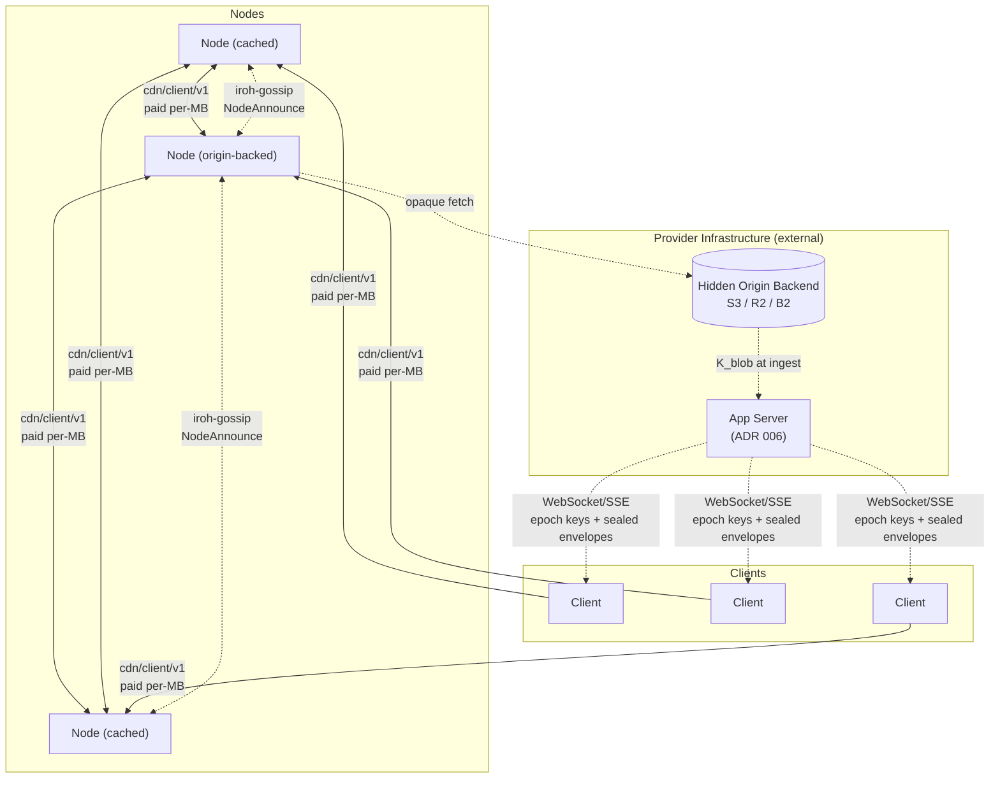
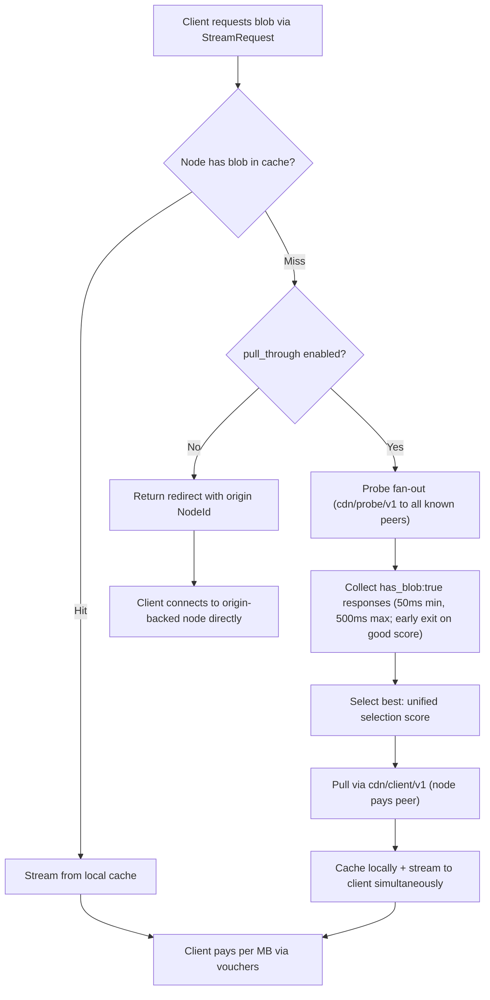
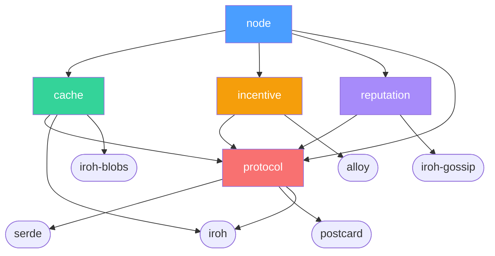

# Architecture Overview

**Date:** 2026-03-28
**Status:** Living document — updated as ADRs are added or revised

---

## What This Is

A decentralized CDN with two participant roles:

- **Nodes** (providers) cache and serve content. They stake TOKEN to participate in the peer mesh and compete on price and latency. Some nodes are configured with an origin backend (S3, NFS, local disk) making them the canonical source for specific content — this is a deployment choice, not a protocol distinction. No external origin URL is ever exposed.
- **Clients** consume content. They pay nodes per MB via off-chain payment channels (USDC in PoC; multiple governance-approved ERC-20 tokens in production — see [ADR 010](010-multi-token.md)).

The PoC scope is tens of nodes on a testnet, proving the delivery pipeline (content discovery, probing, paid streaming) and payment channel lifecycle (open, voucher, close, dispute). Reputation, encryption, watchtowers, and governance use simplified stand-ins.

---

## System Diagram



**Note:** PoC payments use USDC only; production supports multiple governance-approved ERC-20 tokens (see [ADR 010](010-multi-token.md)).

Clients probe candidate nodes, pick the best by the unified selection score (see [ADR 001](001-network.md#node-selection-algorithm) for the full formula), stream over `cdn/client/v1`, and pay via off-chain payment vouchers (USDC in PoC). On a cache miss, a node discovers providers via probe fan-out (`cdn/probe/v1` to all known peers), selects the best, and pulls via `cdn/client/v1` (paid). Every byte delivered — whether client→node or node→node — is paid.

---

## Architectural Decisions

### [ADR 000 — Language and Core Networking Stack](000-language.md)

**Rust + iroh (0.97).**

The implementation language is Rust. The networking stack is iroh, which provides QUIC transport, NAT traversal, content-addressed blob transfer, and gossip as a cohesive unit. A single statically linked binary runs as a node or client depending on configuration.

---

### [ADR 001 — Network Topology and Peer Mesh](001-network.md)

**Flat peer mesh. Gossip for node discovery, probe fan-out for content discovery (DHT deferred to post-PoC).**

All staked nodes form a flat mesh. Node metadata is broadcast over iroh-gossip on regional topics (`cdn/region/{cc}/v1`) and a global topic (`cdn/global/v1`) via lightweight `NodeAnnounce` messages (~800 bytes). Content discovery is on-demand: on a cache miss, nodes probe all known peers via `cdn/probe/v1` in parallel and select the best provider by the unified selection score (`rate_per_mb × rtt_ms × (1 / max(reputation, 0.1)²)` — lower is better). No content inventories are broadcast — no Bloom filters, no hash lists. The on-chain node registry is part of the `StakingRegistry` contract; the `NodeInfo` struct maps `NodeId` (ed25519 public key) to QUIC multiaddrs and Ethereum address.

---

### [ADR 002 — Content Addressing](002-content-addressing.md)

**BLAKE3 content-addressed blobs. Node backends are opaque to the network.**

Every blob is identified by its BLAKE3 hash. Clients verify received bytes against the known hash. The hash→backend mapping is internal to each origin-backed node and never shared — no participant in the network can learn or bypass the node's backing storage.

---

### [ADR 003 — Payment Model](003-payments.md)

**Off-chain USDC payment channels. Market-driven rates.**

Clients pay nodes per MB. On a cache miss, nodes pay origin-backed nodes per MB for initial content pulls, then amortise that cost across many client deliveries. Origin-backed nodes set the effective price ceiling (reflecting their backend egress costs). Rates are fully market-driven within governance-set bounds. Voucher cadence (default 1 MB) is negotiable per-stream for large blob transfers, reducing overhead without materially increasing risk. Nodes join the mesh via `StakingRegistry.registerNode()` ([ADR 001](001-network.md)) and establish a cryptographic NodeId-to-Ethereum address binding via `StakingRegistry.bindNodeId()` ([ADR 003](003-payments.md)) for slash evidence and payment attribution. Client bindings are ephemeral (per-session).

---

### [ADR 004 — Dual-Currency Token Model](004-tokenomics.md)

**USDC for payments. TOKEN for staking, governance, and fee discounts.**

TOKEN is not used for payments. All nodes must stake TOKEN to participate. Staking cost creates accountability and Sybil resistance. 20% of protocol fees buy back and burn TOKEN (accumulate-only in PoC; buyback execution deferred to production). Fixed supply of 1B at genesis. Challenge bonds (100 TOKEN in PoC, 50 TOKEN in production) are required for slash claims, preventing zero-cost griefing. Governance is covered separately in [ADR 009](009-governance.md).

---

### [ADR 005 — Wire Protocol](005-protocol.md)

**Three ALPN protocols + iroh-gossip. `cdn/client/v1` covers all paid delivery.**

| Protocol | Purpose |
| --- | --- |
| `cdn/probe/v1` | Parallel latency + availability check before node selection |
| `cdn/client/v1` | Paid delivery: client→node, node→node (cache miss) |
| `cdn/watchtower/v1` | Channel-dispute monitoring ([ADR 007](007-watchtower.md)) |
| iroh-gossip (built-in) | Node metadata broadcast (`NodeAnnounce`), node discovery |

Gossip topics: `cdn/global/v1` (all nodes), `cdn/region/{cc}/v1` (regional), `cdn/reputation/v1` (reputation reports — [ADR 008](008-reputation.md)).

`redirect` in `StreamResponse` always points to a NodeId, never an external URL. The origin backend is never revealed.

**Note:** Epoch key delivery (ADR 006) uses WebSocket/SSE over standard HTTPS, not an iroh QUIC ALPN. The app server is an external component operated by the content provider; see [External Components](#external-components).

---

### [ADR 006 — End-to-End Encryption and Key Distribution](006-e2e-encryption.md)

**Envelope encryption with epoch-rotated key distribution.**

Each blob is encrypted once at ingest with a random symmetric key (XChaCha20-Poly1305). The ciphertext is content-addressed and cached normally — one hash, one copy for all clients. An **app server** — an external component operated by the content provider, outside the CDN protocol and crate structure — gates access: on each play request it wraps the blob key with a rotating epoch key and seals it to the client's public key. Epoch keys are pushed over an authenticated persistent connection (WebSocket/SSE over HTTPS); closing the connection revokes access within one epoch (5 minutes). CDN nodes only ever see ciphertext. See [External Components](#external-components) for the app server's role and deployment model.

---

### [ADR 007 — Watchtower Design for Channel Disputes](007-watchtower.md)

**Non-custodial watchtowers for dispute-window liveness.**

A watchtower holds the latest voucher for a registered channel and submits a `disputeChannel` transaction if a stale close is detected on-chain. Watchtowers cannot steal funds or worsen settlement — the voucher's EIP-712 signature is the only authorisation the contract checks. Nodes register with 2–3 independent watchtowers via `cdn/watchtower/v1` over iroh QUIC. A local in-process dispute monitor provides defense-in-depth for the node-is-online case.

---

### [ADR 008 — Reputation System](008-reputation.md)

**Interaction-weighted scoring with gossip propagation.**

Nodes are ranked by a reputation score (0.0–1.0) derived from local observations (70%) and gossip-propagated reports (30%). Reports are weighted by the reporter's total settled value (on-chain verifiable, counting both client and provider sides; USDC-only in PoC, multi-token normalized in production — see [ADR 010](010-multi-token.md)), capped at 5× to limit incumbency advantage while keeping manipulation expensive. Only staked nodes may submit gossip reports; clients contribute via local scores only. Scores decay toward neutral without fresh data, clamping limits per-report impact, and a cold-start bootstrap gives new nodes initial traffic.

---

### [ADR 009 — Governance Model](009-governance.md)

**Admin key for PoC. Token-weighted governance with safety bounds for production.**

During the PoC, a single deployer address controls all contract parameters. Production governance uses OpenZeppelin Governor with TOKEN voting, 4% quorum, and a 2-day timelock. All governable parameters have hardcoded safety bounds that even governance cannot override (e.g., slash 5%–50%, dispute window 12h–72h; PoC deployments default the dispute window to 48h within this range). A 3-of-5 emergency multisig can only pause contracts and add emergency blacklist entries, with a 12-month sunset enforced via an immutable constructor deadline.

---

### [ADR 010 — Multi-Token Payment Support](010-multi-token.md)

**Token-agnostic payments with governance-managed ERC-20 allowlist. USDC-only for PoC.**

Extends ADR 003 to support multiple ERC-20 tokens. The production `PaymentChannel` contract maintains a governance-managed allowlist of approved tokens; `openChannel` reverts if the token is not on the allowlist. Per-token rate bounds are set by governance. A `payment_token` field is added to `StreamRequest` and `token_rates` is added alongside the single `rate_per_mb` in gossip advertisements (nodes accepting only USDC may retain the single field for simplicity). The EIP-712 voucher already carries a `token` field from ADR 003 — no signature scheme migration is needed. Production deploys a new `PaymentChannel` contract (not an upgrade of the PoC `StablePaymentChannel`).

---

### [ADR 011 — Content Takedown and Hash Blacklisting](011-content-takedown.md)

**Governance-controlled on-chain hash blacklist with regional bodies and emergency fast-path.**

A `ContentBlacklist` contract supports global (network-wide) and regional (jurisdiction-scoped) takedown via designated regional governance bodies. Standard governance entries have a 24-hour compliance window; the emergency multisig path takes effect immediately with a 2-hour slash window. Origin blacklisting by operator address counters hash evasion via trivial re-encoding — each re-upload requires fresh stake and a new identity. Each node also maintains a local denylist for direct legal notices. Serving a blacklisted hash after the compliance window is a slashable offense, subject to the escalating schedule in [ADR 004](004-tokenomics.md).

---

## Key Invariants

- No external origin URL exists — content enters the network through origin-backed nodes whose backends are hidden
- A node cannot deliver paid content without being reachable via iroh NodeId; the backend is always hidden
- A node cannot earn without delivering verifiable bytes — BLAKE3 hash mismatch voids payment
- A node cannot join the peer mesh without staking — prevents free-riders and provides a slashable bond
- A node cannot register without staking — `StakingRegistry` enforces `stake >= minStake` before accepting a `registerNode` call
- Payment channels amortize on-chain costs across an entire session; per-MB payments are off-chain
- Safety bounds on all governable parameters are hardcoded — governance cannot set fees to 100% or stake to zero (see [ADR 009](009-governance.md))
- A node cannot serve a blacklisted hash after the compliance window — doing so is a slashable offense (see [ADR 011](011-content-takedown.md))

---

## Non-Goals (PoC)

- DRM or content protection
- Content transcoding or adaptive format conversion
- Search, discovery, or recommendation (see Future Work below)
- Mobile or web clients
- Multi-chain support (single L2 only)
- Multi-token payment support (USDC only for PoC; see [ADR 010](010-multi-token.md))
- Erasure coding (full replication only)

---

## Glossary

| Term | Definition |
| --- | --- |
| **Blob** | A content-addressed byte sequence identified by its BLAKE3 hash |
| **Chunk** | The BLAKE3 hash tree leaf size (1024 bytes). iroh-blobs uses this for verified streaming. On-chain Merkle proofs for slash evidence reference this leaf size — see [ADR 002](002-content-addressing.md) |
| **Hash sequence** | An ordered collection of blob hashes (iroh's equivalent of a directory/manifest) |
| **Voucher** | A signed off-chain payment message: `{channelId, amount, nonce, token, signature}` |
| **ALPN** | Application-Layer Protocol Negotiation — identifies which protocol a QUIC connection uses |
| **Node** | A staked participant that caches and serves blobs. Some are configured with an origin backend; others are pure caches. |
| **Client** | A lightweight QUIC endpoint that streams content and pays per MB |
| **Origin-backed node** | A node configured with an S3-compatible object store (e.g., S3/R2/B2/MinIO), NFS mount, or local disk — can serve any blob in that store, never experiences a true cache miss |

---

## Origin Integration

Some nodes are configured with an origin backend (S3, R2, Backblaze B2, self-hosted MinIO, NFS, or local disk). They are the source of truth for all blobs but are accessed as infrequently as possible — only when no peer node has the content.

### Supported Origins

| Origin | Auth Method | Notes |
| --- | --- | --- |
| AWS S3 | IAM credentials or pre-signed URLs | Most common |
| Cloudflare R2 | S3-compatible API | No egress fees between R2 and Workers |
| Backblaze B2 | S3-compatible API | Cheapest egress ($0.01/GB) |
| MinIO (self-hosted) | S3-compatible API | Full operator control |
| NFS (local mount) | Filesystem access | No egress fees; requires local/network mount |
| Local disk | Filesystem access | Simplest setup; single-machine only |

All origin access goes through a single trait:

```rust
trait OriginStore: Send + Sync {
    async fn fetch(&self, hash: &Hash) -> Result<Bytes>;
    async fn head(&self, hash: &Hash) -> Result<ObjectMeta>;
}
```

### Hash-to-Object-Key Mapping

S3 objects are addressed by key (a path string). Blobs are addressed by BLAKE3 hash. The mapping is stored in a content catalog — a small database (PostgreSQL or SQLite) maintained by the operator:

```
catalog: hash → {s3_bucket, s3_key, size_bytes, content_type}
```

Nodes query it on cache miss to find the origin pull URL. The catalog is not on-chain — it is an operational concern.

---

## Cache Behavior

The protocol does not dictate cache policy. Nodes are economically motivated to make good caching decisions.

**Cache miss resolution** follows a priority order:

1. **Paid pull-through (preferred):** Node checks its probe cache or performs a probe fan-out (`cdn/probe/v1` to all known peers), selects the best provider by the unified selection score ([ADR 001](001-network.md#node-selection-algorithm)), pulls via `cdn/client/v1` (paid), caches locally, and streams to the client while the pull is in progress.
2. **Redirect (last resort):** If pull-through is disabled (`pull_through: false` in config), the node returns a redirect to an origin-backed node's NodeId. The client opens a channel with that node directly.

**Prefetching:** Nodes can proactively cache popular content using two signals: (1) local demand — tracking cache miss frequency per hash and prefetching when a threshold is crossed (default: 3 misses in 5 minutes); (2) network popularity — observing which hashes appear in multiple peers' `popular_hashes` fields in `NodeAnnounce` gossip messages (default threshold: 3+ peers within 10 minutes). All prefetch pulls use the same probe fan-out → `cdn/client/v1` path (paid).

**Eviction:** LRU or frequency-weighted eviction (LFU). Operators tune cache size to maximize hit rate within their storage budget. Blobs for which the node has signed `has_blob: true` in a `cdn/probe/v1` response are temporarily exempt from eviction via the **probe-triggered eviction hold** (`probe_hold_duration`, see [ADR 005](005-protocol.md#probe-triggered-eviction-hold)), which prevents false phantom-announcement slashing when cache pressure would otherwise evict a blob between probe and subsequent stream request.

**Maximum blob size:** Nodes may configure a `max_blob_size` (PoC recommended default: 10 GB). Requests for blobs exceeding this limit are rejected with `StreamError::BlobTooLarge` ([ADR 005](005-protocol.md#error-handling-and-retry-semantics)). This prevents a single large blob from exhausting cache capacity or tying up connections for extended periods. The limit is per-node — nodes with larger storage budgets can raise it; cache-only nodes on constrained hardware can lower it.



---

## Crate Structure

```
decdn/
├── Cargo.toml                    # workspace root
├── crates/
│   ├── node/                     # Binary — CLI entry, config, wiring
│   ├── protocol/                 # Shared types, wire format, messages
│   ├── cache/                    # Cache engine wrapping iroh-blobs + origin pull
│   ├── incentive/                # Payment channels, staking, vouchers
│   ├── reputation/               # Gossip-based reputation system
│   └── contracts/                # Solidity contracts + Foundry
├── tests/                        # Integration tests
└── adr/                          # Architecture decision records
# The app server (ADR 006) is an external component, not part of this workspace.
# Content providers build it using their own stack. A reference implementation
# may be provided as a separate repository.
```

### Dependency Chain



`protocol` is the leaf crate with minimal dependencies. Everything depends on it; it depends on almost nothing. The cache and incentive layers are separate crates — the cache layer works without incentives (useful for testing, local dev, private deployments). The incentive layer wraps cache operations with payment logic. The `node` crate wires them together.

---

## External Components

Components referenced by ADRs that are operated by content providers, not part of the CDN protocol or workspace.

### App Server ([ADR 006](006-e2e-encryption.md))

The app server is a traditional web service operated by the content provider (e.g., a streaming platform's backend). It is **not** part of the decentralized CDN — it does not participate in gossip, probing, or paid delivery.

**Responsibilities:**

- Stores blob encryption keys (`K_blob`) received from the origin at ingest time
- Authenticates client sessions and validates subscription status
- Delivers epoch keys over an authenticated persistent connection (WebSocket or SSE); signals `server_secret` rotation via `epoch_key_revoked` events on the same connection
- Issues sealed envelopes (`crypto_box_seal`) containing wrapped `K_blob` on play requests
- Builds and returns offline playback leases (client seals locally to device keystore)

**Why WebSocket/SSE, not iroh QUIC:** The app server intentionally sits outside the iroh ecosystem. It handles subscription billing, OAuth/session auth, and key management — traditional web service concerns. Content providers integrate it with their existing infrastructure (load balancers, API gateways, auth systems). Requiring iroh QUIC would couple the provider's application backend to the CDN networking stack without protocol benefit. The watchtower ([ADR 007](007-watchtower.md)) uses iroh QUIC because it is a CDN protocol participant; the app server is not.

**Scaling model:** One persistent connection per active subscriber. Standard WebSocket scaling applies (sticky sessions or pub/sub fanout). The app server scales with subscriber count, not CDN node count.

**PoC scope:** A minimal reference implementation may be provided in a separate repository. The CDN crates do not depend on it.

---

## Observability

- **Structured logging** via `tracing` crate (standard in iroh ecosystem). JSON output for machine consumption.
- **Metrics** via `prometheus` crate, exposed on a configurable HTTP port:
  - `streams_active`, `streams_completed`, `streams_failed` — delivery activity
  - `vouchers_signed`, `vouchers_received` — payment activity
  - `reputation_reports_sent`, `reputation_reports_received` — gossip health
  - `channels_open`, `channels_settled` — payment channel lifecycle
  - `cache_hits`, `cache_misses`, `cache_bytes` — cache performance
- **Health endpoint** at `/health` on the metrics HTTP port — returns node status, peer count, and channel balances

---

## Considered Alternatives

A fully decentralized storage model was evaluated: nodes would commit to durable storage with replication factor N, pinning deals, and replication maintenance protocols. This was rejected in favor of centralized storage (S3/R2) + decentralized delivery because:

- S3-class storage is cheap ($0.023/GB/month), reliable (11 nines), and already solved
- The actual bottleneck is delivery latency and bandwidth cost, not storage
- Decentralized storage requires complex pinning deals, replication verification, and challenge games
- The CDN model is strictly simpler: trust S3 for durability, decentralize only delivery

---

## Future Work: Search & Discovery

Not in PoC scope. The planned approach for the next phase:

Dedicated **indexer nodes** subscribe to gossip topics and participate in probe fan-out (responding to `cdn/probe/v1` queries) to build a searchable index of content metadata (via `tantivy` or equivalent), exposing a query API on a custom ALPN (`cdn/search/v1`). Multiple independent indexers can coexist. Clients pay per query via the same payment channel mechanism. Indexers register in the `StakingRegistry` and are slashable for fabricated results.

During PoC (before indexers exist), content discovery uses probe fan-out — every cache miss probes all known peers via `cdn/probe/v1`. At PoC scale (tens of nodes), this provides complete coverage. The migration to indexers or DHT-based discovery is additive — probe fan-out remains the fallback.

---

## What Is Not Decided Yet

- Production L2 choice (Arbitrum One, Base, or other) — gated on PoC validation. Sequencer censorship mitigation for the dispute window is addressed in [ADR 007](007-watchtower.md#l2-sequencer-censorship) (PoC: 48h default; production: forced-inclusion deadline extension); the extension's detection logic depends on the L2 chosen
- Parallel streaming from multiple nodes for a single blob (protocol supports it, not prioritised)
- ~~Maximum blob size~~: decided — nodes may configure a `max_blob_size` limit (PoC recommended default: 10 GB). Requests exceeding a node's limit are rejected with `StreamError::BlobTooLarge` ([ADR 005](005-protocol.md#error-handling-and-retry-semantics)). This is a per-node operational policy, not an on-chain governance parameter, because different nodes have different storage and bandwidth budgets
