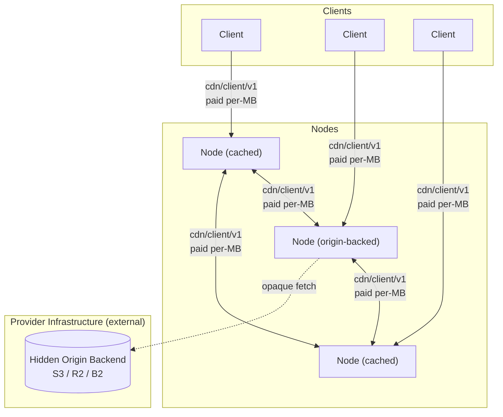

# Architecture Overview

**Date:** 2026-03-28
**Status:** Living document — updated as ADRs are added or revised

## What This Is

A decentralized CDN with two participant roles:

- **Nodes** (providers) cache and serve content. They bond TOKEN proportional to declared capacity (`bond = k × Mbps^α` per [ADR 026 § Capacity-bond curve](026-tokenomics.md#capacity-bond-curve)) to participate in the peer mesh and compete on price and latency. Some nodes are configured with an origin backend (S3, NFS, local disk) making them the canonical source for specific content. The **cache role** is permissionless — any bonded operator may pull cached blobs from authorized origins and re-serve them. The **origin role** is DAO-governed: governance vets a publisher wallet once and the vetted publisher then seats its own operators per namespace, while namespace 0 (content published without a namespace) has no authorized origins. No external origin URL is ever exposed.

- **Clients** consume content. They pay nodes per MB via off-chain vouchers backed by a shared on-chain payment pool.

## System Diagram

Clients probe candidate nodes, pick the best by the unified selection score (see [ADR 001](001-network.md#node-selection-algorithm) for the full formula), stream over `cdn/client/v1`, and pay via off-chain payment vouchers (denominated in the payment token). On a cache miss, a node performs a DHT FIND_VALUE lookup (`cdn/dht/v1`), probes the returned candidates via `cdn/probe/v1`, selects the best, and pulls via `cdn/client/v1` (paid). When DHT returns no providers, the on-chain origin directory ([ADR 022](022-content-discovery.md#adr-022--content-discovery-at-scale)) is the deterministic last-resort fallback. Every byte delivered — whether client→node or node→node — is paid.

## Reading Order

For readers approaching the protocol top-to-bottom, follow this thematic order rather than the numeric one. Each chapter assumes the previous chapters are read. (See also [`README.md` § Design principles](README.md#design-principles) for the protocol's framing before diving in.)

> **Maintenance note:** the reading-order book PDF in [`README.md` § Reading-order build (book layout)](README.md#reading-order-build-book-layout) lists every ADR explicitly in the same order. Edits to the chapters below — adding, removing, or reordering ADRs — must update that pandoc command in lockstep, or the rendered book will drift from this index.

### Chapter 1 — Foundations

The implementation language, the peer mesh's shape, the content-addressing primitive every other chapter inherits, and the wire-protocol surface that carries paid delivery.

1. [ADR 000 — Language and Core Networking Stack](000-language.md#adr-000-language-and-core-networking-stack)
2. [ADR 001 — Network Topology and Peer Mesh](001-network.md#adr-001-network-topology-and-peer-mesh)
3. [ADR 002 — Content Addressing](002-content-addressing.md#adr-002-content-addressing)
4. [ADR 005 — Wire Protocol](005-protocol.md#adr-005-wire-protocol)
5. [ADR 038 — Bao Verified-Range Streaming on cdn/client/v1](038-bao-verified-range-streaming.md#adr-038-bao-verified-range-streaming-on-cdnclientv1)

### Chapter 2 — Discovery

How a client or node finds the right peer for a given hash. The DHT is the primary mechanism; proxy warming bootstraps the first regional copy when discovery returns only distant holders.

1. [ADR 022 — Content Discovery at Scale (DHT)](022-content-discovery.md#adr-022--content-discovery-at-scale)
2. [ADR 037 — Latency-Driven Proxy Warming for Regional Locality](037-regional-proxy-warming.md#adr-037-latency-driven-proxy-warming-for-regional-locality)
3. [ADR 039 — Multi-Source Parallel Fetch Scheduling on cdn/client/v1](039-multi-source-parallel-fetch.md#adr-039-multi-source-parallel-fetch-scheduling-on-cdnclientv1)

### Chapter 3 — Payments

Off-chain vouchers for per-MB delivery, backed by a shared on-chain payment pool that a client opens once and redeems against per node. Client-side architecture and smart-wallet support are included here because client trust boundaries and key management hang off the payment path.

1. [ADR 003 — Payment Model](003-payments.md#adr-003-payment-model)
2. [ADR 012 — Client Architecture, Bootstrap, and Trust Model](012-client.md#adr-012-client-architecture-bootstrap-and-trust-model)
3. [ADR 024 — Account Abstraction and Safe Smart Wallet Support](024-account-abstraction.md#adr-024-account-abstraction-and-safe-smart-wallet-support)

### Chapter 4 — Tokenomics & incentives

The economic model that ties the protocol together. [ADR 026](026-tokenomics.md#adr-026-tokenomics) is the canonical umbrella (1B supply, 11-group allocation, the `FeeRouter` three-bucket split — dormant at launch as 90/0/10, then governance-activated to the 60/30/10 steady-state target — the `CapacityBond` lock-to-capacity curve `bond = k × Mbps^α` — no ongoing service emission — the 19% [§ App Incentives](026-tokenomics.md#app-incentives) demand-side bucket, operator-only governance with `age_ramp` (served-bytes-weighted under [ADR 036](036-served-bytes-voting-weight.md#adr-036-served-bytes-voting-weight)), escrow-on-slash + burn, bootstrap, and governable-parameter bounds). [ADR 018](018-liquidity-strategy.md#adr-018-liquidity-strategy-balancer-8020-pol) is the Balancer V3 POL strategy (10% Protocol-Owned Liquidity + 5% Market Making = 15% combined Liquidity-Provision category). The launch contract surface is forward-compatible (additive integration via standard `AccessControl` role grants per [ADR 016 § Access Control Matrix](016-contract-interactions.md#access-control-matrix)) so future economic-layer products can land as additive top-level contracts without changing existing contracts. ADRs 032 (SafetyReserve appeal surface), 033 (SafetyReserve), 034 (gauge boost + `VotingEscrow`), and 035 (delegator pool) are retired.

1. [ADR 026 — Tokenomics](026-tokenomics.md#adr-026-tokenomics) (canonical umbrella)
2. [ADR 018 — Liquidity Strategy (Balancer 80/20 POL)](018-liquidity-strategy.md#adr-018-liquidity-strategy-balancer-8020-pol)

### Chapter 5 — Verification & enforcement

How protocol violations are detected, adjudicated, and punished. The slashing schedule lives in [ADR 026 § Slashing and burn](026-tokenomics.md#slashing-and-burn); this chapter is the evidence and adjudication path.

1. [ADR 014 — On-Chain Verification for Slashing Evidence](014-on-chain-verification.md#adr-014-on-chain-verification-for-slashing-evidence)
2. [ADR 008 — Reputation System](008-reputation.md#adr-008-reputation-system)
3. [ADR 011 — Content Takedown and Hash Blacklisting](011-content-takedown.md#adr-011-content-takedown-and-hash-blacklisting)
4. [ADR 028 — Slashing Appeals and Dispute Escalation](028-slashing-appeals.md#adr-028-slashing-appeals-and-dispute-escalation) (escrow-on-slash + the `SlashAppeal` state machine)
5. [ADR 030 — Node Region Self-Attestation](030-node-region-self-attestation.md#adr-030-node-region-self-attestation)

### Chapter 6 — Governance & contracts

The governance model that sets the parameters earlier chapters consume, and the cross-contract interaction map that consolidates the on-chain surface.

1. [ADR 009 — Governance Model](009-governance.md#adr-009-governance-model)
2. [ADR 036 — Served-Bytes Voting Weight](036-served-bytes-voting-weight.md#adr-036-served-bytes-voting-weight) — defines the canonical DAO voting-weight formula (served bytes from `FeeRouter.bytesPerEpoch` × `age_ramp`) that [ADR 009 § Production](009-governance.md#production-operator-weighted-dao-governance) and [ADR 026 § Governance](026-tokenomics.md#governance) reference; adds the governable `windowEpochs` and the slash-zero-out on `CapacityBond.slashedAtEpoch`.
3. [ADR 016 — Smart Contract Interaction Model](016-contract-interactions.md#adr-016-smart-contract-interaction-model)

### Chapter 7 — Operations

The operator-facing onboarding flow that takes a bare server through staking, registration, and accepting paid delivery.

1. [ADR 019 — Node Onboarding and Bootstrapping Flow](019-node-onboarding.md#adr-019-node-onboarding-and-bootstrapping-flow)

### Chapter 8 — Supporting infrastructure

Wire framing, compatible in-version evolution, signed-field freezing, and the privacy-surface inventory. Both apply across the chapters above.

1. [ADR 013 — Schema Evolution](013-schema-evolution.md#adr-013-schema-evolution)
2. [ADR 017 — Privacy Analysis](017-privacy.md#adr-017-privacy-analysis)

The numeric per-ADR index below stays as the canonical reference.

### Appendices — Reference Patterns

Appendices document patterns, reference implementations, and operational guidance built **on top of** the protocol. They are not part of the core spec — alternative implementations are acceptable. See [`README.md` § Decision-record context](README.md#decision-record-context) for the ADR-vs-appendix distinction.

1. [Directory Bundles (`decdn bundle`)](appendix-bundles.md#appendix-directory-bundles-decdn-bundle) — publisher-side convenience for grouping content-addressed blobs into a single JSON manifest; nodes deliver individual hashes and do not require bundle support
2. [Observability and Metrics](appendix-observability.md#appendix-observability-and-metrics) — recommended metric naming, registry, and slash-risk alert thresholds
3. [Blob Cache Eviction Policy](appendix-blob-cache-eviction.md#appendix-blob-cache-eviction-policy) — LRU keyed on last successful `CacheEngine::get` timestamp; operator pinning overrides LRU; operator evict is durable and orthogonal; probe-hold ([ADR 005](005-protocol.md#probe-triggered-eviction-hold)) composes above LRU; reputation does not factor into eviction
4. [Production L2 Deployment Target](appendix-l2-deployment.md#appendix-production-l2-deployment-target) — Arbitrum One selection (deployment decision; protocol depends on Arbitrum-class properties calibrated in core ADRs)
5. [PoC/Production Seam Architecture (Rust)](appendix-poc-production-seams.md#appendix-pocproduction-seam-architecture-rust-implementation) — leaf-crate principle, wiring-layer mode selection, contract surface is not a PoC/production seam
6. [deCDN Binaries — `decdn-node` + `decdn` Split](appendix-binaries.md#appendix-decdn-binaries--decdn-node--decdn-split) — rationale for the dockerd-style split into the long-lived cache-node daemon (`decdn-node`) and the one-shot operator/publisher CLI (`decdn`)
7. [Local Admin HTTP Surface](appendix-local-admin-http.md#appendix-local-admin-http-surface) — loopback-bound admin API for operator runbook automation
8. [Operator Key Rotation Runbook](appendix-operator-key-rotation.md#appendix-operator-key-rotation-runbook) — sequenced procedure for rotating the operator's iroh node-key, Ethereum signing key, and (production) session keys via `bindNodeId`, deregister-and-re-stake, or `erc7579/smartsessions`
9. [Operator Protocol-Upgrade Runbook](appendix-operator-upgrade-path.md#appendix-operator-protocol-upgrade-runbook) — tier-independent safe-restart drain procedure plus Tier 1/2 operator checklists for compatible in-version releases; Tier 3 migrations are defined with the concrete breaking change
10. [Permissionless Settlement Analysis](appendix-fraud-detection.md#appendix-permissionless-settlement-analysis) — optional, anyone-can-run off-chain analysis of public redemption/settlement flows for self-routing and wash-trading patterns, feeding governance parameter-tuning

## Architectural Decisions

Numeric per-ADR index.

- **[ADR 000 — Language and Core Networking Stack](000-language.md#adr-000-language-and-core-networking-stack)** — Rust + iroh (1.0).
- **[ADR 001 — Network Topology and Peer Mesh](001-network.md#adr-001-network-topology-and-peer-mesh)** — Flat peer mesh; the on-chain `CapacityBond` registry active set for node discovery; `cdn/dht/v1` (Kademlia subset) for content discovery, with the on-chain origin directory ([ADR 022](022-content-discovery.md#adr-022--content-discovery-at-scale)) as the deterministic last-resort fallback when DHT returns no providers.
- **[ADR 002 — Content Addressing](002-content-addressing.md#adr-002-content-addressing)** — BLAKE3 content-addressed blobs. Node backends are opaque to the network.
- **[ADR 003 — Payment Model](003-payments.md#adr-003-payment-model)** — Off-chain vouchers backed by a shared on-chain payment pool (USDC, fixed at deployment): one deposit, many capped signers, node-addressed vouchers, per-lane redemption. Market-driven rates within governance-set bounds.
- **[ADR 005 — Wire Protocol](005-protocol.md#adr-005-wire-protocol)** — Three core protocols (ALPN-negotiated): `cdn/probe/v1`, `cdn/client/v1`, `cdn/dht/v1`. `cdn/client/v1` covers all paid delivery.
- **[ADR 008 — Reputation System](008-reputation.md#adr-008-reputation-system)** — Local per-peer interaction-weighted scoring; no cross-node propagation.
- **[ADR 009 — Governance Model](009-governance.md#adr-009-governance-model)** — Admin key for PoC; bootstrap multisig phase post-launch; transition to served-bytes-weighted Governor (`FeeRouter.bytesInWindow × age_ramp` per [ADR 036](036-served-bytes-voting-weight.md#adr-036-served-bytes-voting-weight)) + Timelock via a one-shot transition the multisig executes when the operator set is broad enough.
- **[ADR 036 — Served-Bytes Voting Weight](036-served-bytes-voting-weight.md#adr-036-served-bytes-voting-weight)** — Promotes `FeeRouter.bytesPerEpoch` from analytics-only to governance-canonical; vote weight = served-bytes trailing-window sum × `age_ramp`, capped per-operator at 5% of bytes-weighted total, zeroed for `windowEpochs` epochs after any slash via the new `CapacityBond.slashedAtEpoch` watermark.
- **[ADR 011 — Content Takedown and Hash Blacklisting](011-content-takedown.md#adr-011-content-takedown-and-hash-blacklisting)** — Governance-controlled on-chain hash blacklist with regional bodies and emergency fast-path; a wrongful entry comes off via the ordinary removal path ([§ Removing a Wrongful Entry](011-content-takedown.md#removing-a-wrongful-entry)).
- **[ADR 012 — Client Architecture, Bootstrap, and Trust Model](012-client.md#adr-012-client-architecture-bootstrap-and-trust-model)** — Client bootstrap, key management, identity lifecycle, and trust boundary.
- **[ADR 013 — Schema Evolution](013-schema-evolution.md#adr-013-schema-evolution)** — Varint-length framing and bounds, protocol-enum discipline, two-phase deserialization, three evolution tiers, and signed-field freezing. A concrete Tier 3 break defines its own migration.
- **[ADR 014 — On-Chain Verification for Slashing Evidence](014-on-chain-verification.md#adr-014-on-chain-verification-for-slashing-evidence)** — secp256k1 EIP-712 `slash_sig` on `ProbeResponse`/`StreamResponse`; unified `SlashJudge` contract for the two signature-dependent offenses (rate, blacklist). Content corruption is absorbed at the wire (no on-chain path) — see [ADR 003 § Corrupted delivery](003-payments.md#corrupted-delivery).
- **[ADR 016 — Smart Contract Interaction Model](016-contract-interactions.md#adr-016-smart-contract-interaction-model)** — Cross-contract call graph, fund custody, access control matrix, and reentrancy analysis.
- **[ADR 017 — Privacy Analysis](017-privacy.md#adr-017-privacy-analysis)** — Unified privacy surface inventory, adversary model, and mitigation roadmap.
- **[ADR 018 — Liquidity Strategy (Balancer 80/20 POL)](018-liquidity-strategy.md#adr-018-liquidity-strategy-balancer-8020-pol)** — Protocol-Owned Liquidity in a Balancer V3 80/20 TOKEN/USDC weighted pool, seeded from the genesis liquidity allocation.
- **[ADR 019 — Node Onboarding and Bootstrapping Flow](019-node-onboarding.md#adr-019-node-onboarding-and-bootstrapping-flow)** — End-to-end procedure from bare server to actively accepting paid delivery; five sequential onboarding phases.
- **[ADR 022 — Content Discovery at Scale](022-content-discovery.md#adr-022--content-discovery-at-scale)** — `cdn/dht/v1` Kademlia subset for content discovery; realized demand is served reactively via cache-miss pull-through per [ADR 037](037-regional-proxy-warming.md#adr-037-latency-driven-proxy-warming-for-regional-locality). No discovery fees.
- **[ADR 037 — Latency-Driven Proxy Warming for Regional Locality](037-regional-proxy-warming.md#adr-037-latency-driven-proxy-warming-for-regional-locality)** — Bootstraps the first regional cache copy at selection time: a client finding only distant holders routes its paid request through a measured-nearby non-holder, which fills it by window-paced pull-through (pull bounded to the ramped credit window ahead of cleared payment) and caches the blob. Proxy selection ranks by measured RTT only (region-spoofing irrelevant); speculative spend bounded by the same ramped credit window the downstream serve loop uses. No wire change.
- **[ADR 024 — Account Abstraction and Safe Smart Wallet Support](024-account-abstraction.md#adr-024-account-abstraction-and-safe-smart-wallet-support)** — Universal `SignatureChecker` across all contracts, so any ERC-1271 smart account works on-chain without a retrofit; the EOA keystore is the documented default wallet and Safe is supported rather than recommended; off-chain ERC-1271 verification and session keys via ERC-7579 `smartsessions` are deferred to Production.
- **[ADR 026 — Tokenomics](026-tokenomics.md#adr-026-tokenomics)** — Canonical economic-model umbrella: 1B fixed supply, 11-group allocation, the `FeeRouter` three-bucket split (dormant launch 90/0/10, activated steady-state target 60/30/10), the `CapacityBond` lock-to-capacity curve (no ongoing service emission), App Incentives demand-side bucket, operator-only served-bytes-weighted governance per [ADR 036](036-served-bytes-voting-weight.md#adr-036-served-bytes-voting-weight), escrow-on-slash + burn, bootstrap, and governable-parameter bounds.
- **[ADR 028 — Slashing Appeals and Dispute Escalation](028-slashing-appeals.md#adr-028-slashing-appeals-and-dispute-escalation)** — 30-day post-slash appeal window; escrow-on-slash restitution (a granted appeal refunds the operator's own escrowed TOKEN) via the standalone `SlashAppeal` contract driving `CapacityBond`'s settle hooks; failed appeals burn the separate appeal bond in full; emergency multisig fast-track + 14-day DecdnGovernor ratification; one accepted appeal per operator per 365 days.
- **[ADR 030 — Node Region Self-Attestation](030-node-region-self-attestation.md#adr-030-node-region-self-attestation)** — Region claims (`regionHint` on `CapacityBond`) are accepted at face value; the IP-geolocation oracle / third-party attestation path is explicitly rejected. Reactive blacklist-scope flipping is closed by a 7-day `regionLastChanged` stability window on `CapacityBond` (governable `[3d, 30d]`; [ADR 011 § Regional Scope](011-content-takedown.md#regional-scope)). Latency-vs.-claim reputation penalty from [ADR 001 § Consequences](001-network.md#consequences) is the canonical soft mitigation for residual pre-positioned misdeclaration.
(ADRs 015, 031, 032, 033, 034, and 035 are retired: 031 under the blacklist-entry appeals removal — the appeal state machine layered on `ContentBlacklist` is gone, and a wrongful entry now comes off via the ordinary removal path; 015 under the protocol simplification audit — QUIC 0-RTT is gone, and every connection now completes a full handshake before application bytes flow per [ADR 005 § Connection Management](005-protocol.md#connection-management); 032/033 under the SafetyReserve removal — the slash-appeal surface moved to `SlashAppeal` and restitution is now escrow-on-slash per [ADR 028](028-slashing-appeals.md#adr-028-slashing-appeals-and-dispute-escalation) / [ADR 026](026-tokenomics.md#slashing-and-burn) — and 034/035 under the work-token rewrite. Do not link to them from canonical ADRs.)

## Key Invariants

- No external origin URL exists — content enters the network through origin-backed nodes whose backends are hidden
- A node cannot deliver paid content without being reachable via iroh NodeId
- A node cannot earn without delivering verifiable bytes — BLAKE3 hash mismatch voids payment
- A node cannot join the peer mesh without bonding — prevents free-riders and provides a slashable bond proportional to declared capacity
- A node cannot register without bonding — `CapacityBond` enforces `bond >= bond_required(declared_capacity_Mbps)` via the `bond = k × Mbps^α` curve before accepting a `register` call
- A node cannot register without binding — `registerNode` atomically writes the NodeId-to-address mapping via EIP-712 signature, ensuring every active node is immediately slashable
- A node cannot register a NodeId it does not control — `registerNode` verifies an ed25519 signature proving ownership of the NodeId's private key, preventing squatting ([ADR 003 § NodeId Ownership Verification](003-payments.md#nodeid-ownership-verification))
- A payment pool amortizes on-chain costs across every node and signer it backs; per-MB payments are off-chain vouchers, redeemed per node
- Safety bounds on all governable parameters are hardcoded — governance cannot set fees to 100% or stake to zero (see [ADR 009](009-governance.md#adr-009-governance-model))
- A node cannot serve a blacklisted hash after the compliance window — doing so is a slashable offense (see [ADR 011](011-content-takedown.md#adr-011-content-takedown-and-hash-blacklisting))

## Threat Model

This is the coverage map for adversarial behavior. Each ADR reasons about the attacks against its own subsystem; this table names every adversary class and points to the one section that owns the defense. Add the attack here when you write it, and link to that home instead of re-deriving the argument.

Two things shape how a defense reads in its home ADR. First: most defenses are **node-local policy**, not protocol rules. A node bounds its own exposure because doing so is its rational optimum — the ADR's job is to prove that local self-interest is sufficient, not to pin the knob. Protocol-enforced defenses (signatures, on-chain checks, slash evidence) are marked below; everything else is node policy and is tunable per operator. Second: the durable content is the **invariant** a defense preserves, not the mechanism that preserves it. The mechanism (credit window, admission cap, rate-bucket size) is local and tunable and lives in code and config; the ADR fixes the property.

**Free-riding or resource-exhausting client** — wants bytes without paying, or wants to burn node resources.

| Attack | Bounded by | Home |
|---|---|---|
| Voucher withholding | Self-enforcing per-lane credit window; loss capped at one interval | [ADR 003 § Voucher withholding](003-payments.md#voucher-withholding) |
| Pool oversubscription | Contract pays `min(desired, capRoom, remaining)`; refundable floor `M` (protocol) | [ADR 003 § Pool oversubscription](003-payments.md#pool-oversubscription-one-deposit-backs-many-nodes) |
| Owner reclaims before a node redeems | Grace window + in-process redemption monitor (protocol + node policy) | [ADR 003 § Owner reclaims before a node redeems](003-payments.md#owner-reclaims-before-a-node-redeems) |
| Probe fishing / resource exhaustion | Layered per-peer + per-IP + global token bucket (node policy) | [ADR 005 § Probe rate limiting](005-protocol.md#probe-rate-limiting) |

**Malicious serving node** — wants payment without honest service, or to cheat pricing, region, or takedown.

| Attack | Bounded by | Home |
|---|---|---|
| Data withholding | Self-enforcing; client never pays past acknowledged bytes, resumes elsewhere | [ADR 003 § Data withholding](003-payments.md#data-withholding) |
| Corrupted delivery | Progressive BLAKE3 verification voids payment for a corrupt window (protocol) | [ADR 003 § Corrupted delivery](003-payments.md#corrupted-delivery) |
| Rate bait-and-switch | Signed probe/stream pair is on-chain slash evidence (protocol) | [ADR 003 § Rate bait-and-switch](003-payments.md#rate-bait-and-switch) |
| Content withholding (advertise, refuse to serve) | Reputation penalty only — not slashable; publishers seat redundant operators | [ADR 003 § Content withholding](003-payments.md#content-withholding) |
| Serving a blacklisted hash | Slashable after the compliance window (protocol) | [ADR 011 § Slashing](011-content-takedown.md#slashing) |
| Region mis-attestation | Self-attestation is canonical; challengeable, not trusted-by-default | [ADR 030 § Self-attestation is canonical](030-node-region-self-attestation.md#self-attestation-is-canonical) |
| Third-party forced close / redeeming another's lane | Access control: `closePool` is owner-only, redemption binds `msg.sender` (protocol) | [ADR 003 § Third-party forced close (DoS)](003-payments.md#third-party-forced-close-dos) |

**Network / peer-layer adversary** — wants to poison discovery, isolate a client, or flood the mesh.

| Attack | Bounded by | Home |
|---|---|---|
| Eclipse | Multi-source bootstrap (on-chain registry + DNS seeds) | [ADR 012 § Bootstrap Procedure](012-client.md#bootstrap-procedure) |
| Peer-table poisoning / gossip replay | Signed announce + registry check + monotonic timestamp (protocol) | [ADR 001 § ADR 001: Network Topology and Peer Mesh](001-network.md#adr-001-network-topology-and-peer-mesh) |
| Gossip flooding | Registry check + per-sender rate limiting (node policy) | [ADR 003 § Gossip flooding](003-payments.md#gossip-flooding) |
| DHT poisoning / flooding | Per-record signature + DHT rate limiting (protocol + node policy) | [ADR 022 § DHT Rate Limiting](022-content-discovery.md#dht-rate-limiting) |
| Voucher replay | Cumulative watermark pays `0` on a re-submitted voucher (protocol) | [ADR 003 § Replay attack on vouchers](003-payments.md#replay-attack-on-vouchers) |

**Sybil / economic adversary** — wants cheap identities to dominate selection, pricing, or voting weight.

| Attack | Bounded by | Home |
|---|---|---|
| Sybil nodes | Capacity bond per node + selection score + reputation lag | [ADR 003 § Sybil nodes](003-payments.md#sybil-nodes) |
| Rate manipulation cartel | Origin-backed nodes cap price; permissionless cache-only entry disciplines it | [ADR 003 § Rate manipulation cartel](003-payments.md#rate-manipulation-cartel) |
| Wash-trading for vote-buying | Fee cut on every self-dealt cycle taxes fabricated volume (protocol) | [ADR 036 § Threat Model](036-served-bytes-voting-weight.md#threat-model) |

**Governance / dispute adversary** — wants to capture parameters or abuse the appeal path.

| Attack | Bounded by | Home |
|---|---|---|
| Governance capture | Hardcoded safety bounds on every governable parameter (protocol) | [ADR 009 § Governable Parameters with Safety Bounds](009-governance.md#governable-parameters-with-safety-bounds) |
| Frivolous slash appeals | Appeal bond + hard caps + frequency limits | [ADR 028 § Frivolous-appeal abuse model](028-slashing-appeals.md#frivolous-appeal-abuse-model) |

**Privacy adversary** — wants to deanonymize clients or nodes, or link their activity.

| Attack | Bounded by | Home |
|---|---|---|
| Traffic analysis, endpoint linkage (tiered T1–T4) | Adversary-tier analysis + prioritized mitigations | [ADR 017 § Analysis by Adversary Tier](017-privacy.md#analysis-by-adversary-tier) |

Attacks the protocol does **not** defend against — where it relies on an outside assumption instead — are listed under Trust Assumptions below.

## Trust Assumptions

The system relies on several infrastructure-level assumptions beyond the cryptographic guarantees verified on-chain or in-protocol. [ADR 012](012-client.md#adr-012-client-architecture-bootstrap-and-trust-model) documents the client-specific trust boundary (verified / trusted / not trusted); this section covers system-wide assumptions that span multiple components.

- **L2 RPC provider honesty.** Nodes and clients trust their RPC provider to return correct event logs for registry queries, blacklist polling, and rate-bounds lookups. A malicious RPC provider could hide `PoolCloseInitiated` events from a node's in-process redemption monitor, so the node misses the grace window and forfeits outstanding vouchers, or return a fabricated node list to eclipse a client. Mitigation: multi-source bootstrap ([ADR 012](012-client.md#adr-012-client-architecture-bootstrap-and-trust-model) Option B) and multiple independent RPC providers.

- **Encrypted transport integrity for voucher confidentiality.** Vouchers are bearer instruments — a leaked voucher is valid regardless of how it was obtained. The system assumes vouchers only traverse encrypted authenticated channels between the relevant parties: client↔node and node↔node cache-miss pulls. Mitigation: QUIC/TLS provides in-transit encryption on all these links; vouchers are never logged or persisted in plaintext. Endpoint compromise or debug output leaking vouchers remains an operational risk.

- **Sequencer liveness.** The redemption grace window assumes forced-inclusion transactions complete within ~24 h ([ADR 003 § L2 sequencer censorship](003-payments.md#l2-sequencer-censorship)). If the sequencer censors a node's `redeem` beyond this window, the owner could reclaim before the node is paid. Mitigation: the grace window is 48 h (governable 48h–72h, floor equal to the default), providing at least 24 h of effective redemption time after worst-case sequencer censorship.

- **Payment-token behavior stability.** The payment token is USDC, fixed at deployment as an immutable constructor argument. USDC is a standard ERC-20 (no fee-on-transfer, rebase, or transfer hooks). A Circle-side change to USDC semantics or an address/contract freeze is outside protocol control and is the accepted counterparty risk noted in [ADR 003](003-payments.md#adr-003-payment-model).

- **iroh relay availability.** iroh relays are stateless servers that broker NAT traversal and relay encrypted traffic as a fallback when direct peer-to-peer connections fail (~10% of networking conditions). Relays are not CDN protocol participants — they cannot inspect, cache, or modify content (all traffic is end-to-end encrypted). The deCDN does not incentivize relay operators: paying relays per-byte would create a perverse incentive to prevent direct connections from forming. Production deployments should self-host dedicated relays as operational infrastructure, funded from protocol treasury or node staking fees — not as an incentivized network role. If direct-connection success rates drop below ~85%, investigate NAT traversal improvements before considering relay incentivization.

## Origin Backends

Origin-backed nodes hold the canonical bytes and are pulled only on cache miss; whether an operator is *recognized* as origin is governed on-chain via `OriginAssignment`, where governance vets the publisher wallet and the vetted publisher seats its own operators (see [ADR 011 § Origin Assignment Authority](011-content-takedown.md#origin-assignment-authority) and [ADR 002 § Publisher Identity and Namespaces](002-content-addressing.md#publisher-identity-and-namespaces)). Configuring an origin backend locally without DAO authorization simply means the operator's bytes are served as cache. Supported backends — any S3-compatible object store (AWS S3, Cloudflare R2, Backblaze B2, self-hosted MinIO), an NFS mount, or local disk — and how a node maps a hash to its stored object are purely operational: the protocol only requires that a node deliver the correct bytes for a given hash.

## Non-Goals

- **DRM / content protection** — blobs are served public-by-default; confidentiality is an app-layer concern.
- **Transcoding / adaptive formats** — content-addressed bytes are delivered verbatim; transforming them would break the hash.
- **Search, discovery, recommendation** — an external/additive layer, not the core protocol.
- **Mobile or web clients** — the reference client is a native binary; other surfaces are downstream.
- **Multi-chain support** — settlement runs on a single L2; cross-chain is out of scope.
- **Erasure coding** — blobs are fully replicated across nodes, not erasure-coded.
