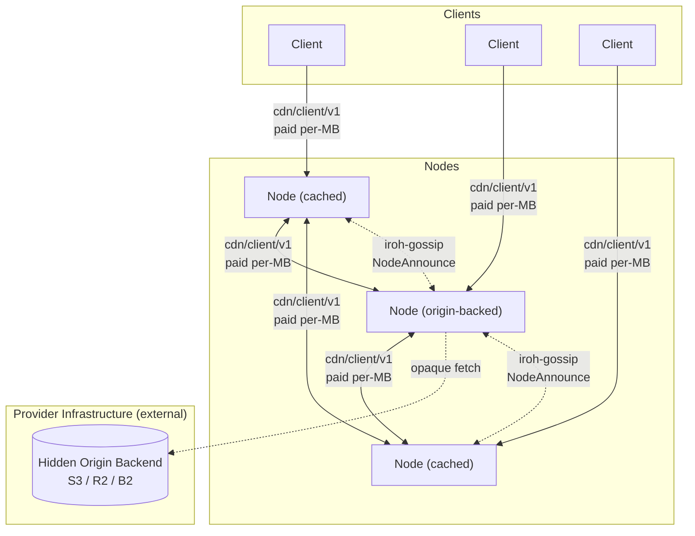
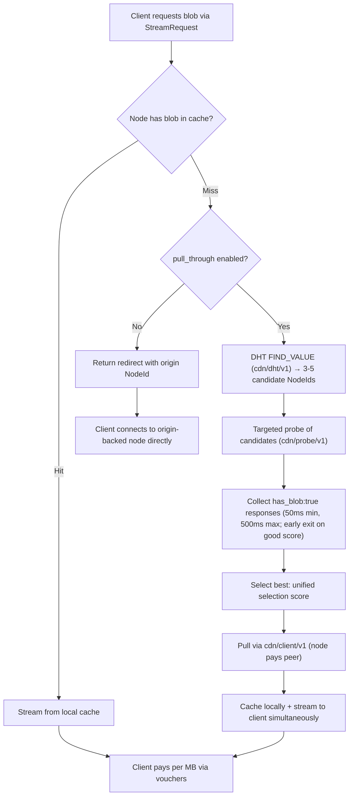
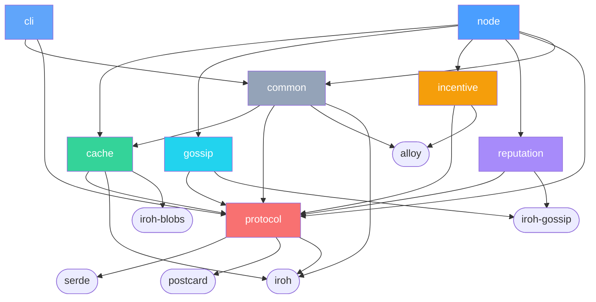

# Architecture Overview

**Date:** 2026-03-28
**Status:** Living document — updated as ADRs are added or revised

## What This Is

A decentralized CDN with two participant roles:

- **Nodes** (providers) cache and serve content. They stake TOKEN to participate in the peer mesh and compete on price and latency. Some nodes are configured with an origin backend (S3, NFS, local disk) making them the canonical source for specific content. The **cache role** is permissionless — any staked operator may pull cached blobs from authorized origins and re-serve them. The **origin role** is DAO-governed for all content — per-namespace `OriginAssignment` set for registered namespaces, and the DAO-maintained default-open allow-list (`OriginAssignment` keyed by `namespaceId == 0`) for unregistered content — with a permissive bootstrap window for default-open serving until the allow-list is first activated (see [ADR 011 § Origin Assignment Authority](011-content-takedown.md#origin-assignment-authority), [ADR 011 § Default-open allow-list](011-content-takedown.md#default-open-allow-list), and [ADR 002 § Publisher Identity and Namespaces](002-content-addressing.md#publisher-identity-and-namespaces)). No external origin URL is ever exposed.
- **Clients** consume content. They pay nodes per MB via off-chain payment channels.

## System Diagram



Clients probe candidate nodes, pick the best by the unified selection score (see [ADR 001](001-network.md#node-selection-algorithm) for the full formula), stream over `cdn/client/v1`, and pay via off-chain payment vouchers (USDC in PoC). On a cache miss, a node performs a DHT FIND_VALUE lookup (`cdn/dht/v1`), probes the returned candidates via `cdn/probe/v1`, selects the best, and pulls via `cdn/client/v1` (paid). When DHT returns no providers, the on-chain origin directory ([ADR 022](022-content-discovery.md)) is the deterministic last-resort fallback. Every byte delivered — whether client→node or node→node — is paid.

## Reading Order

For readers approaching the protocol top-to-bottom, follow this thematic order rather than the numeric one. Each chapter assumes the previous chapters are read. (See also [`README.md` § Design principles](README.md#design-principles) for the protocol's framing before diving in.)

> **Maintenance note:** the reading-order book PDF in [`README.md` § Reading-order build (book layout)](README.md#reading-order-build-book-layout) lists every ADR explicitly in the same order. Edits to the chapters below — adding, removing, or reordering ADRs — must update that pandoc command in lockstep, or the rendered book will drift from this index.

### Chapter 1 — Foundations

The implementation language, the peer mesh's shape, the content-addressing primitive every other chapter inherits, and the wire-protocol surface that carries paid delivery.

1. [ADR 000 — Language and Core Networking Stack](000-language.md)
2. [ADR 001 — Network Topology and Peer Mesh](001-network.md)
3. [ADR 002 — Content Addressing](002-content-addressing.md)
4. [ADR 005 — Wire Protocol](005-protocol.md)

### Chapter 2 — Discovery

How a client or node finds the right peer for a given hash. The DHT is the primary mechanism; 0-RTT is the latency optimization for repeat probes.

1. [ADR 022 — Content Discovery at Scale (DHT)](022-content-discovery.md)
2. [ADR 015 — QUIC 0-RTT Connection Establishment](015-zero-rtt.md)

### Chapter 3 — Payments

Off-chain payment channels for per-MB delivery, with on-chain settlement. Multi-token allowlist follows. Client-side architecture and smart-wallet support are included here because client trust boundaries and key management hang off the payment path.

1. [ADR 003 — Payment Model](003-payments.md)
2. [ADR 010 — Multi-Token Payment Support](010-multi-token.md)
3. [ADR 012 — Client Architecture, Bootstrap, and Trust Model](012-client.md)
4. [ADR 024 — Account Abstraction and Safe Smart Wallet Support](024-account-abstraction.md)

### Chapter 4 — Tokenomics & incentives

The economic model that ties the protocol together. Three ADRs: [ADR 026](026-gauge-boost-tokenomics.md) (canonical), [ADR 027](027-distinct-client-receipts.md) (gauge-security prerequisite), [ADR 018](018-liquidity-strategy.md) (Balancer V3 POL). The launch contract surface is forward-compatible (additive integration via standard `AccessControl` role grants per [ADR 016 §5](016-contract-interactions.md#5-access-control-matrix)) so future economic-layer products can land as additive top-level contracts without changing existing contracts.

1. [ADR 026 — Gauge-Boost Tokenomics](026-gauge-boost-tokenomics.md) (canonical)
2. [ADR 027 — Distinct-Client Delivery Receipts](027-distinct-client-receipts.md) (gauge security; launch prerequisite)
3. [ADR 018 — Liquidity Strategy (Balancer 80/20 POL)](018-liquidity-strategy.md)

### Chapter 5 — Verification & enforcement

How protocol violations are detected, adjudicated, and punished. The slashing schedule lives in [ADR 026 §8](026-gauge-boost-tokenomics.md#8-slashing-and-burn); this chapter is the evidence and adjudication path.

1. [ADR 014 — On-Chain Verification for Slashing Evidence](014-on-chain-verification.md)
2. [ADR 008 — Reputation System](008-reputation.md)
3. [ADR 011 — Content Takedown and Hash Blacklisting](011-content-takedown.md)
4. [ADR 028 — Slashing Appeals and Dispute Escalation](028-slashing-appeals.md)
5. [Appendix: Permissionless Fraud-Detection Layer](appendix-fraud-detection.md) — operational detection layer over the on-chain primitives

### Chapter 6 — Governance & contracts

The governance model that sets the parameters earlier chapters consume, and the cross-contract interaction map that consolidates the on-chain surface.

1. [ADR 009 — Governance Model](009-governance.md)
2. [ADR 016 — Smart Contract Interaction Model](016-contract-interactions.md)

### Chapter 7 — Operations

The operator-facing onboarding flow that takes a bare server through staking, registration, gossip warmup, and accepting paid delivery.

1. [ADR 019 — Node Onboarding and Bootstrapping Flow](019-node-onboarding.md)

### Chapter 8 — Supporting infrastructure

Wire-format evolution rules and the privacy-surface inventory. Both apply across the chapters above.

1. [ADR 013 — Schema Evolution](013-schema-evolution.md)
2. [ADR 017 — Privacy Analysis](017-privacy.md)

The numeric per-ADR index below stays as the canonical reference.

### Appendices — Reference Patterns

Appendices document patterns, reference implementations, and operational guidance built **on top of** the protocol. They are not part of the core spec — alternative implementations are acceptable. See [`README.md` § Decision-record context](README.md#decision-record-context) for the ADR-vs-appendix distinction.

1. [Encrypted Content Publishing](appendix-encrypted-content-publishing.md) — pattern for building an encrypted-content publishing system on top of deCDN; companion app server and `cdn/keys/v1` ALPN
2. [Observability and Metrics](appendix-observability.md) — recommended metric naming, registry, and slash-risk alert thresholds
3. [Peer-Table Eviction Policy](appendix-peer-table-eviction.md) — TTL-based eviction (default 600 s) keyed on `last_seen_us`; active eviction on registry deregistration / origin blacklisting; no hard size cap (staking registry bounds growth); reputation does not factor into eviction
4. [Blob Cache Eviction Policy](appendix-blob-cache-eviction.md) — LRU keyed on last successful `CacheEngine::get` timestamp; operator pinning overrides LRU; operator evict is durable and orthogonal; probe-hold ([ADR 005](005-protocol.md#probe-triggered-eviction-hold)) composes above LRU; reputation does not factor into eviction
5. [Production L2 Deployment Target](appendix-l2-deployment.md) — Arbitrum One selection (deployment decision; protocol depends on Arbitrum-class properties calibrated in core ADRs)
6. [PoC/Production Seam Architecture (Rust)](appendix-poc-production-seams.md) — leaf-crate principle, wiring-layer mode selection, mechanical-deletion graduation path
7. [Local Admin HTTP Surface](appendix-local-admin-http.md) — loopback-bound admin API for operator runbook automation
8. [Operator Key Rotation Runbook](appendix-operator-key-rotation.md) — sequenced procedure for rotating the operator's iroh node-key, Ethereum signing key, and (production) session keys via `bindNodeId`, deregister-and-re-stake, or `erc7579/smartsessions`
9. [Operator Protocol-Upgrade Runbook](appendix-operator-upgrade-path.md) — sequenced operator actions for each ADR 013 tier (Tier 1/2 checklists; Tier 3 rolling-upgrade procedure; client and governance coordination)
10. [Permissionless Fraud-Detection Layer](appendix-fraud-detection.md) — optional, anyone-can-run on-chain monitoring of stale closes and fraudulent epoch summaries via the existing `SlashJudge` bond mechanism

## Architectural Decisions

Numeric per-ADR index. The thematic chapter ordering for top-to-bottom reading lives above in [Reading Order](#reading-order); this section is the canonical per-ADR reference. Each entry is a one-line summary of the ADR's decision; the full Context / Decision / Consequences sections live in the linked file.

- **[ADR 000 — Language and Core Networking Stack](000-language.md)** — Rust + iroh (0.98).
- **[ADR 001 — Network Topology and Peer Mesh](001-network.md)** — Flat peer mesh; gossip for node discovery; `cdn/dht/v1` (Kademlia subset) for content discovery from PoC onward, with the on-chain origin directory ([ADR 022](022-content-discovery.md)) as the deterministic last-resort fallback when DHT returns no providers.
- **[ADR 002 — Content Addressing](002-content-addressing.md)** — BLAKE3 content-addressed blobs. Node backends are opaque to the network.
- **[ADR 003 — Payment Model](003-payments.md)** — Off-chain USDC payment channels. Market-driven rates within governance-set bounds.
- **[ADR 005 — Wire Protocol](005-protocol.md)** — Two core protocols (ALPN-negotiated) plus iroh-gossip. `cdn/client/v1` covers all paid delivery.
- **[ADR 008 — Reputation System](008-reputation.md)** — Interaction-weighted scoring with gossip propagation; gates [ADR 027](027-distinct-client-receipts.md) gauge-pool eligibility.
- **[ADR 009 — Governance Model](009-governance.md)** — Admin key for PoC; ve-weighted Governor + Timelock with safety bounds for production.
- **[ADR 010 — Multi-Token Payment Support](010-multi-token.md)** — Token-agnostic payments with governance-managed ERC-20 allowlist. USDC-only for PoC.
- **[ADR 011 — Content Takedown and Hash Blacklisting](011-content-takedown.md)** — Governance-controlled on-chain hash blacklist with regional bodies and emergency fast-path; per-entry appeals for regional entries via emergency-multisig fast-track + ve-Governor ratification ([§ Blacklist Entry Appeals](011-content-takedown.md#blacklist-entry-appeals)).
- **[ADR 012 — Client Architecture, Bootstrap, and Trust Model](012-client.md)** — Client bootstrap, key management, identity lifecycle, trust boundary, multi-node parallel download, crash recovery, and file manifests.
- **[ADR 013 — Schema Evolution](013-schema-evolution.md)** — Varint-length framing, protocol enums, three-tier evolution model.
- **[ADR 014 — On-Chain Verification for Slashing Evidence](014-on-chain-verification.md)** — secp256k1 EIP-712 `slash_sig` on `ProbeResponse`/`StreamResponse`, optimistic challenge-response for corruption, unified `SlashJudge` contract.
- **[ADR 015 — QUIC 0-RTT Connection Establishment](015-zero-rtt.md)** — 0-RTT early data for latency-sensitive protocols (`cdn/probe/v1`, `cdn/dht/v1`); paid delivery (`cdn/client/v1`) stays 1-RTT.
- **[ADR 016 — Smart Contract Interaction Model](016-contract-interactions.md)** — Cross-contract call graph, fund custody, access control matrix, and reentrancy analysis.
- **[ADR 017 — Privacy Analysis](017-privacy.md)** — Unified privacy surface inventory, adversary model, and mitigation roadmap.
- **[ADR 018 — Liquidity Strategy (Balancer 80/20 POL)](018-liquidity-strategy.md)** — Protocol-Owned Liquidity in a Balancer V3 80/20 TOKEN/USDC weighted pool, seeded from the genesis liquidity allocation.
- **[ADR 019 — Node Onboarding and Bootstrapping Flow](019-node-onboarding.md)** — End-to-end procedure from bare server to actively accepting paid delivery; five sequential onboarding phases.
- **[ADR 022 — Content Discovery at Scale](022-content-discovery.md)** — `cdn/dht/v1` Kademlia subset for content discovery (primary from PoC onward); demand surfaced via DHT FIND_VALUE query frequency and local cache-miss timestamps. No discovery fees.
- **[ADR 024 — Account Abstraction and Safe Smart Wallet Support](024-account-abstraction.md)** — Universal `SignatureChecker` across all contracts; Safe as the recommended wallet for nodes and clients; session keys via ERC-7579 `smartsessions` deferred to production.
- **[ADR 026 — Gauge-Boost Tokenomics](026-gauge-boost-tokenomics.md)** — 1B fixed supply; `FeeRouter` six-bucket split with Curve-style gauge boost, delegator pool, and SafetyReserve.
- **[ADR 027 — Distinct-Client Delivery Receipts](027-distinct-client-receipts.md)** — Client-signed `DeliveryReceipt` Merkle-batched per epoch; gauge-pool eligibility gated on distinct-client diversity. Required for mainnet launch.
- **[ADR 028 — Slashing Appeals and Dispute Escalation](028-slashing-appeals.md)** — 30-day post-slash appeal window via `SafetyReserve` restitution; emergency multisig fast-track + 14-day ve-Governor ratification; one accepted appeal per operator per 365 days.

## Key Invariants

- No external origin URL exists — content enters the network through origin-backed nodes whose backends are hidden
- A node cannot deliver paid content without being reachable via iroh NodeId; the backend is always hidden
- A node cannot earn without delivering verifiable bytes — BLAKE3 hash mismatch voids payment
- A node cannot join the peer mesh without staking — prevents free-riders and provides a slashable bond
- A node cannot register without staking — `StakingRegistry` enforces `stake >= minStake` before accepting a `registerNode` call
- A node cannot register without binding — `registerNode` atomically writes the NodeId-to-address mapping via EIP-712 signature, ensuring every active node is immediately slashable
- A node cannot register a NodeId it does not control — `registerNode` verifies an ed25519 signature proving ownership of the NodeId's private key, preventing squatting ([ADR 001](001-network.md#nodeid-ownership-verification))
- Payment channels amortize on-chain costs across an entire session; per-MB payments are off-chain
- Safety bounds on all governable parameters are hardcoded — governance cannot set fees to 100% or stake to zero (see [ADR 009](009-governance.md))
- A node cannot serve a blacklisted hash after the compliance window — doing so is a slashable offense (see [ADR 011](011-content-takedown.md))

## Trust Assumptions

The system relies on several infrastructure-level assumptions beyond the cryptographic guarantees verified on-chain or in-protocol. [ADR 012](012-client.md) documents the client-specific trust boundary (verified / trusted / not trusted); this section covers system-wide assumptions that span multiple components.

- **NTP availability and correctness.** Gossip validation depends on loose clock agreement: ±60 s for `NodeAnnounce` freshness ([ADR 001](001-network.md)), and for `ReputationReport`, a maximum age of 1 h with up to +5 min allowed future skew ([ADR 008](008-reputation.md)). A compromised or unavailable NTP source could cause mesh partitions or cause nodes to reject valid gossip. Mitigation: nodes detect relative drift via peer timestamp comparison; the tolerance windows are generous enough to absorb typical NTP jitter.

- **L2 RPC provider honesty.** Nodes and clients trust their RPC provider to return correct event logs for registry queries, blacklist polling, and rate-bounds lookups. A malicious RPC provider could hide `ChannelCloseInitiated` events from the in-process dispute monitor or third-party fraud detectors, defeating dispute protection, or return a fabricated node list to eclipse a client. Mitigation: PoC accepts single-RPC trust; production plans multi-source bootstrap ([ADR 012](012-client.md) Option B) and multiple independent RPC providers.

- **Encrypted transport integrity for voucher confidentiality.** Vouchers are bearer instruments — a leaked voucher is valid regardless of how it was obtained. The system assumes vouchers only traverse encrypted authenticated channels between the relevant parties: client↔node and node↔node cache-miss pulls. Mitigation: QUIC/TLS provides in-transit encryption on all these links; vouchers are never logged or persisted in plaintext. Endpoint compromise or debug output leaking vouchers remains an operational risk.

- **Arbitrum sequencer liveness.** The dispute mechanism assumes forced-inclusion transactions complete within ~24 h ([ADR 003 § L2 sequencer censorship](003-payments.md#l2-sequencer-censorship)). If the sequencer censors dispute transactions beyond this window, a fraudulent close could settle before the honest party responds. Mitigation: PoC dispute window is 48 h (governable 12h–72h), providing at least 24 h of effective response time after worst-case sequencer censorship.

- **ERC-20 token behavior stability.** Governance-approved tokens are assumed not to change behavior post-approval (e.g., a proxy-upgradeable token adding fee-on-transfer). Changed token semantics could break settlement arithmetic or trap funds. Mitigation: PoC is USDC-only, reducing token-surface complexity; production token allowlisting and vetting criteria remain an open question in [ADR 010](010-multi-token.md).

- **iroh relay availability.** iroh relays are stateless servers that broker NAT traversal and relay encrypted traffic as a fallback when direct peer-to-peer connections fail (~10% of networking conditions). Relays are not CDN protocol participants — they cannot inspect, cache, or modify content (all traffic is end-to-end encrypted). The deCDN does not incentivize relay operators: paying relays per-byte would create a perverse incentive to prevent direct connections from forming. PoC uses n0.computer's public relays (rate-limited, no SLA). Production deployments should self-host dedicated relays as operational infrastructure, funded from protocol treasury or node staking fees — not as an incentivized network role. If direct-connection success rates drop below ~85%, investigate NAT traversal improvements before considering relay incentivization.

## Non-Goals (PoC)

- DRM or content protection
- Content transcoding or adaptive format conversion
- Search, discovery, or recommendation (see Future Work below)
- Mobile or web clients
- Multi-chain support (single L2 only)
- Multi-token payment support (USDC only for PoC; see [ADR 010](010-multi-token.md))
- Erasure coding (full replication only)

## Glossary

The canonical glossary lives in [`README.md` § Glossary](README.md#glossary), grouped into four categories: wire protocol & content, payments, tokenomics & incentives, and on-chain enforcement.

## Origin Integration

Some nodes are configured with an origin backend (S3, R2, Backblaze B2, self-hosted MinIO, NFS, or local disk). They are the source of truth for all blobs but are accessed as infrequently as possible — only when no peer node has the content.

Whether a node is *recognized* as origin is governed on-chain via `OriginAssignment` — see [ADR 011 § Origin Assignment Authority](011-content-takedown.md#origin-assignment-authority). The wire protocol does not distinguish origins from cache nodes at probe time; origin status is a publisher-level commitment surfaced via `OriginAssignment.getOrigins(namespaceId)` for off-chain consumers (clients selecting peers for first-fetch, off-chain monitors checking publisher availability commitments). Configuring an origin backend locally without DAO authorization simply means the operator's bytes are served as cache and the operator does not appear in `getOrigins(...)`. For registered namespaces, the publisher proposes the operator set and governance ratifies; for default-open content (`namespaceId == 0`), the DAO maintains a single global allow-list (see [ADR 011 § Default-open allow-list](011-content-takedown.md#default-open-allow-list)). Until that allow-list is activated for the first time, the bootstrap rule preserves the prior permissive behaviour so any active staker with an origin backend may serve default-open content as origin; once activated, only allow-listed operators may.

### Supported Origins

| Origin | Auth Method | Notes |
| --- | --- | --- |
| AWS S3 | IAM credentials or pre-signed URLs | Most common |
| Cloudflare R2 | S3-compatible API | No egress fees between R2 and Workers |
| Backblaze B2 | S3-compatible API | Cheapest egress ($0.01/GB) |
| MinIO (self-hosted) | S3-compatible API | Full operator control |
| NFS (local mount) | Filesystem access | No egress fees; requires local/network mount |
| Local disk | Filesystem access | Simplest setup; single-machine only |

All origin access goes through a single trait:

```rust
trait OriginStore: Send + Sync {
    async fn fetch(&self, hash: &Hash) -> Result<Bytes>;
    async fn head(&self, hash: &Hash) -> Result<ObjectMeta>;
}
```

### Hash-to-Object-Key Mapping

S3 objects are addressed by key (a path string). Blobs are addressed by BLAKE3 hash. The mapping is stored in a content catalog — a small database (PostgreSQL or SQLite) maintained by the operator:

```
catalog: hash → {s3_bucket, s3_key, size_bytes, content_type}
```

Nodes query it on cache miss to find the origin pull URL. The catalog is not on-chain — it is an operational concern.

## Cache Behavior

The protocol does not dictate cache policy. Nodes are economically motivated to make good caching decisions.

**Cache miss resolution** follows a priority order:

1. **Paid pull-through (preferred):** Node checks its probe cache or performs a DHT FIND_VALUE lookup + probe (`cdn/dht/v1` → `cdn/probe/v1`), selects the best provider by the unified selection score ([ADR 001](001-network.md#node-selection-algorithm)), pulls via `cdn/client/v1` (paid), caches locally, and streams to the client while the pull is in progress.
2. **Redirect (last resort):** If pull-through is disabled (`pull_through: false` in config), the node returns a redirect to an origin-backed node's NodeId. The client opens a channel with that node directly.

**Prefetching:** Nodes can proactively cache popular content using a local demand signal — tracking cache miss frequency per hash and prefetching when a threshold is crossed (default: 3 misses in 5 minutes). Prefetch pulls use the same DHT FIND_VALUE → probe → `cdn/client/v1` path (paid).

**Eviction:** LRU keyed on the timestamp of the last successful `CacheEngine::get` ([appendix-blob-cache-eviction.md](appendix-blob-cache-eviction.md)). Operators tune cache size to maximize hit rate within their storage budget. Blobs for which the node has signed `has_blob: true` in a `cdn/probe/v1` response are temporarily exempt from eviction via the **probe-triggered eviction hold** (`probe_hold_duration`, see [ADR 005](005-protocol.md#probe-triggered-eviction-hold)), which prevents false phantom-announcement slashing when cache pressure would otherwise evict a blob between probe and subsequent stream request. Operator pinning and operator-initiated evict compose orthogonally with LRU per [appendix-blob-cache-eviction.md](appendix-blob-cache-eviction.md).

**Maximum blob size:** Nodes may configure a `max_blob_size` (PoC recommended default: 10 GB). Requests for blobs exceeding this limit are rejected with `StreamError::BlobTooLarge` ([ADR 005](005-protocol.md#error-handling-and-retry-semantics)). This prevents a single large blob from exhausting cache capacity or tying up connections for extended periods. The limit is per-node — nodes with larger storage budgets can raise it; cache-only nodes on constrained hardware can lower it.



## Crate Structure

```
decdn/
├── Cargo.toml                    # workspace root
├── crates/
│   ├── node/                     # Binary `decdn-node` — daemon entry, runtime, handlers
│   ├── cli/                      # Binary `decdn` — user-facing CLI (probe, node admin, key-gen, config)
│   ├── common/                   # Shared types: config schema, identity, admin RPC trait + DTOs
│   ├── protocol/                 # Shared types, wire format, messages
│   ├── cache/                    # Cache engine wrapping iroh-blobs + origin pull
│   ├── gossip/                   # NodeAnnounce pub/sub over iroh-gossip
│   ├── incentive/                # Payment channels, staking, vouchers
│   ├── reputation/               # Gossip-based reputation system
│   └── contracts/                # Solidity contracts + Foundry
├── tests/                        # Integration tests
└── adr/                          # Architecture decision records
# The app server (encrypted-content-publishing appendix) is an external component, not part of this workspace.
# Content providers build it using their own stack. A reference implementation
# may be provided as a separate repository.
```

### Binaries

The workspace produces two binaries that pair like `dockerd` + `docker`:

| Binary | Role | Crate | Listens on |
|---|---|---|---|
| `decdn-node` | Daemon — caches, serves, peers, gossips. Single subcommand: `decdn-node run [--config <path>]`. | `crates/node` | QUIC `:4433`, metrics `127.0.0.1:9090`, admin loopback `127.0.0.1:9191` |
| `decdn` | User CLI — `probe`, `node {peers,health,announce,drain,evict,reload}`, `key-gen`, `config {init,validate}`, plus future `pull`, `bundle …`, `fetch`, `publish`, `channel`, `wallet`. | `crates/cli` | nothing (outbound only; `node` admin commands use the daemon's loopback HTTP per ADR 025 appendix) |

The container image ships `decdn-node` only. CLI users grab the
`decdn-${VERSION}-${TARGET}.tar.gz` release archive. See
[appendix-binaries.md](appendix-binaries.md) for the rationale.

### Dependency Chain



`protocol` is the leaf crate with minimal dependencies. Everything depends on it; it depends on almost nothing. `common` carries the wire types and config schema both binaries share (see [appendix-binaries.md](appendix-binaries.md)); it pulls `cache` for the typed config fields (`DecompressMode`, `RetryPolicy`, `OriginUrl`, `PinnedHashes`). The cache and incentive layers are separate crates — the cache layer works without incentives (useful for testing, local dev, private deployments). The incentive layer wraps cache operations with payment logic. The `node` crate wires them together; the `cli` crate stays narrow (no `cache`, no `gossip`).

## External Components

Components referenced by appendices that are operated by content providers, not part of the CDN protocol or workspace.

- **App Server** — companion to the [encrypted-content publishing pattern](appendix-encrypted-content-publishing.md). Operated by the content provider; shares the iroh QUIC transport layer with the CDN but does not participate in gossip, probing, or paid delivery. The CDN crates do not depend on it.

## Observability

The canonical metric registry, naming convention (`decdn_` prefix, `_total` suffix for counters), mandatory vs. recommended tiers, alert thresholds, and `/health` endpoint contract are defined in [Appendix: Observability](appendix-observability.md). The summary below is for orientation only — the observability appendix is authoritative.

- **Structured logging** via `tracing` crate (JSON in production).
- **Metrics** via `prometheus` crate, exposed at `:{port}/metrics` (default port 9090). Key metric groups: delivery (`decdn_streams_*`, `decdn_bytes_*`), cache (`decdn_cache_*`), payment channels (`decdn_channels_*`, `decdn_vouchers_*`), gossip (`decdn_gossip_*`, `decdn_peer_table_size`), and slash-safety (see below).
- **Health endpoint** at `:{port}/health` — JSON with `ready`/`degraded`/`not_ready` status, peer count, channel balances, and blacklist sync state.
- **Slash-risk metrics** (all mandatory — nodes must expose these at startup):
  - `decdn_probe_hold_violations_total` — phantom announcement risk ([ADR 005](005-protocol.md))
  - `decdn_probe_hold_slots_used` / `decdn_probe_hold_slots_max` — eviction-hold saturation
  - `decdn_rate_bounds_clamp_events_total` — rate outside governance bounds ([ADR 003](003-payments.md))
  - `decdn_blacklist_sync_lag_seconds` / `decdn_blacklist_version_behind` — compliance lag ([ADR 011](011-content-takedown.md))
  - `decdn_slash_evidence_exposure_total` — self-detected slashing contradiction ([ADR 005](005-protocol.md))

## Alternatives Considered

The decentralized-storage model evaluated against this design (replication factor N, pinning deals, challenge games) is recorded in [`_history/alternatives-pre-launch.md` § Architecture Overview — Decentralized Storage vs Decentralized Delivery](_history/alternatives-pre-launch.md#architecture-overview--decentralized-storage-vs-decentralized-delivery).

## Future Work: Search & Discovery

Not in PoC scope. The planned approach for the next phase:

Dedicated **indexer nodes** subscribe to gossip topics and respond to `cdn/probe/v1` queries to build a searchable index of content metadata (via `tantivy` or equivalent), exposing a query API on a custom ALPN (`cdn/search/v1`). Multiple independent indexers can coexist. Clients pay per query via the same payment channel mechanism. Indexers register in the `StakingRegistry` and are slashable for fabricated results.

Content discovery uses `cdn/dht/v1` from PoC onward — at 30 nodes, FIND_VALUE resolves in 1–2 hops and is negligible overhead. Indexers complement DHT by providing metadata search. The on-chain origin directory ([ADR 022](022-content-discovery.md)) remains the deterministic last-resort fallback when DHT returns no providers.

## Future Work: KV-CRDT Content Catalogs

Not in PoC scope. iroh's KV-CRDT protocol (`iroh-docs`) provides a replicated key-value store with eventual consistency via range-based set reconciliation. Entries are `(namespace, author, key) → (BLAKE3 hash, size, timestamp)` — metadata only; actual content travels via iroh-blobs separately. This maps naturally to deCDN's content-addressing model.

### Primary use case — content catalog replication

A KV-CRDT namespace per content provider could replicate a catalog of `hash → content metadata` entries across nodes. Nodes would learn what content exists before needing it, enabling smarter prefetching. This complements (not replaces) `cdn/dht/v1` — CRDT replication propagates metadata; DHT locates holders.

**Secondary use cases to evaluate:**

- **Node metadata.** A shared document keyed by `NodeId` could provide persistent, eventually-consistent node state (rates, capacity, regions) that survives reconnections — supplementing or replacing ephemeral gossip `NodeAnnounce` messages.
- **Indexer replication layer.** Indexer nodes (see [Search & Discovery](#future-work-search--discovery) above) could subscribe to content catalog namespaces and build their search index from replicated entries, rather than relying solely on gossip and probe participation.

**Why not in PoC:** DHT already handles content discovery at PoC scale. CRDT replication adds value at larger scale for smarter prefetching; deferred until the network grows beyond where DHT alone suffices.

**Reference:** [iroh-docs protocol](https://docs.iroh.computer/protocols/kv-crdts)

## What Is Not Decided Yet

- ~~Production L2 choice~~: decided — [Appendix: L2 Deployment](appendix-l2-deployment.md) selects Arbitrum One (chain ID 42161). Sequencer censorship mitigation uses Arbitrum's 24h forced-inclusion path; see [ADR 003 § L2 sequencer censorship](003-payments.md#l2-sequencer-censorship)
- ~~Content discovery scaling strategy (DHT vs gossip hints)~~: decided — [ADR 022](022-content-discovery.md) specifies `cdn/dht/v1` as the primary discovery mechanism from day one, with the on-chain origin directory as the deterministic last-resort fallback; broadcast probe fan-out is not part of the protocol; gossip content hints rejected
- ~~PoC→production feature-flag / toggle architecture~~: decided — [Appendix: PoC/Production Seams](appendix-poc-production-seams.md) defines trait-based seams with a single `poc` Cargo feature on the `node` crate; `NetworkConstants` as the single source of truth for all numeric differences
- Parallel streaming from multiple nodes for a single blob (protocol supports it, not prioritised)
- ~~Maximum blob size~~: decided — nodes may configure a `max_blob_size` limit (PoC recommended default: 10 GB). Requests exceeding a node's limit are rejected with `StreamError::BlobTooLarge` ([ADR 005](005-protocol.md#error-handling-and-retry-semantics)). This is a per-node operational policy, not an on-chain governance parameter, because different nodes have different storage and bandwidth budgets
- ~~Schema evolution strategy for postcard wire messages~~: decided — [ADR 013](013-schema-evolution.md) defines varint-length framing, protocol enums, a three-tier evolution model, and a gossip envelope
- ~~On-chain verification for slash evidence~~: decided — [ADR 014](014-on-chain-verification.md) specifies secp256k1 EIP-712 `slash_sig` on `ProbeResponse`/`StreamResponse` (`SignatureChecker` for EOA + ERC-1271 smart-wallet verification), optimistic challenge-response for corruption, and a unified `SlashJudge` contract
- ~~NodeId ownership proof for registration~~: decided — [ADR 001](001-network.md#nodeid-ownership-verification) specifies on-chain ed25519 signature verification at registration time, with `reclaimNodeId` as the sole reclaim mechanism in both PoC and production
- ~~Account abstraction / smart wallet support~~: decided — [ADR 024](024-account-abstraction.md) specifies ERC-1271 (`SignatureChecker`) in all contracts from the PoC, Safe as recommended wallet for nodes and clients, session keys for high-frequency signing (vouchers, slash_sig). Supersedes the delegated voucher signer approach (PR 196)
