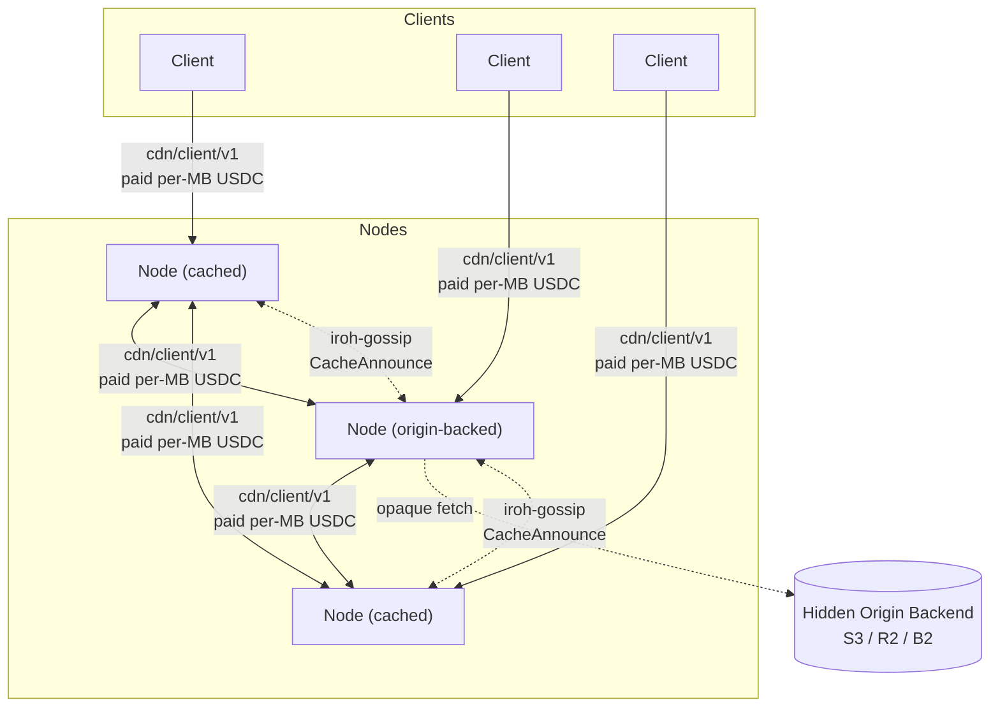
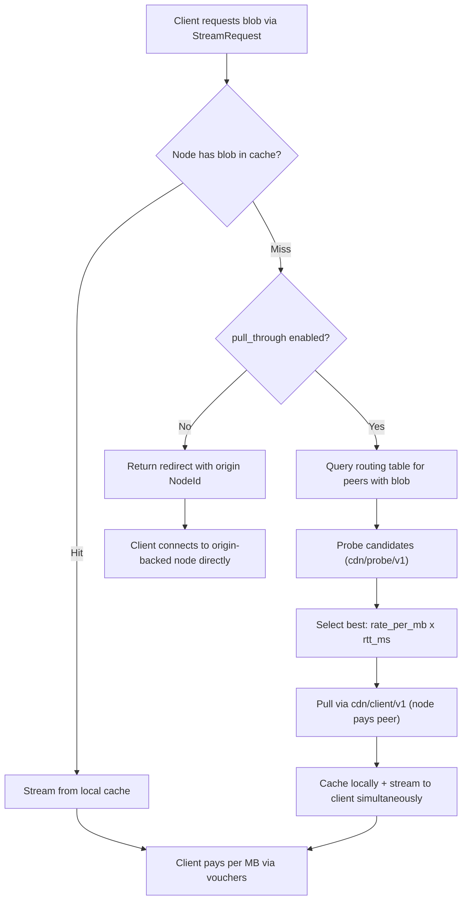

# Architecture Overview

**Date:** 2026-03-28
**Status:** Living document — updated as ADRs are added or revised

---

## What This Is

A decentralized CDN with two participant roles:

- **Nodes** (providers) cache and serve content. They stake TOKEN to participate in the peer mesh and compete on price and latency. Some nodes are configured with an origin backend (S3, NFS, local disk) making them the canonical source for specific content — this is a deployment choice, not a protocol distinction. No external origin URL is ever exposed.
- **Clients** consume content. They pay nodes per MB via off-chain USDC payment channels.

The PoC scope is tens of nodes on a testnet, proving the core delivery and payment protocol.

---

## System Diagram



Clients probe candidate nodes, pick the best by `rate_per_mb × rtt_ms`, stream over `cdn/client/v1`, and pay via off-chain USDC vouchers. On a cache miss, a node pulls from another node that has the blob (paid via `cdn/client/v1`) and caches locally. Every byte delivered — whether client→node or node→node — is paid.

---

## Architectural Decisions

### [ADR 000 — Language and Core Networking Stack](000-language.md)

**Rust + iroh (0.35+).**

The implementation language is Rust. The networking stack is iroh, which provides QUIC transport, NAT traversal, content-addressed blob transfer, and gossip as a cohesive unit. A single statically linked binary runs as a node or client depending on configuration.

---

### [ADR 001 — Network Topology and Peer Mesh](001-network.md)

**Flat peer mesh. Gossip-only content discovery (DHT deferred to post-PoC).**

All staked nodes form a flat mesh. Cache state is broadcast over iroh-gossip on regional topics. On a cache miss, nodes pull from another node that has the blob (paid via `cdn/client/v1`). No external URL is ever accessed — the network is fully self-contained. The on-chain node registry is part of the `StakingRegistry` contract; the `NodeInfo` struct maps `NodeId` (ed25519 public key) to QUIC multiaddrs and Ethereum address.

---

### [ADR 002 — Content Addressing](002-content-addressing.md)

**BLAKE3 content-addressed blobs. Node backends are opaque to the network.**

Every blob is identified by its BLAKE3 hash. Clients verify received bytes against the known hash. The hash→backend mapping is internal to each origin-backed node and never shared — no participant in the network can learn or bypass the node's backing storage.

---

### [ADR 003 — Payment Model](003-payments.md)

**Off-chain USDC payment channels. Market-driven rates.**

Clients pay nodes per MB. On a cache miss, nodes pay origin-backed nodes per MB for initial content pulls, then amortise that cost across many client deliveries. Origin-backed nodes set the effective price ceiling (reflecting their backend egress costs). Rates are fully market-driven within governance-set bounds.

---

### [ADR 004 — Dual-Currency Token Model](004-tokenomics.md)

**USDC for payments. TOKEN for staking and fee discounts.**

TOKEN is not used for payments. All nodes must stake TOKEN to participate. Staking cost creates accountability and Sybil resistance. 20% of protocol fees buy back and burn TOKEN. Fixed supply of 1B at genesis. Governance is covered separately in [ADR 009](009-governance.md).

---

### [ADR 005 — Wire Protocol](005-protocol.md)

**Five ALPN-identified protocols. `cdn/client/v1` covers all paid delivery.**

| ALPN | Purpose |
| --- | --- |
| `cdn/probe/v1` | Parallel latency + availability check before node selection |
| `cdn/client/v1` | Paid delivery: client→node, node→node (cache miss) |
| `cdn/keys/v1` | Epoch key delivery and sealed envelope requests (app server ↔ client) |
| `cdn/watchtower/v1` | Channel-dispute monitoring: voucher registration and updates |
| iroh-gossip built-in | Content availability and node discovery |

`redirect` in `StreamResponse` always points to a NodeId, never an external URL. The origin backend is never revealed.

---

### [ADR 006 — End-to-End Encryption and Key Distribution](006-e2e-encryption.md)

**Envelope encryption with epoch-rotated key distribution.**

Each blob is encrypted once at ingest with a random symmetric key (XChaCha20-Poly1305). The ciphertext is content-addressed and cached normally — one hash, one copy for all clients. An app server (running its own iroh `Endpoint`) gates access: on each play request it wraps the blob key with a rotating epoch key and seals it to the client's public key. Epoch keys are pushed over `cdn/keys/v1` (iroh QUIC); closing the connection revokes access within one epoch (5 minutes). CDN nodes only ever see ciphertext.

---

### [ADR 007 — Watchtower Design for Channel Disputes](007-watchtower.md)

**Non-custodial watchtowers for dispute-window liveness.**

A watchtower holds the latest voucher for a registered channel and submits a `disputeChannel` transaction if a stale close is detected on-chain. Watchtowers cannot steal funds or worsen settlement — the voucher's EIP-712 signature is the only authorisation the contract checks. Nodes register with 2–3 independent watchtowers via `cdn/watchtower/v1` over iroh QUIC. A local in-process dispute monitor provides defense-in-depth for the node-is-online case.

---

### [ADR 008 — Reputation System](008-reputation.md)

**Interaction-weighted scoring with gossip propagation.**

Nodes are ranked by a reputation score (0.0–1.0) derived from local observations (70%) and gossip-propagated reports (30%). Reports are weighted by the reporter's number of settled payment channels (on-chain verifiable), making reputation manipulation expensive. Scores decay toward neutral without fresh data, clamping limits per-report impact, and a cold-start bootstrap gives new nodes initial traffic.

---

### [ADR 009 — Governance Model](009-governance.md)

**Admin key for PoC. Token-weighted governance with safety bounds for production.**

During the PoC, a single deployer address controls all contract parameters. Production governance uses OpenZeppelin Governor with TOKEN voting, 4% quorum, and a 2-day timelock. All governable parameters have hardcoded safety bounds that even governance cannot override. A 3-of-5 emergency multisig can only pause contracts, with a 12-month sunset.

---

## Key Invariants

- No external origin URL exists — content enters the network through origin-backed nodes whose backends are hidden
- A node cannot deliver paid content without being reachable via iroh NodeId; the backend is always hidden
- A node cannot earn without delivering verifiable bytes — BLAKE3 hash mismatch voids payment
- A node cannot join the peer mesh without staking — prevents free-riders and provides a slashable bond
- A node cannot register without staking — `StakingRegistry` enforces `stake >= minStake` before accepting a `registerNode` call
- Payment channels amortize on-chain costs across an entire session; per-MB payments are off-chain
- Safety bounds on all governable parameters are hardcoded — governance cannot set fees to 100% or stake to zero (see [ADR 009](009-governance.md))

---

## Non-Goals (PoC)

- DRM or content protection
- Content transcoding or adaptive format conversion
- Search, discovery, or recommendation (see Future Work below)
- Mobile or web clients
- Multi-chain support (single L2 only)
- Erasure coding (full replication only)

---

## Glossary

| Term | Definition |
| --- | --- |
| **Blob** | A content-addressed byte sequence identified by its BLAKE3 hash |
| **Chunk** | A 1024-byte segment of a blob used by iroh-blobs for verified streaming |
| **Hash sequence** | An ordered collection of blob hashes (iroh's equivalent of a directory/manifest) |
| **Voucher** | A signed off-chain payment message: `{channelId, cumulativeAmount, nonce, signature}` |
| **ALPN** | Application-Layer Protocol Negotiation — identifies which protocol a QUIC connection uses |
| **Node** | A staked participant that caches and serves blobs. Some are configured with an origin backend; others are pure caches. |
| **Client** | A lightweight QUIC endpoint that streams content and pays per MB |
| **Origin-backed node** | A node configured with an object store (S3/R2/B2) — can serve any blob in that store, never experiences a true cache miss |

---

## Origin Integration

Some nodes are configured with an origin backend (S3, R2, Backblaze B2, or self-hosted MinIO). They are the source of truth for all blobs but are accessed as infrequently as possible — only when no peer node has the content.

### Supported Origins

| Origin | Auth Method | Notes |
| --- | --- | --- |
| AWS S3 | IAM credentials or pre-signed URLs | Most common |
| Cloudflare R2 | S3-compatible API | No egress fees between R2 and Workers |
| Backblaze B2 | S3-compatible API | Cheapest egress ($0.01/GB) |
| MinIO (self-hosted) | S3-compatible API | Full operator control |

All origin access goes through a single trait:

```rust
trait OriginStore: Send + Sync {
    async fn fetch(&self, hash: &Hash) -> Result<Bytes>;
    async fn head(&self, hash: &Hash) -> Result<ObjectMeta>;
}
```

### Hash-to-Object-Key Mapping

S3 objects are addressed by key (a path string). Blobs are addressed by BLAKE3 hash. The mapping is stored in a content catalog — a small database (PostgreSQL or SQLite) maintained by the operator:

```
catalog: hash → {s3_bucket, s3_key, size_bytes, content_type}
```

Nodes query it on cache miss to find the origin pull URL. The catalog is not on-chain — it is an operational concern.

---

## Cache Behavior

The protocol does not dictate cache policy. Nodes are economically motivated to make good caching decisions.

**Cache miss resolution** follows a priority order:

1. **Paid pull-through (preferred):** Node checks its routing table for peers that have the blob, probes candidates, selects by `rate_per_mb × rtt_ms`, pulls via `cdn/client/v1` (paid), caches locally, and streams to the client while the pull is in progress.
2. **Redirect (last resort):** If pull-through is disabled (`pull_through: false` in config), the node returns a redirect to an origin-backed node's NodeId. The client opens a channel with that node directly.

**Prefetching:** Nodes can proactively cache popular content by paying to pull it from other nodes. Popularity signals come from gossip (if multiple nodes announce a blob, it is popular). All prefetch pulls are paid via `cdn/client/v1`.

**Eviction:** LRU or frequency-weighted eviction (LFU). Operators tune cache size to maximize hit rate within their storage budget.



---

## Crate Structure

```
decdn/
├── Cargo.toml                    # workspace root
├── crates/
│   ├── node/                     # Binary — CLI entry, config, wiring
│   ├── protocol/                 # Shared types, wire format, messages
│   ├── cache/                    # Cache engine wrapping iroh-blobs + origin pull
│   ├── incentive/                # Payment channels, staking, vouchers
│   ├── reputation/               # Gossip-based reputation system
│   └── contracts/                # Solidity contracts + Foundry
├── tests/                        # Integration tests
└── adr/                          # Architecture decision records
```

### Dependency Chain


`protocol` is the leaf crate with minimal dependencies. Everything depends on it; it depends on almost nothing. The cache and incentive layers are separate crates — the cache layer works without incentives (useful for testing, local dev, private deployments). The incentive layer wraps cache operations with payment logic. The `node` crate wires them together.

---

## Observability

- **Structured logging** via `tracing` crate (standard in iroh ecosystem). JSON output for machine consumption.
- **Metrics** via `prometheus` crate, exposed on a configurable HTTP port:
  - `streams_active`, `streams_completed`, `streams_failed` — delivery activity
  - `vouchers_signed`, `vouchers_received` — payment activity
  - `reputation_reports_sent`, `reputation_reports_received` — gossip health
  - `channels_open`, `channels_settled` — payment channel lifecycle
  - `cache_hits`, `cache_misses`, `cache_bytes` — cache performance
- **Health endpoint** at `/health` on the metrics HTTP port — returns node status, peer count, and channel balances

---

## Considered Alternatives

A fully decentralized storage model was evaluated: nodes would commit to durable storage with replication factor N, pinning deals, and replication maintenance protocols. This was rejected in favor of centralized storage (S3/R2) + decentralized delivery because:

- S3-class storage is cheap ($0.023/GB/month), reliable (11 nines), and already solved
- The actual bottleneck is delivery latency and bandwidth cost, not storage
- Decentralized storage requires complex pinning deals, replication verification, and challenge games
- The CDN model is strictly simpler: trust S3 for durability, decentralize only delivery

---

## Future Work: Search & Discovery

Not in PoC scope. The planned approach for the next phase:

Dedicated **indexer nodes** subscribe to the gossip topic, build a searchable index of content metadata (via `tantivy` or equivalent), and expose a query API on a custom ALPN (`cdn/search/v1`). Multiple independent indexers can coexist. Clients pay per query via the same payment channel mechanism. Indexers register in the `StakingRegistry` and are slashable for fabricated results.

During PoC (before indexers exist), clients use the full-table gossip approach: every node holds the complete content routing table. The migration to indexers is additive — they subscribe to the same gossip topic.

---

## What Is Not Decided Yet

- Production L2 choice (Arbitrum One, Base, or other) — gated on PoC validation
- Parallel streaming from multiple nodes for a single blob (protocol supports it, not prioritised)
