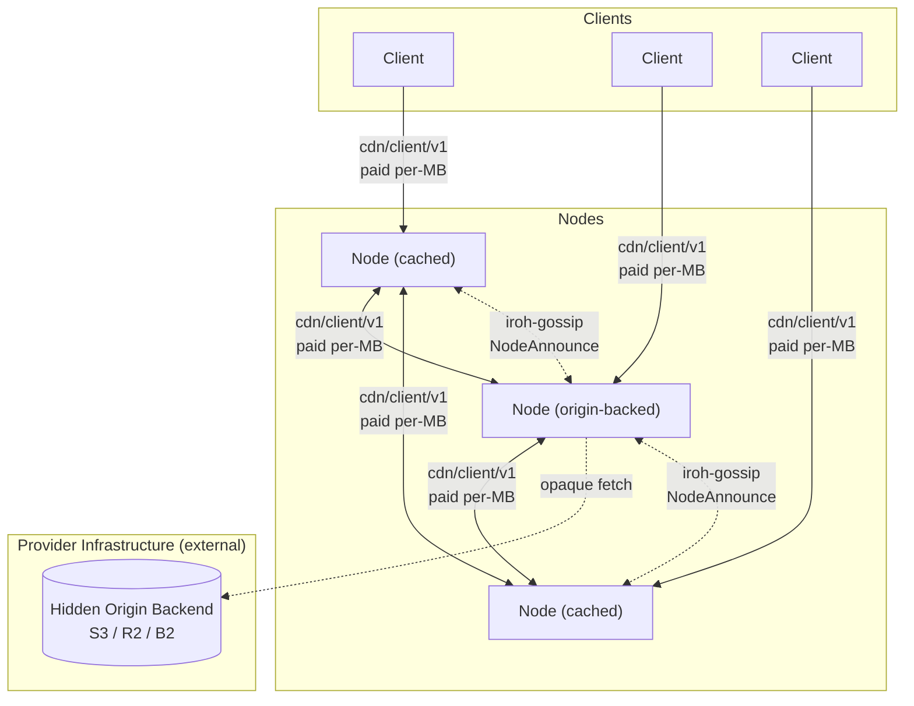

# Architecture Overview

**Date:** 2026-03-28
**Status:** Living document — updated as ADRs are added or revised

## What This Is

A decentralized CDN with two participant roles:

- **Nodes** (providers) cache and serve content. They bond TOKEN proportional to declared capacity (`bond = k × Mbps^α` per [ADR 026 § Capacity-bond curve](026-tokenomics.md#capacity-bond-curve)) to participate in the peer mesh and compete on price and latency. Some nodes are configured with an origin backend (S3, NFS, local disk) making them the canonical source for specific content. The **cache role** is permissionless — any bonded operator may pull cached blobs from authorized origins and re-serve them. The **origin role** is DAO-governed: registered namespaces have publisher-proposed operator sets, and a global allow-list covers unregistered content. No external origin URL is ever exposed.

- **Clients** consume content. They pay nodes per MB via off-chain payment channels.

## System Diagram

Clients probe candidate nodes, pick the best by the unified selection score (see [ADR 001](001-network.md#node-selection-algorithm) for the full formula), stream over `cdn/client/v1`, and pay via off-chain payment vouchers (denominated in the payment token). On a cache miss, a node performs a DHT FIND_VALUE lookup (`cdn/dht/v1`), probes the returned candidates via `cdn/probe/v1`, selects the best, and pulls via `cdn/client/v1` (paid). When DHT returns no providers, the on-chain origin directory ([ADR 022](022-content-discovery.md#adr-022--content-discovery-at-scale)) is the deterministic last-resort fallback. Every byte delivered — whether client→node or node→node — is paid.

## Reading Order

For readers approaching the protocol top-to-bottom, follow this thematic order rather than the numeric one. Each chapter assumes the previous chapters are read. (See also [`README.md` § Design principles](README.md#design-principles) for the protocol's framing before diving in.)

> **Maintenance note:** the reading-order book PDF in [`README.md` § Reading-order build (book layout)](README.md#reading-order-build-book-layout) lists every ADR explicitly in the same order. Edits to the chapters below — adding, removing, or reordering ADRs — must update that pandoc command in lockstep, or the rendered book will drift from this index.

### Chapter 1 — Foundations

The implementation language, the peer mesh's shape, the content-addressing primitive every other chapter inherits, and the wire-protocol surface that carries paid delivery.

1. [ADR 000 — Language and Core Networking Stack](000-language.md#adr-000-language-and-core-networking-stack)
2. [ADR 001 — Network Topology and Peer Mesh](001-network.md#adr-001-network-topology-and-peer-mesh)
3. [ADR 002 — Content Addressing](002-content-addressing.md#adr-002-content-addressing)
4. [ADR 005 — Wire Protocol](005-protocol.md#adr-005-wire-protocol)

### Chapter 2 — Discovery

How a client or node finds the right peer for a given hash. The DHT is the primary mechanism; 0-RTT is the latency optimization for repeat probes.

1. [ADR 022 — Content Discovery at Scale (DHT)](022-content-discovery.md#adr-022--content-discovery-at-scale)
2. [ADR 015 — QUIC 0-RTT Connection Establishment](015-zero-rtt.md#adr-015-quic-0-rtt-connection-establishment)

### Chapter 3 — Payments

Off-chain payment channels for per-MB delivery, with on-chain settlement. Client-side architecture and smart-wallet support are included here because client trust boundaries and key management hang off the payment path.

1. [ADR 003 — Payment Model](003-payments.md#adr-003-payment-model)
2. [ADR 012 — Client Architecture, Bootstrap, and Trust Model](012-client.md#adr-012-client-architecture-bootstrap-and-trust-model)
3. [ADR 024 — Account Abstraction and Safe Smart Wallet Support](024-account-abstraction.md#adr-024-account-abstraction-and-safe-smart-wallet-support)

### Chapter 4 — Tokenomics & incentives

The economic model that ties the protocol together. [ADR 026](026-tokenomics.md#adr-026-tokenomics) is the canonical umbrella under the v2.2 no-emission work-token rewrite (1B supply, 11-group allocation, the `FeeRouter` four-bucket split 60/25/10/5, the `CapacityBond` lock-to-capacity curve `bond = k × Mbps^α`, capacity-shortfall slashing, the bounded one-shot [§ Genesis Bond Credits](026-tokenomics.md#genesis-bond-credits) program (5% / 50M TOKEN, auto-bonded `PendingCredit`) in place of any ongoing service emission, the 14% [§ App Incentives](026-tokenomics.md#app-incentives) demand-side bucket, operator-only governance with `age_ramp` (served-bytes-weighted under [ADR 036](036-served-bytes-voting-weight.md#adr-036-served-bytes-voting-weight)), slashing-burn, bootstrap, and governable-parameter bounds). [ADR 033](033-safety-insurance-reserve.md#adr-033-safety-and-insurance-reserve) details the 5% `SafetyReserve` bucket; [ADR 018](018-liquidity-strategy.md#adr-018-liquidity-strategy-balancer-8020-pol) is the Balancer V3 POL strategy (15% Protocol-Owned Liquidity + 5% Market Making = 20% combined Liquidity-Provision category). The launch contract surface is forward-compatible (additive integration via standard `AccessControl` role grants per [ADR 016 § Access Control Matrix](016-contract-interactions.md#access-control-matrix)) so future economic-layer products can land as additive top-level contracts without changing existing contracts. The retired ADRs 034 (gauge boost + `VotingEscrow`) and 035 (delegator pool) live in [`adr/_history/`](_history/) for design-history audit only.

1. [ADR 026 — Tokenomics](026-tokenomics.md#adr-026-tokenomics) (canonical umbrella)
2. [ADR 033 — Safety and Insurance Reserve](033-safety-insurance-reserve.md#adr-033-safety-and-insurance-reserve)
3. [ADR 018 — Liquidity Strategy (Balancer 80/20 POL)](018-liquidity-strategy.md#adr-018-liquidity-strategy-balancer-8020-pol)

### Chapter 5 — Verification & enforcement

How protocol violations are detected, adjudicated, and punished. The slashing schedule lives in [ADR 026 § Slashing and burn](026-tokenomics.md#slashing-and-burn); this chapter is the evidence and adjudication path.

1. [ADR 014 — On-Chain Verification for Slashing Evidence](014-on-chain-verification.md#adr-014-on-chain-verification-for-slashing-evidence)
2. [ADR 008 — Reputation System](008-reputation.md#adr-008-reputation-system)
3. [ADR 011 — Content Takedown and Hash Blacklisting](011-content-takedown.md#adr-011-content-takedown-and-hash-blacklisting)
4. [ADR 028 — Slashing Appeals and Dispute Escalation](028-slashing-appeals.md#adr-028-slashing-appeals-and-dispute-escalation)
5. [ADR 032 — SafetyReserve Appeal-Surface Contract Surface](032-safety-reserve-appeals-contract.md#adr-032-safetyreserve-appeal-surface-contract-surface) — contract-implementation pin for [ADR 028](028-slashing-appeals.md#adr-028-slashing-appeals-and-dispute-escalation)'s appeal flow
6. [ADR 031 — ContentBlacklist Appeal-Contract Surface](031-content-blacklist-appeals-contract.md#adr-031-contentblacklist-appeal-contract-surface) — contract-implementation pin for [ADR 011](011-content-takedown.md#adr-011-content-takedown-and-hash-blacklisting)'s blacklist-entry appeals
7. [ADR 030 — Node Region Self-Attestation](030-node-region-self-attestation.md#adr-030-node-region-self-attestation)

### Chapter 6 — Governance & contracts

The governance model that sets the parameters earlier chapters consume, and the cross-contract interaction map that consolidates the on-chain surface.

1. [ADR 009 — Governance Model](009-governance.md#adr-009-governance-model)
2. [ADR 036 — Served-Bytes Voting Weight](036-served-bytes-voting-weight.md#adr-036-served-bytes-voting-weight) — supersedes the voting-weight clauses of [ADR 009 § Production](009-governance.md#production-operator-weighted-dao-governance) and [ADR 026 § Governance](026-tokenomics.md#governance); promotes `FeeRouter.bytesPerEpoch` to governance-canonical and adds `windowEpochs` + slash-zero-out on `CapacityBond.slashedAtEpoch`.
3. [ADR 016 — Smart Contract Interaction Model](016-contract-interactions.md#adr-016-smart-contract-interaction-model)

### Chapter 7 — Operations

The operator-facing onboarding flow that takes a bare server through staking, registration, gossip warmup, and accepting paid delivery.

1. [ADR 019 — Node Onboarding and Bootstrapping Flow](019-node-onboarding.md#adr-019-node-onboarding-and-bootstrapping-flow)

### Chapter 8 — Supporting infrastructure

Wire-format evolution rules and the privacy-surface inventory. Both apply across the chapters above.

1. [ADR 013 — Schema Evolution](013-schema-evolution.md#adr-013-schema-evolution)
2. [ADR 017 — Privacy Analysis](017-privacy.md#adr-017-privacy-analysis)

The numeric per-ADR index below stays as the canonical reference.

### Appendices — Reference Patterns

Appendices document patterns, reference implementations, and operational guidance built **on top of** the protocol. They are not part of the core spec — alternative implementations are acceptable. See [`README.md` § Decision-record context](README.md#decision-record-context) for the ADR-vs-appendix distinction.

1. [Encrypted Content Publishing](appendix-encrypted-content-publishing.md#appendix-encrypted-content-publishing-on-decdn) — pattern for building an encrypted-content publishing system on top of deCDN; companion app server and `cdn/keys/v1` ALPN
2. [Directory Bundles (`decdn bundle`)](appendix-bundles.md#appendix-directory-bundles-decdn-bundle) — publisher-side convenience for grouping content-addressed blobs into a single JSON manifest; nodes deliver individual hashes and do not require bundle support
3. [Observability and Metrics](appendix-observability.md#appendix-observability-and-metrics) — recommended metric naming, registry, and slash-risk alert thresholds
4. [Peer-Table Eviction Policy](appendix-peer-table-eviction.md#appendix-peer-table-eviction-policy) — TTL-based eviction (default 600 s) keyed on `last_seen_us`; active eviction on registry deregistration / origin blacklisting; no hard size cap (staking registry bounds growth); reputation does not factor into eviction
5. [Blob Cache Eviction Policy](appendix-blob-cache-eviction.md#appendix-blob-cache-eviction-policy) — LRU keyed on last successful `CacheEngine::get` timestamp; operator pinning overrides LRU; operator evict is durable and orthogonal; probe-hold ([ADR 005](005-protocol.md#probe-triggered-eviction-hold)) composes above LRU; reputation does not factor into eviction
6. [Production L2 Deployment Target](appendix-l2-deployment.md#appendix-production-l2-deployment-target) — Arbitrum One selection (deployment decision; protocol depends on Arbitrum-class properties calibrated in core ADRs)
7. [PoC/Production Seam Architecture (Rust)](appendix-poc-production-seams.md#appendix-pocproduction-seam-architecture-rust-implementation) — leaf-crate principle, wiring-layer mode selection, contract surface is not a PoC/production seam
8. [deCDN Binaries — `decdn-node` + `decdn` Split](appendix-binaries.md#appendix-decdn-binaries--decdn-node--decdn-split) — rationale for the dockerd-style split into the long-lived cache-node daemon (`decdn-node`) and the one-shot operator/publisher CLI (`decdn`)
9. [Local Admin HTTP Surface](appendix-local-admin-http.md#appendix-local-admin-http-surface) — loopback-bound admin API for operator runbook automation
10. [Operator Key Rotation Runbook](appendix-operator-key-rotation.md#appendix-operator-key-rotation-runbook) — sequenced procedure for rotating the operator's iroh node-key, Ethereum signing key, and (production) session keys via `bindNodeId`, deregister-and-re-stake, or `erc7579/smartsessions`
11. [Operator Protocol-Upgrade Runbook](appendix-operator-upgrade-path.md#appendix-operator-protocol-upgrade-runbook) — sequenced operator actions for each [ADR 013](013-schema-evolution.md#adr-013-schema-evolution) tier (Tier 1/2 checklists; Tier 3 rolling-upgrade procedure; client and governance coordination)
12. [Permissionless Fraud-Detection Layer](appendix-fraud-detection.md#appendix-permissionless-stale-close-detection) — optional, anyone-can-run on-chain monitoring of stale closes and fraudulent epoch summaries via the existing `SlashJudge` bond mechanism

## Architectural Decisions

Numeric per-ADR index.

- **[ADR 000 — Language and Core Networking Stack](000-language.md#adr-000-language-and-core-networking-stack)** — Rust + iroh (0.98).
- **[ADR 001 — Network Topology and Peer Mesh](001-network.md#adr-001-network-topology-and-peer-mesh)** — Flat peer mesh; gossip for node discovery; `cdn/dht/v1` (Kademlia subset) for content discovery, with the on-chain origin directory ([ADR 022](022-content-discovery.md#adr-022--content-discovery-at-scale)) as the deterministic last-resort fallback when DHT returns no providers.
- **[ADR 002 — Content Addressing](002-content-addressing.md#adr-002-content-addressing)** — BLAKE3 content-addressed blobs. Node backends are opaque to the network.
- **[ADR 003 — Payment Model](003-payments.md#adr-003-payment-model)** — Off-chain payment-token channels (USDC, fixed at deployment). Market-driven rates within governance-set bounds.
- **[ADR 005 — Wire Protocol](005-protocol.md#adr-005-wire-protocol)** — Two core protocols (ALPN-negotiated) plus iroh-gossip. `cdn/client/v1` covers all paid delivery.
- **[ADR 008 — Reputation System](008-reputation.md#adr-008-reputation-system)** — Interaction-weighted scoring with gossip propagation.
- **[ADR 009 — Governance Model](009-governance.md#adr-009-governance-model)** — Admin key for PoC; bootstrap multisig phase post-launch; transition to served-bytes-weighted Governor (`FeeRouter.bytesInWindow × age_ramp` per [ADR 036](036-served-bytes-voting-weight.md#adr-036-served-bytes-voting-weight)) + Timelock once active operators ≥ 30 AND total declared capacity ≥ 100 Gbps.
- **[ADR 036 — Served-Bytes Voting Weight](036-served-bytes-voting-weight.md#adr-036-served-bytes-voting-weight)** — Promotes `FeeRouter.bytesPerEpoch` from analytics-only to governance-canonical; vote weight = served-bytes trailing-window sum × `age_ramp`, capped per-operator at 5% of bytes-weighted total, zeroed for `windowEpochs` epochs after any slash via the new `CapacityBond.slashedAtEpoch` watermark.
- **[ADR 011 — Content Takedown and Hash Blacklisting](011-content-takedown.md#adr-011-content-takedown-and-hash-blacklisting)** — Governance-controlled on-chain hash blacklist with regional bodies and emergency fast-path; per-entry appeals for regional entries via emergency-multisig fast-track + DecdnGovernor ratification ([§ Blacklist Entry Appeals](011-content-takedown.md#blacklist-entry-appeals)).
- **[ADR 012 — Client Architecture, Bootstrap, and Trust Model](012-client.md#adr-012-client-architecture-bootstrap-and-trust-model)** — Client bootstrap, key management, identity lifecycle, trust boundary, multi-node parallel download, crash recovery, and file manifests.
- **[ADR 013 — Schema Evolution](013-schema-evolution.md#adr-013-schema-evolution)** — Varint-length framing, protocol enums, three-tier evolution model.
- **[ADR 014 — On-Chain Verification for Slashing Evidence](014-on-chain-verification.md#adr-014-on-chain-verification-for-slashing-evidence)** — secp256k1 EIP-712 `slash_sig` on `ProbeResponse`/`StreamResponse`; unified `SlashJudge` contract for the three signature-dependent offenses (phantom, rate, blacklist). Content corruption is absorbed at the wire (no on-chain path) — see [ADR 003 § Corrupted delivery](003-payments.md#corrupted-delivery).
- **[ADR 015 — QUIC 0-RTT Connection Establishment](015-zero-rtt.md#adr-015-quic-0-rtt-connection-establishment)** — 0-RTT early data for `cdn/probe/v1` only; `cdn/client/v1` (paid delivery) and `cdn/dht/v1` (multiplexes state-changing `StoreRequest`) stay 1-RTT.
- **[ADR 016 — Smart Contract Interaction Model](016-contract-interactions.md#adr-016-smart-contract-interaction-model)** — Cross-contract call graph, fund custody, access control matrix, and reentrancy analysis.
- **[ADR 017 — Privacy Analysis](017-privacy.md#adr-017-privacy-analysis)** — Unified privacy surface inventory, adversary model, and mitigation roadmap.
- **[ADR 018 — Liquidity Strategy (Balancer 80/20 POL)](018-liquidity-strategy.md#adr-018-liquidity-strategy-balancer-8020-pol)** — Protocol-Owned Liquidity in a Balancer V3 80/20 TOKEN/USDC weighted pool, seeded from the genesis liquidity allocation.
- **[ADR 019 — Node Onboarding and Bootstrapping Flow](019-node-onboarding.md#adr-019-node-onboarding-and-bootstrapping-flow)** — End-to-end procedure from bare server to actively accepting paid delivery; five sequential onboarding phases.
- **[ADR 022 — Content Discovery at Scale](022-content-discovery.md#adr-022--content-discovery-at-scale)** — `cdn/dht/v1` Kademlia subset for content discovery; demand surfaced via DHT FIND_VALUE query frequency and local cache-miss timestamps. No discovery fees.
- **[ADR 024 — Account Abstraction and Safe Smart Wallet Support](024-account-abstraction.md#adr-024-account-abstraction-and-safe-smart-wallet-support)** — Universal `SignatureChecker` across all contracts; Safe as the recommended wallet for nodes and clients; session keys via ERC-7579 `smartsessions`.
- **[ADR 026 — Tokenomics](026-tokenomics.md#adr-026-tokenomics)** — Canonical economic-model umbrella: 1B fixed supply, 11-group allocation, the `FeeRouter` four-bucket split (60/25/10/5), the `CapacityBond` lock-to-capacity curve, capacity-shortfall slashing, the bounded one-shot Genesis Bond Credits program (no ongoing service emission), App Incentives demand-side bucket, operator-only served-bytes-weighted governance per [ADR 036](036-served-bytes-voting-weight.md#adr-036-served-bytes-voting-weight), slashing-burn, bootstrap, and governable-parameter bounds.
- **[ADR 028 — Slashing Appeals and Dispute Escalation](028-slashing-appeals.md#adr-028-slashing-appeals-and-dispute-escalation)** — 30-day post-slash appeal window via `SafetyReserve` restitution; emergency multisig fast-track + 14-day DecdnGovernor ratification; one accepted appeal per operator per 365 days.
- **[ADR 030 — Node Region Self-Attestation](030-node-region-self-attestation.md#adr-030-node-region-self-attestation)** — Region claims in `NodeAnnounce` and `CapacityBond` are accepted at face value; the IP-geolocation oracle / third-party attestation path is explicitly rejected. Appeals-standing flipping and reactive blacklist-scope flipping are closed by a 7-day `regionLastChanged` stability window on `CapacityBond` (governable `[3d, 30d]`; [ADR 011 § Standing](011-content-takedown.md#standing) path 2 and [§ Regional Scope](011-content-takedown.md#regional-scope)). Latency-vs.-claim reputation penalty from [ADR 001 § Consequences](001-network.md#consequences) is the canonical soft mitigation for residual pre-positioned misdeclaration.
- **[ADR 031 — ContentBlacklist Appeal-Contract Surface](031-content-blacklist-appeals-contract.md#adr-031-contentblacklist-appeal-contract-surface)** — Pins the contract surface for [ADR 011 § Blacklist Entry Appeals](011-content-takedown.md#blacklist-entry-appeals): per-appeal storage layout, event-topic ordering, state machine, and integration with `ContentBlacklist` core.
- **[ADR 032 — SafetyReserve Appeal-Surface Contract Surface](032-safety-reserve-appeals-contract.md#adr-032-safetyreserve-appeal-surface-contract-surface)** — Pins the contract surface for [ADR 028](028-slashing-appeals.md#adr-028-slashing-appeals-and-dispute-escalation): per-appeal storage layout, escrow accounting, all Solidity event signatures.
- **[ADR 033 — Safety and Insurance Reserve](033-safety-insurance-reserve.md#adr-033-safety-and-insurance-reserve)** — The `FeeRouter` safety/insurance bucket: `SafetyReserve` payout categories, the four-gate spending controls, epoch-FIFO cross-category payout ordering with permissionless queued disbursement, interface stability, and the `ISafetyReserve` contract surface. Split out of [ADR 026 § Safety and insurance reserve (5% bucket)](026-tokenomics.md#safety-and-insurance-reserve-5-bucket); the appeal-surface that feeds it is [ADR 032](032-safety-reserve-appeals-contract.md#adr-032-safetyreserve-appeal-surface-contract-surface).
(ADRs 034 and 035 were canonical under the prior ve-gauge tokenomics design and have been retired to [`adr/_history/`](_history/) under the v2.1 work-token rewrite — see [ADR 026 § Cross-ADR Impact](026-tokenomics.md#cross-adr-impact). Do not link to them from canonical ADRs.)

## Key Invariants

- No external origin URL exists — content enters the network through origin-backed nodes whose backends are hidden
- A node cannot deliver paid content without being reachable via iroh NodeId
- A node cannot earn without delivering verifiable bytes — BLAKE3 hash mismatch voids payment
- A node cannot join the peer mesh without bonding — prevents free-riders and provides a slashable bond proportional to declared capacity
- A node cannot register without bonding — `CapacityBond` enforces `bond >= bond_required(declared_capacity_Mbps)` via the `bond = k × Mbps^α` curve before accepting a `register` call
- A node cannot register without binding — `registerNode` atomically writes the NodeId-to-address mapping via EIP-712 signature, ensuring every active node is immediately slashable
- A node cannot register a NodeId it does not control — `registerNode` verifies an ed25519 signature proving ownership of the NodeId's private key, preventing squatting ([ADR 003 § NodeId Ownership Verification](003-payments.md#nodeid-ownership-verification))
- Payment channels amortize on-chain costs across an entire session; per-MB payments are off-chain
- Safety bounds on all governable parameters are hardcoded — governance cannot set fees to 100% or stake to zero (see [ADR 009](009-governance.md#adr-009-governance-model))
- A node cannot serve a blacklisted hash after the compliance window — doing so is a slashable offense (see [ADR 011](011-content-takedown.md#adr-011-content-takedown-and-hash-blacklisting))

## Trust Assumptions

The system relies on several infrastructure-level assumptions beyond the cryptographic guarantees verified on-chain or in-protocol. [ADR 012](012-client.md#adr-012-client-architecture-bootstrap-and-trust-model) documents the client-specific trust boundary (verified / trusted / not trusted); this section covers system-wide assumptions that span multiple components.

- **NTP availability and correctness.** Gossip validation depends on loose clock agreement: ±60 s for `NodeAnnounce` freshness ([ADR 001](001-network.md#adr-001-network-topology-and-peer-mesh)), and for `ReputationReport`, a maximum age of 1 h with up to +5 min allowed future skew ([ADR 008](008-reputation.md#adr-008-reputation-system)). A compromised or unavailable NTP source could cause mesh partitions or cause nodes to reject valid gossip. Mitigation: nodes detect relative drift via peer timestamp comparison; the tolerance windows are generous enough to absorb typical NTP jitter.

- **L2 RPC provider honesty.** Nodes and clients trust their RPC provider to return correct event logs for registry queries, blacklist polling, and rate-bounds lookups. A malicious RPC provider could hide `ChannelCloseInitiated` events from the in-process dispute monitor or third-party fraud detectors, defeating dispute protection, or return a fabricated node list to eclipse a client. Mitigation: multi-source bootstrap ([ADR 012](012-client.md#adr-012-client-architecture-bootstrap-and-trust-model) Option B) and multiple independent RPC providers.

- **Encrypted transport integrity for voucher confidentiality.** Vouchers are bearer instruments — a leaked voucher is valid regardless of how it was obtained. The system assumes vouchers only traverse encrypted authenticated channels between the relevant parties: client↔node and node↔node cache-miss pulls. Mitigation: QUIC/TLS provides in-transit encryption on all these links; vouchers are never logged or persisted in plaintext. Endpoint compromise or debug output leaking vouchers remains an operational risk.

- **Arbitrum sequencer liveness.** The dispute mechanism assumes forced-inclusion transactions complete within ~24 h ([ADR 003 § L2 sequencer censorship](003-payments.md#l2-sequencer-censorship)). If the sequencer censors dispute transactions beyond this window, a fraudulent close could settle before the honest party responds. Mitigation: dispute window is 48 h (governable 12h–72h), providing at least 24 h of effective response time after worst-case sequencer censorship.

- **Payment-token behavior stability.** The payment token is USDC, fixed at deployment as an immutable constructor argument. USDC is a standard ERC-20 (no fee-on-transfer, rebase, or transfer hooks). A Circle-side change to USDC semantics or an address/contract freeze is outside protocol control and is the accepted counterparty risk noted in [ADR 003](003-payments.md#adr-003-payment-model).

- **iroh relay availability.** iroh relays are stateless servers that broker NAT traversal and relay encrypted traffic as a fallback when direct peer-to-peer connections fail (~10% of networking conditions). Relays are not CDN protocol participants — they cannot inspect, cache, or modify content (all traffic is end-to-end encrypted). The deCDN does not incentivize relay operators: paying relays per-byte would create a perverse incentive to prevent direct connections from forming. Production deployments should self-host dedicated relays as operational infrastructure, funded from protocol treasury or node staking fees — not as an incentivized network role. If direct-connection success rates drop below ~85%, investigate NAT traversal improvements before considering relay incentivization.

## Origin Backends

Origin-backed nodes hold the canonical bytes and are pulled only on cache miss; whether an operator is *recognized* as origin is governed on-chain via `OriginAssignment` (see [ADR 011 § Origin Assignment Authority](011-content-takedown.md#origin-assignment-authority) and [ADR 002 § Publisher Identity and Namespaces](002-content-addressing.md#publisher-identity-and-namespaces)). Configuring an origin backend locally without DAO authorization simply means the operator's bytes are served as cache. Supported backends — any S3-compatible object store (AWS S3, Cloudflare R2, Backblaze B2, self-hosted MinIO), an NFS mount, or local disk — and how a node maps a hash to its stored object are purely operational: the protocol only requires that a node deliver the correct bytes for a given hash.

## Non-Goals

- **DRM / content protection** — blobs are served public-by-default; confidentiality is an app-layer concern.
- **Transcoding / adaptive formats** — content-addressed bytes are delivered verbatim; transforming them would break the hash.
- **Search, discovery, recommendation** — an external/additive layer, not the core protocol.
- **Mobile or web clients** — the reference client is a native binary; other surfaces are downstream.
- **Multi-chain support** — settlement runs on a single L2; cross-chain is out of scope.
- **Erasure coding** — blobs are fully replicated across nodes, not erasure-coded.
