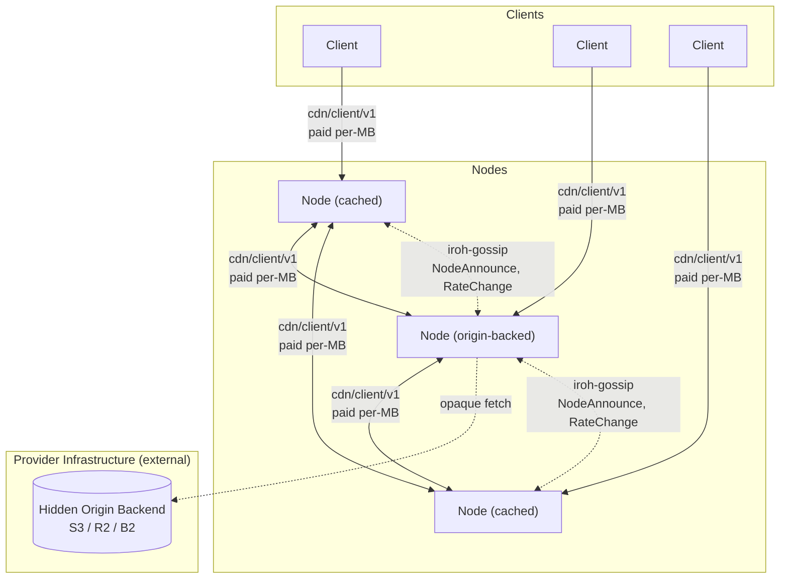
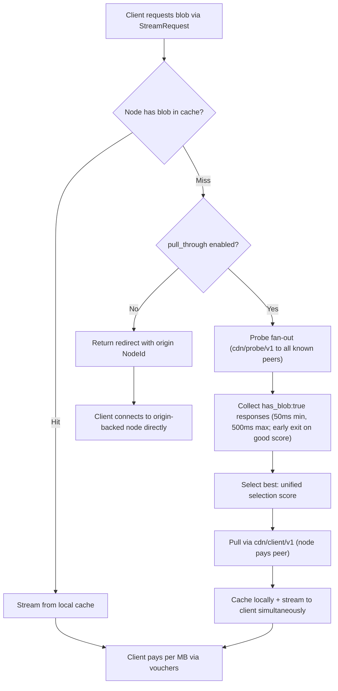

# Architecture Overview

**Date:** 2026-03-28
**Status:** Living document — updated as ADRs are added or revised

---

## What This Is

A decentralized CDN with two participant roles:

- **Nodes** (providers) cache and serve content. They stake TOKEN to participate in the peer mesh and compete on price and latency. Some nodes are configured with an origin backend (S3, NFS, local disk) making them the canonical source for specific content — this is a deployment choice, not a protocol distinction. No external origin URL is ever exposed.
- **Clients** consume content. They pay nodes per MB via off-chain payment channels (USDC in PoC; multiple governance-approved ERC-20 tokens in production — see [ADR 010](010-multi-token.md)).

The PoC scope is tens of nodes on a testnet, proving the delivery pipeline (content discovery, probing, paid streaming) and payment channel lifecycle (open, voucher, close, dispute). Reputation, encryption, watchtowers, and governance use simplified stand-ins.

---

## System Diagram



**Note:** PoC payments use USDC only; production supports multiple governance-approved ERC-20 tokens (see [ADR 010](010-multi-token.md)).

Clients probe candidate nodes, pick the best by the unified selection score (see [ADR 001](001-network.md#node-selection-algorithm) for the full formula), stream over `cdn/client/v1`, and pay via off-chain payment vouchers (USDC in PoC). On a cache miss, a node performs a DHT FIND_VALUE lookup (`cdn/dht/v1`), probes the returned candidates via `cdn/probe/v1`, selects the best, and pulls via `cdn/client/v1` (paid). During bootstrap, broadcast probe fan-out is used as a fallback. Every byte delivered — whether client→node or node→node — is paid.

---

## Reading Order

For readers approaching the protocol top-to-bottom, follow this thematic order rather than the numeric one. Each chapter assumes the previous chapters are read. (See also [`README.md` § Design principles](README.md#design-principles) for the protocol's framing before diving in.)

### Chapter 1 — Foundations

The implementation language, the peer mesh's shape, the content-addressing primitive every other chapter inherits, and the wire-protocol surface that carries paid delivery.

1. [ADR 000 — Language and Core Networking Stack](000-language.md)
2. [ADR 001 — Network Topology and Peer Mesh](001-network.md)
3. [ADR 002 — Content Addressing](002-content-addressing.md)
4. [ADR 005 — Wire Protocol](005-protocol.md)

### Chapter 2 — Discovery

How a client or node finds the right peer for a given hash. The DHT is the primary mechanism; 0-RTT is the latency optimization for repeat probes.

1. [ADR 022 — Content Discovery at Scale (DHT)](022-content-discovery.md)
2. [ADR 015 — QUIC 0-RTT Connection Establishment](015-zero-rtt.md)

### Chapter 3 — Payments

Off-chain payment channels for per-MB delivery, with on-chain settlement. Multi-token allowlist follows. Client-side architecture and smart-wallet support are included here because client trust boundaries and key management hang off the payment path.

1. [ADR 003 — Payment Model](003-payments.md)
2. [ADR 010 — Multi-Token Payment Support](010-multi-token.md)
3. [ADR 012 — Client Architecture, Bootstrap, and Trust Model](012-client.md)
4. [ADR 024 — Account Abstraction and Safe Smart Wallet Support](024-account-abstraction.md)

### Chapter 4 — Tokenomics & incentives

The economic model that ties the protocol together. Three ADRs: [ADR 026](026-gauge-boost-tokenomics.md) (canonical), [ADR 027](027-distinct-client-receipts.md) (gauge-security prerequisite), [ADR 018](018-liquidity-strategy.md) (Balancer V3 POL). The launch contract surface is forward-compatible (additive integration via standard `AccessControl` role grants per [ADR 016 §5](016-contract-interactions.md#5-access-control-matrix)) so future economic-layer products can land as additive top-level contracts without changing existing contracts.

1. [ADR 026 — Gauge-Boost Tokenomics](026-gauge-boost-tokenomics.md) (canonical)
2. [ADR 027 — Distinct-Client Delivery Receipts](027-distinct-client-receipts.md) (gauge security; launch prerequisite)
3. [ADR 018 — Liquidity Strategy (Balancer 80/20 POL)](018-liquidity-strategy.md)

### Chapter 5 — Verification & enforcement

How protocol violations are detected, adjudicated, and punished. The slashing schedule lives in [ADR 026 §8](026-gauge-boost-tokenomics.md#8-slashing-and-burn); this chapter is the evidence and adjudication path.

1. [ADR 014 — On-Chain Verification for Slashing Evidence](014-on-chain-verification.md)
2. [ADR 007 — Watchtower Design for Channel Disputes](007-watchtower.md)
3. [ADR 008 — Reputation System](008-reputation.md)
4. [ADR 011 — Content Takedown and Hash Blacklisting](011-content-takedown.md)

### Chapter 6 — Governance & contracts

The governance model that sets the parameters earlier chapters consume, and the cross-contract interaction map that consolidates the on-chain surface.

1. [ADR 009 — Governance Model](009-governance.md)
2. [ADR 016 — Smart Contract Interaction Model](016-contract-interactions.md)

### Chapter 7 — Operations

The operator-facing onboarding flow that takes a bare server through staking, registration, gossip warmup, and accepting paid delivery.

1. [ADR 019 — Node Onboarding and Bootstrapping Flow](019-node-onboarding.md)

### Chapter 8 — Supporting infrastructure

Wire-format evolution rules and the privacy-surface inventory. Both apply across the chapters above.

1. [ADR 013 — Schema Evolution](013-schema-evolution.md)
2. [ADR 017 — Privacy Analysis](017-privacy.md)

The numeric per-ADR index below stays as the canonical reference.

### Appendices — Reference Patterns

Appendices document patterns, reference implementations, and operational guidance built **on top of** the protocol. They are not part of the core spec — alternative implementations are acceptable. See [`README.md` § Decision-record context](README.md#decision-record-context) for the ADR-vs-appendix distinction.

1. [Encrypted Content Publishing](appendix-encrypted-content-publishing.md) — pattern for building an encrypted-content publishing system on top of deCDN; companion app server and `cdn/keys/v1` ALPN
2. [Observability and Metrics](appendix-observability.md) — recommended metric naming, registry, and slash-risk alert thresholds
3. [Production L2 Deployment Target](appendix-l2-deployment.md) — Arbitrum One selection (deployment decision; protocol depends on Arbitrum-class properties calibrated in core ADRs)
4. [PoC/Production Seam Architecture (Rust)](appendix-poc-production-seams.md) — leaf-crate principle, wiring-layer mode selection, mechanical-deletion graduation path
5. [Local Admin HTTP Surface](appendix-local-admin-http.md) — loopback-bound admin API for operator runbook automation

---

## Architectural Decisions

### [ADR 000 — Language and Core Networking Stack](000-language.md)

**Rust + iroh (0.97).**

The implementation language is Rust. The networking stack is iroh, which provides QUIC transport, NAT traversal, content-addressed blob transfer, and gossip as a cohesive unit. A single statically linked binary runs as a node or client depending on configuration.

---

### [ADR 001 — Network Topology and Peer Mesh](001-network.md)

**Flat peer mesh. Gossip for node discovery; `cdn/dht/v1` (Kademlia subset) for content discovery from PoC onward, with broadcast probe fan-out as a bootstrap fallback (see [ADR 022](022-content-discovery.md)).**

All staked nodes form a flat mesh. Node metadata is broadcast over iroh-gossip on regional topics (`cdn/region/{cc}/v1`) and a global topic (`cdn/global/v1`) via lightweight `NodeAnnounce` messages (~800 bytes, 60-second PoC default interval). Per-node gossip bandwidth scales linearly: ~3 Kbps at 30 nodes (PoC), ~111 Kbps at 1,000 nodes; structured overlay or gossip partitioning is needed beyond ~1,000 nodes. Content discovery is on-demand: on a cache miss, nodes probe all known peers via `cdn/probe/v1` in parallel and select the best provider by the unified selection score (`rate_per_mb × rtt_ms × (1 / max(reputation, 0.1)²)` — lower is better). No content inventories are broadcast — no Bloom filters, no hash lists. The on-chain node registry is part of the `StakingRegistry` contract; the `NodeInfo` struct maps `NodeId` (ed25519 public key) to QUIC multiaddrs and Ethereum address. Registration requires both an EIP-712 binding signature (for slashability) and an ed25519 ownership proof (preventing NodeId squatting).

---

### [ADR 002 — Content Addressing](002-content-addressing.md)

**BLAKE3 content-addressed blobs. Node backends are opaque to the network.**

Every blob is identified by its BLAKE3 hash. Clients verify received bytes against the known hash. The hash→backend mapping is internal to each origin-backed node and never shared — no participant in the network can learn or bypass the node's backing storage.

---

### [ADR 003 — Payment Model](003-payments.md)

**Off-chain USDC payment channels. Market-driven rates.**

Clients pay nodes per MB. On a cache miss, nodes pay origin-backed nodes per MB for initial content pulls, then amortise that cost across many client deliveries. Origin-backed nodes set the effective price ceiling (reflecting their backend egress costs). Rates are fully market-driven within governance-set bounds. Voucher cadence (default 1 MB) is negotiable per-stream for large blob transfers, reducing overhead without materially increasing risk. Nodes join the mesh via `StakingRegistry.registerNode()` ([ADR 001](001-network.md)), which atomically establishes the cryptographic NodeId-to-Ethereum address binding (EIP-712 signature, see [ADR 003](003-payments.md)) and verifies ed25519 ownership of the NodeId (preventing squatting) for slash evidence and payment attribution. `bindNodeId()` remains available for post-registration key rotation. Client bindings are ephemeral (per-session).

---

### [ADR 005 — Wire Protocol](005-protocol.md)

**Three core protocols (ALPN-negotiated) plus iroh-gossip. `cdn/client/v1` covers all paid delivery.**

| Protocol | Purpose |
| --- | --- |
| `cdn/probe/v1` | Parallel latency + availability check before node selection |
| `cdn/client/v1` | Paid delivery: client→node, node→node (cache miss) |
| `cdn/watchtower/v1` | Channel-dispute monitoring ([ADR 007](007-watchtower.md)) |
| iroh-gossip (built-in) | Node metadata broadcast (`NodeAnnounce`), rate change announcements (`RateChange`), watchtower discovery (`WatchtowerAnnounce`, production), node discovery |

Gossip topics: `cdn/global/v1` (all nodes — `NodeAnnounce`, `RateChange`, `WatchtowerAnnounce` (production)), `cdn/region/{cc}/v1` (regional — `NodeAnnounce`), `cdn/reputation/v1` (reputation reports — [ADR 008](008-reputation.md)).

`redirect` in `StreamResponse` always points to a NodeId, never an external URL. The origin backend is never revealed.

---

### [ADR 007 — Watchtower Design for Channel Disputes](007-watchtower.md)

**Non-custodial watchtowers for dispute-window liveness.**

A watchtower holds the latest voucher for a registered channel and submits a `disputeChannel` transaction if a stale close is detected on-chain. Watchtowers cannot steal funds or worsen settlement — the voucher's EIP-712 signature is the only authorisation the contract checks. Nodes register with 2–3 independent watchtowers via `cdn/watchtower/v1` over iroh QUIC. A local in-process dispute monitor provides defense-in-depth for the node-is-online case. Production deployments use an on-chain `WatchtowerEscrow` contract for fee accountability: watchtowers submit periodic heartbeats with mandatory voucher state attestation (BLAKE3 commitment), and watched parties can reclaim escrowed fees on heartbeat failure.

---

### [ADR 008 — Reputation System](008-reputation.md)

**Interaction-weighted scoring with gossip propagation.**

Nodes are ranked by a reputation score (0.0–1.0) derived from local observations (70%) and gossip-propagated reports (30%). Reports are weighted by the reporter's effective settled value — total settled value adjusted for counterparty diversity (minimum 5 distinct counterparties for full credit) and time decay (half-life ≈ 7 weeks), both on-chain verifiable. USDC-only in PoC, multi-token normalized in production (see [ADR 010](010-multi-token.md)). Reporter weight is capped at 3× to limit incumbency advantage while keeping manipulation expensive. Only staked nodes may submit gossip reports; clients contribute via local scores only. Scores decay toward neutral without fresh data, clamping limits per-report impact, and a cold-start bootstrap gives new nodes initial traffic (one-time per operator address to prevent re-staking abuse).

---

### [ADR 009 — Governance Model](009-governance.md)

**Admin key for PoC. ve-weighted governance with safety bounds for production.**

During the PoC, a single deployer address controls all contract parameters. Production governance uses OpenZeppelin Governor with ve-weighted voting (per [ADR 026](026-gauge-boost-tokenomics.md) §4 / `VotingEscrow.balanceOfAt`), a 4% ve-supply quorum, a 7-day voting period, and a 48-hour timelock. All governable parameters have hardcoded safety bounds that even governance cannot override (e.g., slash 5%–50%, dispute window 12h–72h; PoC deployments default the dispute window to 48h within this range). A 3-of-5 emergency multisig can only pause contracts and add emergency blacklist entries, with a 12-month sunset enforced via an immutable constructor deadline. A renewable sunset mechanism is recommended for production — governance can vote to extend the deadline by capped increments, preserving the anti-centralization default while maintaining emergency capability.

---

### [ADR 010 — Multi-Token Payment Support](010-multi-token.md)

**Token-agnostic payments with governance-managed ERC-20 allowlist. USDC-only for PoC.**

Extends ADR 003 to support multiple ERC-20 tokens. The production `PaymentChannel` contract maintains a governance-managed allowlist of approved tokens; `openChannel` reverts if the token is not on the allowlist. Per-token rate bounds are set by governance. A `payment_token` field is added to `StreamRequest` and `token_rates` is added alongside the single `rate_per_mb` in gossip advertisements (nodes accepting only USDC may retain the single field for simplicity). The EIP-712 voucher already carries a `token` field from ADR 003 — no signature scheme migration is needed. Production deploys a new `PaymentChannel` contract (not an upgrade of the PoC `StablePaymentChannel`). Channels in governance-removed tokens can be force-closed by any address via `forceCloseChannel`, entering the standard dispute/settle flow.

---

### [ADR 011 — Content Takedown and Hash Blacklisting](011-content-takedown.md)

**Governance-controlled on-chain hash blacklist with regional bodies and emergency fast-path.**

A `ContentBlacklist` contract supports global (network-wide) and regional (jurisdiction-scoped) takedown via designated regional governance bodies. Standard governance entries have a 24-hour compliance window; the emergency multisig path takes effect immediately with a 2-hour slash window. Emergency entries auto-expire after 14 days unless ratified by governance; entries categorized as CSAM or terrorist content use a 90-day auto-expiry to prevent re-exposure due to governance latency. Origin blacklisting by operator address counters hash evasion via trivial re-encoding — each re-upload requires fresh stake and a new identity. Each node also maintains a local denylist for direct legal notices. Serving a blacklisted hash after the compliance window is a slashable offense, subject to the escalating schedule in [ADR 026 §8](026-gauge-boost-tokenomics.md#8-slashing-and-burn).

### [ADR 012 — Client Architecture, Bootstrap, and Trust Model](012-client.md)

**Client bootstrap, key management, identity lifecycle, trust boundary, multi-node parallel download, crash recovery, and file manifests.**

Clients are lightweight QUIC endpoints that subscribe to gossip (but do not publish), maintain local peer tables and reputation scores, and pay for content via off-chain vouchers. The bootstrap procedure covers iroh key generation, Ethereum key import, registry query with exponential-backoff retry and `peers.json` fallback, gossip subscription, and periodic registry refresh. Key management distinguishes PoC (file-based) from production (platform keychain, hardware wallet with derived hot key for voucher signing). Ephemeral NodeId-to-Ethereum bindings are per-connection with `nonce=0` sentinel. Eclipse attack mitigation is resolved: registry-only for PoC; multi-source bootstrap (Option B — on-chain registry + DNS seed list) for production, with minimum peer diversity (Option C) as supplementary client-side policy. An explicit three-tier trust boundary classifies what the client verifies, trusts, and does not trust.

Also specifies three client-side features: **multi-node parallel download** (`--max-channels N`; one channel per node; economical above ~10 GiB at N=4; incompatible with streaming output; PoC capped at 1); **crash recovery and resume** (atomic `state.json` under `~/.decdn/downloads/<hash>/`; resume from last BLAKE3-verified byte; voucher nonce persisted on every send; 64 MiB flush cadence); and **file manifests** (256 MiB chunks; postcard-encoded manifest blob whose BLAKE3 hash is the canonical file ID; client fetches manifest first then chunks; per-chunk BLAKE3 verification; blob retention for re-serving).

---

### [ADR 013 — Schema Evolution](013-schema-evolution.md)

**Varint-length framing, protocol enums, three-tier evolution model.**

All QUIC stream messages use varint-length-prefixed frames containing a top-level protocol enum (one enum per ALPN). Gossip messages are wrapped in a versioned `GossipEnvelope`. Schema evolution follows three tiers: minor (append optional trailing fields), medium (add enum variants), major (ALPN version bump with QUIC TLS negotiation). Fields covered by cryptographic signatures are frozen per protocol version — unsigned fields can still be appended via minor evolution using a signed-body / unsigned-outer-fields pattern. Resolves the schema evolution limitation identified in [ADR 005](005-protocol.md).

---

### [ADR 014 — On-Chain Verification for Slashing Evidence](014-on-chain-verification.md)

**Dual-key slash signatures, optimistic challenge-response, unified SlashJudge contract.**

All four slashable offenses (corrupted delivery, phantom announcements, rate manipulation, blacklist violations) now have concrete on-chain evidence paths. Ed25519 signatures from iroh NodeIds are not EVM-verifiable, so protocol messages (`ProbeResponse`, `StreamResponse`, `RateChange`) carry a secp256k1 `slash_sig` — an EIP-712 signature over the same security-relevant fields — enabling `ecrecover`-based verification at 3,000 gas. The `slash_sig` is optional at the wire/gossip level (`Option<Bytes>`), but for `RateChange` a valid `slash_sig` is required to serve as on-chain counter-evidence in rate manipulation challenges (vs ~500k–1M for a Solidity Ed25519 library). Phantom and blacklist offenses are immediate (no counter window). Corruption and rate manipulation are deferred with a 24-hour counter-evidence window: corruption counters use a signed `DeliveryReceipt` (the contract verifies `receipt.requester == challenge.challenger` to prevent cross-requester receipt reuse); rate manipulation counters use a signed `RateChange` gossip message proving a legitimate rate change between the disputed timestamps. Evidence staleness is enforced via `MAX_EVIDENCE_AGE_US` (PoC: 5 days), which must be strictly less than the unbonding period to guarantee slashability. The production path upgrades corruption to an interactive keccak256 Merkle proof over 1024-byte chunks. A unified `SlashJudge` contract adjudicates all offense types and calls `StakingRegistry.slash()` on resolution.

---

### [ADR 015 — QUIC 0-RTT Connection Establishment](015-zero-rtt.md)

**0-RTT early data for latency-sensitive protocols.**

QUIC 0-RTT eliminates the TLS handshake round trip on repeat connections. `cdn/probe/v1` is the sole beneficiary — after the first probe cycle, subsequent cache-miss fan-outs send `ProbeRequest` alongside the ClientHello with zero handshake delay. All other protocols reject 0-RTT: payment-bearing (`cdn/client/v1`) and state-changing (`cdn/watchtower/v1`) to prevent replay-based accounting confusion. Session tickets are cached per `(remote_node_id, ALPN)` in an in-memory LRU (max 1,000 entries).

---

### [ADR 016 — Smart Contract Interaction Model](016-contract-interactions.md)

**Cross-contract call graph, fund custody, access control matrix, and reentrancy analysis.**

Consolidates the interaction model across all on-chain contracts (StakingRegistry, StablePaymentChannel/PaymentChannel, BuybackBurner, ContentBlacklist, SlashJudge, WatchtowerEscrow). Documents the deployment order and initialization dependencies (with an atomicity recommendation for post-deployment role grants), every cross-contract call path with required authorization, which contracts hold which token types, the full role-based access control matrix (PoC admin key vs production Governor + timelock), and a per-function reentrancy analysis covering all contracts including WatchtowerEscrow. The SlashJudge uses per-offense challenge functions (`submitPhantomChallenge`, `submitRateChallenge`, `submitBlacklistChallenge`, `submitCorruptionChallenge`) with `resolveChallenge()` for post-window resolution; `StakingRegistry.slash()` returns 50% of the slash to `msg.sender` (SlashJudge), which forwards it to the challenger. All contracts inherit from [OpenZeppelin Contracts](https://docs.openzeppelin.com/contracts/) — `AccessControl`, `ReentrancyGuard`, `Pausable`, `SafeERC20`, `EIP712`, and `Governor` — to minimize custom security-critical code. Cross-contract state mutations are limited to two paths: `ContentBlacklist → StakingRegistry.ejectNode()` (via `BLACKLIST_ROLE`) and `SlashJudge → StakingRegistry.slash()` (via `SLASH_ROLE`).

---

### [ADR 017 — Privacy Analysis](017-privacy.md)

**Unified privacy surface inventory, adversary model, and mitigation roadmap.**

Consolidates privacy properties scattered across ADRs 001, 003, 005, 007, 008, 012, 014 and the encrypted-content-publishing appendix into a single reference. Defines a four-tier adversary model (passive observer, active participant, infrastructure operator, compromised endpoint) and catalogs 23 privacy surfaces with explicit dispositions (accept or mitigate), including on-chain settlement volume leakage (P-22) and `slash_sig` as non-repudiable content inventory proof (P-23). Most surfaces are accepted as inherent to the accountability-first design (probes are public, on-chain channels enable disputes, gossip enables discovery). Five pre-mainnet mitigations are prioritized: client NodeId rotation, `popular_hashes` cardinality reduction from 20 to 5, client key encryption via platform keychain, operational RPC provider guidance, and epoch key forward secrecy (already specified in the encrypted-content-publishing appendix). Dummy probes and payment channel mixing are deferred post-mainnet.

---

### [ADR 018 — Liquidity Strategy (Balancer 80/20 POL)](018-liquidity-strategy.md)

**Protocol-Owned Liquidity in a Balancer V3 80/20 TOKEN/USDC weighted pool, seeded from the genesis liquidity allocation.**

Reverses the implicit Uniswap V3 venue choice in prior ADRs. Balancer 80/20 weighted pools let the treasury seed the pool with roughly 1/4 the USDC of a 50/50 position for comparable near-spot depth *for small trades* (critical for a TOKEN-rich, USDC-poor treasury), eliminate concentrated-liquidity range-management overhead (no `LiquidityManager`, no keeper for rebalancing), and reduce impermanent loss by ~1.75× for a 2× TOKEN price move (~3.3% vs ~5.7%), aligning the DAO's IL profile with the TOKEN-upside thesis. The DAO treasury holds BPT directly; no LP rewards or liquidity mining. `BuybackBurner.executeBuyback()` swaps USDC → TOKEN via `BalancerV3Router.swapSingleTokenExactIn()`, with TWAP + `minTokenOut` as the primary MEV defense and CoW Swap batch-auction routing as a conditional add-on pending verification of V3-pool solver coverage. Balancer V3 is chosen over V2 in response to the 2025-11-03 V2 Composable Stable Pool exploit (~$125M); V3's new Vault architecture mitigates the bug class per Certora/Trail of Bits post-mortems. The `IBuybackBurner` interface adds one setter (`setPool(address)`) to stay venue-symmetric, preserving the option to supplement with a Uniswap V3 position in a future ADR once treasury USDC reserves and keeper infrastructure justify it.

### [ADR 019 — Node Onboarding and Bootstrapping Flow](019-node-onboarding.md)

**End-to-end procedure from bare server to actively accepting paid delivery, covering the five sequential onboarding phases.**

Formalizes the complete ordered flow that existing ADRs left implicit: Phase 1 (pre-flight: clock sync, iroh key generation, Ethereum key funding, region selection); Phase 2 (on-chain setup: TOKEN approval, staking, atomic `registerNode` with ed25519 + EIP-712 signatures); Phase 3 (node startup: rate bounds fetch, blacklist sync, peer table bootstrap from registry); Phase 4 (gossip subscription: join `cdn/global/v1` and regional topic, publish first `NodeAnnounce`); Phase 5 (accepting paid delivery: seven acceptance criteria for operational readiness). Also covers NAT/multiaddr handling (iroh hole-punching, when to call `updateMultiaddrs`), re-onboarding after deregistration or auto-ejection (nonce increment, preserved `firstRegisteredAt`), and PoC vs. production differences. Resolves the bootstrapping gap identified in Issue #190.

### [ADR 022 — Content Discovery at Scale](022-content-discovery.md)

**`cdn/dht/v1` Kademlia subset for content discovery — primary mechanism from PoC onward. `cdn/probe/v1` broadcast fan-out retained as bootstrap/emergency fallback. Two popularity signals: `popular_hashes` gossip (advisory) and DHT FIND_VALUE query frequency (non-suppressible oracle). No discovery fees.**

Probe fan-out is O(N) per cache miss and does not scale beyond ~100 nodes. Gossip content announcements were rejected (unbounded traffic proportional to cache churn). Hash-prefix range hints were rejected (economically irrational — nodes cache popular content regardless of hash prefix). The production path is a lightweight Kademlia subset (`cdn/dht/v1` ALPN): nodes self-publish `(hash → NodeId)` STORE records when caching a blob, attracting paying clients; FIND_VALUE lookups are O(log N). No discovery fees — all revenue stays on delivery. Popularity is surfaced by two complementary signals: `popular_hashes` gossip (advisory, self-reported; suppression is self-limiting via `LoadHint`/selection score) and DHT FIND_VALUE query frequency (non-suppressible — routing traffic reaches nearby-keyspace nodes regardless of gossip). The probe step (`cdn/probe/v1`) is preserved as the final availability confirmation before any delivery commitment.

### [ADR 024 — Account Abstraction and Safe Smart Wallet Support](024-account-abstraction.md)

**Universal `SignatureChecker` across all contracts; Safe as the recommended wallet for nodes and clients; session keys via ERC-7579 `smartsessions` deferred to production.**

Every signature verification site (voucher close/dispute, node registration, slash challenges) uses OpenZeppelin's `SignatureChecker.isValidSignatureNow` rather than `ECDSA.recover` — transparently supporting both EOAs (`ecrecover`, ~5.6K gas) and smart accounts (ERC-1271 `isValidSignature`, ~12–15K gas for Safe). EIP-712 domains, typed data hashes, and voucher formats are unchanged. PoC configuration: node operators and high-value clients run a 1-of-1 Safe with a software-held owner key on the signing host — same trust posture as today's `eth_keystore`, but routed through Safe for ERC-1271 compatibility on day one. `SlashJudge`'s verification pattern shifts from "recover-then-lookup" to "verify-against-provided-address" because ERC-1271 has no recovery. Production migrates the hot signing path (per-MB vouchers, per-probe/stream `slash_sig`) to Safe-7579 + [`erc7579/smartsessions`](https://github.com/erc7579/smartsessions) — a standardized session-key module with ERC-1271 validation, time windows, selector/domain-scoped action policies, per-session spending caps, and first-class revocation. EOAs remain fully functional for clients who prefer them; `SignatureChecker` makes wallet type transparent at the protocol level.

---

### [ADR 026 — Gauge-Boost Tokenomics](026-gauge-boost-tokenomics.md)

**1B fixed supply. `FeeRouter` six-bucket split with Curve-style gauge boost, delegator pool, and SafetyReserve.**

Canonical economic model: genesis allocation across six buckets (four vesting, two unlocked at genesis), no auto-ve-lock on vest, a `FeeRouter` contract atomically splitting operator USDC settlement across direct node base, weekly gauge-boost pool, delegator pool, buyback-and-burn, treasury, and `SafetyReserve` (canonical shares and bounds in §2 / §11). Gross client rate is $0.01/GB. The gauge pool ties operator compensation to long-term ve-commitment via the Curve veCRV-style `working_bytes` formula (§3). Bootstrap supply-side incentive is externally-raised pre-seed USDC capital (operational; tracked separately); slashing rate schedule (5%/15%/50%) is the existing schedule from prior tokenomics drafts. Three follow-up ADRs (027–029) close out the surface.

---

### [ADR 027 — Distinct-Client Delivery Receipts](027-distinct-client-receipts.md)

**Client-signed `DeliveryReceipt` Merkle-batched per epoch; gauge-pool eligibility gated on distinct-client diversity. Required for mainnet launch — without it, the gauge pool is gameable via wash-trading.**

`DeliveryReceipt` is an EIP-712 message signed by the channel-funder's secp256k1 key, paired one-to-one with each voucher. Receipts are batched per operator per epoch into a Merkle tree; only the root + summary land on chain, with individual receipts surfacing only on challenge (watchtower-monitored, reputation-gated). Gauge-pool eligibility is gated on a distinct-client diversity threshold across recovered `clientPubKey` addresses. Vouchers without matching receipts remain fully USDC-redeemable — only gauge eligibility for the underlying bytes depends on the receipt. Forward-referenced from [ADR 026 §Risks](026-gauge-boost-tokenomics.md) as priority-1 and **not optional for production launch**.

---

## Key Invariants

- No external origin URL exists — content enters the network through origin-backed nodes whose backends are hidden
- A node cannot deliver paid content without being reachable via iroh NodeId; the backend is always hidden
- A node cannot earn without delivering verifiable bytes — BLAKE3 hash mismatch voids payment
- A node cannot join the peer mesh without staking — prevents free-riders and provides a slashable bond
- A node cannot register without staking — `StakingRegistry` enforces `stake >= minStake` before accepting a `registerNode` call
- A node cannot register without binding — `registerNode` atomically writes the NodeId-to-address mapping via EIP-712 signature, ensuring every active node is immediately slashable
- A node cannot register a NodeId it does not control — `registerNode` verifies an ed25519 signature proving ownership of the NodeId's private key, preventing squatting ([ADR 001](001-network.md#nodeid-ownership-verification))
- Payment channels amortize on-chain costs across an entire session; per-MB payments are off-chain
- Safety bounds on all governable parameters are hardcoded — governance cannot set fees to 100% or stake to zero (see [ADR 009](009-governance.md))
- A node cannot serve a blacklisted hash after the compliance window — doing so is a slashable offense (see [ADR 011](011-content-takedown.md))

---

## Trust Assumptions

The system relies on several infrastructure-level assumptions beyond the cryptographic guarantees verified on-chain or in-protocol. [ADR 012](012-client.md) documents the client-specific trust boundary (verified / trusted / not trusted); this section covers system-wide assumptions that span multiple components.

- **NTP availability and correctness.** Gossip validation depends on loose clock agreement: ±60 s for `NodeAnnounce` freshness ([ADR 001](001-network.md)), and for `ReputationReport`, a maximum age of 1 h with up to +5 min allowed future skew ([ADR 008](008-reputation.md)). A compromised or unavailable NTP source could cause mesh partitions or cause nodes to reject valid gossip. Mitigation: nodes detect relative drift via peer timestamp comparison; the tolerance windows are generous enough to absorb typical NTP jitter.

- **L2 RPC provider honesty.** Nodes and clients trust their RPC provider to return correct event logs for registry queries, blacklist polling, and rate-bounds lookups. A malicious RPC provider could hide `ChannelCloseInitiated` events from watchtowers, defeating dispute protection, or return a fabricated node list to eclipse a client. Mitigation: PoC accepts single-RPC trust; production plans multi-source bootstrap ([ADR 012](012-client.md) Option B) and multiple independent RPC providers.

- **Encrypted transport integrity for voucher confidentiality.** Vouchers are bearer instruments — a leaked voucher is valid regardless of how it was obtained. The system assumes vouchers only traverse encrypted authenticated channels between the relevant parties: client↔node, node↔watchtower ([ADR 007](007-watchtower.md)), and node↔node cache-miss pulls. Mitigation: QUIC/TLS provides in-transit encryption on all these links; vouchers are never logged or persisted in plaintext. Endpoint compromise or debug output leaking vouchers remains an operational risk.

- **Arbitrum sequencer liveness.** The dispute mechanism assumes forced-inclusion transactions complete within ~24 h ([ADR 007](007-watchtower.md)). If the sequencer censors dispute transactions beyond this window, a fraudulent close could settle before the honest party responds. Mitigation: PoC dispute window is 48 h (governable 12h–72h), providing at least 24 h of effective response time after worst-case sequencer censorship.

- **ERC-20 token behavior stability.** Governance-approved tokens are assumed not to change behavior post-approval (e.g., a proxy-upgradeable token adding fee-on-transfer). Changed token semantics could break settlement arithmetic or trap funds. Mitigation: PoC is USDC-only, reducing token-surface complexity; production token allowlisting and vetting criteria remain an open question in [ADR 010](010-multi-token.md).

- **iroh relay availability.** iroh relays are stateless servers that broker NAT traversal and relay encrypted traffic as a fallback when direct peer-to-peer connections fail (~10% of networking conditions). Relays are not CDN protocol participants — they cannot inspect, cache, or modify content (all traffic is end-to-end encrypted). The deCDN does not incentivize relay operators: paying relays per-byte would create a perverse incentive to prevent direct connections from forming. PoC uses n0.computer's public relays (rate-limited, no SLA). Production deployments should self-host dedicated relays as operational infrastructure, funded from protocol treasury or node staking fees — not as an incentivized network role. If direct-connection success rates drop below ~85%, investigate NAT traversal improvements before considering relay incentivization.

---

## Non-Goals (PoC)

- DRM or content protection
- Content transcoding or adaptive format conversion
- Search, discovery, or recommendation (see Future Work below)
- Mobile or web clients
- Multi-chain support (single L2 only)
- Multi-token payment support (USDC only for PoC; see [ADR 010](010-multi-token.md))
- Erasure coding (full replication only)

---

## Glossary

The canonical glossary lives in [`README.md` § Glossary](README.md#glossary), grouped into four categories: wire protocol & content, payments, tokenomics & incentives, and on-chain enforcement.

---

## Origin Integration

Some nodes are configured with an origin backend (S3, R2, Backblaze B2, self-hosted MinIO, NFS, or local disk). They are the source of truth for all blobs but are accessed as infrequently as possible — only when no peer node has the content.

### Supported Origins

| Origin | Auth Method | Notes |
| --- | --- | --- |
| AWS S3 | IAM credentials or pre-signed URLs | Most common |
| Cloudflare R2 | S3-compatible API | No egress fees between R2 and Workers |
| Backblaze B2 | S3-compatible API | Cheapest egress ($0.01/GB) |
| MinIO (self-hosted) | S3-compatible API | Full operator control |
| NFS (local mount) | Filesystem access | No egress fees; requires local/network mount |
| Local disk | Filesystem access | Simplest setup; single-machine only |

All origin access goes through a single trait:

```rust
trait OriginStore: Send + Sync {
    async fn fetch(&self, hash: &Hash) -> Result<Bytes>;
    async fn head(&self, hash: &Hash) -> Result<ObjectMeta>;
}
```

### Hash-to-Object-Key Mapping

S3 objects are addressed by key (a path string). Blobs are addressed by BLAKE3 hash. The mapping is stored in a content catalog — a small database (PostgreSQL or SQLite) maintained by the operator:

```
catalog: hash → {s3_bucket, s3_key, size_bytes, content_type}
```

Nodes query it on cache miss to find the origin pull URL. The catalog is not on-chain — it is an operational concern.

---

## Cache Behavior

The protocol does not dictate cache policy. Nodes are economically motivated to make good caching decisions.

**Cache miss resolution** follows a priority order:

1. **Paid pull-through (preferred):** Node checks its probe cache or performs a DHT FIND_VALUE lookup + probe (`cdn/dht/v1` → `cdn/probe/v1`), selects the best provider by the unified selection score ([ADR 001](001-network.md#node-selection-algorithm)), pulls via `cdn/client/v1` (paid), caches locally, and streams to the client while the pull is in progress.
2. **Redirect (last resort):** If pull-through is disabled (`pull_through: false` in config), the node returns a redirect to an origin-backed node's NodeId. The client opens a channel with that node directly.

**Prefetching:** Nodes can proactively cache popular content using two signals: (1) local demand — tracking cache miss frequency per hash and prefetching when a threshold is crossed (default: 3 misses in 5 minutes); (2) network popularity — observing which hashes appear in multiple peers' `popular_hashes` fields in `NodeAnnounce` gossip messages (default threshold: 3+ peers within 10 minutes). All prefetch pulls use the same DHT FIND_VALUE → probe → `cdn/client/v1` path (paid).

**Eviction:** LRU or frequency-weighted eviction (LFU). Operators tune cache size to maximize hit rate within their storage budget. Blobs for which the node has signed `has_blob: true` in a `cdn/probe/v1` response are temporarily exempt from eviction via the **probe-triggered eviction hold** (`probe_hold_duration`, see [ADR 005](005-protocol.md#probe-triggered-eviction-hold)), which prevents false phantom-announcement slashing when cache pressure would otherwise evict a blob between probe and subsequent stream request.

**Maximum blob size:** Nodes may configure a `max_blob_size` (PoC recommended default: 10 GB). Requests for blobs exceeding this limit are rejected with `StreamError::BlobTooLarge` ([ADR 005](005-protocol.md#error-handling-and-retry-semantics)). This prevents a single large blob from exhausting cache capacity or tying up connections for extended periods. The limit is per-node — nodes with larger storage budgets can raise it; cache-only nodes on constrained hardware can lower it.



---

## Crate Structure

```
decdn/
├── Cargo.toml                    # workspace root
├── crates/
│   ├── node/                     # Binary — CLI entry, config, wiring
│   ├── protocol/                 # Shared types, wire format, messages
│   ├── cache/                    # Cache engine wrapping iroh-blobs + origin pull
│   ├── incentive/                # Payment channels, staking, vouchers
│   ├── reputation/               # Gossip-based reputation system
│   └── contracts/                # Solidity contracts + Foundry
├── tests/                        # Integration tests
└── adr/                          # Architecture decision records
# The app server (encrypted-content-publishing appendix) is an external component, not part of this workspace.
# Content providers build it using their own stack. A reference implementation
# may be provided as a separate repository.
```

### Dependency Chain


`protocol` is the leaf crate with minimal dependencies. Everything depends on it; it depends on almost nothing. The cache and incentive layers are separate crates — the cache layer works without incentives (useful for testing, local dev, private deployments). The incentive layer wraps cache operations with payment logic. The `node` crate wires them together.

---

## External Components

Components referenced by appendices that are operated by content providers, not part of the CDN protocol or workspace.

- **App Server** — companion to the [encrypted-content publishing pattern](appendix-encrypted-content-publishing.md). Operated by the content provider; shares the iroh QUIC transport layer with the CDN but does not participate in gossip, probing, or paid delivery. The CDN crates do not depend on it.

---

## Observability

The canonical metric registry, naming convention (`decdn_` prefix, `_total` suffix for
counters), mandatory vs. recommended tiers, alert thresholds, and `/health` endpoint
contract are defined in [Appendix: Observability](appendix-observability.md). The summary below is for
orientation only — the observability appendix is authoritative.

- **Structured logging** via `tracing` crate (JSON in production).
- **Metrics** via `prometheus` crate, exposed at `:{port}/metrics` (default port 9090).
  Key metric groups: delivery (`decdn_streams_*`, `decdn_bytes_*`), cache
  (`decdn_cache_*`), payment channels (`decdn_channels_*`, `decdn_vouchers_*`), gossip
  (`decdn_gossip_*`, `decdn_peer_table_size`), and slash-safety (see below).
- **Health endpoint** at `:{port}/health` — JSON with `ready`/`degraded`/`not_ready`
  status, peer count, channel balances, and blacklist sync state.
- **Slash-risk metrics** (all mandatory — nodes must expose these at startup):
  - `decdn_probe_hold_violations_total` — phantom announcement risk ([ADR 005](005-protocol.md))
  - `decdn_probe_hold_slots_used` / `decdn_probe_hold_slots_max` — eviction-hold saturation
  - `decdn_rate_bounds_clamp_events_total` — rate outside governance bounds ([ADR 003](003-payments.md))
  - `decdn_blacklist_sync_lag_seconds` / `decdn_blacklist_version_behind` — compliance lag ([ADR 011](011-content-takedown.md))
  - `decdn_slash_evidence_exposure_total` — self-detected slashing contradiction ([ADR 005](005-protocol.md))

---

## Considered Alternatives

A fully decentralized storage model was evaluated: nodes would commit to durable storage with replication factor N, pinning deals, and replication maintenance protocols. This was rejected in favor of centralized storage (S3/R2) + decentralized delivery because:

- S3-class storage is cheap ($0.023/GB/month), reliable (11 nines), and already solved
- The actual bottleneck is delivery latency and bandwidth cost, not storage
- Decentralized storage requires complex pinning deals, replication verification, and challenge games
- The CDN model is strictly simpler: trust S3 for durability, decentralize only delivery

---

## Future Work: Search & Discovery

Not in PoC scope. The planned approach for the next phase:

Dedicated **indexer nodes** subscribe to gossip topics and respond to `cdn/probe/v1` queries to build a searchable index of content metadata (via `tantivy` or equivalent), exposing a query API on a custom ALPN (`cdn/search/v1`). Multiple independent indexers can coexist. Clients pay per query via the same payment channel mechanism. Indexers register in the `StakingRegistry` and are slashable for fabricated results.

Content discovery uses `cdn/dht/v1` from PoC onward — at 30 nodes, FIND_VALUE resolves in 1–2 hops and is negligible overhead. Indexers complement DHT by providing metadata search. Broadcast probe fan-out remains the bootstrap/emergency fallback.

---

## Future Work: KV-CRDT Content Catalogs

Not in PoC scope. iroh's KV-CRDT protocol (`iroh-docs`) provides a replicated key-value store with eventual consistency via range-based set reconciliation. Entries are `(namespace, author, key) → (BLAKE3 hash, size, timestamp)` — metadata only; actual content travels via iroh-blobs separately. This maps naturally to deCDN's content-addressing model.

**Primary use case — content catalog replication.** A KV-CRDT namespace per content provider could replicate a catalog of `hash → content metadata` entries across nodes. Nodes would learn what content exists before needing it, enabling smarter prefetching. This complements (not replaces) `cdn/dht/v1` — CRDT replication propagates metadata; DHT locates holders.

**Secondary use cases to evaluate:**

- **Node metadata.** A shared document keyed by `NodeId` could provide persistent, eventually-consistent node state (rates, capacity, regions) that survives reconnections — supplementing or replacing ephemeral gossip `NodeAnnounce` messages.
- **Watchtower voucher state.** A KV-CRDT keyed by `(channel_id, nonce)` between a watchtower and its client could keep voucher state consistent, simplifying the bespoke sync and heartbeat commitment described in [ADR 007](007-watchtower.md).
- **Indexer replication layer.** Indexer nodes (see [Search & Discovery](#future-work-search-discovery) above) could subscribe to content catalog namespaces and build their search index from replicated entries, rather than relying solely on gossip and probe participation.

**Why not in PoC:** DHT already handles content discovery at PoC scale. CRDT replication adds value at larger scale for smarter prefetching; deferred until the network grows beyond where DHT alone suffices.

**Reference:** [iroh-docs protocol](https://docs.iroh.computer/protocols/kv-crdts)

---

## What Is Not Decided Yet

- ~~Production L2 choice~~: decided — [Appendix: L2 Deployment](appendix-l2-deployment.md) selects Arbitrum One (chain ID 42161). Sequencer censorship mitigation uses Arbitrum's 24h forced-inclusion path; see [ADR 007](007-watchtower.md#l2-sequencer-censorship)
- ~~Content discovery scaling strategy (DHT vs gossip hints)~~: decided — [ADR 022](022-content-discovery.md) specifies `cdn/dht/v1` as the primary discovery mechanism from day one, with broadcast probe fan-out as a bootstrap/emergency fallback; gossip content hints rejected
- ~~PoC→production feature-flag / toggle architecture~~: decided — [Appendix: PoC/Production Seams](appendix-poc-production-seams.md) defines trait-based seams with a single `poc` Cargo feature on the `node` crate; `NetworkConstants` as the single source of truth for all numeric differences
- Parallel streaming from multiple nodes for a single blob (protocol supports it, not prioritised)
- ~~Maximum blob size~~: decided — nodes may configure a `max_blob_size` limit (PoC recommended default: 10 GB). Requests exceeding a node's limit are rejected with `StreamError::BlobTooLarge` ([ADR 005](005-protocol.md#error-handling-and-retry-semantics)). This is a per-node operational policy, not an on-chain governance parameter, because different nodes have different storage and bandwidth budgets
- ~~Schema evolution strategy for postcard wire messages~~: decided — [ADR 013](013-schema-evolution.md) defines varint-length framing, protocol enums, a three-tier evolution model, and a gossip envelope
- ~~On-chain verification for slash evidence (Ed25519 signatures, BLAKE3 mismatch)~~: decided — [ADR 014](014-on-chain-verification.md) specifies dual-key slash signatures (`SignatureChecker` for EOA + ERC-1271 smart-wallet verification), optimistic challenge-response for corruption, and a unified `SlashJudge` contract
- ~~NodeId ownership proof for registration~~: decided — [ADR 001](001-network.md#nodeid-ownership-verification) specifies on-chain ed25519 signature verification at registration time, with `reclaimNodeId` for production and `adminReclaimNodeId` as a PoC safety valve
- ~~Account abstraction / smart wallet support~~: decided — [ADR 024](024-account-abstraction.md) specifies ERC-1271 (`SignatureChecker`) in all contracts from the PoC, Safe as recommended wallet for nodes and clients, session keys for high-frequency signing (vouchers, slash_sig). Supersedes the delegated voucher signer approach (PR 196)
