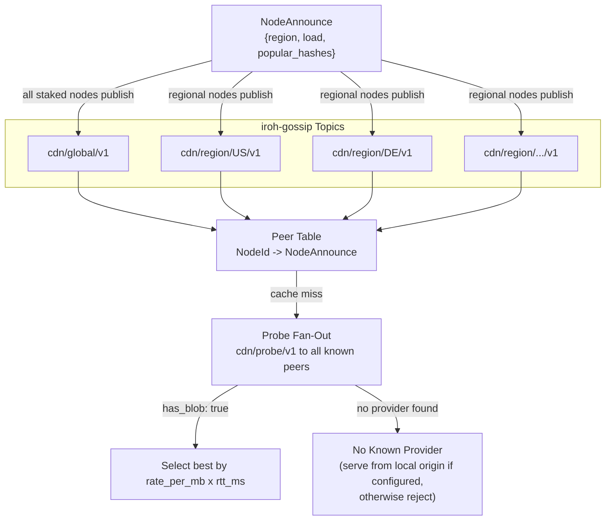

# Separated Discovery ADR Updates — Implementation Plan

> **For agentic workers:** REQUIRED SUB-SKILL: Use superpowers:subagent-driven-development (recommended) or superpowers:executing-plans to implement this plan task-by-task. Steps use checkbox (`- [ ]`) syntax for tracking.

**Goal:** Update ADRs 001, 005, 008, and `adr/architecture.md` to replace `CacheAnnounce` with `NodeAnnounce`, add probe fan-out content discovery, add dual-signal prefetching, and remove all Bloom filter / hash list / routing table references.

**Architecture:** This is a documentation-only change across four ADR files. No Rust code exists yet — the repo is in design/ADR phase. Each task updates one file, and the tasks are independent (can be executed in any order or in parallel). The spec at `docs/superpowers/specs/2026-03-30-separated-discovery-design.md` is the source of truth.

**Tech Stack:** Markdown, Mermaid diagrams

---

## File Map

| File | Action | Responsibility |
|------|--------|---------------|
| `adr/001-network.md` | Modify (lines 17–79) | Remove CacheAnnounce, Bloom filters, routing tables. Add NodeAnnounce, probe fan-out, prefetching, probe cache. Reframe DHT future work. |
| `adr/005-protocol.md` | Modify (lines 79–81) | Replace CacheAnnounce gossip section with NodeAnnounce. |
| `adr/008-reputation.md` | Modify (line 159) | Make LoadHint cross-reference concrete. |
| `adr/architecture.md` | Modify (lines 47–48, 63–69, 216–227, 336–340) | Update system diagram labels, ADR 001 summary, cache miss flowchart, prefetching section, and future work section. |

---

### Task 1: Update ADR 001 — Network Topology

**Files:**
- Modify: `adr/001-network.md`

This is the largest change. The Decision section (lines 17–48) and Consequences section (lines 52–67) need substantial rewriting. The Future Work section (lines 69–79) needs reframing.

- [ ] **Step 1: Replace the Decision section's gossip/CacheAnnounce content**

Replace lines 17–48 (from `All staked nodes form a flat peer mesh` through the end of the bullet about routing tables) with the new design. The replacement content:

```markdown
All staked nodes form a flat peer mesh with no fixed routing hierarchy. Node discovery is gossip-based; content discovery is probe-based:

#### Node Discovery (Gossip)

Nodes broadcast lightweight metadata over iroh-gossip on regional topics (`cdn/region/{cc}/v1`) and a global topic (`cdn/global/v1`). Each node publishes `NodeAnnounce` messages:

```rust
struct NodeAnnounce {
    node_id: NodeId,
    region: String,              // ISO 3166-1 alpha-2 (self-reported)
    load: LoadHint,              // approximate current utilization
    popular_hashes: Vec<Hash>,   // top-N most-requested hashes (max 20)
    timestamp: u64,              // microseconds since epoch
    signature: Signature,        // node's iroh key signs the message
}

struct LoadHint {
    active_streams: u32,         // current concurrent delivery streams
    bandwidth_utilization: u8,   // 0-100 percentage of self-reported capacity
}
```

- **`NodeAnnounce` carries node-level metadata only** — no content inventory. `popular_hashes` (capped at 20) is a popularity signal for prefetching, not a content catalog. Message size is ~700 bytes worst case.
- **`LoadHint`** makes the "approximate load in gossip announcements" from [ADR 008](008-reputation.md) section 9 concrete, feeding tie-breaking logic.
- **Announce interval** is a per-node configuration parameter (PoC default TBD during implementation).

Both clients and nodes maintain a **peer table** (`NodeId → NodeAnnounce`) built from received gossip messages. This table tracks which nodes exist and their metadata — it does not track content.

#### Content Discovery (Probe Fan-Out)

Content discovery is on-demand via the existing `cdn/probe/v1` protocol. When a node or client needs a blob, it probes known peers in parallel:

1. **Probe cache check.** Look up `hash` in a short-lived LRU cache (`hash → Vec<(NodeId, rate_per_mb, rtt)>`, TTL 30 seconds, max 1024 entries). If a valid entry exists, skip to step 4.
2. **Fan-out.** Send `ProbeRequest {hash, timestamp_us}` in parallel to all known nodes (regional + global). The `cdn/probe/v1` protocol is unchanged — `ProbeResponse {has_blob, rate_per_mb, timestamp_us, signature}`.
3. **Collect.** Wait up to 200ms. Store all `has_blob: true` responses in the probe cache.
4. **Select.** Pick the best provider by `rate_per_mb × rtt_ms` (lowest wins). Open `cdn/client/v1` stream and pull.

On probe cache hit, if the selected provider no longer has the blob (evicted since the cached probe), the node falls back to a fresh fan-out.

**Note:** The 30s probe cache TTL overlaps with ADR 005's 30-second slashing evidence window for rate manipulation. Implementation should keep the probe cache TTL shorter than the evidence window, or require a confirmation probe before committing to a paid pull from a cached entry.

#### Prefetching with Dual Signals

Two complementary signals drive proactive caching:

**Local demand signal:** Each node tracks cache miss timestamps per hash in a bounded map (`HashMap<Hash, VecDeque<u64>>`, max 10,000 entries, LRU eviction). Each miss appends a timestamp; entries older than 5 minutes are pruned on access. When a hash crosses a configurable threshold (default: 3 misses in 5 minutes), the node proactively pulls the blob via the same probe fan-out → `cdn/client/v1` path.

**Network popularity signal:** Nodes observe which hashes appear in `popular_hashes` across multiple `NodeAnnounce` messages from different peers. A hash appearing in N peers' top-20 lists suggests cross-region demand. Tracked by storing the announcing peer's NodeId and announcement timestamp for each hash; entries older than the window are pruned on access. Threshold is configurable (default: seen in 3+ peers' popular lists within 10 minutes).

Both signals feed the same action: probe fan-out → select provider → pull via `cdn/client/v1` (paid). PoC implements both signals with conservative (high) network popularity thresholds.
```

The `mermaid` diagram in the Decision section (lines 19–41) should be replaced with:



- [ ] **Step 2: Replace the PoC scale paragraph**

Replace the paragraph starting with `**PoC scale: gossip-only discovery.**` (line 45) with:

```markdown
- **PoC scale: probe fan-out discovery.** At tens of nodes, every probe fan-out reaches all peers, so content discovery has complete coverage. A probe fan-out miss (no `has_blob: true` responses) means no node in the network holds the blob. If the requesting node is itself origin-backed for that content, it serves from its own origin store; otherwise it returns an error to the client. At production scale, probe fan-out can be bounded via selective fan-out or a content-addressed DHT (see [Future Work: Scaling Content Discovery](#future-work-scaling-content-discovery) below).
```

- [ ] **Step 3: Update the cache miss paragraph**

The paragraph starting with `On a cache miss, a node probes candidates from its routing table` should be updated to:

```markdown
On a cache miss, a node checks its probe cache or performs a probe fan-out (see Content Discovery above), selects the best provider by `rate_per_mb × rtt_ms`, and pulls via `cdn/client/v1` (paid). This is the same protocol used for client→node delivery — every byte transferred in the network is paid. Origin-backed nodes typically charge more (reflecting their backend egress costs) and set the effective price ceiling. Cache-only nodes that have the blob compete at lower rates.
```

- [ ] **Step 4: Update the Consequences section**

In **Positive**, replace the bullet about `Regional gossip topics bound message volume` with:

```markdown
- Gossip messages are lightweight (~700 bytes) — no content inventories, Bloom filters, or hash lists. Regional gossip topics bound message volume: nodes in one region don't receive announcements from irrelevant regions
- Content discovery via probe fan-out eliminates stale routing table entries — every probe response is fresh
- Probe cache prevents redundant fan-outs for popular content within a 30-second window
```

In **Negative**, replace the bullets about gossip consistency, Bloom filter false positives, and self-reported region hints with:

```markdown
- Probe fan-out generates O(N) probe messages per cache miss. At PoC scale (tens of nodes) this is negligible; at production scale, fan-out must be bounded (DHT or selective fan-out)
- Cold cache miss adds ~200ms latency (probe timeout) compared to an instant routing table lookup; mitigated by probe cache for repeated lookups within 30 seconds
- Probe cache introduces a brief staleness window (up to 30s) where a node may attempt to pull from a provider that has evicted the blob; the fallback is a fresh fan-out
- `popular_hashes` in `NodeAnnounce` explicitly gossips which blobs are in high demand — a new, compactly gossiped signal distinct from content availability (which is now only probe-discoverable)
- Self-reported region hints (ISO 3166-1 alpha-2) are unverified; a node could misreport its region to appear in more gossip topics
```

Keep the bullets about every transfer being paid and origin-backed nodes being the last line of defense — those are unchanged.

- [ ] **Step 5: Rewrite the Future Work section**

Replace the `### Future Work: Content-Addressed DHT` section (lines 69–79) with:

```markdown
### Future Work: Scaling Content Discovery

At production scale (hundreds or thousands of nodes), broadcast probe fan-out becomes expensive — O(N) probes per cache miss. Three scaling strategies, in order of complexity:

1. **Selective fan-out:** Probe only regional peers + a random subset of global peers. Reduces probe count while maintaining discovery probability. No protocol changes.

2. **Content-addressed DHT:** A Kademlia overlay publishing `(hash → Vec<NodeId>)` records over iroh QUIC. Targeted O(log N) lookups replace O(N) fan-out. The probe protocol remains unchanged — DHT narrows the candidate set, probes confirm and measure.
   - iroh's built-in mainline DHT (pkarr/`DhtDiscovery`) resolves `NodeId → address` for node discovery only — it does not support arbitrary content-hash lookups. A separate content DHT overlay would be required.
   - iroh's native discovery services (DNS/pkarr) resolve `NodeId → address` without on-chain lookups and should be evaluated for production address resolution, complementing the on-chain registry which remains the authoritative source for enumerating active staked nodes.
   - As of March 2026, no existing Rust Kademlia library integrates directly with iroh's QUIC transport; implementation options include a custom Kademlia layer over iroh QUIC streams or an ALPN-identified DHT protocol.
   - State storage (in-memory vs. on-disk) and TTL policy for DHT records are deferred to the production design phase.

3. **Gossip-based content hints:** Nodes that frequently serve certain content can advertise content "categories" or prefix ranges in `NodeAnnounce`, enabling smarter probe targeting without a full DHT.

These are additive — the probe-based content discovery mechanism doesn't change, only the strategy for selecting who to probe.
```

- [ ] **Step 6: Verify the edit and commit**

Run: `cat adr/001-network.md | head -5` to verify the file starts correctly.

```bash
git add adr/001-network.md
git commit -m "docs(adr-001): replace CacheAnnounce with NodeAnnounce and probe fan-out

Remove Bloom filters, hash lists, and gossip-derived routing tables.
Add NodeAnnounce gossip, probe fan-out content discovery, probe cache,
and dual-signal prefetching. Reframe DHT future work for scaling
probe fan-out. Resolves #25."
```

---

### Task 2: Update ADR 005 — Wire Protocol

**Files:**
- Modify: `adr/005-protocol.md`

The gossip section (lines 79–81) needs updating. The rest of the protocol document is unchanged.

- [ ] **Step 1: Replace the gossip section**

Replace lines 79–81 (the `### Gossip — content availability` section) with:

```markdown
### Gossip — node metadata

Node metadata is broadcast over iroh-gossip on region-scoped topics (`cdn/region/{cc}/v1`) and a global topic (`cdn/global/v1`). All staked nodes publish `NodeAnnounce` messages containing node-level metadata: region, load hint, and a list of popular hashes (max 20). `NodeAnnounce` does not carry content inventories — content discovery is handled on-demand via `cdn/probe/v1` fan-out (see [ADR 001](001-network.md)).

Gossip messages are lightweight (~700 bytes worst case), well within iroh-gossip message limits. Clients and nodes maintain a peer table (`NodeId → NodeAnnounce`) from received messages. The probe step determines which peers hold specific content, along with their cost and latency.
```

- [ ] **Step 2: Update the ALPN table in the Decision section**

In the ALPN table (lines 16–21), change the iroh-gossip row's Purpose from:

```
| iroh-gossip built-in | all nodes | Content availability announcements, node discovery |
```

to:

```
| iroh-gossip built-in | all nodes | Node metadata announcements (`NodeAnnounce`), node discovery |
```

- [ ] **Step 3: Verify and commit**

Run: `grep -n "CacheAnnounce" adr/005-protocol.md` — should return no results.

```bash
git add adr/005-protocol.md
git commit -m "docs(adr-005): update gossip section from CacheAnnounce to NodeAnnounce

Gossip now carries node metadata (NodeAnnounce) instead of content
inventories. Content discovery handled via cdn/probe/v1 fan-out."
```

---

### Task 3: Update ADR 008 — Reputation

**Files:**
- Modify: `adr/008-reputation.md`

Minimal change — make the LoadHint cross-reference concrete.

- [ ] **Step 1: Update the tie-breaking section**

In section 9 (Tie-Breaking, line 159), the bullet `Lower current load (nodes include approximate load in gossip announcements)` should be updated to:

```markdown
1. Lower current load (from `LoadHint` in `NodeAnnounce` gossip messages — see [ADR 001](001-network.md))
```

- [ ] **Step 2: Verify and commit**

Run: `grep -n "LoadHint\|NodeAnnounce" adr/008-reputation.md` — should show the updated line.

```bash
git add adr/008-reputation.md
git commit -m "docs(adr-008): make LoadHint cross-reference to ADR 001 concrete"
```

---

### Task 4: Update Architecture Overview

**Files:**
- Modify: `adr/architecture.md`

Four areas need updating: system diagram, ADR 001 summary, cache behavior section, and future work section.

- [ ] **Step 1: Update the system diagram**

In the mermaid diagram (lines 21–49), change the gossip arrow labels from `CacheAnnounce` to `NodeAnnounce`:

```
    N1 <-.->|"iroh-gossip<br/>NodeAnnounce"| N2
    N2 <-.->|"iroh-gossip<br/>NodeAnnounce"| N3
```

- [ ] **Step 2: Update the ADR 001 summary**

Replace lines 65–69 (the ADR 001 summary paragraph) with:

```markdown
**Flat peer mesh. Gossip for node discovery, probe fan-out for content discovery (DHT deferred to post-PoC).**

All staked nodes form a flat mesh. Node metadata is broadcast over iroh-gossip on regional topics (`cdn/region/{cc}/v1`) and a global topic (`cdn/global/v1`) via lightweight `NodeAnnounce` messages (~700 bytes). Content discovery is on-demand: on a cache miss, nodes probe all known peers via `cdn/probe/v1` in parallel and select the best provider by `rate_per_mb × rtt_ms`. No content inventories are broadcast — no Bloom filters, no hash lists. The on-chain node registry is part of the `StakingRegistry` contract; the `NodeInfo` struct maps `NodeId` (ed25519 public key) to QUIC multiaddrs and Ethereum address.
```

- [ ] **Step 3: Update the ALPN table in the ADR 005 summary**

In the ADR 005 summary table (lines 101–106), change the iroh-gossip row:

From:
```
| iroh-gossip built-in | Content availability broadcast, node discovery |
```

To:
```
| iroh-gossip built-in | Node metadata broadcast (`NodeAnnounce`), node discovery |
```

- [ ] **Step 4: Update the Cache Behavior section**

In the description paragraph before the cache miss flowchart (line 50–51), update the text:

From:
```markdown
Clients probe candidate nodes, pick the best by `rate_per_mb × rtt_ms`, stream over `cdn/client/v1`, and pay via off-chain USDC vouchers. On a cache miss, a node pulls from another node that has the blob (paid via `cdn/client/v1`) and caches locally. Every byte delivered — whether client→node or node→node — is paid.
```

To:
```markdown
Clients probe candidate nodes, pick the best by `rate_per_mb × rtt_ms`, stream over `cdn/client/v1`, and pay via off-chain USDC vouchers. On a cache miss, a node discovers providers via probe fan-out (`cdn/probe/v1` to all known peers), selects the best, and pulls via `cdn/client/v1` (paid). Every byte delivered — whether client→node or node→node — is paid.
```

- [ ] **Step 5: Update the Prefetching paragraph**

In the Cache Behavior section, replace the Prefetching paragraph (line 224–225):

From:
```markdown
**Prefetching:** Nodes can proactively cache popular content by paying to pull it from other nodes. Popularity signals come from gossip (if multiple nodes announce a blob, it is popular). All prefetch pulls are paid via `cdn/client/v1`.
```

To:
```markdown
**Prefetching:** Nodes can proactively cache popular content using two signals: (1) local demand — tracking cache miss frequency per hash and prefetching when a threshold is crossed (default: 3 misses in 5 minutes); (2) network popularity — observing which hashes appear in multiple peers' `popular_hashes` fields in `NodeAnnounce` gossip messages (default threshold: 3+ peers within 10 minutes). All prefetch pulls use the same probe fan-out → `cdn/client/v1` path (paid).
```

- [ ] **Step 6: Update the Future Work section**

Replace the Future Work: Search & Discovery section (lines 336–340):

From:
```markdown
## Future Work: Search & Discovery

Not in PoC scope. The planned approach for the next phase:

Dedicated **indexer nodes** subscribe to the gossip topic, build a searchable index of content metadata (via `tantivy` or equivalent), and expose a query API on a custom ALPN (`cdn/search/v1`). Multiple independent indexers can coexist. Clients pay per query via the same payment channel mechanism. Indexers register in the `StakingRegistry` and are slashable for fabricated results.

During PoC (before indexers exist), clients use the full-table gossip approach: every node holds the complete content routing table. The migration to indexers is additive — they subscribe to the same gossip topic.
```

To:
```markdown
## Future Work: Search & Discovery

Not in PoC scope. The planned approach for the next phase:

Dedicated **indexer nodes** subscribe to gossip topics and observe probe traffic to build a searchable index of content metadata (via `tantivy` or equivalent), exposing a query API on a custom ALPN (`cdn/search/v1`). Multiple independent indexers can coexist. Clients pay per query via the same payment channel mechanism. Indexers register in the `StakingRegistry` and are slashable for fabricated results.

During PoC (before indexers exist), content discovery uses probe fan-out — every cache miss probes all known peers via `cdn/probe/v1`. At PoC scale (tens of nodes), this provides complete coverage. The migration to indexers or DHT-based discovery is additive — probe fan-out remains the fallback.
```

- [ ] **Step 7: Verify no stale references remain and commit**

Run: `grep -n "CacheAnnounce\|routing table\|hash list\|Bloom filter" adr/architecture.md` — should return no results (or only results in the "Considered Alternatives" section, which is historical).

```bash
git add adr/architecture.md
git commit -m "docs(architecture): update for separated node/content discovery

Replace CacheAnnounce with NodeAnnounce in system diagram and ADR
summaries. Update cache miss flow to probe fan-out model. Update
prefetching to dual-signal model. Update future work section."
```

---

### Task 5: Final Verification

**Files:**
- All four modified files

- [ ] **Step 1: Check for stale CacheAnnounce references across all ADRs**

Run: `grep -rn "CacheAnnounce" adr/`

Expected: No results. If any remain, they are missed edits — go back and fix.

- [ ] **Step 2: Check for stale "routing table" references**

Run: `grep -rn "routing table" adr/`

Expected: No results referring to `hash → Vec<NodeId>` routing tables. References to "peer table" (`NodeId → NodeAnnounce`) are correct. Any remaining "routing table" references in unchanged ADRs (003, 004, etc.) should be checked for context — they may refer to the concept generally and not need updating.

- [ ] **Step 3: Check for stale Bloom filter references**

Run: `grep -rn "Bloom filter\|bloom_filter" adr/`

Expected: No results. The Bloom filter concept is fully removed from the design.

- [ ] **Step 4: Verify mermaid diagrams render**

Skim `adr/001-network.md` and `adr/architecture.md` mermaid blocks for syntax correctness (matching braces, valid node IDs, proper arrow syntax).

- [ ] **Step 5: Final commit if any fixes were needed**

If steps 1–4 found issues and edits were made:

```bash
git add adr/
git commit -m "docs: fix remaining stale references from CacheAnnounce migration"
```
