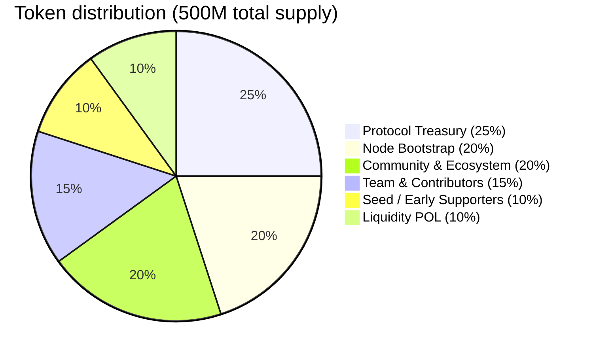
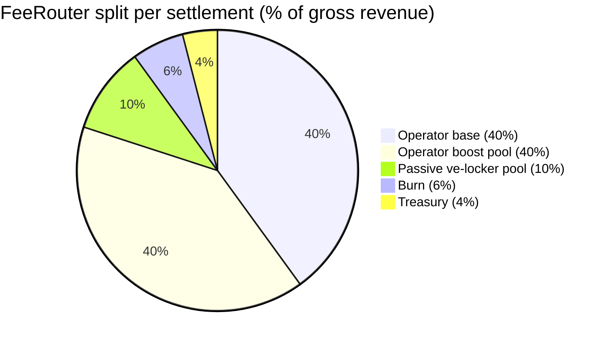
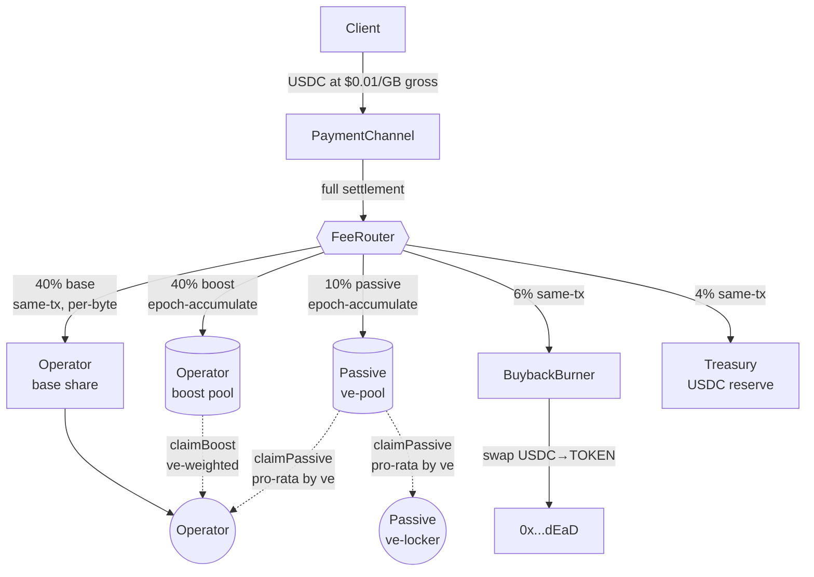
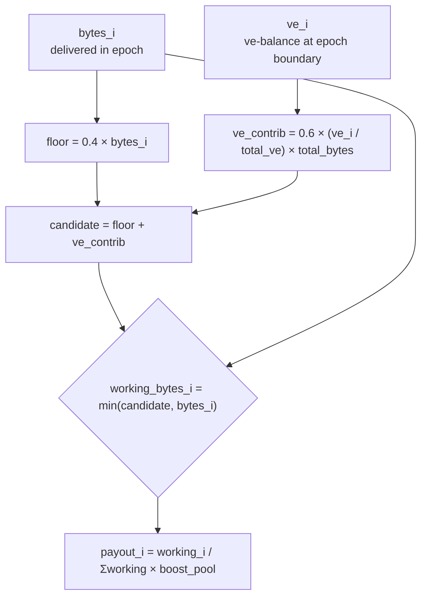
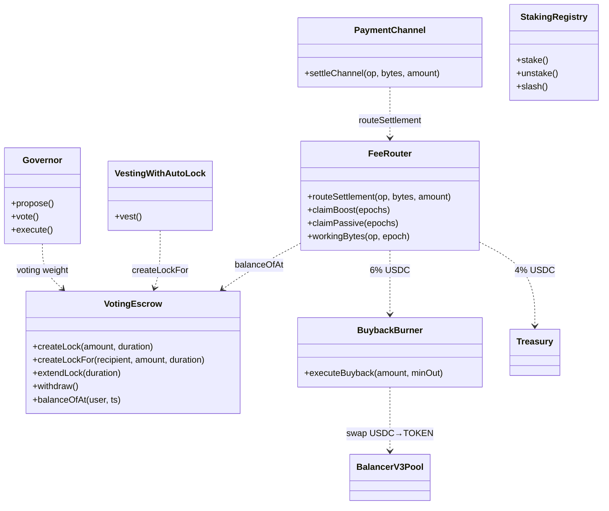
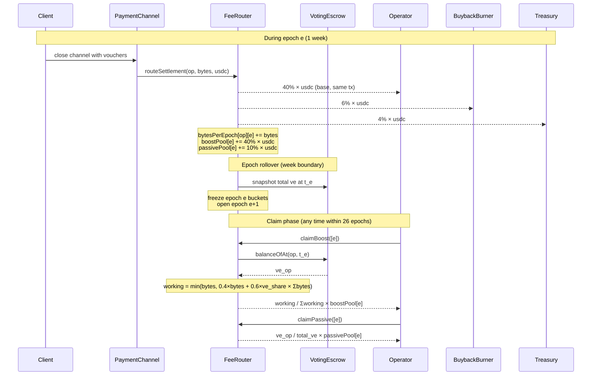
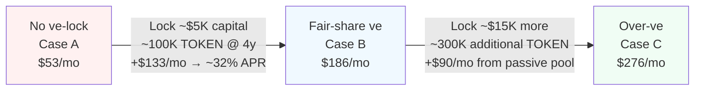

# Tokenomics v2 — gauge-boost variant (40/40/10/6/4)

**Date:** 2026-04-18
**Status:** Design spec (alternative to `2026-04-18-tokenomics-v2-design.md`)
**Relationship to sibling spec:** Both specs inherit the same supply design (500M total, 6y vest + auto-ve-lock), `VotingEscrow` mechanics, governance model, and ADR supersession plan. This spec differs **only in the FeeRouter split and distribution mechanics**: where T2b pays a flat 80% to operators regardless of ve-lock status, this variant splits operator compensation into a 40% flat baseline and a 40% ve-weighted boost pool, using Curve's proven veCRV + gauge-boost formula.
**If adopted:** supersedes T2b. If not, T2b remains the reference design.

---

## 1. Problem

ADR 004's structural weaknesses, as characterized in the T2b spec, apply identically here (burn flow ~0.014%/yr, no yield to token holders, regressive discount, treasury hoards USDC).

**Additional weakness this spec addresses beyond T2b:** ve-lock adoption is weak under flat-share models. In T2b, operators have no direct economic reason to ve-lock — their 80% operator share is paid regardless of whether they ve-lock, and the only ve-lock incentive is the 10% passive pool (thin). Most operators will rationally skip ve-locking unless the pool yield is compelling at their scale, which it isn't at early/mid production.

The gauge-boost mechanism creates a **direct operator-compensation link to ve-lock commitment**: operators who ve-lock earn materially more than operators who don't, *without* changing total operator-bucket compensation in aggregate. This drives ve-adoption by operators without mandatory TOKEN exposure or cashflow risk.

---

## 2. Design

### 2.1 Supply & distribution

**Identical to T2b spec §2.1.** 500M fixed supply, allocation percentages preserved, 6-year vests, auto-ve-lock on vest (1–2y per bucket), bootstrap subsidies auto-ve-lock for 1y. Effective circulating-supply growth rate ~12.5%/yr during the active vesting window. See T2b spec §2.1 for the full table.

### 2.2 Fee router with gauge boost

New contract: `FeeRouter`. Replaces ADR 003's settlement-fee-skim pattern.

**Flow per channel settlement:**

1. Channel closes → full USDC channel balance transfers to `FeeRouter`.
2. Router allocates the settlement into five buckets: 40% operator base / 40% operator boost pool / 10% passive ve-locker pool / 6% BuybackBurner / 4% treasury.
3. Operator's 40% base is transferred to their address in the same transaction.
4. Operator's boost-pool contribution and the passive ve-locker pool accumulate per epoch (1 week); both distribute pro-rata at epoch rollover (pull-claim; see 2.2.4).
5. BuybackBurner receives its 6% in the settlement transaction; treasury receives its 4% in the settlement transaction.

**Node-to-node cache-miss paid pulls bypass the router.** Direct peer USDC payment, no skim. Rationale: internal cost recovery, not net revenue.

#### 2.2.1 Split table

| Destination | % | Distribution mechanic |
|---|---|---|
| Operator base | 40% | Direct USDC, same-tx, per-byte proportional |
| Operator boost pool | 40% | Accumulated per epoch; distributed to operators pro-rata by `working_bytes` (ve-weighted) |
| Passive ve-locker pool | 10% | Accumulated per epoch; distributed pro-rata by ve-balance snapshot at epoch boundary |
| BuybackBurner | 6% | Direct USDC, same-tx, burn flow (ADR 018 mechanics unchanged) |
| Treasury | 4% | Direct USDC, same-tx, Timelock-custodied wallet |

**Total operator compensation in aggregate = 80%.** The split is purely a *redistribution* of the operator bucket based on ve-commitment — operators-collective-earnings equal T2b; individual earnings depend on lock posture.

**Rate mechanics.** Per-MB rates are operator-set via probe responses (ADR 003 unchanged). Gross client rate is expected to stay at **$0.01/GB — parity with Bunny.net's budget tier** and 7–20× cheaper than major CDNs. The router's 20% aggregate skim (40% base excluded from the 40% boost + 10% passive + 6% burn + 4% treasury) is absorbed by operator net revenue, not passed to clients. This keeps deCDN at the budget-CDN price point, preserving the "drop-in replacement" positioning in ADR 004. Operators compensate for the USDC margin compression through the boost-pool yield (Case B/C below), bootstrap subsidies, and TOKEN-economy exposure — the design explicitly shifts a portion of operator compensation from USDC to TOKEN-economy value.

#### 2.2.2 Gauge boost formula

Based on Curve Finance's veCRV gauge boost (in production since 2020, ~$2B TVL across gauges). Adapted from "LP deposit + ve-share" to "bytes delivered + ve-share."

For each operator `i` in epoch `e`:

```
bytes_i            = bytes delivered by operator i in epoch e
total_bytes        = sum of bytes delivered by all operators in epoch e
ve_i               = operator i's ve-balance at epoch boundary
total_ve           = total ve-balance across all lockers at epoch boundary

working_bytes_i    = min(
                       bytes_i,
                       0.4 × bytes_i + 0.6 × (ve_i / total_ve) × total_bytes
                     )

boost_share_i      = working_bytes_i / sum(working_bytes)
boost_payout_i     = boost_share_i × boost_pool_usdc_for_epoch_e
```

**Properties:**

- Operator with **zero ve-lock**: `working = 0.4 × bytes` → receives 40% of what they'd get if ve-share matched bytes-share. Baseline for commodity operators.
- Operator with **"fair-share" ve** (ve-fraction ≥ byte-fraction): `working = bytes` → receives their proportional share without discount. Optimal effective position.
- Operator with **more ve than fair-share**: `working` capped at `bytes` → no over-boost. Extra ve-balance overflow earns zero additional operator-pool yield (but still earns from the 10% passive pool).
- **Max boost vs no boost = 1 : 0.4 = 2.5×.**

**Why the Curve formula is preferred over simpler multipliers:**

- *Simpler* `boost = 1 + k × ve_i` mechanics produce unbounded boost for whales and over-reward thin operators with large locks.
- Curve's formula is bounded by `bytes` (you can't earn more than your work justifies), preventing attacks where an operator ve-locks enormous amounts but delivers minimal bytes.
- Fair-share normalization (`ve_share = byte_share` → working = bytes) means the pool naturally distributes proportionally when everyone has "matched" their ve to their delivery volume — the system converges to a stable equilibrium.

#### 2.2.3 Governable split parameters (within hard-coded safety bounds)

| Parameter | Default | Min | Max |
|---|---|---|---|
| Operator base share | 40% | 20% | 80% |
| Operator boost share | 40% | 0% | 60% |
| Passive ve-locker share | 10% | 0% | 30% |
| Burn share | 6% | 0% | 25% |
| Treasury share | 4% | 0% | 20% |

Shares must sum to 100% on any update. The minimum on operator-base (20%) guarantees operators always receive liquid USDC sufficient to cover at least a meaningful fraction of infra costs even under extreme governance proposals. Governance changes gated by 48h timelock (ADR 009).

**Boost curve parameter (`boostFloor = 0.4`)** is also governable within bounds `[0.2, 0.8]`. Lower `boostFloor` = harsher penalty for non-lockers / higher max boost ratio; higher `boostFloor` = gentler differentiation.

#### 2.2.4 Epoch mechanics

- Epoch length: 1 week (7 × 86400 seconds, block-timestamp-aligned).
- Router accumulates USDC in per-epoch buckets for both the **operator boost pool** and the **passive ve-locker pool**.
- At epoch rollover: both buckets freeze; new buckets start; per-operator `bytes_delivered` counters reset.
- ve-balance snapshots taken at the epoch-boundary timestamp using `VotingEscrow.balanceOfAt(user, ts)`.
- Distribution: pull-based. Operators call `FeeRouter.claimBoost(epochs[])` for boost-pool shares; any ve-locker calls `FeeRouter.claimPassive(epochs[])` for passive-pool shares. Each call transfers USDC and marks the epochs claimed.
- Claim window: 26 epochs (~6 months). Unclaimed allocations sweep to treasury.

**Per-epoch operator accounting.** The router tracks `bytes_delivered_this_epoch[operator]` on every settlement. On claim, `working_bytes_i` is computed from the stored byte count + the ve-balance snapshot, then the pro-rata share is transferred.

### 2.3 Voting escrow (`VotingEscrow`)

**Identical to T2b spec §2.3.** Non-transferable ve-positions, 1 week to 4 years lock, linear decay, no early exit, historical checkpointing via `balanceOfAt`. See T2b spec §2.3 for the full parameter table.

**Additional consideration for this variant.** Operators will typically hold ve-positions to capture the boost. Operator ve-positions behave identically to passive ve-positions in the contract — same lock, same decay, same slashing-immunity (operator stake in `StakingRegistry` is slashable; operator ve-positions in `VotingEscrow` are not). An operator may have any combination of stake and ve.

### 2.4 Operator economics

**Stake (from branch `claude/review-adrs-unmetered-nodes-gmFkQ`):** Min 10K TOKEN, slashable, 7-day unbonding. Discount-stake threshold of 100K TOKEN is vestigial under this spec (fee discount mechanic removed).

**Revenue streams:**

1. **40% of every channel settlement** (base) — direct USDC, same-tx, per-byte proportional.
2. **Share of the 40% operator boost pool** — USDC, weekly epoch distribution, weighted by `working_bytes` (bytes × ve-boost). Non-ve-lockers receive ~40% of the "fair" share of this pool; max-ve-lockers receive 100% of their fair share (2.5× more per byte than non-lockers).
3. **Optional passive ve-locker pool yield** — USDC on any TOKEN they ve-lock, distributed pro-rata by ve-balance. Same mechanic for operators and passive holders; disjoint from the boost pool.

**Sample P&L — 1 Gbps node at 30K GB/mo, gross rate $0.01/GB (parity with Bunny.net).**

Three operator profiles shown. Network assumption: 1,000 operators × 30K GB/mo average (total 30M GB/mo). 500 operators at "fair-share ve" (their ve-share equals their byte-share), 500 with zero ve-lock. Passive ve-lockers collectively hold as much veTOKEN as the operator pool, so total_ve ≈ 2 × operator_ve.

Under these assumptions:

- Per-operator byte-share: 0.1%
- "Fair-share ve" for an operator: ve-balance = 0.1% of total_ve
- Total working-bytes (Curve formula): 500 × 12K + 500 × 30K = 21M
- Boost pool (40% × $300K) = $120K/mo
- Passive pool (10% × $300K) = $30K/mo

```
Case A — No ve-lock (commodity operator):
  working = 0.4 × 30K = 12K; share = 12K/21M = 0.057%
  Gross revenue per month:                $300
  Router → operator base (40%):           $120
  Router → boost-pool share:              $68    (0.057% of $120K)
  Router → passive-pool share:            $0     (no ve-lock)
  Cache-miss paid pulls (15%):           −$45
  Infrastructure (mid):                  −$90
  ─────────────────────────────────────
  Net P&L:                                $53    ← 50% below T2b baseline ($105)

Case B — Fair-share ve-lock (~100K TOKEN @ 4y lock, ~$5K capital @ $0.05):
  working = 30K (ve-share ≥ byte-share → boost cap reached); share = 30K/21M = 0.143%
  Gross revenue per month:                $300
  Router → operator base (40%):           $120
  Router → boost-pool share:              $171   (0.143% of $120K)
  Router → passive-pool share:            $30    (0.1% of $30K)
  Cache-miss paid pulls (15%):           −$45
  Infrastructure (mid):                  −$90
  ─────────────────────────────────────
  Net P&L:                                $186   ← 77% above T2b baseline

Case C — Over-ve (~400K TOKEN @ 4y lock, ~$20K capital @ $0.05):
  working = 30K (capped at bytes — no over-boost for the boost-pool)
  Gross revenue per month:                $300
  Router → operator base (40%):           $120
  Router → boost-pool share:              $171   (same as Case B; cap binds)
  Router → passive-pool share:            $120   (0.4% of $30K; overflow ve earns here)
  Cache-miss paid pulls (15%):           −$45
  Infrastructure (mid):                  −$90
  ─────────────────────────────────────
  Net P&L:                                $276   ← 163% above T2b baseline
```

**Observations:**

- **Case A runs thin margins — ~$53/mo at 30K GB/mo.** Commodity operators below 40K GB/mo will struggle without ve-committing. This is the designed incentive pressure; the floor is that it's still positive (not loss-making).
- **Case B captures strong value from a modest ve-lock.** Going from Case A to Case B costs ~$5K capital (~100K TOKEN at $0.05) and gains +$133/mo (+$1,596/yr USDC). That's **~32% APR on the ve-locked capital** in USDC terms before counting TOKEN appreciation. Payback on the lock capital from boost-delta alone: ~3.1 years — meaningful and practical for a 4y lock (especially if TOKEN appreciates over the lock period).
- **Case C shows where the cap binds.** Beyond fair-share ve, boost-pool earnings are flat (boost caps at `bytes`), but passive-pool earnings continue to grow linearly with ve-balance. Over-locking is rational for long-term holders but offers diminishing marginal returns from the boost mechanism.
- **Aggregate operator revenue = 80% of network revenue**, identical to T2b. The total amount paid to operators is unchanged; this spec is pure redistribution plus an additional passive-pool share for operators who ve-lock.
- **Gross client rate $0.01/GB — at parity with Bunny.net.** No deCDN-specific premium; preserves budget-CDN positioning. Operators absorb the router skim via thinner USDC margins, compensated through boost-pool and TOKEN-economy value accrual.

**Market dynamics.** Case A operators underperform Case B by ~$133/mo at baseline — strong incentive to ve-lock for capital-available operators. Capital-constrained operators accept Case A or exit (designed filter). The network likely converges to a steady state where most committed operators hold at least fair-share ve — matching the Curve gauge model's intended equilibrium. The ~32% USDC APR on locked capital (before TOKEN appreciation) is strong enough to sustain adoption without creating runaway whale dynamics; the boost cap enforces that.

**Fee discount mechanic — removed.** Replaced structurally by the gauge boost: operators who want more return from their capital ve-lock and earn a larger boost-pool share, rather than paying lower fees. Simpler, non-regressive, and the core incentive loop that this spec is designed around.

### 2.5 Governance

**Identical to T2b spec §2.5.** ve-weighted voting, 0.1% proposal threshold, 4% quorum, 7-day voting, 48h timelock, Governor Bravo delegation. See T2b spec §2.5.

### 2.6 Slashing & burn

**Slashing schedule unchanged** from ADR 004 (branch version): 5%/15%/50% escalation, 50/50 burn/challenger, lifetime counter, auto-ejection.

**Buyback-and-burn inflow rate.** 6% of fee inflow → `BuybackBurner` (vs. ADR 004's 20% × 3% = 0.6% effective — a 10× increase in USDC flow per unit network revenue).

**Mature-scale burn estimate:**

- 1,000 nodes × 30K GB/mo × $0.01/GB = $300K/mo gross revenue
- Burn inflow: 6% × $300K = **$18K/mo USDC = $216K/yr**
- At $0.05 TOKEN: 4.32M TOKEN burned/yr = **0.86%/yr of 500M supply**

**Scaling behavior.** Identical to T2b — burn USDC flow scales linearly with revenue; TOKEN-denominated burn scales with revenue and inversely with TOKEN price. The gauge-boost split does not affect the 6% burn share.

---

## 3. Key invariants

1. **Router split shares sum to 100%.** Enforced on-chain at every governance update.
2. **Aggregate operator compensation = 80% of revenue.** Split into 40% direct + 40% boost pool; invariant against boost-parameter changes to the two operator buckets' sum.
3. **Boost cap: `working_bytes_i ≤ bytes_i`.** No operator receives more boost-pool share than their byte-delivery share would command at "fair" ve-ownership. Prevents whale-capture of the boost pool.
4. **Boost floor: `boostFloor ∈ [0.2, 0.8]`.** Non-ve-lockers always receive a substantial fraction of their byte-proportional share — not zero, never less than 20%.
5. **ve-locked TOKEN is never slashable.** Unchanged from T2b.
6. **No early exit from ve-locks.** Unchanged from T2b.
7. **Auto-ve-lock is atomic with vesting.** Unchanged from T2b.
8. **Fixed supply, no minting.** 500M at genesis.
9. **Node-to-node cache-miss pulls bypass the router.** Unchanged from T2b.
10. **Operator's 40% base share is paid in the same transaction as settlement.** No claim step required for the base; claims are only required for boost-pool and passive-pool shares.
11. **Boost-pool and passive-pool shares are distributed pull-based**, with a 26-epoch claim window; unclaimed allocations sweep to treasury.
12. **Operator's per-epoch `bytes_delivered` counter resets at epoch rollover.** Prior epochs' bytes do not accumulate into boost calculations.
13. **ve-balance snapshot for an epoch is taken at the epoch-boundary timestamp.** Late-epoch ve-lockups earn from the next epoch only.

---

## 4. Supersession plan

This spec will be promoted to **ADR 025** after user review, in place of (or alongside, depending on user decision) the sibling T2b spec.

ADRs affected on acceptance: identical list to T2b (ADRs 003, 004, 009, 018, 019, `finance/params.py`, notebooks). The only differences from T2b's supersession plan are in the `FeeRouter` interface (adds boost-pool accounting and the `claimBoost(epochs[])` method) and ADR 009's safety-bounds table (adds `boostFloor` bound and modifies operator-share bounds).

See T2b spec §4 for the full artifact table.

---

## 5. New contracts

- **`FeeRouter`** — as in T2b spec §5, with these additions:
  - Per-epoch `bytes_delivered[operator]` counters, reset at epoch rollover.
  - Separate per-epoch USDC buckets for operator-boost-pool and passive-ve-pool (previously one).
  - Two distinct claim methods: `claimBoost(epochs[])` for operators (computes `working_bytes` on-demand using stored byte counters and snapshotted ve-balances); `claimPassive(epochs[])` for ve-lockers.
  - Getter: `workingBytes(operator, epoch)` for external reporting / UX.
- **`VotingEscrow`** — identical to T2b spec §5.
- **`VestingWithAutoLock`** — identical to T2b spec §5.
- **`BuybackBurner`** — unchanged from ADR 018, receiving 6% inflow.

Modified contracts:

- **`PaymentChannel`** — as in T2b spec §5, now calls `FeeRouter.routeSettlement(operator, bytesDelivered, amount)` — note the added `bytesDelivered` parameter (required for per-operator byte-accumulator tracking in the boost pool). Settlement currently carries aggregated voucher data; byte counts can be computed from voucher claims (vouchers are denominated in MB per ADR 003).
- **`StakingRegistry`** — as in T2b spec §5.
- **`Governor`** — as in T2b spec §5.

---

## 6. Consequences

### Positive

- **Operator-driven ve-lock adoption.** Case B (fair-share lock) materially out-earns Case A (no lock) — operators have a direct, persistent economic reason to ve-lock that doesn't exist under T2b. Likely drives ve-supply locked to 30–50% of total supply at steady state (matching Curve's 40–60% veCRV lock rate).
- **Stronger TOKEN demand loop.** Operators who ve-lock to capture boost buy TOKEN from market → supply sink grows → price appreciation → ve-position value appreciates → cycle reinforces. Does *not* require protocol to mandate operator TOKEN exposure.
- **Proven model.** Curve's gauge + veCRV system has operated for 4+ years with billions in TVL. Attack surface and game theory are well-studied; several reference implementations are open-source and auditable.
- **Self-selecting operator tiers.** Commodity operators (Case A) stay viable but earn less; committed operators (Case B/C) earn significantly more. The market sorts operators into tiers without protocol-enforced segmentation.
- **No cashflow crisis.** Unlike the "mandatory 40% vesting" variant (V1 in the brainstorm), operators still receive 40% liquid USDC per settlement — sufficient to pay infrastructure costs on a 1 Gbps node at 30K GB/mo (Case A P&L is positive).
- **Aggregate distribution identical to T2b.** Total burn, ve-pool, and treasury flows unchanged per unit revenue. All T2b burn-flow and yield estimates carry over.
- **No gross-rate blowup.** Gross rate stays at $0.01/GB — identical to T2b, at parity with Bunny.net. No deCDN-specific premium at the client-facing layer.

### Negative

- **Higher contract complexity than T2b.** `FeeRouter` needs per-epoch byte counters, working-balance math on claim, and two distinct claim flows. Still tractable; Curve's implementation is a reference.
- **Per-epoch byte accounting adds gas.** Every settlement increments an operator's byte counter — 5K–15K gas on top of the existing router forwarding. Minor but non-zero.
- **Case A operators may exit.** Commodity operators who won't ve-lock see lower margins. They may leave or never onboard. This is the *intended* pressure, but the failure mode is under-supply of operators. Needs monitoring during early production.
- **Cold-start problem.** A brand-new operator has no ve-lock and no byte history; their first epoch earns only Case-A-level boost. They can build up by acquiring and locking TOKEN, but this is a capital barrier for small operators.
- **Byte-counter manipulation risk.** An operator could theoretically induce noise settlements (self-generated traffic) to inflate their byte counter in a given epoch. Mitigation: settlements cost gas ($0.08 per per ADR 004) and the challenge bond applies to fraud — so the attack has nontrivial cost. Watchtower observation would detect patterns. This is a secondary attack vector that warrants monitoring but is not uniquely enabled by this spec.
- **Governance-weight concentration risk.** Operators who lock heavily for boost also accumulate disproportionate governance weight. Half of the ve-supply may end up held by ~100 large operators. Mitigation: ADR 009 safety bounds prevent extreme governance abuse; the team/seed/treasury auto-ve-lock supply acts as a counterweight during the first 2 years.
- **More load-bearing math.** The Curve formula is not intuitive to casual readers. Documentation, UI, and client-side tooling need to expose "your boost factor" clearly so operators can make informed lock decisions. UX burden.

### Risks

- **Equilibrium fragility.** The Curve-style model converges to a stable equilibrium *if* the boost is valuable enough to lock for but not so valuable that a winner-take-all dynamic emerges. If the boost-pool is too small relative to operating revenue, operators won't bother ve-locking (falls back to T2b-like behavior). If it's too large, only whale operators can afford the "fair-share" threshold, squeezing out small operators. The 40% boost pool default is sized intentionally in the middle; production tuning may be needed.
- **Reflexive bootstrap intensified (same as T2b).** TOKEN price drop → ve-lock value drops → Case B margins decrease → operators may unwind commitment → further price pressure. Same reflexivity as T2b, but with stronger ve-adoption, potentially more acute since more operator compensation is tied to TOKEN price.
- **ve-locker pool fragmentation.** The 10% passive pool serves non-operator holders but may be thin relative to the 40% boost pool. Same absolute size as T2b's ve-pool (10% of $300K = $30K/mo). Keeping the passive pool at 10% preserves passive-holder incentive to ve-lock without being their primary motivation.

---

## 7. Open questions

1. **Boost-pool size tuning.** The 40/40 operator split (base/boost) is a reasoned default. Production data should inform whether 50/30 (larger base, smaller boost) or 30/50 (smaller base, larger boost) works better. `boostFloor` tuning likewise.
2. **Boost formula parameterization vs. Curve defaults.** Curve uses `(0.4, 0.6)` for the "stability floor" and "ve-weight" terms. Whether these should be tunable per-protocol or hardcoded is a governance design choice. Default: tunable within `[0.2, 0.8]` safety bounds.
3. **Bootstrap-phase operator handling.** During early production, ve-supply is thin (maybe 5% of total locked). Early operators may capture huge boost-pool shares from modest ve-locks. Should the boost-pool be *scaled down* in early epochs (e.g., unlocked pool flows to burn/treasury until lock rate reaches a threshold)? Defer to implementation.
4. **Cold-start fairness.** Should new operators receive a one-time ve-equivalent grant to avoid the Case-A cold-start penalty? Could be funded from bootstrap subsidies. Product/UX concern.
5. **Byte-counter manipulation watchtower.** Is an off-chain monitoring service needed to detect self-settlement patterns? Defer to watchtower ADR (007).
6. **Operator withdrawal UX.** Operators must call `claimBoost(epochs[])` to receive boost-pool share. Batching across multiple epochs is supported; frequency-vs-gas tradeoff is operator choice. Should the protocol auto-claim for operators via a keeper? Nice-to-have.
7. **Per-operator gas overhead.** Per-settlement byte-counter increment adds ~5K–15K gas. At 100K settlements/year for a medium operator, that's $8–$1500/yr at typical L2 gas prices. Acceptable but worth measuring.
8. **Governance of `boostFloor`.** A low value encourages ve-locking (harsh penalty for non-lockers) but may scare off commodity operators. A high value is operator-friendly but weakens the mechanism. Default 0.4 matches Curve; other values defensible.

---

## 8. Acceptance criteria for implementation

1. `FeeRouter`, `VotingEscrow`, `VestingWithAutoLock` are deployed, unit-tested, and integration-tested against a local fork of the canonical L2 (per [ADR 021](../../../adr/021-l2-chain-selection.md)) with representative channel-settlement load.
2. `PaymentChannel.settleChannel` routes to `FeeRouter.routeSettlement(operator, bytesDelivered, amount)` in a single transaction; operator receives 40% base in the same tx.
3. Per-epoch `bytes_delivered[operator]` is correctly accumulated; resets at epoch rollover.
4. `claimBoost(epochs[])` correctly computes `working_bytes` using the Curve formula and snapshotted ve-balance; payout matches expected share.
5. Boost cap is enforced: no operator receives more than their fair-share (`working ≤ bytes`) regardless of ve-position size.
6. `claimPassive(epochs[])` correctly distributes the 10% pool pro-rata by ve-balance snapshot.
7. Unclaimed epochs past 26-week window sweep to treasury.
8. Governance change to router splits requires 48h timelock; share bounds and `boostFloor` bounds are enforced.
9. Vesting contracts call `VotingEscrow.create_lock_for` atomically; no unlocked TOKEN path exists.
10. Governor uses `VotingEscrow.balanceOfAt` for voting weight.
11. ADRs 003, 004, 009, 018, 019 updated per §4.
12. `finance/notebooks/_shared/params.py` extended with boost parameters; new notebook `10_gauge_model.ipynb` added with Case A/B/C simulations; existing notebooks updated where affected.
13. Invariants in §3 are enforced either by contract code or explicit runtime assertions in tests.
14. Integration test: a mixed-operator network (50% Case A, 50% Case B) distributes the 40% boost pool in the expected ~1:2.5 ratio per byte.

---

## 9. Visual reference

### 9.1 Token distribution (500M total)



### 9.2 FeeRouter split per settlement



### 9.3 FeeRouter flow



### 9.4 Gauge boost formula (per operator, per epoch)



Properties illustrated by the formula:

- **No ve-lock** → `candidate = 0.4 × bytes_i` → working = 0.4 × bytes (worst case, 40% of fair share).
- **Fair-share ve** (ve_i / total_ve = bytes_i / total_bytes) → `candidate = bytes_i` → working = bytes (cap binds exactly).
- **Over-ve** (ve_share > bytes_share) → `candidate > bytes_i` → working = bytes (cap binds; over-ve earns no extra boost but does earn from passive pool).
- Max boost ratio between max-ve-locker and zero-ve-locker: **1 / 0.4 = 2.5×**.

### 9.5 Contract architecture



StakingRegistry is drawn unconnected because it is independent of the fee-router path — it governs slashable stake and is read by gossip/peer-validation logic (ADR 001, ADR 003) rather than by FeeRouter.

### 9.6 Epoch lifecycle



### 9.7 Operator P&L across ve-lock profiles



Arrows indicate incremental decisions. Case B's payback period on incremental capital: ~3.1 years. Case C provides diminishing marginal returns from the boost pool (capped) but continued linear yield from the passive pool.

---

**End of spec.**
